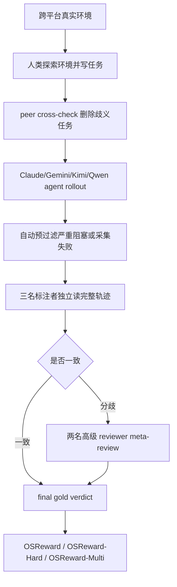
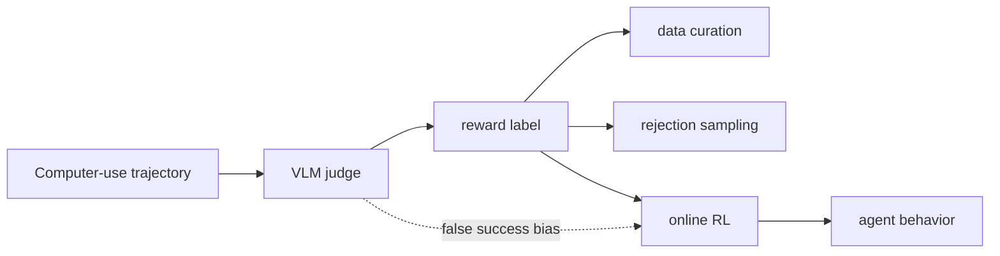

# OSReward：把 Computer-Use Agent 的“奖励信号”先拿来审计

### 元信息与 TL;DR

- **论文**：OSReward: Instituting Standardized Evaluation for Cross-Platform Computer-Use Reward Models
- **类别**：大模型后训练 / Computer-Use Agent / Reward Model 评测
- **原文**：https://arxiv.org/abs/2607.28609v1
- **项目页**：https://os-copilot.github.io/OSReward-Home/
- **发布时间**：2026-07-30 17:57:41 UTC
- **核心对象**：CUA trajectory judge，也就是给浏览器、桌面、移动端、Ubuntu 等 computer-using agent 轨迹判断“任务是否真的完成”的模型化奖励信号。

**TL;DR：**

1. 这篇论文不是又做一个 computer-use agent benchmark，而是先审计“谁来判定 agent 成功”的奖励模型。作者指出，CUA 轨迹由截图、动作、思考文本和环境状态交织组成；如果 judge 把失败轨迹判成成功，后续评测、数据筛选和强化学习都会把错误行为当作正样本。
2. OSReward 构造了 **1,019 条 human-gold 跨平台轨迹**，覆盖 Web、Windows、Ubuntu、Mobile；每条轨迹来自 Claude、Gemini、Kimi、Qwen 等 agent backbone 的实际执行，并经三名标注者独立判断，分歧再进入两名高级 reviewer 的 meta-review。
3. 作者进一步拆出 **284 条 OSReward-Hard**，主要来自标注者发生分歧、但经复核确认的困难样本；Hard 集故意提高失败样本比例到约 70%，目标是暴露模型 judge 最危险的 false-success 倾向。
4. 对 **27 个 VLM judge** 的固定协议评测显示：全量集上 frontier 模型接近 90% binary accuracy，但 Hard 集上最佳 judge 低于 70%，平均 judge 约 52%；主要错误是把未完成任务判成成功，这类错误占全部错误约三分之二，并且 over-accept 比 over-reject 多三倍以上。
5. 一个关键反直觉结果是：judge 的判定更多来自 agent 的思考与动作文本，而不是截图。移除 step-level thought/action 文本平均损失 **7.2 pp** accuracy，并翻转 **22.7%** 个体 verdict；而视觉输入设置改变对 aggregate accuracy 影响很小，但仍会翻转 5-7% 单条标签。
6. 作者用这些发现构造 OS-Shepherd-100K：从 **321,631 个 judge instances** 中通过强 judge ensemble、高一致性过滤、不同截图设置与输出格式保留 **96.6K** agreement-filtered samples；每个样本携带 reasoning，不只是二元标签。
7. OS-Shepherd 采用两阶段训练：先用 SFT 学会主协议下的轨迹判断，再挖掘 SFT 残留的 false-success 可恢复错误，用 GRPO 直接优化。9B 模型在 OSReward-Hard 上从 base 的 **39.4% accuracy / 14.1% fail recall** 提升到 **60.2% accuracy / 57.6% fail recall**；35B-A3B 进一步到 **62.7% accuracy / 60.1% fail recall**。
8. 论文的边界也很清楚：OSReward 是对 judge 的 benchmark，不等同于证明 agent 本身更强；OS-Shepherd 仍未达到 frontier judge 的 Hard-set 水平；OSWorld、AndroidWorld、WebArena 的外推评测衡量的是与原 benchmark verifier 的 agreement，不是重新人类标注的真实准确率。

### 研究问题：为什么 CUA 的 reward judge 需要单独审计？

论文抓住了 computer-use agent 后训练中的一个上游假设：

- 轨迹评测需要 reward。
- 数据筛选需要 reward。
- rejection sampling 需要 reward。
- online RL / GRPO / PPO 一类训练更需要高频 reward。

如果 reward 来自一个 VLM judge，就必须先问：

| 问题 | 普通文本 judge | CUA trajectory judge |
|---|---|---|
| 输入结构 | prompt 与回答为主 | 指令、截图序列、动作、thought、环境变化 |
| 成功判据 | 通常可读文本质量 | 环境是否真的到达目标状态 |
| 常见陷阱 | 偏好、风格、幻觉 | agent 宣称完成但环境没完成 |
| 验证成本 | 可抽样人工复核 | 长轨迹逐帧复核成本高 |
| 训练风险 | 偏好过拟合 | 直接强化错误操作轨迹 |

作者的关键 claim 是：

```text
CUA reward 的核心风险不是“judge 偶尔错”。
核心风险是错误方向系统性偏向 false success：
失败轨迹被判成功后，会同时污染 leaderboard、数据集、reward model 训练和 RL 更新。
```

这也是论文比一般 benchmark 更值得读的地方：

1. 它把问题从“agent 成功率是多少”改写成“判断成功率的尺子是否可靠”。
2. 它把 reward model 从后训练实现细节提升为一个需要单独评估的安全对象。
3. 它把“低成本 judge”与“可靠 judge”放在同一张成本-准确率图上，而不是只比较 accuracy。

### 论文主张与论证路线

可以把全文论证压成四段 claim → mechanism → evidence → boundary：

| 层次 | 论文怎么说 | 机制支撑 | 证据 | 边界 |
|---|---|---|---|---|
| Claim 1 | 现有 VLM judge 没被充分测量 | 自建跨平台 human-gold 轨迹，避免复用旧 benchmark 的 verifier 噪声 | 1,019 条 OSReward，三标注者与 meta-review，约 800 human hours | 标注仍是人工 judgment，不是形式化证明 |
| Claim 2 | judge 共享 leniency bias | 用 success recall / fail recall 构造 strict-lenient plane | false-success 是主错误，约三分之二错误；over-accept 超过 over-reject 三倍 | Hard set 提高失败比例，不能代表所有真实部署分布 |
| Claim 3 | verdict 主要依赖文本历史 | 消融 screenshot 与 step-level thought/action | 移除文本平均 -7.2 pp，翻转 22.7% verdict；视觉设置 aggregate 影响小 | 不代表截图无用，单条标签仍会因视觉扰动翻转 |
| Claim 4 | 开源 reward model 可接近训练可用 | OS-Shepherd-100K + SFT + 针对 false success 的 GRPO | 9B Hard fail recall 14.1 → 57.6，online RL 51,200 calls 估算成本从数千美元降到约 68 美元 API-equivalent | 仍不等同 frontier judge；外推评测依赖旧 benchmark verifier |

这条路线的意义是：

- 先建立 judge 的 ground truth。
- 再证明主流 judge 存在同向错误。
- 再解释错误来自什么输入通道与什么决策倾向。
- 最后把发现转成一个可训练、可自托管、成本可承受的 reward model。

### OSReward benchmark：从环境到 human-gold 轨迹

作者没有直接拿 OSWorld、WebArena、AndroidWorld 的现成 rollout 做 judge benchmark。原因是：

1. 旧 benchmark 的 rollout 可能本身质量不一。
2. 旧 verifier 可能有 false positive / false negative。
3. 如果 judge 与旧 verifier 不一致，很难判断是谁错。
4. CUA 轨迹的长程状态依赖强，复用不同采集协议会混入 agent backbone、动作空间、预算、任务语义等 confounder。

因此 OSReward 的数据链路更像一个“为 judge 审计专门建的 lab”：



#### 四个平台的设计差异

| 平台 | 设计重点 | 为什么影响 judge |
|---|---|---|
| Web | 真实网站、浏览器 worker、部分本地 mirror | live site 增加真实度，也带来反自动化与状态漂移 |
| Windows | 约二十个日常/专业应用，2K/4K 分辨率切换 | 长流程和多应用任务更容易产生“看似完成”的失败 |
| Ubuntu | 约三十个应用、真实文件池、GUI 与 GUI+CLI 两种动作空间 | judge 需要同时理解视觉操作和 shell/code 侧效果 |
| Mobile | Android emulator，文件、历史、数据库、图片和登录态初始化 | mobile 任务较短，但 UI 状态和 app 内数据仍需逐步核查 |

这一节最重要的机制不是“平台多”，而是平台被初始化成更接近真实用户机器：

- 有账号状态。
- 有文件与数据库。
- 有 distractor content。
- 有专业应用。
- 有任务前置状态。
- 有可能被 agent 弄乱但表面仍像完成的环境。

换句话说，OSReward 在构造一种 reward judge 必须真正面对的失败：

```text
agent 输出“我完成了”
≠
环境状态确实满足 instruction
```

#### 任务与标注的严格性

任务作者先探索环境，再写 grounded、answerable、open-ended 的 instruction；大约 1,500 个候选任务经过 peer cross-check 后，约 800 个进入下一阶段。

标注标准里有一个很关键的 strict rule：

- 如果 agent 给出了正确答案，但没有通过环境获得或验证这个答案，仍判 FAIL。

这个规则对 reward learning 很重要：

1. 它把“答案碰巧正确”与“轨迹真的完成任务”分开。
2. 它避免 reward model 学到 shortcut：只看最终文字是否像答案。
3. 它逼 judge 追踪过程证据，而不是相信 agent 的自我报告。

#### 三个 benchmark view

| View | 规模与构成 | 目的 |
|---|---|---|
| OSReward | 1,019 条 human-gold 轨迹，成功约 43%、失败约 57% | 做主评测，覆盖四平台和多 agent backbone |
| OSReward-Hard | 284 条困难轨迹，成功约 30%、失败约 70% | 暴露 false-success 和困难决策边界 |
| OSReward-Multi | 成功轨迹附加 alignment 与 efficiency 三档评分 | 测二元成功之外的细粒度质量判断 |

这里的 Hard set 不是“随机更难”，而是从人类标注者也曾分歧的轨迹中抽取并复核。它的价值在于：

- difficulty 来自真实判断困难，而不是模型筛选的人造困难。
- 失败样本比例更高，能放大 lenient judge 的缺陷。
- 样本往往“读起来像完成了”，正好对应 CUA reward 最危险的错判。

### Judge protocol：27 个 VLM 在同一协议下如何被审

评测协议把 judge 放到一个固定位置：

1. 输入任务 instruction。
2. 输入轨迹最后 N 个状态。
3. 包含每步 screenshot、thought、action 文本。
4. judge 输出 binary verdict。
5. 在 OSReward-Multi 上还输出 alignment 与 efficiency。
6. 不给 judge 任务专属 harness。
7. 不给 judge tool access。
8. 不给 step-level supervision。

指标上，论文不只看 accuracy，而强调：

```text
success recall = 真成功轨迹被判成功的比例
fail recall    = 真失败轨迹被判失败的比例
balanced acc   = (success recall + fail recall) / 2
```

这个定义很有用，因为 CUA judge 的部署风险是不对称的：

- false reject 会浪费可用轨迹。
- false success 会把失败轨迹送进训练，直接强化错误行为。

所以如果一个 judge success recall 极高、fail recall 极低，它的总 accuracy 在成功样本多的分布上可能不错，但作为 reward model 很危险。

#### strict-lenient plane

论文用一个二维平面表达 judge 偏向：

```text
x-axis: fail recall
y-axis: success recall

高 success recall + 低 fail recall = lenient judge
低 success recall + 高 fail recall = strict judge
理想点 = 两者都高
```

OSReward 的发现是：

- 几乎所有 judge 都落在 lenient 区域。
- 换到 OSReward-Hard 后，整体云团向更低 fail recall 移动。
- 这说明困难样本不是让 judge 随机变差，而是让同一个 over-accept 倾向更严重。

### 关键结果：看起来接近 90%，但 hard case 接近崩塌

论文在主结果上给出几个层次：

| 结果点 | 论文证据 | 解读 |
|---|---|---|
| 全量集上 frontier judge 接近 90% | top models 在 OSReward 主集上接近 90%，前三名差距约 0.2 pp | 如果只看 aggregate accuracy，容易误以为 VLM judge 已够用 |
| Hard set 上最佳低于 70% | OSReward-Hard 中最佳 judge 仍不到 70%，平均 judge 约 52% | 真正需要 judge 分辨的困难轨迹接近未解决 |
| 主要错误是 false success | false-success 约占全部错误三分之二；over-accept 超过 over-reject 三倍 | reward 会系统性奖励未完成任务 |
| 细粒度评分更弱 | OSReward-Multi 最好 judge 从二元约 90% 掉到 macro-recall 低 60s | “是否完成”之外，alignment/efficiency threshold 更难校准 |
| ensembling 作用有限 | top-3 majority vote 只带来约 +1 pp | judge 共享同类错误，简单投票不能解决 |
| oracle pool 很高 | pooled judge 中若可选正确答案可到 99.2% | 信息可能存在，但问题是无法知道该信哪一个 judge |

这组结果的实质是：

1. **能力不是完全缺失**：oracle pool 说明多个 judge 的答案集合里常有正确答案。
2. **校准与选择失败**：majority vote 不能恢复，因为 judge 在同一批 hard trajectories 上一起犯错。
3. **训练风险集中在 false success**：如果 reward model 在 hardest cases 上偏 lenient，RL 会把未完成轨迹当可模仿行为。

### 为什么 judge 会错：文本历史比截图更支配 verdict

论文最有意思的分析之一是输入消融：

| 消融 | 现象 | 含义 |
|---|---|---|
| 移除 step-level thought/action 文本 | 平均 accuracy 下降 7.2 pp，22.7% verdict 翻转 | judge 很依赖 agent 自己写的过程叙述 |
| 改变视觉输入设置 | aggregate accuracy 变化小 | 图像不是主导信号 |
| 视觉设置扰动单条标签 | 仍会翻转 5-7% verdict | 单条 reward label 对输入呈现仍不稳定 |
| temperature 重跑 | 6-9% verdict 翻转 | 同一个 judge 的 individual label 不可靠 |

这不是说截图没用，而是提出了一个更细的机制：

```text
CUA judge 并不是在“看屏幕然后判定状态”。
它更像是在读 agent 的叙事、动作文本和少量屏幕证据后做整体解释。
当 agent 的 closing claim 很像成功，judge 容易被带向 success。
```

这解释了为什么 false success 会成为主错误：

1. 失败轨迹通常更长。
2. 长轨迹中 agent 有更多机会给出自洽叙事。
3. judge 很难逐步验证环境状态。
4. 如果最终叙述呈现“我完成了”，模型会倾向接受。

对于后训练，这个发现很关键：

- 如果 reward label 主要来自 agent 的文本叙事，那么被训练的 agent 可能学到“写出像完成的过程”，而不是真正改变环境。
- 如果 judge 对截图扰动 aggregate 稳定但 individual 不稳，那么单条 trajectory reward 用在 RL 中仍可能产生噪声梯度。
- 如果多数 judge 同向 lenient，ensemble 不一定消除偏差，反而可能把偏差包装成一致性。

### OS-Shepherd-100K：把 judge study 转成训练数据

OS-Shepherd-100K 不是直接拿 OSReward gold set 扩大训练；作者强调二者 disjoint。训练数据来自更大规模轨迹池和开源轨迹集合，再用 judge study 的发现来设计过滤。

#### 数据池来源

论文附录列出 **321,631 个 judge instances**，主要来源包括：

| 来源 | 平台 | instances | success share |
|---|---|---:|---:|
| Self-collected Web | Web | 117,251 | 45% |
| Ubuntu GUI+CLI | Ubuntu | 29,785 | 72% |
| Scientific | Ubuntu | 14,339 | 59% |
| Windows | Windows | 3,599 | 50% |
| OS-Genesis regenerated | Web | 2,218 | 73% |
| OpenCUA | Windows / macOS | 103,482 | 69% |
| OpenMobile | Mobile | 30,941 | 62% |
| OpenCUA Ubuntu | Ubuntu | 18,916 | 78% |
| ScaleCUA | Ubuntu | 1,100 | 64% |

这里有一个容易误读的点：

- 321,631 是 judge instance，不是最终训练样本。
- 一个 trajectory 可以被多个 judge、多个截图设置评判。
- 最后进入 SFT 的是 agreement-filtered 后的 **96.6K samples**。

#### 过滤逻辑

作者没有用一个 judge 的答案当训练标签，而是：

1. 选择强 judge。
2. 改变 judge model 与 screenshot setting。
3. 只保留高一致性、近乎 unanimous、且最强 judge 没有 dissent 的样本。
4. 丢弃模糊中间区域。
5. 保留与最终 label 一致的 reasoning response。
6. 控制每个 trajectory 最多贡献两个 output-format 样本。
7. 平衡 success/fail mix。

这个设计对应前面 judge study 的两个结论：

- 单个 judge 有系统 bias，所以不能直接信。
- 投票不能做 evaluation 的可靠判定，但在 corpus building 中可以丢掉不一致样本，只保留更干净的训练样本。

用伪代码表达就是：

```text
Input:
  T = trajectory pool
  J = strong judges
  S = screenshot settings

State:
  kept_samples = []

For each trajectory t in T:
  votes = []
  For each judge j in J:
    For each setting s in S:
      verdict, reasoning = j(t, s)
      votes.append(verdict, reasoning, j, s)

  If votes are high-agreement
     and no strongest-judge dissent exists:
       label = agreed verdict
       response = choose reasoning that matches label
       kept_samples.append(t, label, response, output_format)
  Else:
       discard t

Output:
  OS-Shepherd-100K agreement-filtered reasoning corpus

Failure boundary:
  agreement filtering reduces noise but may discard exactly the ambiguous trajectories
  that deployment-time judge must still face.
```

### 两阶段训练：SFT 学会判断，GRPO 专打 false success

OS-Shepherd 从 Qwen3.5 系列模型开始，训练分两段：

| 阶段 | 数据 | 目标 | 为什么这样设计 |
|---|---|---|---|
| SFT | 96.6K agreement-filtered samples | 学会主协议下的 trajectory verdict 与 reasoning | 先建立基本 judgment 能力，纠正 base 近乎全接收的 leniency |
| RL / GRPO | 约 3.1K mined trajectories，主要是 false-success recoverable cases | 直接提高 hard false-success 捕捉能力 | false success 是 reward signal 最危险残留错误，且 SFT 模型在 sampling 下有时能答对，说明能力潜在存在 |

可以把训练目标理解为：

```text
SFT:
  maximize log p(reasoning, verdict | trajectory, protocol)

GRPO:
  sample multiple verdicts for hard trajectory
  reward correct rejection of false success
  preserve success recall with ordinary samples
  update policy toward stricter but不过度 over-reject 的 operating point
```

论文没有把 GRPO 描述成通用魔法，而是非常具体：

- SFT 后残留的最坏错误是 false success。
- 这些样本“可恢复”：greedy 错，但 repeated sampling 有时对。
- 因此不是完全缺知识，而是 decision boundary 没调好。
- RL 阶段就是把模型 operating point 从“相信完成叙事”挪向“要求环境证据”。

这也是为什么 35B-A3B 相比 9B 的增益有限：

- 9B 到 35B-A3B，Hard balanced accuracy 只增加 **2.4 pp**。
- full-set accuracy 没有明显提升。
- 说明主要收益来自数据/过滤/针对 false success 的训练 recipe，而不是单纯参数规模。

### Table 4：OS-Shepherd 到底提升在哪里？

核心表格如下：

| Model | OSReward Acc | OSReward sRec | OSReward fRec | OSReward BalAcc | Hard Acc | Hard sRec | Hard fRec | Hard BalAcc |
|---|---:|---:|---:|---:|---:|---:|---:|---:|
| Qwen3.5-9B base | 76.7 | 98.9 | 59.9 | 79.4 | 39.4 | 97.7 | 14.1 | 55.9 |
| OS-Shepherd-9B | 86.1 | 86.6 | 86.0 | 86.3 | 60.2 | 66.3 | 57.6 | 61.9 |
| Qwen3.5-35B-A3B base | 82.2 | 92.4 | 74.5 | 83.5 | 51.1 | 83.7 | 36.9 | 60.3 |
| OS-Shepherd-35B-A3B | 85.6 | 85.0 | 86.2 | 85.6 | 62.7 | 68.6 | 60.1 | 64.3 |

这张表要按 operating point 读，而不是只按 accuracy 读：

1. **base 9B 的 success recall 极高**：Hard sRec 97.7，说明它几乎总愿意说成功。
2. **base 9B 的 fail recall 极低**：Hard fRec 14.1，这是典型 lenient judge。
3. **OS-Shepherd-9B 降低 success recall**：Hard sRec 从 97.7 降到 66.3，看上去“少信成功”。
4. **真正收益在 fail recall**：Hard fRec 从 14.1 到 57.6，说明它能拒绝更多假成功。
5. **balanced accuracy 上升**：Hard BalAcc 从 55.9 到 61.9，说明不是简单变严格，而是更平衡。

用一个简单公式表示：

```text
BalAcc = (sRec + fRec) / 2

lenient base:
  high sRec + low fRec -> total accuracy 受分布影响很大

reward-usable judge:
  sRec 与 fRec 更平衡 -> 不轻易奖励失败轨迹
```

因此 OS-Shepherd 的贡献不是“比所有 frontier 模型强”，而是：

- 在可自托管 9B/35B 规模上显著修正 false-success bias。
- 以低成本进入 mid-tier commercial band。
- 在 Hard set 上比同成本或一般开源 judge 更像 reward signal。

### 成本论证：为什么 reward model 不能只买 frontier API

论文给了一个很工程化的算例：

```text
online RL judge calls
= updates × batch × rollouts
= 200 × 16 × 16
= 51,200 calls
```

在 OSReward 平均轨迹成本下：

| Judge | 估算成本 |
|---|---:|
| Claude-Opus-4-8 | 约 4,000 美元 |
| GPT-5.5 | 约 2,300 美元 |
| OS-Shepherd-9B | 约 68 美元 API-equivalent |

这段论证的重点不是某个价格本身，而是 reward learning 的调用结构：

1. 评测一次 benchmark 可以忍受昂贵 judge。
2. 数据清洗需要成千上万次 judge。
3. rejection sampling 会把 judge 放进采样内环。
4. online RL 会按 update × batch × rollout 放大调用量。
5. 多轮实验、消融、超参搜索会继续乘上系数。

所以 CUA reward model 的目标函数必须同时考虑：

```text
usable_reward = reliability × affordability × throughput × reproducibility
```

frontier API 可以提供可靠性上界，但如果成本和吞吐限制让它不能进入训练内环，它就更像 audit tool，而不是 training-time reward。

### Figure / Table 证据怎么读

论文中几组图表承担了不同论证功能：

| 图表 | 支撑的 claim | 不能证明什么 |
|---|---|---|
| Figure 1 cost-accuracy frontier | OS-Shepherd 在 Hard set 成本-准确率上接近低成本 frontier | 不能证明 OS-Shepherd 达到最强 frontier judge |
| Figure 2 environment-to-trajectory | OSReward 的数据不是旧轨迹复用，而是自建环境与任务 | 不能消除所有人工任务设计偏差 |
| Figure 3 annotation pipeline | gold label 来自三标注者与 meta-review | 不能把 human judgment 变成形式化 verifier |
| Figure 4 dataset composition | full/hard 的 success/fail、platform、length 分布 | Hard set 不是自然部署分布 |
| Figure 10 held-out benchmarks | de-biasing 在 OSWorld/AndroidWorld/WebArena 上有迁移 | 衡量的是与 benchmark verifier 的 agreement，不是真实人类 gold accuracy |
| Table 4 OS-Shepherd | 训练把 operating point 从 lenient 改到更平衡 | 不能隔离 SFT 与 GRPO 各自贡献，需要更多 ablation |
| Table 11 数据来源 | 训练池由自采和开源轨迹混合，并列出 instance 规模 | instance 数不是最终样本数，且训练分布仍受过滤影响 |
| Table 12 screenshot mix | SFT 输入设置有意多样化 | 不证明视觉输入已充分利用 |

我认为最关键的是 Table 4 与输入消融：

- Table 4 说明 bias 可以被训练挪动。
- 输入消融说明 bias 为什么出现：judge 主要被过程文本牵引。

这两个证据合在一起，才构成 OS-Shepherd recipe 的合理性。

### 消融、失败与反例：论文最值得保留的边界

这篇论文没有只报“我们模型更便宜更好”，而是给出不少负面结果：

1. **Hard set collapse**  
   全量集接近 90% 不足以证明 judge 可用；Hard set 上平均约 52% 说明 CUA reward 的困难集中在少数高风险轨迹。

2. **Ensembling 帮助有限**  
   top-3 majority vote 只有约 +1 pp；如果 judge 共享同一 false-success 机制，投票只是在复制共同偏差。

3. **temperature 重跑不稳定**  
   T=0.7 下 6-9% verdict 会翻转；训练中单条 reward label 被消费时，这种不稳定可能直接影响梯度方向。

4. **quality grading 比二元 verdict 更弱**  
   OSReward-Multi 上 alignment/efficiency 的 macro-recall 低很多；这说明“完成了没有”都不稳时，“做得是否对齐、是否高效”更不能轻信。

5. **视觉不是充分解释**  
   aggregate 上视觉扰动影响小，但 single-label 仍会翻转；这提醒我们不要把 CUA judge 简化成“多放截图就能解决”。

6. **外推评测不是新 gold**  
   AndroidWorld、WebArena、OSWorld 上的结果主要是对旧 verifier 的 agreement；旧 verifier 自己也可能有错。

### 相关工作中的位置判断

OSReward 处在三条线的交叉处：

| 方向 | 代表问题 | OSReward 的位置 |
|---|---|---|
| Computer-use agents | agent 能否操作真实 GUI、网页、桌面、移动端 | 不直接训练执行 agent，而是评价轨迹 judge |
| Reward model / RLHF | reward 是否能替代人工偏好并进入训练内环 | 把 reward model 从文本偏好扩展到跨平台轨迹判定 |
| AI safety / evaluation | 模型评估者是否会系统性错判 | 把 false success 作为安全风险和训练污染风险处理 |

和传统 RewardBench 一类文本 reward model benchmark 相比，OSReward 的难点是：

- 输入是长轨迹，不是单轮回答。
- 证据在环境状态里，不只是文本质量。
- judge 需要区分“动作真的发生”与“agent 说发生了”。
- 成本约束更硬，因为 reward 可能进入每个 rollout。

和 OSWorld/WebArena 等 agent benchmark 相比，OSReward 的重点是：

- 不评价 executor agent。
- 不相信现成 verifier 作为唯一真值。
- 先评价 judge 是否能替代 verifier 或 human annotation。

### 可复现性与发布边界

本轮深读时，我把可复现性分成四层：

| 层级 | 状态 | 边界 |
|---|---|---|
| 论文与项目页 | 可访问，arXiv HTML 与项目页给出主要方法和数字 | 论文标注 Work in progress，后续 artifact 可能更新 |
| benchmark / 数据 / 模型 | 项目页声明 code、benchmark、corpus、checkpoints 发布 | 实际下载可用性需要按 artifact 页面实时验证 |
| 训练 recipe | SFT + GRPO 设计、样本筛选、截图设置、成本算例清楚 | 完整训练配置、算力、实现细节仍需读代码与模型卡 |
| 结论外推 | held-out 到 AndroidWorld/WebArena/OSWorld | agreement 不等同重新人工 gold，且旧 verifier 有自身误差 |

因此，严谨读法应该是：

- 可以相信 OSReward 揭示了 CUA judge 的系统性 leniency 风险。
- 可以把 OS-Shepherd 看作一个强开源 reward signal 方向。
- 不应把它读成“9B 已经解决 CUA reward”。
- 不应把 Hard-set accuracy 直接外推到所有真实任务。
- 不应忽略标注、过滤和 ensemble selection 对训练分布的影响。

### 对后训练和 Agent 安全的启发

#### 1. reward model 也要有自己的红队评测

如果 CUA agent 用 judge reward 做 RL，那么 judge 本身就是安全边界。它必须被测：

- 是否过度相信 agent 自述。
- 是否忽略环境状态。
- 是否在长轨迹上偏 lenient。
- 是否对单条输入设置扰动敏感。
- 是否在高风险失败类型上保持 fail recall。

#### 2. 训练目标应显式惩罚 false success

普通 accuracy 优化会受样本分布影响。更稳的训练目标应把 false success 单独作为风险项：

```text
loss_total
= loss_verdict
+ λ1 * loss_false_success
+ λ2 * loss_calibration
+ λ3 * loss_reasoning_consistency
```

变量解释：

- `loss_verdict`：普通二元或多类 verdict loss。
- `loss_false_success`：失败轨迹被判成功的额外惩罚。
- `loss_calibration`：让 success recall 与 fail recall 不失衡。
- `loss_reasoning_consistency`：避免 reasoning 与 label 矛盾。

#### 3. CUA reward 不应只消费 agent 的自然语言轨迹

论文显示 thought/action 文本支配 verdict，这提醒下一代 reward model 应加入更结构化证据：

- DOM / accessibility tree。
- 文件 diff。
- app database state。
- command output。
- UI element state。
- task-specific invariant。
- final-state probe。

换句话说，judge prompt 需要从“读故事”转向“查证据”。

#### 4. ensemble 不等于安全

如果多个 judge 同时被 agent 自述误导，ensemble 只会形成伪一致性。更好的方法可能是：

- 训练不同证据通道的 judge。
- 显式构造 disagreement routing。
- 让 judge 输出证据定位而非只输出 verdict。
- 对 high-confidence success 做 fail-focused adversarial audit。
- 对长轨迹引入 step-level contradiction checks。

#### 5. Hard set 比平均分更接近风险管理

真实部署中，事故往往来自困难、长程、状态复杂、证据不完整的轨迹。OSReward-Hard 的价值就在这里：

- 它不是平均能力展示。
- 它是 reward failure 的压力测试。
- 它让模型不能靠“多数简单任务”掩盖错误。

### 结论：这篇论文真正改变了什么？

OSReward 最重要的贡献不是“又发布一个榜单”，而是把 CUA 后训练的一条隐性链路显性化：



如果 B 系统性 lenient，整个链路都会向“看似完成”的行为倾斜。论文用 human-gold benchmark 证明了这个风险，再用 OS-Shepherd 证明低成本修正方向可行。

我对这篇论文的最终判断是：

1. **研究问题强**：它把 reward judge 当作需要审计的核心对象，而不是默认可信工具。
2. **证据链完整**：从自建 benchmark、27 judge 评测、输入消融、ensemble 分析，到训练 open reward model。
3. **机制解释清楚**：false-success leniency 与文本历史依赖形成闭环。
4. **工程约束真实**：成本算例直接对应 online RL 调用量。
5. **边界仍需保留**：OS-Shepherd 是可靠性改进，不是 frontier judge 替代；held-out agreement 不是新 gold truth；训练数据过滤可能丢掉最模糊但最真实的灰区样本。

对做 Agent 后训练的人来说，这篇论文的 practical takeaway 很直接：

- 不要只问 agent 任务成功率。
- 先问 judge 的 fail recall。
- 不要只看全量 accuracy。
- 必须看 hard false-success。
- 不要让 agent 的自我叙事成为 reward 的主要证据。
- 能进入训练内环的 reward signal，必须同时满足可靠、便宜、稳定、可复查。
