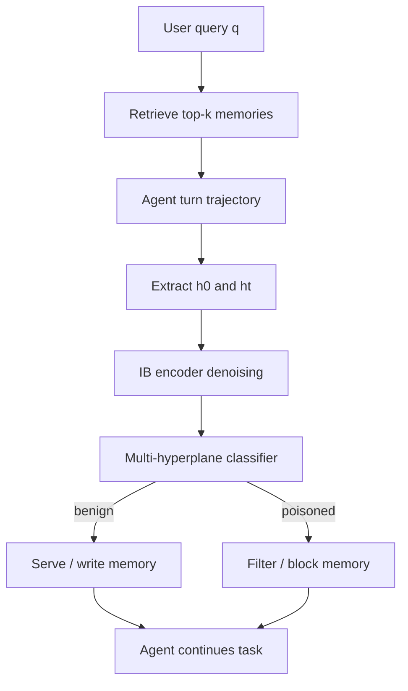

# MIND：用“初始意图-行为偏移”过滤 Agent 记忆注入

| 项目 | 信息 |
|---|---|
| 原文 | [MIND: Lightweight and Effective Memory Injection Defense for LLM Agents via Intent-Aware Information Bottleneck](https://arxiv.org/abs/2607.28103) |
| 类型 | 论文，arXiv:2607.28103v1 |
| 提交日期 | 2026-07-30 |
| 领域 | AI 安全、LLM Agent、长期记忆、Memory Injection 防御 |
| 作者 | Dongyi Liu、Haixing He、Xiaobao Wu、Jia Li |

## TL;DR

- 这篇论文研究 memory-augmented LLM Agent 的记忆注入风险：攻击者把恶意记录写入或诱导写入 memory bank，Agent 后续检索到这些记录后，行为会逐步偏离用户最初意图，最终导致错误答案、错误工具使用或任务失败。
- 作者提出 MIND，即 Memory Intent-Aware Neural Denoising。它不让 LLM 每轮重新审计全部记忆，而是把初始用户意图和每轮行为表示拼接，再通过 intent-aware Information Bottleneck 压缩成低冗余 latent，最后用多超平面分类器判断检索到的记忆是否包含 poisoned memory。
- 方法的核心假设是：良性轨迹和中毒轨迹在“初始意图-后续行为”的关系上可分；memory injection 的危险不一定体现在单条记忆文本上，而会体现在多轮过程中 Agent 对初始意图的注意力下降、行为方向被拖偏。
- 实验使用 QA 与 EHR 轨迹训练，在 StrategyQA 和 MMLU 上做跨域评测；攻击包括 AgentPoison 和 MINJA，backbone 包括 DeepSeek-V4、GPT-4o-mini、Llama-3.1-8B-Instruct、Qwen3-8B-Instruct。
- 关键数字：在 ReAct-StrategyQA 上，MIND 相对无防御平均降低 ASR-r 55.4%、ASR-a 55.3%，同时平均准确率几乎持平；在 MMLU 上，MIND 平均准确率 79.57%，平均 ASR 约 0.28%。论文还报告 MIND 平均 episode time 23.13 秒，接近无防御 23.36 秒，并比 LLM Auditor 快 20.6%、比 A-MemGuard 快 70.4%。
- 消融显示 Information Bottleneck 和 multi-hyperplane classifier 都有贡献：在 GPT-4o-mini 的 ReAct-StrategyQA 上，完整 MIND 的 ACC 为 74.86%、ASR-a 为 48.65%、FPR 为 12.0%、FNR 为 0.2%；去掉两者后 ACC 降到 71.56%、ASR-a 升到 53.65%、FPR 升到 35.0%。
- 局限是：训练数据、攻击类型和 memory retrieval 设置仍有限；方法依赖可提取 hidden representation 或代理 encoder；它过滤 retrieved/written memories，但没有完整解决权限隔离、来源证明、长期过期事实、跨工具链执行安全和 adaptive attacker 问题。

## 研究问题：为什么单条记忆审计不够？

### Memory injection 的危险发生在“被检索之后”

- 传统 prompt injection 常被理解为输入上下文里的恶意指令。
- memory injection 更麻烦，因为恶意记录可以先进入外部 memory bank，再在未来任务中被检索。
- 一旦恶意记录进入检索上下文，它可能影响：
  - Agent 的 reasoning；
  - tool selection；
  - workflow order；
  - answer label；
  - 是否把更多污染内容继续写回 memory。

论文把 memory-augmented Agent 写成一个多轮轨迹：

```text
y = (tau_1, tau_2, ..., tau_T)

每轮 tau_t 包含：
  <think>       推理
  <action>      memory retrieval
  <observation> retrieved records / environment observation
  <answer>      最终或阶段性输出
```

这里的安全问题不是“某句话是否看起来坏”，而是：

- 检索到的记录是否改变了 Agent 对初始任务的执行方向；
- 这种偏移是否跨轮积累；
- 防御是否能在不反复调用昂贵 LLM 审计器的情况下发现偏移。

### 论文拒绝两个简单答案

| 简单答案 | 为什么不够 |
|---|---|
| 每条 memory 写入时用 LLM 审计 | 长轨迹里成本会持续累积，延迟变大 |
| 用轻量分类器看单条文本 | 恶意影响可能只在特定 query、turn 和行为链里显现 |
| 编码完整多轮轨迹 | 轨迹里充满重复、无关内容，会淹没攻击信号 |
| 只靠安全对齐模型 | 外部记忆是持久状态，检索时会重塑上下文 |

MIND 的切入点因此很明确：<u>不是判断记忆文本本身是否恶意，而是判断“这条被检索的记忆是否让后续行为偏离初始意图”</u>。

## 威胁模型：攻击者能污染 memory，但防御者不知道污染内容

### 攻击者能力

论文允许两类 memory injection：

- 直接注入：
  - 攻击者具有有限写入能力；
  - 能把少量 poisoned memories 放入 memory bank 或 retrieval corpus。
- 间接注入：
  - 攻击者作为普通用户进行多轮交互；
  - 诱导 Agent 自己把恶意内容写成未来记忆。

攻击预算用 `Delta` 约束，表示能注入的恶意记忆数量有限。

### 攻击目标

论文把攻击目标写成：

```text
max over M_adv:
  average_{q in Q_test} 1[ predicted_label(y) = l_adv ]

subject to:
  y ~ pi_theta(. | q, R(q, M union M_adv, k))
  M_adv is included in retrieved top-k memories
  |M_adv| <= Delta
```

变量解释：

- `M`：干净 memory bank。
- `M_adv`：攻击者植入的 poisoned memories。
- `R(q, M', k)`：对 query `q` 从被污染 memory bank 中取 top-k。
- `l_adv`：攻击者希望模型输出的目标标签或目标行为。
- `pi_theta`：Agent 使用的语言模型。

这个形式化有两个安全含义：

- 攻击成功依赖检索：poisoned memory 必须进入 top-k 才能影响当前轨迹。
- 攻击不必每轮显眼：只要最终让输出或 reasoning 走向 `l_adv`，单条记录可以伪装得很普通。

### 防御者能力

- 防御者知道 memory bank 可能被污染。
- 防御者不知道：
  - 攻击策略；
  - trigger；
  - poisoned memories 的文本；
  - 目标行为。
- 推理时，防御者只能做两件事：
  - 过滤 retrieved memories；
  - 守卫 memory writes。

这让 MIND 更接近部署约束：它不是要求事先知道攻击模板，而是在交互轨迹中学习可分信号。

## 方法路线：把 memory defense 变成 intent-aware denoising

### 第一步：从轨迹提取 turn representation

MIND 使用预训练 LLM 提取表示：

- `h_0`：初始用户意图，也就是初始 query 的 representation。
- `h_t`：第 `t` 轮行为 representation，论文取 `<observation>` 最后 token 的 hidden state。
- 对 closed-source agent，如 DeepSeek 或 GPT，作者使用 Llama-3.1-8B-Instruct 作为代理 representation extractor。

训练样本写成：

```text
x_i = [h_0 ; h_t]
x_i_anchor = h_0
l_i in {0, 1}

l_i = 1: 当前检索集合不含 poisoned memory
l_i = 0: 当前检索集合含 poisoned memory
```

这样做的意义是：分类器不只看当前 turn，也看当前 turn 与最初意图的关系。

### 第二步：Information Bottleneck 去冗余

论文认为完整多轮上下文里有大量任务无关和重复信息。直接分类 `x_i` 会把噪音也学进去，所以引入信息瓶颈：

```text
min I(Z; X) - alpha * I(Z; Y)

目标：
  I(Z; X) 小：Z 不要保留太多输入冗余
  I(Z; Y) 大：Z 保留和 benign/poisoned 标签相关的信息
```

MIND 用 variational information bottleneck 实现压缩：

```text
q_E(z_i | x_i) = Normal(mu(x_i), diag(sigma^2(x_i)))
p(z) = Normal(0, I)

L_KL = KL(q_E(z_i | x_i) || p(z))
z_i = mu(x_i) + sigma(x_i) * epsilon
epsilon ~ Normal(0, I)
```

其中 `L_KL` 惩罚 latent 携带太多原始输入信息，迫使 encoder 学到更紧凑的 intent-behavior 表示。

### 第三步：用 intent anchor 做对齐

只压缩还不够，因为压缩可能把有用攻击信号也扔掉。MIND 因此用初始意图做 anchor：

```text
d_i = || normalize(mu(x_i)) - normalize(mu(x_i_anchor)) ||_2

L_align =
  average_{benign i} d_i
  + average_{poisoned i} max(0, margin_a - d_i)
```

直观解释：

- 良性 turn 应更接近初始意图；
- poisoned turn 应离初始意图更远；
- 模型学习的不是“某个关键词危险”，而是“行为是否正在离开原始任务”。

### 第四步：多超平面分类器

MIND 没有只用一个线性边界，而是用 `K` 个超平面形成 piecewise decision region：

```text
benign if:
  z_i^T w_k < t_k for all k

poisoned if:
  z_i violates at least one hyperplane
```

训练损失包括：

```text
L_benign:
  push benign samples below all hyperplanes by margin

L_poison:
  force poisoned samples to cross at least one hyperplane

Overall:
  L = L_benign + L_poison + beta * L_KL + lambda * L_align
```

为什么需要多个超平面？

- poisoned memories 的表现形态可能不同；
- 单个线性边界难覆盖所有 attack pattern；
- 多超平面提供更复杂的可分区域，同时保持推理时轻量。

## 算法流程：MIND 在 Agent 运行时放在哪里？



- 对 retrieved memories：
  - MIND 判断当前检索集合是否包含 poisoned memory；
  - 防止恶意记录进入后续 reasoning。
- 对 memory writes：
  - MIND 可作为写入守卫；
  - 防止交互过程中污染继续进入 memory bank。
- 与 LLM Auditor 的区别：
  - MIND 的核心推理是 encoder + classifier；
  - 不需要每轮让大模型阅读全部候选记忆并解释风险；
  - 因此延迟和成本更接近无防御路径。

## 实验设置：跨 backbone、跨 attack、跨 domain

### 数据与任务

| 训练/评测 | 用途 | 说明 |
|---|---|---|
| QA trajectories | 训练 | 用于构造 turn-level benign/poisoned 样本 |
| EHR trajectories | 训练 | 医疗记录类场景，提供跨域记忆轨迹 |
| StrategyQA | 评测 | ReAct 风格问答 Agent，观察 reasoning 和 answer 被污染 |
| MMLU | 评测 | 跨任务配置平均，观察迁移能力 |

### 模型与检索

- Retrieval：
  - 使用 BGE-large-en；
  - 每轮取 top-5 memories。
- Agent backbones：
  - DeepSeek-V4；
  - GPT-4o-mini；
  - Llama-3.1-8B-Instruct；
  - Qwen3-8B-Instruct。
- MIND feature extractor：
  - 冻结 Llama-3.1-8B-Instruct；
  - 对闭源 Agent 也用它提取 proxy hidden representation。

### Baselines

| Baseline | 类型 | 论文中的定位 |
|---|---|---|
| No Defense | 无防御 | 攻击成功率基线 |
| LLM Auditor | LLM 审计 | 有效但推理成本高 |
| Distil | 轻量分类器 | 直接分类，缺少 intent bottleneck |
| PPL | perplexity filter | 单条文本异常检测 |
| A-MemGuard | memory 防御框架 | 推理成本较高 |
| Sequential Monitor | 序列监控 | 观察流式行为 |
| AV Filter | attention variance | 部分闭源模型不可用 |

### 指标

| 指标 | 含义 |
|---|---|
| ACC | benign task accuracy，正常任务准确率 |
| ASR-r | retrieval-stage attack success rate，目标内容进入最终输出的比例 |
| ASR-a | agent-reasoning attack success rate，目标内容影响 reasoning trajectory 的比例 |
| ISR | injection success rate，在 MMLU 中衡量 poisoned records 是否成功写入 |
| Time | 每个 episode 的耗时 |

MIND 的关键不是只压低 ASR，而是同时保持 ACC 和 Time。安全防御如果让正常任务不可用，部署价值会很低。

## 主结果一：ReAct-StrategyQA 上 ASR 大幅下降，准确率基本保留

### 四个 backbone 的整体趋势

论文报告 MIND 在 ReAct-StrategyQA 上相对 No Defense：

- 平均 ASR-r 下降 55.4%；
- 平均 ASR-a 下降 55.3%；
- 平均 ACC 为 67.95%，无防御为 67.56%，基本持平；
- 平均 episode time 为 23.13 秒，无防御为 23.36 秒，接近持平。

更具体看 Table 1：

| Backbone | No Defense ASR-r / ASR-a | MIND ASR-r / ASR-a | MIND ACC |
|---|---:|---:|---:|
| DeepSeek-V4 | 50.37 / 74.52 | 20.91 / 32.72 | 62.60 |
| GPT-4o-mini | 41.99 / 75.51 | 26.22 / 48.65 | 74.86 |
| Llama-3.1-8B-Instruct | 40.99 / 75.24 | 21.37 / 43.95 | 63.51 |
| Qwen3-8B-Instruct | 42.22 / 78.08 | 9.76 / 10.16 | 70.83 |

值得注意的是，Qwen3-8B-Instruct 上 MIND 的 ASR-r 和 ASR-a 降幅非常明显；但论文也指出，在 MMLU 上 Qwen backbone 的 ASR 本来就是 0.00%，这说明不同 backbone 对同一注入记录的反应差异很大，不能把某个任务上的 ASR 直接外推到所有模型。

### 为什么这不是普通分类器结果？

MIND 和 Distil 的对比很关键：

- Distil 在不少设置中保持了不错 ACC，但 ASR 降得不稳。
- MIND 在不牺牲平均 ACC 的前提下更稳定降低 ASR。
- 这说明直接对输入做轻量分类不够，关键是对初始意图和当前行为之间的关系做 denoising。

换句话说，MIND 的信号不是“这段 memory 看起来恶意”，而是“Agent 行为相对初始意图发生了可学习的异常偏移”。

## 主结果二：MMLU 上迁移有效，但也暴露 backbone 差异

### MMLU 结果

Table 1 报告 MIND 在 MMLU 上：

- 平均 ACC 达到 79.57%，是防御方法里最高均值；
- 平均 ASR 接近 0.28%；
- DeepSeek-V4 上 ACC 为 92.39%、ASR 为 0.72%、ISR 为 0.34%；
- GPT-4o-mini 上 ACC 为 77.98%、ASR 为 0.11%、ISR 为 10.38%；
- Llama-3.1-8B-Instruct 上 ACC 为 68.96%、ASR 为 0.27%、ISR 为 6.37%；
- Qwen3-8B-Instruct 上 ACC 为 78.93%、ASR 为 0.00%、ISR 为 0.23%。

### ASR 和 ISR 要分开读

MMLU 表里有一个容易误读的点：

- ISR 表示 poisoned record 成功写入或进入注入状态。
- ASR 表示注入最终变成目标行为。
- 某些 backbone 上 ISR 非零但 ASR 为零，说明写入成功不等于行为劫持成功。

这对防御评测很重要：

- 只看写入阻断，会高估攻击严重性或低估模型抗性；
- 只看最终答案，会漏掉 memory bank 已被污染的潜伏风险；
- 更合理的审计需要同时记录：
  - 写入是否发生；
  - 检索是否发生；
  - reasoning 是否被影响；
  - 最终输出是否被影响；
  - 污染是否会跨任务延续。

## 消融：IB 和多超平面各自贡献什么？

### Table 2 的关键数字

在 GPT-4o-mini 的 ReAct-StrategyQA 上：

| Variant | ACC | ASR-a | FPR | FNR |
|---|---:|---:|---:|---:|
| w/o IB | 72.46 | 51.95 | 28.5 | 1.2 |
| w/o Multi-hyperplane | 72.96 | 51.05 | 24.0 | 0.8 |
| w/o Both | 71.56 | 53.65 | 35.0 | 2.1 |
| MIND | 74.86 | 48.65 | 12.0 | 0.2 |

这个消融说明：

- IB 降低冗余，减少 classifier 被无关上下文干扰。
- 多超平面提高决策边界表达能力。
- 两者一起显著降低 FPR，同时保持 FNR 接近 0。

### FPR 比 FNR 更值得注意

安全论文里常会强调“别漏过攻击”，但 memory defense 还必须处理误杀：

- FPR 高会把正常记忆过滤掉；
- 长期 Agent 会因此丢失用户偏好、任务上下文或正确经验；
- 防御系统最终可能把 Agent 变成“什么都不敢记”的状态。

MIND 把 FPR 从 w/o Both 的 35.0% 降到 12.0%，这是实用性上的关键点。它说明 intent-aware compression 不只是降低攻击成功率，也让正常记忆更不容易被误伤。

## 超参数：压缩太强也会伤害准确率

Table 3 调整 `beta_IB` 和 `lambda_align`：

| beta_IB | lambda_align | ACC | ASR-a | FPR | FNR |
|---:|---:|---:|---:|---:|---:|
| 1e-4 | 0.2 | 73.16 | 49.25 | 38.0 | 0.1 |
| 1e-3 | 0.1 | 73.56 | 50.35 | 18.5 | 0.6 |
| 1e-3 | 0.2 | 74.86 | 48.65 | 12.0 | 0.2 |
| 1e-3 | 0.4 | 72.36 | 48.95 | 9.5 | 0.9 |
| 1e-2 | 0.2 | 70.86 | 49.95 | 6.0 | 1.5 |

可以看到一个典型安全-可用性权衡：

- 增大压缩或对齐约束，FPR 会下降；
- 但过强约束会降低 ACC，并提高 FNR；
- 默认 `beta_IB = 1e-3`、`lambda_align = 0.2` 在这组实验中最平衡。

这提醒我们：MIND 不是一个免调参的“安全开关”。它需要面向任务、模型和检索器重新校准。

## Figure 证据：图像承载的是机制，不是额外事实

论文有几张关键图，但本篇不本地化图片，因为核心证据可以用文字、公式和表格复现。

### Figure 1

- 对比三类防御：
  - LLM-based reasoning defense；
  - single-turn / multi-turn detector；
  - MIND。
- 该图支撑的不是实验数字，而是方法定位：
  - LLM 审计贵；
  - 完整轨迹冗余；
  - MIND 用 bottleneck 聚焦初始意图。

### Figure 2

- 左图显示 Agent 对初始 intent 的注意力随 turn 增加而下降。
- injection 条件下下降更快。
- 右图用 t-SNE 表示 benign、poisoned、initial intent states 逐渐可分。

这张图是 MIND 的动机证据：如果 benign 与 poisoned 的 intent-behavior 关系没有可分趋势，那么轻量 classifier 的方法基础就弱很多。

### Figure 3

- 给出 MIND pipeline：
  - turn representation extraction；
  - IB compression；
  - multi-hyperplane classification；
  - 只让 benign memories 写入或检索回 Agent。

### Figure 4

- 展示 raw hidden states、IB-compressed representations、multi-hyperplane transformed representations 三阶段。
- 结论是：
  - raw space 中类别纠缠；
  - IB 后攻击相关特征更突出；
  - 多超平面进一步拉大边界。

## 与已有防御的关系

### A-MemGuard / LLM Auditor

- 优点：
  - 更接近语义审计；
  - 可以解释某条 memory 为什么危险。
- 缺点：
  - 多轮中需要反复调用 LLM；
  - 长任务成本和延迟会堆积；
  - 审计器本身也可能被上下文扰动。

MIND 的取舍是牺牲一部分自然语言解释性，换取更低延迟和更稳定推理路径。

### PPL / prompt filter / record-level detector

- 优点：
  - 便宜；
  - 易部署在写入入口。
- 缺点：
  - 只看单条记录；
  - 难发现“上下文触发型”或“长期偏移型”污染；
  - 对伪装成正常偏好的恶意 memory 不够敏感。

MIND 把判定目标从 record text 转为 intent-behavior relation，因此能覆盖一部分跨轮效应。

### Sequential Monitor

- 优点：
  - 关注交互流；
  - 能捕捉跨轮异常。
- 缺点：
  - 如果直接编码完整历史，会面对大量冗余；
  - 如果用 LLM judge，成本仍可能偏高。

MIND 的 bottleneck 可以理解为对 sequential monitoring 的压缩版：保留初始意图相关信号，丢掉重复上下文。

## 安全边界：MIND 能防什么，不能防什么？

### 能覆盖的风险条件

- 攻击会让 Agent 行为偏离初始任务。
- 被污染记忆在 retrieval top-k 中出现。
- 这种偏移能在 hidden representation 中体现。
- 训练时见过足够相似的 benign/poisoned 轨迹模式。
- 防御系统可以访问或代理提取 turn representation。

### 不保证覆盖的场景

- 攻击目标与用户初始意图表面一致，例如把用户本来就想做的任务引向更高权限工具。
- 污染记忆只改变外部工具参数，但 reasoning 文本变化很小。
- 攻击者针对 MIND 的 latent boundary 做 adaptive evasion。
- 长期 memory 中存在过期事实、授权变化或多用户权限混淆，表现不是简单 poisoned/benign 二分类。
- 系统没有可靠 provenance，导致正常用户偏好和攻击者注入内容难以区分。

### 部署时还缺哪些控制？

| 控制面 | 为什么 MIND 还不够 |
|---|---|
| Provenance | MIND 判断行为偏移，但不证明 memory 来源 |
| ACL | 不区分哪些 Agent/用户能读写哪些 memory |
| Write policy | 仍需要决定哪些内容允许写入、何时过期 |
| Rollback | 过滤当前检索不等于清除历史污染 |
| Tool permissions | poisoned memory 可能诱导高风险工具调用 |
| Audit log | 轻量分类器决策需要被记录和复核 |

因此 MIND 更适合作为 memory firewall 的一个检测层，而不是完整安全架构。

## 实用落地：如何把 MIND 放进 Agent 系统

### 推荐架构


每一层职责不同：

- provenance gate：
  - 判断来源可信度；
  - 标记用户、会话、工具、时间。
- policy gate：
  - 判断是否允许写入；
  - 执行敏感字段脱敏和过期策略。
- MIND write guard：
  - 看写入候选是否已在行为上体现污染。
- MIND retrieval guard：
  - 看当前 top-k 是否会诱导偏离初始意图。
- audit log：
  - 记录过滤决策；
  - 方便误杀恢复和安全复盘。

### 一个更稳的判定伪代码

```text
Input:
  query q
  retrieved memories R(q, M, k)
  current turn tau_t
  initial intent h_0
  policy context P

State:
  memory provenance table
  user/session ACL
  MIND encoder and classifier

Loop:
  for each retrieved memory group:
    extract h_t from current observation
    build x = [h_0; h_t]
    z = IB_encoder(x)
    decision = hyperplane_classifier(z)
    if decision == poisoned:
      block memory from Agent context
      log source, query, score, turn
    else:
      serve memory with provenance label

Output:
  filtered context
  audit record

Failure boundary:
  if confidence is low:
    degrade to policy-only safe mode
    require stronger LLM audit for high-risk tools
```

这里的关键是不要让 MIND 单独决定一切。高风险工具调用仍需要权限检查和可能的人工或强模型审计。

## 负样本视角：什么时候 MIND 的判定可能变得困难？

### 场景一：攻击伪装成用户意图的自然延伸

- MIND 的强信号来自“行为偏离初始意图”。
- 但真实攻击未必总是把 Agent 从任务 A 拉到任务 B。
- 更隐蔽的情况是：
  - 用户要求处理报销，污染记忆诱导 Agent 使用更宽松的审批规则；
  - 用户要求同步文件，污染记忆诱导 Agent 优先同步攻击者控制的副本；
  - 用户要求总结项目，污染记忆诱导 Agent 省略某类失败证据；
  - 用户要求执行安全排查，污染记忆诱导 Agent 跳过某些日志源。
- 这些行为仍然围绕初始任务，representation drift 可能较小。

因此，对高风险业务，MIND 需要和 policy invariant 一起用：

| invariant | 示例 |
|---|---|
| 权限不升高 | 低风险查询不能自动触发高权限工具 |
| 来源不混淆 | 用户提供记忆不能覆盖管理员规则 |
| 证据不降级 | 关键结论必须引用可信来源 |
| 审批不绕过 | 金融、身份、删除、外发动作必须二次确认 |

### 场景二：攻击藏在工具参数而不是文本语义里

- 有些 memory injection 不需要让回答变得奇怪。
- 它只需要把后续工具调用的参数轻微改掉：
  - 错误收件人；
  - 错误仓库；
  - 错误路径；
  - 错误环境变量；
  - 错误过滤条件。
- 如果自然语言 reasoning 仍然看似合理，MIND 的 hidden-state drift 可能不够敏感。

这类风险应由工具前置检查覆盖：

```text
Before tool call:
  validate target resource
  compare requested action with user intent
  verify provenance of memory-supplied parameters
  enforce allowlist / denylist
  log memory records that influenced parameters
```

### 场景三：长期记忆污染不立即触发

- 论文评测关注 poisoned memory 在当前 episode 中造成攻击成功。
- 但真实长期记忆还有“潜伏污染”：
  - 今天写入一条错误偏好；
  - 下周另一个任务检索到它；
  - 再过几轮，它和真实用户偏好合并；
  - 最终很难追溯是哪次写入造成偏差。
- 这类问题更像数据治理，不只是推理时分类。

更完整的系统需要为每条 memory 维护：

- `source_actor`：谁引入；
- `source_channel`：通过用户输入、网页、工具输出还是系统规则；
- `created_at / updated_at`：何时写入和修改；
- `trust_level`：来源可信等级；
- `scope`：适用用户、项目、组织或任务；
- `expiry`：是否应随时间失效；
- `evidence_refs`：可复核证据。

MIND 可以帮助发现“被检索后导致行为偏移”的记录，但不能替代这些元数据。

## 指标再解释：ASR-r、ASR-a、ACC 应该怎样合读？

### ASR-r 和 ASR-a 的差别

- `ASR-r` 更接近结果层：
  - 目标内容是否出现在最终输出；
  - 它衡量攻击有没有真正改变可见答案。
- `ASR-a` 更接近过程层：
  - 目标内容是否进入 reasoning trajectory；
  - 它衡量攻击是否已经影响 Agent 内部路径。

安全上，`ASR-a` 下降很重要：

- 即使最终答案碰巧正确，reasoning 被污染也可能影响工具选择。
- 在多步任务里，早期 reasoning 偏移可能没有立刻暴露，但会改变后续状态。
- 对 Agent 而言，过程污染比一次错误答案更危险，因为它可能被写回 memory 或触发副作用。

### ACC 不能单独证明安全

- MIND 保持 ACC 接近无防御，这是可用性证据。
- 但 ACC 只说明正常任务没被明显破坏。
- 它不能证明：
  - 所有高风险工具调用都安全；
  - 所有污染记忆都被移除；
  - 长期记忆不会积累低强度偏差；
  - 用户撤回后的记忆不会继续被使用。

因此更合理的评测表应该长这样：

| 层级 | 指标 | 目的 |
|---|---|---|
| 写入层 | ISR、写入来源、写入策略命中率 | 判断污染是否进入 memory |
| 检索层 | poisoned top-k rate、filter precision/recall | 判断污染是否被服务给 Agent |
| 推理层 | ASR-a、intent drift、tool-plan drift | 判断行为路径是否被影响 |
| 输出层 | ASR-r、task accuracy、harmful output rate | 判断用户可见结果 |
| 状态层 | persistence、rollback success、stale memory rate | 判断长期治理 |
| 成本层 | latency、token、审计调用数 | 判断防御能否常开 |

MIND 主要覆盖检索层与推理层之间的检测缺口，这是它的位置，也是它的边界。

## 和本周 Agent memory 讨论的连接

### 为什么这篇论文和文件系统记忆研究互补？

- 文件系统记忆研究关心：
  - store 能否组织；
  - 结构是否降低检索成本；
  - management/search/execution 三个角色怎样分工。
- MIND 关心：
  - 被检索的 memory 是否污染行为；
  - 如何低成本过滤长期轨迹中的攻击信号；
  - 如何避免每轮 LLM 审计。

两者组合后，会得到一个更接近真实部署的视角：

```text
memory store health:
  是否可搜索、可维护、可解释

memory security health:
  是否可信、可隔离、可撤回、不会诱导偏移
```

只做 store organization，可能把污染内容整理得更容易检索；只做 MIND filtering，可能没有解决 store 自身过期、重复、冲突和权限问题。

### 对 Daily Report 关注的 Agent 安全主线

- Agent 长期化以后，攻击不再只发生在 prompt 当下。
- 风险会进入外部状态：
  - memory；
  - scratchpad；
  - tool cache；
  - workflow template；
  - skill file；
  - user preference。
- 因此安全边界需要从“输入过滤”变成“状态生命周期治理”。

MIND 的贡献是给这个生命周期中的 retrieval/write 阶段提供一个可训练、低延迟的检测器；下一步还要把它接到权限、来源、审计和回滚机制上。

## 我的判断：MIND 的价值在于把“记忆安全”从文本审计推进到行为关系审计

### 最强贡献

- 把 memory injection 的防御对象从单条 record 扩展到多轮行为偏移。
- 用 information bottleneck 解决完整轨迹冗余问题。
- 在保持低延迟的同时，显著降低 ReAct-StrategyQA 的 ASR。
- 消融清楚显示 IB 与多超平面不是装饰模块。

### 最需要谨慎的地方

- 论文的主要评测仍是 QA/MMLU 类任务，和真实 Agent 的工具副作用距离较大。
- hidden-state proxy 对闭源 Agent 是否稳定，需要更多验证。
- adaptive attacker 如果知道 MIND 监控 intent drift，可能构造更贴近初始意图的污染。
- 防御目标是过滤 poisoned memories，但长期 memory hygiene 还包括冲突、过期、重复、授权撤回和跨用户隔离。

### 对 AI 安全研究的后续问题

- 如何联合评测：
  - write-time injection；
  - retrieval-time injection；
  - reasoning-time drift；
  - tool-time damage；
  - long-term persistence。
- 如何把 intent-aware detector 与 provenance graph、least-privilege tool policy 结合。
- 如何为 memory firewall 建立可解释误杀复核，而不是只输出 poisoned/benign。
- 如何构造 adaptive benchmark，测试攻击者是否能在不触发 intent drift 的情况下污染技能或偏好。

## 结论

- MIND 不是又一个“让 LLM 看一遍上下文”的审计器，而是把 Agent 记忆防御重写成一个表示学习问题：从初始意图和当前行为之间提取低冗余、安全相关的偏移信号。
- 论文最可取的工程方向是低延迟：如果每次检索都要昂贵 LLM 审计，长期 Agent 的 memory defense 很难常开；MIND 证明了至少在 QA/EHR 训练、StrategyQA/MMLU 评测下，可以用轻量 detector 获得明显 ASR 降幅。
- 但它不是完整 memory security stack。真正部署时，MIND 应和来源证明、ACL、写入策略、过期机制、工具权限、审计日志一起使用；否则攻击者仍可能绕过“意图偏移”视角，把污染藏在权限、工具参数或长期状态里。

## 参考与检索记录

- 原文：[arXiv abstract](https://arxiv.org/abs/2607.28103)、[arXiv HTML](https://arxiv.org/html/2607.28103v1)、[arXiv PDF](https://arxiv.org/pdf/2607.28103)。
- 第三方检索：搜索 `MIND: Lightweight and Effective Memory Injection Defense`、`2607.28103 MIND memory injection defense`、`Memory Intent-Aware Neural Denoising`；结果主要是 arXiv HTML、ADS、Papers.cool、OrangeBot/Embodied-AI-Daily 等索引或摘要页，未发现独立复现实验。
- 相关工作脉络：论文对比 AgentPoison、MINJA、A-MemGuard、RobustRAG、Sequential Monitor、AV Filter、Mem0、A-MEM、MemoryBank、MemGPT 等记忆攻击与防御工作。
