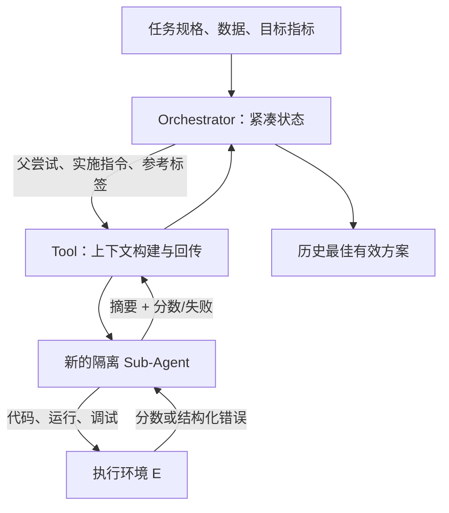

# Matryoshka Agent：把长程机器学习工程拆成“决策者—执行者”

> **论文**：*Matryoshka Agent: Unfolding Sub-Agents for Long-Horizon Machine Learning Engineering*（arXiv:2607.25090v1，2026-07-27）  
> **类别**：大模型 Agent；**原文**：[arXiv 摘要页](https://arxiv.org/abs/2607.25090)｜[PDF](https://arxiv.org/pdf/2607.25090)  
> **本文立场**：以下数字来自论文的 MLE-Dojo 设置；它证明的是该基准、该预算和该模型组合下的收益，不等同于任意生产 Agent 的通用保证。

## TL;DR

- 论文处理的不是一次性写代码，而是反复“写代码—运行—读报错/分数—改方案”的机器学习工程（MLE）任务；难点是日志会累积、尝试空间大、每次真实执行昂贵。
- 作者提出三层 **Matryoshka Agent**：持久的 **Orchestrator** 只保留压缩的策略状态；每轮新建的 **Sub-Agent** 在隔离上下文中编程、运行和调试；**Tool** 负责把前者的指令变成后者的上下文，并把结果压缩回传。
- 训练时不把每条失败轨迹简单丢弃：从同一父节点二叉展开“解法改进树”，以子树中最好的下游分数标记哪条分支更值得偏好，再用带参考策略约束的排序式在线 RL 更新 Orchestrator；最高分成功执行轨迹再用于 Sub-Agent 的 SFT。
- 在 MLE-Dojo 的 150/50 训练/评测划分、每任务最多 12 小时、每配置三次并行试验取最好一次的协议下，Qwen3-30B-Coder 从单体 Dojo Agent 的 HumanRank **0.3302** 升至训练后 Matryoshka 的 **0.4515**，相对提升至多 **36.7%**。
- 小模型的角色分工尤为醒目：Qwen3-4B 单体只有 **0.1878**；作为 Orchestrator、配 o4-mini 执行时为 **0.4613**，SFT+RL 后为 **0.5360**，接近 o4-mini 自身层级配置的 **0.5465**。这说明“会规划”和“能把复杂指令落地”可有不同容量门槛。
- 但证据仍有限：主指标包含 best-of-three，任务是带标量反馈的 MLE-Dojo，论文未给出公开代码链接；层级化会引入模型调用、工具协议与摘要失真的新成本，不能由 HumanRank 直接推出真实团队开发的成本效益或安全性。

## 研究问题：为什么长程 MLE 不能只靠一个越来越长的对话？

### 任务目标其实是“有限预算内的历史最好分数”

论文把一个任务实例记为 \(x\)：自然语言说明、数据文件、目标指标和提交格式都在其中。第 \(t\) 次尝试产生可执行代码；环境 \(E\) 要么返回格式/运行错误，要么执行评测并给出 \(r_t\)。目标是：

\[
\max_E\ \max_{1 \le t \le T} r_t
\]

| 符号 | 含义 | 设计含义 |
|---|---|---|
| \(T\) | 可尝试的轮数/时间预算 | 失败不能无限重试，探索必须有取舍 |
| \(r_t\) | 第 \(t\) 个有效提交的分数 | 不是语言相似度，而是环境的可执行反馈 |
| \(E\) | 执行、格式校验、评测环境 | 既是奖励来源，也是耗时、报错和噪声来源 |

这个定义解释了作者为何不把问题简化为“更长 context”。一个单体 Agent 必须同时保留原始代码、终端日志、失败诊断、数据模式、曾试过的超参数和接下来要探索的假设。历史越长，既有 token 成本，也有旧报错干扰新决策的风险；而一次完整训练或提交又可能占据很长 wall-clock。

### 论文的主张链条

| Claim | Mechanism | Evidence | Boundary |
|---|---|---|---|
| 压缩策略状态可缓解长程上下文负担 | Orchestrator 只看结构化摘要和分数 | 图 2 中其上下文增长斜率低于单体 | 摘要是否漏掉关键代码细节没有独立评测 |
| 规划与执行可由不同模型承担 | 小模型做策略层，强模型做执行层 | 4B+o4-mini 的结果显著高于 4B 单体 | 强执行者的调用成本并未与单体方案完整核算 |
| 昂贵交互仍能产生训练信号 | 同前缀分叉、以子树最好回报构造偏好 | RL 与消融优于仅 SFT 或只 RL | 仅在 MLE-Dojo 的反馈结构验证 |
| 模块不必绑定同一执行模型 | 训练后 Orchestrator 可替换 GPT-5-nano 子 Agent | 表 2 的 plug-and-play 增益 | 测试的替换集合很小，未测工具接口变更 |

## 方法机制：三层不是多加角色，而是规定信息边界

### 1. Orchestrator：只对“下一条改进边”负责

它跨轮存在，状态里保留任务约束、先前工具调用、结构化结果摘要和分数。每一轮它必须明确三件事：选哪个旧尝试作为父节点、给出怎样的实现改进指令、哪些旧尝试可作为参考。它**不**直接背负所有代码、原始日志或其他 Sub-Agent 的对话。

这样的约束有实质含义：Orchestrator 的输出不是泛泛的“继续优化”，而是可执行的、带父节点和引用标签的策略决策。论文后面的失败案例也表明，策略层即使知道“用 PCA+LightGBM”，若不提供 schema、提交格式和步骤约束，执行层仍可能无法落地。

### 2. Tool：把“可见性”变成协议，而非提示词约定

Tool 的输入是父尝试、具体指令、可选参考；它据此构造一个**新鲜**的 Sub-Agent context，管理运行生命周期，并把结果转成“分数（若有效）+结构化摘要”。并行探索时可以启动多个 Sub-Agent，但彼此的上下文与执行历史隔离。

```text
Input: task x, history H, budget B
State: compact orchestrator state s, best attempt a*
while B remains:
    (parent, instruction, refs) = Orchestrator(s)
    local_context = Tool.build(x, parent, instruction, refs)
    trajectory = SubAgent.run_and_debug(local_context, E)
    result = Tool.compress(trajectory)  # score or failure diagnostics
    s = append(s, result)
    a* = argmax_score(a*, result)
return a*
```

这层也带来工程风险：Tool 是可信边界。若它把错误的旧参考注入、压掉关键异常、或允许跨子 Agent 的未审计状态泄漏，所谓“上下文清洁”会变成不可追溯的决策损失。论文把它当作标准化接口，但没有报告摘要保真率、工具故障率或对恶意工具输出的鲁棒性。

### 3. Sub-Agent：一次尝试内闭环，跨尝试不继承原始历史

Sub-Agent 获取任务所需资料、当前指令和被选择的引用后，执行“写代码 → 运行 → 根据结构化报错修补”的有界循环；耗尽调试预算仍不能生成有效提交时，返回 FAILED 和诊断，不伪造分数。成功时才交回标量评测分。

这个“每轮重置”不是遗忘一切：选择性引用和摘要仍可传递有价值的方案。它切断的是无选择累积的低层日志。代价则是：重建上下文可能漏掉隐含环境状态，且低能力 Sub-Agent 即使面对正确指令仍会因代码执行与 schema 对齐能力不足失败。



## 训练：为什么用“子树最佳回报”而不是只奖励本轮？

### 解法改进树保留共同前缀

训练从根状态开始；每个非叶节点让当前策略从**同一父状态**采样两条改进指令，分别由 Sub-Agent 真正执行。节点是带摘要与分数的尝试，边才是 Orchestrator 的决策。二叉展开重用共同前缀，避免为每条候选路线反复支付完全相同的前序执行成本。

对子节点 \(c\)，作者不只看它首轮的 \(r(c)\)，而定义：

\[
R(c)=\max_{v\in\mathrm{subtree}(c)}r(v)
\]

- 若一条分支起步低、却在后续修复中变强，它不会被即时奖励错误地淘汰。
- 两条候选共享父状态，偏好标签更聚焦“此处该往哪种改进方向走”。
- 与把整个任务只选一个冠军轨迹相比，树会产生多个局部、同前缀的对比样本。

### 排序式在线 RL 的约束来自上一轮策略

论文给出能量形式的最优策略：

\[
\pi^*(\Delta\tau\mid s_u)=\frac{1}{Z(s_u)}\pi^{(m)}(\Delta\tau\mid s_u)
\exp\left(\frac{r(s_u,\Delta\tau)}{\beta}\right)
\]

其中 \(s_u\) 是分叉节点的策略状态，\(\Delta\tau\) 是候选续写/决策，\(\pi^{(m)}\) 为第 \(m\) 轮参考策略，\(Z\) 是归一化项，\(\beta\) 控制更新不要偏离旧策略太猛。用 log-ratio 参数化后，训练最小化候选集合上的排序损失：让优选分支相对参考策略的概率提升得高于其他兄弟分支。

它和“对最高分样本直接 SFT”最大的差别是监督对象：前者训练**从同一已知状态选择下一条策略边**，后者容易混入不同历史前缀、不同难度和偶然高分。与此同时，作者从每棵树的最高分路径抽取 Sub-Agent 的成功轨迹做 SFT，形成“策略层以偏好 RL 改进、执行层以可落地成功样本改进”的双轨更新。

## 实验设置：能比较什么，不能比较什么？

### 数据、指标与预算

| 项目 | 论文设置 | 解读 |
|---|---|---|
| 基准 | MLE-Dojo，150 训练 / 50 评测 | 覆盖表格、CV、NLP 与 MLE-Lite；任务含交互反馈 |
| 领域 | 金融、医疗、媒体等；分类、回归、生成 | 说明不是单一 Kaggle 类型，但仍是工程评测环境 |
| 指标 | HumanRank，\([0,1]\) | 超过的人类参赛者比例，并平均 public/private leaderboard |
| 试验 | 每任务、每配置三次并行，报告 best-of-three | 有利于展示可达最好表现，不能当作单次稳定性 |
| 时间 | 每任务每次最多 12 小时 | 真实执行成本被固定，未给 token/美元总成本曲线 |
| 模型 | Qwen3-4B、Qwen3-30B-Coder、o4-mini、GPT-5-nano | 同时考察开源/闭源与不同规模 |

训练上，30B 模型的 SFT 同时覆盖 Orchestrator 与 Sub-Agent，4B 只训练 Orchestrator；两者都先用 100 条高质量轨迹 SFT，再做两轮 online RL。附录列出 30B 使用 8 张 H100 80GB、4B 使用 4 张 H100 80GB；这提示复现门槛并不低，尤其不能把“部署时可模块化”误读成“训练成本低”。

## 主结果与图表：收益落在何处？

### 表 1：架构收益、SFT 收益、RL 收益必须分开看

| 配置 | All HumanRank | 相对单体基线的观察 |
|---|---:|---|
| Dojo Agent，Qwen3-30B-Coder | 0.3302 | 单体基线 |
| Matryoshka，30B + self | 0.3652 | 不额外训练也有层级架构增益 |
| Dojo Agent，30B-SFT | 0.3857 | 仅 SFT 的更强单体对照 |
| Matryoshka，30B-SFT + self | 0.4197 | 超过同样 SFT 的单体，支持结构贡献 |
| Matryoshka，30B-RL + self | 0.4515 | 相对 0.3302 至多 +36.7% |
| Dojo Agent，Qwen3-4B | 0.1878 | 小单体很弱 |
| Matryoshka，4B + o4-mini | 0.4613 | 小模型做规划、强模型做执行 |
| Matryoshka，4B-RL + o4-mini | 0.5360 | 接近 o4-mini + self 的 0.5465 |

最有说服力的比较不是 30B-RL 对原始 30B，而是 30B-SFT+层级（0.4197）对 30B-SFT 单体（0.3857）：同样有监督预热后，分层仍有差距。不过表中只给四位小数和 best-of-three 汇总；附录的平均聚合虽保持排序（例如 o4-mini 单体 0.4053、层级 0.4707），但没有逐任务置信区间或成本分布。

### 表 2 与表 3：可插拔不等于角色对称

训练的 Orchestrator 换成 GPT-5-nano Sub-Agent 后，4B-RL 的 All 为 **0.4309**，30B-RL 为 **0.4626**，均高于 GPT-5-nano 单体的 **0.3946**。这支持策略层具有一定可迁移性，但它只验证了一个替换执行模型。

更关键的消融是 30B-RL 放在不同角色：原始模型作 Orchestrator 为 0.3302；仅把 RL 模型换为 Orchestrator 是 **0.4258**，仅换为 Sub-Agent 是 **0.3826**，两者都换是 **0.4515**。因此论文的实验证据更支持“决策层优化贡献更大”，而不是宣称两个角色完全可互换。

### 表 4、图 2、表 8：三个常被忽略的限制

- **表 4：SFT 是有效暖启动。** 30B-only-RL + self 为 **0.3901**，虽超过原始层级 0.3652，却明显低于 SFT+RL 的 0.4515。结论应是在线 RL 有效，但并不消除高质量轨迹 SFT 的价值。
- **图 2：上下文是更慢增长，不是恒定。** Orchestrator 约 **1201.93 token/round**，Dojo Agent 约 **1870.29 token/round**；Sub-Agent 每轮重新初始化而近似常量。以 256K context 的 30B 为例，作者估算前者约 213 轮、后者约 137 轮。这是线性拟合和理想上下文预算估计，并非端到端吞吐承诺。
- **表 8：更长指令不是普遍机制。** 4B+o4-mini 的平均指令 token 从 379.31 → 750.06 → 1010.22（预训练/SFT/RL），而 30B+self 为 271.62 → 639.10 → 655.63。小 Orchestrator 通过更细指令补偿固定执行者；30B 联合训练后性能增加却不必继续变啰嗦，更像是协同执行能力改善。

## 失败案例：论文实际上暴露了什么？

附录的 leaf-classification 案例很有价值。原始 4B 给出 PCA、特征选择、LightGBM 的合理高层建议，却出现语法错误、列名不匹配，最终退化为均匀概率提交，排名 **1546/1595**。SFT 后它能写出更完整的 99 类、64 维特征、超参数和 submission 约束，但作为 Sub-Agent 仍因 `margin_1` 缺失和 DataFrame 碎片化而无法生成有效提交。

这不能被包装成“提示词写长就好”。作者的解释更窄：小模型可以通过训练学会更可操作的 Orchestrator 指令，却未必具备可靠的 schema grounding、调试和执行能力。因此架构选择应先分别量化：

1. 决策层是否能提出可区分、可验证的改进假设？
2. 执行层是否能正确读取实际文件、API 与错误反馈？
3. Tool 的摘要是否保留了使下一轮决策必要的失败证据？

任一项为否，层级化可能只是把失败从一个长对话搬运成更多昂贵的短对话。

## 相关工作位置与可复现性

论文将自己放在模块化 Agent、MLE coding agent、显式探索和学习式优化的交叉处。相较固定规划/执行/验证角色，它的区别是让 Orchestrator 动态选择“哪一个已有尝试、沿哪条方向继续”；相较只在推理时堆子 Agent，它还训练策略层的分叉选择；相较单体轨迹学习，它用共同前缀的下游回报生成局部偏好。

但可复现材料边界要清楚写出：本次阅读的 arXiv PDF 没有给出公开代码仓库链接；论文虽列出模型、H100 硬件、部分 SFT/RL 超参数和 100 条轨迹规模，却未在正文提供全部 prompt、Tool 摘要模板、具体树深/采样预算、逐任务种子与成本明细。因而当前可复现的是机制与实验叙述，尚不是可直接核验的完整训练栈。

## 结论与研究者视角的延伸

Matryoshka Agent 最值得带走的不是“多 Agent 一定更强”，而是把长期 Agent 的**状态分层、信息选择和信用分配**绑定为同一个设计：决策层只保留能改变下一步选择的压缩证据；执行层拥有足够局部上下文把指令落地；训练数据在共同前缀处分叉，避免把后见之明混成无条件模仿。

对 Agent 安全也有直接但有限的启发：Tool 既是效率接口，也是策略与执行之间的权限边界。一个实用实现应给每次 Sub-Agent 调用配置最小化工具权限、可审计的父尝试与引用 provenance、摘要的原始证据指针，以及失败时禁止把未验证结果提升为“可复用参考”的状态转换。它们是由论文机制引出的工程要求，**不是**论文已验证的安全结论。

下一步最有价值的实验应补齐三类证据：在固定美元/token/墙钟预算下比较单体与层级；测量摘要丢失造成的反事实决策错误；在工具输出含噪、被污染或权限受限时，分别报告 Orchestrator、Tool 和 Sub-Agent 的失效模式。只有这三项与 HumanRank 一起出现，才能判断该框架是否真正把长程任务的能力、成本和可控性同时改善。

## 补充细读：逐段检验这套设计为何成立

### 任务状态应保存什么，不应保存什么？

论文实际上把长期状态分成两种：第一种是会改变下一轮路线选择的证据，例如某个父方案的分数、数据格式约束、已验证的特征工程和失败的原因类别；第二种是只对当时局部调试有用的细节，例如完整终端滚屏、逐 token 的对话和已经过期的中间文件。单体 Agent 常把两者混在同一上下文里，结果是重要信息随轮数增加被淹没。

Orchestrator 的“紧凑”不应理解为只写摘要。它仍需能够追溯一个决策的来源：这次选择父尝试，是因为其交叉验证最好、私榜反馈最好，还是因为它虽然首轮不高却暴露了一个可修复的格式错误？如果摘要只写“尝试 A 失败”，它会抹掉失败是可恢复的还是方向错误的区别，训练得到的偏好也会被污染。

可以把一个可审计的最小状态写成下表。它不是论文的唯一实现，而是从论文的信息边界直接推出来的检查清单。

| 状态字段 | 应由谁写入 | 给谁可见 | 为什么必要 |
|---|---|---|---|
| 父尝试 ID 与代码版本 | Tool | Orchestrator、被选中的 Sub-Agent | 使引用可回溯，防止错误复用 |
| 评测分数与指标方向 | Environment | Orchestrator | 避免把越小越好的 loss 当成越大越好 |
| 结构化失败分类 | Tool | Orchestrator | 区分语法、依赖、schema、超时与指标退化 |
| 关键数据约束 | 经验证的 Sub-Agent | 后续执行者 | 例如列名、提交行数、标签空间 |
| 原始日志指针 | Tool | 审计者按需读取 | 保持压缩状态，同时允许复核 |
| 工具权限与资源消耗 | Runtime | 调度器、审计者 | 防止无边界并行探索吞掉预算 |

### 新鲜上下文为何可能帮助，也为何可能伤害？

新建 Sub-Agent 的收益来自减少“错误惯性”。长对话里的模型可能把先前猜错的数据模式、已被否定的超参数或无关的报错继续当成真相；隔离上下文把每轮执行重置为当前任务、父方案和少数参考的组合。这样，执行者不必阅读所有历史才开始写第一行代码。

但重置同时删除了隐性工作记忆。例如某一轮已经发现某个包版本不兼容，若 Tool 没有把它提升为结构化约束，下一轮又会重复安装、重复失败。因而“隔离”并不是安全或效率的自动来源；它要求设计者把重复出现、会改变后续决策的事实从局部轨迹提升到共享状态。

这也解释了为什么论文把 Tool 放到中央位置。没有明确的上下文构建规则，Orchestrator 和 Sub-Agent 的分层会退化为两个提示词之间随意复制粘贴；那样既无法解释一次失败为何没有被传递，也无法测试哪种摘要策略真正节省了 token。

### 共同前缀比较解决了什么信用分配问题？

考虑两条完整轨迹：甲从一个好特征方案出发后微调正则化，乙从一个错误的数据读取方式出发却偶然得到可运行结果。若只用最终分数做全局排序，模型会同时学到“选了哪个父方案”“写了什么新指令”“环境碰巧返回了什么”三种因素，难以判断哪一个造成差异。

解法树让两个子分支从同一个父节点出发，至少把父状态控制住。此时比较的核心变成：在已经知道这些约束和历史的前提下，指令 A 与指令 B 哪一个的下游潜力更大。这比跨任务、跨阶段的“好轨迹对坏轨迹”更接近策略学习所需的局部反事实比较。

不过共同前缀并不消除环境随机性。若同一训练任务的分数受随机种子、远程服务抖动或不稳定数据切分影响，\(R(c)\) 仍可能把噪声当成偏好。论文报告三次并行试验和附录的标准差概述，但没有说明树内每个兄弟节点是否采用一致随机种子、相同资源配额与相同时间截断；这是一处应由后续复现重点核查的设计细节。

### 下游最大回报的优点，也带来何种偏置？

使用子树最大值比立即分数更符合“允许多次提交并保留最好提交”的 MLE 目标。一条探索性指令可能先降低分数，却暴露一个更好的模型家族；若只奖励首轮，它会被错误压制。作者正是用 \(R(c)\) 保住这种延迟收益。

另一方面，最大值对幸运极端样本非常敏感。一个分支若有更多后代或更多并行预算，产生偶然高分的机会也更大；除非树深、扩展规则和每分支资源完全对齐，偏好标签可能倾向“被探索得更多”的分支，而非“本身更有前景”的指令。论文采用二叉扩展以控制收集成本，但正文没有给出完整的深度和停止分布。

一个自然的后续对照是把 \(\max\) 换成分位数回报、预算归一化回报或风险惩罚回报，再同时报告最优分数与平均分数。这样可以判断 Matryoshka 的收益主要来自找到少数尖峰方案，还是稳定提升了大多数工程任务。

### 表 1 的模型组合如何避免被误读？

表 1 同时改变了架构、模型大小、训练阶段与执行模型，读者很容易只看最大的数字。较严谨的读法是沿着可控制的边逐步比较：原始 30B 单体 0.3302 到原始 30B+self 0.3652 是架构边；30B-SFT 单体 0.3857 到 30B-SFT+self 0.4197 是在相近监督下的架构边；30B-SFT+self 到 30B-RL+self 0.4515 是在线优化边。

对 4B 而言，0.1878 到 0.4613 并非单纯说明“层级架构神奇”，其中还替换了执行者为 o4-mini。因此它更准确支持的是异质分工：一个容量有限的模型可能能够产生尚可的搜索指令，但无法独立完成复杂的代码执行与调试。论文自身的失败案例也正好与此一致。

对于闭源模型，o4-mini 从 0.4832 的单体到 0.5465 的 self 层级，说明即使不训练，状态压缩和新鲜执行上下文也可能提供收益。但调用次数可能增加，且论文没有在同一表中给出 API token、执行时长、失败重试和并行机器成本。因此性能增益不应直接翻译为部署节省。

### HumanRank 指标的含义与盲点

HumanRank 衡量方案在竞赛排行榜上超过多少人类参赛者，范围归一化为零到一，且作者平均 public 与 private leaderboard。这种设计让不同任务的原始指标可以放入同一汇总表，也是论文可以覆盖分类、回归与生成任务的前提。

它的盲点是排行榜相对名次不等于工程可靠性。一个方案可能凭一个高分提交获得较好 HumanRank，却在大多数尝试中报错；另一个方案可能稳定生成可维护代码，但在某个高难任务上分数略低。论文把“有效提交是否生成”“花了多少轮产生最好结果”“代码是否可读、可复用、无泄漏”留在了指标之外。

所以将该框架用于组织内部 MLE 时，建议增加至少四个伴随指标：有效提交率、首次有效提交时间、每提升一个百分点所需资源、以及人工复核发现的数据泄漏/依赖违规率。它们不会替代 HumanRank，却能检验优化目标是否和实际约束一致。

### 三次取最好与均值表应如何同时报告？

论文正文用每配置三次并行试验的最好结果，这贴近有限尝试预算下“最终交付最好方案”的任务定义；附录又给出每任务均值，排序保持一致，且报告中位标准差约为 0.07。作者至少意识到只看最好一次会放大方差。

但“排名不变”不能代替不确定性分析。不同模型组合之间的间隔有时小于可能的任务异质性；更好的报告应提供每任务配对差值、置信区间、胜平负数量和资源消耗分位数。特别是当一个方法调用更多独立 Sub-Agent 时，最好一次的机会本身就是资源优势的一部分，必须明确计入预算。

### 图 2 的真正解释是记忆压缩策略，而不是上下文无限扩展

图 2 的三条线分别是单体 Dojo Agent、Orchestrator 和 Sub-Agent 的累计上下文。Sub-Agent 因为每轮新建而近似平坦；Orchestrator 仍随着工具响应累积而增长，只是约每轮 1201.93 token，慢于单体约每轮 1870.29 token。

作者用 256K context 算出约 213 轮对 137 轮，这个算术清晰，但依赖线性外推、固定斜率和没有单轮异常膨胀的假设。真实系统里，一次特别长的错误日志、一次多模态样本或一组并行引用都可能打破平均增长率。更稳妥的实现应设置每种摘要字段的上限、对原始日志做外部存储、并在状态接近预算时执行可审计的压缩或淘汰策略。

### 训练配置透露出怎样的资源边界？

附录表 6、表 7 表明作者并非在廉价设置下得到这些结果。SFT 与在线 RL 都使用最大长度 32768、两轮训练、Adam 和一万分之一学习率；30B 训练采用八张 H100 80GB，并使用张量、流水线、上下文和专家并行等组合。4B 也使用四张 H100。

这并不削弱研究价值，但决定了结论的可迁移方式：小 Orchestrator 的推理部署或许便宜，获得它的训练过程并不必然便宜；而且论文训练数据依赖真实环境执行生成的解法树，收集阶段的 GPU、CPU、数据许可与排行榜提交限制都可能成为瓶颈。后续工作若只复现推理 scaffold，不能声称复现了论文的学习结果。

### 指令长度分析为何值得警惕？

4B 的指令在 SFT 与 RL 后显著变长，论文将其解释为：固定的强 Sub-Agent 需要更显式的实施说明，策略层用更细粒度的步骤补偿自身和执行接口的不确定性。这个解释与 dog-breed 分类案例相符，那里后期指令列出数据加载、骨干网络、损失、增强和提交要求。

不过更长也可能意味着策略把本应放在 Tool 或可执行模板中的约束重复写进自然语言。如果每轮都重新描述相同的文件路径、列名和提交格式，token 增长会侵蚀层级化收益。一个更好的分工是把稳定约束放入版本化的 Tool schema，把探索性的假设留给 Orchestrator 文本；论文没有直接比较这两种表达方式。

30B 在 RL 后指令长度基本持平而分数继续上升，提供了一个相反信号：协同训练的执行者学会更可靠地服从指令后，策略层不必无限细化。这种“协议内化”很有趣，但需要在不同模型家族、不同工具 API 和冷启动任务上检验，才能确认不是特定基准的现象。

### 对安全的有限推论：层级会创造新的攻击面

论文主题是性能优化，不报告对提示注入、数据投毒或越权工具调用的安全实验。因此不能把结构化 Tool 直接称为安全防御。相反，层级接口增加了至少四类需要单独评测的攻击面：父尝试引用被污染、摘要把不可信内容升格为策略事实、Sub-Agent 被任务文件中的指令劫持、并行运行导致资源或权限扩大。

从论文的机制出发，最小防线应是：由可信运行时而非模型文本生成父节点 ID；把外部工具输出标注 provenance；对引用内容做长度、类型和权限过滤；每个 Sub-Agent 使用短期凭据和最小文件/网络权限；将“成功”定义为经环境校验的提交，而非模型自述成功。这样既保留层级化的可追溯性，也避免让摘要成为无审计的控制通道。

### 对后训练研究的有限推论：偏好对的质量决定 RL 上限

Matryoshka 的在线 RL 并没有直接奖励自由文本的“好坏”，而是由环境执行后的下游回报构造偏好。它的价值在于把昂贵但相对可靠的可执行反馈转成多个共同前缀的比较样本。对其他 Agent 后训练问题，这提示可优先寻找能够产生可验证状态转移的环境，而不是只堆叠主观偏好标签。

但如果奖励只覆盖最终 leaderboard，模型也可能学会利用评测漏洞、过拟合公开测试或生成难以维护的脚本。论文说 HumanRank 平均了 public/private leaderboard，减轻了部分问题，却没有证明不存在泄漏或奖励投机。未来应把格式校验、依赖许可、运行可复现性和安全约束写入奖励或硬门，而不是事后人工审阅。

### 复现路线：先验证接口，再复现规模

对资源有限的研究者，最合理的第一步不是立刻重跑八张 H100 的在线 RL，而是固定一个小型可执行任务集，先实现父尝试、选择性引用、隔离 Sub-Agent、结构化回传和失败分类。此时应记录同一预算下的有效提交率、累计 token、上下文长度和每轮决策理由。

第二步再构造浅层、严格对齐预算的二叉树，验证下游最大回报偏好是否比立即分数偏好更能改善后续选择。只有当该机制在小规模上成立，才值得引入 SFT 与 RL。由于论文未公开完整代码、prompt 和树采样细节，任何复现都应明确标为“机制复现”或“结果复现尝试”，而非默认等价。

### 最后判断

这篇论文给出的强证据是：在可执行 MLE 基准中，把长期策略状态与局部执行历史分离，并训练分叉处的决策，能显著提高若干模型组合的 HumanRank。它没有证明的是：这种架构在没有清晰标量反馈的开放式软件工程、生产数据管线或安全敏感工具环境中必然更好。

因此最稳健的结论是条件性的。若任务可把执行结果标准化、可把局部失败压缩为可验证摘要、并能对并行探索设定同等资源预算，Matryoshka 的“策略层—工具层—执行层”是值得测试的设计。若这些条件不满足，先解决环境反馈、状态 provenance 与权限边界，往往比增加 Sub-Agent 数量更重要。
