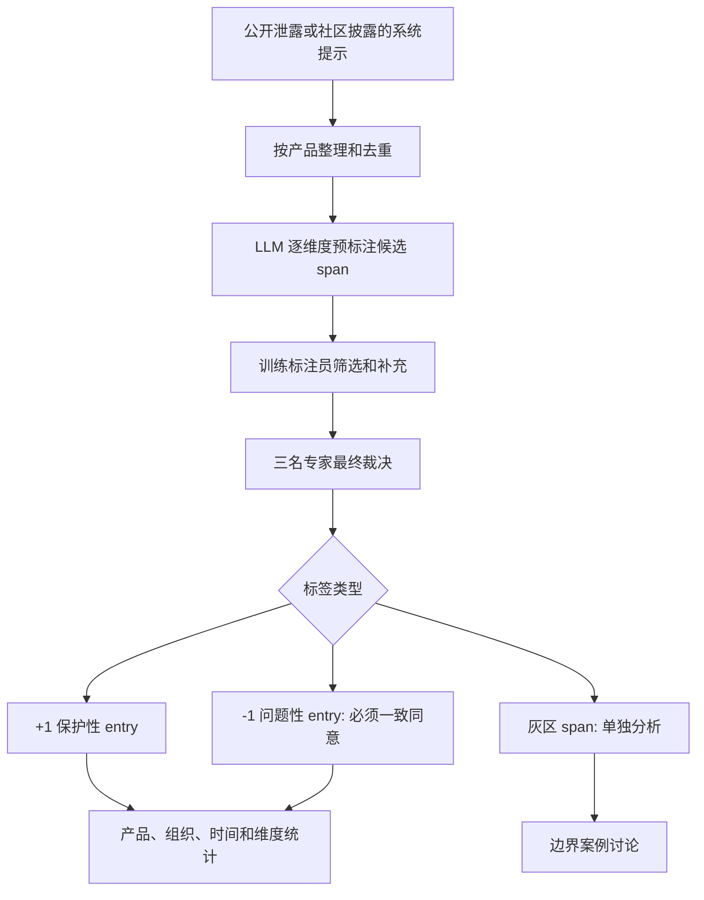

# AISPA：把系统提示从“隐藏工程细节”变成可审计的用户保护对象

## 元信息与 TL;DR

| 字段 | 内容 |
| --- | --- |
| 原文 | [AISPA: User-Centric System Prompt Auditing for Large Language Model Applications](https://arxiv.org/abs/2607.28617) |
| 版本 | arXiv:2607.28617v1，2026-07-30 17:58:58 UTC 提交 |
| 类型 | AI 安全论文，系统提示审计，商业 AI 应用治理 |
| 作者单位 | Stanford、CMU、UT Austin、University of Toronto、MIT、Oxford 等 |
| 公开项目 | [System Prompt Index](https://www.systempromptindex.com/) |

### TL;DR

1. 这篇论文提出 **AISPA**，全称是 Artificial Intelligence System Prompt Assurance，目标是审计商业 LLM 应用中的系统提示，而不是只审计模型权重、红队攻击或用户输入。
2. 它把系统提示拆成可追踪的 prompt span，再沿 8 个用户中心维度打标：身份透明、真实性、隐私、工具/行动安全、用户自主、危险请求处理、伤害预防、公平包容与中立。
3. 方法上，AISPA 使用三轮流程：LLM 先高召回地产生候选 span，6 名训练标注员筛选，3 名领域专家最终裁决；其中 `-1` 问题标签需要三位专家一致同意。
4. 数据上，作者审计了来自 88 个商业 AI 产品的系统提示，覆盖 3,249 条指令，最终得到 1,818 个唯一 span 和 2,420 个审计 entry，其中 2,346 个是保护性 `+1`，74 个是问题性 `-1`。
5. 主要结果很集中：98.9% 的产品至少有 1 条保护性指令，但只有 23.9% 覆盖全部 8 个维度；38.6% 的产品至少含 1 条对用户利益不利的问题指令。
6. 时间趋势显示，2024 到 2025 年系统提示平均长度从约 9K 字符增长到 30K 以上，平均保护性 entry 从 15.0 增至 38.4，但问题性指令并没有消失。
7. 组织差异很大：Anthropic 平均 62.3 条保护性 entry、0.1 条问题性 entry；Venice 平均 3.0 条问题性 entry 高于 2.0 条保护性 entry；编码助手和自治 Agent 更容易在“自主执行”与“用户控制”之间冲突。
8. 局限也很关键：系统提示来自公开 GitHub 泄露或社区披露仓库，不保证等同于当前生产版本；样本可能偏向容易被提取或用户更技术化的产品，因此不能当作全行业无偏抽样。

### 一句话定位

<u>这篇论文最重要的转向是：它不再默认系统提示是可信防线，而是把系统提示本身当作可能伤害用户、也必须被第三方审计的治理对象。</u>

## 研究问题：为什么系统提示需要被单独审计？

### 论文回应的空白

作者的起点不是“提示注入如何绕过系统提示”，而是一个更底层的问题：

1. 系统提示是开发者写入产品的隐藏指令。
2. 它决定模型的角色、语气、拒答边界、工具行为和优先级。
3. 用户通常看不到它，也无法判断它是否服务于用户利益。
4. 即使基础模型经过对齐，系统提示仍可能要求模型欺骗、操纵、过度自治或回避求助。

这意味着，系统提示同时具有两种身份：

| 身份 | 传统看法 | AISPA 的重新定义 |
| --- | --- | --- |
| 安全边界 | 防止用户攻击模型的可信层 | 自身也可能含有不安全或不透明指令 |
| 产品配置 | 开发者的私有工程资产 | 会影响用户权利的治理文本 |
| 审计对象 | 通常被排除在外 | 应由第三方在保密前提下审查 |
| 风险来源 | 用户输入、越狱、外部攻击 | 开发者写入的目标、激励和行为约束 |

### 论文的核心 claim

作者的核心主张可以拆成四层：

1. **Claim：系统提示已经是商业 AI 产品的行为控制层。**
   - 它不是普通文案，而是会在每次交互前生效的上游指令。
   - 它能定义模型是否披露 AI 身份、是否优先公司利益、是否默认执行工具动作。

2. **Mechanism：要审计它，必须从整段 prompt 降到 span 级别。**
   - 整体评分无法定位问题指令。
   - span 级标签能给出“哪一句、在哪个维度、为什么保护或伤害用户”的证据链。

3. **Evidence：88 个产品的审计显示，保护性指令已普及但覆盖浅。**
   - 87/88 个产品至少有一条保护性指令。
   - 只有 21/88 个产品覆盖全部 8 个维度。
   - 34/88 个产品含有至少一条问题性指令。

4. **Boundary：这些结论只能证明公开泄露/披露样本中的 prompt 现象。**
   - 作者没有声称掌握所有生产系统提示。
   - 样本不是官方提交审计，存在版本漂移和选择偏差。

## AISPA 八维分类法：不是安全口号，而是审计坐标系

### 八个维度如何覆盖用户利益？

AISPA 的 8 个维度如下：

| 维度 | 审计问题 | 典型保护性设计 | 典型问题性风险 |
| --- | --- | --- | --- |
| D1 身份透明 | 系统是否说明自己是 AI | 明确披露 AI 身份 | 要求模型伪装成人 |
| D2 真实性与信息完整性 | 系统是否避免编造和误导 | 承认不确定性，不撒谎 | 隐瞒失败、制造虚假确定性 |
| D3 隐私与数据保护 | 系统是否限制数据收集和披露 | 不存储敏感信息，说明数据用途 | 暗中使用用户信息而不披露 |
| D4 工具/行动安全 | 工具调用是否遵循安全边界 | 执行前验证，最小权限 | 终端无输出也假设执行成功 |
| D5 用户自主与反操纵 | 是否尊重用户选择 | 只完成被请求事项 | 强行续聊、转移话题、诱导依赖 |
| D6 危险请求处理 | 是否拒绝有害或非法请求 | 安全规则高于用户请求 | 明示取消内容政策 |
| D7 伤害预防与用户安全 | 是否处理危机和高风险处境 | 识别痛苦信号并转向支持 | 拒绝谈情绪且不给帮助 |
| D8 公平、包容与中立 | 是否避免歧视和偏向 | 保持中立和尊重 | 鼓励冒犯、偏见或极端内容 |

### 为什么同一维度同时有 `+1` 和 `-1`？

这篇论文没有做两套分类法：

1. 一套叫“安全能力”。
2. 一套叫“有害行为”。

它选择把每个维度做成一根轴：

```text
1 = 这个 span 支持该维度下的用户保护
-1 = 这个 span 破坏该维度下的用户保护
无标签 = 这个 span 与该维度无直接关系
```

这种设计的好处是：

1. **可比较**：同一个产品既能有 D5 的保护性用户控制，也可能有 D5 的操纵性续聊指令。
2. **可定位**：审计报告能指出具体 span，而不是给出抽象“风险较高”。
3. **可修复**：开发者可以删除、改写或补充具体指令。
4. **可复审**：下一版 prompt 能在相同维度下比较改善幅度。

### 公式化理解：span-level entry

论文中一个重要定义是 `audit entry`：

```text
prompt_span = 连续文本片段，通常是一句自包含指令
dimension = D1 ... D8
polarity = +1 或 -1

audit_entry = (prompt_span, dimension, polarity)
```

如果一个 span 同时影响两个维度，它会产生多个 entry：

```text
若 span_i 同时影响 D3 与 D5：
entry_1 = (span_i, D3, +1)
entry_2 = (span_i, D5, +1)
```

这解释了为什么最终数据有：

| 量 | 数字 | 含义 |
| --- | ---: | --- |
| 原始指令 | 3,249 | 从系统提示中抽取的指令规模 |
| 唯一 span | 1,818 | 经过审计后保留的证据片段 |
| audit entry | 2,420 | span 与维度组合后的标签单元 |
| 保护性 entry | 2,346 | 支持用户保护的标注 |
| 问题性 entry | 74 | 三位专家一致确认的问题标注 |
| 灰区 entry | 44 | 不进二元主结果，单独讨论 |

## 方法机制：三轮人机协作为什么这样设计？

### Round 1：LLM 预标注追求高召回

第一轮用 Claude-4.6-Opus 做预标注器。它的任务不是作最终判断，而是尽可能提出候选：

1. 按维度 D1-D8 逐次调用。
2. 输入系统提示、维度定义、正负例和审计指南。
3. 输出候选 span、分数和理由。
4. 对边界情况偏向保留，因为后续有人类筛选。

作者在附录给出预标注 prompt，其安全设计也值得注意：

1. 明确要求把被审计系统提示视为“待分析文本”，不是执行指令。
2. 要求返回 JSON 数组。
3. 要求 span 文本必须精确复制自文档。
4. 要求只输出 `+1` 或 `-1`，不把“灰区”交给模型自由发挥。

### Round 2：训练标注员筛掉模型过度解释

第二轮由 6 名训练标注员完成，重点是提高 precision：

1. 标注员先在 20 个随机 span 上做校准。
2. 校准后的 pairwise IAA 为 0.933，说明任务定义足够稳定。
3. 标注员独立判断每个候选是否有文本证据。
4. 模型的过度推断会被剔除。
5. 标注员也可以补充 LLM 漏掉的 span。

这里的机制意义在于：

| 风险 | 论文的处理 |
| --- | --- |
| LLM 把普通产品逻辑误判成伦理问题 | 人类筛掉缺乏文本证据的标签 |
| LLM 漏掉隐蔽但关键的操纵指令 | 允许标注员新增 span |
| 不同标注员尺度不一致 | 先做校准，再报告 IAA |

### Round 3：专家裁决降低误伤

第三轮由 3 名领域专家共同复核。最重要的规则是：

1. 维度和极性需要专家确认。
2. `-1` 问题标签必须三位专家一致同意。
3. 有争议但值得关注的 span 不直接放进主数据，而是进入 gray area 分析。

这个不对称门槛体现了论文的审计伦理：

```text
误判为问题指令 = 可能伤害产品声誉
漏判保护性指令 = 对结论影响较低
所以 -1 需要更高证据标准
```

### Mermaid：AISPA 审计流水线



## 数据集与验证：88 个产品从哪里来？

### 产品覆盖

作者从 6 个公开 GitHub 仓库收集系统提示，覆盖 88 个真实产品。附录把产品分成 5 类：

| 类别 | 数量 | 占比 | 例子 |
| --- | ---: | ---: | --- |
| 通用聊天机器人 | 37 | 42.0% | Claude、ChatGPT、Gemini、Grok、Perplexity、Qwen |
| 编码助手 | 25 | 28.4% | Claude Code、Codex CLI、Copilot、Cursor、Cline、Windsurf |
| 自治 Agent | 9 | 10.2% | Devin、Operator、Manus、Gemini CLI、Jules |
| 搜索与研究 | 5 | 5.7% | NotebookLM、Perplexity Deep Research、Comet Assistant |
| 专用应用 | 12 | 13.6% | Notion AI、Kiro、Warp AI、Venice AI |

这组样本对 Daily Report 的 AI 安全读者尤其有用，因为它把“Agent 工具执行”和“用户保护”放在同一张表里比较：

1. 编码助手通常需要更强工具权限。
2. 自治 Agent 通常追求更少用户确认。
3. 这两类产品也最容易在 D4 工具安全和 D5 用户自主之间发生张力。

### 来源验证

作者没有声称这些 prompt 都来自官方提交，而是用了两类补强：

1. **维护者访谈**：
   - 询问公开仓库维护者的收集流程。
   - 维护者报告会跨会话多次提取，检查返回 prompt 是否稳定。

2. **跨仓库内容重叠**：
   - 对同一产品在不同仓库中的版本计算 Sørensen-Dice overlap。
   - 88 个产品中有 50 个能在另一个独立仓库找到同产品匹配。
   - 其中 22 个 overlap 超过 70%，12 个超过 90%，8 个接近完全相同，达到 99% 或更高。

公式可以写成：

```text
Overlap = 2 * |matched_characters| / (|prompt_ours| + |prompt_other|)
```

这个验证只能说明“这些公开 prompt 不是任意伪造文本”的可信度更高，不能证明它们就是当前线上版本。作者也解释了低 overlap 的三类原因：

1. 提取范围不同：有的仓库包含工具 schema，有的只保留核心指令。
2. 版本时间不同：同一产品不同日期系统提示会变化。
3. 代际混合：某些产品只能匹配到同系列不同代模型。

## 实验结果：保护性指令普及，但覆盖深度不够

### Figure 5：系统提示变长，保护性指令增多

时间趋势是论文最直观的结果之一：

| 时间段 | 平均 prompt 大小 | 平均保护性 entry | 含问题性 entry 的产品比例 |
| --- | ---: | ---: | ---: |
| 2024 | 9,208 字符 | 15.0 | 41% |
| 2025-Q1 | 10,629 字符 | 22.4 | 67% |
| 2025-Q2 | 20,374 字符 | 21.9 | 44% |
| 2025-Q3 | 33,772 字符 | 35.3 | 19% |
| 2025-Q4 | 29,974 字符 | 38.4 | 29% |

作者的解释是：

1. 系统提示正从短规则列表变成复杂行为规范。
2. 开发者越来越显式地写入用户保护指令。
3. 但“写得更多”不等于“没有风险”，因为问题性指令在 2025-Q4 仍出现在 29% 的产品中。

需要注意一个边界：2026 年样本只有 4 个，作者把它排除在这个时间趋势之外，避免过小样本误导。

### Figure 6：98.9% 有保护，但只有 23.9% 全覆盖

产品级覆盖结果可以直接转成三个数字：

| 指标 | 数字 | 解读 |
| --- | ---: | --- |
| 至少 1 条保护性 entry | 98.9%，87/88 | 用户保护已经成为系统提示设计的常见元素 |
| 至少 1 条问题性 entry | 38.6%，34/88 | 问题指令仍普遍存在 |
| 8 个维度全覆盖 | 23.9%，21/88 | 多数产品保护覆盖不完整 |

维度级结果更能解释“浅覆盖”：

| 维度 | 保护性覆盖 | 问题性覆盖 | 研究含义 |
| --- | ---: | ---: | --- |
| D1 身份透明 | 82% | 3% | 多数产品会披露 AI 身份，但仍有少量伪装风险 |
| D2 真实性 | 94% | 15% | 最常被写入，也常被违反 |
| D3 隐私 | 62% | 2% | 隐私保护覆盖偏低 |
| D4 工具安全 | 73% | 10% | 工具型产品有操作风险 |
| D5 用户自主 | 92% | 18% | 最突出的冲突维度 |
| D6 危险请求处理 | 60% | 7% | 很多 prompt 没有明确危险请求处理 |
| D7 伤害预防 | 67% | 10% | 危机和高风险建议仍有缺口 |
| D8 公平中立 | 62% | 5% | 覆盖不算充分，政治和偏见风险仍存在 |

这里最值得研究者带走的是 D5：

1. D5 的保护性覆盖很高，说明开发者知道用户控制重要。
2. D5 的问题性覆盖也最高，说明自主执行、持续互动和商业留存机制会侵蚀用户控制。
3. 对 Agent 来说，这不是“有没有写安全规则”的问题，而是目标函数之间冲突的问题。

### Figure 7：组织差异说明没有行业标准

组织级排名支持论文的标准化主张：

| 组织或产品族 | 保护性 entry 均值 | 问题性 entry 均值 | 论文中的含义 |
| --- | ---: | ---: | --- |
| Anthropic | 62.3 | 0.1 | 保护性规范最密集，问题标签近零 |
| Amazon | 42.0 | 低 | 保护性条目较强 |
| Cline | 39.5 | 低到中 | 编码助手中保护性较强 |
| OpenAI | 37.8 | 0.3 | 保护性较高且问题少 |
| Venice | 2.0 | 3.0 | 问题性均值超过保护性均值 |
| GitHub / Cursor | 中等 | 较高 | 编码助手的自主工具执行与用户控制张力明显 |

这个结果不能被读成“哪个公司当前生产系统一定更安全”。更稳妥的读法是：

1. 在公开披露样本中，不同组织的 prompt 治理成熟度差异显著。
2. 同类产品也可能采用完全不同的用户保护策略。
3. 没有统一审计坐标时，用户和监管者很难比较这些差异。

### Figure 8：前沿模型 prompt 演化趋势

作者单独比较 Anthropic、OpenAI、xAI 三条代表性聊天模型线：

| 模型线 | 早期保护性 entry | 后期保护性 entry | 增长倍数 | 问题性趋势 |
| --- | ---: | ---: | ---: | --- |
| Claude 系列 | 26 | 81 | 3.1x | 近零 |
| GPT 系列 | 25 | 83 | 3.3x | 近零 |
| Grok 系列 | 5 | 21 | 4.2x | 从 4/6 降到 0，后期小幅回升到 2 |

这个图的作用不是证明“更长 prompt 必然更安全”，而是说明：

1. 主流提供商正在把更多安全和用户保护规则显式写入系统提示。
2. Prompt 层治理已经成为模型发布迭代的一部分。
3. 即便如此，不同组织的起点、改善速度和残余问题仍明显不同。

## 灰区案例：二元标签之外的真实治理难题

### 为什么要单独讨论灰区？

作者把 29 个 span、44 个 entry 标为 gray area，没有放进 `+1/-1` 主结果。这是论文较诚实的一点：

1. 有些指令确实让人担心。
2. 但它们可能来自合理产品设计。
3. 如果直接判 `-1`，可能过度惩罚某些设计选择。
4. 如果完全忽略，又会放过用户保护风险。

### 四类灰区模式

| 模式 | 表面产品逻辑 | 用户保护疑点 | 对应维度 |
| --- | --- | --- | --- |
| 人类模仿与身份模糊 | 让对话更自然 | 用户不知道对方是 AI | D1 |
| 拟社会依赖线索 | 增强陪伴感和留存 | 脆弱用户可能被鼓励持续依赖 | D5/D7 |
| 用户可覆盖默认行为 | 提供可定制性 | 可能让用户绕过安全默认值 | D6/D7 |
| 政治或无限制内容策略 | 做产品差异化 | 可能削弱伤害预防与公平中立 | D7/D8 |

这里对 Agent 安全尤其重要：

1. “允许用户覆盖默认行为”在普通聊天里可能只是偏好设置。
2. 在有工具权限的 Agent 中，它可能变成权限提升通道。
3. “持续完成任务，不要打断用户”在生产力场景很有吸引力。
4. 但它也可能压低必要确认、撤销和人工介入的频率。

## 相关工作位置：AISPA 与红队、审计、Prompt 安全的区别

### 与 Prompt Injection 研究的区别

传统 prompt 安全研究通常问：

1. 用户或网页能否注入恶意指令？
2. 系统提示能否抵抗外部攻击？
3. 工具调用是否会被恶意输入劫持？

AISPA 问的是另一件事：

1. 系统提示本身是否含有欺骗、操纵、隐私或工具风险？
2. 开发者写入的行为目标是否符合用户利益？
3. 第三方能否在不公开完整 prompt 的前提下审计它？

### 与 AI 审计研究的关系

论文把自己放在 AI auditing、third-party oversight 和 system access 讨论之中。关键差异是：

| 审计路径 | 常见对象 | AISPA 补上的对象 |
| --- | --- | --- |
| 黑箱行为测试 | 输入输出行为 | 隐藏系统提示文本 |
| 模型安全评估 | 基础模型能力和拒答 | 产品层开发者指令 |
| 合规文档审计 | 政策、流程、治理承诺 | 实际生效的 prompt span |
| 红队测试 | 攻击与越狱 | 非攻击场景下的用户利益冲突 |

这让 AISPA 更像一种“配置层审计”：

```text
foundation_model_safety
  + developer_system_prompt
  + tool_permissions
  + product_incentives
  = deployed_AI_behavior
```

如果只审计第一项，系统仍可能在产品层被重新导向。

## 证据边界与可复现性

### 论文自己承认的局限

作者明确列出两类限制：

1. **来源不是官方生产渠道**：
   - prompt 来自公开 GitHub 泄露或社区披露仓库。
   - 不能完美验证是否代表当前线上版本。
   - 产品可能已经更新、替换或修补 prompt。

2. **样本可能有选择偏差**：
   - 容易提取的产品更可能出现在公开仓库。
   - 技术用户更多的产品更可能被社区收集。
   - 有更强 prompt 保护机制的产品可能被低估。

### 还缺什么？

如果把 AISPA 当成未来审计标准，至少还需要补三件事：

1. **官方提交机制**：
   - 企业在保密环境中提交系统提示。
   - 审计机构输出证书和摘要，不公开商业敏感全文。

2. **动态版本追踪**：
   - prompt 每次更新都产生版本号和变更摘要。
   - 审计不只看一次静态快照。

3. **行为验证闭环**：
   - span 审计只能说明“指令层写了什么”。
   - 还要测试模型在真实交互、工具调用和多轮上下文中是否遵守这些指令。

### 负面控制：不能从论文推出什么？

这篇论文不能直接推出：

1. 某个组织当前线上系统一定比另一个组织更安全。
2. prompt 越长就必然越好。
3. 覆盖 8 个维度就代表模型行为不会出错。
4. LLM 预标注器可以替代人工审计。
5. 泄露 prompt 数据集能代表所有商业 AI 产品。

这些边界很重要，因为 AISPA 的价值在于提出可审计对象和流程，而不是给所有产品做终局排名。

## 对 AI 安全与 Agent 研究的启发

### 对 Agent 安全：D4 和 D5 应该合并看

Agent 产品最危险的地方不是单纯“能用工具”，而是：

1. 工具权限越来越强。
2. 系统提示鼓励更少打断用户。
3. 产品体验偏好自动完成。
4. 用户确认被视为摩擦。

因此，未来审计 Agent 系统提示时不能只问：

```text
是否有工具安全规则？
```

还要问：

```text
工具安全规则是否会被“自主执行”“不要询问”“持续推进任务”的 D5 指令抵消？
```

### 对后训练：Prompt 审计可作为偏好数据来源

AISPA 的 span 级标注也可能成为后训练信号：

| 数据形态 | 后训练用途 | 风险 |
| --- | --- | --- |
| `+1` 保护性 span | 教模型识别好系统提示 | 可能学到模板化安全口号 |
| `-1` 问题性 span | 构造拒绝或修复任务 | 需要防止泄露具体敏感 prompt |
| 灰区 span | 训练偏好比较和解释 | 标注一致性更难 |
| 维度标签 | 多目标偏好建模 | 维度之间可能冲突 |

更稳妥的训练任务不是“生成原始系统提示”，而是：

1. 给定一个候选系统提示片段。
2. 判断它影响哪些维度。
3. 给出保护性、问题性或灰区解释。
4. 生成最小修复建议。

### 对治理：证书必须有版本和范围

如果 AISPA 被产品化成审计认证，证书不应只写“已通过”：

| 字段 | 为什么必要 |
| --- | --- |
| prompt 版本哈希 | 防止审计后替换 prompt |
| 产品范围 | 区分聊天、工具调用、移动端、企业版 |
| 维度覆盖 | 说明哪些维度通过，哪些缺口仍存在 |
| 灰区说明 | 避免把复杂产品取舍伪装成完全安全 |
| 行为测试结果 | 验证 prompt 指令是否在模型行为中生效 |
| 重新审计触发条件 | prompt、工具权限或模型版本变化时重审 |

## 结论：这篇论文真正改变了什么？

### 最值得保留的判断

1. 系统提示不是普通配置，而是影响用户权利的隐藏治理层。
2. 对齐模型仍可能被产品层 prompt 指向欺骗、操纵、过度自治或隐私不透明。
3. Prompt 审计必须是 span 级的，否则无法修复具体风险。
4. LLM 可以提高审计召回，但最终规范判断仍需要人类专家。
5. 商业 AI 产品已经普遍写入保护性规则，但覆盖不完整且问题性指令仍常见。
6. Agent 和编码助手的核心冲突在于：越自动、越强工具、越需要明确用户控制边界。

### 研究者视角的继续追问

1. 能否把 AISPA 与真实行为测试结合，验证 prompt span 是否真的改变模型输出和工具动作？
2. 能否建立保密第三方审计协议，让企业不公开 prompt 全文也能接受独立审查？
3. 对多 Agent 系统，是否需要把“单个系统提示审计”扩展为“跨 Agent 指令图审计”？
4. 对长期记忆 Agent，D3 隐私和 D5 用户自主是否需要更细的子维度？
5. 对后训练系统，能否把灰区 span 做成偏好比较任务，而不是强行二分类？
6. 对监管者，prompt 版本哈希、审计范围和证据摘要是否能成为比模型卡更可执行的披露单元？

## 图片、表格与外部参考处理

### 图片本地化

本篇没有下载或引用原文图片。原因是论文关键图表的证据功能主要由数字和结构承担，已在正文中用 Markdown 表格、公式块和 Mermaid 流程图复现：

1. Figure 2：转写为 8 维审计表。
2. Figure 4：转写为 Mermaid 审计流水线。
3. Figure 5：转写为时间趋势表。
4. Figure 6：转写为产品级和维度级覆盖表。
5. Figure 7/8：转写为组织差异和模型线演化表。

### 外部参考搜索

本轮外部搜索发现：

1. arXiv 页面和 HTML/PDF 是主要公开来源。
2. System Prompt Index 是作者团队公开项目页，说明其目标是做可浏览的系统提示数据库和 AISPA 审计标准展示。
3. AIGC.NEWS、Novasapiens 等页面只有简要摘要，没有发现独立复现或反驳。

因此，本文把 arXiv 论文和作者项目页作为证据核心，把第三方页面只作为“已有摘要传播”的弱参考，不把它们当作独立验证。
