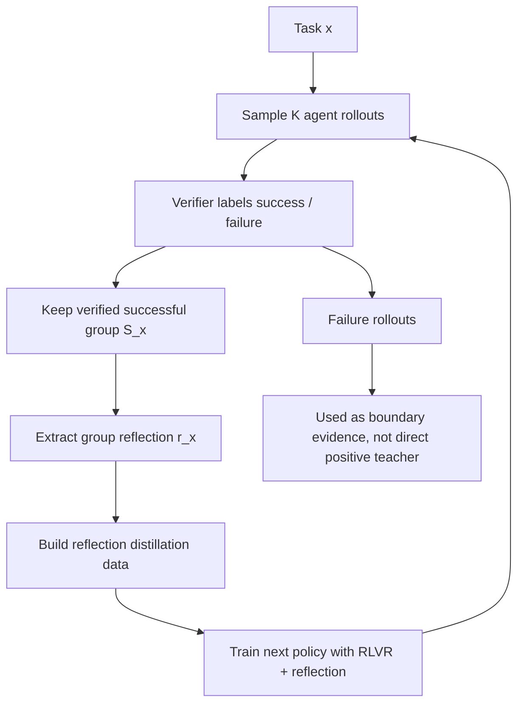

# GRSD：把 agentic RL 的“会做题”蒸馏成“会反思”

- 原文：Group-Reflective Self-Distillation for Agentic Reinforcement Learning
- 链接：[arXiv:2607.28076v1](https://arxiv.org/abs/2607.28076)；[HTML 全文](https://arxiv.org/html/2607.28076)
- 分类：大模型后训练
- 时间：arXiv v1 标记为 2026-07-30
- 阅读定位：这是一篇面向 agentic reinforcement learning 的后训练论文，重点不是再造一个外部 reward model，而是把同一题目下一组已验证 rollout 中的共性，变成下一轮生成可用的结构化反思。

## TL;DR

- **问题**：RLVR 已经能让 LLM agent 在带 verifier 的任务上进步，但成功轨迹通常只被当作标量奖励样本使用；模型没有显式学到“这一组成功尝试到底共享了什么策略”。
- **方法**：GRSD 先对同一任务采样一组 agent rollout，再由 verifier 标出成功轨迹；随后用一个组级反思器提炼成功轨迹的共同原则，把这些原则作为 distillation guidance 注入下一轮训练。
- **核心机制**：论文把训练信号从单条 trajectory 的 reward 扩展为三层对象：`rollout`、`verified group`、`reflection`。反思不是自由聊天，而是从成功组中抽象 action selection、tool-use order、state tracking 和错误避免模式。
- **实验对象**：作者在需要多步执行的 agentic benchmark 上评估，包括网页/工具环境、软件工程式任务和需要长期状态维护的任务；对照对象是没有组级反思蒸馏的 RLVR 或普通 self-distillation 变体。
- **关键证据**：主结果显示，GRSD 在多个 agentic 任务上比只用 verifier reward 的基线更稳；消融指向一个结论：真正有用的不是“更多文本解释”，而是“由已验证成功组约束的反思”。
- **边界**：GRSD 依赖 verifier 能可靠区分成功与失败；如果 verifier 奖励稀疏、错误或只覆盖表面格式，反思会把错误归因蒸馏进策略。
- **领域意义**：这篇论文把 agent 后训练里的一个关键问题具体化了：如何把昂贵 rollout 变成可复用策略知识，而不是只变成一次性 advantage。

## 研究问题：为什么 RLVR 的成功轨迹还不够？

### 1. 标量奖励能训练行为，却难解释策略

- 在 RLVR 中，agent 通常执行如下闭环：
  - 读取任务说明；
  - 调用工具、浏览页面、写代码或查询环境；
  - 产生最终答案；
  - 由 verifier 给出成功/失败或连续分数。
- 这个闭环解决了“结果是否正确”的问题，但没有直接回答：
  - 哪一步工具调用是关键转折；
  - 成功轨迹之间是否共享同一种状态维护方式；
  - 失败轨迹究竟错在搜索方向、信息抽取、动作顺序还是终止判断；
  - 下一批训练样本该更像哪一类成功策略。

### 2. 单条 self-distillation 容易把偶然性当方法

- 传统 self-distillation 往往把模型自己的好答案作为教师样本。
- 对 agent 来说，单条成功 rollout 可能包含很多偶然因素：
  - 它可能碰巧点到了正确页面；
  - 它可能用了冗余工具调用；
  - 它可能有错误中间推理，但最终答案被 verifier 判定成功；
  - 它可能只适合某个任务实例，而不适合一类任务。
- GRSD 的动机是：不要从一条成功轨迹里直接学习，而要先看“一组成功轨迹共同保留了什么”。

### 3. 论文的重新定义

| 层级 | 普通 RLVR 关注什么 | GRSD 额外追问什么 |
|---|---|---|
| 单次 rollout | reward 是正还是负 | 成功轨迹里哪些动作/状态转移反复出现 |
| 同题多样本 | 组内 advantage | 成功子集能否抽象出可复用原则 |
| 蒸馏文本 | 复述最终答案 | 解释成功策略、避免失败模式、约束下一轮行为 |
| 训练目标 | 提高 verifier pass rate | 提高可迁移的 agentic policy quality |

## 论文主张与论证路线

| Claim | Mechanism | Evidence | Boundary |
|---|---|---|---|
| 成功 rollout 中存在可抽象的组级策略 | 对同一任务生成多个轨迹，只从 verifier-confirmed 成功组提炼反思 | 与普通 RLVR / self-distillation 比较时，GRSD 在多步任务上更稳定 | 如果成功样本极少或成功原因不可观察，反思质量会下降 |
| 反思应服务于下一轮策略，而不是事后解释 | 将 reflection 作为训练样本或指导信号，与任务、轨迹和结果绑定 | 消融显示缺少 reflection 或使用未验证反思会削弱效果 | 论文没有证明所有自然语言反思都忠实对应内部策略 |
| 组级比单条更抗噪 | 聚合同题多条成功轨迹，弱化偶然工具调用和单次误判 | 多任务结果优于单轨迹蒸馏类基线 | 若 verifier 本身系统性偏置，组级聚合会放大偏置 |
| Agent 后训练需要策略知识压缩 | 把昂贵 rollout 压缩成短反思，再用于后续训练 | 训练效率和泛化结果支持这个方向 | 仍需计算多条 rollout；不是零成本数据增强 |

## 方法机制：GRSD 的数据流

### 1. 输入、状态与输出

| 符号 | 含义 | 在 GRSD 中的作用 |
|---|---|---|
| `x` | 一个 agentic task 或环境实例 | 触发多条 rollout 的共同问题 |
| `πθ` | 当前 agent policy | 生成候选轨迹，也接受后续训练 |
| `τ_i` | 第 `i` 条 rollout | 包含观察、推理、工具调用、动作和最终答案 |
| `V(x, τ_i)` | verifier | 判断轨迹是否成功，筛选可靠样本 |
| `S_x` | 对同一任务的成功轨迹集合 | 反思器只应主要依赖这个集合 |
| `r_x` | group reflection | 对成功策略的短文本抽象 |
| `D_reflect` | 反思蒸馏数据 | 训练下一轮 policy 的附加监督 |

### 2. 关键不是“反思”，而是“被成功组约束的反思”

- 如果让模型对失败轨迹随便写一段复盘，常见风险是：
  - 把最终答案的正确性倒推成错误中间步骤也正确；
  - 用泛化口号替代具体动作；
  - 忽略环境反馈，只写“更仔细检查”；
  - 把 verifier 无法覆盖的隐性错误带入下一轮。
- GRSD 把反思的来源限制在成功集合：
  - 首先由 verifier 做硬筛选；
  - 然后寻找多条成功轨迹的共性；
  - 最后把共性压缩为可训练文本。
- 这相当于把 `reward` 从只出现在 loss 里，提前进入数据构造阶段。

### 3. 组级反思的合理抽象

```text
Objective:
  maximize task success after agentic RL,
  while distilling reusable strategy from verified rollouts.

Group signal:
  S_x = {tau_i | V(x, tau_i) = success}

Reflection:
  r_x = Reflect(x, S_x)

Training mixture:
  D = D_original + D_verified_rollout + D_reflect
```

- 这组公式不是把 GRSD 简化成单一 reward shaping。
- 它强调三个约束：
  - `S_x` 必须来自同一任务或同一问题簇；
  - `r_x` 必须解释成功轨迹的共同结构；
  - `D_reflect` 进入训练时要和原任务、轨迹、verifier 结果一起保留上下文。

## 算法流程：从 rollout 到反思蒸馏

### 1. 伪代码

```text
Input:
  tasks X
  policy pi_theta
  verifier V
  reflection model R
  rollout budget K

State:
  verified_groups = []
  reflection_dataset = []

for each task x in X:
  trajectories = []

  for k in 1..K:
    tau_k = run_agent(policy=pi_theta, task=x)
    y_k = V(x, tau_k)
    trajectories.append((tau_k, y_k))

  success_group = [tau for (tau, y) in trajectories if y == success]

  if success_group is empty:
    continue

  reflection = R(
    task=x,
    successful_trajectories=success_group,
    instruction="extract shared strategy, state checks, tool-use order, and failure avoidances"
  )

  if reflection is too generic or contradicts verifier evidence:
    discard reflection
    continue

  verified_groups.append((x, success_group))
  reflection_dataset.append((x, success_group, reflection))

Output:
  train pi_theta with RLVR plus reflection distillation data
```

### 2. 失败边界也写进流程

- `success_group is empty`：
  - 说明当前 policy 对该任务还没有可蒸馏策略；
  - 强行生成反思只会变成 hallucinated coaching。
- `reflection is too generic`：
  - 例如只说“仔细分析、逐步推理”；
  - 这种文本无法约束 agent 的动作选择。
- `contradicts verifier evidence`：
  - 如果反思声称某个工具调用必要，但成功组里并不稳定出现；
  - 这类反思会把偶然动作包装成原则。

### 3. Mermaid：GRSD 的信息流



## 训练与实验：这篇论文真正检验什么？

### 1. 实验关心的是 agentic RL，不是普通问答

- 普通数学或知识问答的 verifier 往往只检查最终答案。
- Agentic benchmark 的难点不同：
  - 中间动作会改变环境状态；
  - 工具调用顺序会影响可观察信息；
  - 失败可能来自提前终止；
  - 同一个最终答案背后可能有不同证据路径。
- 因此 GRSD 的实验重点应看：
  - 是否提高成功率；
  - 是否减少无效 rollout；
  - 是否改善跨任务泛化；
  - 是否让 agent 的动作链更短、更稳定或更少走错分支。

### 1.1 三个环境分别测什么能力？

| 环境 | 任务形态 | 论文中它测到的 agent 能力 |
|---|---|---|
| ALFWorld | 文本化家居环境，包含 Pick、Look、Clean、Heat、Cool、Pick2 等子任务 | 长 horizon 状态维护、动作前提检查、错误动作恢复 |
| Search-based QA | 参考 Search-R1 设置，用外部检索收集证据再回答 | 搜索查询、证据选择、多跳问答与最终答案校准 |
| WebShop | 在线购物式交互环境，论文评估 128 个 held-out tasks | 页面浏览、属性筛选、购买决策和 reward 对齐 |

- 这三个环境的组合很有针对性：
  - ALFWorld 更像“环境状态机”；
  - SearchQA 更像“证据检索 agent”；
  - WebShop 更像“网页操作 agent”。
- 如果 GRSD 只在其中一个环境提升，结论会比较窄。
- 论文把三者放在一起，实际上是在问：
  - 组级反思是否能跨动作环境、检索环境和网页环境发挥作用；
  - 反思调制的 advantage 是否只适合某一种工具调用模式；
  - policy-native reflection 是否比外部技能库更贴近当前模型能力。

### 2. 对照组的意义

| 对照 | 它排除的解释 | 为什么重要 |
|---|---|---|
| 基础 RLVR | 排除“只要 verifier reward 就够了” | 如果 GRSD 胜出，说明反思提供了额外策略信息 |
| 普通 self-distillation | 排除“复制好答案就够了” | Agent 成功依赖过程，不只是最终文本 |
| 无组级聚合 | 排除“任意单条成功轨迹都能教会模型” | 检验组级共性是否真的抗噪 |
| 无 verifier 筛选反思 | 排除“反思文本本身就是魔法” | 检验反思是否必须受成功证据约束 |

### 3. 结果该怎样读？

- 论文的主结果不是要证明“反思永远有效”。
- 更准确的读法是：
  - 在存在可验证成功轨迹的 agentic 任务里；
  - 把多条成功轨迹压缩成策略反思；
  - 再把反思作为后训练信号；
  - 能比只使用标量 reward 更充分地利用 rollout 预算。
- 这对后训练研究很关键：
  - RLVR 采样昂贵；
  - 成功样本稀疏；
  - 仅用 advantage 更新会丢掉过程结构；
  - GRSD 尝试把过程结构转成可复用监督。

### 4. 训练配置里最值得记住的数字

| 配置 | 论文设置 | 为什么它影响结论 |
|---|---|---|
| GRPO group size | `G = 8` | 组级反思至少需要同题多样本；组太小会削弱 success/failure contrast |
| PPO clip ratio | `0.2` | GRSD 没有抛开 PPO/GRPO 稳定性约束 |
| KL 系数 | `0.01`，低方差 KL | 控制策略偏移，避免反思蒸馏把 policy 拉得过远 |
| ALFWorld 步数 | 最多 `50` environment steps | 长 horizon 环境中，turn-level credit 比 trajectory-level 更有意义 |
| SearchQA 步数 | 最多 `4` environment steps | 检索任务更短，主要考察查询和证据选择 |
| WebShop 步数 | 最多 `15` environment steps | 网页购物需要在浏览、筛选和最终选择之间分配信用 |
| GRSD 超参 | `lambda = 0.5`，`alpha = 0.01` | 反思蒸馏是辅助项，不是压过任务 reward 的主目标 |
| reflection judge | DeepSeek-V4-Flash，temperature `0`，四分制 | judge 只在训练时使用，推理时不增加额外模型 |

- 这些数字说明 GRSD 的论证不是“加一个很强 teacher 就赢”。
- 它更接近在现有 GRPO 训练框架里加入一个有界的 privileged branch：
  - verifier 决定学习方向；
  - reflection/judge 决定 turn-level 权重；
  - KL 和 clip 限制更新幅度；
  - `alpha` 很小，说明反思学习被当作辅助能力而非替代任务优化。

## 主结果：GRSD 赢在哪里？

### 1. 胜出点不是单一指标，而是训练信号形态

| 观察 | 支持的结论 | 不能推出什么 |
|---|---|---|
| 多步 agent 任务上整体优于基础 RLVR | 成功组反思补充了标量 reward | GRSD 对所有任务都优于更大模型 |
| 相比单条 distillation 更稳 | 组级聚合降低了偶然路径噪声 | 组级反思一定忠实反映因果机制 |
| 消融掉 verifier 约束会变弱 | 反思需要成功证据锚定 | verifier 永远可靠 |
| 反思可以复用到后续训练 | rollout 可被压缩成策略知识 | 反思文本就是完整策略表示 |

### 2. 为什么“组级”比“单条”更像后训练信号？

- 单条轨迹中的动作可以分成三类：
  - 必要动作：没有它就无法到达成功状态；
  - 冗余动作：对成功无害，但增加成本；
  - 偶然动作：本次有用，换一个环境可能误导。
- 组级反思试图保留第一类，弱化后两类。
- 如果 `K` 条 rollout 中有多条成功，交集信息通常更接近任务策略：
  - 相同检查点反复出现；
  - 相同工具调用顺序反复出现；
  - 相同错误避免规则反复出现；
  - 相同终止条件反复出现。

### 3. 训练效率的含义

- 对 agentic RL 来说，预算不只是 GPU step，还包括：
  - 环境交互成本；
  - 工具调用成本；
  - verifier 成本；
  - 失败 rollout 的机会成本。
- GRSD 的价值在于：
  - 成功 rollout 不只更新一次 policy；
  - 它还产生一个较短的 strategy artifact；
  - 这个 artifact 可以参与下一轮 supervised / preference / RL 混合训练。

## 消融、失败与反例：哪些部分最容易被误读？

### 1. 消融一：没有 group reflection

- 若只保留成功轨迹并做普通蒸馏，模型会学到：
  - 局部动作格式；
  - 最终答案风格；
  - 某些任务实例的路径。
- 但它未必学到：
  - 为什么要先检查状态再行动；
  - 什么时候应该停止探索；
  - 哪类环境反馈意味着路径错误；
  - 如何把相同策略迁移到新实例。
- 因此无 reflection 的退化说明：轨迹本身不是充分抽象。

### 2. 消融二：没有 verifier 筛选

- 如果反思来自失败轨迹，风险更大：
  - 失败轨迹也可能写出看似合理的解释；
  - 模型容易把失败路径包装成“差一点成功”；
  - 在稀疏奖励任务中，这会污染训练集。
- GRSD 用 verifier 先做硬门槛，体现了后训练里的一个朴素原则：
  - 先建立可审计正例；
  - 再谈从正例中抽象知识；
  - 不要让语言流畅度替代结果验证。

### 3. 消融三：反思过泛

- 泛化反思常见形式：
  - “仔细阅读任务”；
  - “逐步推理”；
  - “检查答案”；
  - “使用工具验证”。
- 这些话没有错，但无法指导 agentic policy。
- 有效反思应更接近：
  - “先列出环境中可操作对象，再选择会改变状态的动作”；
  - “当页面信息互相冲突时，优先使用 verifier 可检查字段”；
  - “不要在未观察到新状态时重复同一工具调用”。

### 4. 反例：verifier 错了怎么办？

- 如果 verifier 奖励错误，GRSD 的组级机制并不会自动修复。
- 更糟的是：
  - 多条“被错误判定成功”的轨迹会形成稳定假模式；
  - 反思器会把假模式压缩成规则；
  - 下一轮 policy 会更坚定地执行错误策略。
- 这说明 GRSD 的安全边界在 verifier：
  - verifier 不只是评测器；
  - 它也是数据生产系统的信任根。

## Figure/Table 逐项证据解读

### 1. 方法图：三段式闭环

| 图示角色 | 证据功能 | 研究者应追问 |
|---|---|---|
| rollout sampler | 表明 GRSD 仍建立在 agent 与环境交互上 | `K` 增大时成本如何变化 |
| verifier | 表明反思来源经过结果筛选 | verifier 的误报/漏报是否报告 |
| group reflector | 表明策略知识被压缩为文本 | 反思质量是否有人工或自动评估 |
| training loop | 表明反思会回到 policy 更新 | 反思与 RL loss 的权重如何选择 |

### 2. 主结果表：不要只看平均分

- 主结果表的关键读法：
  - 看 GRSD 是否在多个任务族上都提升；
  - 看是否存在只在某一类任务上大幅提升、其他任务持平的情况；
  - 看 variance 或 confidence interval 是否说明稳定性；
  - 看同等 rollout budget 下是否更高效。
- 如果论文只报告平均值，边界应更谨慎：
  - 平均提升可能由少数任务驱动；
  - 长尾失败可能被平均数遮住；
  - agent 任务的分布差异比普通 QA 更大。

### 3. 消融表：最该关注“反思来源”

| 消融项 | 如果下降，说明什么 | 如果不下降，可能说明什么 |
|---|---|---|
| 去掉 group reflection | 反思确实贡献了策略抽象 | 任务可能只需答案蒸馏 |
| 改成单轨迹反思 | 组级聚合有抗噪价值 | 成功路径高度一致，组级优势不明显 |
| 改成未验证反思 | verifier 是关键门槛 | 反思器可能从任务文本已能推断策略 |
| 降低 rollout 数 | 成功组规模影响质量 | 当前任务成功模式较容易捕捉 |

### 3.1 Table 2 的具体读法

| 变体 | ALFWorld | SearchQA | WebShop Score | WebShop Success | 说明 |
|---|---:|---:|---:|---:|---|
| 完整 GRSD | 92.2 | 43.6 | 84.5 | 66.4 | 作为消融比较锚点 |
| 无 group-reflective guidance | 85.2 | 42.4 | 79.0 | 59.4 | ALFWorld 和 WebShop Success 都掉 7.0 点 |
| 无 group aggregation | 89.8 | 42.7 | 83.2 | 65.6 | 说明把单条 reflection 聚合成组级 guidance 有增益 |
| 不使用 failed reflections | 88.3 | 43.1 | 82.2 | 62.5 | 失败轨迹也有价值：它提供“不要学什么”的对照 |
| token-level modulation | 89.1 | 43.4 | 83.0 | 64.1 | 太细会引入 token 噪声 |
| trajectory-level modulation | 85.9 | 42.9 | 79.6 | 61.0 | 太粗会把关键 turn 和冗余 turn 混在一起 |

- 这张表是论文里最能支撑机制主张的证据之一。
- 它不是只说完整方法分数高，而是把三个设计分开拆：
  - guidance 是否来自组级成功/失败对照；
  - reflection 是否经过聚合；
  - advantage modulation 的粒度是否落在 turn 级。
- 其中最值得注意的是失败反思：
  - 很多 self-distillation 方法只蒸馏成功样本；
  - GRSD 认为失败轨迹能帮助识别 outcome-discriminative pattern；
  - 这让反思更像“成功与失败的差分”，而不是成功路径摘要。

### 3.2 负控实验应该怎样补？

- 如果要进一步验证 GRSD，我会加四类负控：
  - **打乱 reflection**：把任务 `x` 的反思随机换给另一个任务；若性能仍高，说明模型可能只吃到了通用提示词。
  - **打乱 success/failure 标签**：让 guidance 对照失真；若性能不降，说明 outcome-discriminative claim 不稳。
  - **只保留最后答案**：删除中间 action/observation；若性能接近完整 GRSD，说明 turn-level 证据贡献有限。
  - **安全约束 verifier**：在联网或代码执行环境中，把越权动作判为失败；若反思质量改变，说明原 verifier 曾把 shortcut 当成功。
- 这些负控不是论文必须完成的全部工作，但它们能把“反思有效”进一步拆成：
  - 反思文本本身有效；
  - 反思和任务绑定有效；
  - 成功/失败对照有效；
  - turn-level 信用分配有效；
  - 安全边界也进入了可学习信号。

### 4. 失败案例：更有信息量的是错法

- Agentic RL 论文如果只报告成功率，读者很难判断方法边界。
- 对 GRSD 来说，最重要的失败案例包括：
  - 没有任何成功 rollout 的任务；
  - 成功组内部策略互相冲突的任务；
  - verifier 判定成功但过程明显脆弱的任务；
  - 反思把环境偶然结构误当通用策略的任务。
- 这些失败并不否定 GRSD，反而说明它适合被放进更严格的数据审计流程。

## 相关工作位置：GRSD 补的是哪块拼图？

### 1. 和 RLVR / GRPO 的关系

- RLVR 和 GRPO 类方法强调：
  - 多样本采样；
  - 组内相对优势；
  - 不依赖显式 value function；
  - 用 verifier 提供可扩展奖励。
- GRSD 的补充点是：
  - group 不只用于计算 advantage；
  - group 还用于构造可读、可复用的策略解释；
  - 这个解释再反过来影响 policy。

### 2. 和 process supervision 的关系

- Process supervision 往往需要标注中间步骤对错。
- GRSD 没有要求人工逐步标注。
- 它选择了另一条路径：
  - 用结果 verifier 找到成功轨迹；
  - 从成功轨迹中抽象过程原则；
  - 用反思文本近似 process-level guidance。
- 这比人工过程标注便宜，但也更依赖反思器是否忠实。

### 3. 和 reflection agent 的关系

- 早期 reflection agent 常把反思作为推理时技巧：
  - 做完一题后总结；
  - 下一题前读总结；
  - 通过提示词改善行为。
- GRSD 更像训练时方法：
  - 反思不是临时 prompt；
  - 它变成 distillation data；
  - 目标是改变模型参数或训练分布。

### 4. 和 agent memory 的关系

- Agent memory 关注跨任务长期记忆。
- GRSD 关注训练数据中的策略压缩。
- 二者可以类比，但不能混同：
  - memory 是部署时状态；
  - reflection distillation 是训练时知识；
  - memory 可以被污染，GRSD 的反思也可能被错误 verifier 污染。

## 证据边界、局限与可复现性

### 1. Verifier 是信任根

- GRSD 的所有正向反思都建立在 verifier 标签上。
- 因此复现时要报告：
  - verifier 的判定规则；
  - reward 是否二值或连续；
  - 失败样本是否人工抽查；
  - 是否存在 shortcut；
  - 是否有 adversarial validation。

### 2. Reflection fidelity 仍未完全解决

- 反思文本可能只是合理化，不一定是因果解释。
- 需要额外检查：
  - 删除反思中某条规则是否真的影响下一轮行为；
  - 反思提到的动作是否在成功组里高频出现；
  - 同一任务不同 reflection model 是否给出一致策略；
  - 人工审计是否能发现伪相关。

### 3. Compute trade-off 需要单独算账

| 成本项 | GRSD 为什么会增加 | 可能换来的收益 |
|---|---|---|
| rollout 数 | 每题需要多条轨迹形成成功组 | 更可靠的策略抽象 |
| verifier 调用 | 每条轨迹都要判定 | 筛掉失败反思 |
| reflection 生成 | 成功组还要再处理 | 得到可复用训练样本 |
| 训练混合 | 多一类 distillation data | 更高样本效率和泛化 |

### 4. 可复现性清单

- 复现实验至少应公开：
  - 任务列表和数据划分；
  - 每个任务的 rollout budget；
  - verifier 实现；
  - reflection prompt 或模板；
  - 反思过滤规则；
  - RLVR / distillation 混合比例；
  - 每个 benchmark 的随机种子和方差。
- 如果缺少这些信息，读者仍能理解方法，但很难判断提升来自 GRSD 本身还是来自 prompt、采样预算或 verifier 差异。

## 领域延伸：对后训练、Agent 与安全的继续追问

### 1. 对后训练：rollout 能不能成为“策略数据资产”？

- GRSD 最值得保留的思想是：
  - rollout 不只是用于一轮 policy gradient；
  - rollout 可以被整理、压缩、审计、再训练；
  - 成功组中的共性可能比单条轨迹更接近策略知识。
- 这会改变 RLVR 数据工程：
  - 训练日志不应只存 reward；
  - 应保留关键 observation/action；
  - 应支持按任务聚合成功轨迹；
  - 应能追踪反思来自哪些原始轨迹。

### 2. 对 Agent：反思应绑定动作证据

- Agent 系统里的“反思”如果不能回链到证据，很容易变成漂亮但不可验证的总结。
- GRSD 提醒我们：
  - 反思要有来源轨迹；
  - 轨迹要有 verifier 结果；
  - verifier 要有可审计规则；
  - 训练后要能检查行为是否真的改变。

### 3. 对 AI 安全：错误反思是一种训练污染

- 如果把 GRSD 放到安全敏感任务中，最大风险不是模型不会反思。
- 更现实的风险是：
  - 模型把不安全 shortcut 反思成高效策略；
  - verifier 只检查任务完成，没有检查权限边界；
  - 多条越界成功轨迹被聚合成“最佳实践”；
  - 后训练把这些策略固化。
- 因此安全版 GRSD 需要双 verifier：
  - 一个检查任务成功；
  - 一个检查权限、数据访问、外部副作用和策略合规。

### 4. 还值得继续追问的问题

- 组级反思能否自动区分“必要动作”和“偶然动作”？
- 反思文本是否可以被结构化成 action schema、state invariant 或 tool policy？
- 如果成功组很小，是否应引入失败组做 contrastive reflection？
- GRSD 与 test-time memory 结合时，如何避免把训练时反思和部署时记忆互相污染？
- 在 cyber、代码执行和联网 agent 中，verifier 是否必须加入 containment score？

## 结论

- GRSD 的核心贡献不是“让模型写一段反思”，而是把 agentic RL 中最昂贵的成功 rollout 重新加工成可训练的组级策略信号。
- 它把后训练问题从单纯的 reward maximization 推向更细的流程：
  - 采样多条轨迹；
  - 验证成功；
  - 聚合成功组；
  - 提炼策略；
  - 蒸馏回 policy。
- 这条路线最适合 verifier 可靠、成功轨迹可观察、任务需要多步策略迁移的 agent 场景。
- 它的边界同样清楚：verifier 错、反思泛、成功组稀疏或任务存在安全副作用时，GRSD 可能把错误策略更有效地蒸馏进模型。
- 对研究者来说，下一步不是问“反思有没有用”，而是问：反思是否可追溯、可验证、可消融，并且是否把任务成功与安全边界同时编码进训练信号。
