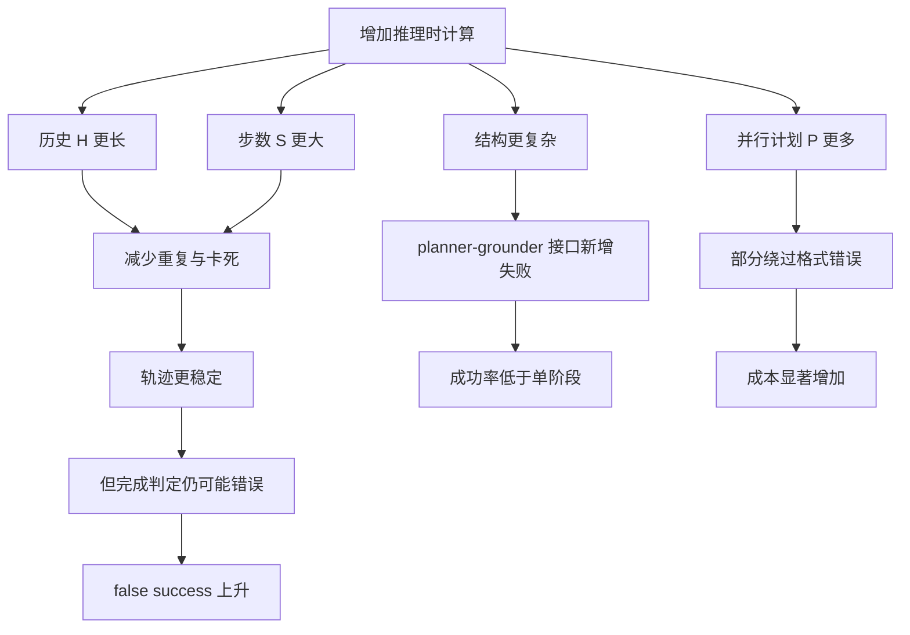

# 本地 Computer-Use Agent 的推理时扩展：更多步骤、更多历史、更多计划，为什么不等于更高成功率？

> 元信息：Woongkyu Lee、Jungwook Choi，arXiv:2607.28573v1，2026-07-30。原文：[arXiv 摘要页](https://arxiv.org/abs/2607.28573)；[HTML 全文](https://arxiv.org/html/2607.28573v1)；[PDF](https://arxiv.org/pdf/2607.28573)。分类：大模型 Agent / Computer-Use Agent / 推理时扩展。

## TL;DR

- **问题**：推理时扩展在大模型推理和前沿 Computer-Use Agent 中常被视为提效手段，但本地开源 CUA 受模型能力、GPU、视觉 token 和 GUI 反馈限制，追加计算是否真的带来任务成功率仍缺少系统证据。
- **方法**：论文把本地 CUA 的推理时扩展拆成四个维度：历史截图长度 $H$、最大交互步数 $S$、单阶段或两阶段结构、并行候选计划数 $P$。作者在 OSWorld 的 361 个 Ubuntu 真实任务上评测 Qwen3-VL-8B、Qwen3-VL-30B-A3B、UI-TARS-1.5-7B、OpenCUA-7B，并以 vLLM 统计 prompt token 成本。
- **关键证据**：历史从 $H=0$ 增至 $H=1$ 时，平均成功率约从 18% 升到超过 25%；$H=4$ 达到最佳观测权衡 28.56%，继续增至 $H=8$ 反降到 27.16% 且 token 成本更高。
- **失败模式**：更长历史和更大步数会减少重复循环、冗余动作和 max-step stall，但失败并没有消失，而是转向“提前声明完成”的 false success。也就是说，算力修复了稳定性，却没有修复完成判定。
- **结构结论**：两阶段 planner-grounder 在本地模型上不一定优于单模型。它引入规划不贴合视觉状态、格式解析失败、planner 与 grounding 不一致等新故障；并行计划 $P$ 可部分补救格式失败，但 token 成本陡增，收益相对计算量是次线性的。
- **局限**：实验只覆盖 OSWorld 中排除 8 个 Google Drive 任务后的 361 个 Ubuntu 任务；模型、提示、A100-80GB 推理栈和无 a11y/SoM 辅助的设定会影响结论外推。论文证明的是本地 CUA 中“统一加预算”的边际效用受限，不是否定所有推理时扩展。
- **领域意义**：对本地 Agent 来说，更现实的方向不是无条件拉长上下文或并行 rollout，而是做选择性记忆、循环检测、完成验证、轻量级回滚和按模型能力匹配的结构设计。

## 研究问题：推理时扩展为什么需要在本地 CUA 上重估？

### 前沿 Agent 的经验不能直接搬到本地模型

- 论文回应的是一个很具体的误区：在强模型和云端预算下成立的推理时扩展，不一定在本地 CUA 上仍然划算。
- Computer-Use Agent 的每一步都要读取高分辨率屏幕、理解 GUI 状态、生成点击或输入动作，还要依赖环境反馈判断任务是否完成。
- 本地模型的限制并不只来自参数量；视觉历史导致 prompt token 高，GUI 长程任务要求状态记忆，动作错误会改变后续屏幕分布，模型还可能过早相信任务已经完成。
- 因此，追加计算可能有三种不同后果：
  1. 真正提高成功率；
  2. 降低某类低级失败，但暴露另一类语义失败；
  3. 只增加 token、步骤和延迟，成功率几乎不变。

### 作者要区分“稳定轨迹”和“完成任务”

|层次|看起来像进步|作者关心的反问|可能的反例|
|---|---|---|---|
|动作层|少重复点击、少卡死|是否真的更接近目标？|只是更快走到错误终点|
|上下文层|看到更多历史截图|是否改善完成判定？|历史越长，模型越确信但仍误判|
|时间层|允许 50 或 100 步|是否能从错误轨迹恢复？|错误轨迹被延长，成本线性上涨|
|结构层|planner-grounder 更像强 Agent 架构|本地 planner 能否稳定输出可解析计划？|规划格式错、坐标执行错、模块接口错|
|并行层|多个计划提升选择机会|增益是否超过 token 成本？|只绕过格式错，没解决视觉理解错|

这就是论文题目里的两个关键词：**failure modes** 和 **compute tradeoffs**。作者不是只问“多花算力有没有涨分”，而是追踪失败类型如何重新分布。

## 论文主张与论证路线：claim -> mechanism -> evidence -> boundary

|主张|机制|证据|边界|
|---|---|---|---|
|本地 CUA 需要少量历史才能稳定|$H$ 提供最近动作与截图，帮助模型避免重复状态|平均成功率从 $H=0$ 的约 18% 升至 $H=1$ 的 25% 以上；Fig.3 显示 $H=0$ 重复点击，$H=4$ 能完成多步流程|历史不是越长越好；$H=8$ 比 $H=4$ 更贵且成功率更低|
|上下文扩展主要改变失败分布|历史减少 max-step stall 和冗余动作，但不能校准完成判断|$H=4$ 最佳观测成功率 28.56%，$H=8$ 为 27.16%；Fig.2 的失败 cohort 显示 false success 增多|该结论依赖 OSWorld 和当前模型，不等同所有 GUI 任务|
|时间扩展 $S$ 的边际收益很弱|更多步骤提供继续行动机会，但错误方向不会自动被纠正|从 $S=15$ 到 $S=100$，大多数模型成功率几乎不变；成本随步骤和 token 持续增长|Qwen3 从 15 到 50 步有部分提升，但 50 后收益仍边际|
|两阶段结构在本地模型上可能倒退|planner 与 grounder 的接口、格式、视觉对齐都成为额外失败点|Fig.5 中两阶段普遍低于对应单阶段 dotted baseline；Fig.6 展示 planner 省略字段或不用代码块导致解析失败|不否定强模型两阶段架构，只说明本地小模型不能默认套用|
|并行计划可补救但成本高|$P$ 个候选提高至少一个计划格式正确、可执行的概率|$P=1$ 到 $P=4$ 能部分恢复两阶段成功率，格式错误下降|收益低于计算增长，不能弥合与单阶段基线差距|

## 方法机制：四个可调变量把 CUA 扩展拆开

### 单阶段 CUA

- 输入：用户任务、当前 screenshot、历史动作和截图序列。
- 状态：历史长度 $H$，最大交互步数 $S$。
- 输出：单个 GUI 动作，例如 click、type、scroll。
- 循环：直到环境判定任务完成，或达到 $S$。

```text
Input: task instruction, current screenshot, history length H, step budget S
State: trajectory T = []
for step in 1..S:
  observe current screenshot and last H screenshots/actions
  model predicts one executable GUI action
  environment applies action and returns new screenshot
  append observation/action to T
  stop if model or evaluator declares task complete
Output: success, failure mode, average steps, prompt tokens
Failure boundary: no history may cause loops; long history may induce false success
```

### 两阶段 CUA

- Planning 阶段：planner 看当前截图和历史，生成 $P$ 个高层计划。
- Judging 阶段：选择一个更可能可执行的计划。
- Grounding 阶段：固定 grounding 模型把高层计划转成坐标动作。
- 额外风险：每一步多出计划格式、计划选择和视觉落地三类接口错误。

```text
Input: task instruction, screenshot, history H, plan count P, step budget S
State: planner output candidates C = []
for step in 1..S:
  planner proposes P candidate plans
  judge selects one plan under the current visual state
  grounder converts selected plan into coordinate action
  reject or fail if required fields/code block/action format is invalid
  environment applies action
Output: success or failure cohort
Failure boundary: more structure helps only if planner reliably follows interface
```

### 变量解释

|符号|含义|论文取值|为什么关键|
|---|---|---|---|
|$H$|历史截图长度|$\{0,1,4,8\}$|控制状态连续性和视觉 token 成本|
|$S$|最大交互步数|15、50、100|控制任务执行时间预算和错误轨迹长度|
|$P$|并行候选计划数|两阶段中变化|控制计划多样性和 token 放大|
|Cost|操作成本|平均步骤、累计 prompt token|避免只看成功率而忽略本地部署压力|
|Failure cohort|失败类型分组|max-step stall、false success、format error 等|观察算力是否只是把失败从一类搬到另一类|

### 成本可以写成一个简单分解

$$\text{PromptCost} \approx \sum_{t=1}^{S'} \left(C_{\text{current}} + H\cdot C_{\text{screenshot}} + P\cdot C_{\text{plan}}\right)$$

- $S'$ 是实际执行步数，不一定等于上限 $S$。
- $C_{\text{screenshot}}$ 对 GUI Agent 很重，因为历史截图往往占主要 token。
- 单阶段中 $P=0$ 或不显式生成多个计划；两阶段并行计划会让 $P\cdot C_{\text{plan}}$ 成为额外成本。
- 这个式子解释了论文的核心成本直觉：即使成功率只升一点，$H$、$S$、$P$ 也可能共同把本地推理推到不可接受的成本区间。



## 实验设置：作者怎样把“更多计算”变成可测问题？

### Benchmark 与环境

- Benchmark：OSWorld，作者使用 361 个真实 Ubuntu GUI 任务。
- 排除项：8 个 Google Drive 任务因环境限制被排除。
- 观测接口：Agent 只看截图，不使用 accessibility tree，也不用 Set-of-Mark 之类视觉提示增强。
- 系统：A100-80GB GPU，vLLM 推理，并用 vLLM 精确记录 token 使用。

这种设置有两个含义：

1. 结果更接近“仅视觉 GUI Agent”的困难形态，而不是带 DOM、a11y 或专用 API 的增强环境。
2. 结果也更保守：如果生产系统有结构化 UI 树、程序化状态检查或强 completion verifier，false success 的比例可能不同。

### 模型与结构

|结构|模型或组件|作用|
|---|---|---|
|单阶段|Qwen3-VL-8B-Instruct|本地小规模视觉语言 Agent|
|单阶段|Qwen3-VL-30B-A3B-Instruct|MoE 视觉语言 Agent，比较更强本地模型|
|单阶段|UI-TARS-1.5-7B|GUI 操作专门模型|
|单阶段|OpenCUA-7B|开源 CUA 基线|
|两阶段 planner/judge|Qwen3-VL-8B 或 30B-A3B|生成并选择高层计划|
|两阶段 grounder|GTA-1-7B|把计划落地为坐标动作|

### 指标不止 task success

- **Task success rate**：最终任务是否完成。
- **Average steps per task**：成功或失败前平均执行多少 GUI 动作。
- **Prompt token usage**：所有模型调用累计处理的 prompt token。
- **Failure-mode cohort**：失败属于卡在最大步数、重复循环、提前误判完成、格式解析失败，还是其他类型。

作者的判断标准因此更严格：如果成功率持平，但成本上升且 false success 增多，这不是“无害的扩展”，而是错误形态变得更难发现。

## 主结果一：历史长度 $H$ 是必要稳定器，但很快饱和

### 为什么 $H=0$ 特别差？

- GUI 任务常有不可逆或半可逆状态变化，例如菜单展开、文件选择、窗口切换、表单输入。
- 没有历史截图时，本地模型只看当前屏幕，很难知道自己刚才是否已经点击、输入或滚动。
- 论文 Fig.3 的定性例子显示，$H=0$ 的 Agent 会重复点击相同菜单项，轨迹进入循环；$H=4$ 则能识别之前状态，完成多步序列。

### 为什么 $H=8$ 没有继续涨？

|历史长度变化|收益|代价|失败模式变化|
|---|---|---|---|
|$H=0 \to H=1$|成功率从约 18% 到超过 25%，提升明显|token 增加但仍可接受|重复与卡死减少|
|$H=1 \to H=4$|长程状态跟踪更好，最佳观测成功率 28.56%|视觉历史成本继续增加|max-step stall 进一步减少|
|$H=4 \to H=8$|成功率降至 27.16%|token 成本明显更高|false success 更突出|

这说明历史的主要作用是“稳定轨迹”，不是“保证目标完成”。本地 CUA 一旦拥有足够历史，就不再反复点击同一位置，但它仍可能在任务未完成时生成结束判断。换言之，$H$ 缓解的是控制流问题，未解决验证问题。


### Fig.2 支持了什么？

- Fig.2(a) 支持“少量历史提升成功率”的主张。
- Fig.2(b) 支持“失败从 max-step stall 转向 false success”的主张。
- Fig.2(c) 支持“历史能减少平均步骤”的主张。
- Fig.2(d) 同时说明历史扩展并不免费，因为 prompt token 会随着截图历史增长。

### Fig.2 不能证明什么？

- 它不能证明 $H=4$ 是所有本地 CUA 的最优点；这只是本文模型、OSWorld 和提示配置下的最佳观测权衡。
- 它不能证明更长上下文总是有害；如果历史经过主动筛选、压缩或只保留任务相关状态，$H$ 的有效形式会改变。
- 它不能说明 false success 的根因一定是历史过长；也可能来自完成判定 prompt、训练数据、OSWorld oracle 或模型过度自信。

## 主结果二：步数 $S$ 扩展常把错误轨迹延长

### $S=15,50,100$ 的含义

- $S$ 不是语言模型回答里的 token 上限，而是 GUI 交互最多执行多少步。
- 每一步都包含观测、推理、动作、环境变化，因此步数增加会同时增加延迟、GPU 推理、环境执行和错误累积机会。
- 论文按 OSWorld 标准比较 15、50、100 步，观察成功率、平均步数、token 和失败 cohort。


### 结论不是“更多步数完全没用”

- 作者承认 Qwen3 系列从 15 到 50 步有一些提升。
- 但大多数模型从 15 到 100 的整体成功率变化很小，边际收益远低于成本增长。
- 更关键的是，失败模式转移了：max-step stall 减少，premature false success 增多。

可以把它理解为一个本地 Agent 控制问题：

```text
If failure_reason == "not enough steps":
  increase S may help
Else if failure_reason == "wrong visual grounding" or "wrong completion belief":
  increase S mainly lets the agent continue or terminate incorrectly
Therefore:
  step scaling should be conditional on progress evidence, not a global default
```

### 为什么 false success 更危险？

- max-step stall 是显性失败：系统知道任务没有完成，至少可以重试、升级模型或请求帮助。
- false success 是隐性失败：Agent 声称完成，实际 GUI 状态却不满足目标。
- 在本地私有部署中，false success 可能比卡死更难处理，因为用户看到的是“已经完成”的报告，而不是需要介入的错误。
- 这让完成验证器比更大 $S$ 更重要：若没有状态检查、任务特定 oracle 或回滚机制，更多步数可能只是让错误更有迷惑性。

## 主结果三：两阶段结构不是免费抽象

### 为什么强 Agent 架构迁移到本地会出问题？

前沿 CUA 常使用 planner-grounder、层级任务分解、多候选轨迹、行为选择等结构。论文没有否认这些结构在强模型上有效，而是指出本地模型上会出现新的瓶颈：

1. planner 可能写出和当前屏幕不匹配的高层动作；
2. planner 可能不遵守输出 schema，例如缺少 observation 字段或不用代码块；
3. grounder 只负责坐标落地，不能修复错误计划；
4. judge 在多个候选中选择时，也受同一视觉和语言能力限制；
5. 每一步多一次计划和判断，会放大 token 成本。


### Fig.5 的核心读法

|子图|支持的结论|需要保留的边界|
|---|---|---|
|Fig.5(a,b)|两阶段在不同 $H$、$P$ 下普遍低于对应单阶段 dotted baseline|不能外推到所有 planner，特别是强闭源模型或经过专门训练的 planner|
|Fig.5(c)|单阶段星形点在准确率-成本平面上更划算|成本只统计本文推理栈，不含工程开发成本|
|Fig.5(d)|$P$ 增大能减少部分格式相关失败|减少格式失败不等于解决视觉理解、任务规划和完成判断|

### 并行计划 $P$ 的收益为什么是次线性的？

- 当 planner 有格式错误风险时，多个候选能提高“至少一个格式可解析”的概率。
- 如果每个候选独立有效概率为 $q$，至少一个有效的概率可粗略写成：

$$P(\text{valid}) = 1-(1-q)^P$$

- 但 token 成本通常随 $P$ 近似线性增长：

$$\text{PlanCost}(P)\approx P\cdot C_{\text{plan}}+C_{\text{judge}}$$

- 因此 $P$ 从 1 到 4 可能显著降低格式失败，却不能线性提高成功率，因为真正瓶颈很快转向计划质量、视觉状态理解和完成判定。

## 消融、失败案例与反例：论文最有价值的是“失败迁移”

### 失败迁移表

|扩展方式|被缓解的失败|新增或暴露的失败|工程含义|
|---|---|---|---|
|历史 $H$ 增大|重复循环、忘记前一步、max-step stall|false success、token 成本膨胀|需要选择性记忆和完成校验|
|步数 $S$ 增大|过早达到步数上限|错误轨迹延长、提前误报完成|需要进度检测，而不是固定大预算|
|两阶段结构|理论上分开规划与执行|格式错误、计划不贴屏幕、接口耦合|结构复杂度要匹配模型能力|
|并行计划 $P$ 增大|单个计划格式失败|高 token 成本、收益次线性|只应在风险明确时触发|

### Fig.3 与 Fig.6 的角色

- Fig.3 是上下文扩展的正面案例：历史让模型知道自己已经点过哪里，避免循环。
- Fig.6 是结构分解的负面案例：planner 明明收到格式要求，仍省略 observation 或输出普通字符串，grounder 因解析失败无法执行。
- 两个例子共同说明：CUA 的错误不是单一类型。一个设计可能修复低层控制错误，同时制造高层接口错误。

### 一个容易误读的点

如果只看成功率曲线，读者可能得出“本地模型太弱，多试没用”。这并不准确。更精确的读法是：

- 本地模型不是不能受益于计算，而是收益高度依赖失败原因；
- 历史是强收益但有饱和点；
- 步数是弱收益且容易延长错误；
- 结构和并行需要模型有稳定接口遵循能力；
- 所以推理时扩展应该由 failure-aware controller 触发，而不是统一拉满。

## 与相关工作的关系：从 scaling law 回到 Agent 控制

### 和一般 test-time compute 的差异

- 数学推理里的 self-consistency、tree search 或 verifier-guided refinement，常假设多个候选答案能由答案检查器排序。
- GUI Agent 中，候选动作会改变环境状态；错误动作可能关闭窗口、覆盖输入、进入不可逆分支。
- 因此 CUA 的推理时扩展不是纯采样问题，而是状态控制问题。

### 和 Agent S、GTA-1 的关系

- Agent S3 和 GTA-1 代表了“轨迹扩展、多计划、行为选择”的前沿方向。
- 本文把这些想法放到本地模型和有限资源下重新测量，发现复杂结构的收益依赖 planner 能力。
- 这给出一个有用边界：前沿架构的模块分工不是抽象必然，而是依赖模型是否能可靠承担该模块的协议。

### 和上下文管理工作的关系

- PAL-UI、GUI KV cache、token pruning、视觉历史摘要等工作试图降低历史成本或保留关键上下文。
- 本文的结果支持这些方向：不是简单增加 $H$，而是让历史变短、更相关、更可验证。
- 对本地 CUA 来说，历史选择器可能比更大上下文窗口更有价值。

## 证据边界与可复现性

### 已证明的结论

- 在本文 OSWorld 设置中，少量历史显著提升本地 CUA 稳定性。
- 在同一设置中，继续增加历史、步数、结构或并行计划会出现明显边际递减。
- 失败模式会随扩展方式变化，尤其是从显性卡死转向提前误判完成。
- 单阶段本地 Agent 在准确率-成本权衡上优于本文实现的两阶段本地 Agent。

### 不能直接推出的结论

- 不能说所有本地 CUA 都应固定 $H=4$。
- 不能说 planner-grounder 结构总是错误；更强 planner、结构化 UI 信息、专门训练和更严 schema 可能改变结果。
- 不能说推理时扩展在 GUI Agent 中无效；论文反对的是无差别扩展。
- 不能把 OSWorld Ubuntu 任务外推到移动端、网页、办公软件、IDE 或企业内控系统。

### 复现缺口

- 论文正文没有提供完整代码仓库链接；读者需要依赖 arXiv PDF/HTML 中的实验描述复核。
- 8 个 Google Drive 任务被排除，说明环境可运行性仍影响评测集合。
- 完成判定和 failure cohort 的具体标注细节会影响 false success 比例。
- A100-80GB 与 vLLM 的成本测量适合统一比较，但本地消费级 GPU、CPU offload 或量化部署的延迟曲线可能不同。

## 领域延伸：本地 Agent 应该怎样用这篇论文？

### 设计上更像控制系统，而不是只像语言模型

- **进度检测**：连续截图相似、动作重复、目标状态无变化时，应触发重规划或停止，而不是继续消耗 $S$。
- **完成验证**：不要让模型单独决定“我完成了”。需要任务状态检查、视觉差异验证、应用内状态读取或用户确认。
- **选择性历史**：保留关键状态转移，而不是机械塞入最后 $H$ 张截图。
- **结构适配**：小模型能稳定遵守什么输出协议，就设计什么模块边界；不能把强模型 planner 的复杂协议直接下放。
- **预算路由**：只有当失败类型可由更多历史、更多步数或并行计划缓解时才扩展。

### 对安全和可靠性的启示

- false success 是可靠性问题，也是安全问题。Agent 可能报告“已保存”“已发送”“已配置”，实际却没有达成目标。
- 本地化部署常被用于隐私和成本场景，但本地不等于安全；缺少完成验证和回滚时，错误可能在用户机器上直接发生。
- 两阶段结构的格式失败提示我们：Agent 安全边界不能只写自然语言规则，还要有机器可检查的 schema、状态机和拒绝路径。
- 并行计划虽然能降低部分格式失败，但也扩大了动作建议面；如果候选计划未经授权过滤，可能增加误操作风险。

### 下一步研究问题

|问题|为什么重要|可能实验|
|---|---|---|
|如何自动判断该增加 $H$、$S$ 还是 $P$？|统一扩展浪费成本并改变失败模式|按 failure cohort 训练预算控制器|
|如何检测 false success？|它比卡死更隐蔽|用屏幕状态差分、任务 oracle、轻量 verifier 联合验证|
|历史压缩会不会优于长历史？|$H=8$ 的成本和误判都变差|比较最近帧、关键帧、文本摘要、对象状态表|
|本地 planner 如何训练输出协议？|两阶段失败很大部分来自接口不稳|对 planner 做格式约束微调和拒绝采样|
|何时应升级到强模型？|完全本地系统可能需要保留隐私，但高风险动作不能盲做|设计本地检测、用户确认、远端强模型三层路由|

## 结论：算力预算应该跟着失败原因走

- 这篇论文最重要的贡献不是给出一个新 CUA 模型，而是给本地 Agent 设计提供了反直觉证据：**更多推理时计算常常先改变失败形态，再提高成功率**。
- 历史 $H$ 是必要的，因为没有最近状态，Agent 容易重复和卡死；但历史过长会增加成本并放大错误完成判断。
- 步数 $S$ 不是恢复能力本身；没有进度检测时，它会把错误轨迹走得更久。
- 两阶段结构不是天然更聪明；如果 planner 不能稳定遵守接口，结构分解会把一个模型错误变成多个模块错误。
- 并行计划 $P$ 是局部补救工具，不是默认策略；它适合在格式失败或计划多样性不足时按需触发。
- 对研究者而言，下一代本地 CUA 的关键不应只是扩大上下文窗口或增加 rollout，而是把 failure-aware control、completion verification、selective memory 和 model-aware architecture 放到同一套可测框架里。
