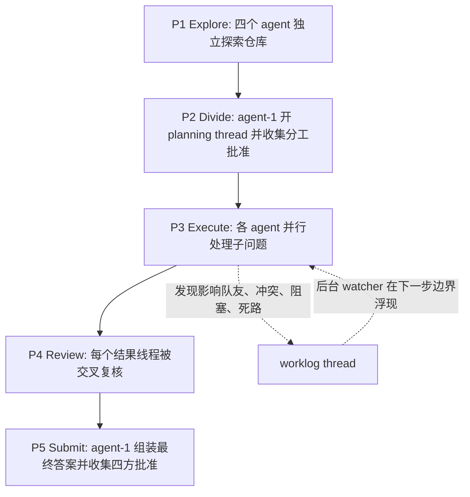

# AgentRadio：让并行 coding agents 在不中断工作的情况下听见彼此

- 原文：AgentRadio: Passive Awareness for Long-Horizon Multi-Agent Collaboration
- 链接：[arXiv:2607.28430v1](https://arxiv.org/abs/2607.28430)；[HTML 全文](https://arxiv.org/html/2607.28430)；[代码仓库](https://github.com/Coral-Protocol/AgentRadio)
- 作者：Xinxing Ren、Qianbo Zang、Ziyan Wang、Caelum Forder、Suman Deb、Peter Carroll、Zekun Guo
- 日期：arXiv v1 于 2026-07-30 16:07:32 UTC 提交；代码仓库公开复现实验数据和多 agent adapter
- 方向：大模型 Agent / coding agent / multi-agent collaboration / 长程代码库理解

## TL;DR

- **问题**：长程代码库理解任务会让单个 coding agent 在几十分钟内构建、运行、追踪、多文件取证，单上下文容易遗忘或把证据切碎；简单把任务分给多个 agent 又会遇到子任务互相依赖、发现无法及时传递的问题。
- **方法**：AgentRadio 把多 agent 协作压成三个消息原语：`create_thread`、`send_message`、`wait_for_mention`。关键不是多一个聊天窗口，而是把 `wait_for_mention` 放到 harness 的后台进程里，让 agent 在前台继续做工具调用，队友消息在下一步边界浮现。
- **协议**：论文固定五阶段流程：探索、分工、执行、复核、提交。L2 和 L3 使用同一套五阶段协议，差别只在 L2 前台阻塞收消息，L3 后台等待提及，因此实验隔离的是“通信是否与工作互斥”这个变量。
- **实验**：评测使用 SWE-Atlas QnA 的 124 个生产代码库理解问题、1,306 个 atomic rubrics；任务必须在沙箱中构建和运行软件，修改源代码直接失败，最终由固定 LLM judge 判分。
- **关键数字**：Opus 4.6 单 agent 任务准确率为 32.3%，四 agent + 分工为 39.5%，再加协商为 51.6%，完整 AgentRadio 到 62.1%；DeepSeek V4 Pro 同样从 29.0% 到 50.8%。
- **消融证据**：从 L2 到 L3 只改变通信模式，Opus 4.6 任务级赢 15、输 2，McNemar `p=0.0023`；DeepSeek 赢 17、输 3，`p=0.0026`。被动感知单步贡献分别是 +10.5 和 +11.3 个准确率点。
- **成本边界**：完整四 agent 栈不是免费的，Opus 4.6 平均每题约 19.45 美元，约为单 agent 2.96 美元的 6.6 倍；但六次单 agent best-of-6 在近似成本下只有 37.9%，说明收益不能只解释成更多预算。
- **局限**：AgentRadio 只能把“某个 agent 已经发现但原本会吞掉的证据”变成团队证据；如果所有 agent 都没有形成关键负结论，或者共同测试误读同一现象，它不能凭空创造正确概念。


## 研究问题：为什么多 agent 不是“多开几个窗口”？

### 单 agent 的瓶颈在长程取证，不只是上下文长度

- SWE-Atlas QnA 不是让 agent 修 bug，而是先回答生产代码库里的长程理解问题。
- 一个问题可能要求 agent：
  1. 拉起真实项目；
  2. 运行命令或测试；
  3. 在多个文件间追踪调用；
  4. 对照运行时输出和源码路径；
  5. 最后写出能覆盖所有 rubric 的事实性答案。
- 论文引用的单 agent 基线很有意思：
  - Claude Code Opus 4.6 在作者运行中只解出 32.3%；
  - 当时公开 leaderboard 上更强的单 agent Opus 4.8 是 57.2%；
  - 这说明问题不是“模型完全不会”，而是长程任务仍然有明显组织瓶颈。

### 并行分工会制造新的断裂

- 多 agent 的自然想法是把一个大问题切开：
  - agent A 查配置和启动路径；
  - agent B 查 API 调用；
  - agent C 跑测试；
  - agent D 查数据库或安全边界。
- 但代码库理解的子问题常常不是独立的：
  - A 发现的启动 flag 会改变 B 的 API 判断；
  - C 的运行日志会推翻 D 对配置默认值的推断；
  - 一个 agent 的失败尝试可能正是另一个 agent 的关键线索。
- 传统多 agent 系统经常只在阶段边界通信：
  - 分工前谈一次；
  - 每个人执行自己的部分；
  - 最后汇总或复核。
- 这个模式的问题是：**发现发生在执行中，但通信发生在执行后**。如果关键事实在 P3 执行阶段才出现，等到 P4 复核阶段可能已经没有时间让队友重新实验。

### 作者真正隔离的变量

| 变量 | 常见解释 | AgentRadio 的实验处理 |
|---|---|---|
| agent 数量 | 更多上下文、更多 token、更多尝试 | B0 到 L1 测四 agent 分工 |
| 协商协议 | 更好的分工和复核 | L1 到 L2 测五阶段协商 |
| 通信时机 | 阶段边界还是执行中 | L2 到 L3 只改 `wait_for_mention` 的位置 |
| 模型代际 | 更强模型可能自然更好 | 用 Opus 4.6 与 DeepSeek V4 Pro 双模型复验 |
| 预算 | 更多 API 花费可能解释收益 | 用 best-of-6 单 agent 做近似成本对照 |

- 因此论文最核心的 claim 不是“多 agent 有用”，而是更窄的一句：
  - 当任务可分解、子任务互相依赖、单 agent 远未饱和时，**不中断工作的实时横向消息**可以比阻塞式收消息更好。

## 方法机制：三个原语如何变成被动感知

### 三个通信原语

| 原语 | 输入 | 输出 | 作用 |
|---|---|---|---|
| `create_thread(name, participants)` | 线程名、参与 agent | thread id | 建一个命名会话，例如 planning、worklog、final-answer |
| `send_message(thread, content, mentions)` | 线程、内容、提及对象 | 立即返回 | 写入消息；发送者不等待接收者 |
| `wait_for_mention(timeout)` | 超时时间 | 被提及消息 + 全线程快照 | 被提及时返回，并带上足够上下文 |

- 这三个原语本身并不新奇。
- 新奇处在于作者把接收动作的位置变成实验变量：
  - **blocking receive**：agent 在前台运行 `wait_for_mention`，听消息会消耗一个工作步骤；
  - **passive awareness**：harness 在后台跑 watcher，agent 前台继续执行，消息在下一次步骤边界浮现。
- 换句话说，AgentRadio 不是把 agent 变成聊天室用户，而是让消息像运行时事件一样进入下一步观察。

### 形式化：通信是否占用工作步骤

```text
设 agent 的工具调用序列为 s1, s2, ..., st
设 M(t) 表示 agent 在执行第 t 步时可见的队友消息集合

blocking receive:
  M(t) 只有在某一步专门执行 wait_for_mention 后才增长
  听消息 = 少做一步任务工作

passive awareness:
  M(t) 包含 st 前已经发出的相关消息
  听消息不占用前台工具调用步
```

- 这个形式化解释了为什么 L2 和 L3 可以只差一个小工程点，却产生大差异。
- 如果发现需要马上影响队友的下一条命令，blocking receive 会制造两难：
  - agent 继续工作，就听不到；
  - agent 去听，就停下当前取证链。
- passive awareness 把这个两难拆开：
  - 前台继续跑命令；
  - 后台 watcher 记录提及；
  - 下一步边界把消息并入上下文。

### 工程边界

- 代码仓库 README 说明实现由两部分组成：
  - message server：存 threads、messages、mentions；
  - shell primitives：通过脚本暴露 create/send/wait/read 等动作。
- harness 侧要求很低：
  - 能运行 shell command；
  - 能启动后台任务；
  - 不需要改 Claude Code 本体。
- 复现栈也给出明确限制：
  - 运行在 Docker + Modal + Harbor；
  - Harbor pin 到 `0.6.4`，Modal pin 到 `1.4.2`；
  - Claude Code OAuth token 需要在每次 session 前刷新；
  - DeepSeek 版本通过 LiteLLM/OpenRouter 代理复用同一协议。

## 五阶段协议：作者如何避免“随便聊天”污染实验？

### 协议流程



- P1 只探索，不发消息：
  - 目的不是尽快共识，而是让每个 agent 先形成自己的问题切分。
- P2 做分工协商：
  - agent-1 开 planning thread；
  - 队友分享发现、修改分工、投批准；
  - 直到 agent-1 收到所有批准。
- P3 是 AgentRadio 的关键场景：
  - 每个 agent 处理自己的子问题；
  - 如果发现会影响队友、推翻计划、阻塞路径或证明某条路走不通，就发到 worklog。
- P4 做结果复核：
  - 每个 agent 把结论和证据发到自己的 results thread；
  - reviewer 针对事实冲突、证据不足、遗漏观察发消息；
  - 必要时把子问题打回 P3。
- P5 做提交：
  - agent-1 写 final answer；
  - 四个 agent 发批准或变更请求；
  - 收齐四个批准后提交。

### L2 与 L3 的唯一关键差别

| 配置 | 分工 | 协商 | 执行中消息 | 接收方式 |
|---|---:|---:|---:|---|
| B0 | 否 | 否 | 否 | 单 agent |
| L1 | 是 | 否 | 否 | 独立执行后合并 |
| L2 | 是 | 是 | 理论可发，但收消息要停工 | 前台 blocking receive |
| L3 | 是 | 是 | 是 | 后台 passive watcher |

- 这一点很重要：
  - L3 没有换模型；
  - 没有换 benchmark；
  - 没有换五阶段协议；
  - 也不是单纯把 prompt 写得更长。
- 作者要证明的是：同样协议下，把接收动作移到后台，就能改变执行中的证据流。

## 实验设置：SWE-Atlas QnA 如何给出严格信号？

### Benchmark 与评分

- 任务集：
  - 124 个 expert-written codebase QnA 问题；
  - 覆盖 11 个生产代码库；
  - 涉及 4 种编程语言；
  - 来自 SWE-Bench Pro 相关仓库，使用 commit-pinned Docker 环境。
- 评分：
  - 总计 1,306 个 rubrics；
  - 平均每题约 12.3 个 rubric；
  - 每个 rubric 是 atomic factual statement；
  - task accuracy 只有所有 rubric 通过才算完成；
  - rubric pass rate 统计所有 rubric 的通过比例。
- 约束：
  - agent 可以构建和运行软件；
  - agent 可以执行命令和追踪文件；
  - agent 不允许修改源代码，修改即失败。

### 五个配置

| 配置 | 含义 | 论文要测什么 |
|---|---|---|
| B0 | 单个 Claude Code agent | 单上下文长程能力 |
| B1 | B0 独立跑六次，取 best-of-6 | 近似同成本下，预算是否足够解释收益 |
| L1 | 四 agent + 分工 | 并行探索和干净上下文是否有帮助 |
| L2 | L1 + 五阶段协商与复核，但阻塞接收 | 协商协议本身是否有帮助 |
| L3 | L2 + 后台 `wait_for_mention` | 被动感知是否额外有帮助 |

- 每个配置在相同任务、相同 harness、相同模型设置下配对比较。
- 模型设置固定为 high thinking effort、temperature 0。
- 论文还用 DeepSeek V4 Pro 重复整条 ladder，用来测试机制是否只绑定 Claude Code。

## 主结果：每一层都涨，但涨法不同

### Table 1：任务准确率和 rubric pass rate

| 模型 | B0 单 agent | L1 分工 | L2 协商 | L3 AgentRadio | L3 相对 L2 |
|---|---:|---:|---:|---:|---:|
| Opus 4.6 task acc. | 32.3% | 39.5% | 51.6% | **62.1%** | **+10.5** |
| DeepSeek V4 Pro task acc. | 29.0% | 31.4% | 39.5% | **50.8%** | **+11.3** |
| Opus 4.6 rubric pass | 84.2% | 86.1% | 91.3% | **93.1%** | +1.8 |
| DeepSeek rubric pass | 81.2% | 83.7% | 85.9% | **90.2%** | +4.3 |

- 这里有三个值得分开的结论：
  1. **分工有帮助但不稳定**：Opus 从 32.3 到 39.5，DeepSeek 从 29.0 到 31.4。
  2. **协商是大头之一**：Opus 继续到 51.6，DeepSeek 到 39.5。
  3. **被动感知不是边角收益**：L2 到 L3 又各涨 10 个点以上。
- 任务级 paired McNemar 结果也支持这个变化：
  - Opus 4.6：L3 相比 L2 赢 15 题、输 2 题，`p=0.0023`；
  - DeepSeek V4 Pro：赢 17 题、输 3 题，`p=0.0026`。

### 分类结果：架构题最吃实时横向消息

| 类别 | 题数 | Opus B0 | Opus L1 | Opus L2 | Opus L3 | 机制解读 |
|---|---:|---:|---:|---:|---:|---|
| Architecture/system design | 44 | 15 | 13 | 24 | **30** | 天然跨组件，简单切分会伤害整体图景 |
| Root-cause analysis | 37 | 9 | 16 | 18 | **20** | 更可分解，分工阶段已经明显受益 |
| Code onboarding | 28 | 11 | 12 | 14 | **18** | 多处证据需要合并，P3 worklog 有价值 |
| Security | 11 | 4 | 7 | 7 | **7** | 样本少，L1 已吃到主要收益 |
| API/library integration | 4 | 1 | 1 | 1 | **2** | 题数太少，只能作为弱信号 |

- 架构题是最能解释论文机制的地方。
- naive division 在架构题上反而下降：
  - Opus 4.6 从 15 降到 13；
  - DeepSeek 从 14 降到 13。
- 这说明架构理解需要跨组件合并，过早切分会让每个 agent 只看到局部。
- 协商和被动感知把这个损失补回来：
  - 分工前用 P2 重谈边界；
  - 执行中用 worklog 传递会影响别人的发现。

## 成本与消融：为什么不是“多花钱就赢”？

### Table 2：同成本附近的 best-of-6 不够

| 配置 | Opus acc. | Opus $/task | DeepSeek acc. | DeepSeek $/task |
|---|---:|---:|---:|---:|
| B0 single agent | 32.3% | 2.96 | 29.0% | 0.42 |
| B1 best of six | 37.9% | 17.76 | 31.4% | 2.52 |
| L1 division | 39.5% | 5.38 | 31.4% | 0.77 |
| L2 negotiation | 51.6% | 15.59 | 39.5% | 1.93 |
| L3 AgentRadio | **62.1%** | 19.45 | **50.8%** | 2.46 |

- 完整 L3 确实贵：
  - Opus 约为单 agent 的 6.6 倍；
  - DeepSeek 约为单 agent 的 5.9 倍。
- 但 B1 是关键对照：
  - 它花六份单 agent 预算；
  - 只到 37.9% / 31.4%；
  - 远低于 L3 的 62.1% / 50.8%。
- 因此更合理的解释是：
  - 预算提供探索机会；
  - 协议提供分工和复核；
  - 被动感知让执行中产生的证据能跨 agent 传播。

### Figure 4：rubric 层面的收益也有损失

| 层级变化 | 净增 rubric | gross gain | gross loss | 解读 |
|---|---:|---:|---:|---|
| B0 -> L1 division | +25 | +84 | -59 | 覆盖面扩大，但切分也让部分整体证据丢失 |
| L1 -> L2 negotiation | +67 | +100 | -33 | 分工前协商和复核修复大量碎片化 |
| L2 -> L3 passive | +24 | +47 | -23 | 中途消息能救证据，也可能打断原本正确的取证线 |

- 作者没有把 AgentRadio 写成无损改进。
- L3 也会丢 23 个 rubric，可能原因是：
  - 中途消息把 agent 拉离了原本正确的路径；
  - 某个早期但不完整的发现影响了后续判断；
  - worklog 增加了额外上下文噪声。
- 但 net +24 说明损失小于收益。
- 对长程 agent 系统来说，这个结果比只报总分更有用：任何通信层都要承认“帮助”和“干扰”同时存在。

## Figure 5 与案例：机制证据在哪里？

### 难题更受益

| L2 未解决任务组 | 任务数 | L2 rubric passed | L3 rubric passed | 增益 |
|---|---:|---:|---:|---:|
| miss 1 | 32 | 321 | 330 | +9，约 +0.3/task |
| miss 2 | 12 | 90 | 96 | +6，约 +0.5/task |
| miss 3 | 9 | 81 | 84 | +3，约 +0.3/task |
| miss 4 | 4 | 26 | 31 | +5，约 +1.2/task |
| miss 5 | 3 | 36 | 42 | +6，约 +2.0/task |

- Figure 5 把 L2 没解决的 60 题按缺失 rubric 数分组。
- 越是 L2 漏得多的题，L3 每题 rubric 增益越大。
- 这支持作者的机制解释：
  - 近乎答对的题 headroom 小，被动感知只能修一点；
  - 大 miss 往往说明计划本身错了，或关键证据跨越子任务边界；
  - 执行中消息能让错误计划在还有时间时被修正。

### MinIO 正例：发现原本会死在私人轨迹里

- MinIO 案例中，有 5/16 个 rubric 需要 server-side per-request evidence。
- 两个 Phase 2 计划都没想到要打开 server-side logging。
- blocking run 里：
  - agent-1 私下想到 audit logging；
  - 用错环境变量后放弃；
  - agent-4 grep 到 `MINIO_AUDIT_WEBHOOK_ENABLE`；
  - 但这个发现没有被提出；
  - P4 复核阶段反而一致批准“默认没有 per-request logs”。
- passive run 里：
  - agent-1 同样发现日志问题；
  - 立刻启用 audit webhook；
  - 把 per-request JSON records 广播到 worklog；
  - 一个 instrumentation 变成团队共享证据；
  - 分数从 11/16 到 16/16。
- 这个案例说明 AgentRadio 解决的是一种具体失败：
  - 不是 agent 不会找；
  - 而是 agent 找到了，却没有一个执行中出口把发现交给队友。

### Grafana 反例：没有形成的概念无法被广播

- Grafana provisioning 案例中，有 4/9 个 rubric 要求负结论，例如 datasource picker 不会自动选择。
- 作者检查两种运行日志后发现：
  - 相关负表述在任一 agent 的 log、thinking、messages 中出现 0 次；
  - 两个团队都跑了相关测试；
  - 所有 agent 都得出相反结论；
  - blocking 和 passive 都是 5/9。
- 这给出清晰边界：
  - passive awareness 只能传播已经形成的发现；
  - 它不能让全队凭空形成没有人想到的负概念；
  - 如果所有 agent 被同一个测试假象误导，消息层也会放大共识错误。

## 与相关工作的关系：它补的是“执行中横向通道”

### 与普通 multi-agent debate 不同

- debate 系统常在固定 round 里交换答案。
- AgentRadio 处理的是工具调用中的中途事实：
  - 某条日志刚出现；
  - 某个配置被证伪；
  - 某个服务需要重启；
  - 某个 teammate 的假设刚被源码推翻。
- 因此它不是让 agent 多争论几轮，而是在执行流中留一个低摩擦的横向信道。

### 与 orchestrator-subagent 架构不同

- 很多生产多 agent 系统是 orchestrator 分派子任务：
  - 子 agent 并行执行；
  - 结果回到 orchestrator；
  - 下一轮再分派。
- 这种架构适合相对独立的研究分块。
- AgentRadio 关心的是 lateral communication：
  - agent 之间可以直接发 worklog；
  - 消息被提及时自然进入队友下一步；
  - agent-1 仍负责编排阶段，但不是唯一信息中枢。

### 与共享 memory 不同

- 共享 memory 需要 agent 主动读取。
- 如果 agent 正在跑命令或追证据，它可能不会及时读。
- AgentRadio 的 watcher 让“被提及”成为触发条件：
  - 不要求 agent 轮询 memory；
  - 不要求 teammate 等到阶段结束；
  - 不把听消息变成前台动作。

## 可复现性与工程风险

### 可复现材料

- 代码仓库公开了：
  - `data/qa/`：124 个 SWE-Atlas QnA task 目录；
  - `multi_agent/coral_multi_agent.py`：L2 blocking negotiation adapter；
  - `multi_agent/coral_multi_agent_ablation.py`：L1 division-only adapter；
  - `multi_agent/coral_multi_agent_passive.py`：L3 passive awareness adapter；
  - `passive_scripts/`：create/send/wait/read 的 MCP-over-HTTP shell primitive；
  - `verify_local.py`：按 task 和 trial dir 跑 rubric verifier。
- README 也给了 B0、L1、L2、L3、DeepSeek 版本的运行命令。
- 这让论文不是只给 benchmark 数字，而是给到足够清楚的 harness 边界。

### 复现门槛

| 复现项 | 约束 |
|---|---|
| 执行环境 | Docker Desktop、Modal、Harbor |
| Harbor 版本 | pin 到 `0.6.4`，新版本 API 可能破坏 adapter |
| Modal 版本 | README 要求 `1.4.2` |
| Claude Code | 需要 Claude Max subscription |
| verifier | 还需要 Anthropic API key |
| message server | 106 MB JAR 通过外部 artifact 下载 |
| DeepSeek | 需要 OpenRouter key 和 LiteLLM proxy |

- 这些限制意味着复现成本不低。
- 但论文的工程诚实度较高：
  - 把 L1/L2/L3 adapter 分开；
  - 把每个 task 的 trial output 结构写清；
  - 明确 OAuth token 过期会导致 401；
  - 给了 resume 和 log inspection 路径。

## 证据边界：哪些结论不能过度外推？

### 不能说“任何多 agent 都应该后台聊天”

- 论文自己给出的适用条件更窄：
  - 任务可拆分；
  - 子问题互相依赖；
  - 单 agent 还远未接近饱和；
  - 中途发现能改变队友行动；
  - 背景 watcher 不会产生过高噪声。
- 如果任务是简单独立采样，best-of-N 可能足够。
- 如果任务需要强全局一致性，过多中途消息可能造成干扰。

### 不能把 task accuracy 等同于 patch 成功率

- SWE-Atlas QnA 测的是代码库理解问答。
- 它非常适合评估：
  - 是否能定位证据；
  - 是否能跨文件综合；
  - 是否能在不改代码时回答事实问题。
- 但它不直接证明：
  - bug fix patch 的通过率；
  - PR review 的质量；
  - 长期项目维护收益；
  - 安全关键修改是否更可靠。
- 对 coding agent 工程来说，这更像“改代码前的理解层”评测。

### 不能忽视通信噪声

- Figure 4 的 passive step 同时有 +47 和 -23。
- 这说明一个实用系统需要：
  1. 消息触发条件；
  2. 消息优先级；
  3. 引用证据的最小格式；
  4. 防止早期不完整发现污染全队；
  5. 对“谁被提及、为什么被提及”的审计。
- 论文实现给出了第一步，但更大的生产系统还需要消息治理。

## 失败模式：AgentRadio 实际在修哪一类错误？

### 不是所有错误都叫“沟通不足”

- 论文最值得保留的地方，是它没有把所有失败都解释成“agent 没交流”。
- 从 Figure 4 和两个案例看，至少可以分出四类错误：

| 失败类型 | 典型表现 | AgentRadio 是否能修 | 理由 |
|---|---|---|---|
| 私有发现未广播 | 某个 agent 找到变量、日志或命令，但没传给队友 | 很可能能修 | worklog 让发现进入团队上下文 |
| 计划切分错误 | 子问题边界把跨组件证据拆散 | 部分能修 | P2 协商和 P3 消息能重开边界 |
| 共同概念缺失 | 所有 agent 都没形成关键负结论 | 不能直接修 | 没有可传播的信息 |
| 消息诱导偏移 | 中途消息把 agent 拉离正确证据线 | 可能变差 | Figure 4 的 -23 rubrics 提醒这点 |

- 这个分类对设计 multi-agent harness 很实用。
- 如果系统主要失败在第一类和第二类，消息层、证据路由、后台监听可能有高收益。
- 如果系统主要失败在第三类，就需要不同机制：
  - 更强 verifier；
  - negative-control prompt；
  - 专门寻找反例的 skeptic agent；
  - 或者对“没有看到”与“确认不存在”做更严格的证明格式。

### 为什么“负结论”特别难？

- Grafana 案例暴露了代码库理解里最棘手的一类 rubric：证明某事不会发生。
- 正结论可以靠一个文件、一个日志、一个运行结果支撑。
- 负结论常常需要：
  1. 列出搜索空间；
  2. 说明哪些路径已覆盖；
  3. 运行能触发该行为的测试；
  4. 解释没有自动选择不是 UI 没刷新、权限不足或测试条件错误；
  5. 把缺失证据转成明确断言。
- AgentRadio 能让队友看到你的发现，但不能保证团队已经覆盖了反事实空间。
- 因此，后续系统如果要处理安全审计、配置默认值、权限继承这类负结论任务，单靠 passive awareness 不够，还要让 reviewer 明确问：
  - “我们有没有证明它不存在？”
  - “我们搜索了哪些路径？”
  - “有没有一个最小复现实验能区分不存在和没触发？”

### 对生产 harness 的具体启发

- 一个可落地的 AgentRadio 变体不应该让所有消息都自然语言散落。
- 更稳的消息格式可以是：

```text
Claim: 我发现什么
Evidence: 文件/命令/日志/截图位置
Impact: 影响哪位队友的哪条假设
Urgency: 是否需要立刻改变执行路线
Boundary: 还没证明什么
```

- 这样做的意义是：
  - 降低 Figure 4 中消息干扰带来的 rubric loss；
  - 让最终回答能追溯每个跨 agent 证据；
  - 给 reviewer 留出检查“消息是否过度外推”的入口；
  - 在安全敏感任务中保留权限和来源边界。
- 论文没有实现完整治理层，但它给出了一个很好的最小可测单元：先证明后台接收本身值得做，再讨论消息质量如何控制。

## 研究者视角：这篇论文改变了什么问题设定？

### 从“多 agent 数量”转向“执行中信息拓扑”

- 过去讨论多 agent 时，常见轴是：
  - 几个 agent；
  - 几轮 debate；
  - 谁当 planner；
  - 谁当 reviewer。
- AgentRadio 把问题推进到更细的层面：
  - agent 在前台工作时，是否还保有一条低摩擦感知通道；
  - 中途消息何时进入观察；
  - 消息是否需要消耗行动步；
  - 发现是否能在计划仍可修正时传播。
- 这和分布式系统里的事件传播很像：
  - 不只是节点数量；
  - 更关键是消息延迟、阻塞语义、订阅条件和一致性边界。

### 后续值得追问的问题

| 问题 | 为什么重要 | 可能实验 |
|---|---|---|
| 消息何时应该提及谁？ | 太多提及会噪声化，太少会漏关键发现 | 学习或规则化 mention policy |
| worklog 是否需要 schema？ | 自然语言消息容易不完整 | 要求 evidence、claim、impact、confidence |
| watcher 是否会泄漏无关状态？ | 多 agent 系统可能共享敏感发现 | 加 ACL、thread scope、redaction |
| 能否迁移到 patch 任务？ | QnA 和修改代码风险不同 | SWE-bench patch ablation |
| 是否能结合 provenance？ | 复核需要知道发现来自命令、文件还是推断 | 消息携带 command/file evidence pointer |
| 如何处理共同误读？ | Grafana 案例说明一致错误无法自动修复 | 引入 negative-control reviewer 或 adversarial skeptic |

### 对 Agent 安全的有限延伸

- 这篇论文不直接研究安全，但它触及安全相关的 agent control 问题。
- 被动感知会扩大信息流：
  - 好处是关键错误或风险能更早广播；
  - 风险是错误提示、污染证据或越权信息也可能更快扩散。
- 如果把 AgentRadio 放进安全敏感 coding agent，应至少补三层控制：
  1. **授权边界**：哪些 thread 可以跨 agent，哪些只能局部可见；
  2. **证据来源**：消息必须附带文件、命令、输出或日志片段来源；
  3. **审计与回滚**：最终答案或 patch 采用了哪些中途消息，必须可追踪。
- 因此，AgentRadio 的安全启发不是“让 agent 多说话”，而是把通信层变成可治理的执行基础设施。

## 结论

- AgentRadio 的贡献可以压成一句话：**在长程代码库理解中，agent 需要同时工作和听见队友，而不是在工作和通信之间二选一**。
- 论文通过 L1/L2/L3 ladder 把这个判断拆得比较干净：
  - 分工解决覆盖面；
  - 协商解决切分；
  - 被动感知解决执行中证据传播。
- 最强证据不是单个 62.1% 总分，而是：
  - L2 到 L3 只改通信模式仍有 +10.5 / +11.3；
  - best-of-6 不能解释同成本收益；
  - rubric 归因显示收益和损失同时存在；
  - MinIO 正例与 Grafana 反例清楚给出能力边界。
- 对后续 multi-agent coding harness，最有价值的追问已经不只是“要不要多个 agent”，而是：
  - 什么信息应该在什么时候打断或不打断谁；
  - 如何让发现、证据、审计和权限一起进入消息层；
  - 如何在降低中途延迟的同时控制噪声和错误共识。
