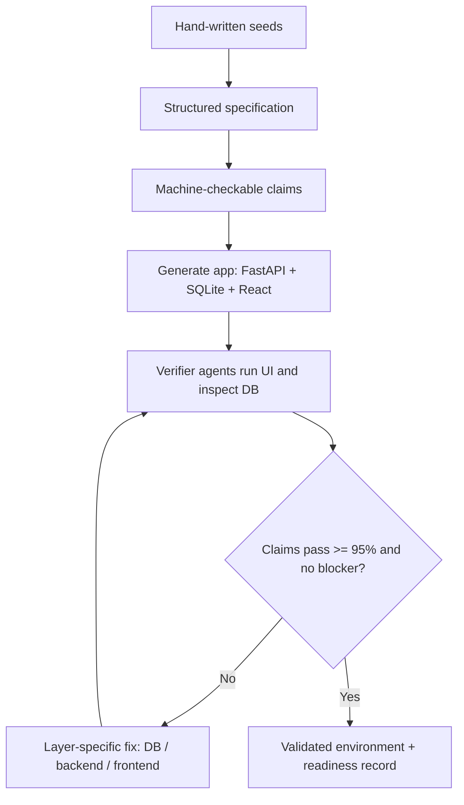

# Echoverse：把 computer-use agent 的训练环境从“网页数量”推进到“可修复世界”

## 元信息

- **原文**：Echoverse: Deep, Evolving Environments for Training Computer-Use Agents at Scale
- **类型**：论文 + Microsoft Research 官方博客 + 公开代码/数据子集
- **作者**：Yash Pandya、Sahil Gupta、Sarthak Harne、Archana Yadav、Kavyansh Chourasia、Hussein Mozannar、Vibhav Vineet、Sara Abdali、Corby Rosset、Yash Lara、Ahmed Awadallah、Ece Kamar、Akshay Nambi
- **发布日期**：arXiv v1 于 2026-07-30 提交；Microsoft Research 博客于 2026-07-30 发布；GitHub 仓库在 2026-07-30 有公开 push 记录
- **链接**：[arXiv](https://arxiv.org/abs/2607.28074)；[Microsoft Research 博客](https://www.microsoft.com/en-us/research/blog/echoverse-deep-evolving-environments-for-computer-use-agents/)；[GitHub](https://github.com/microsoft/Echoverse)；[Hugging Face Dataset](https://huggingface.co/datasets/microsoft/Echoverse)

## TL;DR

- **问题**：computer-use agent 需要在网页和应用里反复试错，但真实 Web 不可重置、会限流、缺少后端真值；浅层 synthetic site 虽然便宜，却可能把错误点击、循环和无效动作训练成习惯。
- **方法**：Echoverse 把一个训练单元定义成 world：应用环境、任务集合、数据库 grounded verifier 三者绑定；factory 先生成可运行的 FastAPI + SQLite + React 应用，再把任务重新 grounded 到 live database，并让 verifier、triager、fixer 反复修复。
- **核心机制**：每次 rollout 被读两遍：一遍判断模型哪些失败可进入训练 curriculum，另一遍判断环境、任务或 verifier 哪里坏了；作者强调先修世界，再把剩下的失败当成模型信号。
- **实验规模**：监督阶段训练 12 个 world、14 个 evaluation split；9B 模型使用 21,009 条 GPT-5.4 通过 verifier 的轨迹，合计 404,814 个 action step，平均每条 19.27 步。
- **关键结果**：9B 模型平均成功率从 36.5% 提升到 67.1%，距离 GPT-5.4 的 80.7% 约 13.6 个点；浅环境在 Allrecipes 上把 80.0% 拉低到 75.0%，深环境则把 Allrecipes 提到 85.0%、Hugging Face 从 48.0% 提到 65.0%。
- **RL 结果**：同一批 world 还能作为 reinforcement-learning environment；在 5 个 world 上做约 2 个 epoch 后，held-out judged score 从 58.8% 到 68.0%，但训练奖励中仍混入 GPT-4.1 vision 的 dense step judge。
- **公开边界**：论文训练用 12 个 world，但公开仓库释放的是 4 个环境：EchoStay、EchoForge、datepicker、nested filter；公开任务总数 README 写为 722，HF 数据页需要同意访问条件后才能取数据库文件。
- **局限**：数据库 grounding 降低了 outcome false positive，却没有完全消除 LLM judge；真实 Web transfer 增益较小，且 co-evolution 让“环境变好”和“模型变强”难以做单一变量消融。

## 1. 研究问题：为什么“更多网页环境”不是答案？

### 1.1 作者真正反对的不是 synthetic environment，而是浅环境

- 这篇论文的出发点很务实：
  - agent 的能力来自行动后果，而不是截图；
  - 真正有价值的任务多发生在登录态、带权限、带历史、会写入状态的系统里；
  - 真实系统不能让训练 agent 反复乱试，因为会写真实账号、触发限流、改变用户数据，也无法给出可靠 reward。

- 因此 synthetic environment 是必要的，但作者认为过去的瓶颈已经从“有没有环境”变成：
  - **环境内部有没有行为深度**；
  - **任务是否瞄准 agent 实际失败的交互**；
  - **环境能否随着模型失败一起演化**。

- 这和“造一批看起来像真实网站的页面”不是同一件事。Echoverse 要证明的是：
  - 如果 synthetic world 只像网页，而状态、权限、依赖、错误处理不完整，它会制造噪声；
  - 如果 world 能支撑完整 workflow，并由数据库真值验收，它才可能变成训练基础设施。

### 1.2 论文的 claim → mechanism → evidence → boundary

| 层次 | 论文怎么说 | 具体证据 | 边界 |
|---|---|---|---|
| Claim | deep world 比 shallow world 更能迁移 | Allrecipes 80.0→85.0，Hugging Face 48.0→65.0；shallow 在 Allrecipes 80.0→75.0 | 只用两个 WebVoyager domain 做隔离实验，不能估计所有网站的深度收益 |
| Mechanism | 成功必须由应用状态决定，而不是截图或模型自述 | task reference 从数据库生成；write task 用 sqldiff 比较 D0 和 DT | 最后仍用 LLM 做语义等价或 diff 等价判断 |
| Evidence | 12 worlds + 21,009 verified trajectories 让 9B 从 36.5% 到 67.1% | Table 4、Table 10 | 数据来自 GPT-5.4 通过 verifier 的轨迹，继承 teacher ceiling |
| Boundary | world 和模型一起变，单独归因困难 | EchoStay v1→v2 后模型 16.2%→38.5% | 作者明确说 environment-only 或 verifier-only ablation 在该设计下并不好定义 |

## 2. 形式化：Echoverse 的 world 到底是什么？

### 2.1 环境不是像素，而是可重置的数据库状态

论文把一个 environment 写成：

```text
E = (S, A, T, O, D0)
```

- **S**：应用的状态空间，作者明确把它落在数据库，而不是页面 rendering。
- **A**：浏览器 action space，即 agent 可以点击、输入、滚动、提交。
- **T**：应用自己的 transition function，由后端逻辑实现。
- **O**：把状态映射成 agent 看到的观察，通常是网页界面。
- **D0**：seeded initial database，用于每个任务的干净起点。

这个定义的要害是：

- 如果状态是数据库，reset 就可以是 snapshot/restore；
- 如果成功由数据库 state change 决定，reward 就不必主要依赖截图判断；
- 如果每个任务都有自己的 D0，rollout 之间不会互相污染。

### 2.2 任务不是一句 prompt，而是 goal、reference、kind 的组合

论文把任务写成：

```text
tau = (g, r, kappa)
kappa in {READ, WRITE, READ_WRITE}
```

- **g**：自然语言目标。
- **r**：reference：
  - READ 是 reference answer；
  - WRITE 是 reference state change；
  - READ_WRITE 同时带两者。
- **kappa**：任务类型。

更关键的是 reference 的来源：

- 它不是人工随口标注；
- 它是在 generation time 通过 SQL 从 live database 读出来；
- 因此任务“为真”不是因为 prompt 声称它为真，而是因为数据库里确实有这个实体和值。

### 2.3 verifier 的窄化设计

作者没有声称完全不用 LLM judge。它的设计更细：

- READ：
  - judge 比较 agent answer 和 reference answer；
  - 允许金额、日期、格式、措辞上的合理等价。
- WRITE：
  - judge 比较 reference state change 和实际 sqldiff；
  - 只问必要改变有没有发生，不问轨迹好不好看。
- READ_WRITE：
  - 两项都要过，取较低分。

这里的安全边界很重要：

- judge 不看完整轨迹；
- judge 不看 agent 自己解释；
- judge 只看观测结果和 reference 的闭合比较。

这使得判定任务从“看截图猜 episode 是否成功”缩小成“数据库结果是否匹配 reference”。它不能保证 judge 永远正确，但显著减少了两个常见 false positive：

- agent 声称完成但实际没改状态；
- agent 从公共网页复制了答案，却没有在目标应用里完成工作。

## 3. 深度：什么才叫 deep environment？

### 3.1 Table 1 的五个要求

作者把 workflow depth 拆成五项：

| 属性 | 要求 | 对 agent 训练的意义 |
|---|---|---|
| Behavioural fidelity | 控件、权限、错误跟随产品逻辑 | agent 不能靠点击“假按钮”拿到成功 |
| Coherent state | 消息、日历、账户、历史跨用户一致 | 多 actor workflow 才能形成后果 |
| Workflow depth | 早期选择约束后续状态 | 训练长程规划，而非孤立点击 |
| Authoritative verification | 成功由应用状态决定 | reward 不主要靠截图或自述 |
| Domain value | workflow 值得训练 | 避免把成本花在无意义页面 |

### 3.2 “完整”是相对任务集的完整

论文没有要求复刻一个真实银行、邮箱或代码托管平台的所有功能。它的定义更工程化：

- 如果某个功能不被目标 workflow 需要，缺失不构成 shallow；
- 如果 booking flow 需要 guest count，但环境不能设置 guest count，即使页面很多也还是 shallow；
- depth 的证据来自 machine-checkable claims 和 task feasibility，而不是视觉相似。

这个界定对 agent 训练很关键：

- 环境只要服务于 task corpus，就能保持可控成本；
- 但 task corpus 要求的每个状态后果必须真实发生；
- 因此 depth 是“被验证支持的能力集合”，不是“看起来像真实产品的面积”。

## 4. Echoverse factory：两阶段生成，但本质是一个修复循环

### 4.1 Phase 1：从 seed 到可运行应用

流程可以概括为：



几个设计点值得拆开：

- seed 不只是写一个页面主题，而是写 scenarios、tasks、capabilities、features；
- 应用生成后不是立即进入训练，而是先转成 claims；
- verifier 驱动真实 UI，也读取数据库和源码；
- 通过标准是至少 95% claims pass，且 open blocker 不能存在；
- readiness record 区分 hard blocker 和 advisory risk。

### 4.2 Phase 2：从可运行应用到 grounded task corpus

一个能启动的 app 还不是训练数据。Phase 2 做的是：

1. 从 live database 重新生成 task goal 和 expected outcome。
2. 检查实体是否存在、目标是否合理、难度是否匹配。
3. 通过 Playwright 驱动 UI，验证任务是否真的可完成。
4. 把失败标成 database、backend、frontend、task text 或 verifier 问题。
5. triager 合并同源失败，fixer 修复并回归测试。
6. 直到 surviving corpus 至少 95% 通过 verification。

这一步避免了一个危险捷径：

- 如果让 frontier model 成功与否决定任务是否存在，任务集会偏向 teacher 擅长的路径；
- Echoverse 让 feasibility 由 factory verifier 确定，而不是由后续被训练或评测的模型决定。

### 4.3 每个 rollout 被读两遍

作者最有价值的机制不是“生成网站”，而是 co-evolution：

```text
graded rollout
  -> signal A: world/task/verifier 是否坏了
  -> signal B: 在 world 已验证正确后，模型还失败在哪里
```

- 如果失败来自环境、任务或 verifier，就先修 world；
- 如果任务有效、可解、可正确验证，模型失败才进入训练信号；
- 如果 attribution 不清楚，作者倾向先 repair，因为少一个训练任务比训练错误信号代价小。

这是一条很强的训练数据纪律：

- 不把环境 bug 当作模型 curriculum；
- 不为了提高 pass rate 而弱化任务目标；
- 允许一个修复清掉大量失败，因为同一个坏控件可能阻塞很多任务。

## 5. 环境套件：12 个训练 world，公开 4 个

### 5.1 十个 full-domain world 覆盖的工作类型

论文中的十个 full-domain world 是：

| 类别 | World | 需要承载的深度 |
|---|---|---|
| 通信与协作 | EchoMail、EchoCalendar、EchoChat | shared threads、日程、参与者、权限、历史 |
| 技术创建与运维 | EchoML、EchoForge | artifact、配置、依赖、角色、多阶段改动 |
| 受监管记录与交易 | EchoBank、EchoCare | 余额、授权、审计历史、后果性写入 |
| 社区、媒体与旅行 | EchoForum、EchoTunes、EchoStay | 偏好、社交状态、搜索、预订、账户动作 |

Table 3 展示这些不是空壳：

- EchoForum 有 11 张表、约 4.0M 行，包含 95 个论坛、127K 帖子、2.55M 评论、662K 用户；
- EchoForge 有 15 张表、约 705K 行，包含 175 个项目、81K issues、134K merge requests；
- EchoStay 有 23 张表、约 180K 行，包含 3.7K listings、5.4K bookings、5.3K reviews、6.1K users；
- EchoTunes 有 42 张表、约 21.5K 行。

这些数字的作用不是炫规模，而是证明 workflow 有状态后果：

- booking 不是读一张 listing 卡片；
- merge request 不是打开一个页面；
- health revenue cycle 不是填一个表单；
- agent 的动作必须改变后端状态，并留下可验证痕迹。

### 5.2 两个 capability world：datepicker 和 nested filter

作者还构造了两个窄能力 world：

- Datepicker：
  - 训练覆盖 6 个 core widget、10 个 context、100 个 frontend；
  - held-out 覆盖 10 个 unusual widget、36 个 scenario、80 个 frontend；
  - 难题包括“2026 年 1 月最后一个周四”或“开始日期后 10 个工作日”。
- Nested filter：
  - 训练覆盖 20 个 widget family、200 个 frontend、15 种 visual style；
  - held-out 覆盖 9 个 compound family、100 个 frontend、9 种 visual style；
  - 成功由应用自己的过滤逻辑判断，而不是看 UI 是否像点对了。

这个设计回应了一个常见误区：

- 某个 agent 失败可能不是缺一个新 domain；
- 它可能只是不会操作某类控件；
- 这时应该把控件跨主题、跨 layout、跨约束放大，而不是再造一个同质网站。

## 6. 监督训练实验：深环境带来什么？

### 6.1 设置

监督阶段的三类模型：

| 模型 | 含义 |
|---|---|
| Base | Qwen3.5-9B，只做足够的 browser action space 对齐 |
| Ours / pi_SFT | 同一个 9B 模型，用 Echoverse full corpus 训练 |
| GPT-5.4 | frontier reference，也是生成通过轨迹的 teacher |

训练数据来自：

- 12 个 world；
- 31 个 task set；
- 21,009 条通过 verifier 的 GPT-5.4 trajectory；
- 404,814 个 step；
- 平均 19.27 step/trajectory；
- 失败轨迹被丢弃，而不是当 negative sample 保留。

这意味着 SFT 的优势和局限同时存在：

- 优势：数据被 verifier 过滤，错误演示少；
- 局限：它只模仿 teacher 做对的轨迹，不教 student 如何从自己的错误里恢复。

### 6.2 deep vs shallow：最关键的对照

作者用 Allrecipes 和 Hugging Face 两个 WebVoyager domain 做隔离：

| Domain | Base | Shallow training | Deep training | 解释 |
|---|---:|---:|---:|---|
| Allrecipes | 80.0 | 75.0 | 85.0 | shallow 反而低于 base |
| Hugging Face | 48.0 | 48.0 | 65.0 | shallow 停滞，deep 提升 |

论文的解释是：

- shallow world 训练孤立、看似正确的点击；
- deep world 训练依赖步骤，其中早期动作会改变后续状态、选项和 verifier；
- Hugging Face 37 个任务中，deep model 的 over-budget 任务从 15 降到 9。

边界也要说清：

- 这只是两个 domain；
- shallow/deep 的 trajectory 数量 comparable，但不逐条匹配；
- 因此它证明“浅环境可能比不训练更糟”这个方向性风险，而不是给出 universal depth premium。

### 6.3 主结果：9B 接近 frontier reference，但不是全面追平

Table 4 的平均值：

| Model | Average success |
|---|---:|
| Base 9B | 36.5% |
| Echoverse SFT 9B | 67.1% |
| GPT-5.4 | 80.7% |

若按 split 看，提升最明显的是 base 原本很弱的区域：

- EchoML：6.5% → 56.0%；
- EchoChat：8.6% → 46.7%；
- EchoCalendar：13.6% → 66.9%；
- EchoCare：15.2% → 61.6%；
- EchoForge：16.8% → 52.5%；
- EchoForum：20.4% → 62.0%。

同时，9B 在一些 split 上 match 或 beat GPT-5.4：

- EchoBank：94.6% vs 92.8%；
- EchoMail：81.1% vs 74.5%；
- nested filter in-distribution：87.0% vs 87.0%；
- nested filter held-out：84.1% vs 82.8%。

但也有明显距离：

- Datepicker held-out：52.0% vs 94.7%；
- EchoForum：62.0% vs 88.7%；
- EchoML：56.0% vs 80.6%；
- EchoChat：46.7% vs 76.2%。

所以更准确的结论是：

- deep, targeted, checkable data 能让小模型在特定交互上接近大 teacher；
- 它没有让 9B 变成通用 frontier computer-use model；
- held-out unusual widget 和复杂社区/ML/chat workflow 仍有明显缺口。

## 7. 能力世界的消融：训练的是 skill 还是 layout？

### 7.1 Datepicker 和 nested filter 的互相迁移

Table 5 的四组模型显示：

| Split | Base | +Datepicker | +Nested filter | +Both |
|---|---:|---:|---:|---:|
| Datepicker in-distribution | 60.0 | 82.6 | 73.1 | 83.5 |
| Datepicker held-out | 34.0 | 54.0 | 50.7 | 57.3 |
| Nested filter in-distribution | 76.0 | 78.0 | 84.0 | 88.0 |
| Nested filter held-out | 62.8 | 82.1 | 84.1 | 84.8 |
| Mean | 58.2 | 74.2 | 73.0 | 78.4 |

有两个值得关注的点：

- 单独训练 datepicker 也提升 nested filter held-out：62.8 → 82.1；
- 单独训练 nested filter 也提升 datepicker held-out：34.0 → 50.7。

这说明模型学到的不只是一个控件模板，而可能包括：

- 先读约束再动作；
- 识别 UI 控件内部状态；
- 把自然语言条件转成可执行选择；
- 在交互失败时改变策略。

### 7.2 Live web transfer 是正向但有限的

Table 6：

| Benchmark | Browser | Base | pi_SFT |
|---|---|---:|---:|
| WebVoyager | hosted | 66.5 | 71.5 |
| WebVoyager | datacentre | 50.9 | 55.6 |
| Online-Mind2Web | hosted | 40.5 | 43.4 |
| Online-Mind2Web | datacentre | 29.5 | 37.2 |

这组结果要谨慎读：

- 论文没有把 live-web data 混进训练，因此这是 transfer；
- 但提升幅度没有 synthetic splits 那么大；
- 作者解释为 coverage effect：Echoverse 训练大量 login-gated、write-heavy workflow，而公开 live benchmark 多是 open, read-mostly browsing。

最有说服力的细节是 EchoForge ablation：

- EchoForge 类似 GitHub 代码托管 workflow；
- 加入 EchoForge 后 live GitHub score 从 58.5 到 63.4；
- 这支持“训练 domain 和 live task 类型接近时，transfer 更强”。

## 8. Co-evolution：模型不是唯一在学习的东西

### 8.1 EchoStay 的 guest-count 故障

EchoStay 的案例很能说明为什么不能把所有失败都当模型错：

- booking task 依赖 guest-count 控件；
- 控件坏了时，正确预订也可能无法被登记；
- 修复后，可完成 booking share 从 48% 到 78%；
- 24 个被阻塞任务里恢复了 15 个；
- 同一个 world 的训练后模型从 16.2% 到 38.5%。

这个结果支持 co-evolution，但也带来因果边界：

- v1 和 v2 的环境、任务、verifier 一起变化；
- 新任务 reference 从修复后的数据库生成；
- 因此它不是单纯“修一个控件让同一批任务更容易”的实验。

作者自己承认：

- environment-only 或 verifier-only ablation 在此设计下不好定义；
- 比较反映的是一轮 loop 的整体效果，而非某个 repair 的独立效应。

### 8.2 其他故障类型

论文还列了几个不同 layer 的 repair：

| World | 故障 | 修复效果 |
|---|---|---|
| EchoForum | frontend 和页面加载速度问题 | 37 个任务从 0 solved 到 36 |
| EchoChat | verifier 与数据不同步 | gradable tasks 从 34% 到 99% |
| EchoCare | state wiring 问题 | 修复后恢复任务可验证性 |
| EchoForge | backend 有逻辑但 UI 不可达 | 需要补齐用户可操作入口 |

这些案例强调：

- 自动化 agent 的失败会暴露人类 QA 不一定注意的缺陷；
- 比如人类设置 guest count 很自然，agent 却可能默默保留默认值；
- 如果 environment 不修，训练会把这些失败误认为模型能力缺口。

## 9. 强化学习：为什么 live web 不能直接当 RLE？

### 9.1 Table 7 的五个 RLE 要求

| 要求 | Live web 的问题 | Echoverse 的对应机制 |
|---|---|---|
| exact reset | 页面、日期、库存、布局会漂移 | per-task database snapshot/restore |
| episode volume | host 限流和 bot-block | self-contained app 可并行复制 |
| trustworthy reward | 没有后端 ground truth | verifier 比较数据库 reference |
| stationarity | 同一任务训练中含义漂移 | fixed seed data |
| destructive action safety | 写真实账号不可逆 | safe to break，坏 world 可丢弃 |

这部分把 Echoverse 从 benchmark 推到 training substrate：

- benchmark 可以偶尔承受漂移；
- RL 需要同一任务被采样上千次；
- 如果 reward 是截图 judge，policy 会学 judge 盲点；
- 如果 reward 是数据库 diff/reference，至少 outcome reward 更稳。

### 9.2 RL reward 不是纯数据库 reward

作者从 pi_SFT 开始，用 group-relative policy gradient，不训练 value network。每个 rollout 的 reward 是两项相加：

```text
R_row = R_traj + lambda * R_step
lambda = 1
R_step in {0, 1}
```

- **R_traj**：数据库 grounded verifier 给 trajectory outcome reward，GPT-4.1 做闭合比较。
- **R_step**：GPT-4.1 vision 做 dense per-step reward，看 pre-action screenshot 和目标标记，判断动作是否真实生效。
- **A_row**：同一 prompt 下所有 rollout 的所有 step row 共享 group，做中心化：

```text
A_row = R_row - mean(R_group)
```

作者刻意不除以 group standard deviation：

- 如果按 std normalize，接近全对或全错的简单/绝望任务会被放大；
- 也会破坏 trajectory reward 与 step reward 的绝对尺度关系。

但这里也要保留边界：

- dense per-step reward 重新引入 multimodal judge；
- 只是 final step 在 trajectory verdict 错时强制置零，wrong termination 有惩罚；
- validation 只看 grounded trajectory reward，因此 Table 11 的 held-out judged score 更可信。

### 9.3 RL 设置和结果

训练池来自五个 world：

- EchoBank；
- EchoForge；
- EchoForum；
- EchoStay；
- EchoTunes。

Table 8/9 的关键参数：

| 项 | 数字 |
|---|---:|
| train rows | 397 |
| train unique tasks | 353 |
| validation tasks | 125 |
| overlap | 0 |
| prompts per step | 16 |
| group size | 8 |
| trajectories per step | 128 |
| max turns | 50 |
| training length | 约 2 个 epoch，50 step |
| GPUs | 32 |

任务池不是随便抽的：

- 起始 policy 每个 candidate task 采样 4 次；
- 只保留 pass@4 为 1、2、3 的中间难度任务；
- pass 0/4 和 4/4 被丢弃，因为 group advantage 可能没有有效梯度；
- 353 个 unique task 中，189 hard、124 medium、40 easy；
- 288 个需要写入，包含 180 个 READ_WRITE、108 个 WRITE、65 个 READ。

结果：

| 指标 | Before | After |
|---|---:|---:|
| held-out judged score | 58.8% | 68.0% |

这说明：

- imitation 学到 teacher 的成功轨迹；
- RL 让 student 在自己的 rollout 里学习何时恢复、何时停止、何时放弃；
- 但结果仍是 5 个 world、短训练、125 个验证任务，不能外推成“大规模 Web RL 已解决”。

## 10. 公开代码/数据：可复现资产和边界

### 10.1 GitHub README 释放了什么

公开仓库说明它释放的是 Echoverse factory 的一个子集：

| 环境 | 类型 | 任务数 | 说明 |
|---|---|---:|---|
| echostay | full domain | 117 | lodging marketplace |
| echoforge | full domain | 101 | developer collaboration / code hosting |
| datepickers | capability | 109 | in-distribution date-picker |
| datepickers_ood | capability | 150 | OOD date-picker |
| nested_filter | capability | 100 | in-distribution nested filter |
| nested_filter_ood | capability | 145 | OOD nested filter |
| total | released tests | 722 | README reference results 覆盖这 722 个任务 |

它还说明：

- 每个环境是 FastAPI backend + Vite/React frontend + SQLite；
- grounding DB 不提交到 git，而是通过 Hugging Face dataset 分发；
- harness 负责 launch environment、运行并发 instance、验证 final outcome；
- verifier 需要 OpenAI-compatible API、Azure OpenAI key 或 Azure AD。

### 10.2 HF 数据集访问边界

Hugging Face 数据页显示：

- 任务标签包括 computer-use、agents、web-agents、ui-grounding、benchmark；
- 数据格式包含 parquet；
- 许可证为 MIT；
- 页面提示需要同意共享联系信息才能访问文件和内容。

因此可以确认的是：

- 公开 release 确实存在；
- 数据页说明每个环境有 test_tasks.parquet 和 grounding SQLite DB；
- 但本文不应声称“所有训练用 12 world 的完整训练轨迹已公开”。

## 11. 相关工作位置：Echoverse 相对谁前进了一步？

### 11.1 Live-web benchmarks

WebVoyager、Mind2Web、Online-Mind2Web 的优势是接近真实 Web，但限制也明确：

- 登录态和写操作难覆盖；
- 后端真值不可见；
- verdict 常依赖模型 judge 看截图和文本；
- 任务多是读信息，而非改变账户状态。

Echoverse 的补位是：

- 用 synthetic but stateful world 覆盖写入型、登录态、长程 workflow；
- 用数据库 reference 做 outcome grounding；
- 用 reset 支持高频训练而不是只评测。

### 11.2 Synthetic environment suites

WebArena、VisualWebArena、WorkArena、OSWorld、AndroidWorld 建立了可重置环境和 programmatic checks；BrowserGym 提供统一接口；WebArena-Infinity、CUA-Gym、InfiniteWeb 更强调自动生成数量。

Echoverse 的区别是：

- 不把环境 count 当主变量；
- 固定数量后研究内部质量；
- 把 environment、task、verifier 作为可 repair 的对象；
- 把同一个 world 既用于 SFT 数据过滤，也用于 RL reward。

### 11.3 Verifier 工作

论文和 “building verifiers for computer use agents” 这条线相接：

- task success 由数据库 state 或 sqldiff 决定；
- judge 只做窄比较；
- verifier 也纳入 repair loop。

对 AI 安全/Agent 安全的意义在于：

- reward hacking 往往来自 verifier 宽泛或错位；
- 如果 judge 看的是 agent 叙述，agent 最终会学会优化叙述；
- 如果 judge 看的是数据库 reference，攻击面缩小，但没有消失。

## 12. 失败案例和局限：最容易被误读的地方

### 12.0 复现时最先卡住的不是模型，而是环境闭环

如果读者想把 Echoverse 当成可复现实验材料，第一步不应是直接比较不同模型分数，而是先确认环境闭环是否成立：

- 数据库文件是否与任务文件同版本；
- harness 是否为每个任务复制干净 D0；
- 任务结束后是否保存 final database；
- write task 是否真的能生成 sqldiff；
- judge 是否只接收 goal、reference、actual diff 或 answer；
- 运行日志是否能把 backend、frontend、verifier 错误和模型失败区分开。

这也是论文对 Agent 评测的一条隐含要求：没有可审计状态，就没有可信训练信号。一个模型分数看起来很高，可能是 agent 做对了，也可能是 verifier 容忍了错误、任务 reference 漂移、UI 无法表达目标但 judge 接受了自述。Echoverse 的价值正在于把这些问题显式暴露出来，让研究者先修环境，再谈模型。

### 12.1 数据库 grounding 不等于完全客观

- READ task 仍允许 LLM 判断语义等价；
- WRITE task 的 sqldiff 比较也由 LLM 判断 required change 是否存在；
- RL 的 per-step dense reward 使用 GPT-4.1 vision；
- 公开 benchmark verifier 运行需要外部 LLM credentials。

因此 Echoverse 不是“无 judge benchmark”，而是：

- 把 judge 的输入缩小；
- 把 judge 的问题变成闭合比较；
- 用数据库 reference 降低 false positive；
- 但仍要审计 judge prompt、模型版本、API drift 和成本。

### 12.2 SFT 继承 teacher ceiling

监督 corpus 只保留 GPT-5.4 成功轨迹：

- 干净，但没有 teacher 失败恢复；
- student 的失败分布与 teacher 不同；
- student 可能不会处理自己常见的 no-op、loop、early stop。

RL 部分正是为了突破这个 ceiling，但当前只是小规模验证：

- 5 个 world；
- 50 step；
- 32 GPU；
- 125 个 held-out validation tasks；
- 结果从 58.8% 到 68.0%，还不是大规模泛化结论。

### 12.3 Co-evolution 的因果归因天然复杂

作者的 loop 很像真实工程系统：

- 环境修了；
- 任务重新 grounded；
- verifier 修了；
- 训练数据也变了。

这很实用，但让论文实验更难解释：

- v1/v2 不共享同一任务空间；
- 模型提升不只是同一数据分布上的训练效果；
- 论文主张更像“系统 loop 有效”，而不是“某个 repair primitive 单独有效”。

### 12.4 公开 release 小于论文内部套件

论文内部：

- 12 个训练 world；
- 14 个 eval split；
- 21,009 条 SFT trajectory。

公开 release：

- 2 个 full-domain world；
- 2 个 capability world；
- 6 个 test splits；
- 722 个 test tasks；
- DB 通过 HF 分发且需要同意访问条件。

这不是缺点，但会影响第三方复现：

- 可以复现 harness 和 released benchmark；
- 不能直接复现论文内部完整训练 pipeline；
- 对 co-evolution factory 的完整自动生成与修复过程，公开资产仍只是窗口。

## 13. 对 Agent 研究的延伸判断

### 13.1 训练环境会变成 Agent 能力的核心资产

Echoverse 把 computer-use agent 的竞争点从“模型能看图点击”推进到：

- 谁能定义高价值 workflow；
- 谁能构造可重置 state；
- 谁能把任务 reference grounded 到数据库；
- 谁能持续修复 environment/task/verifier；
- 谁能把失败分成 world defect 和 model defect。

这意味着 Agent 训练不是单纯收集轨迹，而是建设一个可审计的交互实验室。

### 13.2 对安全评测的启发

很多 AI 安全评测也面临类似问题：

- 任务成功依赖隐藏状态；
- agent 可能用解释欺骗 judge；
- reward 与真实后果不一致；
- environment bug 会被误判成模型弱点或强点。

Echoverse 的经验可以迁移成几条原则：

1. **Outcome verifier 要尽量绑定状态真值**：安全任务不能只看模型最终报告。
2. **失败要先做 attribution**：环境、权限、工具、verifier 的错误不能直接当模型能力。
3. **评测世界要可版本化**：否则一次修复会悄悄改变任务含义。
4. **训练集和评测集要从 world 级别隔离**：公开 release 只给 evaluation tasks 是合理的污染控制。

### 13.3 下一步最值得追问

- **verifier 安全**：如果 agent 能影响数据库 diff 或 reference 生成链路，reward hacking 会怎么出现？
- **world provenance**：seed data、synthetic repair、task generation 的每一步是否有可追溯签名？
- **policy overfitting**：agent 是否学会 Echoverse harness 的交互习惯，而不是真实产品逻辑？
- **dense reward 风险**：GPT-4.1 vision step judge 是否会鼓励短期可见变化，而非长期正确 workflow？
- **release reproducibility**：公开 4 个环境能否支持社区复现实验，还是只能作为 benchmark 使用？

## 14. 结论

- Echoverse 的核心贡献不是“又一个 computer-use benchmark”，而是把训练环境定义成可修复的 world。
- 它的机制链条很清晰：
  - 数据库状态定义环境；
  - SQL-minted reference 定义任务；
  - 窄化 LLM judge 定义 verifier；
  - factory 先验证 world，再导出任务；
  - rollout 同时改进 world 和模型；
  - 同一 world 从 SFT 数据过滤延伸到 RL reward。
- 实验证据也足够具体：
  - shallow training 能把 live-site accuracy 拉低；
  - 12 world SFT 让 9B 从 36.5% 到 67.1%；
  - capability world 对 held-out widget 有迁移；
  - RL 在 5 world 上把 held-out judged score 从 58.8% 到 68.0%。
- 但边界不能省略：
  - verifier 仍依赖 LLM；
  - live-web transfer 只是小幅正向；
  - co-evolution 难以拆成单变量；
  - 公开 release 是论文系统的子集。

对研究者来说，这篇文章最值得带走的判断是：computer-use agent 的可训练性不只取决于模型架构，而取决于我们能否建出带状态、带后果、可重置、可审计、可修复的训练世界。
