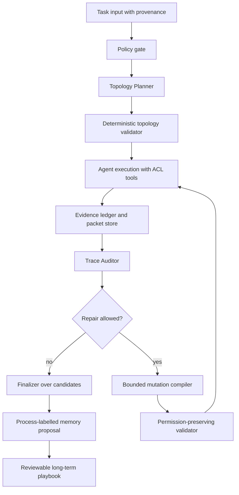

# MANTA：把多 Agent 的“通信拓扑”变成推理时可修复对象

> 元信息：Mao-Xun Huang、Jerry Wang、Yi-Cheng Lai、Zhenxing Zhang、Claire Cardie、Hen-Hsen Huang，arXiv:2607.28527v1，2026-07-30。原文：[arXiv 摘要页](https://arxiv.org/abs/2607.28527)；[HTML 全文](https://arxiv.org/html/2607.28527v1)；[PDF](https://arxiv.org/pdf/2607.28527)。分类：大模型 Agent / 多 Agent 系统 / 推理时自改进。

### TL;DR

- 这篇论文问的不是“多几个 Agent 是否更强”，而是：**多 Agent 系统在解一道题的过程中，能不能根据协作轨迹修复自己的通信结构**。
- 作者提出 MANTA，把 multi-agent topology 表示成受校验的结构：agent 角色、stage 角色、group pattern、边、上下文可见性、验证路径和 agent budget 都是可被规划与有限修改的对象。
- 执行循环是：Topology Planner 先按任务和长期 playbook 规划结构；任务 Agent 跑一轮；Trace Auditor 只看过程可见异常，不看 benchmark 真值；Controller 决定停止或允许一次 bounded repair；Skill Reflector 每 N 轮把过程信号压缩进长期 playbook。
- 实验使用 Gemma 4 31B medium reasoning effort，在 BrowseComp、StableToolBench、PlanCraft、WorkBench、MATH 五个 benchmark 上各 30 题、三次重复。MANTA 平均成功率 74.0，高于最强 baseline ADAS 的 68.2，领先 5.8 个百分点。
- 关键证据来自消融：完整 MANTA 在四个非 MATH benchmark 平均 71.7；去掉初始 Topology Planner 降到 57.5；去掉 topology mutation 降到 60.8；去掉长期 playbook 降到 66.7。
- 论文最有价值的点是把“协作失败”拆成可操作的结构修复：缺验证就加 critic，重复状态变更就串行化，检索分支过载就展开子组，过早共识就改通信边。
- 局限也很明确：Trace Auditor 不是正确性判定器。450 次 MANTA run 中，初始 audit 对错误答案的 precision 只有约 0.38、recall 约 0.64；decision-grade consensus 写入长期记忆后仍有 14.2% 错误率。
- 因此，这篇论文的结论不是“让系统自己改拓扑就可靠”，而是：在权重不变、benchmark 真值不可见的设定下，**过程信号足以支持一部分低成本、可审计、有限步的协作结构修复**。

### 研究问题：为什么 topology 比“多 Agent 数量”更重要？

作者的切入点很具体：

- 传统单 Agent 改进通常改输出、prompt、reasoning trace、tool skill 或 memory。
- 多 Agent 系统虽然有 coordinator、worker、verifier、debater、voter 等角色，但通信结构往往在部署前就固定。
- 自动 workflow design 方法会搜索结构，但多数是在测试前选出一个 workflow；执行中即使出现过载、重复写入、缺验证、过早共识，也不会按当前 trace 修改结构。

这使得论文提出一个更窄的问题：

> 对于每一个任务实例，系统能否在不更新权重、不看 ground truth、不离线搜索整套 workflow 的前提下，根据协作轨迹修复 topology？

这里的 topology 不只是“谁和谁连边”。论文把它扩成一组可执行约束：

| 结构对象 | 在系统里意味着什么 | 为什么是 Agent 问题 |
|---|---|---|
| structural role | coordinator、worker、verifier、debater、voter 等图位置 | 决定谁分解任务、谁生成、谁聚合 |
| stage role | worker 或 critic | 区分“做题”和“检查题” |
| group pattern | singleton、star、chain、debate、voting，可嵌套 | 决定并行、串行、辩论和投票方式 |
| direct edge | group 树之外的通信边 | 修复信息隔离或过早共识 |
| context policy | 每个 Agent 可读的消息、证据和发送者范围 | 防止所有 Agent 读到同一份不完整证据后假装独立 |
| validation pathway | critic、verifier、evidence ledger、finalizer | 把“看起来一致”转成“可检查的一致” |

作者真正反对的是一种常见但粗糙的假设：

- 如果任务复杂，就加更多 Agent。
- 如果结果不稳定，就多轮讨论。
- 如果有风险，就用投票或辩论。

MANTA 的主张更结构化：

- 有些错误来自任务分解不足，需要展开 overloaded branch。
- 有些错误来自并行状态变更，需要把执行顺序改成 chain。
- 有些错误来自验证缺失，需要插入 critic。
- 有些错误来自通信不充分，需要增加或重排可见性。
- 有些错误不是 topology 能修的，继续加 Agent 只会增加 token 和相关性偏差。

### 论文主张与论证路线

| Claim | Mechanism | Evidence | Boundary |
|---|---|---|---|
| 推理时自改进可以发生在 topology 层 | Planner 规划初始拓扑，Auditor 读 trace，Controller 允许一次有限修复 | 五个 benchmark 平均 74.0，强于最强 baseline 68.2 | 只证明在论文 harness、Gemma 4 31B 和选定任务集上有效 |
| 初始 topology planning 比固定协作模板更关键 | 用任务特征和长期 playbook 选择 agent 数、pattern、verifier、nested group | 消融中去掉初始 Planner：71.7 降到 57.5 | Planner 本身仍是 LLM 生成，需要 deterministic validator 兜底 |
| trace-backed repair 能补上执行中暴露的结构缺口 | repair mutation 最多 3 个 operation，且每 run 只允许一次 mutation | 去掉 topology mutation：71.7 降到 60.8；mutation budget 从 0 到 3 逐步提高覆盖 | repair 不是反事实实验；有 21.2% repair 反而增加 flag 数 |
| 长期 playbook 能迁移结构经验 | Skill Reflector 每 N 轮用 process-only 标签改写长期 skill | PlanCraft/WorkBench 互迁平均 +3.3；同域也 +3.3 | 提升幅度小，且不使用 ground truth 导致记忆标签有噪声 |
| 低成本结构适配优于大而固定的多 Agent 图 | 只在需要时加 critic、重排链路、压缩检索或展开分支 | MANTA 多 Agent 系统 token 最低，总计 77,652，低于多数静态 MAS 和 adaptive baseline | 单 Agent token 仍更低；MANTA 是多 Agent 内部更省，不是绝对最省 |

### 方法机制：MANTA 如何表示和修改拓扑？

MANTA 的核心不是一个新模型，而是一个 orchestration layer。它在目标多 Agent 系统外面工作：

- **目标层**：任务 Agent 真正解题、检索、调用工具、写中间答案。
- **编排层**：Planner、Auditor、Reflector 三个 LLM 组件，加上 deterministic code。
- **状态层**：packet store、evidence ledger、turn candidates、短期 playbook、长期 playbook。

可以把一个 topology 写成如下抽象：

```text
T_v = (A, G, E, R, C, B)

A: agents
G: pattern groups, such as singleton/star/chain/debate/voting
E: direct communication edges
R: structural roles and stage roles
C: context policies for message and evidence visibility
B: agent budget and mutation budget
```

一次修复不是任意重写系统，而是受限 mutation：

```text
mutation m = [op_1, op_2, op_3]

op in {
  expand_agent_to_group,
  set_group_pattern,
  add_agent,
  add_edge,
  remove_edge,
  set_context_policy
}

valid(T_v + m) => T_{v+1}
invalid(T_v + m) => conservative fallback or skip
```

这个表示很重要，因为它把“多 Agent 协作”从 prompt 约定拉回到可验证结构：

- group membership、cycle、role、agent budget 都由代码检查。
- context policy 在读取消息时由代码执行，不依赖 Agent 自觉遵守。
- agent 被 mutation 新增后没有私有历史，只通过 shared state 和 visibility policy 读旧证据。
- mutation 删除或替换某些活动结构时，旧 packet 和 evidence ledger 不丢失。

### 算法流程：一个有限步的 trace-backed repair loop

论文的 MANTA 循环可以写成伪代码：

```text
Input:
  task x
  backbone model M
  long_term_playbook L
  max_initial_agents K0
  max_total_agents K
  mutation_budget b <= 3

State:
  topology T
  packet_store P = []
  evidence_ledger E = []
  short_term_playbook S = []
  turn_candidates C = []

Procedure:
  T <- TopologyPlanner(x, L, K0)
  if not valid(T):
      T <- deterministic_fallback(x, K0)

  for turn in {0, 1}:
      artifacts <- execute_agents(T, x, P, E)
      P.append(relay_packets(artifacts))
      E.append(evidence_claims(artifacts))
      C.append(best_candidate(artifacts))

      audit <- TraceAuditor(x, T, artifacts, P, E)
      S.append({topology: T, audit: audit})

      if audit.has_no_medium_or_high_repairable_flag():
          return Finalizer(C, E)

      if turn == 0 and b > 0:
          m <- TopologyPlanner.repair(T, audit, S, L)
          if valid(T + m):
              T <- T + m
              b <- b - len(m)
              continue

      return Finalizer(C, E)

Output:
  final answer
  process summary for future reflection

Failure boundaries:
  wrong answer with clean process signal
  correct answer with noisy process flag
  invalid mutation proposal
  repair that removes a flag but damages answer quality
```

这个流程有三个研究上值得注意的选择：

- **Auditor 不看 ground truth**：它只能找过程异常，比如证据丢失、缺 validator、branch collapse、duplicate state mutation。
- **repair 是 bounded**：不是无限自我修改；一次 run 只允许有限 mutation，避免系统在错误诊断上越改越远。
- **长期记忆只吃过程信号**：Reflector 不知道答案对错，只知道 trace 是否干净、是否达到 decision-grade consensus。

### 两层记忆：短期避免重复失败，长期学习结构经验

MANTA 的记忆设计有一个明显的安全边界：

- 短期 playbook 记录当前 run 的 topology、audit findings、repair recommendation 和 controller decision。
- 长期 playbook 是一个 markdown skill，由 Skill Reflector 每 N 次 run 后重写。
- Planner 在初始规划和 repair 时都会读长期 playbook。
- Reflector 输入只有 process labels，不含 benchmark verdict。

这意味着它不是 supervised workflow search：

| 机制 | 输入 | 输出 | 不允许看到什么 |
|---|---|---|---|
| Topology Planner | 任务 preview、长期 playbook | 初始 topology JSON | benchmark 答案 |
| Trace Auditor | trace、tool record、artifact、topology | process flags 与 repair 建议 | ground truth verdict |
| Skill Reflector | 最近 run 的过程摘要 | 改写长期 topology skill | 正确/错误标签 |
| Controller | audit severity、预算、validator 结果 | stop 或 repair | 任务真值 |

这个边界让论文更像“过程治理”而不是“结果训练”。好处是更贴近真实部署：系统通常拿不到标准答案。代价是记忆会带噪声：一个过程干净的 run 可能答案错，一个过程有 flag 的 run 可能最终答对。

论文在附录里没有回避这一点。作者报告：满足写入长期记忆条件的 run 正确率为 85.8%，高于全体 corpus 的 74.0%，但仍有 14.2% 错误率。这说明长期 playbook 是高收益筛选器，不是正确性 oracle。

### 实验设置：五类能力，不只测数学题

实验覆盖五个 benchmark：

| Benchmark | 能力类型 | 为什么适合测 topology |
|---|---|---|
| BrowseComp | 信息寻求与证据综合 | 容易出现检索 facet 分解、证据覆盖和聚合失败 |
| StableToolBench | 工具选择与外部调用 | 容易出现工具失败、重复调用和未验证工具输出 |
| PlanCraft | 长程规划 | 依赖步骤顺序和依赖关系，适合测 chain/debate/verification |
| WorkBench | 多步工作流 | 有现实 workflow 和状态变更风险 |
| MATH | 结构化推理 | 检查 topology 是否只对 tool/retrieval 有效，还是能迁移到 reasoning |

统一设置：

- backbone：Gemma 4 31B，medium reasoning effort。
- 每个 benchmark 30 个问题。
- 每个实验重复三次。
- baseline 包括 single-agent reasoning、static MAS、adaptive MAS/workflow design。

baseline 分三组：

| 组别 | 方法 |
|---|---|
| Reasoning models | Single Agent、CoT、Self-Consistency、Self-Refine |
| Static MAS | Voting、Group Chat Debate、Fully Linked Debate、Orchestrator without Discussion、Orchestrator with Discussion、Orchestrator Tree |
| Adaptive MAS | AFlow、ADAS、AgentSquare、MASS |

这样的实验设计有两个优点：

- 它不是只拿 MANTA 对比单 Agent，而是对比固定 topology 和自动 workflow design。
- 它把信息寻求、工具、规划、工作流、数学放在同一张表里，能观察 topology 是否只在某一类任务上取巧。

不足也很明显：

- 每个 benchmark 只有 30 题，三次重复，统计稳定性仍有限。
- 论文没有给出完整开源代码仓库；复现依赖作者的 harness 细节。
- 所有方法使用同一 backbone 是公平性优点，但也限制了对更强/更弱模型的外推。

### 主结果：平均领先，但不是每一列都赢

Table 1 是主证据。MANTA 五项平均 74.0，最强 baseline ADAS 平均 68.2，领先 5.8 个百分点。

关键数字如下：

| 方法 | BrowseComp | StableToolBench | PlanCraft | WorkBench | MATH | Average |
|---|---:|---:|---:|---:|---:|---:|
| Single Agent | 34.4 | 74.4 | 61.1 | 41.1 | 85.6 | 59.3 |
| Voting | 43.3 | 85.6 | 61.1 | 41.1 | 92.2 | 64.7 |
| Orchestrator w/ Discussion | 64.4 | 80.0 | 73.3 | 20.0 | 93.3 | 66.2 |
| ADAS | 48.9 | 77.8 | 57.8 | 66.7 | 90.0 | 68.2 |
| AgentSquare | 32.2 | 88.9 | 34.4 | 62.2 | 96.7 | 62.9 |
| MANTA | 76.7 | 82.2 | 76.7 | 43.3 | 91.1 | 74.0 |

这张表应当谨慎读：

- MANTA 在平均分最高，并且在 BrowseComp、PlanCraft 最强。
- StableToolBench 最强是 AgentSquare 的 88.9，MANTA 是 82.2。
- WorkBench 最强是 ADAS 的 66.7，MANTA 是 43.3。
- MATH 最强是 AgentSquare 的 96.7，MANTA 是 91.1。

所以论文的强 claim 不是“MANTA 每项最强”，而是：

- 当任务类型变化较大时，自适应 topology 的平均鲁棒性更高。
- 固定多 Agent 模板经常在某类任务上好、另一类任务上塌。
- MANTA 把结构适配作为 per-instance 机制，因此在跨类型平均上占优。

### 消融：到底是谁贡献了增益？

Table 2 的消融比主表更能说明机制：

| Ablation setting | Success | Input tokens | Output tokens | Total tokens |
|---|---:|---:|---:|---:|
| Full MANTA | 71.7 | 94,811 | 5,504 | 100,315 |
| No initial Topology Planner | 57.5 | 105,941 | 6,099 | 112,040 |
| No topology mutation | 60.8 | 67,528 | 4,577 | 72,105 |
| No long-term playbook update | 67.5 | 97,145 | 5,474 | 102,620 |
| No long-term playbook | 66.7 | 74,067 | 4,289 | 78,356 |

可以拆成三层判断：

- **初始规划是最大单项贡献**：从 71.7 到 57.5，说明一开始选错结构，后面 repair 很难完全补救。
- **执行时 mutation 是第二大贡献**：从 71.7 到 60.8，说明 trace-backed repair 不只是装饰。
- **长期 playbook 是稳定增益**：去掉更新或去掉 playbook 都下降，但幅度小于前两者。

这也提示一个重要边界：

- 如果只有少量任务或没有可靠过程日志，长期 playbook 不会神奇地产生能力。
- 如果初始 topology 规划很差，repair 预算有限时容易来不及修。
- 如果 Auditor 的 process flags 对某类任务不敏感，mutation gate 就可能漏掉错误。

### Mutation budget：第一步修复最值钱

作者把 mutation budget 从 0 到 3 做了 progressive evaluation：

- budget 0：只依赖初始 topology 和长期 playbook。
- budget 1：允许一次结构修复。
- budget 2/3：继续覆盖前面没解决的困难任务。

Figure 4 的结论是：四个 benchmark 随 budget 增加都提升，但最大平均增益来自第一次 mutation。

这很符合 Agent 工程直觉：

- 第一次 repair 通常对应最明显的结构缺陷，例如少验证、重复写、分支过载。
- 后续 repair 的信号更弱，收益边际递减。
- 允许太多次结构自改反而会引入调试困难和更多错误诊断链。

因此，MANTA 的一个实用启发不是“开放无限自改”，而是：

- 把 mutation 看作异常处理。
- 先用 deterministic guard 限定操作集合。
- 对每次 repair 记录明确的 audit target。
- 最终保留 repair 前后的候选答案，避免坏修复覆盖好 incumbent。

### Token 使用：MANTA 不是绝对省 token，而是多 Agent 中更省

Table 4 把 token 分成 offline 和 inference：

| 系统 | Offline total | Inference total | Overall total |
|---|---:|---:|---:|
| Single Agent | - | 21,811 | 21,811 |
| Voting | - | 80,781 | 80,781 |
| Group Chat | - | 201,651 | 201,651 |
| AFlow | 132,517 | 18,553 | 151,070 |
| ADAS | 247,675 | 27,728 | 275,403 |
| AgentSquare | 143,056 | 14,938 | 157,993 |
| MASS | 53,148 | 127,878 | 181,026 |
| MANTA | - | 77,652 | 77,652 |

这张表容易被误读。正确读法是：

- 单 Agent 仍然最省 token，但成功率较低。
- MANTA 在多 Agent 系统中 token 最低，且不需要 offline workflow search 成本。
- MANTA 的 meta-level 操作大约占 inference budget 的 12%，即 9,416 meta tokens 对 68,236 inner-agent tokens。

所以 MANTA 的成本主张是：

> 与其每题都跑一个大而固定的群聊，不如先选小结构，只在 trace 暴露结构缺陷时做有限修复。

这比“多 Agent 越多越可靠”的叙事更克制，也更容易工程化。

### 失败模式：Auditor 到底在抓什么？

论文附录给出 deterministic audit taxonomy 和统计。重要 process flags 包括：

| Process flag | Runs | Success gap | Cleared after targeted repair |
|---|---:|---:|---:|
| Evidence lost before synthesis | 7 | -60.7 | 6/6 |
| Missing validator | 71 | -46.1 | 17/19 |
| Branch collapse | 100 | -38.6 | 4/12 |
| Give-up shaped candidate | 36 | -32.1 | n/a |
| Premature consensus | 48 | -17.5 | 9/11 |
| Duplicate state mutation | 143 | -14.2 | 23/39 |
| Insufficient search coverage | 68 | -5.8 | n/a |
| Message compaction loss | 131 | +2.2 | 5/8 |
| Tool error cascade | 61 | +5.4 | 23/51 |

这里有两个关键细节：

- 七个 flag 与更低成功率相关，说明 process signals 不全是噪声。
- 但 message compaction loss、tool error cascade 反而不显示负相关，说明有些 flag 是可恢复事件，不应一律触发高严重度 repair。

Table 8/9 进一步校准 Auditor：

| 指标 | All runs |
|---|---:|
| 初始 audit flagged runs | 200 |
| flagged 且答案错误 | 75 |
| flagged 但答案正确 | 125 |
| clean 但答案错误 | 42 |
| clean 且答案正确 | 208 |
| precision | 0.38 |
| recall | 0.64 |
| FPR | 0.38 |
| FNR | 0.36 |

这对论文结论非常重要：

- Auditor 能抓住一部分错误相关过程信号。
- Auditor 不能替代评测器或 verifier。
- 过程异常和答案错误不是同一个概念。
- repair target 被清除也不等于答案变对。

作者明确提出后续验证方向：

- 对分层抽样 trace 做人工过程标注，评估 process flag 的 precision/recall。
- 从同一 trace prefix 做 paired replay，对比推荐 mutation 与等预算 continuation。

### repair 案例细读：为什么“结构修复”不是简单加人？

论文的 case study 对理解 MANTA 很关键，因为它把 topology mutation 从抽象 operator 拉回到具体失败场景。

| 场景 | 初始结构问题 | MANTA 的 repair | 研究含义 |
|---|---|---|---|
| StableToolBench / BrowseComp 多 facet 检索 | star 里某个 worker 负责过多检索面向，且工具失败没有下游验证 | 把过载 worker 展开成 dedicated subgroup | 问题不是全局加人，而是只扩展拥塞分支 |
| singleton 低置信输出 | 没有人检查候选答案 | 加一个 critic / verifier | 新 agent 的职责是验证，不是重复求解 |
| 并行 state-changing action | 多个 worker 可能重复执行同一写操作 | 把 star 改成 chain，串行化执行 | topology 也承担权限与幂等控制 |
| PlanCraft 过早共识 | 三个 agent 很快同意，但仍有未解决问题 | 增加 worker-verifier 直接边，转成更充分 debate | 修复信息流，而不是扩大 agent budget |

这几类修复共同说明：

- **扩容不是默认动作**：Table 11 中 add_agent 只占 9.3%，最常见的是 deterministic retrieval contraction、group pattern 改写和 branch expansion。
- **修复目标来自 trace**：每个 mutation 都应当对应具体 flag，例如 missing validator、duplicate state mutation、premature consensus。
- **结构修复有反效果风险**：151 次 repair 中，92 次减少 flag，27 次不变，32 次增加 flag；也就是说，MANTA 本身提供的是受控尝试，不是保证改好。
- **好的 repair 要有 counterfactual information gain**：如果多个 Agent 访问的是同一份只读数据，再加一个同权限 Agent 大概率只会复制错误；这时应调整上下文、验证路径或停止。

这也是论文相对成熟的一点：它没有把多 Agent 神化，而是把“什么时候别加 Agent”写进 Planner repair prompt。对于真实系统，这个原则比榜单分数更重要，因为大多数生产事故不是少一个聊天伙伴，而是缺少授权边界、证据边界和状态变更边界。

### 安全角度的再解释：topology mutation 必须 permission-preserving

如果把 MANTA 放进 AI 安全或企业 Agent 语境，最危险的误读是：

- 既然系统能自修复拓扑，那它也可以在失败时自动扩大权限。
- 既然 Auditor 发现缺验证，那它可以让新 Agent 读取更多数据。
- 既然 state mutation 重复了，那 Planner 可以重新安排谁来写外部系统。

论文没有主张这些权限扩张。相反，它更接近一个结构守恒框架：

```text
Allowed mutation:
  change topology under existing capability set

Forbidden in safer deployments:
  grant new tool permission
  bypass original approval policy
  expose hidden evidence across ACL boundary
  turn a verifier into a writer
  let untrusted task text change mutation policy
```

因此，MANTA-like 系统如果要进入安全场景，需要把 topology validator 拆成两层：

| Validator | 检查对象 | 失败时行为 |
|---|---|---|
| Structural validator | group、edge、role、cycle、agent budget、operator budget | fallback 或 skip mutation |
| Policy validator | tool ACL、data classification、write permission、approval requirement、provenance | 拒绝 mutation，并记录不可自动修复原因 |

这样才能避免一个常见问题：系统把“协作失败”误解释成“权限不足”。在安全设计里，缺权限经常是正确状态，而不是需要自我修复的 bug。

### 复现实验建议：怎样验证 MANTA 的关键 claim？

如果要复现这篇论文，我会优先做三组最小实验，而不是一开始复刻全部五个 benchmark。

| 实验 | 目的 | 关键观测 |
|---|---|---|
| paired replay | 从同一 trace prefix 分叉，一支用推荐 mutation，一支继续原 topology | 证明 repair 本身是否带来因果收益 |
| process-label audit | 人工标注一批 trace 是否真的存在 missing validator、duplicate mutation 等缺陷 | 校准 Auditor 的 process precision/recall，而不是拿答案对错替代 |
| permission-preserving mutation | 给每个 Agent 绑定工具 ACL，验证 mutation 后权限不扩大 | 检查 topology 改写是否会产生越权信息流 |

最小可复现 harness 应记录：

- 每个 topology version 的完整 JSON。
- mutation 前后的 validator 结果。
- 每个 Agent 可见 packet 和 evidence digest。
- Auditor 引用的 trace 证据原文。
- Controller 为什么 stop 或 repair。
- Finalizer 是否采用 repair 前 incumbent。

如果这些日志缺失，MANTA 的很多结论只能停留在“方法描述可信”，而难以审计“某次 repair 是否真的合理”。这也是论文后续工程化最该补的空白。

### Figure/Table 逐项证据解读

| 图表 | 支持的结论 | 不能证明什么 |
|---|---|---|
| Figure 1 | MANTA 位于 self-improvement 层级中的 topology 层，不更新权重 | 不能证明 topology 层总比 prompt/memory 层更重要 |
| Figure 2 | Planner、Auditor、Controller、Playbook 的闭环结构清楚 | 不能证明每个组件的 LLM 判断都可靠 |
| Table 1 | MANTA 跨五 benchmark 平均最佳，74.0 | 不能证明每个任务类型都最佳 |
| Table 2 | 初始规划和 repair 是主要贡献 | 不能排除 prompt 工程或 harness 细节影响 |
| Figure 4 | mutation budget 增加带来覆盖提升，第一步最明显 | 不是严格反事实 causal proof |
| Table 3 | 长期 playbook 有同域与跨域迁移增益 | 增益只有 +3.3，样本仍小 |
| Table 4 | MANTA 在多 Agent 系统中 token 使用低 | 不说明它比单 Agent 更省 |
| Tables 8-10 | audit flag 与错误有相关性，但噪声很高 | 不能把 Auditor 当正确性 oracle |
| Table 11 | repair 更常改结构而非加人，add_agent 只占 9.3% | 不能证明这些 operator 集合覆盖真实部署全部失败 |
| Figures 7-8 | agentic loop 和 context controller 说明状态迁移边界 | 仍需代码级复现证明实现无漏读/越权 |

### 相关工作中的位置判断

论文把 prior work 分成多个 self-improvement 层级：

- L0：输出修正，例如 Self-Refine。
- L1：prompt 优化，例如 APE、APO、DSPy、MIPRO、PromptBreeder。
- L2：trace 搜索，例如 CoT、self-consistency、Tree-of-Thought、Graph-of-Thought。
- L3：skill/tool，例如 ReAct、Toolformer、Voyager。
- L4：memory，例如 Reflexion、Generative Agents、A-MEM。
- L5：agent role，例如 CAMEL、ChatDev、MetaGPT、debate。
- L6：topology，例如 MASS、AFlow、ADAS、AgentSquare、MANTA。
- L7：weights，例如 RLHF。

MANTA 的位置不是完全新开一层，而是把 L6 从“部署前搜索”推进到“执行时修复”：

- AFlow、ADAS、AgentSquare、MASS 都承认 workflow/topology 是优化对象。
- MANTA 的差异在于：当前任务 trace 可以触发 topology mutation。
- 它还把长期经验写成 playbook，而不是把验证集上最优 workflow 固定下来。

这个定位对 Agent 研究有意义，因为它把自改进对象从“模型输出”换成“协作制度”：

- 输出错了，可能不是某个 Agent 不会做。
- 可能是证据没有传到 aggregator。
- 可能是 worker 并行写了同一个外部状态。
- 可能是 verifier 缺席。
- 可能是大家过早达成同一个错误共识。

### 证据边界与可复现性

这篇论文的边界需要单独强调：

- **代码可得性**：arXiv 页面没有显示官方代码仓库；第三方页面多为摘要或复述，不构成复现证据。
- **benchmark 规模**：每个 benchmark 30 题，三次重复，适合比较趋势，不足以覆盖真实生产环境。
- **模型限定**：主实验使用 Gemma 4 31B medium reasoning effort，不代表更小模型也能稳定做 Planner/Auditor/Reflector。
- **Auditor 噪声**：precision 约 0.38，说明大量 flagged runs 最终仍正确；repair gate 必须保守。
- **过程信号不等于正确性**：decision-grade consensus 正确率 85.8%，仍保留 14.2% 错误。
- **安全边界未充分展开**：论文有 context policy 和 untrusted diagnosis 的设计，但没有系统化讨论 prompt injection、tool permission、数据 exfiltration 或外部状态写入授权。
- **缺少强反事实修复评估**：作者报告 repair 前后 flag 变化，但也承认需要 paired replay 来隔离 mutation 本身的因果贡献。

这些边界不削弱论文的主要贡献，反而说明它的结论应该被限定为：

- MANTA 是一个有实验证据的 topology-level self-improvement 框架。
- 它提高了多 Agent 系统在若干 benchmark 上的平均表现。
- 它把结构修复做成有限、可校验、可审计操作。
- 它尚未证明“自修复 Agent 组织”在开放环境里天然安全或可靠。

### 领域延伸：Agent 系统真正需要的是结构化授权和结构化修复

从 AI Agent 研究角度看，MANTA 最值得带走的不是某个 benchmark 分数，而是一个设计转向：

- 把“Agent 协作方式”当成运行时状态，而不是 prompt 模板。
- 把“协作失败”写成可检测 taxonomy，而不是事后解释。
- 把“修复”限制在小的、可验证的 operator 集合内。
- 把“记忆”限制为过程信号和结构经验，而不是随意累积聊天记录。
- 把“上下文可见性”交给代码执行，而不是交给自然语言承诺。

如果把它用于更高风险的 Agent 系统，还需要补上几类机制：

| 风险 | MANTA 已有基础 | 仍需补强 |
|---|---|---|
| prompt injection | Auditor 把任务文本当不可信数据，要求引用 trace evidence | 需要外部输入 provenance、taint tracking、工具调用隔离 |
| 权限扩大 | topology mutation 有 agent budget 和 operator limit | 需要 capability ACL，mutation 不得提升工具权限 |
| 重复外部写入 | playbook 原则要求状态变更集中到单 executor | 需要幂等键、审批日志、dry-run/commit 分离 |
| 错误记忆写入 | 长期 playbook 只用 process signals | 需要回滚、版本化、人工审核或高置信门槛 |
| 错误修复覆盖好答案 | final answer 在 turn candidates 上投票，保留 incumbent | 需要保存完整反事实证据和可重放 trace |

一个更防御性的 MANTA-like 架构可以写成：



这个图里的重点是：Planner 可以改通信结构，但不能凭空扩大权限；Auditor 可以建议 repair，但建议本身是不可信诊断；Reflector 可以写记忆，但记忆应当版本化、可回滚、可审计。

### 结论

MANTA 的研究贡献可以压缩成一句话：

> 多 Agent 系统的自改进不一定要动权重，也不一定只改 prompt；它可以在推理时根据协作轨迹，对通信拓扑做小而受控的结构修复。

这篇论文最扎实的部分是：

- 明确定义 topology-level self-improvement。
- 给出可校验的 topology representation 和 bounded mutation operators。
- 用五个 benchmark 对比 single-agent、static MAS 和 adaptive MAS。
- 通过消融说明初始规划、执行时 repair、长期 playbook 各自贡献。
- 用 audit 统计承认 process signals 的噪声和边界。

最需要后续补强的部分是：

- 公开完整实现和可重放 trace。
- 用人工标注校准 Auditor 的 process flag。
- 用 paired replay 证明 mutation 的因果效果。
- 在真实工具权限、外部状态写入、恶意输入场景下验证安全边界。

对 Agent 领域来说，MANTA 提醒我们：多 Agent 的关键不只是“多角色分工”，而是**谁能看见什么、谁能验证谁、谁能执行状态变更、什么时候允许结构改变、改变后如何保留证据和责任链**。这比简单堆 Agent 更接近可维护、可审计的自主系统设计。
