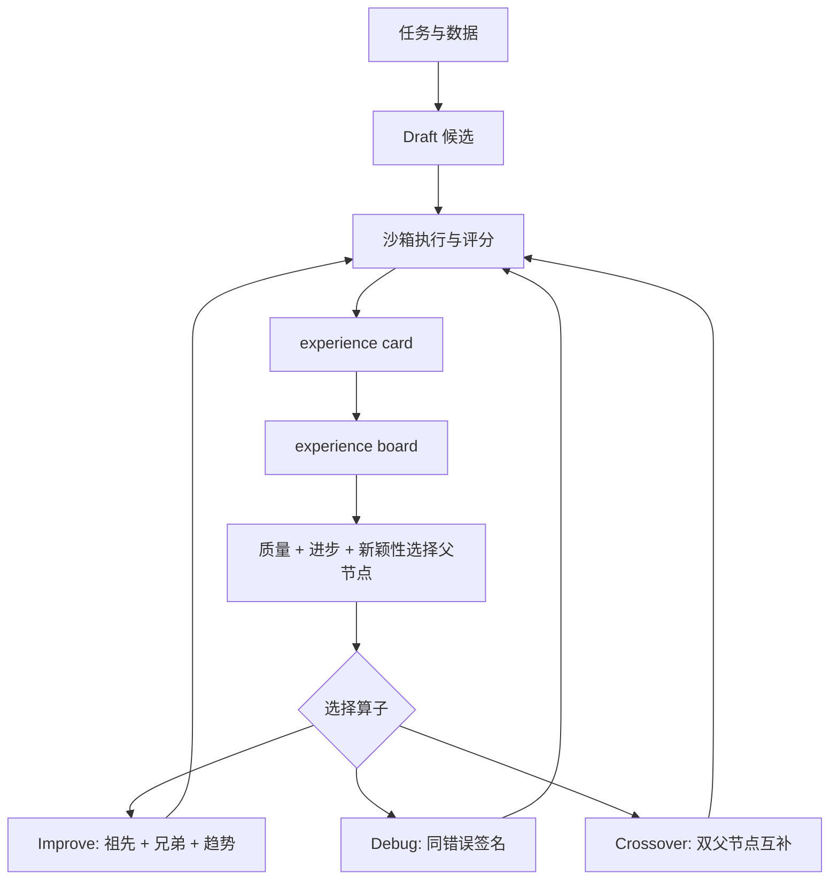

# Frontis-MA1：把 AI4AI 从口号压到可执行 MLE 训练闭环

- 原文：Frontis-MA1: Training an AI4AI Model towards Recursive Self-Improvement in Machine Learning Engineering
- 链接：[arXiv:2607.28568v1](https://arxiv.org/abs/2607.28568)
- 项目：[OpenRSI / OpenMLE](https://github.com/FrontisAI/OpenRSI)
- 模型：[Frontis-MA1-35B](https://huggingface.co/FrontisAI/Frontis-MA1-35B)
- 日期：arXiv v1 提交于 2026-07-30 17:34:01 UTC，项目仓库在 2026-07-31 标记 First OpenRSI release
- 方向：大模型 Agent、大模型后训练、AI4AI、机器学习工程自动化

### TL;DR

- Frontis-MA1 关心的不是“模型会不会写代码”这个宽问题，而是一个更窄也更可测的问题：能否训练一个模型，反复生成、改进、调试、重组机器学习实验代码，并用真实执行结果把这种改进能力再写回模型。
- 论文把 AI4AI 拆成 OpenMLE-Gym、OpenMLE-ERL、OpenMLE-Evo 三层：前者提供 5,758 个可执行任务和沙箱反馈，中间层用执行验证轨迹做 SFT 与 RL，后者在推理时维护候选程序群体、经验卡和操作条件记忆。
- Frontis-MA1-35B 从 Qwen3.6-35B-A3B 出发，学习四个共享原子算子：Draft、Improve、Debug、Crossover。训练时学这些算子，推理时也由 OpenMLE-Evo 组合这些算子，因此训练目标和长程搜索接口对齐。
- 主要证据来自 MLE-Bench Lite：在相同 OpenMLE-Evo harness 下，35B 基座 Medal Average 为 39.39%，Frontis-MA1-35B 为 60.61%，提升 21.22 个百分点；OpenMLE-Evo-Max 进一步到 71.21%。
- 论文还做了 30B 复现实验：Qwen3-30B-A3B-Thinking-2507 在同一 harness 下为 34.85%，Frontis-MA1-30B 到 53.03%，说明收益不只绑定一个 35B checkpoint。
- 长程证据比总分更有价值：leaf-classification 案例里，Debug 先建立可行分支，Crossover 融合图像与表格证据，晚期 Improve 把 Human Rank 推到 0.7713，held-out Human Rank 到 0.9455 并拿到 Bronze。
- 局限也很清楚：这不是完整 RSI；目标主要来自执行分数，不等于研究品味、鲁棒性、安全性或模型自我改进；OpenMLE-Evo-Max 是模型加搜索系统结果，不应解释成纯模型能力。

### 1. 研究问题：AI4AI 为什么要先落到 MLE

- 论文开场其实在收窄“递归自我改进”这个容易泛化过度的概念。
- 作者没有直接声称系统能改进下一个基础模型，而是把问题压到一个有执行反馈的中间层：
  - 任务是机器学习工程，即根据数据、指标和提交格式写出可运行训练或推理程序。
  - 反馈来自真实沙箱运行、评测脚本、错误日志、产物和最终分数。
  - 改进不是一次性生成，而是在固定预算内不断产生候选程序并选择更好的程序。

| 概念 | 论文中的位置 | 可验证性 | 还没有覆盖的部分 |
| --- | --- | --- | --- |
| AI4AI | AI 帮助构建或改进 AI 系统 | MLE 代码和实验结果可执行 | 不等于全流程模型研发 |
| Evolution | 候选程序根据执行反馈反复变异 | 沙箱分数可比较 | 变异策略本身可能固定 |
| Meta-evolution | 用变异轨迹训练“提出变异的模型” | SFT/RL 可记录训练数据 | 还不是持续自举的 RSI |
| RSI | 每代系统改进产生下一代系统的过程 | 论文只把它作为远期目标 | 没有证明通用递归自改进 |

- 这个定义的意义在于：
  - 它避免把“agent 试了更多次”包装成“自我改进”。
  - 它要求每个改进都能落到一个程序、一次执行、一个反馈记录。
  - 它把训练和推理统一到同一套程序变换接口上。

### 2. 形式化：把程序搜索写成可训练目标

论文给出的核心对象可以简化成下面的执行闭环：

```text
给定任务 tau、算子 a_t、上下文 c_t：

p_t ~ g_theta(. | tau, a_t, c_t)
s_t = R_tau(E(p_t, tau))

目标：
p_star = argmax over t in I of signed_score(s_t)
```

- 变量解释：
  - `tau`：一个 MLE 任务，包含说明、公开数据、提交契约、隐藏 evaluator 和沙箱资源预算。
  - `a_t`：当前使用的原子算子，可以是 Draft、Improve、Debug 或 Crossover。
  - `c_t`：算子上下文，例如父程序、兄弟节点、错误类型、历史改进和剩余预算。
  - `g_theta`：参数为 `theta` 的语言模型策略，输出候选程序。
  - `E`：沙箱执行器，负责运行程序、保存日志和产物。
  - `R_tau`：任务特定评分器，把提交结果转成可比较分数。
  - `I`：本次搜索预算内所有已评估候选程序索引。

训练目标可以概括为：

```text
L_evo(theta) =
  - E[(tau_i, a_i, c_i, p_i)] [
      w(s_i) * log g_theta(p_i | tau_i, a_i, c_i)
    ]

s_i = R_tau_i(E(p_i, tau_i))
```

- 这里的关键不是公式复杂，而是 `w(s_i)` 的来源：
  - 在 SFT 里，`w` 近似是质量过滤后的正样本保留。
  - 在 RL 里，`w` 来自执行奖励、动态归一化和组内优势。
  - 两者都要求程序真实跑过，而不是只靠静态代码评分。

### 3. OpenMLE-Gym：一个 gym，不只是一个数据集

- OpenMLE-Gym 是整篇论文最底层的可验证基座。
- 它构造了 5,758 个 executable tasks，来源分三类：
  - 156 个 Curated Anchors，质量高但规模小。
  - 3,362 个 Kaggle Dataset 任务，规模大但需要额外质量控制。
  - 2,240 个 Kaggle Competition 任务，来自有问题描述、指标和 leaderboard 的竞赛。

| 来源 | 数量 | 优点 | 风险控制 |
| --- | ---: | --- | --- |
| Curated Anchors | 156 | 专家选择，语义可靠 | 规模有限 |
| Kaggle Datasets | 3,362 | 覆盖广，便于扩展 | 用 package 级和语义级过滤 |
| Kaggle Competitions | 2,240 | 有任务说明、指标和提交协议 | 排除 MLE-Bench 重叠，检查许可和规则 |
| 总计 | 5,758 | 可作为训练、搜索、评测底座 | 仅 1,415 个释放完整数据包，其余释放脚本 |

- 一个任务包被规范成统一结构：
  - `data/public/` 给 agent 可见的输入、说明、样例提交。
  - `data/private/` 保存隐藏答案或测试真值。
  - `utils/prepare.py` 做确定性预处理和切分。
  - `utils/metric.py` 做提交校验和标量评分。


- 这部分的研究意义：
  - 后训练不能只拿“看起来合理的代码”做样本。
  - MLE agent 的能力必须由运行、提交、评分、错误日志和产物共同定义。
  - 如果任务包不能重复执行，后面的 RL 奖励和长程搜索都会失真。

### 4. OpenMLE-ERL：为什么只学 Draft 不够

- 论文把推理时的程序演化拆成四个可训练算子：
  - Draft：从零生成完整候选程序。
  - Improve：基于父程序和反馈改进已有程序。
  - Debug：修复执行失败、提交失败或评测失败。
  - Crossover：重组两个父程序，把互补证据合并到一个新候选里。

| 算子 | 输入 | 输出 | 为什么要单独训练 |
| --- | --- | --- | --- |
| Draft | 任务说明、数据契约 | 初始程序 | 决定搜索树第一批可行分支 |
| Improve | 父程序、分数、日志、方向 | 更强版本 | 承接连续优化，不只是修 bug |
| Debug | 错误程序、错误类型、日志 | 可执行修复 | MLE 任务大量失败来自环境和提交细节 |
| Crossover | 两个父程序及其优缺点 | 融合程序 | 让图像、表格、音频、特征工程等分支互补 |

- SFT 数据来自两条路径：
  - parallel path：独立采样并执行完整 Draft，保留阈值通过样本，形成 17,245 个 full-response examples。
  - evolutionary path：对已执行程序做 Improve、Debug、Crossover，保留局部轨迹中有用步骤，形成 9,014 个 trajectory-step examples。
  - 合计释放 26,259 个 execution-grounded SFT examples。

- RL 部分解决三个 MLE 特有问题：
  - 不同任务指标方向和范围不同，accuracy、AUC、log loss、RMSE 不能直接比较。
  - 执行耗时差异巨大，同步等待最慢沙箱会浪费训练时间。
  - Improve/Debug/Crossover 的父程序选择会强烈影响训练质量。

奖励归一化可以写成：

```text
r_base(s; b_best, b_worst) =
  clip((signed_s - b_worst) / (b_best - b_worst), 0, 1)^alpha
```

- 但固定上下界会让当前策略附近的强弱程序挤在一起。
- OpenMLE 因此使用 adaptive bounds，把当前 on-policy 前沿附近的分数差异重新拉开。
- 再用 entropic advantage 放大组内上尾候选：

```text
A_ent_i ≈ exp(beta * r_proc_i)
          / mean_{j != i} exp(beta * r_proc_j)
          - 1
```

- 这背后的判断是：
  - MLE 评测看的是固定预算内找到的最好程序。
  - 一个刚好能提交的程序，不应该和组内最好程序拿到同等正奖励。
  - RL 的学习信号应集中到高质量候选，而不只是“有效提交”。

### 5. OpenMLE-Evo：推理时的搜索也要有结构化经验

- OpenMLE-Evo 的核心不是“多试几次”，而是把执行经验变成可查询状态。
- 每个评估过的候选节点都会生成 experience card：
  - 候选来源和父节点。
  - 方法族。
  - 验证分数和相对父节点改进。
  - 执行状态、错误类型、运行时间和资源使用。
  - 排名、是否 incumbent、是否新方向。

父节点选择不只看当前分数，而是三项组合：

```text
U_i = lambda_s * score_i
    + lambda_delta * improvement_i
    + lambda_n * novelty_i

P(i | I) = softmax(U_i / tau)
```

| 因子 | 作用 | 避免的问题 |
| --- | --- | --- |
| 当前质量 | 继续利用高分程序 | 完全随机搜索 |
| 相对父节点进步 | 保留正在上升的分支 | 只看绝对分数丢掉潜力分支 |
| 方法族新颖性 | 分配预算给未充分探索方向 | 早期强分支垄断搜索 |

- 记忆也不是把全部历史塞进 prompt：
  - Improve 读取父节点、近期祖先、直接兄弟和全局方法族统计。
  - Crossover 分别读取两个父节点，并加入互补性提示。
  - Debug 优先取相同错误签名的历史尝试。
  - 自然语言记忆是被选中后才合成，而不是每个节点都提前总结。



### 6. 主实验：模型收益和搜索收益要分开看

- 评测设置：
  - 数据集：官方 MLE-Bench Lite 22-task split。
  - 预算：每任务 12 小时。
  - 资源：单 RTX 4090，12 GB VRAM cap。
  - 次数：三次独立运行。
  - 指标：Valid Rate、Medal Average、Human Rank。

| 模型或系统 | Harness | Valid Rate | Medal Average | Human Rank | 解释 |
| --- | --- | ---: | ---: | ---: | --- |
| Qwen3.6-35B-A3B | OpenMLE-Evo | 19.67/22 | 39.39% | 0.5828 | 35B 基座，同一搜索框架 |
| Frontis-MA1-35B | OpenMLE-Evo | 21.67/22 | 60.61% | 0.7647 | 纯粹模型后训练收益的主要证据 |
| Frontis-MA1-35B | OpenMLE-Evo-Max | 22.00/22 | 71.21% | 0.8126 | 模型加增强搜索系统收益 |
| Qwen3-30B-A3B | OpenMLE-Evo | 17.33/22 | 34.85% | 0.5573 | 30B 基座 |
| Frontis-MA1-30B | OpenMLE-Evo | 21.67/22 | 53.03% | 0.7055 | 第二骨干上的复现 |
| Frontis-MA1-30B | OpenMLE-Evo-Max | 22.00/22 | 66.67% | 0.8053 | 30B 的系统级增强 |

- 这里最该关注两个控制比较：
  - 固定 OpenMLE-Evo，只换模型：39.39% 到 60.61%，说明执行 grounded 后训练确实改变了模型在同一搜索器里的表现。
  - 固定 Frontis-MA1-35B，换成 Evo-Max：60.61% 到 71.21%，说明异步搜索和 benchmark-independent priors 还能继续提高系统结果。

- 不应误读的点：
  - 71.21% 是模型和 harness 的组合结果。
  - Evo-Max 引入了搜索系统增强，不是单模型一轮输出能力。
  - 和 GPT-5.5 + Codex、GPT-5.6 Sol、Kimi K3 的对比是系统上下文，不是同模型同 harness 的严格消融。

### 7. 长程搜索证据：后半程的 Improve 与 Crossover 才是重点

论文的 Figure 13 和 Figure 14 比总表更能说明机制。

| 案例 | 关键路线 | 结果 | 支持的主张 |
| --- | --- | --- | --- |
| leaf-classification | Debug 修标签和 CV，Improve 做多模态特征，Crossover 融合 ResNet18 与 LightGBM，晚期 Improve 升级到 ConvNeXt-Tiny | validation Human Rank 0.7713，held-out 0.9455，Bronze | 长程搜索把图像和表格分支合成更强结构 |
| mlsp-2013-birds | Debug 修提交，Improve 建音频分支，Crossover 融合 SpecAugment、EfficientNet-B2、safe K-fold | validation Human Rank 0.7284，held-out 0.8889，Silver | 记忆不是堆历史，而是保留可重组的分支证据 |
| nomad2018 | OpenMLE-Evo 用 targeted Crossover 融合物理特征和 robust parser | held-out RMSE 0.05410，比原 AIRA-Evo trace 低 11.3% | operation-conditioned memory 能跳出单分支 Debug 循环 |
| right-whale | 三因子选择保留得分第六但进步第一的分支 | Parent B 选择概率从 10.47% 到 17.09%，子节点 held-out AUC 0.99386 | 分数、增益、新颖性一起用，能保护互补分支 |

- 这些案例说明：
  - Debug 通常只是把程序拉回可执行区。
  - 真正产生大跨度收益的是后续 Improve 与 Crossover。
  - 如果搜索只贪心当前最高分，可能丢掉未来可融合的互补特征。
  - 结构化经验卡的价值在于让 prompt 只携带相关证据和失败边界。

### 8. 搜索效率：更短上下文，不等于更少发现

Figure 16 是对 OpenMLE-Evo 和原 AIRA-Evo 的同 checkpoint、同 seed、同 12 小时预算比较。

| 指标 | 原 AIRA-Evo | OpenMLE-Evo | 变化 |
| --- | ---: | ---: | ---: |
| 总模型 tokens | 129.3M | 75.3M | -41.7% |
| prompt tokens | 83.5M | 41.5M | -50.3% |
| evaluated nodes | 3.43k | 3.00k | -12.4% |
| new-best validation updates | 229 | 246 | +7.4% |
| 每百万 token 的 new-best updates | 1.77 | 3.27 | +84.3% |
| Improve 成为 new-best 的比例 | 4.73% | 9.36% | +98.1% |
| Improve prompt 平均长度 | 102.8K 字符 | 35.7K 字符 | -65.3% |
| Crossover prompt 99 分位 | 419.2K 字符 | 78.4K 字符 | -81.3% |

- 这组证据支持一个具体机制：
  - OpenMLE-Evo 不是简单少评估节点，节点数只少 12.4%。
  - token 大幅下降来自操作条件上下文压缩。
  - new-best 更新反而更多，说明压缩没有把关键信息删掉。
  - Improve 调用更可能产生新最优，符合“相关兄弟和祖先记忆比全历史更有效”的设计主张。

### 9. Figure 与 Table 证据逐项拆解

| 证据位置 | 支持什么 claim | 机制解释 | 边界 |
| --- | --- | --- | --- |
| Figure 2 | OpenMLE 处在 meta-evolution，而不是完整 RSI | 搜索产生经验，经验进入训练，训练后的模型再驱动搜索 | 没有证明下一代基础模型会自动改进 |
| Figure 3 | 任务构造不是手写小样本 | 从 Meta Kaggle 到 eligible、executable、quality-gated 的漏斗保留 2,240 个竞赛任务 | LLM 语义质量门本身可能有偏差 |
| Figure 4 | OpenMLE-Gym 有规模和覆盖 | 5,758 个任务覆盖表格、图像、时间序列、文本、音频、多模态 | 分类和回归占 87%，生成和检测类较少 |
| Figure 5 | 训练和推理共享同一算子接口 | Draft、Improve、Debug、Crossover 同时是 SFT/RL 目标和 Evo 操作 | 控制器仍由外部 harness 决定 |
| Figure 7 | SFT 与 RL 都来自执行轨迹 | Draft 成功样本和局部演化步骤被选择进 26,259 条 SFT 样本 | 高质量过滤可能偏向现有 teacher 可达空间 |
| Figure 8 | adaptive bounds 加 entropic weighting 放大上尾 | 最佳候选 advantage 从 1.58 到 6.39，早期 test medal rate 从 24.2 到 34.8 | 图中测试用的是较早、较简单 harness |
| Figure 10 | 35B 和 30B 都有后训练收益 | 35B 从 39.39 到 60.61，30B 从 34.85 到 53.03 | 仍是 MLE-Bench Lite，不代表通用 SWE |
| Figure 11 | OpenMLE-Evo 是 domain-specific harness | 多个模型在 OpenMLE-Evo 中好过对应 general harness | 不同 agent harness 的工程实现差异仍会影响公平性 |
| Figure 13/14 | 长程操作不是重复采样 | 后期 Crossover 和 Improve 贡献 leaf/birds 案例主要提升 | 个案轨迹不能替代全量消融 |
| Figure 16 | 结构化记忆提高 token 效率 | token 少 41.7%，每百万 token new-best 增加 84.3% | token 不是唯一成本，沙箱运行也很贵 |
| Table 1 | 模型收益和搜索收益可分离 | 固定 harness 换模型，固定模型增强 search | Evo-Max 不是纯模型能力 |
| Table 2 | NatureBench 有迁移迹象 | 固定 adapter 换模型，All M 从 50% 到 70% | 10 个任务，统计宽度有限 |

- 这些证据之间的逻辑顺序是：
  - 先证明任务环境足够可执行。
  - 再证明训练样本来自真实反馈。
  - 再证明推理搜索能利用同类反馈。
  - 最后用控制比较说明模型、harness、系统三种收益来源。

- 如果只看 Figure 10 的柱状图，容易把论文读成“又一个 MLE-Bench 分数刷新”。
- 更稳妥的读法是：
  - Figure 5 和 Figure 7 证明接口对齐。
  - Figure 16 证明结构化经验不是装饰。
  - Table 1 证明后训练不是只靠搜索器。
  - Table 2 只是补充迁移，不是论文最强证据。

### 10. 训练细节与复现边界

- 模型卡补充了论文正文之外的工程边界：
  - Frontis-MA1-35B 以 Qwen3.6-35B-A3B 为基础。
  - 模型约 35B total parameters，每 token 激活约 3B。
  - 原生配置 context 为 262,144 tokens，但 OpenMLE SFT cutoff 是 32,768 tokens。
  - 主要评测路径是 text/code，继承的 vision encoder 和 MTP weights 没有被本工作证明有改进。
  - 模型许可是 CC BY-NC 4.0，商业使用没有被授予。

| 阶段 | 关键设置 | 复现含义 |
| --- | --- | --- |
| SFT | 26,259 条 released execution-grounded examples | 需要任务环境、执行日志和筛选规则配套 |
| SFT 训练 | BF16 full-parameter，8 张 NVIDIA H200，global batch 128，学习率 3e-5，3 epochs | 不是轻量 LoRA 复现实验 |
| RL | online generation and evaluation in isolated task sandboxes | 训练成本由沙箱执行主导，不只是 GPU token 训练 |
| RL operator mixture | Draft 0.50，Improve 0.17，Debug 0.17，Crossover 0.16 | 算子分布本身是设计选择 |
| RL rollout | 16 prompts per rollout，16 samples per prompt，max response 24,576 tokens | 需要高并发生成和执行调度 |
| RL optimizer | GSPO，learning rate 1e-6 | 奖励后处理和 clipping 实现会影响结果 |

- 复现难点不只在模型权重：
  - MLE-Bench Lite 评测要稳定执行 22 个任务，每个任务 3 次运行。
  - OpenMLE-Evo-Max 需要异步并行搜索，但总 sandbox compute budget 要保持可比。
  - 任务数据、外部 benchmark、服务凭据和私有基础设施配置并不都在一个仓库里。
  - 部分 OpenMLE-Gym 任务受许可和版权限制，只释放 `prepare.py` 与 `metric.py`，不再分发原始数据。

- 因此可复现性应分层判断：
  - 代码和模型开放，足以检查机制和局部运行。
  - 完整 headline 分数需要环境、数据、硬件、预算和 harness 版本共同匹配。
  - 如果复现实验只替换其中一层，就应报告为 partial reproduction。

### 11. NatureBench：迁移证据有价值，但范围很窄

- 论文用 NatureBench Lite 做迁移测试：
  - 10 个任务。
  - 覆盖 6 个科学领域、6 类输入模态、4 类 ML 任务。
  - 每任务 4 小时搜索预算。
  - 禁用 web search。
  - 使用隐藏 evaluator，不暴露论文解法和测试标签。

指标定义：

```text
g = dir * (m - m_SOTA) / |m_SOTA|

Match-SOTA: g >= 0
Surpass-SOTA: g > 0.1
```

| 系统 | All S | All M | 解释 |
| --- | ---: | ---: | --- |
| Frontis-MA1-35B + OpenMLE-Evo NB adapter | 30.0% (3/10) | 70.0% (7/10) | 模型和适配搜索一起迁移 |
| Qwen3.6-35B-A3B + OpenMLE-Evo NB adapter | 20.0% (2/10) | 50.0% (5/10) | 固定 adapter 后的模型增益 |
| Qwen3.6-35B-A3B + original AIRA-Evo | 10.0% (1/10) | 20.0% (2/10) | 固定模型后的搜索框架增益 |

- 这里的正确读法：
  - 它提供了“超出 Kaggle 式 MLE”的初步证据。
  - 但 10 个任务太小，不能证明通用科学发现能力。
  - adapter 改了任务接口、资源调度和反馈 plumbing，因此不能把全部提升归因给模型。
  - All M 到 70% 很有意义，但还远低于 Claude Opus 4.7 和 GLM-5.2 的 100% Match-SOTA 参考线。

### 12. 消融、反例和失败样本怎样约束结论

- 论文不是完整的 ablation matrix，但给了几个重要负控信号：
  - OpenMLE-Evo 和 original AIRA-Evo 使用同一 Frontis-MA1-35B checkpoint、同 seed、同 12 小时预算，因此 Figure 16 更接近 harness 消融。
  - 35B 和 30B 都做了 base versus post-trained 的固定 harness 对照，因此后训练收益不只是一条偶然曲线。
  - NatureBench 里同时做了固定 adapter 换模型、固定模型换 harness 的比较，避免把迁移收益全部归给单一因素。

| 负控或失败信息 | 论文如何使用 | 能排除什么 | 不能排除什么 |
| --- | --- | --- | --- |
| original AIRA-Evo 单分支 Debug 循环 | nomad 案例比较 | 不是所有长历史都会自然变好 | 单个案例不代表所有任务 |
| score-only 选择丢掉 Parent B | right-whale 案例 | 最高当前分不一定是最佳互补分支 | 三因子权重是否最优未知 |
| NatureBench 只有 3/10 Surpass-SOTA | 迁移表保留较低绝对值 | 系统没有通吃科学任务 | 不知道扩大任务集后方差 |
| model card 强调 text/code-only | 限定 Frontis-MA1-35B 的评测模态 | 不能声称视觉能力提升 | 不代表 vision encoder 无用 |
| 执行 reward 不测安全维护性 | limitations 明确列出 | 高分不是安全代码证明 | 需要额外安全 benchmark |

- 这类负控让论文可信度更高：
  - 它没有只写“模型更强”。
  - 它把搜索器、模型、任务环境、迁移 adapter 拆成可讨论组件。
  - 它也保留了“系统能优化分数，但不一定优化研究判断”的边界。

### 13. 相关工作位置：它和 AutoML、coding agent、RLVR 的区别

- 相比传统 AutoML：
  - AutoML 多优化模型、特征、超参或 pipeline。
  - OpenMLE 更关注语言模型生成完整实验代码，并通过程序执行反馈训练变换能力。

- 相比一般 coding agent：
  - 一般 coding agent 关注文件编辑、测试、终端操作和任务完成。
  - Frontis-MA1 的任务被限定为 MLE，反馈更像 benchmark submission，而不是普通单元测试。

- 相比 RLVR：
  - 数学或短代码 RLVR 通常 reward 反馈更快、更离散。
  - MLE reward 可能要跑数分钟到数小时，指标范围也更异构。
  - 因此需要 adaptive bounds、异步 rollout、父节点选择和执行数据库。

- 相比 Matryoshka Agent、AIRA-Evo 等长程 MLE 搜索：
  - OpenMLE 的关键区别是训练和推理共享算子接口。
  - 模型不是只被外部 harness 调用，而是学习 harness 后续要组合的变换。
  - 这正是作者称它为 meta-evolution agent 的原因。

### 14. 边界与失败模式

| 边界 | 论文承认的问题 | 对研究判断的影响 |
| --- | --- | --- |
| 不是完整 RSI | 只是在 MLE 里训练 improver | 不能外推到通用自我改进 |
| 目标偏执行分数 | 分数不完全代表研究品味、鲁棒性和长期价值 | 高分程序可能不可维护或不安全 |
| 外部 harness 仍固定 | 模型通过 OpenMLE-Evo 被组合，而不是自主改写搜索系统 | “自改进”范围受 scaffold 限制 |
| 环境覆盖有限 | 主要是 MLE-Bench Lite 和 NatureBench Lite | 科学研究、模型训练、系统部署还未充分覆盖 |
| 经验使用仍手工 | 父节点选择只用质量、进步、新颖性三因子 | 还没有学会自动发现哪些经验信号最有用 |
| 发布许可限制 | 原始材料 CC BY-NC 4.0，部分任务只释放脚本 | 复现和商业使用都要检查数据与许可 |
| 安全边界 | 生成代码可能错误、不安全、破坏性或昂贵 | 必须在 CPU、GPU、网络、文件系统、时间隔离里运行 |

- 对 Agent 安全来说，最重要的边界是：
  - 这个系统会真实执行模型生成代码。
  - 论文把 sandbox 和资源限制作为前提，但没有把权限、供应链、秘密泄露、数据许可违规作为主实验指标。
  - 如果把 OpenMLE 类系统用于真实研发环境，执行隔离、网络默认拒绝、artifact 审计、预算上限和日志可追溯性应当是基础设施要求，而不是可选项。

### 15. 我的判断：最值得带走的不是 71.21%，而是接口对齐

- 这篇报告的核心贡献可以压缩成一句话：
  - 把 MLE agent 的训练样本、RL 奖励和推理搜索都绑定到同一组可执行程序变换算子。

- 这比单纯刷新 benchmark 更重要，因为它给后训练提出了一个可复用设计：
  - 先定义推理时真正会用的局部操作。
  - 再收集这些操作在真实执行轨迹里的成功和失败。
  - 用 SFT 扩大可达行为，用 RL 调整当前策略上尾。
  - 推理时把同一操作放进长程、带记忆、带选择压力的搜索循环。

- 对后续研究，我会优先追问四个问题：
  - 是否能把经验选择从手工三因子变成可学习策略。
  - 是否能把 reward 从最终执行分数扩展到可维护性、安全性、计算成本和研究假设质量。
  - 是否能让模型改写搜索器本身，而不只是被固定 harness 调用。
  - 是否能在非竞赛式、非单机可提交的真实 AI 研发任务里维持同样的可验证闭环。

- 对 Daily Report 读者的结论：
  - Frontis-MA1 是本周 AI4AI 和 Agent 后训练方向值得深读的系统论文。
  - 它把“AI 改进 AI”变成了一个有任务包、沙箱、可执行反馈、训练轨迹、开源权重和评测表的工程对象。
  - 但它仍是 meta-evolution 的一个受控实例，而不是 RSI 的完成证明。
