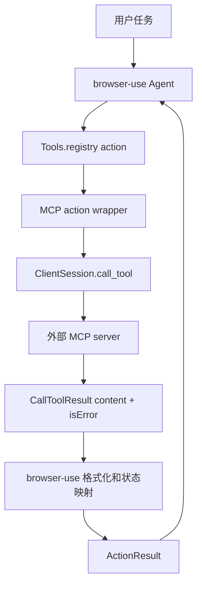
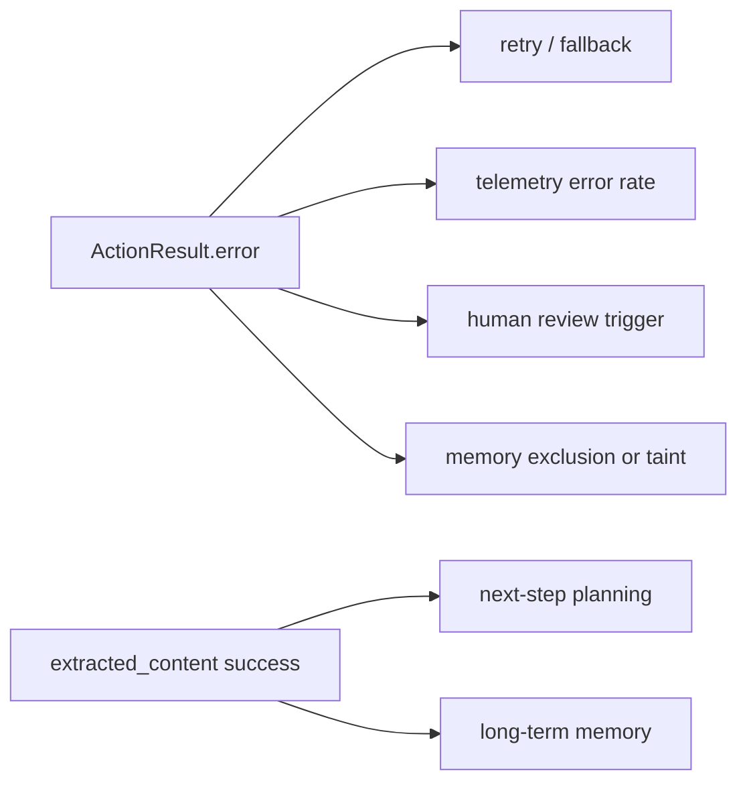

# browser-use 把 MCP `isError` 变成失败的 `ActionResult`：一个 8 行修复为什么值得安全团队读

> 研究者精读：这不是一个“大功能”提交，而是一个典型的 Agent 安全边界修复。它把 MCP 工具的应用层失败，从“看起来有返回内容”改回“明确失败的动作结果”，避免浏览器 Agent 在文件不存在、权限拒绝、远端工具失败时继续沿着错误观察推进。

### 元信息

| 字段 | 内容 |
|---|---|
| 项目 | browser-use |
| 类型 | 代码变更 / Agent 工具安全 |
| 官方变更 | [commit 8651458](https://github.com/browser-use/browser-use/commit/8651458987cc911ee96a5d31478a3da5aa625bd9) |
| 关联 PR | [PR #5235](https://github.com/browser-use/browser-use/pull/5235) |
| 官方时间 | `2026-08-03T02:31:08Z` merged |
| 变更文件 | `browser_use/mcp/client.py`、`tests/ci/test_mcp_client_error_result.py` |
| 变更规模 | 2 个文件，105 行新增，0 行删除 |
| 领域 | AI 安全 / Agent 工具调用 / MCP |

### TL;DR

1. **这次修复处理的是 MCP 工具返回中的 `CallToolResult.isError`。**MCP 允许工具调用在 JSON-RPC 层成功，但工具自身报告应用层失败，例如读取文件时返回“文件不存在”。
2. **browser-use 之前会把这类失败格式化成普通 `extracted_content`。**也就是说，Agent 看到的是“工具有结果”，而不是“动作失败”，下游规划器、记忆、遥测和失败恢复都可能被误导。
3. **修复方式很小但语义关键。**在参数化工具 wrapper 和无参工具 wrapper 中，格式化结果后检查 `getattr(result, "isError", False)`；若为真，返回 `ActionResult(error=..., success=False)`。
4. **测试覆盖了三条路径。**一条无参工具 `isError=True`、一条带 `path` 参数的工具 `isError=True`、一条 `isError=False` 的成功路径，确认正常工具调用不受影响。
5. **安全意义不在“报错更好看”，而在“失败不能伪装成证据”。**浏览器 Agent 会把工具观察写入推理轨迹和长期记忆；若错误被当作成功，可能触发错误重试、错误摘要、错误自动化动作。
6. **边界也很清楚。**该提交只让 browser-use 作为 MCP client 时尊重远端工具的失败标志；它不能保证所有 MCP server 都正确设置 `isError`，也不能替代权限隔离、人类确认和工具结果净化。

### 为什么一个 8 行代码改动值得看？

#### 问题不是异常，而是“成功形状的失败”

普通工程里，大家容易把工具调用失败理解成：

| 层级 | 典型信号 | Agent 该怎么处理 |
|---|---|---|
| 传输层失败 | 子进程断开、stdio 读写失败、连接超时 | 工具不可用，进入重连或降级 |
| 协议层失败 | JSON-RPC error、方法不存在、schema 不合法 | 调用本身不成立，修正调用或停止 |
| 应用层失败 | 工具跑了，但业务逻辑失败 | 动作失败，读失败内容并重新规划 |
| 成功观察 | 工具跑了且返回有效结果 | 把观察作为后续推理证据 |

这次 browser-use 的 bug 落在第三层。

MCP 的 `tools/call` 可以返回一个正常 JSON-RPC result，其中包含 `content` 和 `isError`。如果 client 只看 `content`，就会把“文件不存在”这类失败文本放进普通观察里。

<u>危险点在于：失败文本也很像信息。</u>

例如：

```text
File not found: /tmp/does-not-exist.txt
```

对人类来说，这是明确失败；对一个工具执行框架来说，如果没有 `success=False` 和 `error` 字段，它可能只是“提取到的文本”。当这个观察继续进入 Agent 的消息历史，模型未必知道这是动作失败，更未必会触发框架层的 retry、fallback 或停止条件。

#### browser-use 的位置：把外部 MCP 工具注册成内部 action

browser-use 的 README 把项目定位为让 AI Agent 像人一样使用浏览器：打开网页、点击、输入、填表、提取数据、做 QA 自动化。它既可以作为 Python 库嵌入业务，也可以被 Claude Code、Codex、Cursor、Hermes、OpenClaw 等 Agent 通过 CLI 或 skill 使用。

这意味着它不是单纯的浏览器脚本库，而是一个把浏览器、LLM、动作注册表和外部工具连起来的 Agent runtime。

`browser_use/mcp/client.py` 里的 `MCPClient` 做了三件事：

1. **连接 MCP server。**
   - 通过 `command`、`args`、`env` 启动 stdio server。
   - 使用 MCP SDK 的 `ClientSession` 建立会话。
   - 发现 server 暴露的工具列表。

2. **把 MCP tool 转成 browser-use action。**
   - 读取 MCP `Tool.inputSchema`。
   - 将 JSON Schema 转成 Pydantic 参数模型。
   - 在 `Tools.registry` 里注册可执行 action。

3. **执行 action 时再回调 MCP tool。**
   - 有参数工具：`call_tool(tool.name, tool_params)`。
   - 无参数工具：`call_tool(tool.name, {})`。
   - 把 MCP 返回结果格式化成 `ActionResult`。

这条桥接链路可以画成：



修复前，`C -> F -> O` 的关键问题是：

| MCP 返回 | 旧映射 | 风险 |
|---|---|---|
| `content=[TextContent("ok")]`, `isError=False` | `ActionResult(extracted_content="ok")` | 合理 |
| `content=[TextContent("File not found")]`, `isError=True` | `ActionResult(extracted_content="File not found")` | 失败看起来像成功观察 |
| `call_tool` 抛异常 | `ActionResult(error=..., success=False)` | 合理 |

也就是说，旧代码能处理“调用抛异常”，却漏掉了“调用成功但工具报告失败”。

### MCP 规范语义：`isError` 是工具失败，不是 transport failure

MCP 官方 Tools 规范给出的 `tools/call` 响应包含 `content` 和 `isError` 字段。规范里的成功示例把 `isError` 设为 `false`，并在工具安全说明里强调工具由模型控制，应用应提供可见暴露、调用指示和必要的人类确认。

这一点对 Agent 安全很重要：

| 语义 | JSON-RPC 层 | MCP result 层 | browser-use 应表达 |
|---|---|---|---|
| 工具正常返回 | 成功 | `isError=False` | 成功 `ActionResult` |
| 工具业务失败 | 成功 | `isError=True` | 失败 `ActionResult` |
| 协议/连接失败 | 失败或异常 | 无可靠 result | 失败 `ActionResult` |

换句话说，`isError=True` 不代表 server 没回包；它代表 server 回了一个“工具执行失败”的包。对 Agent 来说，这比普通异常更微妙，因为失败细节通常就在 `content` 里。

#### 一个最小形式化表达

可以把工具调用结果映射写成：

```text
Input:
  r = CallToolResult(content, isError)

Mapping:
  if transport_or_protocol_exception:
      ActionResult(error=e, success=False)
  else if r.isError == True:
      ActionResult(error=format(r.content), success=False)
  else:
      ActionResult(extracted_content=format(r.content), success=True-like)

Invariant:
  tool_failure(r) => not success(ActionResult)
```

其中关键不变量是：

| 符号 | 含义 |
|---|---|
| `tool_failure(r)` | 工具自身报告失败，而非调用通道失败 |
| `format(r.content)` | 把 MCP 的文本、图片、资源等内容转成 Agent 可读文本 |
| `success(ActionResult)` | 下游把动作当作成功观察处理 |

旧代码违反了最后一行：`r.isError=True` 时仍然进入成功形状。

### 代码机制：两个 wrapper 都要修

browser-use 的 MCP client 有两条执行路径：

1. **参数化工具路径。**
   - MCP tool 有 `inputSchema.properties`。
   - browser-use 生成 Pydantic 参数模型。
   - wrapper 接收 `params`，再 `model_dump(exclude_none=True)`。

2. **无参数工具路径。**
   - MCP tool 没有参数字段。
   - wrapper 没有参数。
   - 调用时传空 dict。

这两条路径之前都有同样问题：

```text
result = await session.call_tool(...)
extracted_content = _format_mcp_result(result)
return ActionResult(extracted_content=extracted_content, ...)
```

修复后的分支是：

```text
result = await session.call_tool(...)
extracted_content = _format_mcp_result(result)

if getattr(result, "isError", False):
    return ActionResult(error=..., success=False)

return ActionResult(extracted_content=..., ...)
```

这里有三个设计点值得注意：

| 设计 | 为什么这样做 | 边界 |
|---|---|---|
| 先格式化 content | 失败信息本身仍要传给 Agent / 日志 | 如果 content 含注入文本，仍需要上层净化 |
| `getattr(..., False)` | 兼容没有 `isError` 字段的旧式 result | 缺字段会被当作非错误 |
| 两个 wrapper 同步修 | 参数化和无参工具都可能失败 | 没覆盖其他未来 wrapper |

#### `_format_mcp_result` 不是失败判断器

`_format_mcp_result` 的职责只是把 MCP result 转成字符串：

1. 如果 result 有 `content` 且是列表：
   - 对有 `text` 属性的 item 提取文本。
   - 对其他 item 转字符串。
   - 多段内容用换行拼接。
2. 如果 result 是列表：
   - 遍历列表并提取文本或字符串化。
3. 其他情况：
   - 直接 `str(result)`。

这说明旧 bug 不是格式化函数“写错了”，而是状态映射缺了一个分支。格式化函数不知道文本是错误还是成功；只有 `CallToolResult.isError` 才携带这个语义。

### 回归测试：三条路径刚好卡住边界

新增测试文件 `tests/ci/test_mcp_client_error_result.py` 用 mock 构造一个已连接的 MCPClient，然后把 `session.call_tool` 替换成 `AsyncMock`。

测试不是跑真实 MCP server，而是隔离验证映射逻辑：

| 测试 | 构造 | 断言 | 覆盖意义 |
|---|---|---|---|
| 无参工具失败 | `CallToolResult(content="File not found", isError=True)` | `result.success is False`，`result.error` 包含失败文本 | 无参数 wrapper 不再把失败当成功 |
| 参数化工具失败 | tool schema 要求 `path` | 同样失败，并确认 `call_tool("read_file", {"path": ...})` | Pydantic 参数路径也正确传参与失败 |
| 成功 sanity check | `CallToolResult(content="ok", isError=False)` | `result.error is None`，`extracted_content == "ok"` | 修复不破坏正常工具 |

这组测试的价值在于它没有只测“有错误字段”，而是测了两个常见实际路径：

1. **无参工具。**
   - 例如列状态、ping、取当前页面信息。
2. **带参数工具。**
   - 例如读文件、查数据库、打开 URL、执行浏览器动作。

这也是 Agent 系统中最容易分叉出不一致行为的地方。一个 wrapper 修了、另一个没修，用户会看到“同一个 MCP server，有些工具能正确失败，有些工具仍然假成功”。

### 失败被吞掉后，Agent 会怎样误学？

#### 误判一：把失败观察当作环境事实

假设 Agent 调用 `read_file("/tmp/plan.md")`，MCP server 返回：

```json
{
  "content": [{"type": "text", "text": "File not found: /tmp/plan.md"}],
  "isError": true
}
```

旧路径会产生一个普通观察。模型可能这样解释：

| 模型看到 | 可能推理 | 实际语义 |
|---|---|---|
| `File not found: /tmp/plan.md` | 文件不存在是一个可用事实 | 该 action 失败，需要恢复 |
| 没有 `error` 字段 | 工具执行完成 | 工具报告失败 |
| 进入长期记忆 | 以后不要找这个文件 | 当前调用失败，不等于全局事实 |

如果该工具是浏览器相关动作，风险会更大。

例子：

1. `click_button("Submit")` 返回 `isError=True`，内容为“selector not found”。
2. Agent 却把它当作普通观察。
3. 下一步模型可能认为“页面没有提交按钮”，而不是“选择器或页面状态不对”。
4. 自动化流程继续运行，最终在错误页面上提取结果。

#### 误判二：遥测和失败恢复拿不到失败信号

browser-use wrapper 的 `finally` 会捕获 telemetry，字段里包括：

| 字段 | 意义 |
|---|---|
| `server_name` | 哪个 MCP server |
| `command` | 启动命令 |
| `tools_discovered` | 已发现工具数 |
| `action` | 当前动作类型 |
| `tool_name` | 被调用工具名 |
| `duration_seconds` | 调用耗时 |
| `error_message` | 错误信息 |

修复后，`isError=True` 会设置 `error_msg`，从而让 telemetry 也看到失败。旧代码里这类工具失败没有进入 `error_message`，事后排查会低估失败率。

对生产 Agent 来说，失败率不是附属指标，而是调度策略的一部分：



如果错误进入 `S` 而不是 `E`，系统会在四个地方同时偏移：

1. retry 不触发；
2. 失败率偏低；
3. 人类确认可能缺席；
4. 长期记忆可能写入失败内容。

### 证据 inventory

| 证据点 | 来源 | 支持的主张 | 不能证明什么 |
|---|---|---|---|
| commit `8651458` | GitHub 官方 commit | 2026-08-03 合并，改动 2 文件 105 行新增 | 不能证明所有用户已经升级 |
| `client.py` 两处 `getattr(result, "isError", False)` | browser-use 源码 | 参数化和无参 wrapper 都处理应用层失败 | 不能覆盖未来新增 wrapper |
| `test_mcp_client_error_result.py` 三个测试 | browser-use 测试 | 失败路径与成功路径均被固定 | mock 测试不覆盖真实 server 兼容矩阵 |
| MCP Tools 规范 | MCP 官方文档 | 工具调用 result 中存在 `isError` 语义 | 规范不保证每个 server 正确实现 |
| browser-use README | 项目 README | 项目用于浏览器 Agent、CLI、Python 库和外部 Agent 集成 | README benchmark 与本 bug 无直接因果 |

### 这次修复的安全含义

#### 1. 工具结果需要“状态”和“内容”双通道

Agent 工具调用不能只返回文本。至少要区分：

| 通道 | 例子 | 下游用途 |
|---|---|---|
| 状态 | success / error / denied / timeout | 控制流、重试、告警 |
| 内容 | 文本、截图、结构化数据 | 模型观察和用户解释 |
| provenance | server、tool、参数摘要、时间 | 审计和复现 |
| trust tier | 本地可信、远端不可信、用户确认 | 权限和净化 |

`isError` bug 的本质，是把状态通道丢了，只保留内容通道。安全系统最怕这种“内容还在，状态没了”的失真，因为它不会显式崩溃，而是悄悄改变 Agent 的世界模型。

#### 2. MCP client 要把协议语义映射到宿主框架语义

MCP 是协议；browser-use 的 `ActionResult` 是宿主框架内部语义。中间层必须做语义保真映射。

可以把职责拆成：

| 层 | 责任 | 这次修复落点 |
|---|---|---|
| MCP server | 正确设置 `content`、`isError`、structured content | 不在本提交范围 |
| MCP client SDK | 暴露 `CallToolResult` 字段 | 已提供字段 |
| browser-use MCPClient | 把 MCP result 转成 `ActionResult` | 本次修复 |
| Agent planner | 根据 `ActionResult` 决策 | 依赖上游状态准确 |
| UI / telemetry | 展示、记录、触发 review | 修复后得到错误信号 |

这就是为什么“小修复”在 Agent 系统里不小：它处在协议语义和执行语义的交界处。

#### 3. 失败内容仍然可能是攻击面

修复后，失败文本会进入 `error`。这比进入 `extracted_content` 更好，但不等于完全安全。

需要继续追问：

| 问题 | 风险 | 可能控制 |
|---|---|---|
| 失败文本是否展示给模型？ | 恶意 MCP server 可把 prompt injection 放进错误信息 | 错误通道做 taint 标记 |
| 错误是否进入长期记忆？ | 临时失败被永久化 | 默认不记忆 error content |
| 错误是否进入用户界面？ | 泄露路径、token、内部配置 | 错误脱敏 |
| 错误是否触发自动 retry？ | 恶意 server 诱导重试风暴 | retry budget 和 backoff |

所以，这次提交是必要条件，不是完整防线。

### 与近期 Agent 安全研究的关系

过去一个月很多 Agent 安全文章都在讨论更宏观的问题：

1. MCP server 是否可信；
2. 工具描述是否会 poisoning；
3. Agent 是否能绕过 shell 或浏览器权限；
4. 长期记忆是否会被注入；
5. sandbox 是否能隔离真实文件系统。

browser-use 这次修复更低层，但它给出一个可操作提醒：

> 如果状态映射错了，上层所有 policy 都会拿到错误输入。

可以对照三类安全控制：

| 控制 | 关注点 | `isError` 修复提供什么 |
|---|---|---|
| permission gate | 是否允许工具调用 | 不直接决定 allow/deny |
| result sanitizer | 工具结果是否可信 | 给失败结果贴上错误状态 |
| planner control | 失败后是否继续 | 提供 `success=False` 信号 |
| audit log | 事后能否复盘 | telemetry 有错误字段 |
| memory policy | 是否写入长期记忆 | 可基于 error 状态排除 |

最直接的启发是：Agent 安全测试不应只测“危险调用有没有被拦住”，还要测“失败有没有被正确表达”。

### 可以复用的测试模板

对任何 MCP client，建议至少构造下面四类回归测试：

```text
Input:
  tool_schema:
    with_params / without_params
  call_result:
    isError=True / isError=False

State:
  connected client
  mocked or real MCP session
  host action registry

Loop:
  for each schema kind:
    register MCP tool as host action
    execute host action
    inspect host-native result

Expected:
  isError=True  -> host result has error and success=false
  isError=False -> host result has normal content and no error

Failure boundary:
  protocol exception and application-level failure must remain distinguishable
```

这份模板比单测某个函数更好，因为它覆盖“注册 -> 执行 -> 映射”的真实桥接路径。

### 更贴近生产的四个失败场景

#### 场景一：浏览器自动化里的假成功

浏览器 Agent 常见任务不是单步查询，而是长链路：

1. 打开站点；
2. 登录；
3. 找到表单；
4. 填写字段；
5. 点击提交；
6. 抽取结果或保存凭证。

如果某个 MCP 工具在第 4 步返回 `isError=True`，但宿主把它当成普通观察，后续步骤会继续使用坏状态。

| 步骤 | 真实发生 | 旧映射可能造成的误解 | 正确失败语义 |
|---|---|---|---|
| 填字段 | selector 找不到 | 页面没有该字段，继续尝试提交 | 当前页面状态或 selector 失配 |
| 点击按钮 | 元素被遮挡 | 点击完成但页面未跳转 | 动作未完成，需要重定位 |
| 下载文件 | 权限拒绝 | 文件内容为空或不存在 | 权限失败，不能继续解析 |
| 抽取数据 | DOM 查询失败 | 结果为空表 | 抽取失败，而不是数据为空 |

这里“空结果”和“失败”必须区分。空结果可能是业务事实，失败则是执行状态。如果框架把两者都放进 `extracted_content`，模型只能靠语言猜测。

#### 场景二：安全扫描里的误阴性

很多 AI for Security 工具会把扫描器、代码查询、依赖分析或漏洞数据库接成 MCP server。

假设工具返回：

```json
{
  "content": [{"type": "text", "text": "Scanner failed: lockfile missing"}],
  "isError": true
}
```

旧映射下，Agent 可能把这句话当成“扫描完成后的说明”。如果最终摘要写成“未发现漏洞”，那就是误阴性。

更严格的处理应当是：

1. 扫描失败不得汇总为安全结论；
2. 失败原因要进审计日志；
3. 需要标记 coverage gap；
4. 只有成功扫描的结果才能进入风险判断；
5. 用户界面要区分“0 findings”和“scan failed”。

这也是为什么 `isError` 不是普通工程细节，而是安全证据链的一部分。

#### 场景三：长期记忆污染

browser-use 的成功路径会设置 `long_term_memory`，表达“使用了某个 MCP 工具”。如果错误结果被当作成功观察，系统可能在更上层把失败内容总结进记忆。

记忆污染有三类：

| 污染类型 | 例子 | 后果 |
|---|---|---|
| 事实污染 | “文件不存在”被记成长期事实 | 后续任务不再寻找该文件 |
| 策略污染 | “这个站点不支持提交”被记成经验 | 自动放弃可完成任务 |
| 安全污染 | 错误文本含恶意指令 | 后续规划被错误内容影响 |

把 `isError=True` 映射成 `ActionResult.error` 后，记忆层至少可以设置规则：

```text
if action_result.error:
    do_not_write_long_term_memory_by_default
    record_failure_for_audit
    allow_explicit_human_review
```

这条规则不需要模型理解错误文本，只依赖结构化状态。

#### 场景四：自动重试的预算控制

失败被识别后，还要避免另一个极端：无限重试。

一个合理的 runtime 可以按错误类型分配预算：

| 错误类型 | 建议行为 | 重试预算 |
|---|---|---|
| transient timeout | 延迟后重试 | 1-3 次 |
| selector not found | 重新观察页面再试 | 1 次 |
| permission denied | 需要用户确认或新凭据 | 0 次自动重试 |
| file not found | 尝试候选路径或停止 | 0-1 次 |
| tool schema error | 修正参数或停止 | 1 次 |

旧映射没有失败状态，重试系统无法进入这些分支。修复后，至少可以把 `error` 作为入口，再进一步解析错误类型。

### 一个更完整的最小 conformance matrix

如果把这次 browser-use 单测扩展成 MCP client conformance，可以得到下面矩阵：

| 编号 | 输入形态 | MCP 返回 | host-native 结果 | 关键断言 |
|---|---|---|---|---|
| C1 | 无参工具 | `isError=false`, text content | 成功 | `error is None` |
| C2 | 无参工具 | `isError=true`, text content | 失败 | `success is False` |
| C3 | 有参工具 | `isError=false`, text content | 成功 | 参数完整传入 |
| C4 | 有参工具 | `isError=true`, text content | 失败 | 参数完整传入且失败 |
| C5 | 有参工具 | schema validation error | 失败 | 不应调用 server |
| C6 | server exception | JSON-RPC / transport error | 失败 | 区分协议错误和工具失败 |
| C7 | structured content | `isError=false` | 成功结构化观察 | schema 可校验 |
| C8 | structured content | `isError=true` | 失败但保留错误内容 | 不写成功记忆 |

本提交覆盖了 C1 到 C4 的核心部分。C5 到 C8 仍然值得后续补齐，尤其是 structured content 与 error content 的组合。

### 局限与未解决问题

#### 局限一：server 端不设置 `isError` 时，client 无法凭空知道失败

如果 MCP server 把失败写进 `content`，但仍然返回 `isError=False`，browser-use 这次修复不会识别。client 不能用字符串匹配来可靠判断所有失败，否则会产生语言、格式和误报问题。

更稳的方向是：

1. server 端 lint：失败路径必须设置 `isError=True`；
2. contract test：给每个 tool 注入失败输入，检查返回结构；
3. registry 元数据：声明哪些 tool 可能返回业务失败；
4. host 端 observability：统计“看起来像错误文本但 success=true”的异常分布。

#### 局限二：`getattr(..., False)` 兼容旧结果，也可能掩盖缺字段

兼容写法合理，因为生态里可能存在旧对象或模拟对象。但安全要求更高的部署，可以考虑：

| 模式 | 行为 | 适用场景 |
|---|---|---|
| 宽松模式 | 缺 `isError` 当作 false | 最大兼容 |
| 警告模式 | 缺字段记录 telemetry warning | 迁移期 |
| 严格模式 | 缺字段视为协议不完整 | 高风险工具 |

browser-use 当前选择的是宽松兼容。这符合开源库的现实，但不是强安全姿态的终点。

#### 局限三：错误通道还需要 taint policy

错误信息可能来自外部 server，也可能包含用户数据、路径、HTML、日志片段或模型可读指令。把它放进 `ActionResult.error` 后，下一步要看 Agent runtime 如何处理：

1. 是否直接喂给模型；
2. 是否写入长期记忆；
3. 是否显示给用户；
4. 是否进入可搜索日志；
5. 是否触发自动修复动作。

错误通道不能被当作“干净通道”。它只是比成功观察更正确。

### 研究者视角的后续问题

#### 问题一：Agent benchmark 是否测过“失败状态保真”？

很多工具调用 benchmark 只看最终任务成功率。它们很少单独评估：

| 维度 | 应测内容 |
|---|---|
| failure fidelity | 工具失败是否保留状态 |
| recovery quality | Agent 是否根据失败类型恢复 |
| memory hygiene | 失败内容是否污染长期记忆 |
| audit completeness | 日志是否能区分协议失败和业务失败 |
| adversarial error text | 错误内容带注入时是否被净化 |

`isError` 这类 bug 说明，Agent benchmark 需要从“工具能不能用”推进到“工具失败是否被正确吸收”。

#### 问题二：MCP 生态是否需要 conformance suite？

MCP 正在成为 Agent 工具接入层。只靠每个项目各自理解规范，会出现两类错配：

1. server 把业务失败当成功返回；
2. client 忽略 `isError`，把失败当成功观察。

一个实用 conformance suite 应至少包括：

| 用例 | server 期望 | client 期望 |
|---|---|---|
| 正常文本结果 | `isError=false` | 成功观察 |
| 正常结构化结果 | structured content 合法 | 校验并暴露结构 |
| 应用层失败 | `isError=true`，content 给失败原因 | host-native error |
| 协议层错误 | JSON-RPC error | host-native protocol failure |
| 恶意错误文本 | `isError=true` 且内容不可信 | taint / sanitize |

browser-use 这次单测可以视为 client 侧 conformance 的一小块。

#### 问题三：错误状态是否应影响工具权限？

现在的修复只影响单次 `ActionResult`。更长远可以把错误状态反馈给权限系统：

```text
if tool_error_rate(server, tool) > threshold:
    lower trust tier
    require user confirmation
    disable automatic retry
    quarantine memory writes
```

这类策略尤其适用于浏览器 Agent，因为浏览器动作通常是长链式的。一个早期工具错误如果没有被识别，会让后续点击、填写、提交都建立在坏状态上。

### 结论

这次 browser-use 变更的核心贡献可以压缩为一句话：

> 它把 MCP 工具的应用层失败重新接回 browser-use 的动作失败语义。

它的工程价值来自三个事实：

1. **位置关键。**
   - MCP tool 到 browser-use action 的桥接层，是 Agent 观察进入规划器前的窄口。

2. **修复精确。**
   - 两条 wrapper 分支都检查 `isError`，并复用已有 `ActionResult(error=..., success=False)` 模式。

3. **测试明确。**
   - 无参失败、参数化失败、正常成功三条路径都被固定。

但它的安全边界也不能夸大：

1. 不保证 MCP server 正确设置 `isError`；
2. 不净化错误文本；
3. 不提供权限隔离；
4. 不证明真实外部 MCP server 的兼容性矩阵；
5. 不阻止 Agent 在收到错误后做出坏决策。

更合理的判断是：这是 Agent 工具安全里一块很基础、很容易遗漏、但必须补齐的语义保真修复。对于所有接 MCP 的 Agent runtime，类似测试都应该成为最低门槛。
