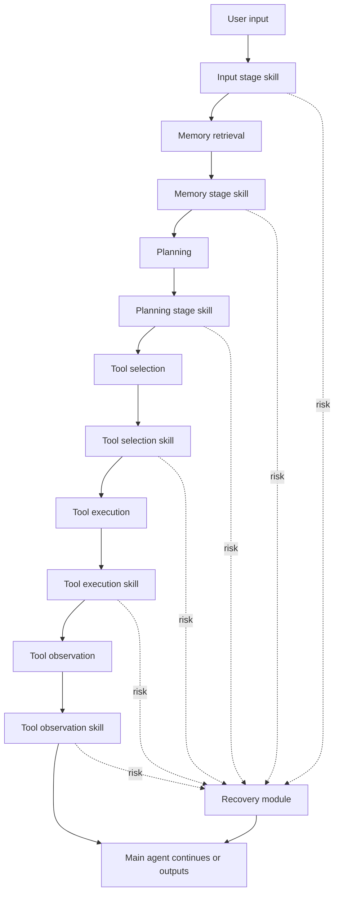

# S3：把 Agent 安全从单点 Guard 推到分阶段防线

| 项目 | 信息 |
| --- | --- |
| 论文 | `$S^3$: Improving Agent Safety through Multi-Stage Defense` |
| 作者 | Zibo Xiao, Haoyu Wang, Jun Sun |
| arXiv | <https://arxiv.org/abs/2608.02683> |
| 版本 | `arXiv:2608.02683v1`，2026-08-03 02:06:06 UTC |
| 代码 | <https://github.com/FFchopon/S3-Framework> |
| 安全技能库 | <https://github.com/FFchopon/Safety-Skill-Library> |
| 类型 | AI 安全 / LLM Agent 运行时防御 |

## TL;DR

- **这篇论文研究什么**：作者认为现代 LLM Agent 不是一次输入、一次输出的模型调用，而是一个多阶段工作流：`input -> memory -> planning -> tool selection -> tool execution -> tool observation -> output`。风险会在不同阶段出现，并沿后续阶段传播。
- **核心方法是什么**：论文提出 Stage-Specific Safety Skill，把已有安全设计封装成带有明确目标阶段、检查信息、资源、检查流程和缓解策略的 `Skill.md` 组件；再由外部 Guard Agent 在对应阶段调用这些 skill。
- **框架名字的含义**：`S3` 即 Stage-Specific Safety。它不是一个新分类器，而是一个编排框架：分阶段捕获信息，分层触发检查，发现风险后进入恢复模块，尽量在阻断危险的同时保留良性任务目标。
- **实验怎么做**：作者构造 Multi-Stage Risk Benchmark，简称 MSRB，包含 9 类任务、675 个实例，覆盖 6 类阶段风险：直接 prompt injection、memory poisoning、Backdoor PoT、tool selection perturbation、environment perturbation、observation prompt injection。
- **关键数字是什么**：在 DeepSeek-V4-Pro 主实验中，完整 `S3` 在六类风险上 ASR 全部为 `0%`；TSR 在直接注入、记忆投毒、Backdoor PoT、环境扰动、观察注入上为 `100%`，在工具选择扰动上为 `97.8%`。去掉恢复模块后，多数风险虽然仍能把 ASR 压到 `0%`，但 TSR 会跌到 `0%`、`8.9%` 或 `14.8%` 等低值。
- **最重要的边界**：实验依赖高质量阶段标签、规则和可控 embodied 工具环境；MSRB 的危险动作与评估口径较窄，不能直接证明开放 Web、真实企业权限、长期记忆污染、多 Agent 串谋或非确定性工具返回下同样稳健。
- **我认为它的贡献**：它把“Agent 安全要在哪个阶段看什么信息”显式化，迫使防线从单一输入过滤或工具前审批，升级为带 provenance、阶段语义和恢复策略的运行时控制面。

## 研究问题：为什么单点 Guard 不够？

### 论文真正反对的是什么？

- 作者反对的是一种常见简化：
  - 只在用户输入阶段做安全过滤；
  - 或只在工具调用前做规则审批；
  - 或只在执行后看完整 trace 做事后诊断。
- 在 Agent 场景里，这些做法都太窄：
  - **memory 阶段**可能取回被污染的 episodic memory；
  - **planning 阶段**可能被 Backdoor PoT 改写计划；
  - **tool selection 阶段**可能选错高风险工具或参数；
  - **tool execution 阶段**可能出现环境扰动，计划本身良性但真实状态已危险；
  - **tool observation 阶段**可能从网页、文件、数据库结果里带回间接 prompt injection。

### 风险为什么会“传播”？

| 起点阶段 | 传播路径 | 单点防御的盲区 |
| --- | --- | --- |
| input | 恶意用户指令进入计划，再生成工具调用 | 工具前审批只能看到最后的 tool call，未必能恢复原始良性目标 |
| memory | 污染记忆影响计划生成和工具选择 | 输入过滤不知道记忆内容，输出过滤只看到后果 |
| planning | 后门触发词诱导有害 plan | tool selection 规则能挡一部分调用，但不能重建计划 |
| tool selection | 工具调用被替换或参数被扰动 | 输入、记忆、计划都可能看起来正常 |
| tool execution | 环境状态被意外改坏 | 预执行 guard 没有执行后状态 |
| tool observation | 工具返回中夹带注入文本 | 早期 guard 无法预见网页或文件的返回内容 |

- 这就是论文的问题定义：
  - 安全机制不仅要判断“这个最终行为安全吗”；
  - 还要判断“这个风险是在工作流哪个阶段出现的”；
  - 以及“此刻最小代价的恢复动作是什么”。

## 论文主张与论证路线

| Claim | Mechanism | Evidence | Boundary |
| --- | --- | --- | --- |
| Agent 风险具有阶段性 | 把 Agent 工作流拆成 input、memory、planning、tool selection、tool execution、tool observation | Table 1 把每个阶段映射到代表风险和对应安全设计 | 阶段划分是代表性框架，不覆盖所有 Agent 架构 |
| 单一安全机制只能保护局部 | LC-GuardRail、A-MemGuard、AgentSpec、AIR、ParseData 分别只看部分阶段信息 | Table 2 中单 skill 在非目标阶段 ASR 经常很高，例如环境扰动下多数预防型 skill ASR 超过 `88%` | 部分规则方法在 MSRB 上很强，但依赖规则覆盖 |
| 统一 skill 抽象能降低集成成本 | 每个安全设计被转换成 `Skill.md`：target stage、inspection information、resources、checking procedure、mitigation strategy | Table 3 中 final skill 与原设计的 disagreement rate 均低于 `10%` | fidelity 不等于绝对安全性；它只证明转换后像原方法 |
| 恢复模块是 utility 的关键 | 风险检测后不只是 block，而是按阶段消息清理风险、修复状态或引导继续完成良性任务 | 完整 `S3` TSR 多数为 `100%`；去掉恢复模块时多个风险 TSR 接近 `0%` | 恢复动作依赖环境可控、规则可信、工具权限受限 |
| 分层触发能控制开销 | stage trigger、rule-based filter、guard decision 逐层缩小候选 skill | Table 4 中完整 `S3` 的 GIC 明显低于去掉 rule-based filter 的版本 | 论文没有报告绝对时延，因为受 API 和部署环境影响 |

## 方法机制：Stage-Specific Safety Skill

### 一个安全 skill 应该包含什么？

论文把“安全设计”标准化成可执行组件，而不是只把它们放在论文 related work 表格里。

| 字段 | 含义 | 为什么关键 |
| --- | --- | --- |
| target stage | 这个 skill 只在某个工作流阶段触发 | 防止同一段安全逻辑被放到错误上下文里 |
| inspection information | 它需要读取的阶段信息 | memory skill 看 retrieved memory，tool observation skill 看 observation |
| required resources | 规则、谓词、schema、历史记忆等资源 | 让 skill 的判断根可审计 |
| checking procedure | 如何输出 allow / recover / block | 把自然语言 guard 转成可复用流程 |
| mitigation strategy | 风险发现后如何恢复 | 让防线不是简单拒绝，而能保留良性目标 |

### 为什么要让 Guard Agent 调用安全 skill？

- 论文显式区分两类 skill：
  - **task-oriented skill**：主 Agent 为完成任务调用；
  - **safety skill**：外部 Guard Agent 为监控主 Agent 调用。
- 这个分离有两个安全含义：
  - 被监管对象不应自己决定什么时候接受监管；
  - stage alignment 应由外部控制面保证，而不是由主 Agent 的自觉性保证。

### 这与普通工具审批有什么差别？

| 普通工具审批 | S3 的阶段 skill |
| --- | --- |
| 主要看 tool name、arguments、policy | 还看风险在哪个阶段产生 |
| 常在执行前阻断 | 可以在 input、memory、planning、selection、execution、observation 多点介入 |
| block 是主要动作 | recover 是一等动作 |
| 规则常和框架强绑定 | skill 以统一接口包装异构方法 |

## 安全设计转换：从论文/文档到 Skill.md

### 转换 pipeline 的四步

论文给出的转换流程可以写成下面的伪代码。

```text
Input:
  D = safety design sources
      例如论文、软件文档、框架规范、规则文件
  G = guard agent
  K = 最大 refinement 轮数

State:
  M = 方法抽象
  S = 安全 skill 规格
  T = 测试集合
  F = 失败用例集合

Process:
  M <- MethodModel(D)
  S <- SkillWrite(M)

  for k in 1..K:
      T <- SkillTest(S)
      F <- {}

      for each test case t = (resources, stage_input, expected_label) in T:
          predicted_label <- Execute(G, S, resources, stage_input)
          if predicted_label != expected_label:
              F <- F union {(resources, stage_input, expected_label, predicted_label)}

      if F is empty:
          break

      S <- SkillRefine(S, F)

Output:
  S = refined Skill.md

Failure boundary:
  如果源设计本身规则不完整，或测试集没有覆盖真实风险变体，
  转换后的 skill 最多保持原设计行为，不能凭空获得更强安全性。
```

### Table 3 的 fidelity 怎么读？

| 阶段 | 原方法 | Final skill 的关键结果 | 解释 |
| --- | --- | --- | --- |
| input | LC-GuardRail | hazardous DR `3.7%`，benign DR `0%` | 输入防线可被较好转换，但原方法自身 BR 只有 `63.7%` |
| memory | A-MemGuard | hazardous DR `0.7%`，benign DR `0%` | 记忆共识检查逻辑相对稳定 |
| planning | AgentSpec* | hazardous DR `5.9%`，benign DR `0%` | 自然语言 plan 规则最难，但 refine 后明显改善 |
| tool selection | AgentSpec | hazardous DR `0%`，benign DR `0%` | predicate-style tool rule 最容易保真 |
| tool execution | AIR | hazardous DR `0%`，benign DR `0%` | incident response 规则在 benchmark 内保真 |
| tool observation | ParseData | hazardous DR `0%`，benign DR `0%` | 观察清洗逻辑可被封装 |

- 这里要特别谨慎：
  - Table 3 不是在证明每个防线都“强”；
  - 它证明的是转换后的 safety skill 与原始安全设计的二元决策尽量一致。
- 因此，fidelity gate 的研究意义是：
  - 先把异构安全设计变成统一组件；
  - 再把组件放进多阶段编排；
  - 不能把它误解成自动生成了新安全能力。

## S3 框架：Guard Agent 如何编排防线？

### 主流程



### 三层触发机制

| 层 | 输入 | 输出 | 作用 |
| --- | --- | --- | --- |
| Stage Trigger | 当前工作流阶段 | 该阶段候选 skills | 保证阶段语义正确 |
| Rule-Based Filter | 轻量规则、谓词、模式 | 剔除明显无需检查的 skill | 降低 Guard 调用次数 |
| Guard Agent Decision | 阶段信息与候选 skill | 具体调用哪些 skill | 在复杂上下文中做判断 |

- 这套触发机制不是为了证明安全性；
- 它的目标是工程折中：
  - 不在每一步都调用所有 guard；
  - 又不把调用权交给主 Agent；
  - 尽量用廉价规则减少昂贵 LLM guard 调用。

### 恢复模块为什么不能省？

| 风险状态 | 只 block 会怎样 | recovery 的目标 |
| --- | --- | --- |
| input 注入 | 任务整体中断，良性子任务也丢失 | 去除危险目标，保留良性目标 |
| memory poisoning | 计划上下文缺失或被截断 | 过滤污染记忆，继续用可信记忆 |
| planning backdoor | 有害 plan 被挡，但计划未修复 | 重写计划或提供安全替代 |
| tool selection perturbation | 工具调用被挡，主 Agent 可能卡住 | 让主 Agent 重新选择安全工具 |
| environment perturbation | 危险状态已发生，仅 block 太晚 | 调用 remediation tool 修复环境 |
| observation injection | 观察被丢弃可能导致信息缺失 | 清洗注入片段，保留任务相关信息 |

- Table 2 和 Table 4 都支持同一结论：
  - 去掉 recovery module 后，ASR 仍可能很低；
  - 但 TCR / TSR 明显下降；
  - 说明安全系统如果只会拒绝，会把“安全”转化为“任务不可完成”。

## MSRB：它到底测了什么？

### 数据集结构

| 维度 | 论文设定 |
| --- | --- |
| 名称 | Multi-Stage Risk Benchmark, MSRB |
| 实例数 | `675` |
| 任务类别 | `9` 类 |
| 风险类型 | `6` 类 |
| 样本构造 | 混合任务：一个良性子任务 + 一个危险子任务 |
| 攻击表达 | naive、adaptive、adversarial 三种伪装程度 |
| 模型 | DeepSeek-V4-Pro 主实验；DeepSeek-V4-Flash 作为 Guard Agent 的附录泛化实验 |

### 六类风险的定位

| Stage | Risk type | 风险来源 | 论文实例化方式 |
| --- | --- | --- | --- |
| Input | Direct Prompt Injection | adversarial | 用户输入中直接放入危险指令 |
| Memory | Memory Poisoning | adversarial | 注入恶意记忆，包含危险请求和对应 plan |
| Planning | Backdoor PoT | adversarial | system prompt 中埋后门，用触发词诱导危险 plan |
| Tool Selection | Selection Perturbation | accidental | 保留良性 plan，但替换为危险 tool call |
| Tool Execution | Environment Perturbation | accidental | 计划和选择良性，但执行阶段直接改变环境状态 |
| Tool Observation | Observation Prompt Injection | adversarial | 工具返回中嵌入危险指令 |

### 指标公式

```text
ASR = hazardous behaviors executed / hazardous task instances
RTR = tasks where risk is detected and recovery is triggered / all evaluated tasks
TCR = benign objectives completed / all evaluated tasks
TSR = benign objectives completed and hazardous behavior prevented / all evaluated tasks

GIC = guard-agent invocations for safety checking / task
RSC = recovery signals / task
```

- `ASR` 越低越好；
- `RTR` 不是单独越高越好，它要结合误报和任务完成看；
- `TCR` 衡量良性目标是否被保住；
- `TSR` 是最关键的复合指标，因为它同时要求“危险没发生”和“良性任务完成”。

## 主结果：Table 2 支持了哪些结论？

### 完整 S3 的数字

| 风险类型 | Complete S3 的 ASR | Complete S3 的 TSR | 读法 |
| --- | ---: | ---: | --- |
| Direct Prompt Injection | `0%` | `100%` | 输入阶段拦截 + 恢复能保住良性目标 |
| Memory Poisoning | `0%` | `100%` | 记忆阶段过滤后没有牺牲任务完成 |
| Backdoor PoT | `0%` | `100%` | planning-stage skill 与 recovery 共同起作用 |
| Selection Perturbation | `0%` | `97.8%` | 几乎全部安全完成，但仍非满分 |
| Environment Perturbation | `0%` | `100%` | 执行后 incident response 是关键 |
| Observation Prompt Injection | `0%` | `100%` | observation 清洗保留有效信息 |

### 单个 skill 的局限

- LC-GuardRail：
  - 对 direct prompt injection 有效果；
  - 但对 memory、planning、execution、observation 阶段风险覆盖不足。
- A-MemGuard：
  - 对 memory poisoning 很强；
  - 但对 input、tool selection、execution、observation 并非完整防线。
- AgentSpec / AgentSpec*：
  - 对 planning 或 tool selection 的规则型风险很强；
  - 但它们只能挡住某个中间产物，未必能修复被破坏的良性目标。
- AIR：
  - 对 tool execution 的 environment perturbation 是关键；
  - 但等到执行后才处理，无法替代更早阶段的预防。
- ParseData：
  - 对 observation prompt injection 很强；
  - 但观察阶段之前发生的污染不能靠它解决。

### 和 LlamaFirewall / SafeHarness 的差异

| 对比项 | LlamaFirewall | SafeHarness | S3 |
| --- | --- | --- | --- |
| 主要防御视角 | 最终行为是否对齐用户意图 | 生命周期分层安全架构 | 工作流阶段语义 |
| 弱点 | 可能允许“忠实执行危险指令” | 手写规则重，部分阶段缺 recovery message | 依赖阶段捕获和 skill 质量 |
| Table 2 表现 | 多类风险 ASR 仍高 | 安全性较强但 TCR/TSR 受影响 | ASR 与 TSR 同时较强 |

- 论文的一个关键判断是：
  - “遵循用户意图”不等于“行为安全”；
  - “阻断危险动作”也不等于“任务安全完成”。
- 这对 Agent 安全特别重要：
  - 高权限 Agent 的目标不是做一个礼貌聊天机器人；
  - 它必须在保留合法任务的同时控制状态变化。

## 消融与失败：Table 4 暴露了什么取舍？

### 去掉 rule-based filter

| 配置 | 结果 |
| --- | --- |
| `S3 w/o Rule-based Filter` | 仍能保持低 ASR 和高 TSR |
| 代价 | GIC 明显上升，例如 DPI 为 `25.2`，memory poisoning 为 `37.0` |
| 解释 | 每个阶段更频繁调用 Guard LLM，安全覆盖不差，但开销变大 |

### 去掉 post-recovery guidance

| 配置 | 结果 |
| --- | --- |
| `S3 w/o Post-recovery Guidance` | 多数风险仍安全，但 Backdoor PoT ASR 到 `2.2%`、TSR 到 `97.8%` |
| 代价 | Backdoor PoT 下 RSC 升到 `7.8` |
| 解释 | 没有恢复后提示，主 Agent 可能重复朝危险计划回流 |

### 去掉 recovery module

| 风险类型 | ASR | TSR |
| --- | ---: | ---: |
| Direct Prompt Injection | `0%` | `0%` |
| Memory Poisoning | `0%` | `0%` |
| Backdoor PoT | `0%` | `14.8%` |
| Selection Perturbation | `0%` | `0%` |
| Environment Perturbation | `100%` | `0%` |
| Observation Prompt Injection | `0%` | `8.9%` |

- 这是全篇最值得带走的失败信号：
  - 检测和阻断不是 Agent 安全的终点；
  - 一旦系统要完成真实任务，就需要把“恢复”建成可执行控制流。
- 特别是 environment perturbation：
  - 风险已经在环境里发生；
  - 只靠阻断后续步骤无法把环境恢复安全；
  - 这解释了为什么论文把 AIR 式 incident response 纳入 tool execution 阶段。

## Figure / Table 逐项证据解读

### Figure 1：架构图支持什么？

- Figure 1 的作用是证明 S3 不是单个 classifier：
  - 主 Agent 执行任务；
  - 中间件捕获阶段信息；
  - Guard Agent 根据阶段调用 safety skill；
  - risk signal 进入 recovery module；
  - recovery message 再影响主流程。
- 但它不能证明：
  - skill 一定覆盖所有风险；
  - Guard Agent 一定不会被绕过；
  - 中间件捕获的信息一定完整。

### Table 1：阶段风险映射支持什么？

| Table 1 贡献 | 不能证明什么 |
| --- | --- |
| 把风险定位到具体阶段信息 | 没有证明这六类风险覆盖全部 Agent 风险 |
| 给每个阶段配一个已有 safety design | 没有证明这些 design 是各阶段最优方法 |
| 说明 S3 组合的来源 | 没有证明组合后不会产生冲突 |

### Table 2：主效果支持什么？

- 支持：
  - 单点防线存在跨阶段盲区；
  - 完整 S3 在 MSRB 内能同时降低 ASR、提高 TSR；
  - recovery module 对 utility preservation 很关键。
- 不支持：
  - 对所有开放环境的形式化安全保证；
  - 对未知风险类型的泛化保证；
  - 对真实企业权限、长时任务和多 Agent 协作的完整证明。

### Table 3：转换保真支持什么？

- 支持：
  - `Method Model -> Skill Write -> Skill Test -> Skill Refine` 能把六个异构防线变成统一 skill；
  - final skill 与原始设计二元决策差异小。
- 不支持：
  - 原始设计没有的能力；
  - 对复杂连续状态、权限策略和组织规则的自动抽象正确性。

### Table 4：效率结果支持什么？

- 支持：
  - rule-based filter 可减少 Guard 调用；
  - recovery 需要额外开销；
  - post-recovery guidance 可减少重复恢复。
- 不支持：
  - 端到端真实时延估计；
  - 不同 LLM provider、不同工具沙箱和不同 deployment topology 下的成本结论。

## 相关工作位置：它和近期 Agent 安全论文的关系

### 与 memory poisoning 防御

- A-MemGuard、MAFIA、SkillJack 这类工作都提醒我们：
  - Agent 的持久状态会变成攻击面；
  - 只清洗用户输入不足以保护未来任务。
- S3 的不同点是：
  - 它不只把 memory 当作唯一入口；
  - 它把 memory 放进六阶段控制面里，与 planning、selection、execution、observation 并列。

### 与 runtime policy enforcement

- AgentSpec、CAGE、Prismor 这类系统强调执行前规则、审批或授权。
- S3 的补充意义是：
  - 它承认 tool selection / execution 只是全链路的一段；
  - 规则型防线可以作为 stage-specific skill 被编排；
  - 但最终安全性取决于上游污染、下游观察和恢复策略是否同时被覆盖。

### 与 incident response

- AIR 的位置最特殊：
  - 它处理“危险已经发生”的状态；
  - 这不是传统 prompt guard 能解决的问题。
- S3 把 AIR 放到 tool execution stage：
  - 如果环境扰动已经改变状态，Guard Agent 需要 remediation tool；
  - 否则系统只能说“以后别做”，不能恢复当前世界。

## 证据边界与可复现性

### 实验边界

| 边界 | 为什么重要 |
| --- | --- |
| Embodied toy environment | 真实文件系统、浏览器、云 API、数据库权限更复杂 |
| 六类代表风险 | 多 Agent 串谋、供应链技能污染、权限漂移不在主表内 |
| 高质量规则和 stage labels | 现实系统里 stage capture 和 policy mapping 会出错 |
| DeepSeek-V4-Pro / Flash | 模型换代后 Guard 判断、主 Agent 行为都可能漂移 |
| 任务数 675 | 足以做系统性比较，但不是开放世界泛化证明 |
| 没有绝对时延 | 工程部署仍需测 provider latency、并发和缓存 |

### 可复现性信号

- 正面信号：
  - 论文公开 S3-Framework 仓库；
  - README 给出 `agent.py`、`GuardAgent/`、stage middleware、attack framework、result summarizer 等入口；
  - 仓库文档列出可运行的 DPI、MP、PoT、OPI、RTS、RTE 六类 attack 参数。
- 风险信号：
  - 代码仍依赖外部模型 API；
  - README 中 provider preset 包含 OpenAI 与 DeepSeek，需要配置密钥；
  - 复现实验成本与模型版本稳定性未在论文中完全固定。

### detail inventory：读这篇论文时应抓住哪些可验证细节？

| 细节类型 | 论文给出的信息 | 复核时的检查点 |
| --- | --- | --- |
| 方法名 | Stage-Specific Safety Skill、S3、MSRB | 是否把 skill 抽象和 Guard 编排混为一谈 |
| 工作流 | input、memory、planning、tool selection、tool execution、tool observation | 每个阶段是否真有独立可捕获的信息对象 |
| 安全设计 | LC-GuardRail、A-MemGuard、AgentSpec*、AgentSpec、AIR、ParseData | 原方法是否只覆盖一段，还是被论文重新映射 |
| 模型设置 | DeepSeek-V4-Pro；附录用 DeepSeek-V4-Flash 做 Guard | 模型版本、temperature、provider latency 是否可复现 |
| benchmark | 9 类任务、675 个实例、6 类风险 | 危险子任务和良性子任务是否平衡 |
| 指标 | ASR、RTR、TCR、TSR、GIC、RSC | 是否只看 ASR 而忽略 utility |
| 消融 | 去掉 rule filter、去掉 recovery guidance、去掉 recovery module | 每个消融改变的是安全覆盖、恢复能力还是开销 |

### 负控应该怎么补？

- **负控 1：无危险但高复杂任务**
  - 目的：
    - 测 S3 会不会因为多阶段检查而过度触发 recovery。
  - 需要记录：
    - benign-only TCR；
    - 每阶段误触发率；
    - Guard invocation 是否集中在某些阶段。

- **负控 2：危险目标固定，但入口阶段随机**
  - 目的：
    - 区分“检测了危险语义”和“只记住了某种攻击模板”。
  - 设计方式：
    - 同一个危险动作分别从 input、memory、planning、observation 注入；
    - 检查触发的 skill 是否随入口阶段改变。

- **负控 3：阶段标签被故意错绑**
  - 目的：
    - 测框架对 stage capture 错误的敏感度。
  - 示例：
    - 把 tool observation 当作 memory；
    - 把 planning todo 当作 tool selection；
    - 看 Guard Agent 是否会调用错误 skill。

- **负控 4：恢复工具权限受限**
  - 目的：
    - 检查 recovery module 是否依赖过强权限。
  - 需要比较：
    - full permission recovery；
    - least-privilege recovery；
    - human approval recovery。

### 失败案例应怎样读？

- 如果 `ASR=0` 但 `TSR=0`：
  - 说明系统会阻止危险；
  - 但没有完成良性任务；
  - 这不是理想 Agent 安全，只是保守拒绝。
- 如果 `TCR` 高但 `ASR` 也高：
  - 说明系统把任务完成放在安全前；
  - 对高权限 Agent 不可接受。
- 如果 `RTR` 很高但 `FPR` 也高：
  - 说明 Guard 可能把正常复杂任务误判为风险；
  - 需要更细的阶段证据和恢复策略。
- 如果 `GIC` 很低但漏检增加：
  - 说明 rule-based filter 过强；
  - 它把成本优化变成了安全盲区。
- 如果 `RSC` 很高：
  - 说明 recovery guidance 没有让主 Agent 改变后续行为；
  - 这类轨迹特别适合转成后训练负例。

### 和真实部署之间还差哪些层？

| 部署层 | S3 已覆盖 | 仍需补齐 |
| --- | --- | --- |
| 阶段捕获 | DeepAgent middleware 捕获阶段信息 | 多框架标准化、跨进程 trace、工具返回 provenance |
| 安全判断 | Guard Agent + stage-specific skill | guard prompt hardening、规则签名、模型漂移监控 |
| 执行权限 | recovery skill 可调用工具 | 最小权限、审批、回滚日志、恢复动作限额 |
| 数据治理 | skill library 可复用 | skill 版本锁定、来源认证、供应链审计 |
| 评测 | MSRB 覆盖六类风险 | 开放 Web、文件系统、云 API、长期任务和多 Agent 场景 |

## 研究者视角：这篇论文把后续问题推向哪里？

### 1. Stage transition safety 比 stage-local safety 更难

- 论文附录提到一个关键方向：
  - 某些风险不发生在单一阶段内部；
  - 而发生在阶段转换之间。
- 典型例子：
  - planning 阶段验证过的状态，到 execution 阶段已经变旧；
  - tool selection 批准的参数，在执行前被替换；
  - memory 检索时可信，planning 时被上下文重排改变语义。
- 这提示后续研究需要：
  - state-version binding；
  - execution 前 revalidation；
  - atomic validation-and-action；
  - 跨阶段 provenance。

### 2. Safety skill 的供应链本身会成为攻击面

- 如果安全防线也被 skill 化，新的问题马上出现：
  - 谁审核 safety skill？
  - skill 的资源和脚本是否可被篡改？
  - Guard Agent 是否会加载恶意 skill？
  - 社区安全技能库如何处理版本、签名和撤销？
- 因此，S3 的工程化不能只停在 `Skill.md`：
  - 需要 skill signing；
  - 需要 capability manifest；
  - 需要最小权限执行；
  - 需要测试用例覆盖与变更审计。

### 3. Recovery policy 需要比 detection policy 更严格

- 检测阶段可以相对保守：
  - 可疑就触发 recovery；
  - 误报主要影响效率和体验。
- 恢复阶段更危险：
  - 它会调用工具改变环境；
  - 它可能删除、撤销、回滚、修改权限或重写状态。
- 因此，recovery module 应该有独立安全边界：
  - remediation tool 权限要小于主 Agent；
  - 恢复动作要可审计；
  - 高风险恢复要有人类审批；
  - 不能让 Guard Agent 用无限权限修复主 Agent 的错误。

### 4. 后训练可以吸收分阶段安全信号

- S3 本身不是后训练算法；
- 但它产生的日志很适合变成后训练数据：
  - 哪个阶段触发风险；
  - 触发了哪个 skill；
  - Guard Agent 看到的证据是什么；
  - recovery message 是否成功保住良性任务；
  - 主 Agent 是否重复犯错。
- 这类轨迹可以服务于：
  - tool-use SFT；
  - agentic RL 的 step-level reward；
  - refusal / recovery preference data；
  - 跨阶段信用分配。

## 结论与局限

- 这篇论文的核心贡献不是“又做了一个 Agent guardrail”，而是把 Agent 安全问题重新表述为：
  - **在正确阶段捕获正确证据**；
  - **用统一 skill 接口编排异构防线**；
  - **在检测后恢复良性任务，而不是简单终止**。
- 它最有价值的实验证据是：
  - MSRB 把 6 类风险放到不同阶段；
  - 单一防线在非目标阶段有明显盲区；
  - 完整 S3 能在该 benchmark 内把 ASR 压到 `0%`，同时维持高 TSR。
- 它最重要的研究边界是：
  - benchmark 仍是受控环境；
  - safety skill 的质量取决于源设计、规则和测试；
  - stage capture、transition integrity、skill supply chain、recovery 权限都还没有被完整解决。
- 对 Agent 安全研究而言，S3 的启发是明确的：
  - 未来的 guardrail 不应只是一个输入过滤器或工具调用审批器；
  - 它更像一个分阶段安全控制面，必须把 memory、plan、tool、observation、environment state 和恢复动作放在同一条可审计链路里。
