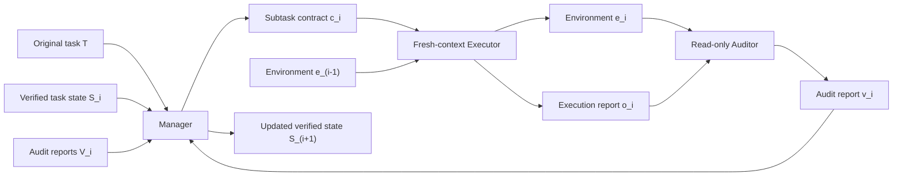

# LongHorizon-Harness：把长程 Agent 从“长上下文执行”改写成“可审计状态机”

> 研究者精读 · 大模型 Agent 相关

| 项目 | 信息 |
|---|---|
| 标题 | LongHorizon-Harness: Advancing Long-Horizon Agents for Real-World Tasks |
| 原文 | https://arxiv.org/abs/2608.01964 |
| HTML | https://arxiv.org/html/2608.01964v1 |
| 代码 | https://github.com/AMAP-ML/LongHorizon-Harness |
| Hugging Face Paper | https://huggingface.co/papers/2608.01964 |
| arXiv ID | arXiv:2608.01964v1 |
| 提交时间 | 2026-08-03 09:32:21 UTC |
| 类型 | 论文 + 开源 harness |
| 分类 | llm-agent |

## TL;DR

- **这篇论文不是提出一个新模型**：它把长程 Agent 的失败归因从“模型不够强”转向“执行状态、完成判断和上下文历史被混在同一个轨迹里”。
- **核心方法是 LongHorizon-Harness**：用 `Manage-Execute-Audit` 三角色循环维护显式任务状态，Manager 只看目标、状态和审计报告，Executor 在 fresh context 中执行一个有边界的子任务，Auditor 只读检查真实环境。
- **关键机制是状态只由审计事实推进**：Executor 的自我声明不能直接把 requirement 标成完成；只有 auditor 在文件、GUI、日志、测试、截图或元数据中验证过的事实，才会进入下一轮持久状态。
- **实验覆盖三类长程环境**：WeaveBench 114 个 GUI+CLI 混合任务、OSWorld 2.0 108 个专业桌面任务、Terminal-Bench 2.1 命令行/软件工程任务。
- **主结果很强但要分清比较口径**：在 Qwen 3.7-Plus + Claude Code 的匹配设置下，WeaveBench PassRate 从 51.8% 到 80.7%，OSWorld 2.0 binary 从 2.8% 到 8.3%，Terminal-Bench 2.1 从 69.7% 到 77.2%。
- **成本不是单向下降**：Manager token 占比只有 2.8%、2.0%、8.1%，但 Auditor 占 19.4%、24.8%、38.1%；WeaveBench token 变为 2.3 倍、OSWorld 输出 token 变为 3.6 倍，而 Terminal-Bench 反而少 24%。
- **局限也很具体**：审计器只能验证可观察状态；隐藏阈值、视频时间定位、纯空间/鼠标精度、含糊任务语义仍会失败；WeaveBench 中作者也说明官方灰色行与自己的黑色行存在权限设置差异，不能混作严格同条件比较。
- **开源状态可复查**：官方 GitHub 仓库已有 `lh-harness` 包、Claude Code/Codex adapter、dashboard、WeaveBench 与 OSWorld 复现实验目录；但 README 也标注 trajectory coming soon，完整轨迹公开仍是复现边界。

## 研究问题：长程 Agent 为什么会越做越乱？

论文的起点是一个常见但常被写得太抽象的问题：

- Agent 在长任务里并不是每一步都不会做。
- 它常常能完成局部动作、生成文件、运行命令、打开 GUI、修一段代码。
- 真正的问题是这些局部进展如何被可靠地保存、验证、串联。

作者把失败拆成三类：

| 失败类型 | 论文里的含义 | 长程任务中的表现 |
|---|---|---|
| Compounding errors | 早期错误沿轨迹累积 | 后续步骤基于错误前提继续推进 |
| Context rot | 交互历史越来越长后，关键事实难以检索 | Agent 忘记已完成项、重复探索、误读约束 |
| Task-state loss | 要求、产物、事实没有稳定状态表示 | 文件存在但不合规，截图有了但不是所需状态 |

这篇论文的关键转向是：

> 不把长程执行看成“更长的 prompt + 更强的模型”，而把它看成“任务状态管理问题”。

这个转向很重要，因为它改变了可改进对象：

- 如果问题只是模型能力，就只能等更强 backbone。
- 如果问题是 harness 状态结构，就可以在同一个模型和同一个执行后端上改变成功率。
- 论文的实验设计正是用 Qwen 3.7-Plus + Claude Code 的匹配比较来隔离 harness 贡献。

## 论文主张与论证路线

作者的论证可以压成四步：

| 层次 | Claim | Mechanism | Evidence | Boundary |
|---|---|---|---|---|
| 问题重定义 | 长程失败来自状态与执行耦合 | 把任务状态拿出执行上下文 | context rot、goal drift、self-assessment error | 不否认模型局部能力仍是上限 |
| 方法设计 | MEA 能降低错误传播 | Manager/Executor/Auditor 分权 | 显式状态、fresh context、只读审计 | 审计器本身成为信任根 |
| 系统适配 | 不必替换原生 Agent runtime | AgentAdapter 包装 Claude Code/Codex/OpenClaw | README 和源码已有 adapter、环境、dashboard | backend 能力、工具权限仍决定可执行动作 |
| 实验结果 | harness 改变端到端完成率 | 三 benchmark 匹配比较和细粒度分析 | 51.8→80.7、2.8→8.3、69.7→77.2 | 成本、权限、隐藏评分、视觉精度仍限制结论 |

换句话说，论文不是说“把任务拆小就够了”。它真正强调的是：

- 子任务必须有 acceptance criteria。
- 子任务结果必须由独立角色验证。
- 验证结果必须变成下一轮唯一可靠记忆。
- 失败、阻塞、未满足约束不能留在长上下文的混乱叙述里，而要变成结构化状态。

## 方法机制：MEA 是什么？


论文把每一轮写成一个状态转移。

### 变量解释

| 符号 | 含义 |
|---|---|
| `T` | 原始长程任务 |
| `S_i` | 第 `i` 轮开始时的显式任务状态 |
| `e_{i-1}` | 执行前的环境状态 |
| `V_{i-1}` | 过去审计报告序列 |
| `c_i` | Manager 生成的 bounded subtask contract |
| `o_i` | Executor 的执行报告 |
| `v_i` | Auditor 的审计报告 |
| `e_i` | 执行后的环境状态 |

### Manager：只维护状态，不碰环境

论文给 Manager 的更新形式是：

```text
(S_{i+1}, q_{i+1}, c_{i+1})
  = Phi_mgr(T, S_i, V_i)
```

这个公式的含义不是“让 LLM 再规划一次”，而是：

- Manager 读原始任务、当前状态和所有审计报告。
- Manager 不能直接看 GUI、读文件、跑命令、改环境。
- Manager 只能基于 auditor 记录的证据更新状态。
- Manager 的控制决策是 `execute`、`done`、`blocked`、`ask`。

任务状态不是一个自然语言摘要，而是结构化记录：

| 记录类型 | 作用 | 状态枚举 |
|---|---|---|
| requirement | 原始任务目标或约束 | completed / pending / blocked / untrusted |
| artifact | 执行中产生或修改的输出 | completed / pending / blocked / untrusted |
| fact | 后续轮次需要保留的环境事实 | completed / pending / blocked / untrusted |

最关键的一条规则是：

- Executor claim 不直接改变 `S_i`。
- 只有 clean audit evidence 支持后，记录才可标为 completed。
- 未解决项保留为 pending、blocked 或 untrusted，而不是被上下文自然遗忘。

### Executor：只做当前合同，不背完整历史

Executor 的执行形式是：

```text
(e_i, o_i)
  = Phi_exec(T, S_i, c_i; e_{i-1})
```

它和常规 Agent 的差异在于：

- 每次执行是 fresh, budget-bounded episode。
- 输入只有原任务、当前任务状态、当前 contract、contract 引用的审计报告。
- 它不接收此前原始交互轨迹。
- 它是唯一被允许主动修改环境的角色。
- 结束后原始 trajectory 和内部推理被丢弃，只把执行报告交给 Auditor。

这对长程任务的影响很直接：

- 好处：减少 context rot，避免旧失败轨迹污染新执行。
- 代价：如果 `S_i` 或 `c_i` 写得不充分，新 Executor 可能缺关键上下文。
- 因此 Manager 的状态表示质量就是系统瓶颈之一。

### Auditor：只读检查，决定状态能否推进

Auditor 的审计形式是：

```text
v_i
  = Phi_aud(T, S_i, c_i, o_i; e_i)
```

Auditor 的职责不是“再让一个模型点评一下”：

- 它从 fresh context 开始。
- 它不看 executor 的原始轨迹和内部推理。
- 它可利用 `o_i` 定位文件、窗口、日志或输出。
- 它必须用真实环境证据判断 contract 是否完成。
- 它的工具权限是 read-only，不能创建、编辑、覆盖、移动或删除受保护产物。

审计报告包含三类结论：

| 结论 | 枚举 | 问题 |
|---|---|---|
| completion status | complete / incomplete / blocked | 当前 contract 是否满足 |
| integrity status | clean / suspect / violation | 产物、来源、工作区状态是否可信 |
| task-state updates | verified facts / evidence / gaps | 哪些事实能进入 `S_{i+1}` |

这就是论文的中心设计：



## 工程实现：AgentAdapter 与官方仓库说明了什么？

官方 GitHub 仓库把项目描述为 execution、state-management、result-verification system，而不是训练框架。

从 README 和 GitHub API 可确认的工程状态包括：

| 证据 | 观察 |
|---|---|
| PyPI 包名 | `lh-harness`，`pyproject.toml` 版本为 `0.1.1` |
| CLI 入口 | `lh-harness = lh_harness.cli:main` |
| 依赖 | Python >= 3.10，依赖很薄，核心集成放在源码内 |
| 后端 adapter | `src/lh_harness/adapters/claude_code.py`、`codex.py`、`cli_agent.py` |
| 环境层 | `src/lh_harness/environment/base.py`、`local.py` |
| dashboard | `src/lh_harness/dashboard/` 下有 server、state、gate、rules |
| 复现目录 | `eval/WeaveBench-harness/`、`eval/OSWorldv2-harness/` |
| release | v0.1.0 于 2026-08-04 发布，v0.1.1 于 2026-08-05 发布 |
| 近期 commit | 2026-08-05 有 merge/update，说明论文后仍在快速迭代 |

README 里的 quick start 也暴露了实际使用边界：

```bash
uv tool install lh-harness
lh-harness doctor
lh-harness doctor --install-codex-gui
lh-harness init
lh-harness run --task "hi"
```

这里有两个细节值得重视：

- `doctor --install-codex-gui` 是显式命令，README 写明普通 `run` 不会安装、移除或改变 Codex plugin。
- 每次 run 会存储在隔离的 `runs/<run-id>/` 目录，保留 task state、event stream、audit reports、role trajectories、workspace 和 final report。

这说明论文方法已经落成可运行项目，但复现边界也不能忽略：

- README 徽章仍写着 trajectory coming soon。
- WeaveBench 复现 README 要求 Linux/KVM/Docker/Node 22/qemu/tmux、至少 32GB RAM，完整 114 任务建议 150GB 磁盘。
- 复现实验还需要 Qwen 3.7-Plus 的 Anthropic-compatible endpoint，以及大图输入时的 image hosting backend。

## 实验设置：三个 benchmark 分别测什么？

论文没有只挑一个 GUI demo，而是使用三个互补环境：

| Benchmark | 规模 | 任务类型 | 指标 | 关键设置 |
|---|---:|---|---|---|
| WeaveBench | 114 tasks | GUI + CLI 混合 computer-use | PassRate、Overall、8 域 PassRate | Ubuntu desktop VM，任务彼此不共享 runtime state，Claude Opus 4.7 trajectory-aware judge |
| OSWorld 2.0 | 108 tasks | 专业桌面 workflow | Binary Accuracy、Partial Accuracy | 官方 `osworld-v2-2026.06.24`，Docker VM，1920x1080 |
| Terminal-Bench 2.1 | 多个 CLI 任务 | 软件工程/命令行 | 三次独立 trial 平均分 | Harbor + Docker backend，每 trial 5 小时 timeout |

作者还给出关键运行预算：

| 角色或任务 | 预算 |
|---|---|
| Executor per round | 1800 秒 |
| Manager per round | 300 秒 |
| Auditor / verifier per round | 300 秒 |
| 最大 MEA 轮数 | `N_max = 25` |
| Terminal-Bench 单 trial | 5 小时 |
| Qwen 请求参数 | `temperature=1.0`、`top_p=0.95`、`top_k=20`、`enable_thinking=true`、`max_tokens=65,536` |

这里有一个需要读者留意的公平性边界：

- WeaveBench 表格里的灰色行是官方报告结果，黑色行是作者自己的 Qwen 3.7-Plus 运行。
- 论文说明作者运行使用 task VM 内 root privileges，而官方结果使用 regular user account。
- 因此最严谨的结论应基于同一模型、同一 Claude Code backend 的 Qwen baseline 与 LongHorizon-Harness 比较，而不是把所有灰色 leaderboard 行混在一起解释。

## 主结果：同模型同 backend，harness 显著改变成功率


### WeaveBench：51.8% 到 80.7%

| Model | Harness | PassRate | Overall |
|---|---|---:|---:|
| Qwen 3.7-Plus | Claude Code | 51.8 | 0.702 |
| Qwen 3.7-Plus | LongHorizon-Harness + Claude Code | 80.7 | 0.835 |
| 差值 |  | +28.9 pp | +0.133 |

领域级别也不是单点提升：

| Domain | baseline PR | LH-Harness PR |
|---|---:|---:|
| DSK | 83.3 | 88.9 |
| DOC | 76.5 | 100.0 |
| GAM | 29.4 | 58.8 |
| WEB | 46.7 | 73.3 |
| DAV | 53.8 | 84.6 |
| OPS | 66.7 | 91.7 |
| SPA | 16.7 | 66.7 |
| DES | 20.0 | 80.0 |

这组结果支持的结论是：

- harness 尤其改善需要长链状态保持的任务。
- SPA、DES、GAM 这类容易出现视觉/文件/交互混合状态的任务增幅最大。
- DSK baseline 已经高，增幅较小，说明 MEA 不是对所有任务平均有效。

### OSWorld 2.0：binary 2.8% 到 8.3%，partial 21.5% 到 35.2%

| Model | Mode | Binary | Partial |
|---|---|---:|---:|
| Qwen 3.7-Plus | single action official baseline | 2.8 | 21.5 |
| Qwen 3.7-Plus | LongHorizon-Harness hybrid | 8.3 | 35.2 |

这个结果更难看，但更有信息量：

- binary 仍然只有 8.3%，说明专业桌面长任务离可靠自动化很远。
- partial 从 21.5 到 35.2，说明 harness 能让 Agent 完成更多子要求。
- binary 提升 3 倍，说明这些部分进展更经常能闭合成完整完成。

Claude Opus 4.7 的 34-task 子集也有一致增益：

| Backbone | Baseline binary / partial | LH-Harness binary / partial |
|---|---:|---:|
| Claude Opus 4.7 | 20.6 / 55.8 | 35.3 / 66.9 |

这支持作者的第二个判断：

- MEA 不是只给弱模型补救。
- 更强 backbone 与更强 harness 是互补关系。
- Backbone 决定每轮动作质量，harness 决定这些局部动作能否被验证、保存、恢复和组合。

### Terminal-Bench 2.1：CLI 场景也有效

| 配置 | 成功率 |
|---|---:|
| Qwen 3.7-Plus + Claude Code | 69.7 |
| LongHorizon-Harness + Claude Code + Qwen 3.7-Plus | 77.2 |
| LongHorizon-Harness + Codex + GPT-5.6 Luna | 83.1 |

Terminal-Bench 的意义是排除一个简单解释：

- 如果只在 GUI/computer-use 任务上提升，可能只是 GUI/CLI routing 做得更好。
- Terminal-Bench 是纯命令行任务，仍然提升，说明显式状态维护、bounded execution 和 independent auditing 对一般长程任务也有价值。

## 成本与消融式解读：审计不是免费的

论文的成本分析很重要，因为它避免了“多包一层就一定更省”的误解。

| Benchmark | Manager token 占比 | Auditor token 占比 | 总成本变化 |
|---|---:|---:|---|
| WeaveBench | 2.8% | 19.4% | baseline 的 2.3 倍 |
| OSWorld 2.0 | 2.0% | 24.8% | output token 为 baseline 的 3.6 倍 |
| Terminal-Bench 2.1 | 8.1% | 38.1% | 比 baseline 少 24% |

可以得出三个更细的判断：

- Manager 不是主要成本源，显式状态维护本身比较轻。
- Auditor 是主要新增投资，因为它必须从真实环境里重新确认事实。
- 总成本依赖任务和模型能力；弱模型可能需要更多恢复轮，强模型可能因更少返工而降低总 token。

WeaveBench Games 子集能看出这种差异。

| Backbone | Claude Code mean score | LH-Harness mean score | Claude Code token | LH-Harness token |
|---|---:|---:|---:|---:|
| Claude Opus 4.7 | 0.680 | 0.809 | 16.5M | 11.1M |
| Qwen 3.7-Plus | 0.524 | 0.733 | 10.7M | 34.3M |

这说明：

- 对 Opus，MEA 可能减少无效长轨迹和重复探索，所以 token 下降。
- 对 Qwen，MEA 能救回更多失败，但需要反复执行与审计，所以 token 上升。
- “harness 增强能力”与“harness 降低成本”不是同一个命题。

## 失败案例与反例：它解决的不是所有长任务问题

论文附录里的细粒度分析比主表更值得读。

作者总结的残余失败主要集中在：

| 残余难点 | 为什么 MEA 也难解决 |
|---|---|
| hidden performance thresholds | Auditor 无法从可见环境完全恢复评分条件 |
| embodied visual precision | 鼠标定位、CAD 几何、视频时间轴仍是低层能力瓶颈 |
| temporal video evidence | 正确证据依赖时间片段和语义定位 |
| ambiguous task semantics | contract 本身可能解释错 |
| stale evidence override | 新用户信息未覆盖旧证据时，verifier 可能确认过时状态 |
| visible-state closure 不足 | 文件或截图不能形成权威闭包时， plausible evidence 可能被误当完成 |

这几条边界很关键：

- MEA 能把“已验证事实”带到下一轮。
- 但如果验证目标本身不可观察或被误定义，MEA 会更有条理地验证一个错误答案。
- 它不能凭空补足视觉定位、数学推理、代码能力或隐藏评分规则。

论文也给了正反混合例子：

| 案例 | baseline 失败 | MEA 做了什么 |
|---|---|---|
| Wireshark / WebRTC | 卡在 `Decode As` 对话框超过 400 步 | 记录失败交互和缺口，后续轮收集剩余 charts 与 packet evidence，0.59 到 0.92 |
| LibreOffice headings | 视觉上像完成，但没有按要求应用 underlying style | Auditor 解析 XML，确认 15 个 headings 的真实 style，0.00 到 0.89 |
| spreadsheet VLOOKUP | 修复前证据没有完整保存就改了表 | 把 pre-repair evidence 作为 pending requirement，先补证据再修复 |
| Lighthouse / DevTools | 完成核心优化后卡在证据收集 | 保留优化状态，把剩余 evidence requirements 分配给后续轮，0.53 到 0.85 |

这些案例支撑了论文更强的机制判断：

- 可靠长程执行不是“动作更多”。
- 是把每个动作结果变成可审计状态命题。
- 命题包括：环境中什么变了、满足哪个 requirement、证据是什么、还缺什么。

## 和已有 Agent harness 的关系

论文没有把 Claude Code、Codex CLI、OpenClaw 当成对手，而是把它们当成可包装 backend。

这点在方法上很有意义：

- 原生 backend 保留自己的 planning、tool-use loop、shell、文件编辑、测试和 GUI 能力。
- LongHorizon-Harness 控制的是输入上下文、工具权限、执行预算、返回报告和跨轮状态。
- `AgentAdapter` 的作用是把不同 backend 接入同一套 MEA 角色边界。

可以把关系理解成：

```text
Backbone model
  -> decides local action quality

Native agent backend
  -> provides tool loop and environment interaction

LongHorizon-Harness
  -> externalizes state, bounds subtasks, audits transitions
```

这也解释了为什么论文标题强调 harness：

- 它不是模型论文。
- 不是 benchmark 论文。
- 也不只是一个 prompt template。
- 它是在回答“Agent runtime 如何组织长任务可靠性”。

## 细节清单：哪些信息真正支撑论文主张？

为了避免只复述摘要，需要把论文的细节按“方法、实验、失败、复现”重新盘点。

### 方法侧 inventory

| 细节 | 论文给出的设计 | 为什么重要 |
|---|---|---|
| 状态记录 | requirement、artifact、fact 三类 | 把任务目标、产物和环境事实分开，避免一个自然语言摘要混淆职责 |
| 状态标签 | completed、pending、blocked、untrusted | 失败不再被吞进上下文，而是成为下一轮规划输入 |
| Manager 权限 | 无环境接口，不能观察或修改环境 | 防止规划者把未经验证的环境猜测写进持久状态 |
| Executor 权限 | 唯一可主动修改环境 | 让状态变化有清晰责任来源 |
| Auditor 权限 | 只读检查文件、GUI、日志、测试、元数据 | 把“看起来完成”改成“环境证据支持完成” |
| AgentAdapter | 保留 Claude Code、Codex、OpenClaw 原生 loop | 说明方法是 harness 层，不是重写所有 Agent 后端 |
| 终止条件 | done、blocked、ask、round budget exhausted | 允许任务停在需要用户授权或无法推进的位置，而不是硬凑完成 |

这个 inventory 暗含一个更严格的系统设计原则：

- 状态拥有者不碰环境。
- 环境修改者不决定完成。
- 完成判定者不修改结果。
- 下一轮只能从已验证状态继续。

这四条如果在实现中被打破，MEA 的论文主张就会削弱。

### 评测侧 inventory

| 评测点 | 具体设置 | 可证明什么 | 不能证明什么 |
|---|---|---|---|
| WeaveBench | 114 个混合 GUI+CLI 任务，8 个域 | 混合接口长任务里状态管理有用 | 不能单独证明所有真实桌面任务可靠 |
| OSWorld 2.0 | 108 个专业桌面 workflow | 更贴近桌面应用与人机交互 | binary 仍低，说明距离生产自动化很远 |
| Terminal-Bench 2.1 | Harbor + Docker，三次 trial 平均 | 纯 CLI 长程任务也受益 | 不覆盖 GUI 视觉精度和真实用户审批 |
| Opus 4.7 子集 | 34 个 OSWorld 任务 | 更强模型也受益 | 子集大小有限，不能替代完整主结果 |
| Games 子集 | 17 个 WeaveBench 游戏任务 | baseline 低分任务的 failure floor 被抬高 | 个别已强任务可能退化 |

最有解释力的不是单个 benchmark 的最高数值，而是三个环境共同出现的模式：

- 当任务成功依赖多个可检查状态时，MEA 有较大收益。
- 当任务瓶颈是单步视觉、数学、鼠标精度或隐藏评分时，MEA 收益下降。
- 当 stronger model 能减少返工时，MEA 可能同时提高成功率和降低 token。

### 负控与失败边界 inventory

如果要继续验证这篇论文，我会优先加这些负控：

| 负控 | 目的 | 预期能揭示的风险 |
|---|---|---|
| Auditor 无证据放行 | 检查系统是否真的拒绝 executor 自评 | 若仍标 completed，说明状态门禁失效 |
| Executor 伪造截图或日志 | 检查 evidence provenance | 若 auditor 只看文件名，会接受伪证 |
| Manager contract 故意漏掉约束 | 检查 auditor 是否回看原任务 | 若只审 contract，不审原始任务，会验证错目标 |
| 用户输入前后冲突 | 检查 stale evidence override | 若旧事实压过新授权，会产生错误持久状态 |
| 隐藏评分任务 | 检查不可观察目标的上限 | 若无闭包仍自信完成，需要更保守 blocked |

这些负控不是吹毛求疵。论文自己已经承认：

- `untrusted` 状态存在。
- `ask` 与 `blocked` 是合法控制结果。
- auditor 的完整性检查会影响 task-state update。

因此下一步研究应把这些控制结果当成一等指标，而不是只统计 success rate。

## 图表证据逐项解读

### Figure：MEA overview

本地化的 MEA overview 图支持三个判断：

- 执行被切成多轮，每轮只处理一个 bounded subtask。
- Auditor 不是旁路评论员，而是状态转移的门。
- 跨轮保留的是 audit reports 和 task state，不是 executor 的完整聊天历史。

图不能证明的内容也要说明：

- 它不能证明 auditor 真的不可被 prompt injection 影响。
- 它不能证明所有工具权限在实现中严格隔离。
- 它不能证明状态 schema 足以覆盖所有真实任务语义。

### Benchmark 汇总图

Benchmark 图支持“同模型同后端下 harness 改变端到端表现”的主张。

但解读时要分三层：

1. **强证据层**：Qwen 3.7-Plus + Claude Code baseline 与 LongHorizon-Harness 的匹配比较。
2. **支持性证据层**：Opus 4.7 OSWorld 子集，说明强 backbone 也能增益。
3. **背景参照层**：官方 leaderboard 或外部报告数值，能显示位置，但不都是严格同条件实验。

所以最稳妥的结论是：

- MEA 在作者给定设置下显著提升长程任务完成率。
- 这种提升跨 GUI+CLI、桌面和 CLI benchmark 重复出现。
- 它还不是“长程 Agent 已可靠”的证据，因为 OSWorld binary 仍然很低，复现成本也高。

## 相关工作位置：它和 benchmark、memory、agent safety 的关系

LongHorizon-Harness 处在三条线的交叉处。

| 线索 | 代表问题 | LongHorizon-Harness 的位置 |
|---|---|---|
| Computer-use benchmark | Agent 是否会操作真实桌面和 CLI | 它不是新 benchmark，而是提高这些 benchmark 上的执行组织方式 |
| Agent memory | 长任务中保留什么记忆 | 它选择只保留 verified task state，不保留全部轨迹 |
| Tool / runtime safety | 谁能执行、谁能审批、谁能审计 | 它用三角色分权提供雏形，但还需要安全策略和权限证明 |
| Post-training | 如何训练更会长程执行的模型 | 它提示后训练目标可从单步答案转向可审计状态转移 |
| Observability | 如何复盘 Agent 运行 | run 目录、event stream、audit reports、role trajectories 给出工程方向 |

这也解释了为什么它适合 Daily Report 的 Agent 方向：

- 它直接回应“长程任务不是一次 prompt 能解决”的工程现实。
- 它给出可实现的状态与审计结构。
- 它能和后续安全审计、权限隔离、Agent 训练目标自然连接。

## 研究者视角的核心判断

我认为这篇论文最有价值的不是 80.7% 这个数字，而是它把长程 Agent 的研究对象从“更聪明的单体 Agent”推到了“状态、权限、审计、恢复构成的系统”。

### 值得带走的判断

- **长程可靠性首先是状态问题**：如果 requirement、artifact、fact 没有结构化状态，长上下文只会把错误和正确一起保存。
- **审计必须脱离执行自评**：同一个 Agent 既做事又判定自己完成，错误完成声明会成为下一步的污染源。
- **fresh context 不是丢记忆，而是只保留验证过的记忆**：这比简单清空上下文更强，也比完整保留历史更安全。
- **Agent 能力是 model + harness 的系统属性**：同一个 Qwen 3.7-Plus 和 Claude Code backend，换 harness 后端到端任务完成率明显变化。
- **可观察闭包决定上限**：文件、日志、测试、截图元数据、GUI 状态可以形成闭包；隐藏评分和模糊语义很难。

### 对 AI 安全和 Agent 工程的延伸

这篇论文也可以放进安全视角看。

| 安全问题 | MEA 的启发 | 仍缺什么 |
|---|---|---|
| 越权执行 | Manager contract 和 role-specific tools 可限制动作范围 | 需要更形式化的权限模型和策略执行层 |
| 错误完成声明 | Auditor 不信 executor 自评 | Auditor 本身如何防 prompt injection 和工具污染 |
| 证据伪造 | 只读审计检查真实环境 | 需要证明截图、日志、文件 provenance 不被 executor 伪造 |
| 长程失控 | 状态中保留 blocked/ask，不强行推进 | 需要人类审批、预算、风险分级的公开规范 |
| 事故复盘 | run 目录保存 event stream、audit reports、role trajectories | 官方 trajectory 仍标注 coming soon，外部复核有限 |

如果把它用于真实生产 Agent，我会追加三类评估：

1. **对抗性审计评估**：让 Executor 有动机伪造证据，测试 Auditor 是否能识别。
2. **权限负控**：确认 Auditor read-only、Manager no-env-access、Executor role tools 在实际实现中不可绕过。
3. **中断与恢复评估**：模拟进程崩溃、上下文压缩、用户输入延迟、远端状态变化，检查 `S_i` 是否足够恢复。

## 结论与局限

LongHorizon-Harness 的核心贡献可以概括为：

- 把长程 Agent 从单条不断膨胀的执行轨迹改成显式状态机。
- 把“完成”从 executor 自我判断改成 read-only auditor 的环境证据。
- 把跨轮记忆从原始上下文改成 verified task state。
- 用同模型同 backend 的实验显示 harness 本身能显著改变端到端完成率。

但它的边界同样明确：

- 成本可能显著上升，尤其在弱模型或难以闭合的 GUI 桌面任务上。
- 审计器是新的信任根，若审计目标错、证据被污染或环境不可观察，系统会有条理地保留错误状态。
- 官方完整轨迹仍未完全公开，外部复现需要较重的 KVM/Docker/VM/API/image proxy 基础设施。
- WeaveBench 中官方灰色结果与作者黑色结果存在权限设置差异，不能把所有 leaderboard 数字当作严格同条件对照。

因此，这篇论文最适合被读作一个长程 Agent runtime 设计范式：

- 不是“让模型一次想更久”。
- 不是“给 Agent 更多工具”。
- 而是把每一步执行都变成可验证状态转移。

对 Daily Report 关注的 Agent、后训练和安全交叉方向来说，这个范式值得继续跟踪，因为它直接连接了三个长期问题：

- Agent 如何在数小时任务中保持可恢复进展。
- 后训练是否应该优化单步答案，还是优化可审计状态转移。
- AI 安全是否能把权限、审计、证据 provenance 作为 Agent runtime 的一等结构。

## 参考与核验

- arXiv abstract and metadata: https://arxiv.org/abs/2608.01964
- arXiv HTML full text: https://arxiv.org/html/2608.01964v1
- Official GitHub repository: https://github.com/AMAP-ML/LongHorizon-Harness
- Hugging Face paper page: https://huggingface.co/papers/2608.01964
- Project package metadata: `lh-harness` v0.1.1, Python >= 3.10, MIT license
- GitHub releases checked: v0.1.0 on 2026-08-04, v0.1.1 on 2026-08-05
