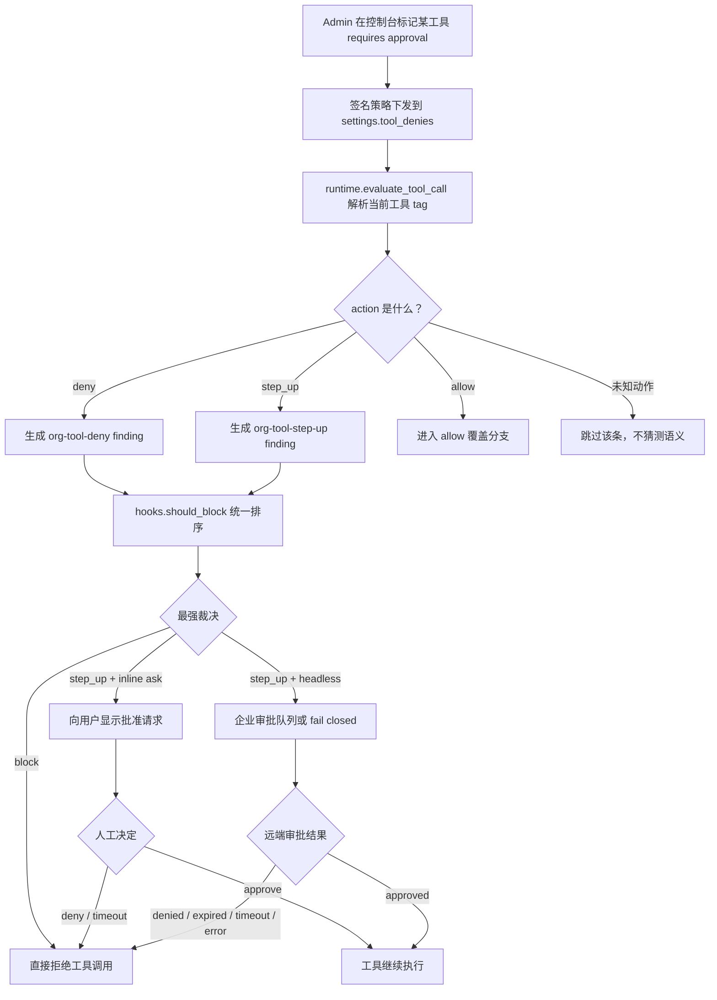

# Prismor v1.38.0：一次 `step_up` 修复暴露的 Agent 工具审批边界

### 元信息

| 字段 | 内容 |
|---|---|
| 主题 | AI Agent 运行时安全 / 工具调用审批 / fail-closed 控制 |
| 原始来源 | [Prismor v1.38.0 release](https://github.com/PrismorSec/prismor/releases/tag/v1.38.0) |
| 代码版本 | `PrismorSec/prismor@v1.38.0`，tag commit `76dbf056c4942c185a86179677042f49c31f3806` |
| 发布时间 | `2026-08-03T15:53:29Z` |
| 关联 PR | [#242 feat(policy): honor step_up in settings.tool_denies](https://github.com/PrismorSec/prismor/pull/242) |
| 本轮分类 | `ai-safety` |

### TL;DR

- Prismor v1.38.0 修的是一个很窄、但安全语义很关键的问题：组织控制台写入 `settings.tool_denies` 的 `step_up` 条目后，旧 runtime 只识别 `deny`，会把 `step_up` 当成未知动作跳过，于是本应要求人工批准的工具调用继续执行。
- 新版本把 `step_up` 变成一类正式 finding：`make_agent_tool_step_up_finding()` 会产出 `action: "step_up"`、`ruleId: "org-tool-step-up"`、`category: "agent-control"`、`mode: "enforce"`，再交给 `hooks.should_block()` 做统一裁决。
- 裁决顺序不是“谁先出现谁赢”，而是显式排序：`block > step_up > defer > modify`。因此真正的阻断仍高于人工审批；审批高于改写和延迟；未知 enforce 动作按阻断处理，避免旧 runtime 因不认识新动作而放行。
- 对有 inline ask 的 Agent 表面，`step_up` 可以显示为人工确认；对无交互表面的 headless Agent，开源 runtime 或 adapter 要么进入企业审批队列，要么 fail closed。文档明确写出 timeout、denial、network error 都不能变成 silent allow。
- 本轮官方证据包括 release、PR、compare、README、`docs/prismor-runtime.md`、`prismor/runtime/agents.py`、`prismor/runtime/runtime.py`、`tests/test_tool_step_up.py`。我本地运行新增测试：6 个测试全部通过。
- 局限也很清楚：这不是一个完整 Agent 沙箱，也不是语义级安全证明；它只修复“组织级工具审批策略被 runtime 静默忽略”的链路。是否真的覆盖每个 Agent，还依赖 hook 是否安装、工具 tag 是否解析准确、Agent 表面是否支持 ask 或企业审批队列。

### 这篇为什么值得读？

- 它不是“再加一个 guardrail”的泛泛宣传，而是一个小型安全修复暴露出的系统设计问题：
  - 控制台策略已经能表达“需要人工批准”；
  - runtime 却只执行“拒绝”和“允许”；
  - UI、策略、执行器之间出现语义缺口；
  - 这个缺口的失败方向是危险的：要求审批的调用没有被审批，直接运行。
- 对 Agent 安全研究来说，这比单纯提高恶意提示检测准确率更基础：
  - Agent 真正造成后果的是工具调用；
  - 工具调用前的最后一个控制点通常在 runtime hook；
  - 如果 runtime 对策略动作的解释不完整，上层控制台和审计日志会给出一种虚假的“已治理”感。
- Prismor 的场景尤其适合观察这个问题：
  - README 把它定位为 coding agents 的 runtime security hooks；
  - 它覆盖 shell、MCP、文件、网络、供应链等多类动作；
  - release 明确点名 Claude Code、Codex 以及其他 coding agents；
  - v1.38.0 的新增点直接落在工具级人工审批，而不是离线扫描或事后告警。

### 旧问题：`tool_denies` 名字下藏着三种语义

`settings.tool_denies` 这个字段名看起来只像“拒绝工具列表”，但实际系统里已经承担了更复杂的组织策略：

| 动作 | 直觉含义 | 旧 runtime 的处理 | 安全后果 |
|---|---|---|---|
| `deny` | 工具不允许调用 | 被识别，生成 deny finding | 调用会被阻断 |
| `allow` | 组织显式允许工具 | 在后续 allow 分支处理 | 可以覆盖本地 deny 或 session scope |
| `step_up` | 需要人工批准 | 被旧循环跳过 | 调用可能直接运行 |

PR 说明里给出的旧逻辑非常直接：

```python
if not isinstance(_d, dict) or _d.get("action", "deny") != "deny":
    continue
```

这段逻辑的关键不是代码复杂，而是默认值和过滤条件共同制造了一个隐蔽边界：

- 没写 `action` 的旧条目会按 `deny` 处理，保持兼容；
- 明确写 `action: allow` 的条目不应在 deny 分支执行，因为后面有 allow 覆盖逻辑；
- 明确写 `action: step_up` 的条目却既不是 deny，也还没有被其他分支消费；
- 结果是“控制台允许管理员设置 requires approval”，但 runtime 对这个要求没有执行路径。

### 新机制：把 `step_up` 变成可裁决的 finding

v1.38.0 的核心补丁分两步走。

| 文件 | 改动 | 作用 |
|---|---|---|
| `prismor/runtime/agents.py` | 新增 `make_agent_tool_step_up_finding()` | 把组织工具审批要求转换成标准 finding |
| `prismor/runtime/runtime.py` | `tool_denies` 循环接受 `deny` 和 `step_up` | 让 runtime 不再静默跳过审批策略 |
| `tests/test_tool_step_up.py` | 新增 6 个单元测试 | 固化 action、优先级、标题和未知动作处理 |
| `CHANGELOG.md` | 写明 v1.38.0 语义 | 明确这是 tool-level step-up 修复 |
| `prismor/runtime/__init__.py` | 版本号升到 `1.38.0` | 发布版本标记 |

新的 finding 形状可以概括为：

```yaml
ruleId: org-tool-step-up
action: step_up
severity: high
category: agent-control
mode: enforce
title: "[approval required] Tool '<tool>' needs a human decision"
remediation: "Approve or deny in the Prismor console, Slack, or webhook"
```

这里最重要的字段不是标题，而是三个控制字段：

- `action: step_up`
  - 表示这不是普通日志，也不是直接拒绝；
  - 它要求调用进入审批路径。
- `category: agent-control`
  - 表示这是操作者对 Agent 工具能力的直接控制；
  - 与普通检测规则不同，不能被本地 observe 姿态轻易压掉。
- `mode: enforce`
  - 表示这条 finding 是执行裁决输入；
  - 如果它命中，就必须被 `should_block()` 看见。

### 裁决公式：强动作优先，而不是首个 finding 优先

Prismor 的 `hooks.should_block()` 在 v1.38.0 里仍然使用显式动作排序：

```text
rank(action) =
  block   -> 0
  step_up -> 1
  defer   -> 2
  modify  -> 3
  unknown -> 0
```

可以把一次工具调用的裁决写成一个小公式：

```text
给定预动作事件 e 和 findings F：

Eligible(e, F) =
  { f ∈ F |
    e.agent_event 是 PreToolUse 类事件
    且 f.contextInert 不为真
    且 f.mode == enforce
    且 file_read 例外没有过滤掉 f }

Decision(e, F) =
  argmin_f rank(f.action) over Eligible(e, F)
```

这个公式支撑了三个安全性质：

- **阻断高于审批**
  - 如果同一次调用同时命中 `block` 和 `step_up`，系统不应该问人；
  - 因为询问会把一个已经判定应阻断的动作重新打开成选择题。
- **审批高于改写**
  - 如果某条组织策略要求人工批准，不能被低优先级 transform 静默改写后执行；
  - 审批是授权问题，改写是输入处理问题，两者不应混用。
- **未知 enforce 动作按阻断处理**
  - 旧 runtime 不认识未来动作时，最安全的退化是停止；
  - 这避免了“新控制台发出新动作，旧客户端直接放行”的协议降级风险。

### 流程图：从控制台策略到工具调用是否执行



这个流程图的重点是：

- `step_up` 不应该绕开 `should_block()`；
- `step_up` 也不应该被等价成普通 `allow`；
- 只要没有明确批准，默认结果应当是阻断。

### 测试证据：6 个新增测试覆盖了哪些边界？

`tests/test_tool_step_up.py` 新增 6 个测试，本轮我在 release tag 上本地执行，结果全部通过。

| 测试 | 覆盖点 | 为什么重要 |
|---|---|---|
| `test_carries_the_step_up_action` | finding 携带 `action: step_up`、`ruleId`、`agent-control`、`enforce` | 防止审批策略被降级成普通日志 |
| `test_deny_finding_still_blocks` | deny finding 没被误改成 step_up | 防止硬阻断被软化 |
| `test_should_block_surfaces_step_up` | `should_block()` 能返回 step_up | 防止 runtime 生成了 finding 但裁决层忽略 |
| `test_a_real_block_outranks_a_step_up` | block 优先于 step_up | 防止“已判定危险”动作被拿去问人 |
| `test_titles_say_what_is_being_asked` | 标题包含工具名和作用域 | 让审批请求可审计、可理解 |
| `test_known_actions` | 只承认 deny / step_up，allow 另行处理，未知跳过 | 防止旧客户端猜错未来动作 |

测试本身不是完整形式化证明，但它抓住了这个 bug 的最小回归面：

- 策略输入是否被识别；
- finding 形状是否正确；
- 裁决顺序是否正确；
- 未知动作是否不会削弱已有策略；
- 审批请求是否带上可读的工具和作用域。

### 与 MCP guardrails 的关系：`step_up` 已经存在，缺的是组织工具策略入口

`docs/prismor-runtime.md` 里早已把 `step_up` 定义为规则动作：

| action | 语义 |
|---|---|
| `block` | 拒绝动作 |
| `warn` / `log` | 记录并放行 |
| `step_up` | 要求人工批准；没有审批表面的地方 fail closed |
| `modify` | 通过 transform 改写工具输入；不能改写时 fail closed |

文档还给了一个 MCP 规则例子：

```yaml
rules:
  - id: github-mcp-writes-need-approval
    event_types: [mcp]
    mode: enforce
    action: step_up
    patterns:
      - "^mcp__github__(create|merge|delete)_"
```

这说明 Prismor 原本并不缺“step_up 作为规则动作”的概念。v1.38.0 修的是另一条路径：

- MCP 自定义规则可以写 `action: step_up`；
- 企业控制台的工具访问面板也会写工具级策略；
- 旧 runtime 处理 `settings.tool_denies` 时没有把 `step_up` 纳入工具策略路径；
- 所以“规则系统支持 step_up”和“组织工具策略支持 step_up”之间存在不一致。

这类不一致在 Agent 安全系统里很常见：

- UI 层支持某个治理动作；
- 策略存储层支持某个枚举值；
- 执行层只实现了枚举子集；
- 审计层可能还记录“策略已下发”；
- 最终真正执行工具的地方却没有被拦住。

### Headless Agent 的难点：不能把“无法询问”解释成“允许”

文档对 `step_up` 的表面能力做了区分：

| Agent / adapter 表面 | 审批体验 | 安全退化方向 |
|---|---|---|
| Claude、Copilot、Qwen Code | 有 inline approval / ask 表面 | 可以直接显示批准请求 |
| Codex、Grok、Kiro、Windsurf、Crush、OpenHands、Continue CLI、Goose 等 | 开源 runtime 没地方显示问题 | 阻断，而不是静默允许 |
| LangChain、CrewAI、browser-use、OpenAI Agents 等 headless adapter | 通过企业 approval queue 等待 | timeout、denial、network error 均 fail closed |

这背后有一个很重要的 Agent 安全原则：

- “人工审批”不是一个纯策略动作；
- 它还需要一个可靠的人机交互通道；
- 没有交互通道时，不能让模型自己替人批准；
- 没有审批服务时，也不能把基础设施错误变成授权成功。

可以把它写成一个授权判定：

```text
allow(tool_call) =
  policy(action) == allow
  OR (
    policy(action) == step_up
    AND approval_channel_available
    AND human_decision == approved
    AND decision_not_expired
  )

其它情况：
  deny(tool_call)
```

这个表达式虽然简单，但它把很多现实故障都收进去：

- 审批请求没发出去；
- 审批队列不可达；
- 用户没有在超时时间内回答；
- 审批被拒绝；
- 客户端版本不支持该 surface；
- action 字符串是未来版本新增的未知值。

### 这次修复的研究价值：Agent 安全需要“策略协议兼容性”测试

很多 AI 安全评测关注模型是否会生成危险命令，但工具型 Agent 还有另一层失败模式：

| 层级 | 常见问题 | Prismor v1.38.0 暴露的对应风险 |
|---|---|---|
| 模型层 | 模型愿意不愿意提出危险动作 | 不是本次重点 |
| 策略层 | 是否能表达 deny、allow、step_up | 策略层已经能表达 |
| 协议层 | action 枚举是否被所有组件一致解释 | 旧 runtime 不解释 step_up |
| 执行层 | 工具调用前是否真的阻断或询问 | 旧路径可能直接运行 |
| 审计层 | 是否能看见请求、批准、拒绝、超时 | 新路径把审批结果纳入 signed audit trail |

这提示后续评测不应该只问：

- “这个 Agent 是否能识别恶意 prompt？”
- “这个 guardrail 是否能匹配危险命令？”

还应该问：

- “控制台发出的每个策略动作，在旧版和新版 runtime 上如何退化？”
- “未知 action 的默认方向是放行、跳过、还是阻断？”
- “同一工具调用命中多个 finding 时，谁优先？”
- “审批服务不可用时，是否 fail closed？”
- “本地 observe 或 dry-run 能否覆盖组织级 enforce 决策？”

### 与近期 Agent 安全工作的区别

这篇深读不把 Prismor v1.38.0 看成新的 benchmark，而把它看成运行时控制的一个案例。

| 对比维度 | 典型 prompt-injection / benchmark 论文 | Prismor v1.38.0 |
|---|---|---|
| 主要对象 | 模型输入、上下文、工具说明、攻击样本 | 组织策略到 runtime hook 的执行链 |
| 关键证据 | 攻击成功率、拒绝率、消融 | 代码 diff、测试、文档契约、release |
| 安全问题 | 模型判断错误或被诱导 | 策略动作被执行器静默忽略 |
| 防护形态 | 过滤、重写、提示隔离、拒绝方向 | 工具级审批、动作优先级、fail-closed |
| 边界 | benchmark 覆盖有限 | Agent surface / adapter 覆盖有限 |

这并不说明 runtime 控制比模型安全更重要，而是说明二者解决的不是同一个问题：

- 模型安全减少“提出危险动作”的概率；
- runtime 安全限制“危险动作真实发生”的路径；
- 组织策略保证“谁有权覆盖本地开发者设置”；
- 审计链提供“发生过什么、谁批准了什么”的证据。

### 可复现性与本轮验证

本轮可以复现的检查包括：

```bash
git clone --depth 1 --branch v1.38.0 https://github.com/PrismorSec/prismor.git
cd prismor
python3 tests/test_tool_step_up.py
```

我在本地 release tag 上执行新增测试，结果为：

```text
Ran 6 tests in 0.000s
OK
```

我还用 GitHub compare 核对 `v1.37.0...v1.38.0`：

| 指标 | 结果 |
|---|---|
| compare 状态 | `ahead` |
| commits | 2 |
| 修改文件 | 5 |
| 新增测试文件 | `tests/test_tool_step_up.py` |
| 核心 runtime 文件 | `prismor/runtime/agents.py`、`prismor/runtime/runtime.py` |
| 版本标记 | `prismor/runtime/__init__.py` 从 `1.37.0` 到 `1.38.0` |

需要注意：

- PR body 提到“security regression suite green (137)”，这是维护者在 PR 中给出的状态；
- 本轮只本地运行了新增的 6 个 `step_up` 测试，没有重跑完整 137 项回归；
- 因此本文把 137 项作为上游 PR 证据，不把它当成本轮独立复验结果。

### 证据边界：这次 release 没有证明什么？

- 它没有证明所有 coding agent 都已经具备可用的 inline approval UI。
  - 文档明确区分了有 ask surface 和无 ask surface 的 Agent；
  - 无 surface 的开源路径更像“审批动作退化为阻断”。
- 它没有证明组织控制台、Slack、webhook、企业审批队列在所有部署中都可靠。
  - `await_step_up()` 只把不可达、超时、拒绝统一处理成 False；
  - 这保证了 fail closed，但不保证使用体验顺滑。
- 它没有证明工具 tag 解析不会出错。
  - 如果某个 Agent adapter 没有把工具调用标成 Prismor 能识别的 tag；
  - `settings.tool_denies` 即使正确，也可能匹配不到事件。
- 它没有覆盖“用户批准了一个被模型包装得很无害的危险动作”。
  - 审批只解决授权路径；
  - 审批请求本身的可解释性、上下文完整性、社会工程风险仍是独立问题。
- 它没有替代沙箱、最小权限、网络隔离、密钥隔离。
  - 工具审批是执行前控制；
  - 一旦批准，后续破坏半径仍取决于底层权限边界。

### Detail inventory：把这次改动拆成可审计对象

| 对象 | 具体细节 | 本文如何使用 |
|---|---|---|
| 策略字段 | `settings.tool_denies` | 说明一个历史命名字段承载了 deny、allow、step_up 三类动作 |
| 工具标签 | `resolve_tool_tags(event)` | 解释为什么工具名必须先被标准化，策略才能命中 |
| 新 finding 构造器 | `make_agent_tool_step_up_finding()` | 证明审批要求被转换成统一裁决输入 |
| 执行入口 | `evaluate_tool_call()` | 定位策略从配置进入 runtime 的具体位置 |
| 裁决函数 | `should_block()` | 说明 block 与 step_up 的优先级关系 |
| 审批等待 | `await_step_up()` / `await_step_up_async()` | 说明 headless Agent 如何等待，以及为什么 timeout 不能放行 |
| 回归测试 | `tests/test_tool_step_up.py` | 固定最小安全语义，防止再次静默跳过 |
| 文档契约 | `docs/prismor-runtime.md` | 对齐 action 语义、surface 覆盖与 fail-closed 退化 |

这些对象可以组织成一条审计链：

```text
Signed org policy
  -> settings.tool_denies
  -> resolve_tool_tags(event)
  -> make_agent_tool_step_up_finding()
  -> should_block()
  -> inline ask / approval queue / fail closed
  -> audit outcome
```

这条链上任意一段断掉，都会产生不同故障：

- 策略没有签名或没有下发：
  - runtime 无法知道组织要求；
  - 本地开发者设置会重新变成事实权威。
- 工具 tag 解析失败：
  - 策略存在，但匹配不到真实工具调用；
  - 风险表现为“策略看起来写了，调用却没有被拦截”。
- finding 形状错误：
  - `action`、`mode`、`category` 任何一个字段错误，都可能改变裁决结果；
  - 例如 `mode: observe` 会把审批要求退化成记录。
- 裁决优先级错误：
  - `step_up` 如果高于 `block`，危险动作会被错误地拿去问人；
  - `step_up` 如果低于 `modify`，授权控制可能被输入改写流程吞掉。
- 审批通道失败时 fail open：
  - 这是最危险的退化；
  - 它会把基础设施故障解释为人类同意。

### 负例推演：旧版本为什么会给安全团队制造错觉？

假设一个组织把 `mcp__github__merge_pr` 设成 requires approval。

```yaml
settings:
  tool_denies:
    - tool: mcp__github__merge_pr
      action: step_up
      scope: org
```

旧 runtime 的可能路径是：

1. Agent 准备调用 GitHub MCP 合并 PR。
2. runtime 解析出工具 tag：`mcp__github__merge_pr`。
3. runtime 遍历 `settings.tool_denies`。
4. 条目是 dict，但 `action != deny`。
5. 循环 `continue`，没有生成 finding。
6. 后续 allow 分支不会处理 `step_up`。
7. `should_block()` 看不到审批 finding。
8. 工具调用继续执行。

这里真正危险的不是“没有策略”，而是“策略已经被管理员配置”。它会导致三个错觉：

- **管理错觉**
  - 控制台显示工具需要审批；
  - 安全团队以为生产环境已经切到双人确认。
- **审计错觉**
  - 策略变更可能有记录；
  - 但具体工具调用没有对应的 approval request。
- **责任错觉**
  - 事后看起来像审批人同意了；
  - 实际上可能根本没有出现过问题、按钮或等待队列。

v1.38.0 把这个负例改成：

1. `action: step_up` 被 deny 分支旁路识别。
2. runtime 生成 `org-tool-step-up` finding。
3. `should_block()` 返回 `step_up`。
4. 有 inline ask 的表面展示审批。
5. 无 inline ask 的表面进入企业审批或直接 fail closed。
6. 只有显式 approved 才继续执行。

### 与最小权限的互补关系

工具审批常被误解成最小权限的替代品，但更合理的关系是分层。

| 控制 | 解决的问题 | 解决不了的问题 |
|---|---|---|
| 最小权限 | 工具就算被调用，也只能访问有限资源 | 无法判断这次调用是否符合当前任务 |
| 工具审批 | 高风险调用前要求人类确认 | 人类可能误批，且审批依赖上下文质量 |
| 沙箱 | 限制文件系统、网络、进程等破坏半径 | 不能决定业务授权是否合理 |
| 策略规则 | 自动阻断明显危险模式 | 容易漏掉语义变体或组织特定风险 |
| 审计链 | 记录谁在何时允许了什么 | 不能阻止已经发生的批准错误 |

因此，`step_up` 最适合放在这些场景：

- 操作不可逆：
  - 删除云资源；
  - 合并或发布代码；
  - 修改生产配置；
  - 旋转或导出密钥。
- 工具本身权力大：
  - shell；
  - GitHub / GitLab 管理 API；
  - 云控制平面；
  - 数据库写入；
  - 包管理器安装与发布。
- 模型判断不可靠：
  - 当前任务来自 issue、网页、日志或用户上传文件；
  - 上下文里可能混入 prompt injection；
  - Agent 正在跨项目、跨账户、跨网络边界操作。

不适合滥用 `step_up` 的场景也要写清：

- 高频、低风险、可回滚的只读工具；
- 已经被严格 allowlist 限定参数的内部查询；
- 本地临时实验，且外层沙箱已经限制了写入和网络；
- 需要毫秒级响应、无法等待人工确认的在线路径。

如果把所有工具都设成 requires approval，最后得到的往往不是更安全的系统，而是低质量审批：

- 审批者会形成条件反射；
- Agent 会频繁中断，用户开始寻找绕过方式；
- 真正高风险的调用被淹没在低风险噪声里；
- 审批记录数量增加，但每条记录的信息价值下降。

### 适合作为后续 benchmark 的测试集

基于这次 release，可以设计一组“Agent runtime 策略一致性”测试。

| 测试名 | 输入 | 期望 |
|---|---|---|
| `org_step_up_shell` | org policy 要求 `Bash` 审批，Agent 调用 shell | inline ask 或 fail closed |
| `block_over_step_up` | 同一调用同时命中 block 与 step_up | 直接 block，不询问 |
| `unknown_action_compat` | server 下发未来 action | 不能放行高风险调用 |
| `local_observe_downgrade` | 本地 hook 是 observe，org policy 是 enforce step_up | 组织策略仍生效 |
| `headless_timeout` | headless adapter 等待审批超时 | 工具不执行 |
| `tag_mismatch` | Agent 报告非标准工具名 | 测试应暴露策略未命中，而不是假装通过 |
| `approval_context_integrity` | prompt injection 尝试改写审批原因 | UI 应显示原始参数和风险 finding |

这类 benchmark 的意义是：

- 它不依赖模型是否“聪明”；
- 它测试的是治理协议和执行器；
- 它能发现 UI、server、runtime、adapter 之间的语义漂移；
- 它尤其适合企业 Agent 平台上线前做兼容性验收。

### 对 Codex / coding-agent 环境的具体启发

对 coding-agent 系统，工具审批至少应当按三类工具分级：

| 工具类型 | 默认策略 | 需要审批的触发条件 |
|---|---|---|
| 只读检索 | observe 或 allow | 读取敏感路径、越过工作区、访问凭据目录 |
| 可逆写入 | allow + audit | 大范围改动、跨模块改动、生成锁文件或配置 |
| 不可逆/外部副作用 | step_up 或 block | 发布、推送、删除、迁移数据库、云资源变更 |

审批请求也不应只写“是否允许 Bash”。

更有用的审批卡片至少应包含：

- 工具名和 adapter 名；
- 解析出的工具 tag；
- 原始参数；
- 当前工作区和账户；
- 命中的规则 ID；
- 风险类别；
- 触发来源；
- 预计副作用；
- 可选的 dry-run 输出；
- 超时后的默认动作。

这能减少两种失败：

- 人类只看到抽象工具名，不知道 Agent 实际要做什么；
- Agent 或注入内容把危险动作包装成普通维护任务。

### 研究者视角的后续问题

- **策略协议应该版本化。**
  - `action` 枚举扩展时，server、console、runtime、adapter 应有兼容性矩阵；
  - 旧 runtime 遇到新 action 的默认行为应被测试，而不是靠注释约定。
- **审批请求需要上下文完整性。**
  - 只显示工具名不足以让人判断；
  - 应显示调用参数、来源 prompt、关联文件、上游网页、风险 finding、预计副作用；
  - 还要避免模型把危险上下文重写成安全叙述。
- **Agent 安全评测应加入“治理动作一致性”维度。**
  - 同一策略在 Claude、Codex、Qwen Code、LangChain、OpenAI Agents adapter 上是否同向退化；
  - 同一工具 tag 在 MCP、shell、framework tool、browser action 中是否一致；
  - 同一 org policy 是否能覆盖本地 observe、dry-run、session scope。
- **fail closed 与可用性需要分层表达。**
  - 对生产数据库、云密钥、CI 发布、包管理器安装，应偏向 fail closed；
  - 对只读查询、低风险本地文件、临时实验工具，可以有更细的降级策略；
  - 但降级必须由策略显式声明，不能由 runtime 猜测。
- **人工审批不是安全终点。**
  - 审批者可能疲劳；
  - 审批 UI 可能缺上下文；
  - 组织可能把高频工具都设为 requires approval，最后形成橡皮图章；
  - 更可靠的方向是把审批、最小权限、可回滚执行、审计证据、事后检测组合起来。

### 结论

- Prismor v1.38.0 的价值不在代码量，而在它修补了一个 Agent 安全系统很容易忽视的执行缺口：
  - 策略层能表达 `step_up`；
  - 控制台能写入 `step_up`;
  - 旧 runtime 的工具策略分支却只处理 `deny`;
  - 最终需要审批的工具调用可能直接执行。
- 新版本把 `step_up` 纳入 finding 和 `should_block()` 的统一裁决，并用 6 个测试固定最小安全语义：
  - `block` 仍最强；
  - `step_up` 必须可见；
  - 组织级审批不能被本地 observe 压掉；
  - 未知动作不应削弱策略；
  - 非批准结果 fail closed。
- 对 Agent 安全实践来说，这个 release 是一个具体提醒：
  - 不要只评估模型是否安全；
  - 也要评估策略动作是否被每个 runtime 和 adapter 正确执行；
  - 尤其要测试“新策略下发到旧执行器”时的退化方向。
