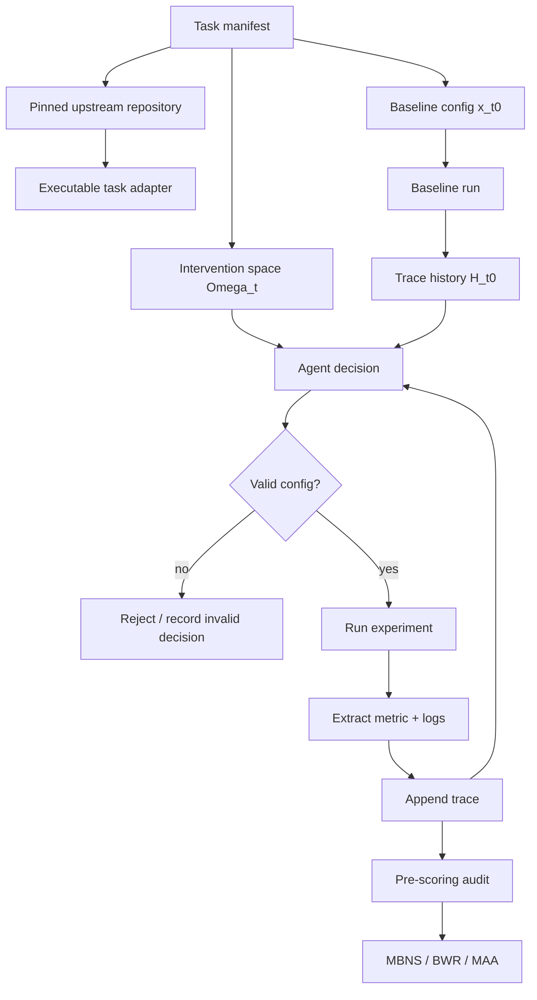

# AgentHPOBench：把科研 Agent 评测从“会不会写代码”推进到“会不会看实验结果继续调参”

| 项目 | 内容 |
|---|---|
| 论文 | AgentHPOBench: A Benchmark For Evaluating LLM Agents as Sequential Hyperparameter Optimizers |
| 作者 | Tianyu Huai, Tingshuo Fan, Xinchi Chen, Yining Zheng, Yuxin Wang, Shuang Chen, Jie Zhou, Xuanjing Huang |
| 机构 | Fudan University, Shanghai Innovation Institute, East China Normal University, OpenMOSS |
| 官方链接 | https://arxiv.org/abs/2607.29626 |
| 代码 | https://github.com/OpenMOSS/AgentHPOBench |
| arXiv 时间 | v1 submitted on 31 Jul 2026, 16:58:00 UTC |
| 本文类型 | 论文 + 代码仓库深读 |

## TL;DR

1. **这篇论文研究什么**：AgentHPOBench 不是评测 Agent 能不能一次性写出答案，而是评测它能否像研究者一样做连续实验：先跑一个验证过的 baseline，再看配置、指标和日志，提出下一组合法超参数，重复 5 次 intervention。
2. **作者怎么做**：benchmark 由 30 个真实 ML GitHub 仓库构成，覆盖 NLP、CV、时间序列、图学习、RL、LLM、结构化学习 7 类任务；每个任务都有固定数据、固定 split、固定 target metric、固定 intervention space、paper/repo anchor 和统一执行 harness。
3. **核心证据**：limited-budget 协议下，Claude Sonnet 4.6 的 overall MBNS 为 0.407，BWR 为 76.7%，MAA 为 79.5%；开源权重模型中 Qwen3-32B 的 overall MBNS 最高，为 0.148，MAA 为 69.1%；传统 HPO baseline 中 BOHB variant 的 overall MBNS 为 0.018，random search 的 BWR 为 48.9%。
4. **关键负面结果**：强 Agent 并不稳定。Claude Sonnet 4.6 虽然总分领先，但 BWR=76.7% 意味着 30 个任务里仍有 7 个最终配置没有超过 reference baseline；Qwen3-32B 的平均 BWR 为 60.0%，说明“看过日志”不等于“能稳定保留早期收益”。
5. **反馈消融**：对 Qwen3-32B 去掉 intermediate metrics/logs 后，overall MBNS 从 0.148 降到 0.052，BWR 从 60.0% 降到 50.0%，MAA 从 69.1% 降到 65.2%；这说明中间实验反馈确实有用，但现有 Agent 还不会总是正确利用它。
6. **局限**：任务集只有 30 个仓库，API Agent 只做 canonical run，开源 Agent/HPO baseline 才有 0、1、42 三个 seed；一些上游任务依赖数据许可、模型权重、Conda/Ray 环境，复现成本高；MBNS/BWR/MAA 只能衡量最后一次 intervention 的数值表现，不能完全解释每次调参背后的科学推理是否可靠。

## 研究问题：为什么需要单独评测“连续 HPO Agent”？

### 现有 Agent benchmark 漏掉了哪种能力？

| 评测类型 | 常见目标 | 被 AgentHPOBench 认为不足的地方 |
|---|---|---|
| 静态代码生成 | 生成函数、修补代码、通过测试 | 不要求 Agent 连续观察实验反馈 |
| 论文复现/研究工程 | 搭环境、改代码、跑完整流程 | 改进来源可能混合了数据处理、debug、架构修改和调参 |
| 传统 HPO benchmark | 在干净 objective interface 上选超参数 | 抽掉了真实仓库里的日志、脚本、配置和失败模式 |
| AgentHPOBench | 在真实仓库中连续提出合法超参数 | 只隔离“看实验证据后提出下一步配置”这件事 |

作者的问题意识很清楚：

1. **科研 Agent 的核心动作不是一次性回答**：真实研究者会先跑 baseline，再从 loss curve、validation score、错误日志、训练预算里判断下一步。
2. **传统 HPO 不等于 Agent HPO**：TPE、BOHB、random search 可以在结构化搜索空间里工作，但它们不读训练日志，也不理解仓库语义。
3. **广义研究 benchmark 太混杂**：如果一个 Agent 在 paper reproduction 里提分，原因可能是修了数据 loader，也可能是调了学习率；AgentHPOBench 试图把自由度压到超参数决策。

因此，论文真正要问的是：

> 给定同一个 baseline、同一个搜索空间、同一个训练预算和同一批可见实验记录，Agent 能不能把“已经发生的实验”转化为“下一次更好的配置”？

## 论文主张与论证路线

| Claim | Mechanism | Evidence | Boundary |
|---|---|---|---|
| Agent 具备一定实验优化能力 | 让 Agent 连续 5 次读取配置、metrics、logs 并提出配置 | Claude Sonnet 4.6 limited-budget overall MBNS=0.407，BWR=76.7%，MAA=79.5% | 仍有 7/30 任务未超过 baseline；API run 非多 seed |
| 中间反馈是有效信号 | no-feedback ablation 保留 baseline，但隐藏 intervention 后的指标和日志 | Qwen3-32B MBNS 0.148→0.052，BWR 60.0%→50.0%，MAA 69.1%→65.2% | 只对 Qwen3-32B 做该消融，不能直接推出所有模型同幅度受益 |
| Agent 与传统 HPO 的差异来自输入形态 | Agent 读 task context、auxiliary metrics、logs；HPO baseline 只用历史配置和目标值 | 强 API Agent 总体超过 random/TPE/BOHB，但 HPO 在部分类别仍有竞争力 | 任务数小，category imbalance 明显，例如 Graph 只有 2 个任务 |
| 统一 harness 很重要 | 固定 task definition、intervention space、budget、result schema，并先 audit 再 scoring | harness ablation 显示 AgentHPOBench 与 CLI harness 在 MBNS/BWR/MAA 上各有强弱 | harness 本身会影响 Agent 行为，所以结果不是纯模型能力 |

这条论证路线的重点不在“谁是榜首”，而在把科研 Agent 能力拆成两个可观察部分：

1. **能发现有用配置**：看 baseline 后提出某个方向，短期让指标改善。
2. **能持续保留并细化收益**：后续 intervention 不把已有收益冲掉，也不被单次噪声牵着走。

论文的负面结果主要落在第二点：许多 Agent 能在前两轮找到收益，但后面会 plateau、回退或丢掉早期优势。

## 方法机制：AgentHPOBench 如何把真实仓库变成可比实验？


### 任务单元由什么组成？

每个任务不是一个抽象函数，而是一个可执行研究仓库的受控切片：

| 组件 | 论文中的角色 | 为什么重要 |
|---|---|---|
| Reference baseline | 所有 Agent 和 HPO baseline 共享的初始配置 `x_{t,0}` | 保证比较从同一实验起点开始 |
| Target metric | 每个任务唯一用于 scoring 的指标 | 避免 Agent 自选有利指标 |
| Intervention space `Ω_t` | 从官方 scripts、config、docs 中抽取的合法超参数集合 | 限制 Agent 只能调参，不随意改数据或评测代码 |
| Paper / repo anchor | 原论文或仓库报告中的参考性能 | 让“接近真实报告水平”可度量 |
| Execution harness | 负责验证配置、启动实验、抽取指标、记录 trace | 把异构仓库统一到可审计 JSON |
| Pre-scoring audit | 检查 baseline、5 次 intervention、schema、metric、anchor 一致性 | 防止缺 trace、fallback、错误指标进入总分 |

代码仓库也印证了这套设计：

1. `configs/tasks.json` 声明协议：`baseline_runs=1`、`interventions=5`、`limited_budget=true`。
2. `configs/repositories.json` 记录 30 个上游仓库及 pinned revision。
3. `agenthpobench/core/agent_base.py` 的 `DecisionContext` 包含 `training_log`、`current_config`、`metrics_history`、`budget_remaining`、`search_space`、`metric_direction`。
4. `analysis/validate_results.py` 要求 exact trace、raw responses、fallback markers、task errors、final metric 和 seed/model provenance。

### 顺序决策形式化

论文把每个任务写成一个受限顺序优化问题：

```text
任务 t:
  搜索空间: Ω_t
  预算设置: r
  baseline: x_{t,0}
  目标函数: f_{t,r}(x)

baseline 执行:
  y_{t,0} = f_{t,r}(x_{t,0})

第 k 次 intervention:
  观察历史 H_{t,k-1} = {τ_{t,0}, ..., τ_{t,k-1}}
  其中 τ_{t,k} = {x_{t,k}, y_{t,k}, logs_{t,k}}
  Agent 提出 x_{t,k} ∈ Ω_t
  harness 验证并执行:
    y_{t,k} = f_{t,r}(x_{t,k})

最终评分:
  只使用第 K 次 intervention 后的结果，而不是 best-of-trajectory
```

这个“只看最终结果”的选择很关键：

1. 如果看 best intermediate，Agent 偶然试出好配置后再把它破坏，也会被高估。
2. 如果看 final result，评测就会惩罚不会保留收益的 Agent。
3. 这更贴近真实研究闭环：最后提交的是最终配置，而不是过程中某次未被识别或未被保留的偶然峰值。

### 三个核心指标怎么读？

论文用三个指标避免单一分数误导：

```text
已统一成越大越好之后:

NS_{t,r} = (s_{t,r} - b_{t,r}) / (a_t - b_{t,r})

BNS_{t,r} = min(1, max(-1, NS_{t,r}))

MBNS_r = (1/T) * Σ_t BNS_{t,r}

BWR_r = (1/T) * Σ_t 1[s_{t,r} > b_{t,r}]

AA_{t,r} =
  s_{t,r} / a_t, if higher is better
  a_t / s_{t,r}, if lower is better
```

变量解释：

| 变量 | 含义 |
|---|---|
| `b_{t,r}` | task `t` 在 budget `r` 下的 reference baseline |
| `s_{t,r}` | Agent 第 5 次 intervention 后的最终结果 |
| `a_t` | paper/repo anchor，即原论文或仓库给出的参考性能 |
| `NS` | 相对 baseline-anchor gap 的归一化提升 |
| `BNS` | 截断到 [-1, 1] 后的单任务分数 |
| `MBNS` | 30 个任务的平均 bounded normalized score |
| `BWR` | 最终结果超过 baseline 的任务比例 |
| `MAA` | 最终结果相对 anchor 的平均达到程度 |

这三个指标回答不同问题：

1. **MBNS**：平均改善幅度有多大，且避免少数小 gap 任务支配总分。
2. **BWR**：多少任务确实赢过 baseline。
3. **MAA**：最终结果离论文/仓库 anchor 还有多近。

## 任务与代码结构：它不是一个小 toy benchmark

### 30 个任务覆盖哪些研究类型？

README 和论文共同列出 30 个 commit-pinned 任务：

| 类别 | 代表任务 | 评测含义 |
|---|---|---|
| NLP / LLM | FineWeb pretraining、ModernBERT MNLI、Open-R1 MATH-500、verl GRPO GSM8K | 观察训练损失、推理准确率或 RL 训练指标后调参 |
| CV | ConvKAN CIFAR-10、AirBench、VAR ImageNet、HyperbolicCV | 在图像分类/生成任务里处理 accuracy、FID 等指标 |
| Time Series | Uni2TS、TimesFM、TimeXer、iTransformer、TimeMixer、SparseTSF | 对 MSE、WAPE、WQL 等方向不同的指标做判断 |
| Graph / RL | NoisyGL、tunedGNN、RAGEN、ART 2048 | 处理 reward、win rate、图分类/节点分类训练反馈 |
| Structured learning | TabMini、Adult diffusion、VBLL、TabM、RankUp | 在表格、回归、半监督设置中调参 |

仓库的 `docs/task-repositories.md` 还说明：

1. 30 个上游仓库都被 commit-pinned。
2. 其中 5 个实验快照带小型 compatibility patch。
3. patch 目标是 lazy optional dependencies、新版 NumPy/SciPy、环境变量覆盖等兼容性问题。
4. 文档声明这些 patch 不改变 search space、budget、metric 或 dataset。

这部分证据说明 AgentHPOBench 的主要工程努力不是写一个统一 toy API，而是把异构研究仓库压到同一审计协议下。

### 执行 harness 的边界



这个流程的研究价值在于把 Agent 的自由度锁住：

1. Agent 可以读日志和历史指标；
2. Agent 只能提出 `Ω_t` 内的配置；
3. harness 决定是否运行；
4. audit 决定是否进入 scoring；
5. 最后只看第 5 次 intervention 的结果。

因此，论文不是在测“Agent 会不会偷改评测脚本”，而是在测“Agent 能不能把实验反馈转成下一次合法调参”。

## 实验设置：limited budget、full budget 与 harness ablation

### Limited-budget 主实验

主实验协议：

| 项目 | 设置 |
|---|---|
| 任务数 | 30 |
| 类别数 | 7 |
| baseline | 每任务先执行 1 次 reference baseline |
| interventions | 5 次 sequential intervention |
| 预算 | baseline 和每次 intervention 约使用原实验训练预算的 10% |
| 开源模型/HPO seed | 0、1、42 三个 seed |
| API Agent | canonical benchmark instance 单次 run |
| HPO baselines | random search、TPE、BOHB-style |

作者选择 limited budget 的原因是现实工程约束：

1. 30 个真实仓库全量跑很贵；
2. limited budget 仍保留训练、日志、指标反馈；
3. 统一 5 次机会可以比较 Agent 是否会利用有限反馈。

### 主结果表怎么读？

| 方法组 | 代表方法 | Overall MBNS | BWR | MAA |
|---|---:|---:|---:|---:|
| Conventional HPO | random search | -0.034 | 48.9% | 62.6% |
| Conventional HPO | TPE | -0.113 | 40.0% | 62.4% |
| Conventional HPO | BOHB variant | 0.018 | 45.6% | 65.3% |
| Open-weight Agent | Qwen3-32B | 0.148 | 60.0% | 69.1% |
| Open-weight Agent | Phi-4-14B | 0.130 | 63.3% | 66.9% |
| API Agent | GPT-5.5 | 0.305 | 66.7% | 76.7% |
| API Agent | Claude Sonnet 4.6 | 0.407 | 76.7% | 79.5% |

这张表支持三个判断：

1. **强 API Agent 的整体优化能力更强**：Claude Sonnet 4.6 在 MBNS、BWR、MAA 三项都最高。
2. **开源权重模型不是完全无效**：Qwen3-32B 的 MBNS=0.148，显著高于传统 HPO baseline 的 overall MBNS。
3. **传统 HPO 仍有局部竞争力**：BOHB variant 在部分任务类别并不差，说明 Agent 的日志理解优势不是无条件压倒搜索算法。

### Category-level 结果给了什么额外信息？

论文强调没有任何方法在所有类别都领先：

| 维度 | 领先者或现象 |
|---|---|
| NLP | Qwen3-32B 的 MBNS 最高 |
| CV、TS、Graph、LLM | Claude Sonnet 4.6 领先 |
| RL | GPT-5.5 领先 |
| SL | GLM-5.1 领先 |
| 失败含义 | 领域差异强，不能用一个 overall rank 替代任务分布分析 |

这对 Agent 评测很重要：

1. HPO 决策高度依赖任务反馈形态；
2. 图学习、时间序列、RL 的日志和指标可解释性不同；
3. 一个 Agent 在语言任务中能读 loss，不代表它能处理 FID、WQL、RMSE 或 win rate 的方向和噪声。

## Figure 与 Table 证据细读

### Figure 2：benchmark 的证据闭环

论文 Figure 2 展示了三层结构：

1. **Task construction**：30 个真实 ML repositories，被拆成 baseline、target metric、paper/repo anchor、intervention space。
2. **Sequential optimization loop**：Agent 读取 history，比较旧配置与新配置，诊断 logs/metrics，再提出下一次配置。
3. **Auditing & scoring**：执行前验证配置，执行后记录 trace，评分前做完整性审计。

这张图的作用不是装饰，而是证明 AgentHPOBench 的控制变量：

| 控制点 | 防止的问题 |
|---|---|
| 固定 dataset/split/metric | Agent 通过换评测目标获得虚假提升 |
| 固定 intervention space | Agent 通过任意改代码绕过 HPO 任务 |
| 完整 trace recording | 只报告成功配置、隐藏失败尝试 |
| Pre-scoring audit | 缺 baseline、缺 intervention、metric 抽取错仍进入总分 |

### Figure：sequential trajectories


轨迹图支持一个比主表更细的结论：

1. Claude Sonnet 4.6 和 Qwen3-32B 在前两次 intervention 中取得明显收益；
2. GPT-5.5 的改善更渐进，最终 intervention 仍继续变好；
3. DeepSeek-R1-Qwen-14B 先低于 baseline，后面恢复；
4. Gemma2-2B 和 Llama-3.1-8B 多数时候围绕 baseline 波动；
5. Phi-4-14B 和 Kimi-2.6 出现非单调 refinement，说明后续调参可能损失早期收益。

这比“最后谁分高”更接近科研 Agent 的真实问题：

> 一个 Agent 如果能找到好配置但不能识别“该停止、该保留、该小步调整”，它仍然不是可靠实验者。

### Table：no-feedback ablation

| 设置 | Overall MBNS | BWR | MAA |
|---|---:|---:|---:|
| Qwen3-32B standard feedback | 0.148 | 60.0% | 69.1% |
| Qwen3-32B no intermediate feedback | 0.052 | 50.0% | 65.2% |
| 差值 | -0.096 | -10.0 pp | -3.9 pp |

这个消融很干净：

1. baseline observation 和 task input 仍然可见；
2. 只是不把每次 intervention 后的 metrics/logs 给后续决策；
3. 七个类别的 MBNS 都下降；
4. 因此中间实验反馈不是噪声，而是 Agent 可利用的真实信号。

但边界也清楚：

1. 该消融只展示 Qwen3-32B；
2. 不能证明每个 API Agent 都同等依赖中间反馈；
3. 也不能证明 Agent 真正理解了因果机制，只能证明反馈可见性与最终分数相关。

### Full-budget 结果

full-budget 只选三类 Agent：

| Agent | limited MBNS | full MBNS | limited BWR | full BWR | full MAA |
|---|---:|---:|---:|---:|---:|
| Qwen3-32B | 0.148 | 0.191 | 60.0% | 56.7% | 81.8% |
| DeepSeek-R1-Qwen-14B | 0.018 | 0.151 | 54.4% | 50.0% | 78.6% |
| Claude Sonnet 4.6 | 0.407 | 0.472 | 76.7% | 76.7% | 89.1% |

这组结果说明：

1. 更多训练预算通常能让最终结果更接近 anchor；
2. 但 BWR 不一定上升，因为 full-budget baseline 也可能更强；
3. 因此 MAA、MBNS、BWR 必须一起读。

如果只看 MAA，会误以为 full budget 总是让 Agent 更可靠；如果只看 BWR，又会低估 full budget 下接近论文 anchor 的意义。

## 消融与失败：Agent 到底在哪里不稳定？

### 失败不是单一原因

论文没有给每个失败 task 做完整错误分类，但从主文能看到三类信号：

| 现象 | 可能机制 | 对 Agent 评测的含义 |
|---|---|---|
| 后续 intervention 丢掉早期收益 | Agent 把短期噪声当方向，或过度调整 | final-score 比 best-score 更能暴露可靠性 |
| 某些类别 MBNS 为负或接近 0 | metric 方向、日志形态、任务噪声、预算约束不同 | 需要 category-level 诊断 |
| harness ablation 指标互有胜负 | prompt/interface/执行环境改变 Agent 决策 | benchmark 要固定 harness，同时报告 harness 敏感性 |

### Harness ablation 的含义

| 比较 | Native AgentHPOBench | CLI harness | 结论 |
|---|---:|---:|---|
| Claude Sonnet 4.6 MBNS | 0.407 | Claude Code CLI 0.332 | native 相对 baseline 改善更大 |
| Claude Sonnet 4.6 BWR | 76.7% | 76.7% | 两者赢过 baseline 的任务数相同 |
| Claude Sonnet 4.6 MAA | 79.5% | 82.2% | CLI 更接近 anchor |
| GPT-5.5 MBNS | 0.305 | Codex CLI 0.266 | native MBNS 更高 |
| GPT-5.5 BWR | 66.7% | Codex CLI 70.0% | CLI 赢过 baseline 的任务更多 |
| GPT-5.5 MAA | 76.7% | Codex CLI 78.7% | CLI anchor attainment 更高 |

这说明 Agent 评测不能把模型和 scaffold/harness 完全分开：

1. 同一个模型在不同执行界面下会产生不同配置；
2. 更高 MBNS 不一定伴随更高 MAA；
3. 如果论文只报告 native harness，就可能隐藏 interface sensitivity；
4. 但如果完全开放 harness，又会难以比较模型能力。

AgentHPOBench 的处理方式是：

1. 主比较使用统一 native harness；
2. 另列 harness ablation；
3. 让读者看到“模型能力”和“工具界面能力”之间的耦合。

### 从具体任务看，为什么“最终配置”比“曾经提分”更严？

论文附录给出逐任务 raw metric、bounded normalized score 和 anchor attainment。虽然主文没有把每个失败逐条展开，但任务名称已经能提示问题复杂度：

| 任务 | 指标形态 | Agent 容易出错的判断 |
|---|---|---|
| `llm_c_fineweb10b` | validation loss，越低越好 | 训练早期 loss 噪声可能诱导过大步长调整 |
| `var_imagenet256` | FID，越低越好 | limited-budget 下生成质量 proxy 可能和 full run 不一致 |
| `art_2048_win_rate` | win rate，越高越好 | 小样本 game outcome 方差高，一次 intervention 的反馈不稳定 |
| `chronos_t5_tiny_monash_weather_wql` | WQL，越低越好 | 时间序列指标有尺度和 horizon 依赖，日志解释不如 accuracy 直接 |
| `rankup_utkface_mae` | MAE，越低越好 | 回归误差和 regularization/learning rate 的关系可能非单调 |

这解释了为什么 benchmark 不采用 “best of 5”：

1. 如果某个 Agent 第 2 次 intervention 偶然拿到好结果，第 5 次又因误读噪声而回退，那么研究者真正拿到的是第 5 次配置。
2. 如果某个 Agent 每次都大幅探索，可能在 noisy task 上撞到峰值，但它并没有证明自己知道为什么这个配置有效。
3. final-step scoring 会惩罚这类不稳定性，迫使 Agent 学会“确认、保留、小步 refinement”。

### 复现时最容易踩的工程边界

从仓库文档看，AgentHPOBench 不是下载后直接一条命令跑完的轻量 benchmark。它的复现边界包括：

1. **环境边界**：基础包要求 Python 3.10+，但 30 个上游仓库有各自依赖；发布 adapter 默认 Conda 在 `/opt/miniconda3`，需要用 `CONDA_ROOT` 改路径。
2. **资产边界**：`repositories/`、`data/`、`models/`、`results/`、`logs/` 都是本地目录；第三方仓库、数据、模型权重和运行日志不随主仓库分发。
3. **离线边界**：模型路径来自 `configs/models.json`，文档说明报告实验使用预下载资产，默认可以进入 Hugging Face offline mode。
4. **合法性边界**：`clone_repositories.py` 会验证 commit、compatibility patch 和 worktree；如果 revision drift 或 patch mismatch，就停止而不是默默复用。
5. **结果边界**：strict validation 要求 exactly five interventions、zero fallback markers、final metric、raw response、seed/model provenance；缺任一项都不应进入 leaderboard。

这些设计会增加复现成本，但也减少了 Agent benchmark 常见的“跑通了但不知道跑的是什么版本”的问题。

## Detail Inventory

| 维度 | 本文抽取到的细节 |
|---|---|
| 方法名 | AgentHPOBench；sequential HPO over executable research repositories |
| 任务规模 | 30 个 GitHub ML 仓库，7 类任务 |
| 决策次数 | 1 次 reference baseline + 5 次 sequential interventions |
| 搜索空间 | `Ω_t`，来自官方 training scripts、config files、repository docs |
| 可见反馈 | current config、metrics history、auxiliary metrics、execution logs、budget、metric direction |
| 固定项 | dataset、split、target metric、evaluation code、benchmark metadata |
| 主要指标 | MBNS、BWR、MAA |
| baseline | random search、TPE、BOHB-style；另有 open-weight agents 与 API agents |
| 开源模型 | Qwen3-8B、Qwen3-32B、Gemma2-2B、DeepSeek-R1-Qwen-14B、Phi-4-14B、Llama-3.1-8B |
| API Agent | DeepSeek-V4-Pro、GPT-5.5、GLM-4.7、GLM-5.1、Kimi-2.6、Claude Sonnet 4.6 |
| 主结果 | Claude Sonnet 4.6 limited-budget MBNS=0.407、BWR=76.7%、MAA=79.5% |
| 开源结果 | Qwen3-32B open-weight overall MBNS=0.148、MAA=69.1%；Phi-4-14B BWR=63.3% |
| 消融 | Qwen3-32B no-feedback：MBNS 0.148→0.052，BWR 60.0%→50.0%，MAA 69.1%→65.2% |
| full budget | Claude Sonnet 4.6 MBNS=0.472，MAA=89.1%，BWR 仍为 76.7% |
| 关键失败 | 后续 intervention 非单调，可能丢掉早期收益；强 Agent 仍不能保证每个任务胜过 baseline |
| 可复现控制 | commit-pinned repos、compatibility patches、strict result validation、seed/model provenance |

## 相关工作位置：它与 MLE-bench、MLGym、HPOBench 的区别

### 与 ML 研究 Agent benchmark 的区别

MLGym、MLE-Dojo、PaperBench、AutoExperiment、RE-Bench、MLR-Bench、AIRS-Bench 都在评测 Agent 做研究工程。

AgentHPOBench 的不同点是更窄：

1. 不评测完整 paper reproduction；
2. 不允许自由改架构、数据处理或评测代码；
3. 专门看“从实验反馈到下一个超参数配置”的闭环；
4. 用 final intervention 结果惩罚不会保留收益的 Agent。

窄化不是退步，而是为了让结论更可归因：

| 如果 broad benchmark 提分 | 可能原因 |
|---|---|
| 改对了 bug | code repair 能力 |
| 找到了数据预处理问题 | data engineering 能力 |
| 换了模型结构 | architecture search 能力 |
| 调好了学习率和 batch size | HPO 能力 |

AgentHPOBench 试图把最后一项单独拿出来测。

### 与传统 HPO benchmark 的区别

HPOBench、YAHPO Gym、LCBench 等一般提供结构化 objective 或 surrogate。

AgentHPOBench 的对象更脏：

1. 真实仓库依赖复杂；
2. 指标需要从日志和输出文件中抽取；
3. 配置项来自 scripts/config/docs；
4. 错误可能是运行失败、依赖失败、metric missing、fallback decision；
5. Agent 需要解释自然语言任务上下文，而不是只调用 `objective(config)`。

这也解释了为什么传统 HPO baseline 仍要放进比较：

1. 它们是“只看数值历史”的参照组；
2. 如果 Agent 输给 random/TPE/BOHB，就说明日志和上下文并没有转化为优势；
3. 如果 Agent 赢了，也要看是否在所有类别都赢，而不是只看 overall。

## 证据边界与可复现性

### 论文已经做得比较扎实的地方

1. **上游仓库 commit-pinned**：README 和 docs 明确列出每个 task 的 upstream repository 与 revision。
2. **任务定义固定**：dataset、split、metric、search space、budget、scoring rule 都被 harness 固定。
3. **结果完整性检查**：仓库的 validation 脚本要求 baseline + 5 interventions、raw response、fallback、错误状态、final metric、seed/model provenance。
4. **开源权重和 HPO baseline 多 seed**：0、1、42 三个 seed 至少能观察 controlled local run 的随机性。
5. **反馈消融清楚**：只隐藏中间 intervention 后的 metrics/logs，能较直接地回答反馈是否有用。

### 仍然需要谨慎的地方

| 风险 | 为什么重要 |
|---|---|
| 30 个任务规模有限 | 7 类任务中 Graph 只有 2 个，category-level 方差可能很大 |
| API Agent 只跑一次 | hosted endpoint 无 immutable checkpoint/seed，结果可能随服务状态变化 |
| limited budget 与真实训练不完全等价 | 10% 训练预算保留反馈，但可能改变最优超参数策略 |
| final-score 惩罚不稳定，但也可能低估探索型策略 | 有些策略中途找到好配置但最后一步破坏，final score 认为失败 |
| 上游依赖和许可证复杂 | ImageNet、模型权重、Conda/Ray 等环境要求会影响第三方复现 |
| 指标归一化依赖 anchor | 如果 anchor 来自不同训练设置或报告口径，MAA/MBNS 解释会变复杂 |

这些边界不削弱论文价值，反而说明 AgentHPOBench 更像一个可审计实验平台，而不是一次性的 leaderboard。

## 研究者视角：它对 Agent 和后训练意味着什么？

### 对 Agent 评测的启发

AgentHPOBench 把 Agent 能力从“能执行长流程”拆成更细粒度的实验能力：

1. **读日志**：能否识别 loss、accuracy、warning、OOM、early plateau。
2. **定方向**：能否判断 learning rate、batch size、regularization、scheduler、epoch budget 哪个更可能有效。
3. **守约束**：能否只在 `Ω_t` 内提出合法配置。
4. **记历史**：能否避免重复无效配置。
5. **保收益**：能否在后续 intervention 中不破坏早期提升。
6. **知道何时小步调整**：能否从“探索”切换到“细化”。

这比一般“是否完成任务”更适合研究科研 Agent。

### 对后训练的启发

这篇论文虽然不是训练方法论文，但它提供了很好的后训练信号设计思路：

| 后训练信号 | AgentHPOBench 可提供的监督 |
|---|---|
| SFT | 给定 trace history，生成合法且解释充分的下一步配置 |
| Preference learning | 偏好更能保留已有收益、更少无效探索、更符合 metric direction 的决策 |
| Process reward | 奖励正确诊断日志、识别 plateau、避免重复 trial |
| Tool-use RL | 奖励调用实验、读取结果、根据反馈更新配置的闭环 |
| Safety / reliability | 惩罚越界配置、忽略失败日志、用错误指标优化 |

特别值得注意的是：

1. AgentHPOBench 的结果 JSON 保留 raw response 和 decision metadata；
2. 这使它可能成为“实验决策过程监督”的数据源；
3. 但如果要用于训练，必须处理任务版权、上游许可证、API response 权利和数据泄漏问题。

### 对 AI 安全 / 科研自动化的边界问题

科研 Agent 自动调参看起来是效率问题，但也有安全边界：

1. Agent 可能为了提分提出超出预算或数据约束的配置；
2. Agent 可能误读 metric direction，把越低越好的指标当成越高越好；
3. Agent 可能过度拟合 limited-budget feedback，推荐 full-budget 下不稳的配置；
4. Agent 可能在日志里看到环境路径、凭据或机器信息，结果 JSON 需要防泄漏；
5. Agent 如果未来被允许改代码，HPO 评测就会变成 code+data+metric hacking 混合问题。

因此，AgentHPOBench 的“只能改 intervention space 内配置”是一条很重要的安全线：

```text
允许:
  读配置、读日志、读指标、提出合法超参数

不允许:
  改 dataset
  改 split
  改 metric extractor
  改 benchmark metadata
  改 evaluation code
```

## 结论

AgentHPOBench 的贡献不只是又做了一个 Agent leaderboard。

更准确地说，它把科研 Agent 的一个关键能力拆出来：

1. 在真实 ML 仓库中运行 baseline；
2. 读取配置、指标、日志和历史 intervention；
3. 在固定搜索空间内提出下一次合法配置；
4. 连续 5 次后用 final result 评分；
5. 用 MBNS、BWR、MAA 同时区分相对提升、赢过 baseline 的比例和接近 anchor 的程度。

论文最有价值的结论也不是“Claude Sonnet 4.6 第一”，而是：

1. 强 Agent 确实能从实验反馈中提取优化信号；
2. 但它们还不稳定，常常不能持续保留收益；
3. 中间 metrics/logs 对 Qwen3-32B 明显有用；
4. harness/interface 会改变 Agent 的配置决策；
5. 未来科研 Agent 的后训练应更重视“实验轨迹中的过程判断”，而不是只奖励最终分数。

如果把 Agent 当作未来的研究助手，AgentHPOBench 给出的提醒很直接：

> 会跑实验只是第一步；会读失败、会保留收益、会在约束内做下一次更好的实验，才是科研 Agent 真正难的部分。
