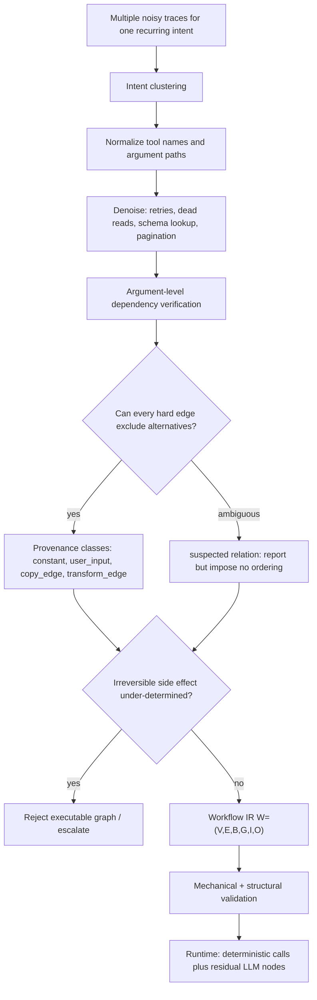

# TraceCompiler：把 Agent 轨迹从“经验回放”编译成可审计工作流

| 项目 | 内容 |
|---|---|
| 原文 | [TraceCompiler: Skill-Guided Mining and Compilation of LLM Agent Traces into Mostly Deterministic Workflows](https://arxiv.org/abs/2608.02680) |
| 版本 | `arXiv:2608.02680v1`，2026-08-03 01:05:06 UTC 提交 |
| 作者 | Salma El Yadouni（EPFL）、Guanyi Li（Binome Technologies） |
| 类型 | LLM Agent / tool-use workflow compilation / process mining |
| 本文关注 | Agent 轨迹复用、参数级依赖验证、编译拒绝条件、可审计边界 |

## TL;DR

- 这篇论文研究一个很实际的 Agent 问题：同一类工具任务反复出现时，Agent 往往每次都重新探索工具、重试参数、查文档、解析账号或联系人，导致轨迹里混着可复用流程和偶然噪声。
- TraceCompiler 的主张不是“把成功轨迹原样回放”，而是从多个 noisy traces 中挖出同一 intent 的结构，把有证据支持的调用、绑定、分支和转换编译成 mostly deterministic workflow。
- 论文最核心的规则是：**观察到两个工具调用相邻，不足以说明它们有依赖；只有 consumer 参数里的值能唯一归因到 earlier producer 时，才保留硬依赖边**。
- 编译输出是 `W=(V,E,B,G,I,O)`：节点、边、参数绑定、guard、输入 schema、输出 schema；参数绑定会被分成 constant、user_input、copy_edge、transform_edge、llm_or_dynamic。
- 在 T1 training split 上，机械化规则在 15,775 条去重 def-use edge 上达到 precision 0.928、recall 0.943，明显高于 adjacency 的 F1 0.711 和 recurrence-adjacent 的 F1 0.712。
- 在 AppWorld replay 上，作者恢复 masked token 并构造 563 条 token edges，same-app last-login 规则达到 precision 0.993、recall 0.970；作者同时承认这是 self-consistency check，不是独立证明。
- 论文做了两个 AppWorld intent case：Venmo money-request 从 34 个观察到的 API calls 编译到 11 个 runtime calls，并在 leave-one-out state tests 中通过 15/21；Spotify/Todoist 因不可逆 playlist mutation 的方向不确定，被正确拒绝编译。
- 局限很清楚：未测 offline compilation cost，没有 workflow interpreter，56 个 AppWorld scenario 没有 compile/decline rate，LLM skill 的 250-edge blind run 不可完全审计，T1 adapter 和部分 clustering serialization 不完整。

## 研究问题：为什么 Agent 轨迹不能只做“记忆摘要”？

### 论文回应的痛点是什么？

- 工具型 Agent 在重复任务中经常重新发现已经执行过的过程：
  - 重新解析稳定身份、账号、team、配置。
  - 重读工具 schema 或 API docs。
  - 因参数错误做 retry。
  - 把一次探索路径中的偶然顺序当成下一次可复用步骤。
  - 在上下文里保留越来越长的 reasoning history。

- 作者把这些成本拆成两类：
  - **reusable procedure**：必要工具、真实数据依赖、branch condition、稳定配置、值转换。
  - **accidental execution history**：重试、探索、无下游消费的读取、文档查找、样式化顺序。

- 因此，普通“workflow memory”或文本摘要仍然不够：
  - 摘要仍要让 LLM 在 runtime 重新解释过程。
  - 原样 replay 会保留误试、文档查找和偶然顺序。
  - 只看调用顺序会把“先后发生”误认为“必须先后发生”。

### 作者如何重新定义问题？

论文把每条轨迹定义为：

```text
tau = (c, u, e1 ... en, y, z)
```

| 符号 | 含义 | 对编译的意义 |
|---|---|---|
| `c` | system context | 决定哪些稳定上下文可能是 static context |
| `u` | user request | 用来区分 user_input 与工具产物 |
| `e1...en` | execution events | 包含消息、reasoning summary、tool call、tool output、exception、state update、human approval |
| `y` | final output | 判断某些读取是否影响最终回答 |
| `z` | metadata | 支持过滤、分组和审计 |

编译单位不是单条 trace，而是 intent cluster：

```text
C = {tau1 ... taum}
```

- 单条轨迹会把“任务结构”和“某个 Agent 的探索习惯”混在一起。
- 多条同类轨迹才可能看出：
  - 哪些调用在不同实例中稳定出现。
  - 哪些参数只是当前用户输入。
  - 哪些重复是 retry。
  - 哪些重复是 fan-out。
  - 哪些 branch 没有足够证据自动选择。

## 论文主张与论证路线

| Claim | Mechanism | Evidence | Boundary |
|---|---|---|---|
| Agent 轨迹可被编译，而不只是被记忆 | intent discovery、denoising、dependency verification、provenance classification、workflow generation | Venmo intent 从 34 calls 到 11 runtime calls；T1/AppWorld 依赖恢复实验 | 未测 offline 编译成本，因此不能 claim 净效率收益 |
| 相邻调用不是依赖 | 只在参数值可唯一归因到 producer 时保留 hard edge | T1 上 adjacency F1 0.711，argument-level F1 0.936 | T1 中 token/co-reference 本身强，edge detection 偏容易 |
| 不确定依赖应降级而不是强行排序 | suspected edge 不约束 DAG；under-determined irreversible side effect 直接拒绝编译 | Spotify/Todoist playlist mutation 被拒绝编译 | 没有报告 56 个 AppWorld scenarios 的总体 decline rate |
| 编译后仍保留必要 LLM 决策 | provenance 将绑定分到 constant/user_input/copy_edge/transform_edge/llm_or_dynamic | Venmo recipient branch 标成 llm_or_dynamic | 论文没有真正评估 HUMAN node，授权边界仍不充分 |
| 机械化规则能给出可复算核心数字 | masking、most-recent-survivor、Wilson interval、baseline 对照 | T1 15,775 edges 上 precision 0.928/recall 0.943 | 机械化规则没有 schema knowledge，也没有完整 alternative-origin reasoning |
| AppWorld token 结果支持跨构造检查 | replay simulator 恢复 masked token，exact matching 得到 563 edges | same-app last-login precision 0.993/recall 0.970 | 作者承认 replay/reference/rule 共享 same-app assumption，只能算 self-consistency |

## 方法机制：TraceCompiler 的流水线

### 1. Intent discovery：先找“同一种任务”

- 每个 conversation 被嵌入为一个 document：
  - initial request 双倍权重，因为它最能承载 intent。
  - 每轮 execution 把 reasoning 与 canonicalized tool calls 交错放入。
  - 交错顺序保留过程信息，而不是把工具调用当 bag-of-tools。

- 聚类方法：
  - encoder：`all-mpnet-base-v2`。
  - agglomeration：cosine distance + average linkage。
  - minimum intra-cluster similarity：0.45。
  - support floor：5。

- 作者选择保守 under-merge：
  - under-merge：同一个 intent 被拆成两个 cluster，最多产生两个可用 workflow。
  - over-merge：不同 intent 被混在一起，会污染依赖抽取。

### 2. Normalization 与 denoising：区分噪声和结构

| 轨迹现象 | TraceCompiler 的处理 | 为什么重要 |
|---|---|---|
| 同一逻辑操作有不同工具名 | 映射到 canonical `app.action` vocabulary | 否则跨 trace 无法比较 |
| schema discovery lookup | 若输出无下游绑定，标成 `dead_output` | runtime 不必再次查文档 |
| 参数抖动后的重复调用 | collapse 为 retry noise | 避免把失败尝试编进工作流 |
| 多个不同 song query | 保留为 genuine fan-out | 重复次数相似不代表都是噪声 |
| `page_index=0,1,2` | 识别为 pagination loop | loop 不是多个独立依赖 |
| 不确定事件 | 保留为 unknown | 作者明确不在 suspicion 下静默删除 |

关键判断是：**call count 不能区分重复是噪声还是结构，参数比较才是判别器**。

### 3. Argument-level dependency verification：论文的核心规则

作者把硬边 `a -> b` 的准入条件写得很保守：

```text
For calls a < b, admit edge a -> b only if:
  1. some argument value v in b is traceable to output of a
  2. every alternative origin of v is excluded
```

可替代来源包括：

- user utterance。
- embedded static context。
- tool-schema default。
- preceding calls 中任何其他可能 producer。
- 未记录请求中可能已经包含的值。

每条 hard edge 都携带证据元组：

```text
<consumer, arg_path, value, presumed_producer, exclusions>
```

这使得 workflow edge 不只是模型判断，而是可被 reviewer 追问：

- consumer 是哪个工具调用？
- 哪个参数路径消费了值？
- 值是什么？
- presumed producer 是谁？
- 排除了哪些 alternative origins？

### 4. Provenance classification：哪些决策还能交给 LLM？

| Provenance class | 定义 | runtime 后果 |
|---|---|---|
| `constant` | 跨 intent traces 稳定，且不是 request 文本 | 可以 build time 解析，runtime 禁止重新发现 |
| `user_input` | 来自当前用户请求 | workflow 输入参数 |
| `copy_edge` | 来自已验证 hard edge 的 producer output | 形成 DAG 约束 |
| `transform_edge` | 可确定性转换得到 | 生成 TRANSFORM 节点 |
| `llm_or_dynamic` | 需要语义判断或开放选择 | 保留 runtime LLM 节点 |

一个细节很关键：认证凭据和 bearer token 不能混为一谈。

- account credentials 可能是 scope-stable，可在 build/cold path 中解析。
- bearer token 是 session artifact，会过期，因此必须是 `copy_edge`。
- 论文据此区分 cold path 和 warm path，避免夸大“编译后省调用”的收益。

### 5. Candidate workflow 不是可信输出

编译流程不是让 LLM 直接吐一个程序就执行：

```text
Input:
  intent cluster C
  canonical tool events
  observed arguments
  optional outputs / opaque references

State:
  evidence tuples
  provenance classes
  suspected relations
  validation diagnostics

Loop:
  discover intent cluster
  normalize tool/action vocabulary
  label events as essential/recovery/exploratory/redundant/dead_output/policy_required/unknown
  verify argument-level dependencies
  classify every binding
  generate workflow IR from proven specification
  validate schema, wiring, variable definition, structural constraints
  if validation fails within repair budget:
    repair candidate
  if irreversible side effect is under-determined:
    reject executable graph and escalate

Output:
  executable workflow W=(V,E,B,G,I,O)
  or refusal/escalation with evidence
```

这个设计把 LLM 的角色压到两个位置：

- 编译期做高成本结构判断。
- runtime 只处理没有证据编译掉的 `llm_or_dynamic` 节点。

## 实验设置：哪些数字能复算，哪些只是一次观察？

### 数据集与用途

| 数据 | 规模/特征 | 论文中用于什么 |
|---|---|---|
| T1 | 13,500 dialogues，九个 travel domains；作者只用 training split，3,375 dialogues、14,250 plans | 用 executable reference plans 构造 def-use edge ground truth |
| AppWorld | 九个应用、457 APIs；56 recurring scenarios，每个 3 个实例 | 用 released trajectories 做 case study 和 token replay |
| Hermes-Function-Calling-v1 | single-turn function calling | 作为 negative transfer：单轮函数调用几乎没有可编译 inter-tool data flow |

T1 的关键数字：

- training split 只覆盖 25% dialogues 和结构多样性最低的 template quarter。
- def-use 产生 22,850 edge occurrences。
- 去重后是 15,775 distinct `(conversation, producer, consumer)` edges。
- 3,350 dialogues 至少含一个 dependency。

AppWorld 的关键设置：

- logs 记录 arguments，但不记录 outputs。
- bearer tokens 在源头被 mask。
- 因此处在 value-opaque regime。

### Model-dependent 与 deterministic 的区分

作者很谨慎地区分了两类结果：

| 结果 | 是否确定性 | 审计状态 |
|---|---|---|
| LLM compiler skill 的 blind protocol | 非确定性 | model version 未记录；250 per-edge predictions 未发布 |
| 两个 AppWorld case study | 非确定性成分 | 使用 frontier LLM agent，版本未记录 |
| masking、mechanized rule、baselines | 确定性 | released commands 可复算 |
| replay reference 与 scoring | 确定性但有共享假设 | 可复算，但不是独立 ground truth |
| leave-one-out execution | 确定性 | 但 Venmo skeleton 被手写转译到 simulator calls |

这个区分影响结论强度：

- `0.992` 的 skill blind run 证明“这个 skill 在一个样本上做得很好”。
- `0.928/0.943` 的 mechanized result 才是大规模、model-free 的中心证据。
- 但 mechanized result 又没有完整实现 alternative-origin exclusion，所以只支撑较窄 claim。

## 主结果一：T1 上 argument-level 明显优于顺序规则

### Table 2 的核心对比

| Method | Precision | Recall | F1 | 读到的信息 |
|---|---:|---:|---:|---|
| adjacency | 0.584 | 0.908 | 0.711 | 只看相邻工具顺序 |
| all-pairs | 0.231 | 0.998 | 0.376 | 只看所有先后对 |
| recurrence, all-pairs candidates | 0.253 | 0.945 | 0.399 | 看重复出现的先后对 |
| recurrence, adjacent candidates | 0.617 | 0.842 | 0.712 | 看重复出现的相邻对 |
| argument-level, most recent survivor | 0.928 | 0.943 | 0.936 | 读 masked co-reference |
| argument-level, unique-candidate only | 1.000 | 0.071 | 0.133 | 极保守，只在唯一候选时出边 |

这个表支持两个判断：

- 顺序确实包含信号，但不足以当依赖。
- masked co-reference + producer attribution 大幅提升 precision。

但它也有一个重要边界：

- order-based rows 只读 tool order。
- argument-level rows 额外读 masked co-reference。
- 因此这不是“同等输入下算法全面碾压”，而是证明参数级信息对依赖恢复很关键。

### Table 3：真正起作用的是 recency，不是完整 exclusion

作者做了一个很有价值的消融：固定 carrier exclusion，只改变 survivor 选择策略。

| Candidate-choice policy | Precision | Recall | F1 |
|---|---:|---:|---:|
| most recent survivor | 0.928 | 0.943 | 0.936 |
| random survivor | 0.403 | 0.440 | 0.420 |
| second-most-recent survivor | 0.220 | 0.214 | 0.217 |
| earliest survivor | 0.146 | 0.073 | 0.097 |
| all survivors | 0.365 | 1.000 | 0.535 |

这里的关键不是“most recent survivor 很强”，而是：

- T1 masked corpus 中每个 relation 都至少有一个 candidate producer。
- mean surviving candidates 是 8.2。
- detection 几乎不难，难点是 producer attribution。
- mechanized rule 不能测试 type compatibility，也不能把 user utterance/static context/defaults 当 alternative origins 做完整排除。

所以 `0.928` 应被理解为：

> 在一个 co-reference 很强、检测接近容易的合成模板语料上，最近可行 producer 对 def-use attribution 很有效。

而不应被理解为：

> TraceCompiler 的完整 evidence-exclusion 原则已被大规模机械化证明。

## 主结果二：AppWorld case study 的价值在“成功”和“拒绝”同时出现

### Venmo money-request：34 calls 到 11 runtime calls

三个实例共享同一骨架：

1. resolve requesting account。
2. authenticate。
3. resolve recipient。
4. create money request。
5. report。

观察轨迹合计 34 个 API calls。

- 约一半是 schema-discovery lookups。
- 一个实例有 auth retry。
- 一个实例有 friend-list pagination：`page_index=0,1,2`。
- warm authenticated session 下 runtime calls 是 3、3、5，合计 11。

依赖恢复中有三个关键点：

| 依赖/分支 | TraceCompiler 的判断 | 意义 |
|---|---|---|
| `venmo.auth` -> `venmo.payment_requests` access token | hard edge | token 无法来自 user request 或其他 prior call |
| phone-branch password | non-adjacent credential edge | 证明 adjacency-only 会错过九个调用前的真实来源 |
| recipient resolution | `llm_or_dynamic` branch | 因未观察到 branch condition，不能写死 Venmo-first policy |

这个 case 最值得看的地方不是 call reduction，而是编译器没有把收款人选择强行确定化。

- 金钱请求是不可逆副作用。
- 只凭 bare first name 自动查两个地址簿是不安全策略。
- 因此 recipient branch 保留 runtime semantic decision。

### Leave-one-out：15/21 是结构支持，不是完整泛化率

协议是：

- 每次 hold out 一个实例。
- workflow 只能使用另外两个实例出现过的 recipient-resolution branches。
- 如果 held-out instance 需要未出现 branch，就必须 escalate，不发 payment request。

结果：

| Hold-out 情况 | 可用 branch | state tests |
|---|---|---:|
| hold out instance 1 | training pair 覆盖两条路径 | 7/7 |
| hold out instance 3 | training pair 覆盖两条路径 | 7/7 |
| hold out instance 2 | training pair 只覆盖 Branch A | 1/7，正确 escalate |
| 合计 | leave-one-out | 15/21 |

这个数字的边界：

- 只是一种 existence result。
- 只覆盖一个 intent、三个 instances、一个 application pair。
- residual argument synthesis 是 hand-written deterministic rules，不是 compiler 自身能力。
- workflow skeleton 是手写转译到 simulator calls，因为论文还没有 Workflow IR runtime。

### Spotify/Todoist：拒绝编译是安全属性

第二个 intent 是“把待办列表里的歌曲应用到 playlist”。

它压力测试的是 repetition：

- `spotify.songs` 最多每个实例调用 7 次，但每次 query 不同，是 genuine fan-out。
- `todoist.projects` 调用两次且参数字节相同、没有下游消费，是 dead read。
- credential re-fetch 与 authentication repair 被 collapse 成 retry。

数字上：

- 三个实例合计 106 calls。
- 去掉 36 个 api_docs lookups 后剩 70。
- 再去掉 6 个 dead reads 和 5 个 retry/pagination repeats 后是 59 logical activities。
- 若更严格 collapse 每个实例内 byte-identical repeats，则剩 45。

但最终它不输出 executable graph。

原因是：

- export 把 `show_playlist`、`add_song_to_playlist`、`remove_song_from_playlist` canonicalize 到同一动作。
- playlist/song identifiers 又被丢掉。
- 更关键的是 mutation direction 不确定：到底是 add 还是 remove。
- add/remove 是相反的不可逆用户库变更。

因此拒绝编译不是失败，而是 TraceCompiler 论证里最重要的 negative control。

## AppWorld token replay：高 precision，但作者主动收窄 claim

### Table 4：两种 ground truth construction 不能混平均

| Ground truth | Rule | Edges | Precision | Recall |
|---|---|---:|---:|---:|
| T1 plans def-use | skill | 250 | 0.992 | 0.992 |
| T1 plans def-use | mechanized | 15,775 | 0.928 | 0.943 |
| AppWorld replay values | mechanized | 563 | 0.993 | 0.970 |

作者明确提醒：

- 这些 rows 不可互换。
- 不应该平均。
- T1 dialogues 和 plans 来自同一 generator。
- AppWorld reference 与 rule 共享 same-application token assumption。

### Table 5：same-app identity 到底证明了什么？

| Attribution rule | Precision | Recall |
|---|---:|---:|
| first login, any app | 0.786 | 0.771 |
| nearest login, any app | 0.856 | 0.877 |
| all prior logins | 0.728 | 1.000 |
| same-app last login | 0.993 | 0.970 |

看起来 same-app last-login 很强，但作者撤回了更强说法：

- replay 注入 masked token 时偏向 consuming application 的 auth call。
- reference 再用 exact matching 找 producer。
- rule under test 也把 token 归到 most recent same-app login。

因此这不是独立 ground truth，而是 self-consistency check。

更强测试应当是 intervention oracle：

```text
For each consumer call:
  replay with original token
  replay with token withheld
  replay with token swapped
  if simulator accepts only original producer token:
    establish causal dependency
  else:
    downgrade or reject edge
```

这也是这篇论文未来最该补的实验之一。

## Figure/Table 证据解读

| 图表 | 支撑的结论 | 不能证明什么 |
|---|---|---|
| Figure 1 | TraceCompiler pipeline：cluster、denoise、dependency verification、workflow nodes | 只是流程图，不证明每一步都可靠 |
| Figure 2 | Venmo raw traces 可被压缩；token hard edge 与 recipient branch 同时出现 | 不证明所有 money-request intent 都能安全编译 |
| Figure 3 | Spotify/Todoist 中 fan-out、dead read、retry 可区分；方向不明时拒绝编译 | 不报告拒绝率分布 |
| Figure 4 | Venmo 34 -> 11 calls；Spotify/Todoist 有逻辑活动压缩但无 runtime count | 不包含 offline compilation cost |
| Table 1 | intent discovery 在旧 serialization 上高 purity、低 ARI | 作者承认不能从 released corpus 复现同一 operating point |
| Table 2 | argument-level attribution 明显强于 order/recurrence baselines | argument rows 额外读 co-reference，输入不等价 |
| Table 3 | most-recent survivor 才是 T1 机械化规则的主因 | 不证明完整 alternative-origin exclusion |
| Table 4 | 两套构造下 dependency recovery 都有高数值 | rows 不可平均；AppWorld 不是独立 ground truth |
| Table 5 | same-app identity 对 token attribution 很强 | 共享 replay assumption，不能证明非循环性 |

## Mermaid：从 noisy traces 到可执行 workflow



## 相关工作位置：它和 workflow memory、process mining、LLMCompiler 的差别

### 和 workflow memory 的差别

论文把 Agent Workflow Memory、WISE-Flow、WorkflowGen、Memp、SKILL-DISCO 等放在同一附近区域。

区别不是“别人没有记忆，TraceCompiler 有记忆”，而是：

- 许多 workflow memory 把历史轨迹变成可检索 procedural context。
- runtime 仍由 LLM 选择、解释和实例化 action。
- TraceCompiler 试图把有证据支持的 binding 和 order 编进显式 workflow。
- 不确定部分才留给 LLM。

### 和 process mining 的差别

作者没有简单说传统 process mining 只看 control flow。

更精确的分界是：

- process mining 可处理 event attributes、guard、object identifiers。
- 但 TraceCompiler 的日志常常没有 producer outputs。
- 它必须从 consumer-side JSON argument 反推这个值引用了哪个 producer。
- 它输出的是可执行 artifact，所以 edge admission 比 provenance annotation 更严格。

### 和 LLMCompiler/RESTler 的差别

| 系统线索 | 来源 | 与 TraceCompiler 的区别 |
|---|---|---|
| LLMCompiler | plan-time task description | DAG 由 planner 生成，不从 observed traces 验证 |
| RESTler | OpenAPI specification + live probing | 有 spec 和 probing，TraceCompiler 只从 logs 中工作 |
| Programming by demonstration | recorded trace | TraceCompiler 是 multi-trace、unsupervised、provenance-verified |
| PreAct | single GUI trace -> state machine | 无 cross-trace consolidation，也没有 argument-provenance refusal |

## 证据边界与可复现性

### 作者主动承认的强限制

- 没有 offline compilation cost：
  - call reduction 不等于 net efficiency。
  - amortization 需要知道编译成本、重复频率、workflow lifetime。

- 没有 workflow versioning / invalidation：
  - 去掉 schema-discovery calls 后，API schema drift 可能从“Agent 自修复”变成 silent wrong behavior。
  - static-context injection 若过期，也需要 contract monitoring。

- 没有 56-scenario compile/decline rate：
  - 两个 case study 不能代表 adoption-relevant distribution。
  - 作者说这其实是最便宜的后续实验，因为 compile side 不需要 runtime。

- LLM skill blind run 不可完全审计：
  - model version 未记录。
  - released prompt 无法重建五个 clusters 的样本。
  - 250 条 per-edge predictions 未发布。

- T1 adapter 未释放：
  - 读者无法检查 def-use 如何从 reference plans 变成 trace/edge files。

- clustering Table 1 不复现：
  - 旧 serialization 的 operating point 无法在 released corpus 上重跑得到。

### 这篇论文真正稳的结论

- **稳**：工具调用顺序本身是很弱的依赖证据。
- **稳**：参数级 co-reference 对 producer attribution 很有价值。
- **稳**：在不可逆副作用下，拒绝编译比臆测 branch 更符合安全边界。
- **较稳**：重复 agent traces 中确实有大量可移除 schema lookup / byte-identical repeat。
- **有限**：T1 机械化结果证明的是 co-reference + recency 的强度，不是完整 exclusion discipline。
- **有限**：AppWorld token 结果证明 same-app token replay 的自洽性，不是独立因果依赖。
- **未证明**：生产规模端到端编译、净效率收益、长期 workflow drift 安全。

## Detail inventory：技术细节清单

| 维度 | 论文中的具体内容 | 读者应如何使用 |
|---|---|---|
| 方法名 | TraceCompiler；compiler skill v1；argument-level dependency verification | 把它看成“轨迹到工作流”的编译器，而不是 agent memory prompt |
| 输入 | intent cluster、canonicalized tool events、arguments、可选 outputs、metadata | 只有重复 intent 才是编译单位，单条成功轨迹不够 |
| 输出 | `W=(V,E,B,G,I,O)` workflow IR | 节点、边、binding、guard、schema 都需要审计 |
| 节点类型 | START/END、TOOL、TRANSFORM、DECISION、LLM、HUMAN | 论文列出 HUMAN，但实验没有真正触发 |
| binding classes | constant、user_input、copy_edge、transform_edge、llm_or_dynamic | 决定 runtime 是否需要 LLM 或工具解析 |
| edge verdict | hard、conditional hard、suspected、independent/parallel、arbitrary order | 只有 hard/conditional hard 约束 DAG |
| denoising labels | essential、recovery、exploratory、redundant、dead_output、policy_required、unknown | unknown 保留，不能静默删 |
| 聚类参数 | all-mpnet-base-v2；cosine；average linkage；0.45 阈值；support floor 5 | 作者未做 sensitivity sweep，不能视为最优 |
| T1 规模 | 3,375 training dialogues；14,250 plans；15,775 dedup edges | 只用 training split，不含 untouched test split |
| AppWorld 规模 | 56 scenarios；168 trajectories；九应用、457 APIs | case study 只执行两个 intent |
| 核心 baseline | adjacency、all-pairs、recurrence directly-follows | 用来说明 order/frequency 不够 |
| 失败案例 | Spotify/Todoist mutation direction under-determined | 拒绝编译是 safety property |
| 可复现缺口 | T1 adapter 未释放；Table 1 serialization 不复现；skill predictions 未发布 | 审计时要把确定性表和不可审计 observation 分开 |

## 逐节细读：关键设计在论证中承担什么功能

### Introduction：拆掉“轨迹复用等于 replay”的直觉

- 作者没有从“Agent 很贵”这个泛泛论点切入，而是先指出重复任务里的浪费有结构：
  - 稳定身份、配置、schema discovery 可以被前置。
  - retry 与探索不该被保留。
  - true data dependency 必须进入工作流。
  - branch condition 若没有证据，就不能被编译器臆测。

- 这为后文建立了评判标准：
  - 如果方法只减少 call，但把偶然路径固化，就是危险优化。
  - 如果方法只写自然语言摘要，但 runtime 仍让 LLM 重新解释，就没有真正编译。
  - 如果方法不能拒绝 under-determined side effect，就不适合不可逆工具。

### Problem Definition：让“可编译”变成受约束对象

- `tau=(c,u,e1...en,y,z)` 的定义把轨迹拆得足够细：
  - tool call 与 tool output 分开。
  - reasoning summary 只是辅助证据，不是 ground truth。
  - human approval 也是 event 类型，但论文没有展开它。

- partial observability 是全篇关键前提：
  - 很多真实日志只保留 arguments，不保留 outputs。
  - 在这种情况下，不能简单做 output-input matching。
  - TraceCompiler 必须从 consumer argument 侧反推来源。

- 这也解释了为什么作者强调 alternative origins：
  - 如果用户请求里已经给了 email，后续工具消费 email 不一定依赖 earlier lookup。
  - 如果 static context 已注入 account id，后续调用也不一定依赖工具解析。
  - 如果 schema default 能解释参数值，强行连 producer edge 就会制造假依赖。

### Method：把“经验判断”拆成可审计步骤

- intent discovery 负责避免把不相干任务混编。
- normalization 负责让不同 trace 中同一逻辑操作可比较。
- denoising 负责去掉不绑定 downstream value 的噪声。
- dependency verification 负责决定哪些顺序真的约束 DAG。
- provenance classification 负责决定哪些参数能 deterministic resolve。
- validation 负责把 LLM 输出降格为 candidate program，而不是可信程序。

这条链路里最脆弱的是：

- 聚类错了，后面都会污染。
- canonicalization 太激进，会擦掉依赖证据。
- mechanized exclusion 太弱，会把 recency 当成 provenance。
- runtime router 未评估，错误匹配可能执行错误工作流。

### Experimental Setup：把 claim 分层

作者没有把所有结果混在一起，而是反复标出：

- 哪些是 deterministic commands。
- 哪些是 LLM skill 的一次 stochastic observation。
- 哪些是 self-consistency check。
- 哪些只是 case study。

这种写法本身值得 Agent 研究借鉴：

- Agent 系统论文常把“一个模型运行样本”写得像稳定算法。
- 这篇论文把 unpinned model version、missing predictions、non-reproduced clustering 都摆在台面上。
- 因此读者可以更清楚地判断每个数字的证据等级。

## 失败与反例：为什么它比普通 workflow 论文更可信

### 反例一：作者撤回 branch necessity

Venmo case 起初似乎支持“两条 branch 都必要”。

后续 single-branch execution 发现：

- Branch B alone 可以覆盖全部三个实例。
- Branch A 可覆盖 instance 1 和 3。
- instance 2 需要 phone path，Branch A 会正确 escalate。

这件事改变了结论：

- 原结论：两条 branch 都 empirically necessary。
- 修正结论：观察轨迹只证明 Agent 走过哪些路径，不证明哪些路径必需。
- 更深结论：branch necessity 和 dependency 一样，都需要执行或干预证据。

### 反例二：第一次修正也错了

作者第一次修正时，harness 丢掉了 `query` 和 `page_index`。

后果是：

- `venmo.search_friends` 变成未过滤第一页搜索。
- 正好丢掉了编译器本来恢复出的 binding 和 pagination loop。
- 错误 harness 产生了错误 falsification。

这个失败说明：

- 评估 workflow 的 harness 也是推理程序。
- 它可能悄悄删掉关键参数。
- 对不可逆工具来说，harness bug 和 compiler bug 一样危险。

### 反例三：Hermes single-turn 几乎没有可编译族

Hermes-Function-Calling-v1 的作用不是给出好数字，而是提供 negative result。

- 单轮函数调用里，多个工具可能消费同一用户文本。
- naive value matching 会把同一文本在工具之间串成假依赖。
- TraceCompiler 的 alternative-source rule 会把来源归到 user request，让工具并行。

但作者没有夸大：

- 只有一个 recurring compilable family survives。
- 没有 accuracy figure。
- 这只能说明 single-turn function calling 不是测试 inter-tool data flow 的好语料。

## 放进真实 Agent 平台，还需要哪些工程接口？

| 接口 | 需要保存什么 | 为什么论文还没覆盖 |
|---|---|---|
| Evidence store | 每条 hard edge 的 tuple、被排除来源、版本号 | 论文说可审计，但没有平台级 evidence DB |
| Workflow registry | IR、schema、依赖图、artifact hash、签名 | 编译 artifact 需要像代码一样发布 |
| Drift monitor | API schema diff、tool error distribution、static value expiry | 论文承认没有 invalidation |
| Runtime router audit | request match score、fallback reason、false-positive review | router accuracy 未评估 |
| Approval policy | irreversible effect、dynamic binding、human approval log | HUMAN node 未在实验中触发 |
| Decline telemetry | 不可编译原因分布、重复率、风险类型 | adoption-relevant decline rate 缺失 |
| Intervention tester | token withheld/swapped、identifier decoy、state-test delta | 当前 AppWorld replay 不是因果测试 |

这些接口会把 TraceCompiler 从方法论文推向可运营系统。

但它们也会带来新问题：

- evidence tuple 是否会泄露用户数据？
- static-context injection 是否会把权限边界固化进 artifact？
- workflow reuse 是否需要按 user、tenant、role 分别编译？
- compiled workflow 是否能跨模型版本复用？
- 当 general agent fallback 时，是否会绕过编译器的拒绝理由？

这些问题不削弱论文贡献，反而说明它把 Agent memory 的讨论推到了更接近真实系统的位置。

## 对 Agent 研究的延伸追问

### 1. “可执行记忆”应当有安全拒绝率

如果 Agent memory 最终只是提高复用率，那么它会鼓励系统把历史行为当捷径。

TraceCompiler 提醒我们，真正有用的指标至少应包含：

| 指标 | 问题 |
|---|---|
| compile rate | 有多少 recurring intents 能被编译？ |
| decline rate | 有多少 intents 被安全拒绝？ |
| false compile rate | 有多少不该编译的副作用被错误编译？ |
| escalation quality | escalation 是否停止危险动作，而不是换一个不透明 Agent 继续做？ |
| workflow lifetime | 编译 artifact 在 schema drift 下多久仍安全？ |

### 2. dependency edge 需要从“相关”走向“干预”

论文已经指出 AppWorld token replay 的循环性。

下一步更强的 dependency benchmark 应该构造 decoy-negative：

- 把 user-supplied identifier、static context identifier、producer output identifier 混在一起。
- 保留相同 order pattern。
- 随机插入 type-compatible producer。
- 让错误 edge 真的可能出现。
- 用 simulator intervention 测试移除或替换 producer output 后 consumer 是否失败。

这会把依赖恢复从 producer attribution 推向 causal validation。

### 3. 编译 Agent workflow 需要权限模型

Venmo case 暴露了一个细节：

- recipient selection 是 `llm_or_dynamic`。
- 论文说 no HUMAN node is due。
- 但 money request 是不可逆副作用。

生产系统里，`llm_or_dynamic` 和 `irreversible effect` 同时出现时，最好不是只让模型决定。

更合理的 policy 可能是：

```text
if node.effect == irreversible and any(binding.provenance == llm_or_dynamic):
  require human approval
elif node.effect == reversible and confidence >= threshold:
  allow guarded execution
else:
  escalate without side effect
```

这不是论文已验证内容，而是从它的边界直接推出的安全设计要求。

### 4. Workflow compiler 需要 artifact 供应链

TraceCompiler 把 workflow 当可执行 artifact，但论文还缺少 artifact lifecycle。

应继续追问：

- workflow IR 如何签名和版本化？
- 每条 hard edge 的 evidence tuple 如何随版本保存？
- API schema 更新时如何 invalidation？
- static-context injection 如何过期？
- 编译 skill 或 learned compiler 自身如何审计？
- 一个错误 workflow 如何回滚或停止调度？

这会把 Agent 记忆问题从“缓存聪明步骤”推进到“发布可执行自动化程序”的治理问题。

## 结论

- TraceCompiler 的重要性不在于又提出一个 Agent workflow memory，而在于把复用边界写成了可审计的 dependency admission rule。
- 它最有价值的句子可以概括为：**只有被参数级证据支持的顺序，才应该进入可执行 workflow；不确定的边要降级，不确定的不可逆副作用要拒绝**。
- 实验证据足以说明参数级 provenance 比相邻/频率规则强，也足以展示成功编译与安全拒绝两个方向。
- 但它还不是生产级 compiler：compile cost、decline distribution、workflow runtime、artifact invalidation、human approval policy 和真正独立的 dependency intervention benchmark 都还没有补齐。
- 对 Agent 研究来说，这篇论文把“从轨迹学习技能”的问题重新拉回工程严谨性：学习到的不是一段方便提示词，而是一个带证据、边界、拒绝条件和生命周期责任的可执行结构。
