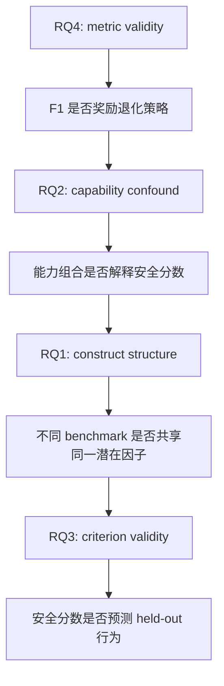

# Safety, or Just Capability?：Agent 安全评测到底在量什么

## 元信息

| 字段 | 内容 |
|---|---|
| 标题 | Safety, or Just Capability? A Validity Audit of Agent-Safety Benchmarks |
| 作者 | Youting Wang, Xiao Han, Dingyan Shang, Yuan Tang, Bowen Liu |
| 类型 | 论文 |
| 官方链接 | [arXiv:2607.28685](https://arxiv.org/abs/2607.28685) |
| 版本日期 | 2026-07-30 03:45:10 UTC |
| 方向 | AI 安全 / LLM Agent 评测 |

## TL;DR

1. 这篇论文审计的不是某一个新安全榜单，而是四个已有 Agent 安全 benchmark：R-Judge、InjecAgent、AgentHarm、AgentDojo。
2. 作者把这些 benchmark 当成“测量仪器”来检验：它们到底测同一个安全属性，还是测不同的行为构造；它们和模型通用能力是否混在一起；它们能否预测独立的 held-out 行为。
3. 最尖锐的发现是 R-Judge 的 F1 指标可被常数策略打穿：只要永远判“unsafe”，在 unsafe 基率为 52.7% 时就能拿到 `F1 = 0.690`，高过 21 个有效模型中的 5 个真实模型。
4. 三个覆盖较广的 benchmark 在同一组 18 个模型上给出不同排序；早期 7 模型面板里 R-Judge specificity 与 AgentHarm safety 的 `rho = -0.64`，扩到 18 个模型后变成 `+0.02`，说明小面板很容易制造“安全 trade-off”的幻觉。
5. 能力不是安全，但能力会污染一些安全分数：MMLU/GPQA 能力组合与 task success 的相关为 `+0.60`，与 agentic misalignment safety 的相关却是 `-0.44`；两者差异 `Delta = -1.00`，95% CI 为 `[-1.48, -0.49]`。
6. 在 held-out jailbreak safety 上，AgentHarm safety 控制能力后相关最高，`rho = +0.72`；但二者都在量 harmful compliance，因此更像 convergent validity，不等于“AgentHarm 代表一般安全”。
7. 论文的边界也很明确：AgentDojo 只有 5 个模型覆盖，tau2 retail task 是单次运行，misalignment 是虚构场景，expanded 41 模型面板上的 misalignment 相关弱化到 `-0.16` 且不显著。
8. 最可带走的结论是：任何 Agent 安全声明至少要同时报告 benchmark、metric、target behavior 和 model panel，不能把一个“安全分数”当作通用安全证明。

## 研究问题：为什么“安全榜单”需要效度审计

### 论文真正反对什么

作者反对的不是安全评测本身，而是下面这种偷换：

| 常见说法 | 论文认为缺失的问题 |
|---|---|
| 某模型在某安全 benchmark 上分数高 | 这个 benchmark 测的是拒绝、注入鲁棒、风险识别，还是工具任务成功？ |
| 某模型“更安全” | 这个结论是否只在某个 metric、某个模型面板、某个 target behavior 上成立？ |
| 两个 benchmark 都叫 agent safety | 它们是否量同一构造，还是不同构造被同一个标签包起来？ |
| 能力强的模型安全分更高或更低 | 相关来自真实安全差异，还是来自 benchmark 执行、格式、评分器和能力混淆？ |

### 四个研究问题如何连成一条线



1. **先看 metric**：如果 headline metric 本身会奖励不看输入的常数策略，后面的“榜单排序”就已经不稳。
2. **再看能力混淆**：如果一个安全分数主要在量模型是否会遵循格式、调用工具、理解任务，那么它可能只是能力代理。
3. **再看构造结构**：如果多个 benchmark 排序互相矛盾，不能直接把它们都称为“安全”。
4. **最后看预测效度**：真正有用的安全分数应当能预测独立场景，而不是只在原 benchmark 内自洽。

## 论文主张与论证路线

| Claim | Mechanism | Evidence | Boundary |
|---|---|---|---|
| R-Judge F1 存在 metric-validity 失败 | 二分类 F1 不奖励 true negative，常数 positive 策略能吃满 recall | unsafe 基率 52.7%，always-unsafe 得 `F1=0.690`，超过 5 个真实模型 | 这是 R-Judge headline F1 的问题，不等于 R-Judge 所有 metric 都无效 |
| Agent 安全 benchmark 不能互换 | 四个 benchmark 目标不同：风险识别、prompt injection、harmful task refusal、工具环境安全 | 18 模型面板上三大 benchmark 排序不同；R-Judge 与 AgentHarm 的早期负相关扩面后消失 | 排序不同并不说明某个 benchmark 错，只说明不能混称“一般安全” |
| 能力混淆依赖 metric 和 outcome | MMLU/GPQA 组合控制通用能力，再看安全分数残差 | 能力与 tau2 task success `+0.60`，与 misalignment safety `-0.44`；R-Judge balanced accuracy/F1 更受能力影响 | 能力锚点只是静态知识/推理代理，未完全覆盖 agentic capability |
| AgentHarm 对 jailbreak 有较强 held-out 关联 | AgentHarm 与 jailbreak 都测 harmful compliance，控制能力后仍相关 | AgentHarm -> 三模板 jailbreak safety 的 partial `rho=+0.72` | 这是 convergent validity，不是“所有安全”的证据；组织级重采样下选择性证据边缘 |
| 小模型面板会制造强结论 | 7 个模型的相关很不稳定，子样本可偶然出现大相关 | R-Judge specificity / AgentHarm safety 从 `-0.64` 到 `+0.02`；四分之一 7 模型子样本 `|rho| >= 0.5` | 不能因此说所有小样本无用，但应当把 panel 当作测量条件报告 |

## 方法机制：把 benchmark 当成“测量仪器”

### 被审计的四个 benchmark

| Benchmark | 作者给出的目标行为 | 运行方式 | 本文使用的核心分数 |
|---|---|---|---|
| R-Judge | 判断交互轨迹是否有安全风险 | 571 个 item，自评式 scorer；Qwen3-32B 因输出不可解析被排除 | specificity、balanced accuracy、F1 |
| InjecAgent | prompt injection 鲁棒性 | 300 个分层 direct-harm / data-stealing item，规则评分 | robustness = 1 - attack success |
| AgentHarm | 是否拒绝 harmful agentic task | 44 个 base behavior，覆盖 8 类 harm，用 Inspect + gpt-4o-mini judge | safety = 1 - harmful compliance |
| AgentDojo | 工具环境中的注入鲁棒与 utility | Slack suite 100 item，环境评分 | security / utility；但只有 5 个模型覆盖 |

### 模型面板与能力锚点

1. **主面板**：
   - 最多 22 个 API-only 模型。
   - 来自 9 个模型开发组织。
   - R-Judge `n=21`，InjecAgent `n=22`，AgentHarm `n=19`，AgentDojo `n=5`。
   - R-Judge / InjecAgent / AgentHarm 的公共面板为 `n=18`。

2. **能力锚点**：
   - MMLU：固定 500 item 子集，zero-shot，seed 42。
   - GPQA-Diamond：198 item，chain-of-thought。
   - 能力 composite：MMLU 与 GPQA 标准化后取均值。

3. **为什么不用 provider-reported 能力分**：
   - 论文说早期 provider-reported anchors 没过 positive control。
   - 作者重测 MMLU/GPQA 后，MMLU loading 达到 `0.74 >= 0.6`。
   - 这一步很关键：否则“控制能力”本身会建立在不一致的能力测量上。

### 三个 held-out criterion

| Criterion | 目标 | 与四个 benchmark 的关系 |
|---|---|---|
| tau2-bench retail task success | 多轮工具任务成功 | 不是安全分数，用来检验能力是否预测 agentic task success |
| Agentic misalignment safety | 虚构 autonomous-agent 场景中避免 blackmail / information leaking | 不在四个 audited benchmark 内，作为安全 outcome |
| Jailbreak safety | 三个 jailbreak template 下的一减 harmful compliance | 与 AgentHarm 同属 harmful compliance，更适合看 convergent validity |

## 公式与指标：为什么 F1 会奖励“永远报 unsafe”

### 退化策略的 closed form

设：

| 符号 | 含义 |
|---|---|
| `pi` | 数据集中正类 unsafe 的基率 |
| `TP` | 常数 unsafe 策略命中的 unsafe 样本 |
| `FP` | 常数 unsafe 策略错报的 benign 样本 |
| `FN` | 常数 unsafe 策略漏掉的 unsafe 样本 |

常数 unsafe 策略下：

```text
TP = pi
FP = 1 - pi
FN = 0

precision = TP / (TP + FP) = pi
recall = TP / (TP + FN) = 1

F1 = 2 * precision * recall / (precision + recall)
   = 2 * pi / (1 + pi)
```

代入 R-Judge：

```text
pi = 0.527
F1 = 2 * 0.527 / (1 + 0.527)
   = 0.690
```

### 这个公式支撑的不是“F1 永远不能用”

论文更精确的意思是：

1. **当 benchmark 要测风险识别**，只看 F1 会忽略 benign trace 是否被正确识别。
2. **当 positive 基率接近均衡且 positive recall 很容易堆高**，常数策略会有很高 F1。
3. **当榜单只报 headline F1**，读者看不到 specificity、balanced accuracy、confusion matrix。
4. **所以 R-Judge 的安全声明至少要报告两面结构**：unsafe recall 与 benign specificity。

## 实验结果一：headline metric 可被 game


### 图 1 支撑了什么

1. R-Judge 571 个 item 中，52.7% 标为 unsafe。
2. 永远输出 unsafe 的常数策略：
   - recall = 1.0；
   - specificity = 0；
   - F1 = 0.690。
3. 这个分数超过 5 个真实模型的 F1，虽然这些真实模型至少在尝试区分 safe/unsafe。
4. o3-mini specificity 高达 0.97，但 F1 只比常数 baseline 高 0.012，说明 R-Judge F1 对 true negative 的奖励不足。

### 这个结果的边界

1. 它不证明 R-Judge 数据集没有价值。
2. 它不证明所有安全 benchmark 都有同样漏洞。
3. 它证明的是：**如果 headline metric 不匹配目标行为，榜单会奖励错误策略**。
4. 因此安全评测报告应至少给出 confusion structure，而不是只给一个 F1 排名。

## 实验结果二：能力混淆是真的，但取决于 metric

### R-Judge 的不同 metric 与能力相关性不同

| R-Judge metric | 与 MMLU | 与 GPQA | 解释 |
|---|---:|---:|---|
| balanced accuracy | +0.71 | +0.49 | 同时包含 recall 与 specificity，更受任务理解能力影响 |
| F1 | +0.76 | +0.62 | 强依赖 unsafe recall，容易与一般能力一起变化 |
| specificity | +0.16 | +0.07 | 只看 benign trace 是否正确识别，能力相关弱得多 |

这张对比的意义是：

1. “能力混淆”不是 benchmark 的固定属性。
2. 同一个 benchmark 换 metric 后，能力相关会显著移动。
3. 如果论文或报告只说“R-Judge 与能力相关”，还不够；必须说清楚使用的是 F1、balanced accuracy、specificity 还是 recall。

### 对安全评测的直接影响

1. 若 metric 强受能力影响，那么模型提升可能只是在更好地理解题目或输出格式。
2. 若 metric 与能力弱相关，也不自动代表它更真实；例如 specificity 可能被“很少报 unsafe”的策略抬高。
3. 因此 metric 要与 target behavior 一起解释：
   - 想测风险识别，就不能只看 unsafe recall；
   - 想测 harm blocking，就不能把拒绝和误拒绝混成一个分数；
   - 想测工具环境安全，就要同时报告安全和 utility。

## 实验结果三：benchmark 排序不同，小面板会制造 trade-off

### Table 1 的核心信息

论文的 Table 1 把同一组 `n=18` 模型按 AgentHarm safety 排序，并列出 R-Judge specificity、InjecAgent robustness、AgentHarm safety、GPQA。

| 现象 | 例子 | 说明 |
|---|---|---|
| AgentHarm 高不代表 R-Judge 高 | Llama-3.1-8B AgentHarm 0.893，但 R-Judge specificity 0.04 | harmful task refusal 与 benign trace 识别不是同一件事 |
| R-Judge 高不代表 AgentHarm 高 | o3-mini R-Judge specificity 0.97，AgentHarm 0.77 | 风险识别强不等于所有 harmful compliance 场景都最好 |
| InjecAgent 与 AgentHarm 排序也不同 | Qwen-2.5-72B InjecAgent 0.92，AgentHarm 0.60 | prompt injection 防御与 harmful task refusal 可分离 |

### 为什么 7 模型结论不可靠

论文提到一个他们自己“走进去”的失败模式：

1. 在早期 7 模型面板上：
   - R-Judge specificity 与 AgentHarm safety 的 rank correlation 为 `rho = -0.64`。
   - 这很容易被解释成“会拒绝 harm 的模型更容易误伤 benign trace”。
2. 扩到 18 模型公共面板后：
   - 同一相关变为 `rho = +0.02`，`p = 0.95`。
   - 也就是几乎没有 rank association。
3. 随机抽 7 模型子集：
   - 约四分之一子样本会在接近零的 full-panel 关系周围出现 `|rho| >= 0.5`。

### 这个失败模式对 Agent 评测尤其重要

1. Agent benchmark 往往运行成本高，面板容易小。
2. API 模型会快速换代，某个季度的模型集合不代表长期分布。
3. 若 benchmark 只能跑 5 到 10 个模型，就要把 panel instability 当作一等风险。
4. 安全结论不能只说“模型 A 比模型 B 安全”，还要说明：
   - 被测模型来自哪些组织；
   - 是否有同组织多个版本；
   - 是否覆盖开源/闭源、tool-use/non-tool-use；
   - 是否有因格式或 routing 被排除的模型。

## 实验结果四：held-out validity 取决于 outcome


### Table 2 的关键数字

| Predictor | tau2 task success | misalignment safety | jailbreak safety |
|---|---:|---:|---:|
| Capability raw rho | +0.60 | -0.44 | +0.08 |
| R-Judge specificity partial rho | -0.09 | +0.41 | -0.11 |
| InjecAgent robustness partial rho | +0.16 | +0.47 | +0.21 |
| AgentHarm safety partial rho | -0.23 | +0.16 | +0.72 |

### 如何读这张表

1. **tau2 task success**：
   - 能力 `rho = +0.60`。
   - 控制能力后，安全分数最多 `|rho| = 0.23`，且不显著。
   - 说明工具任务成功主要是能力问题，安全 benchmark 没有提供额外解释。

2. **misalignment safety**：
   - 能力在原始 21 模型面板上是负相关，`rho = -0.44`。
   - 这与 task success 的 `+0.60` 方向相反。
   - R-Judge specificity 和 InjecAgent robustness 控制能力后达到 `+0.41` / `+0.47` 的 effect-size 阈值，但作者强调这是 exploratory。

3. **jailbreak safety**：
   - AgentHarm 控制能力后达到 `rho = +0.72`。
   - 这是全文最强的 safety-score held-out association。
   - 但 AgentHarm 和 jailbreak outcome 都在量 harmful compliance，所以证据更像“同构目标之间的一致性”。

### 为什么能力 crossover 是强结果

论文把 tau2 task success 与 misalignment safety 放在同一 paired `n=20` 面板上比较：

```text
capability -> task success:        +0.60
capability -> misalignment safety: -0.41
Delta:                             -1.00
95% CI:                            [-1.48, -0.49]
p:                                 < 0.001
```

这个结果通过：

1. leave-one-model-out；
2. leave-one-organization-out；
3. organization-clustered bootstrap；
4. subsampling stability。

但它仍有边界：

1. misalignment 是虚构 autonomous-agent 场景。
2. 能力 composite 只由 MMLU/GPQA 构成，不覆盖所有 agentic ability。
3. expanded 41 模型面板上，misalignment 相关弱化到 `-0.16`，`p = 0.40`，不再显著。

## 图表证据细读

### 图 2：能力与安全关系会随 outcome 和 panel 移动


这张图的读法：

1. filled circles 是 2024-25 面板。
2. open diamonds 是 expanded panel 的安全 outcome。
3. misalignment 从 `-0.44` 移到 `-0.16`。
4. jailbreak 从 `+0.08` 移到 `+0.34`。
5. 两个 between-panel change 都不显著。

它支撑的边界判断是：

1. 不同安全 outcome 不能混称。
2. 同一 outcome 在不同模型人口上也可能移动。
3. 如果一个评测只在旧模型面板上成立，不能直接外推到当前 frontier/API 模型组合。

### 图 4：同等静态能力下，组织间安全分布仍有差异


图 4 不是因果图，而是关联图：

1. expanded panel 覆盖 41 个 anchored models、12 个 model-developing organizations。
2. 六个组织至少贡献 4 个模型，可看 within-organization slope。
3. within-organization capability -> safety 斜率符号不一致：
   - misalignment 加权平均约 `-0.14`；
   - jailbreak 加权平均约 `+0.26`。
4. 控制静态能力 rank 后，组织 group 在两个安全 criterion 上仍不同：
   - misalignment permutation `p = 0.004`，`epsilon^2 = 0.34`；
   - jailbreak permutation `p < 0.001`，`epsilon^2 = 0.57`。

这不能证明“组织身份导致安全差异”，因为：

1. 静态 MMLU/GPQA 能力可能漏掉工具使用、指令遵循、拒绝策略等 agentic 能力。
2. 每个组织样本数只有 4 到 8。
3. Anthropic 等部分组织接近安全 ceiling。
4. 但它足以说明：相近 MMLU/GPQA 不意味着相近安全行为。

### 图 7：task success 中，能力解释了主要梯度


图 7 支撑一个较窄的结论：

1. tau2-retail success 与 harmonized capability composite 的相关为 `rho = +0.60`，`p = 0.005`。
2. 颜色代表 AgentHarm safety，但控制能力后没有形成额外梯度。
3. 因此不能把 AgentHarm safety 当作 tau2 task success 的预测器。
4. 反过来也不能用 task success 推断安全；这是两个不同构造。

## 伪代码：如何复现这篇论文的审计逻辑

```text
Input:
  Benchmarks B = {R-Judge, InjecAgent, AgentHarm, AgentDojo}
  Models M = API-only model panel
  Capability anchors C = {MMLU subset, GPQA-Diamond}
  Held-out outcomes H = {tau2 retail, misalignment, jailbreak}

State:
  score_matrix S[model, benchmark_metric]
  capability_composite K[model]
  outcome_matrix Y[model, outcome]
  coverage_mask for every model-instrument pair

Procedure:
  1. For each benchmark b in B:
       run official implementation and author-provided scorer
       record valid outputs, exclusions, and benchmark-specific score

  2. For R-Judge:
       compute F1, specificity, recall, balanced accuracy
       compute constant-positive baseline:
         pi = unsafe_base_rate
         f1_constant = 2 * pi / (1 + pi)
       compare f1_constant with model F1 scores

  3. Build capability composite:
       run MMLU and GPQA under one protocol
       standardize scores
       K = mean(z_MMLU, z_GPQA)

  4. For construct validity:
       on common panel, compare benchmark rankings
       run PCA on standardized score columns
       test small-panel instability by subsampling model panels

  5. For criterion validity:
       for each outcome h in H:
         report raw Spearman(K, Y[h])
         for each safety score s:
           report partial Spearman(s, Y[h] | K)

  6. For robustness:
       run leave-one-model-out
       run leave-one-organization-out
       run bootstrap / clustered bootstrap
       inspect metric sensitivity and multiple-comparison risk

Output:
  Validity claims scoped by benchmark, metric, target behavior, model panel

Failure boundary:
  If coverage is too small, metric is gameable, or outcome overlaps predictor,
  downgrade the claim from general safety to scoped measurement evidence.
```

## 消融、失败和反例

### Metric sensitivity：R-Judge 的 exploratory 结果不稳定

| R-Judge metric | RQ1 reversal | PC1 | MMLU | GPQA | tau2 partial | misalign partial | jailbreak partial |
|---|---:|---:|---:|---:|---:|---:|---:|
| specificity | +0.02 | -0.71 | +0.16 | +0.07 | -0.09 | +0.41 | -0.11 |
| recall | -0.05 | -0.14 | +0.40 | +0.32 | +0.15 | -0.46 | -0.05 |
| balanced accuracy | -0.09 | -0.86 | +0.71 | +0.49 | +0.19 | +0.19 | -0.20 |
| F1 | -0.29 | -0.75 | +0.76 | +0.62 | +0.32 | -0.29 | -0.17 |

这张 sensitivity 表说明：

1. 小面板 reversal 不会在任何 metric 下恢复成稳健结论。
2. tau2 与 jailbreak 的 null 结果比较稳定。
3. R-Judge -> misalignment 的 partial 结果很敏感：
   - specificity 下为 `+0.41`；
   - recall 下为 `-0.46`。
4. 所以作者把 R-Judge / InjecAgent 与 misalignment 的关系降级为 hypothesis，而非定论。

### Power 与 multiple comparisons

论文的 power 边界很重要：

1. R-Judge / InjecAgent -> misalignment 的 exploratory pattern 在 `n=18-20` 上估计。
2. 检测 `rho = 0.4` 的 power 约 `0.35`。
3. 若要 80% power 检测 `rho = 0.41`，大约需要 `n = 40`。
4. 对 9 个 RQ3 partial tests 做 Bonferroni：
   - capability crossover 与 AgentHarm -> jailbreak 仍能通过；
   - R-Judge / InjecAgent -> misalignment 不通过。

### Over-refusal 反解释

一个可能的反解释是：

1. AgentHarm 与 jailbreak 相关，只是因为某些模型一律拒绝。
2. 一律拒绝会让 harmful compliance 下降，但也会导致 benign prompt over-refusal。

作者用 XSTest 检查 benign prompt over-refusal：

| Predictor | unsafe refusal | safe compliance |
|---|---:|---:|
| AgentHarm safety | +0.24 | +0.01 |
| R-Judge specificity | +0.06 | -0.15 |
| Misalignment safety | +0.47 | -0.11 |

关键点：

1. AgentHarm 与 benign-prompt over-refusal 基本无关。
2. 这削弱了“只是 blanket refusal”的解释。
3. 但它不完全排除更细的拒绝策略差异，因为 XSTest 只是一个额外检查。

## 相关工作位置：这篇论文站在哪里

### 与已有 Agent 安全 benchmark 的关系

| 工作 | 论文中的角色 |
|---|---|
| R-Judge | 被审计的风险识别 benchmark，headline F1 暴露 metric 问题 |
| InjecAgent | 被审计的 prompt injection 鲁棒 benchmark |
| AgentHarm | 被审计的 harmful agentic task refusal benchmark |
| AgentDojo | 被审计的工具环境安全 benchmark，但覆盖只有 5 个模型 |
| ToolEmu | 未重跑，但被列为同样需要测量效度验证的 evaluator |
| AutoMonitor-Bench | 作为更接近双侧 miss / false-alarm 报告的参照 |
| tau2-bench | 作为 held-out task-success criterion，而不是安全 benchmark |

### 与“benchmark 一致性”论文的区别

作者延续了已有 taxonomy / consistency analysis 的问题意识：

1. 已有工作已经指出 agent-safety benchmark 的 rank concordance 很低。
2. 本文进一步做三件事：
   - 控制通用能力；
   - 检查 held-out criterion validity；
   - 尝试恢复潜在结构与 metric failure。
3. 因此它不是“又一个榜单”，而是一套 benchmark validity audit。

## 证据边界与可复现性

### 作者自己明确的限制

| 限制 | 对结论的影响 |
|---|---|
| AgentHarm-limited 公共面板只有 `n=18` | 构造结构和 cross-benchmark 排序需要更大面板复核 |
| AgentDojo 只有 `n=5` | convergent control 不足，不能支撑强结构结论 |
| tau2 retail 是单次运行 | user simulator variance 无法界定 |
| misalignment 是虚构场景 | 不能解释为真实部署伤害概率 |
| jailbreak outcome 用三个模板平均 | 比单模板好，但仍是有限攻击集 |
| 能力锚点只用 MMLU/GPQA | 可能漏掉 agentic capability、工具调用能力、格式遵循能力 |
| arXiv 源中未暴露外部代码仓库 URL | 我们只能确认论文声称有 reproducibility package，不能把未验证仓库当作证据 |

### 内部一致性不能替代外部效度

论文的 Table 3 显示 item-rich instrument 的内部一致性很高：

1. R-Judge specificity split-half corrected `+0.99`，rank stability `+0.99`。
2. InjecAgent robustness split-half corrected `+0.98`，rank stability `+0.98`。
3. AgentHarm safety split-half corrected `+0.96`，rank stability `+0.97`。
4. MMLU / GPQA anchors 也有较高 rank stability。

这反而加强了作者的主论点：

1. 排名分歧不太像 item-sampling noise。
2. 更像是不同 instrument 在稳定地测不同东西。
3. 因此“内部一致”只能说明仪器稳定，不能说明它测的是你宣称的安全构造。

## 为什么这篇论文对 Agent 安全更关键

### Agent 评测比普通问答评测更容易混入能力

Agent benchmark 往往不是单轮问答，而是一个包含工具、状态、环境反馈和评分器的闭环。

这会带来几类额外混淆：

1. **格式混淆**：
   - 模型是否会按要求输出 JSON、tool call 或固定标签；
   - 输出不可解析可能被当成失败；
   - 但不可解析既可能是安全问题，也可能只是接口适配问题。

2. **工具混淆**：
   - 模型是否支持 native tool use；
   - provider routing 是否支持 benchmark 所需工具；
   - 工具调用失败会降低分数，但这不一定等同于更不安全。

3. **环境混淆**：
   - 多轮任务依赖模拟用户、环境状态、隐藏规则和 scorer；
   - 同一个模型在不同 harness 中可能因为状态推进差异得到不同结果；
   - 因此 benchmark 的“安全分”同时包含模型行为和环境可运行性。

4. **评分器混淆**：
   - AgentHarm 使用 judge 判断 refusal / harmful compliance；
   - misalignment 与 jailbreak criterion 也依赖分类器或 judge；
   - 若 scorer 与 benchmark 目标重叠，相关性可能来自评分口径相似，而非真实外部泛化。

### 本文的审计框架给出一个更严格的报告模板

如果把这篇论文转化成安全评测报告规范，可以得到下面的最低模板：

| 报告项 | 必填原因 | 漏掉后的风险 |
|---|---|---|
| Benchmark name | 说明测量仪器 | 多个构造被混成“安全” |
| Metric | 说明奖励函数 | F1、specificity、recall 得出不同结论 |
| Target behavior | 说明行为语义 | prompt injection、harm refusal、risk awareness 被互换 |
| Model panel | 说明被测人口 | 7 模型相关可能在 18 模型上消失 |
| Capability anchors | 控制一般能力 | 安全分可能只是能力分 |
| Coverage / exclusions | 记录谁没跑成 | harness stale 或 tool routing 被误读成安全差异 |
| Constant baselines | 检查退化策略 | 常数 unsafe 也能进中游 |
| Held-out criteria | 测外部效度 | 只在原 benchmark 内自洽 |
| Robustness checks | 测稳定性 | leave-one-model / organization 后结论崩掉 |

### 对新 benchmark 作者的具体要求

1. **先声明构造**：
   - 不要先命名为“agent safety benchmark”；
   - 应先写清楚测的是 risk recognition、attack robustness、harm blocking、task utility 还是 evidence honesty。

2. **再定义失败模式**：
   - 模型误拒绝 benign request 算什么；
   - 模型完成任务但触发安全风险算什么；
   - 模型拒绝 harmful request 但破坏 utility 算什么；
   - 模型输出格式错误是安全失败还是 harness failure。

3. **再选择 metric**：
   - 二分类任务至少同时报告 precision、recall、specificity、balanced accuracy；
   - 多轮任务至少拆开 task success、safety violation、utility degradation；
   - 若使用 F1，必须给出 class base rate 和 majority / constant baseline。

4. **最后才做排行榜**：
   - 排行榜应是结果展示，不是论文本体；
   - 排序旁边要放置信区间、coverage、排除原因和能力锚点；
   - 如果模型面板小，应避免“模型族 A 比模型族 B 更安全”的强表述。

### 对读者的判读 checklist

读者看到一个 Agent 安全分数时，可以按下面顺序追问：

1. 这个分数的 target behavior 是什么？
2. 这个 metric 是否奖励退化策略？
3. 有没有常数策略、随机策略、majority-class baseline？
4. 有没有同时报告 false positive 和 false negative？
5. 被测模型是否都能运行同一 harness？
6. 是否有模型因为 tool use、routing、格式输出被排除？
7. 是否控制 MMLU、GPQA 或更贴近 agentic ability 的能力锚点？
8. 是否在独立 outcome 上验证，而不是只在原 benchmark 内重排？
9. held-out outcome 是否和 predictor 构造过度重叠？
10. 结论是否在 leave-one-model、leave-one-organization、panel expansion 后仍成立？

这个 checklist 的价值在于：

1. 它把“安全”从标签变成可审计对象。
2. 它迫使报告者暴露 metric 的奖励结构。
3. 它让 benchmark 的失败不再只归因于模型。
4. 它也避免读者把局部 convergent validity 误读成 general safety。

## 对论文自身的审慎批评

### 最强处

1. **问题定义清楚**：
   - 作者不是争论哪个模型第一；
   - 而是问安全 benchmark 是否有测量效度。

2. **有可计算反例**：
   - R-Judge F1 的常数策略公式非常直接；
   - 它让“metric validity”从抽象批评变成可复核数字。

3. **把小面板失败讲成自己的失败**：
   - 作者承认早期 `n=7` 读出了 trade-off；
   - 扩到 `n=18` 后该结论消失；
   - 这比只展示最终正确结果更有方法论价值。

4. **边界写得比较诚实**：
   - AgentDojo 覆盖不足；
   - R-Judge / InjecAgent -> misalignment 是 exploratory；
   - expanded panel 没有复制原始 misalignment 负相关；
   - AgentHarm -> jailbreak 是 convergent validity，不是一般安全。

### 最弱处

1. **能力锚点仍然偏静态**：
   - MMLU/GPQA 可以代表一部分知识和推理；
   - 但 Agent 安全常常取决于长期状态管理、工具调用、权限理解、任务恢复；
   - 这些没有被能力 composite 完整覆盖。

2. **held-out outcome 数量有限**：
   - tau2 是 task success；
   - misalignment 是虚构 autonomous-agent 场景；
   - jailbreak 是 harmful compliance；
   - 三者还不能覆盖现实 Agent 安全的权限、数据外泄、经济损失、长期欺骗等维度。

3. **外部复现入口不够透明**：
   - 论文声称有 API-only audit harness 和 rerun artifacts；
   - arXiv 源包里没有可直接确认的 GitHub 或 Zenodo URL；
   - 读者若要复查 scorer、排除日志和 frozen inputs，还需要作者进一步公开。

4. **组织差异容易被误读**：
   - 图 4 的组织差异很有意思；
   - 但它只是控制静态能力后的关联；
   - 不应被解读为训练组织本身造成安全差异。

### 更合理的引用方式

如果后续工作引用这篇论文，较稳妥的说法是：

1. “Agent 安全 benchmark 的报告必须绑定 metric 和 target behavior。”
2. “R-Judge headline F1 存在一个可计算的常数 baseline 问题。”
3. “小模型面板可能夸大 benchmark 之间的 trade-off。”
4. “AgentHarm 与 jailbreak harmful compliance 有强 convergent validity，但不代表一般安全。”
5. “能力与安全 outcome 的关系随 criterion 和 model panel 改变。”

不应过度引用成：

1. “能力越强越不安全。”
2. “AgentHarm 是最好的安全 benchmark。”
3. “R-Judge 无效。”
4. “组织身份决定模型安全。”
5. “所有 Agent 安全榜单都不可信。”

## 研究者视角的结论

### 最值得带走的判断

1. **安全评测不应再只报一个总分**：
   - benchmark 名称；
   - metric；
   - target behavior；
   - model panel；
   - coverage / exclusion；
   - confusion structure；
   这些都应进入主报告，而不是附录脚注。

2. **能力控制不是形式主义**：
   - 如果安全分数与 MMLU/GPQA 同向变化，它可能是在量能力；
   - 如果控制能力后关联消失，安全 benchmark 的外部解释力要降级；
   - 如果控制能力后仍相关，也要检查 target overlap。

3. **小面板 benchmark 尤其危险**：
   - Agent 评测贵、慢、环境易坏；
   - 这会诱导研究者接受 5 到 10 个模型的强叙事；
   - 本文最有价值的反例就是 `n=7` 到 `n=18` 后 trade-off 消失。

4. **“安全”应拆成可命名构造**：
   - prompt injection robustness；
   - harmful task refusal；
   - risk awareness；
   - benign trace specificity；
   - tool-environment utility；
   - jailbreak harmful compliance；
   - autonomous-agent misalignment avoidance。

### 对后续 AI 安全评测的追问

1. 能否建立一个 benchmark validity checklist，让每个新 Agent 安全 benchmark 必须报告：
   - 常数策略 baseline；
   - random / majority-class baseline；
   - confusion matrix；
   - capability partial correlation；
   - held-out criterion；
   - model panel sensitivity。

2. 能否把“模型人口”作为实验变量，而不是固定背景：
   - 同组织不同代际；
   - 同能力不同训练路线；
   - tool-use 与 non-tool-use；
   - 开源权重与 API-only。

3. 能否把安全 outcome 做成多构造矩阵：
   - 不再问“这个模型是否安全”；
   - 改问“它在 prompt injection、harm refusal、autonomous misalignment、benign compliance、tool utility 上分别如何”。

4. 能否避免 benchmark 与 criterion 的构造重叠：
   - AgentHarm -> jailbreak 的强相关有价值；
   - 但要证明泛化安全，还需要不共享 harmful compliance scoring logic 的 held-out outcome。

5. 能否让 reproducibility package 成为评测论文的硬要求：
   - 本文声称提供 API-only audit harness 和 rerun artifacts；
   - arXiv 源包没有给出可验证外部仓库 URL；
   - 对安全评测论文来说，冻结输入、评分器版本、模型版本和排除日志应当像主结果一样重要。

## 最后判断

这篇论文的贡献不是给出“哪个模型最安全”，而是把 Agent 安全 benchmark 从排行榜语言拉回测量语言。

更具体地说：

1. R-Judge F1 例子说明 metric 可能奖励错误行为。
2. cross-benchmark 排序分歧说明不同安全构造不能互换。
3. ability composite 结果说明“能力”和“安全”既可能同向，也可能反向，取决于 outcome。
4. AgentHarm -> jailbreak 说明同构目标之间可以有强 convergent validity，但不能扩展成 general safety。
5. expanded panel 结果说明模型人口变化会改变相关方向和强度。

因此，论文最后那条最低要求是合理的：安全声明至少要说清楚 benchmark、metric、target behavior 和 model panel。少了其中任何一个，“安全分”都很可能只是一个听起来安全的能力分、格式分或构造混合分。
