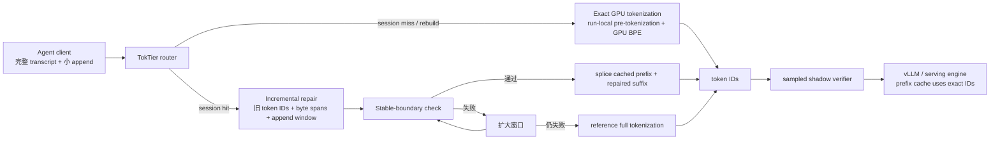

# TokTier：Agent 服务的瓶颈不只在 KV cache，也在“可验证的有状态分词”

## 元信息

| 字段 | 内容 |
|---|---|
| 论文 | TokTier: Exact Stateful Tokenization for Agentic LLM Serving |
| 作者 | Zhenyu Zhang, Zhichao Cao |
| 机构 | Arizona State University |
| 官方链接 | https://arxiv.org/abs/2607.29678 |
| 官方日期 | arXiv abs 页为 2026-07-31 v1；arXiv cs.CL recent 页把该条放在 Mon, 3 Aug 2026 分组 |
| 类型 | 大模型 Agent / LLM serving / tokenization system |
| 本文视角 | 把论文当成 Agent 基础设施论文读：它不是提出一个新 Agent，而是在解释为什么现有 Agent serving 栈即使有 prefix/KV cache，也可能被前端分词拖慢 |

### TL;DR

1. **这篇论文研究什么**：TokTier 关注 coding agent 和 tool-use agent 的反复调用模式。Agent 每次只追加少量工具结果，却会把完整 transcript 再提交给模型服务；模型侧 KV cache 可以跳过大部分 prefill，但前端 tokenizer 仍常常重扫完整文本。
2. **作者怎么做**：TokTier 把 tokenizer 做成有状态服务。常见的 session continuation 走“增量修复”：只重分词 append 附近窗口，并用 stable-boundary check 证明 splice 后 token ID 与完整 reference tokenization 完全一致；少数无可复用前缀的请求走精确 GPU tokenization。
3. **核心正确性契约**：系统唯一硬约束是 emitted token IDs 必须等于对完整请求文本运行冻结 reference tokenizer 的结果。失败时只允许扩大窗口或退回完整分词，不能输出近似 token。
4. **关键证据**：作者分析 153,951 次来自 Claude Code 与 Codex CLI 日常使用的调用，发现中位 append 约 1.4K 字符，完整上下文可达 86K 到 123K tokens，fleet prompt-cache hit rate 为 94.1%。
5. **关键数字**：在 17 个 tokenizer family 上，差分验证覆盖约 `1.5e10` 次 split checks、12.4 TB 真实文本、93,000+ agent replay steps，报告 zero divergence；增量修复在 100K 到 3M 字符上下文下为 0.5 到 1.1 ms。
6. **端到端收益**：接入 vLLM 后，加载场景 median TTFT 降 16% 到 34%，记录 burst 下 P99 降 23%；在 50 ms P99 目标下，4 个 repair cores 加 1 块 GPU 可支撑 1,821 requests/s，而 16-core stateless front end 在 40 requests/s 饱和。
7. **主要局限**：这不是完整 tokenizer 栈的形式化验证；两类 tokenizer family 当前不能走 repair fast path；WordPiece、added tokens、NFC normalizer 等仍落 CPU/fallback；真实收益依赖 Agent workload 是否确实是“小 append + 大上下文 + 高 prefix cache hit”。
8. **为什么重要**：Agent serving 的状态不只包括 KV cache、conversation id 和工具状态，也包括 tokenizer 的 token IDs 与 byte spans。若这一层仍是无状态的，KV cache 命中率越高，tokenization 在 TTFT 中的相对占比反而越显眼。

### 本文结论先行

| 维度 | 传统前端 | TokTier 的主张 | 证据边界 |
|---|---|---|---|
| 请求形态 | 每次把完整文本送进 tokenizer | 区分 continuation 与 rebuild 两类路径 | 建立在作者采集的 coding-agent traces 与外部 TraceLab / public trace 对齐上 |
| 性能问题 | KV cache 跳过模型 prefill，但 tokenizer 仍扫完整上下文 | tokenization 也应复用 session state | 适合高 cache hit、长 transcript、频繁工具回合 |
| 正确性 | 可快但容易被边界变化破坏 | splice 前必须通过 stable-boundary certificate | 证明覆盖 family model，不等于完整实现形式化验证 |
| 工程策略 | CPU stateless 或局部 cache | repair path + GPU full path + shadow verifier | 依赖 tokenizer family、registry pinning、runtime sampling |
| 研究贡献 | 常把 tokenization 当前处理细节 | 把 tokenization 放回 serving critical path | 没证明所有 Agent 平台都同样受益 |

## 研究问题：为什么 prefix cache 高命中还会慢？

### 作者回应的实际矛盾是什么？

论文开头不是讨论“怎样让模型更聪明”，而是指出一个 serving 栈的错位：

1. **模型后端已经有状态**：
   - prefix cache / KV cache 可以复用长上下文中已处理的 token；
   - agent 第 `k+1` 次调用通常只比第 `k` 次多一个工具输出或命令结果；
   - 因此模型不必每次完整 prefill。
2. **前端 tokenizer 常常仍无状态**：
   - API 入口收到的是完整 request text；
   - tokenizer 在 prefix cache 判定前运行；
   - 即使模型只处理 suffix，tokenizer 仍可能把 `N + Δ` 全部扫描。
3. **Agent loop 放大了这个错位**：
   - 一个用户任务会展开为多次 model calls；
   - 每一轮 context 增长；
   - 如果每轮 tokenizer 都做 `O(N)` 工作，整段 session 会累积出近似 `O(N^2)` 的前端成本。

### 工作负载证据怎么支撑这个问题？

| 观察 | 论文给出的数值 | 对论证的作用 |
|---|---:|---|
| 总调用量 | 153,951 calls | 不是单一 demo，而是两个 Agent 生态的实际调用切片 |
| 数据来源 | 六名用户、九台机器、十个月 Claude Code 与 Codex CLI 使用 | 直接贴近 coding-agent workload |
| 中位 append | 约 1.4K 字符 | 说明绝大多数 continuation 只是“小增量” |
| 中位 context | Codex 约 86K tokens，Claude Code 约 123K tokens | 说明每次重扫完整文本非常不划算 |
| full-context call 占比 | 1.0% 到 3.6% | 说明 rebuild/init 稀少但不能忽略，因为它们上下文很大且会 burst |
| fleet prompt-cache hit | 94.1% | 说明模型侧复用已经很高，前端 tokenizer 成为可见瓶颈 |
| TraceLab 参考 | 357K steps、4,265 sessions | 用独立采集验证形状，而不是只信作者本地 logs |

### 为什么 tokenization 不能简单拼接？

直觉上可能想把上一轮 token IDs 留下来，再把新工具结果单独 tokenization 后拼上去：

```text
tok(A || B) ?= tok(A) || tok(B)
```

论文的关键提醒是：这个等式通常不成立。

1. **预分词边界会移动**：
   - GPT-family tokenizer 先做 regex pre-tokenization；
   - append `B` 可能改变 `A` 尾部附近的 piece 边界；
   - 边界移动后，BPE merge 结果也可能变。
2. **错误不一定显眼**：
   - token count 可能不变；
   - prefix cache key 可能悄悄改变；
   - model 行为可能因为单个 ID 差异而漂移。
3. **固定 overlap 不是完整解法**：
   - 某些 tokenizer 规则允许影响传播超过固定半径；
   - production 系统必须知道什么时候 splice 安全；
   - 无法证明安全时，必须 fallback。

## 论文主张与论证路线

### Claim -> mechanism -> evidence -> boundary

| 层级 | 内容 |
|---|---|
| Claim | Agentic LLM serving 需要有状态、精确、可验证的 tokenizer tier；否则 KV cache 越有效，tokenization 越可能成为 TTFT 的瓶颈 |
| Mechanism | 对 session continuation 做 incremental repair；对 session init/rebuild 做 exact GPU full tokenization；所有输出经过 reference-equivalence 契约和 shadow verifier |
| Evidence | 153,951 calls 的 workload 形状；17 tokenizer families 的 zero-divergence differential campaign；vLLM closed-loop 与 burst 实验的 TTFT/P99/capacity 改善 |
| Boundary | 结果依赖 workload 形状、tokenizer family、state retention、GPU path 的 exact BPE latency floor；论文不声称完整形式化验证整个 tokenizer stack |

### TokTier 的系统位置



这个图的重点不是“多了一个 cache”，而是多了一个可证明何时能复用的边界：

1. router 先判断请求是否能复用 session token state；
2. repair path 只在 append 附近重算；
3. stable-boundary check 决定能否 splice；
4. fallback 保证失败只增加延迟，不改变 token IDs；
5. shadow verifier 用线上采样补上实现层面的历史依赖 bug 风险。

## 方法机制：TokTier 如何把 tokenizer 做成状态服务？

### 路径一：incremental repair

TokTier 为 live session 保存两类状态：

| 状态 | 用途 | 为什么不是 KV cache 的替代品 |
|---|---|---|
| previous token IDs | 可复用的 reference token 序列 | 它是 tokenizer 输出，不是模型层 KV |
| byte spans | 每个 token / piece 对应的文本位置 | 用来判断新旧 token 记录能否在边界处安全拼接 |
| tokenizer artifact id | 绑定具体 tokenizer 版本 | 避免同名 tokenizer 或配置变化导致 silent drift |
| retention metadata | 决定 session state TTL | token state MB 级，KV state 常是 GB 级，两者生命周期可以不同 |

增量修复的目标可以写成：

```text
给定：
  A = 上一轮完整 transcript
  B = 本轮 append
  T_ref(X) = 冻结 reference tokenizer 对完整文本 X 的输出
  T_cached(A) = TokTier 保存的 token IDs 与 spans

要求：
  output == T_ref(A || B)

允许：
  若无法证明 splice 安全，则扩大窗口；
  若仍无法证明，则运行 T_ref(A || B)。

禁止：
  因性能原因输出 approximate token IDs。
```

### stable-boundary check 在证明什么？

论文把 splice 的充分条件压成一个 per-request certificate：

1. 在 append 附近取一个窗口；
2. 对窗口重新 pre-tokenize 与 BPE；
3. 找到新旧 token records 的匹配区域；
4. 检查匹配边界是否是 pre-tokenizer 无法跨越的 stable boundary；
5. 只有通过时，才把旧 prefix 与新 suffix 拼起来。

这背后的直觉是：

| 问题 | naive cache 的风险 | TokTier 的保护 |
|---|---|---|
| append 改变旧尾部 piece | `tok(A)` 的末尾 token 不能直接保留 | 重算 append 附近窗口 |
| 影响超过窗口 | 固定 overlap 会误判 | stable-boundary check 失败后扩大窗口 |
| tokenizer family 规则不同 | 一个 heuristic 不适配全部 tokenizer | family-specific predicate + differential validation |
| 实现 bug 只在线上历史中出现 | 离线测试可能全绿 | shadow verifier 抽样对比 reference |

### 路径二：exact GPU full tokenization

少数请求没有可复用 prefix：

1. session 刚开始；
2. history compaction 后重建；
3. 请求到了没有 session state 的 worker；
4. router 判断当前 family 不支持 repair fast path。

这类请求虽然占比只有 1.0% 到 3.6%，但常常携带完整大上下文并在 burst 中出现。TokTier 因此没有只做 incremental cache，而是给 full tokenization 做 GPU path。

核心拆解如下：

| 阶段 | 传统困难 | TokTier 的处理 |
|---|---|---|
| GPT-family regex pre-tokenization | 左到右扫描，后一段从前一段结束处开始 | 把输入分为 maximal character-class runs，piece start 由 run 内位置、邻近文本和 run-level summaries 决定 |
| BPE merge | merge 依赖 rank 和邻接 pair，天然有顺序性 | 按 piece length 分派：短 piece thread-per-piece，中等 piece warp-per-piece，长 piece block-per-piece |
| 多文档 batch | 文档边界不能互相污染 | concatenate inputs，但在 document boundaries 切断 runs |
| 不支持 family | 精确性比速度重要 | 退回 CPU/reference path |

这里最重要的是“exact GPU tokenization”，不是“近似 GPU tokenizer”。论文甚至报告一个能提高 CJK throughput 的 gated prototype 会在 Qwen / Llama pieces 上出现 divergence，因此没有采用。

## 算法流程：从 append 到 exact IDs

下面的伪代码是按论文机制重写，不是原文代码：

```text
Input:
  session_id
  request_text = A || B
  tokenizer_id
  previous_state = {tokens_A, spans_A, byte_len_A} or None

State:
  reference_tokenizer[tokenizer_id]
  supported_family_rules[tokenizer_id]
  window_size = initial_window(tokenizer_id, B)
  max_window_policy

Procedure TOKENIZE(request):
  if previous_state is None:
      return FULL_PATH(request_text, tokenizer_id)

  if tokenizer_id not in supported_family_rules:
      return FULL_PATH(request_text, tokenizer_id)

  while window_size <= max_window_policy:
      old_suffix = suffix(A, window_size)
      repair_text = old_suffix || B
      fresh_records = reference_or_fast_window_tokenize(repair_text, tokenizer_id)
      match = align(previous_state.spans_A, fresh_records)

      if STABLE_BOUNDARY(match, supported_family_rules[tokenizer_id]):
          output = splice(previous_state.tokens_A, fresh_records, match)
          schedule_shadow_verify(output, request_text, tokenizer_id)
          return output

      window_size = widen(window_size)

  output = FULL_PATH(request_text, tokenizer_id)
  schedule_shadow_verify(output, request_text, tokenizer_id)
  return output

Procedure FULL_PATH(text, tokenizer_id):
  if gpu_exact_path_supported(tokenizer_id, text):
      return gpu_pretokenize_and_bpe(text, tokenizer_id)
  return reference_tokenizer[tokenizer_id](text)

Failure boundary:
  Any uncertainty changes only the path, not the semantic contract.
  The output must remain identical to full reference tokenization.
```

### 复杂度直觉

把完整上下文长度记为 `N`，append 长度记为 `Δ`：

```text
stateless tokenizer per call:
  cost ~= O(N + Δ)

session continuation repair:
  cost ~= O(window + Δ + boundary_check)

如果 session 持续增长：
  stateless repeated scan 可累积到近似 O(N^2)
  repair path 主要跟 append 与验证窗口相关
```

但论文也提醒一个边界：

```text
当 Δ 接近 N，或者 append 是几十倍于工作负载常态的超大新文本时：
  repair 不再天然占优；
  扫描更快的 full-tokenizer 或 content cache 可能追上；
  TokTier 的优势来自“少扫”，不是每字节扫描速度更快。
```

## 实验设置与主结果

### exactness：先证明没有偏离 reference

| 验证对象 | 规模 | 支撑结论 |
|---|---:|---|
| tokenizer families | 17 个 production tokenizer families | 不只针对一个模型 tokenizer |
| split checks | 约 `1.5e10` | 覆盖 pre-tokenization 边界 |
| real-text corpus | 12.4 TB | 避免只在合成字符串上验证 |
| replayed agent steps | 93,000+ | 贴近真实 session continuation |
| 报告 divergence | 0 | 在这些测试内，TokTier 与 reference 一致 |

这组实验的意义不是“性能快”，而是给 fast path 建立资格：

1. token IDs 是模型输入，也是 prefix cache key；
2. divergence 即使只发生在一个 token，也可能改变模型行为；
3. 因此性能结果必须排在 exactness 之后。

### latency：增量修复在常见 Agent append 上工作

| 场景 | 论文报告 | 解读 |
|---|---:|---|
| 100K 到 3M 字符 continuation | repair 0.5 到 1.1 ms | 对常见小 append，成本不随完整上下文线性增长 |
| 对比 HF tokenization | 最高 437x faster | 说明无状态 CPU full scan 在长上下文下成本高 |
| 对比 fully prewarmed GigaToken | 1M 字符处 2.1x faster | 即使强 cache baseline 在有利条件下，repair 仍有优势 |
| GPU full tokenization | 1M 字符 0.87 ms | 稀少 rebuild/init 也有低尾延迟路径 |
| 对比最快已发表 CPU 方法 | GPU path 最高 23.4x lower | 但受 exact BPE dependency chain 限制，不是无限可扩展 |

### serving：接入 vLLM 后收益还存在吗？

| 实验 | 数字 | 该数字说明什么 |
|---|---:|---|
| loaded regimes median TTFT | 降 16% 到 34% | tokenizer 前端确实影响用户可感知首 token 延迟 |
| recorded bursts P99 | 降 23% | burst 下 full-context / rebuild path 也重要 |
| 50 ms P99 objective capacity | 1,821 requests/s | 4 repair cores + 1 GPU 的 tier 能承受高并发 continuation |
| 16-core stateless front end | 40 requests/s 饱和 | 说明只堆 CPU full scan 不适合该 workload |
| KV 容量溢出场景 | 4 sessions 时 prefix reuse collapse，TokTier 自身仍低于 1 ms | 当后端 KV 容量不够时，tokenization 不是主要瓶颈 |

这个结果的边界很关键：

1. 如果 serving engine 已经失去 KV reuse，tokenization placement 无法救回 full prefill；
2. TokTier 解决的是前端 tokenizer 与后端 prefix cache 之间的不匹配；
3. 它不能替代 KV cache management、batching、scheduler 或 memory eviction 策略。

## Figure / Table 逐项证据解读

本文没有本地化图片，因为关键证据能用文字、表格和公式复述，且图片本身不是理解机制的唯一载体。

| 原文图表 | 论文中支持的论点 | 不能证明的事情 |
|---|---|---|
| Figure 1 | 展示传统 stack 会在 prefix cache 前重扫完整文本，TokTier 把 continuation repair 与 full path 分开 | 不能单独证明所有 Agent 平台都存在同样比例的 tokenizer bottleneck |
| Figure 2 | 153,951 calls 中多数点远低于 `Δ = N` 对角线，说明小 append + 大 context 是主形态 | 不能覆盖所有非 coding-agent 的 long-context workload |
| Table 2 / incremental repair 对比 | repair 在常见 append 尺度下比 HF、fastokens、GigaToken 更低延迟 | 不代表 append 极大时仍必然最快 |
| vLLM closed-loop 结果 | 证明前端 tokenization 改进能传导到 TTFT | 不代表 KV cache 容量不足时仍能改善 |
| Figure 14 | token state 以 MB 级保存，TTL 可长于 KV state | 不等于生产系统不用考虑 session lifecycle 和多租户隔离 |
| Runtime verifier fault injection | 10% sampling 能捕获注入 faults，且对 clean samples 无 false positive | 不等于所有实现 bug 都会在足够短时间内被发现 |
| Limitations / GPU roofline | exact BPE 的 dependency chain 形成延迟下界 | 不证明未来 tokenizer 设计无法改变这个下界 |

## 消融、失败和反例：作者没有把所有快路径都收进系统

### 为什么 rejected prototype 很重要？

论文在局限部分提到一个 CJK throughput 提高 42% 的 gated prototype，但它会在 Qwen pieces 上产生 4.0% divergence，在 Llama pieces 上产生 0.34% divergence，因此被拒绝。

这个失败案例比普通消融更有价值：

1. 它说明作者把 exactness 放在 throughput 前面；
2. 它展示 tokenizer acceleration 的危险点不是“能不能跑快”，而是“快路径是否仍等价于 reference”；
3. 它也提示中文、Unicode、added tokens、normalization 不是边缘问题，而是 serving 系统必须正面处理的输入空间。

### runtime verifier 捕获了什么？

论文报告 shadow verifier 暴露了一个生产 Rust tokenizer 的 history-dependent bug：

1. fresh-process differential suite 仍然全绿；
2. 但 full-scale replay 中，采样 session 会出现分歧；
3. 该 bug 的形状是同一输入在先前 encode 过长 prefix 后返回不同 IDs；
4. 错误 token count 相同，因此长度检查发现不了。

这段证据说明：

| 测试方式 | 能发现 | 容易漏掉 |
|---|---|---|
| 单输入离线 differential test | reference equivalence 的普通偏差 | 与历史调用顺序有关的状态 bug |
| replay agent steps | 接近 serving 模式的历史依赖 | 仍受 replay corpus 覆盖限制 |
| online shadow verifier | 线上流量中的实际偏差 | 抽样率决定检测延迟与成本 |

## 相关工作中的位置判断

### 与 prefix/KV cache 工作的差异

prefix cache 解决的是模型后端是否重算已有 token 的 KV；TokTier 解决的是这些 token IDs 如何被精确产生。

| 层 | 典型问题 | TokTier 的关系 |
|---|---|---|
| KV cache | 已有 token 的 attention state 是否能复用 | TokTier 不替代它，但给它提供稳定 token IDs |
| scheduler / batching | 请求如何排队、合批、抢占 | TokTier 只处理 tokenizer tier 的前端瓶颈 |
| stateful Agent API | conversation state、tools、streaming、continuation 由谁管理 | TokTier 可以作为这些状态化网关下面的 tokenizer state 层 |
| token-in token-out 训练原则 | 后训练时不能把 decode 后文本随意 re-encode | 与 TokTier 共享一个原则：token identity 是语义和优化路径的一部分 |

### 与 vLLM Rust frontend / Agentic API 的关系

vLLM 社区已经在讨论 Rust front-end，以减少 Python 前端、GIL、async event loop 和复杂性带来的瓶颈；vLLM Agentic API 也把 conversation state、tool execution、streaming、continuation 放到 server side。

TokTier 与这些方向互补：

1. Rust front-end 解决“前端整体慢和复杂”的工程语言/架构问题；
2. Agentic API 解决“Agent 状态和工具链由谁托管”的 API 问题；
3. TokTier 解决“同一 transcript 的 token IDs 能否精确复用”的 tokenizer 契约问题。

如果未来把三者放在一起看，一个 Agent-serving gateway 至少需要四类状态：

| 状态 | 例子 | 风险 |
|---|---|---|
| conversation state | previous_response_id、messages、tool results | 泄漏、串租户、状态膨胀 |
| tool state | tool ownership、side effects、streaming outputs | 权限边界、重试语义 |
| model state | KV cache、scheduler、batching | eviction、capacity collapse |
| tokenizer state | token IDs、byte spans、tokenizer registry | silent divergence、版本漂移 |

## 安全与可靠性视角

TokTier 不是 AI safety 论文，但它对 Agent 安全有三个间接启发。

### 1. Token identity 是审计边界

Agent 安全审计常关注 prompt、tool call、policy、权限，但 tokenizer 层也会影响：

1. prefix cache key；
2. tool result 是否被模型按预期读入；
3. 多轮 rollout 中哪些 token 实际进入模型；
4. 后训练或日志 replay 时是否能复现同一 token 序列。

如果同一文本在不同历史状态下得到不同 IDs，审计日志中的“文本相同”并不足够。

### 2. fallback 是安全机制，不只是性能降级

TokTier 的 fallback 设计值得借鉴：

| 不确定性 | 动作 | 安全含义 |
|---|---|---|
| stable boundary 无法证明 | 扩大窗口 | 承认局部证据不足 |
| family 不支持 | full tokenization | 不把未覆盖 tokenizer 推上 fast path |
| verifier 抽样发现偏差 | 告警 / 排查 | 让 silent drift 变成 observable event |
| GPU prototype divergence | 拒绝进入系统 | 不用 benchmark 胜利覆盖 correctness 失败 |

### 3. 状态生命周期要独立设计

论文报告 token state 的保存成本远低于 KV state，因此 token-state TTL 可以长于 KV TTL。这会带来新的系统问题：

1. 哪些 session state 可以跨 worker 迁移；
2. 多租户下 token state 是否必须加密或隔离；
3. tokenizer registry 更新时如何处理旧 session；
4. replay / audit 时如何绑定 tokenizer artifact；
5. state retention 与隐私承诺如何一致。

## 可复现性与证据边界

### 已有证据足够支撑什么？

| 结论 | 证据强度 |
|---|---|
| Coding-agent workload 中存在“小 append + 大 context + 高 prefix hit”的模式 | 强：153,951 calls + public trace + TraceLab 对齐 |
| 无状态 tokenizer 会在该模式下做大量重复扫描 | 强：由 pipeline 顺序和 trace 形状直接推出 |
| TokTier 在测试覆盖内保持 reference-equivalent | 中强：覆盖面很大，但不是完整形式化验证 |
| TokTier 能降低 vLLM TTFT | 中强：closed-loop 与 burst 实验支持 |
| 所有 Agent serving 平台都应采用同样实现 | 弱：取决于 tokenizer family、语言、系统瓶颈、KV 容量和部署成本 |

### 如果要独立复现实验，最小清单是什么？

一个外部团队不必一开始复刻 12.4 TB sweep，但至少需要把 correctness、workload、serving 三条证据链拆开验证。

| 复现层 | 最小可行任务 | 失败判定 |
|---|---|---|
| tokenizer equivalence | 固定 tokenizer artifact，对随机文本、真实仓库文本、工具输出文本比较 fast path 与 reference IDs | 任一 token ID、byte span 或 piece boundary 不一致都失败 |
| append repair | 构造 `A`、`B`、`A || B` 三组输入，覆盖英文、代码、Markdown、JSON、中文、emoji、长空白 | splice 输出与 `T_ref(A || B)` 不一致即失败 |
| window widening | 人工制造 append 改变旧尾部 token 的例子，检查系统是否扩大窗口或 fallback | 固定窗口直接拼接且输出错误即失败 |
| state retention | 模拟 session 迁移、TTL 过期、tokenizer 版本变化 | 旧 state 被错误用于新 artifact 即失败 |
| shadow verifier | 注入替换、删除、交换、同长度 resplit 等 faults | 抽样 verifier 长时间无告警或有 false clean 即失败 |
| serving integration | 在 vLLM 或等价 engine 上比较 warm prefix 下 TTFT | tokenizer 优化不能传导到端到端延迟时，需重新定位瓶颈 |

这份清单把论文结论拆成了可单独否证的部分：

1. **先否证 exactness**：
   - 只要一个 tokenizer family 在常见输入上 divergence，就不能谈生产 fast path；
   - 性能 benchmark 不应覆盖 correctness failure。
2. **再否证 workload fit**：
   - 如果本地 Agent 的 `Δ/N` 比例很高，TokTier 的优势会明显变弱；
   - 如果请求大多是全新 prompt，而非 continuation，GPU full path 才是主要路径。
3. **最后否证端到端收益**：
   - 如果 TTFT 被 scheduler、KV eviction、网络或工具执行主导，tokenizer tier 再快也不一定改变用户体验；
   - 论文自己的 vLLM 实验也显示，KV 容量 collapse 后，两种 tokenizer placement 都被 full prefill 拖住。

### 对生产系统还有哪些负面控制？

为了避免把 TokTier 误读成“永远更快”，生产评估需要加入负面控制：

1. **大 append 控制组**：
   - 把 `Δ` 拉到 50K、100K 甚至接近 `N`；
   - 验证 repair 是否仍只是在少扫常态下占优；
   - 这能防止系统对日志 dump、文件粘贴、大型 tool output 过度乐观。
2. **低 prefix-hit 控制组**：
   - 人为降低 KV cache hit rate；
   - 当后端无法复用时，前端 tokenization 的相对收益应下降；
   - 如果仍报告巨大 TTFT 改善，需要怀疑 benchmark 设置。
3. **tokenizer 更新控制组**：
   - 在 session 中途切换 tokenizer config 或 added tokens；
   - 正确行为应是 state miss、registry mismatch 或 fallback；
   - 不能让旧 spans 继续服务新 tokenizer。
4. **多租户控制组**：
   - 交错不同用户、不同模型、不同 tokenizer 的 session；
   - 检查 session id、artifact id、tenant id 是否共同参与 state lookup；
   - 否则 token state 可能成为跨租户泄漏面。
5. **中文与混合脚本控制组**：
   - 覆盖中文、日文、韩文、emoji、代码注释、Markdown 表格；
   - 论文中 rejected CJK prototype 已经说明“英文快”不能外推到所有脚本。

### 还缺什么？

1. **开源实现与独立复现**：
   - 论文没有在 arXiv 页面显式给出 TokTier 代码仓库；
   - 当前证据主要来自作者实现与论文实验；
   - 独立复现需要 tokenizer registry、trace generator、vLLM integration 与 fault injection harness。
2. **更多非 coding-agent workload**：
   - RAG、browser agent、data-analysis agent、voice agent 的 append 分布可能不同；
   - 如果 append 大、context 小，repair 优势会下降。
3. **多语言与 Unicode 压力测试**：
   - CJK prototype 的 divergence 例子说明语言脚本很关键；
   - 需要更明确的 per-family / per-script failure taxonomy。
4. **多租户生产语义**：
   - token state 保留一小时或一天在性能上有吸引力；
   - 但隐私、隔离、删除请求、审计保留策略必须同步设计。
5. **dispatch 与 compaction 场景**：
   - agent history compaction 是 full-context miss 的来源之一；
   - TokTier 降低 rebuild tokenization 成本，但不解决 compaction 本身是否损失任务状态。

## 研究者视角的继续追问

### 如果把 TokTier 当作 Agent 基础设施论文，最值得带走什么？

1. **Agent 性能优化不能只盯模型 kernel**：
   - 当 prompt-cache hit rate 已经很高，前端小成本会被放大；
   - tokenizer、serialization、router、tool streaming 都可能成为 TTFT 组成部分。
2. **状态化不是“缓存一下”**：
   - 状态化系统需要可验证契约；
   - TokTier 的关键不是保存 token IDs，而是知道什么时候能安全复用。
3. **exactness 可以成为系统设计中心**：
   - 论文没有把“近似但快”作为默认路线；
   - 它用 theorem、differential validation、runtime verifier 三层把 correctness 放到 serving fast path 上。
4. **Agent serving 的接口会越来越像数据库系统**：
   - 有状态；
   - 有版本 pinning；
   - 有一致性契约；
   - 有 fallback；
   - 有后台校验；
   - 有 retention policy。

### 它改变了对 Agent “上下文管理”的哪一点理解？

过去谈 Agent context management，常见焦点是：

1. 怎么压缩历史；
2. 怎么选择检索片段；
3. 怎么把工具结果格式化；
4. 怎么控制上下文窗口成本；
5. 怎么让模型记住长期任务状态。

TokTier 补上一层更底层的问题：

| 传统问题 | TokTier 补充的问题 |
|---|---|
| 哪些文本进入上下文？ | 这些文本最终变成了哪些 token IDs？ |
| 哪些 token 被 KV cache 命中？ | 命中的 token IDs 是否与本轮完整文本 reference 一致？ |
| 历史是否压缩得足够短？ | 压缩或 rebuild 是否触发 full-context tokenization burst？ |
| tool result 是否太长？ | append 大小时 repair 与 full path 的 crossover 在哪里？ |
| session state 是否保存在 gateway？ | tokenizer state 是否与 conversation state 一起迁移？ |

这意味着“上下文管理”不能停在文本层：

1. 文本层决定可读性；
2. token 层决定模型实际输入；
3. KV 层决定后端是否复用；
4. serving 层决定 TTFT 和 tail latency；
5. audit 层决定事后能否复现。

### 对后训练有什么关联？

Hugging Face 的 multi-turn RL 讨论里强调 token-in token-out：训练时应在模型实际产生的 token 上优化，而不是 decode 后再随意 re-encode。TokTier 虽然是 serving 论文，但共享一个底层事实：

```text
文本不是唯一真实对象。
对 LLM 系统来说，token 序列才是模型实际看到、缓存、训练和审计的对象。
```

这对 tool-use 后训练尤其重要：

1. tool call 中断生成；
2. 外部工具返回文本；
3. conversation template 追加新消息；
4. 下一轮再进入模型；
5. 如果 tokenization 不稳定，rollout replay、credit assignment、cache reuse 都会变得难以审计。

### 对 AI 安全有什么关联？

TokTier 不是在防 jailbreak，但它给安全工程一个具体提醒：

| 安全问题 | TokTier 相关启发 |
|---|---|
| 日志复现 | 保存 text 还不够，需绑定 tokenizer artifact 与 token IDs |
| 权限审计 | tool result 是否进入模型，应以 tokenized input 为准 |
| 状态隔离 | token state 与 KV state 生命周期不同，隔离策略也不同 |
| 供应链 | tokenizer implementation bug 可能改变模型输入 |
| 防回归 | runtime shadow verification 可作为低成本线上不变量检查 |

## 最终判断

### 这篇论文的强项

1. **问题切得准**：
   - 它抓住 Agent serving 中“高 KV cache 命中但 tokenizer 仍重扫”的结构性矛盾。
2. **机制闭环完整**：
   - continuation repair、GPU full path、registry pinning、shadow verifier 组成一个可部署系统，而不是单点 kernel。
3. **证据层次清楚**：
   - workload characterization 解释为什么需要它；
   - exactness campaign 证明 fast path 有资格；
   - vLLM integration 证明收益能传到 serving。
4. **边界说得相对克制**：
   - 作者明确承认 GPU path 的 latency roofline；
   - 明确列出 family coverage 与 validation boundary；
   - 没把 zero divergence 包装成完整形式化验证。

### 这篇论文的风险

1. **实现未完全开放时，复现门槛高**：
   - 读者很难独立确认 12.4 TB sweep、fault injection、vLLM integration 的全部细节。
2. **工作负载适配性需要重新测**：
   - 不是每个 Agent 都像 coding agent 一样频繁小 append；
   - browser automation、数据分析、语音 agent 可能有不同 tokenization 热点。
3. **生产部署还缺治理层讨论**：
   - token state retention 与隐私删除；
   - tokenizer artifact 升级；
   - 多租户状态迁移；
   - verifier 告警后的自动降级策略。

### 一句话总结

TokTier 最重要的贡献不是“让 tokenizer 更快”，而是把 tokenizer 从无状态前处理函数升级为 Agent serving 的一致性组件：它必须保存状态、证明 splice 安全、在不确定时 fallback，并用线上 verifier 持续检查 token ID 没有偏离 reference。

## 参考链接

1. arXiv abs：https://arxiv.org/abs/2607.29678
2. arXiv HTML：https://arxiv.org/html/2607.29678
3. arXiv cs.CL recent：https://arxiv.org/list/cs.CL/recent?show=2000
4. vLLM Rust front-end RFC：https://github.com/vllm-project/vllm/issues/40846
5. vLLM Agentic API：https://github.com/vllm-project/agentic-api
6. Hugging Face Token-In, Token-Out discussion：https://huggingface.co/blog/huggingface/tito
