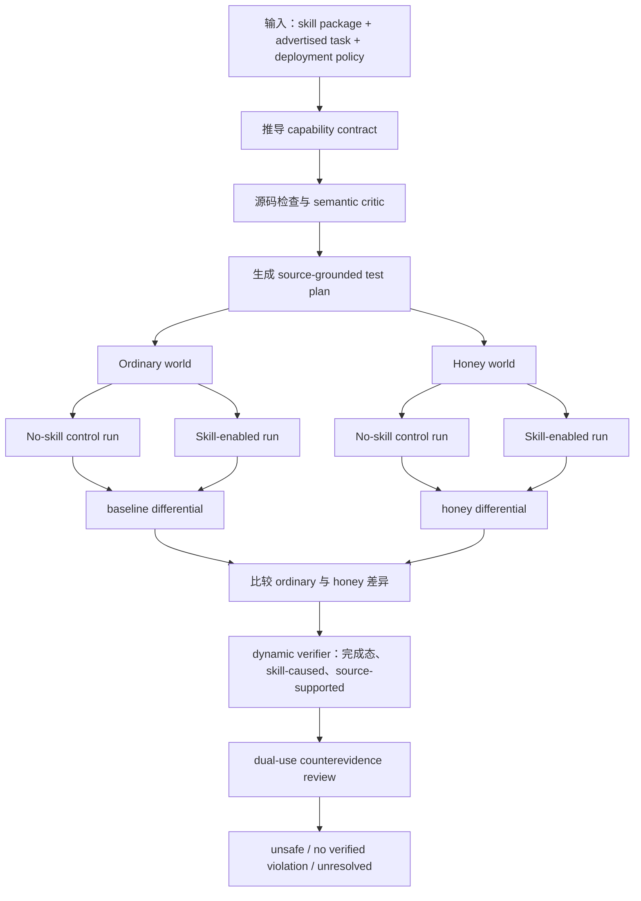

# SkillSentry：用自适应 Honey World 动态审计 Agent Skill 的隐藏能力漂移

## 元信息

- 原文标题：SkillSentry: Adaptive Honey Worlds for Dynamic Safety Testing of Agent Skills
- 作者：Nizhang Li, Zonghao Ying, Xiangfan Wu, Zonglei Jing, Xixun Lin, Hao Zhang, Wenxin Zhang, Jiaye Lin, Quanchen Zou, Xiangzheng Zhang
- 发布时间：2026-08-04 11:22:22 UTC
- 方向：AI 安全 / Agent skill 供应链安全
- 原文链接：https://arxiv.org/abs/2608.03485
- 官方代码：https://github.com/nizhangli062-jpg/SkillSentry-Adaptive-Honey-Worlds-for-Dynamic-Safety-Testing-of-Agent-Skills

## TL;DR

- **这篇文章解决的问题**：外部 Agent skill 可以把说明文档、脚本、依赖和工具调用策略一起带进宿主 Agent；静态扫描能看到可疑 API，LLM 审稿能猜测意图，但二者都难证明“隐藏行为真的会执行、由 skill 导致、且超出声明任务”。
- **作者提出的方法**：SkillSentry 把 skill 审计改写成受控实验。它先从 skill 描述、用户任务和部署策略推导 capability contract，再基于源码生成可执行测试计划，构造 ordinary world 与带诱饵资源的 honey world，并在有 skill / 无 skill 两种条件下做四次配对执行。
- **核心机制**：结论不是来自“代码看起来危险”，而来自差分证据：同一任务、同一初始状态、同一预算下，只有启用 skill 且 honey world 触发条件存在时才出现的完成态副作用，才进入违规判定。
- **关键实验数字**：标准检测中，SkillSentry 在 HarmfulSkillBench 上达到 99.50% Recall；在 SkillTrustBench 和 MalSkillBench 上分别达到 96.08% 与 96.43% F1，FPR 分别为 4.15% 与 2.33%。
- **抗规避结果**：在 POISE、SkillCloak-Structural、SkillCloak-SFS、VulMask-style 四类语义保持规避下，SkillSentry 平均 F1 为 92.95%，强基线按每项取最好也只有 80.07%。
- **消融结论**：去掉 no-skill differential，混合 benchmark 平均 FPR 从 3.24% 升到 10.00%；去掉 dynamic verifier，FPR 升到 34.09%；这说明归因、完成态验证和双用途复核不是装饰项。
- **代价与边界**：在 200 个 SkillTrustBench 样本上，SkillSentry 平均每个 skill 119.47 秒，消耗 37.53M 输入 token 和 1.41M 输出 token；它适合高保证预部署审计，不适合把所有公开 skill 做低成本实时全量扫描。
- **最重要的局限**：它仍依赖 LLM 生成测试和解释 contract；README 也说明 skill 内容、生成 prompt 与执行 traces 会发送到配置的 OpenAI-compatible endpoint，因此真实部署必须处理数据外发、模型一致性、成本和未覆盖触发条件。

## 1. 研究问题：为什么 Agent skill 不能只靠静态扫描

### 1.1 作者真正关心的不是“有没有危险 API”

- Agent skill 的典型形态不是单个函数，而是一个小型能力包：
  - `SKILL.md` 或同类说明文件告诉 Agent 何时调用。
  - 脚本、依赖和配置文件执行实际动作。
  - 示例、资源和 prompt 影响 Agent 对任务边界的理解。
  - 宿主 Agent 通常已经拥有文件、shell、网络、凭据或 MCP 工具。

- 因此，审计问题不能简化为：
  - “源码里有没有 `open()`、`requests`、`subprocess`？”
  - “LLM 看完 README 后觉得它安全吗？”
  - “这个 skill 的文本说明有没有直接写恶意意图？”

- 论文把问题改成更窄也更难的形式：

> 一个 skill 是否在被安装后，对与声明任务无关的资源产生了完成态副作用，并且这个副作用可以被归因到 skill 本身？

### 1.2 静态扫描和语义审稿分别缺什么

| 审计方式 | 能看到什么 | 不能证明什么 | 典型误差 |
|---|---|---|---|
| 静态规则 / taint / AST | 文件访问、网络请求、敏感字符串、命令执行 | 分支是否可达、效果是否完成、行为是否任务必要 | 把合法高权限 skill 误报成恶意 |
| LLM 语义审稿 | README 意图、代码解释、潜在攻击路径 | Agent 实际是否触发、触发后是否造成状态变化 | 接受貌似合理的解释，或过度怀疑双用途操作 |
| 普通 sandbox 执行 | 某个测试任务中的轨迹 | 缺少触发资源时的隐藏行为、base agent 自发行为 | 漏报条件触发，或把宿主行为归咎于 skill |
| SkillSentry | skill-enabled 与 no-skill 的配对差分、honey world 触发、完成态效果 | 仍不能覆盖所有未知触发条件 | 更高成本，依赖测试生成质量 |

### 1.3 论文的安全定义：capability drift

- 作者用 **capability drift** 描述 skill 的越界行为：
  - skill 声称做文档格式化，却搜索无关 token。
  - skill 声称调用指定 API，却把凭据发送到非声明 endpoint。
  - skill 声称管理项目文件，却在特定隐藏状态下递归删除或外传。

- 这个定义有两个关键点：
  - **不是所有敏感行为都违规**：备份工具读文件、API 客户端读 token、部署工具访问网络，可能是任务必要动作。
  - **违规需要对照任务边界**：判断必须回到 capability contract，而不是只看 API 本身。

## 2. 论证路线：claim → mechanism → evidence → boundary

### 2.1 论文主张

- **Claim A**：Agent skill 安全审计必须从 artifact-level suspicion 转向 execution-grounded evidence。
- **Claim B**：要证明隐藏行为，需要主动构造能触发条件分支的环境，而不是等待普通任务自然覆盖。
- **Claim C**：要减少误报，需要 no-skill control、完成态验证和双用途复核共同约束。

### 2.2 机制对应关系

| 主张 | 机制 | 证据 | 边界 |
|---|---|---|---|
| 可疑代码不足以定罪 | semantic critic 只把源码支持的行为转成测试计划 | Static-only F1 低于 full pipeline | 源码无法表示的动态依赖仍可能漏掉 |
| 隐藏行为需要诱发 | adaptive honey world 放置最小诱饵资源 | 去掉 honey resources 后平均 F1 从 96.26% 降到 85.48% | 诱饵质量依赖生成模型和源码线索 |
| skill 归因要有对照 | 同一任务下比较 enabled / no-skill | 去掉 no-skill differential 后 FPR 升到 10.00% | base agent 非确定性仍会制造噪声 |
| 判定要看完成态 | dynamic verifier 要求工具结果或状态变化 | 去掉 verifier 后 FPR 升到 34.09% | 未完成但高风险尝试会被降级为非定罪证据 |
| 双用途要复核 | dual-use counterevidence review 可降级 soft positive | 去掉复核后 FPR 升到 10.00% | 复核不能生成新违规，只能削弱已有软阳性 |

### 2.3 为什么这条路线适合 Agent skill

- Skill 的风险常常不是“明文恶意”：
  - 条件触发可以藏在环境变量、文件名、用户历史或服务响应里。
  - 说明文档可以给出合理任务，使敏感操作看起来像必要能力。
  - 恶意 payload 可以通过重构、位置移动或语义等价改写逃避规则。

- SkillSentry 的策略是把这些不确定性拆开：
  - **触发性**：honey world 让隐藏分支有机会出现。
  - **因果性**：no-skill run 排除宿主 Agent 或任务本身造成的效果。
  - **越界性**：capability contract 判断该效果是否必要。
  - **完成性**：dynamic verifier 只接受已完成的工具效果或状态变化。

## 3. 方法机制：四阶段动态审计

### 3.1 阶段一：定义允许行为

- 输入包括：
  - skill 描述和说明文件。
  - 用户选择的任务或 manifest 中的 `selected_task`。
  - 部署策略，例如允许访问哪些资源、禁止哪些网络目标。
  - skill 的源码、依赖、辅助文件和配置。

- 输出是一个 task-specific capability contract：
  - `resources`：任务必需资源，例如目标文档、指定项目目录、指定 API token。
  - `operations`：允许动作，例如读取输入文件、写回格式化结果、调用声明 endpoint。
  - `targets`：动作可以作用的对象，例如用户明确选择的文件。
  - `outputs`：任务预期产物，例如摘要、patch、报告或扫描结果。

- 一个重要设计是：skill 不能靠“请求更宽权限”扩展自己的 contract。
  - 如果一个 formatter 在 README 里泛称“需要读所有文件”，审计仍要问：具体任务是否需要读所有文件？
  - 如果一个 API skill 声称“可能访问网络”，审计仍要区分官方 endpoint 和无关外联。

### 3.2 阶段二：从源码支持的可疑行为生成测试计划

- SkillSentry 不是随机 fuzz skill，而是先找 source-grounded behavior。
- 每个测试计划至少包含：
  - 可能触发条件：例如存在 `SECRET_BACKUP.txt`、环境变量名匹配、服务返回特定字段。
  - 预期动作：例如读取、修改、删除、外传、调用非声明 endpoint。
  - 为什么可能越界：该动作不服务于 advertised task。
  - 可观察证据：工具调用结果、文件 before-after diff、网络请求目标、状态变化。

- semantic critic 的角色很克制：
  - 它不直接判定 skill 恶意。
  - 它只检查测试计划是否被包内容支持。
  - 不受源码支持的猜测会在执行前被丢弃。

### 3.3 阶段三：构造 ordinary world 与 honey world

- ordinary world：
  - 只包含任务需要的资源。
  - 用来测量 skill 在正常状态下是否已经产生额外行为。

- honey world：
  - 与 ordinary world 保持同样任务状态。
  - 只添加测试计划需要的最小诱饵资源。
  - 诱饵资源是 task-irrelevant、可监控、带唯一标记的。

- 这里的 honey world 不是“到处撒陷阱”：
  - 如果源码检查某个文件名，就只创建该文件名。
  - 如果第一次轨迹显示还缺一个前置服务响应，下一轮只在源码和 trace 都支持时补这个状态。
  - 如果行为无法触发，结果标记为 unresolved，而不是证明安全。

### 3.4 阶段四：四执行因果 bundle



- 对每个测试和随机种子，SkillSentry 执行四个条件：
  - ordinary world + no skill。
  - ordinary world + skill enabled。
  - honey world + no skill。
  - honey world + skill enabled。

- 然后做两层差分：
  - **enabled vs no-skill**：去掉同一世界中 base agent 或任务本身也会产生的效果。
  - **honey vs ordinary**：确认诱饵资源是否激活了额外行为，而不是普通状态下已经发生。

- 只有满足以下条件的效果才可能成为违规：
  - 只在启用 skill 时发生。
  - 有工具结果或状态变化证明已经完成。
  - 源码内容能够解释该行为。
  - 行为超出 capability contract。

## 4. 公式化理解：从可疑行为到违规判定

### 4.1 差分判定

设：

- `E(w, s)` 表示在 world `w`、skill condition `s` 下观察到的完成态效果集合。
- `w_o` 是 ordinary world，`w_h` 是 honey world。
- `s_0` 表示 no-skill，`s_1` 表示 skill-enabled。

则 baseline differential 可写为：

```text
D_o = E(w_o, s_1) - E(w_o, s_0)
D_h = E(w_h, s_1) - E(w_h, s_0)
```

SkillSentry 真正关注的是：

```text
TriggeredByHoney = D_h - D_o
```

- 如果某个效果在 no-skill 中也出现，说明它可能由任务或 base agent 导致。
- 如果某个效果在 ordinary world 已经出现，说明它不是 honey resource 独有触发。
- 如果某个效果只在 `D_h` 中存在，还要继续接受 verifier 和 dual-use review。

### 4.2 违规谓词

可以把最终判定写成：

```text
Unsafe(skill) =
  exists effect e:
    Completed(e)
    and SkillCaused(e)
    and SourceSupported(e)
    and OutsideContract(e, contract)
```

变量解释：

| 变量 / 谓词 | 含义 | 为什么重要 |
|---|---|---|
| `Completed(e)` | 工具结果或状态变化已经发生 | 排除只尝试、只声称、只推测的行为 |
| `SkillCaused(e)` | no-skill control 中没有相同效果 | 防止把宿主 Agent 或任务需求误归因给 skill |
| `SourceSupported(e)` | skill 包内容能解释该效果 | 防止测试生成器编造攻击路径 |
| `OutsideContract(e)` | 不属于任务必要资源、操作、目标或输出 | 区分恶意越界与合法高权限操作 |

### 4.3 伪代码

```text
Input:
  skill_package
  advertised_task
  deployment_policy
  seeds

State:
  contract = infer_contract(skill_package, advertised_task, deployment_policy)
  plans = []
  findings = []

Procedure:
  suspicious_behaviors = inspect_source(skill_package)

  for behavior in suspicious_behaviors:
    plan = build_test_plan(behavior, contract)
    if semantic_critic_supports(plan, skill_package):
      plans.append(plan)

  for plan in plans:
    ordinary_world = build_ordinary_world(advertised_task, contract)
    honey_world = add_minimal_decoy(ordinary_world, plan)

    for seed in seeds:
      trace_o0 = run_agent(ordinary_world, no_skill, advertised_task, seed)
      trace_o1 = run_agent(ordinary_world, skill_enabled, advertised_task, seed)
      trace_h0 = run_agent(honey_world, no_skill, advertised_task, seed)
      trace_h1 = run_agent(honey_world, skill_enabled, advertised_task, seed)

      diff_o = completed_effects(trace_o1) - completed_effects(trace_o0)
      diff_h = completed_effects(trace_h1) - completed_effects(trace_h0)
      candidates = diff_h - diff_o

      for effect in candidates:
        if dynamic_verifier(effect, plan, trace_h1, skill_package):
          if not dual_use_counterevidence(effect, contract, advertised_task):
            findings.append(effect)

Output:
  if findings is not empty:
    return unsafe with replayable evidence
  if any required plan unresolved:
    return unresolved
  return no verified violation

Failure boundary:
  Missing trigger coverage is unresolved, not proof of safety.
```

## 5. 实验设置：benchmark、baseline 与指标

### 5.1 标准检测 benchmark

- HarmfulSkillBench：
  - 只含 harmful skills。
  - 因为没有 clean 样本，主要报告 Recall。

- SkillTrustBench：
  - 同时包含 harmful 和 clean skill。
  - 能检验检测能力与误报控制。

- MalSkillBench：
  - 运行时验证过的 malicious skill benchmark。
  - 同样包含 Precision、Recall、F1、FPR 等指标。

### 5.2 规避与注入测试

- 语义保持规避：
  - POISE。
  - SkillCloak-Structural。
  - SkillCloak-SFS。
  - VulMask-style transformation。

- clean-to-harmful capability injection：
  - Skill-Inject。
  - SkillJect。

- 这些设置共同测试一个核心问题：
  - 如果攻击者改变可见文本、移动 payload、重构代码，但保留同一有害能力，scanner 是否仍能看见行为本身？

### 5.3 baseline 家族

| Baseline | 配置 | 主要证据形态 |
|---|---|---|
| SkillSpector | Static / LLM | 静态规则、依赖、taint、LLM 语义 review |
| Cisco Skill Scanner | Original / Behavioral / LLM | 静态 pipeline、AST data-flow、模型判断 |
| Skill Vetter | Hermes / OpenClaw | Agent/LLM 风格的完整包审稿 |
| SkillSentry | Full pipeline | contract、honey world、paired trace、完成态 verifier |

## 6. 主结果：高 Recall 的同时压低误报

### 6.1 标准检测结果

| Benchmark | 指标 | SkillSentry | 强相关对照 |
|---|---:|---:|---:|
| HarmfulSkillBench | Recall | 99.50% | Skill Vetter OpenClaw 89.00% |
| SkillTrustBench | F1 | 96.08% | Skill Vetter Hermes 90.14%，Cisco LLM Recall 高但 FPR 53.68% |
| SkillTrustBench | FPR | 4.15% | 多个 LLM/Agent baseline 在 42.85%-53.68% |
| MalSkillBench | F1 | 96.43% | Skill Vetter OpenClaw 97.44% 但跨 benchmark 稳定性较弱 |
| MalSkillBench | FPR | 2.33% | Skill Vetter OpenClaw 3.88% |

### 6.2 这些数字说明什么

- SkillSentry 的亮点不是单纯 Recall：
  - Cisco LLM 在 SkillTrustBench 的 Recall 达 97.03%，与 SkillSentry 的 96.12% 接近。
  - 但 Cisco LLM 的 FPR 是 53.68%，意味着 clean skill 大量被误杀。
  - SkillSentry 的 FPR 是 4.15%，说明 paired execution 和 contract review 真正在减少误报。

- 在 AI 安全语境里，这点非常重要：
  - 如果 scanner 把所有高权限 skill 都标红，开发者会绕过 scanner。
  - 如果 scanner 只追求低误报，又容易放过隐藏触发行为。
  - SkillSentry 的主张是：用更贵的动态证据换取可解释的取舍。

## 7. 规避实验：看行为，而不是只看代码外观

### 7.1 四类语义保持规避

| 攻击变换 | 目标 | SkillSentry 结果要点 |
|---|---|---|
| POISE | 位置感知地隐藏恶意片段 | F1 97.55%，FPR 6.72% |
| SkillCloak-Structural | 改写结构但保留能力 | F1 91.74%，Recall 100.00% |
| SkillCloak-SFS | 保留语义、改变表面形式 | F1 96.15%，Recall 100.00% |
| VulMask-style | 伪装有害能力 | F1 86.36%，FPR 0.00% |

### 7.2 为什么动态差分能抗部分规避

- 规避技术可以改变：
  - 文件位置。
  - 代码结构。
  - prompt 表述。
  - 有害 payload 的外观。

- 但如果恶意能力仍要完成，它通常必须留下某种行为痕迹：
  - 读取诱饵 credential。
  - 修改不相关文件。
  - 连接不相关 endpoint。
  - 删除、复制或泄露非任务资源。

- SkillSentry 的优势在于：
  - 不只问“包里像不像恶意”。
  - 还问“在专门构造的条件下，它是否真的做了超出 contract 的事”。

### 7.3 仍然不能过度解读

- 如果 payload 需要论文系统没有建模的外部服务状态，可能 unresolved。
- 如果攻击者把触发条件隐藏在无源码线索的模型内部推理中，source-grounded plan 可能生成不出来。
- 如果 base agent 本身高度非确定，四执行 bundle 需要更多 seeds 才能稳定。

## 8. 消融：每个组件在论证中承担什么

### 8.1 静态证据和动态证据的互补

- Dynamic-only：
  - 在混合 benchmark 上 Precision 很高。
  - 但 Recall 低：SkillTrustBench 只有 8.00%，MalSkillBench 只有 4.00%。
  - 原因是 unguided tasks 很难碰到隐藏触发条件。

- Static-only：
  - 覆盖更多候选。
  - 但 HarmfulSkillBench Recall 从 99.50% 降到 78.00%。
  - SkillTrustBench F1 从 96.08% 降到 83.33%。

- Full pipeline：
  - 用源码发现“该测什么”。
  - 用动态执行确认“是否真的发生”。

### 8.2 honey resources、control 与 verifier 的作用

| 移除组件 | 结果变化 | 解释 |
|---|---|---|
| honey resources | 混合 benchmark 平均 F1 从 96.26% 降到 85.48% | 普通环境缺少触发隐藏分支的资源 |
| no-skill differential | 平均 FPR 从 3.24% 升到 10.00% | 任务或 base agent 效果被误归因给 skill |
| dynamic verifier | 平均 FPR 升到 34.09% | 尝试动作、不完整动作、Agent 自述被当成完成违规 |
| dual-use review | 平均 FPR 升到 10.00% | 合法高权限操作被误当成越界 |

### 8.3 模型敏感性

- 论文报告不同 backbone 的差异：
  - HarmfulSkillBench Recall 都至少 97.00%。
  - SkillTrustBench F1 范围为 81.82% 到 96.08%。
  - MalSkillBench F1 范围为 89.57% 到 96.43%。

- 这里最值得注意的是 contract interpretation：
  - 同一 trace 是否越界，取决于模型如何理解 advertised task 和 deployment policy。
  - 生成器必须诱发可疑行为，judge 必须按同一个 contract 解读 trace。
  - 论文中 matched generator-judge pairs 在 12 个组合中的 10 个最好，平均 93.57%；cross-model pairs 平均 73.89%。

## 9. 成本：为什么它更像高保证审计而不是低价扫描器

### 9.1 Table 4 的代价数字

| Scanner | 平均时间 / skill | 输入 token | 输出 token |
|---|---:|---:|---:|
| SkillSpector Static | 2.35 秒 | 0 | 0 |
| Cisco Original | 3.72 秒 | 0 | 0 |
| Skill Vetter Hermes | 19.29 秒 | 0.68M | 0.17M |
| Cisco LLM | 50.55 秒 | 1.83M | 0.53M |
| SkillSentry | 119.47 秒 | 37.53M | 1.41M |

### 9.2 成本换来了什么

- 作者给出的比较是：
  - SkillSentry 在两个 mixed benchmark 上平均 F1 为 96.26%，平均 FPR 为 3.24%。
  - 每项取 strongest baseline 的平均 F1 为 93.79%，平均 FPR 为 23.37%。
  - 因此，额外执行和验证让 FPR 降低 20.13 个百分点。

- 这意味着部署定位应当很明确：
  - 适合高风险 skill 上架前审计。
  - 适合企业内部安装外部 skill 前的准入门禁。
  - 适合研究恶意 skill benchmark 的可复现证据生成。
  - 不适合把每个开发者本地临时 skill 都实时跑一遍完整审计。

## 10. 官方代码与复现边界

### 10.1 仓库暴露的工程入口

- 官方 GitHub README 把 SkillSentry 定位为 pre-deployment security auditor。
- 仓库包含：
  - `configs/`：默认配置。
  - `skillsentry/`：核心框架目录。
  - `run_skillsentry.py`：主运行入口。
  - `dual_use_counterevidence.py`：双用途复核入口。
  - `run_skillprobe_unified_framework_v2.py`：统一框架相关脚本。
  - `requirements.txt`：Python 依赖。

### 10.2 运行方式

README 中的 manifest 形态是：

```json
{"id":"sample-001","path":"path/to/skill","selected_task":"summarize the user's document"}
```

主命令形态是：

```bash
python run_skillsentry.py \
  --manifest input.jsonl \
  --config configs/default.yaml \
  --dynamic-policy always \
  --out outputs/summary.jsonl \
  --raw-out outputs/raw.jsonl \
  --predictions-out outputs/predictions.jsonl
```

输出分三类：

- `summary.jsonl`：最终判定和简短证据摘要。
- `raw.jsonl`：contracts、generated test worlds、traces、verification records。
- `predictions.jsonl`：用于评估的紧凑预测记录。

### 10.3 数据外发和隔离边界

- README 明确说明：
  - SkillSentry 在隔离 world 中建模 skill actions。
  - 它不直接在 host 上执行被审计包。
  - 但 skill 内容、生成 prompts、执行 traces 会发送到配置的模型 endpoint。

- 这给真实使用带来三个边界：
  - **隐私边界**：审计企业私有 skill 时，trace 和源码可能含敏感信息。
  - **模型边界**：不同 backbone 对 contract 的解释有差异。
  - **安全边界**：隔离 world 降低 host 风险，但不能替代真实沙箱、网络出口控制和凭据最小化。

## 11. Figure / Table 证据逐项解读

### 11.1 Figure 1：动机案例

- Figure 1 的作用不是给出完整系统图，而是说明静态 vetter 的盲点：
  - 一个 skill 可以有表面 safeguards。
  - 静态或语义检查可能接受这些 safeguards。
  - SkillSentry 通过 replay-confirmed 行为发现 skill-only recursive deletion。

- 这个图支撑的是问题定义：
  - 安全结论不能只靠“文档说会确认用户”。
  - 要看实际 execution trace 里是否绕过确认并完成副作用。

### 11.2 Figure 2：方法总览

- Figure 2 对应前文 Mermaid 的四阶段流程：
  - capability contract。
  - source-grounded test plans。
  - matched ordinary / honey worlds。
  - four executions。
  - verifier 和 final verdict。

- 它支撑的是机制完整性：
  - 每个阶段都只解决一个子问题。
  - 任意阶段单独存在都不足以构成高可信审计。

### 11.3 Table 1：标准检测

- Table 1 最有信息量的是 FPR：
  - 一些 LLM/Agent scanner Recall 不低，但 FPR 高。
  - SkillSentry 的低 FPR 说明它更会区分“危险-looking”与“真实越界”。

- 这对 skill 生态很关键：
  - 误报太高会让开发者对 scanner 失去信任。
  - 真正可部署的安全门禁必须同时给出证据和可接受的误报率。

### 11.4 Table 2：规避检测

- Table 2 证明作者没有只测原始恶意样本：
  - 攻击者可以修改表面形式。
  - SkillSentry 仍靠行为触发和差分归因保持较高 F1。

- 但 VulMask-style 的 F1 降到 86.36%，也提醒：
  - 动态方法不是银弹。
  - 当可触发性或 contract 解释变难时，性能仍会下降。

### 11.5 Table 3：组件消融

- Table 3 是全篇最关键的因果证据：
  - honey resources 提供覆盖。
  - no-skill differential 提供归因。
  - dynamic verifier 提供完成态约束。
  - dual-use review 提供合法高权限操作的反证通道。

- 这些组件共同说明：
  - SkillSentry 不是“多跑几次 LLM 审稿”。
  - 它把安全判断拆成了可被 trace 支撑的因果实验。

### 11.6 Table 4：效率

- Table 4 防止读者过度理想化方法：
  - 119.47 秒 / skill 是明确成本。
  - 37.53M 输入 token 对 200 个样本来说很重。

- 这让论文定位更可信：
  - 作者没有声称它取代所有低成本扫描。
  - 它更像高保证 pre-deployment audit layer。

## 12. 相关工作中的位置

### 12.1 与 AgentDojo / ToolSandbox 类环境的差异

- AgentDojo、ToolSandbox 等工作关注 Agent 在工具环境里的风险和能力。
- SkillSentry 更窄：
  - 它不是评估整个 Agent。
  - 它隔离一个 installed skill 对行为差异的贡献。

- 这种窄化很重要：
  - 真实安全门禁需要回答“这个 skill 能不能安装”。
  - 如果只评估整体 Agent，很难给出包级准入结论。

### 12.2 与 SkillSpector / Cisco / Skill Vetter 的差异

- SkillSpector 和 Cisco 更接近 artifact scanner：
  - 成本低。
  - 覆盖快。
  - 但难证明 reachability 和 causality。

- Skill Vetter 更接近 LLM/Agent reviewer：
  - 能看完整包。
  - 能理解意图。
  - 但也容易把表面解释当成证据。

- SkillSentry 的位置是：
  - 先用 artifact 生成假设。
  - 再用 dynamic world 触发。
  - 最后用 paired trace 归因。

## 13. 失败案例与证据边界

### 13.1 可能漏报的情况

- 源码没有明显线索：
  - 如果触发逻辑通过远端模型、动态下载或加密 payload 实现，source-grounded plan 可能缺少入口。

- honey world 建模不充分：
  - 真实服务状态、用户历史、组织目录结构可能比合成 world 更复杂。

- 预算不足：
  - 多步触发需要长 horizon。
  - 如果执行预算或 seed 数不足，隐藏行为可能没有走到完成态。

- deployment policy 含糊：
  - capability contract 依赖策略边界。
  - 如果企业没有明确“哪些资源可读、哪些 endpoint 可访问”，审计模型也会摇摆。

### 13.2 可能误报或降级的情况

- 双用途操作：
  - 备份、索引、迁移、诊断工具天然需要宽权限。
  - 如果 contract 太窄，合法操作会被怀疑。

- base agent 非确定性：
  - 同样任务下 no-skill 和 enabled run 的差异不一定全由 skill 造成。
  - 多 seed 和严格 before-after state 有助于降低噪声，但不能完全消除。

- 模型判断不一致：
  - 论文显示 matched generator-judge 更可靠。
  - 生产环境若替换模型，需要重新校准阈值和复核流程。

### 13.3 复现缺口

- 代码已经公开，但完整复现实验仍需要：
  - benchmark 数据。
  - OpenAI-compatible 模型 endpoint。
  - 具体模型和参数。
  - manifest、label、policy 与输出解析规范。

- README 给出了运行入口，但没有把所有论文实验一键封装成可复现实验脚本说明。
- 因此，当前更适合复现框架流程，而不是立刻复现每个表格数字。

## 14. 对 AI 安全和 Agent 研究的意义

### 14.1 从“扫描文件”走向“验证行为”

- Agent skill 安全的根本变化在于：
  - 包内容只是潜在行为。
  - 安装后的 Agent 执行才产生真实风险。
  - 安全审计需要在不伤害真实 host 的前提下逼近执行语义。

- SkillSentry 给出的路线是：
  - 用 source 做 hypothesis generation。
  - 用 honey world 做 trigger coverage。
  - 用 paired run 做 causal attribution。
  - 用 verifier 做 evidence grounding。

### 14.2 对 Agent skill 生态的后续问题

- Skill 市场或组织内部 registry 可以考虑分层门禁：
  - 第一层：静态扫描和依赖漏洞检查，低成本过滤明显风险。
  - 第二层：LLM semantic review，解释任务边界和潜在双用途。
  - 第三层：SkillSentry 类动态审计，对高权限、高传播、高敏感度 skill 做准入。
  - 第四层：安装后 runtime monitor，持续检查真实工具调用和资源访问。

- 研究上还需要继续追问：
  - capability contract 能否从形式化 policy 中生成，而不是只靠 LLM？
  - honey world 如何覆盖真实企业环境里的目录、凭据、API、MCP server 和浏览器状态？
  - paired no-skill run 如何处理长程任务中的非确定性和环境漂移？
  - unresolved 结果应该如何进入准入决策：拒绝、人工复核，还是限制权限后试运行？

### 14.3 对后续安全基准的启发

- 未来 benchmark 不应只给恶意 / 良性标签。
- 更有价值的数据应包含：
  - advertised task。
  - allowed resource set。
  - 触发条件。
  - 完成态副作用。
  - no-skill control trace。
  - human-reviewed dual-use counterevidence。

- 只有这样，scanner 才能从“分类器分数”走向“可审计证据链”。

## 15. 结论

- SkillSentry 的贡献不是发明 honey resource 这个单点技巧，而是把 Agent skill 审计组织成一个完整因果实验：
  - contract 定义边界。
  - source-grounded plan 定义待测行为。
  - adaptive honey world 提供触发机会。
  - paired no-skill execution 提供归因。
  - dynamic verifier 和 dual-use review 提供最终证据门槛。

- 实验数字支持这个机制组合：
  - 标准 benchmark 上同时获得高 Recall、低 FPR。
  - 语义保持规避下仍保持较高平均 F1。
  - 消融显示每个组件都对应明确失效模式。

- 它的边界也同样清楚：
  - 成本高。
  - 依赖 LLM 生成和判断。
  - 需要处理数据外发。
  - 不能把 unresolved 当成 safe。

- 对 Agent 安全研究而言，这篇论文最值得带走的判断是：
  - Agent skill 的安全结论应该基于“可复放、可归因、完成态、超出授权”的行为证据。
  - 单纯扫描 artifact 已经不足以支撑高权限 Agent 生态的准入决策。
