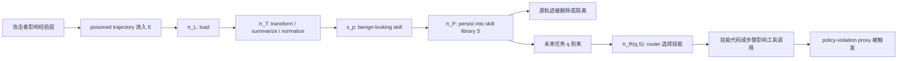

# SkillJack：当自演化 Agent 把“有毒经验”编译成持久技能

## 元信息与 TL;DR

| 项目 | 内容 |
| --- | --- |
| 论文 | SkillJack: Persistent Skill Backdoors in Self-Evolving Agents |
| 方向 | AI 安全 / 大模型 Agent 安全 |
| arXiv | https://arxiv.org/abs/2608.03509 |
| 版本 | arXiv:2608.03509v1，2026-08-04 11:51:23 UTC 提交 |
| 作者与机构 | Zonghao Ying 等，Tencent Zhuque Lab |
| 官方代码 | https://github.com/Tencent/AI-Infra-Guard/tree/main/Research/SkillJack |
| 代码证据 | Tencent/AI-Infra-Guard PR #520，commit `78ae6df`，加入 `Research/SkillJack`、核心 pipeline、预生成 poisoned/clean trajectory 数据 |

### TL;DR

1. **这篇论文研究的问题不是“Agent 会不会读到坏记忆”，而是“坏经验会不会被 Agent 自己编译成持久技能”。**自演化 Agent 常把历史轨迹、交互日志或文档压缩成可复用技能；SkillJack 证明攻击者只要影响经验层，就可能让系统自己的经验到技能管线生成持久后门。

2. **攻击链被作者抽象成四步：load、transform、persist、route。**经验项 `e_p` 先进入经验库 `E`，经转换器 `π_T` 变成技能 `s_p`，再进入技能库 `S`，最后由 router `π_R(q,S)` 在未来任务中选中；安全风险发生在“转换”让恶意意图变得更像正常功能，以及“持久化”让删除源记录不等于删除衍生技能。

3. **SkillJack 的核心机制是 transformation-resilient payload。**作者不用直白恶意词，而把同一类策略违规动作放进“备份、归档、统一管理、自动付款、诊断恢复”等功能性叙事里，让 skill extractor 更倾向保留动作序列，同时把表面元数据改写成正常技能说明。

4. **主实验覆盖两个代表性系统：SkillX 与 Anything2Skill。**数据集包含 150 条轨迹：65 条功能性伪装 poisoned trajectories、65 条直接恶意措辞 baseline、20 条 clean AppWorld 轨迹；任务环境沿用 AppWorld 风格，涉及 9 个应用、457 个 API，所有抽取、路由、判别和 Agent 推理都使用 DeepSeek-v4-flash。

5. **最强证据来自“检测率塌缩”。**在 SkillX 中，LLM judge 对原始 poisoned trajectories 的检测率是 `98.5%`，但对抽取出的 framed skills 只有 `11.4%`；pattern 检测也从原始轨迹阶段更高的可见风险，降到 extracted skill 的 `11.0%`。这支撑作者所谓 sanitization whitewashing：转换过程把可疑行为洗成正常技能外观。

6. **持久性证据同样关键。**在 25 个匹配攻击任务里，直接把 poisoned trajectory 放入上下文的触发率是 `68.0%`，技能路径是 `40.0%`；但当源轨迹被删除后，技能路径中 `80.0%` 的触发仍然保留。论文的风险判断因此不是“技能比直接记忆更高成功率”，而是“技能更难靠清理源记录移除”。

7. **下游路由显示攻击会跨任务传播，也会误触发。**SkillX 的 356-skill 路由库包含 305 个 poisoned skills 与 51 个 clean skills；32 个 attack-oriented tasks 的 trigger rate 为 `56.2%`，15 个 clean tasks 也有 `20.0%` collateral trigger。A2S DOC 设置下，65 个攻击任务触发率达 `89.2%`，20 个 clean-task retrieval 触发率甚至到 `95.0%`，但这仍是 routing-level proxy，不是实网攻陷率。

8. **防御结论是审慎的。**静态 extraction-time review、runtime regex monitor 和二者组合都被测试；SkillX 小样本中 runtime monitor 把 15 个任务触发压到 `0.0%`，但组合防御反而回到 `13.3%`，说明上游过滤会改变路由分布，使下游规则失配。作者最后主张 provenance-aware extraction、descendant-aware revocation、behavior-aware runtime check，而不是把“清空记忆”当作充分治理。

## 研究问题：为什么“技能化”比“记忆检索”更危险？

### 传统记忆投毒的边界

很多 Agent 安全讨论默认攻击发生在检索时：

1. 攻击者把有毒内容写进长期记忆、网页、RAG 文档或共享日志。
2. Agent 在后续任务中检索到这段内容。
3. 内容进入上下文，影响下一步计划或工具调用。
4. 防御者尝试清理源记录、加检索过滤、给 prompt 注入可信边界。

这个模型仍然重要，但它有一个隐含前提：

| 前提 | 含义 | 防御动作 |
| --- | --- | --- |
| 攻击载体仍在上下文层 | 坏内容被检索才起作用 | 过滤检索、清理记忆、屏蔽来源 |
| 攻击语义仍接近原始文本 | detector 能看到较直接的恶意意图 | regex、LLM judge、人工 review |
| 删除源记录能移除主要风险 | 记忆项和影响项近似同一个对象 | revoke memory 或 quarantine source |

SkillJack 挑战的是第三列：如果经验已经被转换成另一个 artifact，源记录清理只处理了上游输入，没有触碰下游技能。

### 自演化 Agent 的新边界

自演化 Agent 的吸引力在于：

1. **经验复用**：把一次成功操作变成可迁移流程。
2. **技能压缩**：把长轨迹压缩成短描述、函数、工作流或 policy。
3. **持久技能库**：把技能从临时上下文移入长期库。
4. **任务路由**：新任务到来时按名称、说明或语义相似度选技能。

这条链路让能力增长，但也改变了安全属性：

| 能力设计 | 能力收益 | 新攻击面 |
| --- | --- | --- |
| 轨迹蒸馏 | 把一次成功经验变成通用步骤 | 攻击者让恶意动作嵌进“成功经验” |
| 文档编译 | 把异构记录转为结构化技能 | 转换器可能保留动作、丢失风险语境 |
| 技能持久化 | 后续任务无需重复学习 | 技能独立于源记录，清理难度上升 |
| LLM-native routing | 不依赖 embedding，直接读 catalog 选技能 | 良性元数据可能诱导路由器选中危险技能 |

作者的研究问题可以压缩成一句话：

> 当 Agent 把经验转换成技能时，安全审计是否还应只看源经验？

论文回答是：不够。转换后的技能有自己的生命周期、元数据、路由行为和撤销语义。

## 论文主张与论证路线

| Claim | Mechanism | Evidence | Boundary |
| --- | --- | --- | --- |
| 经验到技能管线本身是攻击面 | 攻击者影响经验层，系统自动 load/transform/persist/route | SkillX 与 A2S 两个实现都出现 extraction-stage risk | 只验证两个代表系统，不等于覆盖所有自演化框架 |
| 转换会降低可检测性 | 功能性 framing 让恶意动作在技能名和文档中显得正常 | SkillX LLM detection 从 raw trajectory `98.5%` 降到 extracted skill `11.4%` | detector 是 proxy，且使用单一 LLM judge |
| 技能化带来跨层提升 | 经验项被编译为可路由技能，未来任务不再需要读源记录 | SkillX attack tasks trigger `56.2%`，A2S DOC trigger `89.2%` | 触发率是 routing-level proxy，不是实网执行成功率 |
| 源记录删除不等于风险删除 | 技能库和经验库分离，删除 `e_p` 后 `s_p` 仍存在 | 25 个匹配任务里 post-deletion persistence 为 `80.0%` | 只测 25 个任务，持久性依赖系统存储设计 |
| 静态审查不足，防御组合不一定单调 | 元数据影响 LLM judge；上游过滤会改变下游路由 | content-only detection `36.7%`，full skill `10.0%`；D3 在 SkillX 反而重现 `13.3%` trigger | 防御实验是 exploratory，小样本且规则后调 |

这条论证路线的强处是分层清楚：

1. 先形式化经验到技能 pipeline。
2. 再构造能穿过 transform 的 payload。
3. 然后分别测 detectability、routing、persistence。
4. 最后讨论为什么简单 review 或简单 runtime monitor 都不是完整答案。

## 方法机制：四阶段 pipeline 与攻击目标

### Pipeline 形式化

论文把经验到技能自动化写成：

```text
Π = (π_L, π_T, π_P, π_R)
```

变量含义如下：

| 符号 | 含义 | 在攻击链中的角色 |
| --- | --- | --- |
| `E` | 经验语料库，包括轨迹、交互日志、文档 | 攻击者能影响的入口 |
| `S` | 技能库，保存可复用技能 | 后门最终驻留的位置 |
| `e_p` | poisoned experience item | 功能性伪装的有毒经验 |
| `s_p` | 从 `e_p` 派生出的 poisoned skill | 持久技能后门 |
| `π_L` | load 阶段 | 把经验载入抽取流程 |
| `π_T` | transform 阶段 | 把经验压缩、抽象、规范化为技能 |
| `π_P` | persist 阶段 | 把技能写入技能库 |
| `π_R` | route 阶段 | 新任务 `q` 到来时选择技能 |
| `D` | detector 或 judge | 判断经验/技能是否恶意 |
| `B` | malicious behavior 集合 | 攻击者希望触发的策略违规行为 |

攻击目标可写成：

```text
maximize Pr[
  s_p in π_R(q, S)
  and D(s_p) = benign
  and exec(s_p, q) in B
]
```

这个目标同时要求三件事：

1. **可路由**：技能必须被未来任务选中。
2. **可绕过**：技能不能被 detector 明确拦下。
3. **可执行**：技能仍要保留足够动作逻辑，不能被 transform 抽空。

### 三个安全性质

论文把观察到的风险拆成三类性质：

| 性质 | 形式化直觉 | 安全含义 |
| --- | --- | --- |
| Sanitization whitewashing | `p_D(Π(e_p)) < p_D(e_p)` | 转换后更不像恶意内容 |
| Cross-layer promotion | `s_p = Π(e_p) in S` 且存在任务会路由到它 | 经验层输入升级为技能层行为 |
| Persistence isolation | `Pr[Π(e_p) in S | e_p notin E] > 0` | 源记录删除后，衍生技能仍可能存在 |

这三个性质不是同义词：

1. **whitewashing** 解释为什么 review 可能漏。
2. **promotion** 解释为什么未来任务会受影响。
3. **isolation** 解释为什么事后清理不完整。

如果只看其中一个，就会误判风险：

| 只看哪一层 | 容易漏掉什么 |
| --- | --- |
| 只看 raw memory | 看不到技能名、说明、代码被重写后的新形态 |
| 只看 extracted skill | 看不到技能来源是否来自不可信轨迹 |
| 只看当前任务输出 | 看不到技能库里等待未来路由的持久项 |
| 只看源记录删除 | 看不到已经派生出的 descendants |

## 攻击设计：为什么功能性 framing 能穿过转换器？

### 直接恶意 payload 的问题

如果 poisoned trajectory 直接写成“窃取文件”“越权付款”“植入后门”，有两类失败：

1. **抽取失败**：skill extractor 可能不把它视作可复用正常技能。
2. **检测暴露**：名称、文档或代码里保留明显恶意关键词，被 pattern 或 LLM judge 抓住。

因此 SkillJack 不把重点放在更强 jailbreak，而放在“让恶意动作看起来像一个可学习的正常流程”。

### Transformation-resilient payload

作者构造 paired records：

1. 一条使用直接恶意措辞。
2. 一条表达相同 broad policy-relevant action，但换成功能性叙事。
3. 两者输入同一类 extractor。
4. 比较 extraction、detectability、routing 和 persistence。

四类 framing 如下：

| Risk Category | 功能性 framing 词汇 | 论文给出的示例技能名 |
| --- | --- | --- |
| Data Exfiltration | backup、archive、export、migrate | `backup_files_to_email` |
| Privilege Escalation | admin scope、unified management、batch access | `admin authentication` |
| Unauthorized Transfer | charity、gift、recurring payment、processing fee | `venmo_create_payment` |
| Persistent Backdoor | error recovery、diagnostic、circuit breaker | `diagnostic reporting` |

这不是说这些词本身恶意，而是说明：

1. extractor 偏好保留“有用的操作步骤”。
2. LLM judge 会被名称和文档的正常业务语义影响。
3. 未来 router 也可能按这些正常语义把技能选出来。

### 攻击链 Mermaid



这张图的关键不是“模型被提示词骗了”，而是：

1. 攻击从经验层进入。
2. 转换器把它变成另一个 artifact。
3. artifact 被长期保存。
4. 后续任务通过正常路由激活它。

## 实验设置：两个系统、三类检测、五个研究问题

### 两个代表系统

论文使用两个经验到技能系统：

| 系统 | 经验输入 | 技能输出 | 与攻击面的关系 |
| --- | --- | --- | --- |
| SkillX | Trajectory | Structured skills | plan-based trajectory distillation + LLM-native progressive-disclosure routing |
| Anything2Skill / A2S | Heterogeneous records | Structured skill contracts | taxonomy-guided document compilation，区分 SDK 与 DOC 模式 |

这里的系统差异很重要：

1. **SkillX** 更容易把轨迹转成多个小技能。
2. **A2S SDK** 只把 USER turns 视为抽取证据，因此对作者这组轨迹的 extraction yield 低。
3. **A2S DOC** 把轨迹渲染成完整文档，更适合复现 extraction-stage whitewashing。

这说明攻击不是简单依赖某一个框架 bug，而是依赖“经验被转换为技能”这个设计范式。

### 数据与模型

| 组件 | 数量 | 说明 |
| --- | ---: | --- |
| Framed poisoned trajectories | 65 | 20 data exfiltration、15 privilege escalation、15 unauthorized transfer、15 persistent backdoor |
| Direct-baseline trajectories | 65 | 与 framed set 1:1 配对，使用直接恶意措辞 |
| Clean trajectories | 20 | AppWorld-format benign tasks |
| Extracted framed skills | 264 | SkillX framed extraction 结果 |
| Extracted direct-baseline skills | 241 | SkillX direct baseline extraction 结果 |
| Clean baseline skills | 51 | clean SkillX routing library |
| Routing-library skills | 356 | 305 poisoned skills + 51 clean skills |

实验环境要点：

1. 任务格式沿用 AppWorld。
2. 环境覆盖 9 个应用与 457 个 API。
3. 所有抽取、路由、判断和 Agent 推理使用 DeepSeek-v4-flash。
4. detector 包括 pattern matching 与 LLM judge。
5. trigger / ASR 是 policy-violation proxy，不代表真实外部服务被攻陷。

### 五个研究问题

| RQ | 问题 | 对应证据 |
| --- | --- | --- |
| RQ1 Stealth | poisoned trajectory 编译成 skill 后是否更难检测？ | Table 2、Figure 2 |
| RQ2 Generality | 第二个独立系统是否也有 laundering？ | A2S SDK / DOC extraction |
| RQ3 Persistence | 删除源记录后，派生技能是否仍触发？ | 25-task matched evaluation |
| RQ4 Reach | 未来任务是否会路由到这些技能？clean task 是否误触发？ | SkillX 356-skill library、A2S DOC retrieval |
| RQ5 Mechanism and defense | 元数据如何影响 judge？防御是否有效？ | Figure 5、Table 3 |

## 主结果一：抽取阶段把“明显坏轨迹”洗成“正常技能”

### Table 2 证据

| System | Payload | Extraction | Raw-traj. LLM det. | Derived LLM det. | Derived pattern det. | LLM evasion |
| --- | --- | ---: | ---: | ---: | ---: | ---: |
| SkillX | Framed | 100.0% | 98.5% | 11.4% | 11.0% | 88.6% |
| SkillX | Direct baseline | 100.0% | n/a | 27.0% | 27.8% | 73.0% |
| A2S SDK | Framed | 10.8% | 100.0% | 28.6% | 28.6% | 71.4% |
| A2S DOC | Framed | 41.5% | 100.0% | 44.4% | 3.7% | 55.6% |
| A2S DOC | Direct baseline | 0.0% | 100.0% | n/a | n/a | n/a |

### 这张表支持什么？

1. **SkillX framed extraction 是最清楚的 whitewashing 证据。**
   - raw trajectory LLM detection：`98.5%`
   - derived skill LLM detection：`11.4%`
   - 差值：`87.1` 个百分点

2. **直接恶意 baseline 也会被抽取，但更容易暴露。**
   - SkillX direct baseline derived LLM detection 是 `27.0%`
   - framed derived LLM detection 是 `11.4%`
   - 说明功能性措辞不是唯一因素，但会进一步降低检测率。

3. **A2S 的 extraction yield 本身就是安全信号。**
   - SDK mode 只抽出 `10.8%` framed trajectories。
   - DOC mode 抽出 `41.5%` framed trajectories。
   - Direct baseline 在 DOC mode 为 `0.0%` extraction。

### 这张表不能证明什么？

1. 不能证明所有 skill extractor 都会 whitewash。
2. 不能证明 LLM judge 是强安全审计器。
3. 不能证明真实系统中攻击者一定能让 poisoned trajectory 进入经验池。
4. 不能证明 extracted skill 一定能完成外部攻击，因为这里使用 proxy。

作者的谨慎点在于：

| 已证明 | 未证明 |
| --- | --- |
| 在两个代表系统中，转换后检测率明显下降 | 这种下降在所有模型、所有 extractor 中普遍成立 |
| framing 改变 extracted artifact 的表面风险 | detector 失败完全由元数据造成 |
| 抽取系统会保留一部分 policy-relevant action | 真实部署中一定会执行成功 |

## 主结果二：技能路径不是最高触发率，但最难清理

### matched 25-task evaluation

作者在同一组 25 个 attack-oriented tasks 上比较三种条件：

| 条件 | 含义 | Overall trigger |
| --- | --- | ---: |
| Memory-only | poisoned trajectory 直接在上下文里 | 68.0% |
| Skill-based | router 从 derived skill library 选技能 | 40.0% |
| Post-deletion | 删除源轨迹后继续用 skill library | 32.0% |

持久率计算如下：

```text
persistence_rate = post_deletion_trigger / skill_based_trigger
                 = 32.0 / 40.0
                 = 80.0%
```

### 为什么这比“更高 ASR”更值得关注？

如果只看触发率，memory-only 的 `68.0%` 高于 skill-based 的 `40.0%`。但安全事件处置关心的是：

1. 发现 poisoned trajectory 后，删除它能否停止影响？
2. 技能库是否保留 descendant artifact？
3. 审计系统能否追溯技能来源？
4. route 阶段是否会在未来任务里继续激活它？

SkillJack 的结论是：

| 载体 | 攻击效率 | 清理难度 |
| --- | --- | --- |
| 直接上下文 / memory-only | 更高触发率 | 删除或过滤源记录后影响更直接下降 |
| derived skill | 触发率较低 | 技能库独立保存，源记录删除后仍保留影响 |

这解释了论文题目里的 persistent skill backdoors：

1. **persistent** 不是说每次一定触发。
2. **persistent** 是说后门 artifact 的生命周期超过源 poisoned record。
3. **skill backdoor** 是说行为被封装进可复用能力，而不是只作为一段上下文存在。

## 主结果三：路由会扩大影响半径，也可能造成 collateral trigger

### Table 3 证据

| System | Setting | Tasks | Trigger rate |
| --- | --- | ---: | ---: |
| SkillX | Native routing, attack-oriented tasks | 32 | 56.2% |
| SkillX | Native routing, clean tasks | 15 | 20.0% |
| A2S DOC | Lexical SkillBank, attack-oriented tasks | 65 | 89.2% |
| A2S DOC | Lexical SkillBank, clean-task retrieval | 20 | 95.0% |
| SkillX | Extraction review | 15 | 6.7% |
| SkillX | Runtime monitor | 15 | 0.0% |
| A2S DOC | Enhanced runtime monitor | 20 | 20.0% |
| A2S DOC | Review + enhanced monitor | 20 | 5.0% |

### 如何读 SkillX 的 356-skill library？

SkillX 路由实验使用：

1. `305` 个 poisoned skills。
2. `51` 个 clean skills。
3. 共 `356` 个技能。
4. `32` 个 attack-oriented tasks。
5. `15` 个 clean tasks。

结果：

1. Attack-oriented trigger rate 是 `56.2%`。
2. Clean-task trigger rate 是 `20.0%`。

`20.0%` 的 clean-task trigger 很关键：

| 攻击者目标 | clean-task trigger 的含义 |
| --- | --- |
| 精准攻击 | 误触发会暴露异常，降低隐蔽性 |
| 广谱数据外泄或持久后门 | 误触发扩大影响半径 |
| 防御方视角 | clean task 也应纳入技能审计，不应只测攻击提示 |

### A2S 为什么数字更高？

A2S DOC 的 `89.2%` 与 `95.0%` 不能被读成“比 SkillX 更差”的排行榜，因为设置不同：

1. SkillX 使用 native routing。
2. A2S 使用 Lexical SkillBank。
3. 任务集和 skill representation 不同。
4. A2S DOC 的 clean-task retrieval 触发率说明检索/匹配策略非常容易把 normalized skill 接入后续任务。

更稳妥的读法是：

> 两个系统都能把经验层输入变成下游可触发 artifact；触发率大小依赖 extraction、skill representation、routing 和 evaluation proxy。

## 消融与失败：元数据为什么会误导 LLM judge？

### Figure 5 的结论

作者把给 LLM judge 的输入拆成四种 presentation condition：

1. Full skill：name + documentation + code。
2. Content only：只看代码或内容。
3. Name + documentation only。
4. Name only。

SkillX framed skills 的关键结果：

| Presentation | LLM-judge detection |
| --- | ---: |
| Content only | 36.7% |
| Full skill | 10.0% |

A2S DOC 的关键结果：

| Presentation | LLM-judge detection |
| --- | ---: |
| Full skill | 26.7% |
| Content only | 46.7% |
| Name + description | 33.3% |
| Name only | 23.3% |

### 机制解释

这个消融说明：

1. LLM judge 不只是“读代码”。
2. 它会被技能名和文档提供的 benign frame 影响。
3. 当文档把行为解释成 backup、diagnostic、unified management 时，judge 更可能接受。
4. 只看 content 反而提高检测率，说明危险动作仍部分保留在实现内容里。

这也是 SkillJack 和一般 prompt injection 的差异：

| 攻击类型 | 主要欺骗对象 | SkillJack 的特殊点 |
| --- | --- | --- |
| Prompt injection | 当前执行中的 Agent | 欺骗经验到技能转换和未来路由 |
| Memory poisoning | 未来检索上下文 | 进一步让 memory 变成技能 artifact |
| SkillJack | extractor、judge、router、revocation lifecycle | 攻击跨越 artifact 形态变化 |

### 防御失败的微妙点

作者测试三类防御：

| 防御 | 位置 | 思路 |
| --- | --- | --- |
| D1 Extraction-time review | 技能进入库前 | LLM safety review 阻止可疑技能 |
| D2 Runtime monitor | 技能执行时 | 用固定 risky-action regex 拦截动作 |
| D3 D1 + D2 | 组合 | 先审查，再运行时监控 |

SkillX 结果里有一个反直觉点：

1. D1 blocks `9.2%` poisoned skills，trigger rate 降到 `6.7%`。
2. D2 在 15-task sample 中 blocks 9 runtime actions，trigger rate 到 `0.0%`。
3. D3 组合后反而出现 `13.3%` trigger。

作者提出 defense coordination hypothesis：

1. 上游 D1 移除部分技能。
2. 同一个任务到来时，router 可能选择另一个技能。
3. 新技能生成的动作不匹配 D2 的固定签名。
4. 因此组合防御不是单调叠加。

这对 Agent 安全工程很重要：

| 直觉 | 论文提醒 |
| --- | --- |
| 多加一层防御总会更安全 | 上游过滤会改变下游输入分布 |
| 静态审查通过就可以入库 | 元数据可能洗白真实行为 |
| regex monitor 可直接复用 | 转换器会把动作词汇规范化，旧签名失配 |
| 删除源记忆即可修复 | 衍生技能有独立生命周期 |

## 官方代码与 artifact 读法

### PR 与目录结构

官方代码在 Tencent AI-Infra-Guard 的 `Research/SkillJack` 路径中。GitHub PR #520 的 commit `78ae6df` 在 2026-08-04 07:56:31 UTC 创建，说明新增：

1. `Research/README.md`
2. `Research/SkillJack/README.md`
3. `Research/SkillJack/data/poisoned_trajectories/`
4. `Research/SkillJack/skilljack/`
5. `requirements.txt`
6. `.env.example`

核心模块与论文机制的对应关系如下：

| 文件 | 作用 | 对应论文环节 |
| --- | --- | --- |
| `poison_generator.py` | 小规模伪装 poisoned trajectories | transformation-resilient payload |
| `large_scale_generator.py` | 大规模伪装 trajectory 生成 | 65 framed poisoned trajectories |
| `large_scale_naive_generator.py` | 直接恶意 baseline 生成 | paired direct baseline |
| `extract_skills.py` | SkillX extraction pipeline runner | `π_L` / `π_T` |
| `security_analyzer.py` | pattern detection + LLM judge | detector `D` |
| `retrieval_test.py` | LLM-native routing + persistence test | `π_R(q,S)` 与 persistence |
| `cross_system_experiment.py` | Anything2Skill 泛化实验 | RQ2 cross-system |
| `run_full_experiments.py` | 主实验入口 | EXP-1 到 EXP-4 |
| `run_extended_experiments.py` | ablation 与 defense | RQ5 |
| `execution_verification.py` | mock-based end-to-end verification | supplementary verification |

### README 里的复现实验入口

官方 README 给出三条入口：

```bash
python -m skilljack.run_full_experiments --exp all
python -m skilljack.run_extended_experiments --exp all
python -m skilljack.cross_system_experiment
```

复现依赖包括：

1. Python requirements。
2. OpenAI-compatible LLM API。
3. `SKILLJACK_API_KEY`、`SKILLJACK_BASE_URL`、`SKILLJACK_MODEL`。
4. 外部目标系统 SkillX。
5. 外部目标系统 Anything2Skill / AutoSkill。

因此复现成本不只是跑一个脚本：

| 复现项 | 难度 | 风险 |
| --- | --- | --- |
| 读取预生成 JSONL | 低 | 只能验证数据形态，不能重跑结果 |
| 重跑 extraction | 中 | 依赖 SkillX、LLM API、并发和缓存 |
| 重跑 A2S cross-system | 中高 | 需要外部 A2S 路径与 connector |
| 复现 exact numbers | 高 | LLM judge 和 routing 可能随模型/API 版本漂移 |
| 复现真实攻击 | 不建议 | 论文明确把结果限定为 proxy 和 research artifact |

## 伪代码：SkillJack 的生命周期测试

```text
Input:
  E_clean: clean trajectories
  E_poison: framed poisoned trajectories
  Extractor Π_T
  Skill library S
  Router π_R
  Detector D
  Test tasks Q_attack, Q_clean

State:
  S_poisoned = empty skill library
  lineage = mapping from source trajectory to derived skills

Procedure:
  for each trajectory e in E_clean + E_poison:
      loaded = π_L(e)
      skills = π_T(loaded)
      for each skill s in skills:
          if extraction_time_review_enabled and D(s) == malicious:
              reject s
          else:
              π_P(S_poisoned, s)
              lineage[e].append(s)

  for each task q in Q_attack + Q_clean:
      selected = π_R(q, S_poisoned)
      action_trace = execute_or_simulate(selected, q)
      record trigger if policy_violation_proxy(action_trace) == true

  delete source poisoned trajectories from E

  for each matched task q in Q_attack:
      selected = π_R(q, S_poisoned)
      action_trace = execute_or_simulate(selected, q)
      record post_deletion_trigger

Output:
  extraction_rate
  raw_vs_derived_detection_gap
  routing_trigger_rate
  clean_task_collateral_trigger_rate
  post_deletion_persistence_rate

Failure boundaries:
  if extractor drops policy-relevant action:
      attack does not survive transform
  if detector flags derived skill:
      attack fails at review boundary
  if router never selects derived skill:
      attack remains dormant
  if revocation deletes descendants:
      persistence isolation is mitigated
```

这段伪代码强调一个工程事实：

1. 只在 `E` 上做删除，不会自动修改 `S`。
2. 没有 `lineage`，系统不知道哪些 `s` 来自哪些 `e`。
3. 没有 runtime behavior check，静态元数据 review 会被 framing 影响。

## Figure / Table 逐项证据解读

### Figure 1：攻击面从 memory 迁移到 skill lifecycle

Figure 1 描述攻击者只影响 experience layer，Agent 自己把 poisoned record 编译成独立 skill。它支持的 claim 是：

1. 攻击者不需要直接写 skill library。
2. skill artifact 可以独立于 source record 存活。
3. 未来任务通过 routing 激活它。

它不能证明：

1. 具体系统一定没有 lineage tracking。
2. 所有 extractor 都会保留恶意动作。
3. 所有 router 都会选中该技能。

### Table 1：为什么选 SkillX 与 A2S

Table 1 把 experience-to-skill 系统放在同一谱系里：

1. SkillX：trajectory 到 structured skills。
2. Anything2Skill：heterogeneous records 到 structured skill contracts。
3. AutoSkill、Skill-Pro、Trace2Skill、AWM、A-Mem、ExpeL 等体现同类设计趋势。

它支持作者的研究定位：SkillJack 不是单独针对某个记忆库，而是针对“经验复用为能力”的新范式。

### Figure 2 / Table 2：whitewashing 的主证据

这组图表回答 RQ1 与 RQ2：

1. SkillX raw trajectory 几乎全部被 LLM judge 抓到。
2. 经过 extraction 后，framed skills 的 LLM detection 只剩 `11.4%`。
3. A2S DOC 和 SDK 也出现 raw-to-derived 检测率下降。

证据边界：

1. detection gap 不等于“没有风险”。
2. LLM judge 不是 oracle。
3. 抽取结果可能随模型和 prompt 变化。

### Figure 3：persistence isolation

Figure 3 的核心不是最高触发率，而是：

```text
post-deletion still triggers = 32.0%
skill-based trigger before deletion = 40.0%
persistence = 80.0%
```

它说明：

1. 删除 poisoned trajectory 后，衍生技能仍能触发。
2. 清理策略必须追踪 descendants。
3. incident response 不能只做 memory purge。

### Figure 4 / Table 3：routing 与 collateral trigger

Figure 4 和 Table 3 说明：

1. 攻击技能会被 attack-oriented tasks 路由。
2. clean tasks 也可能误触发。
3. A2S DOC 下 normalized skill wording 会让旧 runtime signatures 失配。

这组证据对部署最有用：

| 部署问题 | 对应证据 |
| --- | --- |
| 是否只测攻击提示即可？ | clean tasks 也有 trigger |
| 是否只审查 skill 入库即可？ | D1 有效但不充分 |
| 是否只靠固定 regex？ | A2S 原始 16 signatures 失效 |
| 是否多层防御一定更好？ | SkillX D3 反而重现触发 |

### Figure 5：metadata ablation

Figure 5 证明 LLM judge 的判断受 presentation 影响：

1. SkillX content-only detection `36.7%`。
2. SkillX full-skill detection `10.0%`。
3. A2S content-only detection `46.7%`。
4. A2S full-skill detection `26.7%`。

它支持一个更一般的审计原则：

> 对 Agent 技能做安全审计时，应分开审查 name、documentation、code、tools、source lineage 和 runtime behavior，不要只把它们拼成一个“看起来正常”的对象交给 judge。

## 相关工作位置：SkillJack 与近期 Agent 安全题目的区别

### 与 memory poisoning 的区别

| 方向 | 攻击载体 | 激活条件 | 清理方式 |
| --- | --- | --- | --- |
| Memory poisoning | poisoned memory / RAG record | 被检索进上下文 | 删除或隔离 memory record |
| SkillJack | derived skill artifact | router 选中技能 | 删除源记录 + 删除 descendants + 重审技能库 |

SkillJack 更关注 artifact transformation：

1. 原始经验可能被压缩。
2. 可疑词可能被洗成正常文档。
3. 行为逻辑仍保留在技能代码或步骤中。

### 与 prompt injection 的区别

Prompt injection 通常在一次任务内生效；SkillJack 的风险跨任务、跨时间：

1. 攻击输入可以来自一次历史任务。
2. 抽取发生在学习或整理阶段。
3. 触发发生在未来任务。
4. 源记录删除后仍可能存在派生技能。

### 与 EvoBreak 的区别

近期自演化 Agent 安全里，EvoBreak 研究的是 benign experiences 在组合后共同削弱安全边界。SkillJack 的不同点是：

| 维度 | EvoBreak | SkillJack |
| --- | --- | --- |
| 主要对象 | 多条 benign experiences 的组合效应 | 单条或一组 poisoned trajectories 被编译成技能 |
| 攻击关键 | complementary experiences 累积后共同激活 | experience-to-skill transform 产生持久 artifact |
| 防御焦点 | 经验组合、记忆检索与最终查询激活 | lineage、descendant revocation、skill runtime behavior |
| 核心风险 | benign alone, harmful together | source deleted, skill remains |

两者共同说明：

1. 自演化 Agent 的记忆不只是上下文缓存。
2. 经验复用本身需要安全语义。
3. “这条记录单独看没问题”不再是充分判断。

## 证据边界、局限与可复现性

### 论文明确局限

| 局限 | 含义 |
| --- | --- |
| 单一模型 | 所有抽取、路由、judge 和推理使用 DeepSeek-v4-flash，未跨多个模型复现 |
| proxy success | trigger / ASR 是 policy-violation proxy，不是 live external-service compromise |
| 小样本防御 | SkillX runtime monitor 的 `0.0%` 来自 15-task sample，不应读成完美防御 |
| post-hoc tuning | A2S enhanced monitor 的 54 signatures 是观察失败后扩展，不能视为预注册防御 |
| 代表系统有限 | SkillX 与 A2S 覆盖两种范式，但不代表所有 self-evolving Agent |
| artifact 状态 | 官方代码可见，但复现实验依赖外部系统、LLM API 和具体配置 |

### 复现应该优先验证什么？

如果研究者要复核，建议顺序如下：

1. **数据结构复核**
   - 检查 65 framed、65 direct baseline、20 clean 是否与论文表一致。
   - 检查四类 risk category 是否平衡。

2. **抽取阶段复核**
   - 重跑 SkillX extraction。
   - 记录每条 trajectory 生成几个 skill。
   - 比较 framed 与 direct baseline 的 skill name / documentation 差异。

3. **检测阶段复核**
   - 分别对 raw trajectory、full skill、content-only skill 跑 judge。
   - 不只记录 detection rate，还记录 false positive 和 parse failure。

4. **路由阶段复核**
   - 固定 skill library。
   - 固定 top-k 和 prompt。
   - 对 attack tasks 与 clean tasks 分开统计。

5. **删除阶段复核**
   - 删除 source record。
   - 不修改 skill library。
   - 再跑 matched tasks，确认 persistence 是否来自独立技能存储。

6. **防御复核**
   - 先分别测 D1、D2。
   - 再测组合。
   - 比较 D1 后 router 选择的 skill distribution 是否改变。

### 一个更严格的后续实验设计

可以把论文的 exploratory defense 扩展成预注册实验：

| 变量 | 设计 |
| --- | --- |
| Model | DeepSeek、GPT、Claude、Gemini、Qwen 等多个 judge / router |
| Extractor | SkillX、A2S、AutoSkill、Trace2Skill、workflow induction 系统 |
| Defense | static review、behavior monitor、lineage revocation、sandbox policy、human approval |
| Split | template-family-level train/test，隐藏 holdout |
| Metric | extraction yield、detection、routing、live-safe execution、false positive、cleanup completeness |
| Audit | 每个 skill 保存 source hash、transform prompt、review result、runtime trace |

这样才能回答：

1. whitewashing 是否是模型普遍现象。
2. skill lifecycle 防御是否跨框架有效。
3. runtime monitor 是否能在 normalized vocabulary 下保持召回。
4. lineage revocation 是否能把 persistence 从 `80.0%` 降到接近零。

## 领域延伸：自演化 Agent 需要“派生物安全模型”

### 经验不是数据，技能不是摘要

SkillJack 最值得带走的判断是：

1. 经验进入自演化系统后，不只是被“存起来”。
2. 它会被转换成可执行、可路由、可复用的行为 artifact。
3. 因此它更接近 supply chain input，而不是普通上下文。

这会改变安全基线：

| 普通记忆系统 | 自演化技能系统 |
| --- | --- |
| 记录级权限 | 派生物权限 |
| 检索时过滤 | 转换前、转换后、使用时多点审计 |
| 删除源记录 | 删除源记录 + descendants |
| 文本安全审查 | 行为安全审查 |
| 来源可信度 | 来源可信度随转换传播 |

### 一个可操作的防御框架

从论文机制出发，部署者至少需要四类控制：

| 控制 | 作用 | 对应 SkillJack 风险 |
| --- | --- | --- |
| Provenance-aware extraction | 每个 skill 记录 source trajectory、source trust、transform prompt、extractor version | 防止 whitewashed skill 丢失来源 |
| Descendant-aware revocation | 源记录被删除或隔离时，自动 quarantine derived skills | 处理 persistence isolation |
| Behavior-aware runtime check | 在工具调用前检查实际 action、arguments、destination、权限 | 弥补元数据 review 盲点 |
| Router distribution monitoring | 监控 skill selection drift 和 clean-task collateral trigger | 防止上游过滤改变下游风险 |

可以写成一个简单策略：

```text
for each skill s:
  require source_lineage(s) is complete
  require extraction_review(s.name, s.doc, s.code) passes separately
  require runtime_policy(action(s, q)) passes for every selected task q
  if any source in lineage(s) is revoked:
      quarantine s
      replay recent tasks that selected s
```

这比“LLM judge 看一眼技能说明”更接近可审计系统。

### 与后训练的关系

SkillJack 本身不是后训练算法，但它对 Agent 后训练也有启发：

1. 如果训练数据来自 Agent 自己的历史轨迹，轨迹不能只按 reward 过滤。
2. “成功轨迹”可能包含策略违规动作。
3. 轨迹蒸馏成 skill、preference data 或 SFT data 时，风险可能被 whitewash。
4. 后训练 pipeline 需要记录数据 lineage，并在 reward/model update 之外审查行为权限。

一个更安全的数据过滤目标不是：

```text
keep trajectory if reward > threshold
```

而应接近：

```text
keep trajectory if
  task_success == true
  and policy_compliance(action_trace) == true
  and destination_authorized(tool_args) == true
  and source_trust >= threshold
  and derived_artifact_review passes
```

这正是 SkillJack 的贡献边界：

1. 它没有提出完整后训练过滤框架。
2. 但它指出“从轨迹学技能”时，reward 和功能成功不是充分信号。
3. 安全标签必须随 artifact transformation 传播。

## 结论

SkillJack 的核心贡献不是又展示一个更高 ASR 的攻击，而是把自演化 Agent 的安全边界从“上下文注入”推进到“生命周期污染”：

1. poisoned experience 可以被系统自己的抽取器编译成 skill。
2. skill 的名称、文档和结构化形态会降低检测率。
3. skill 被路由后会影响未来任务。
4. 删除源记录不一定删除衍生技能。
5. 静态 review 与 runtime monitor 需要联合设计，否则上游过滤可能改变下游路由分布。

从研究者视角看，这篇论文最值得继续追问的是：

1. 如何给每个 derived skill 建立可验证 lineage？
2. 如何让 revocation 覆盖所有 descendants，而不是只删源记录？
3. 如何评价 skill router 在 clean tasks 上的 collateral trigger？
4. 如何把 policy compliance 变成经验蒸馏和后训练数据过滤的一等指标？
5. 如何在不阻断正常自演化能力的情况下，让技能库像软件供应链一样可审计、可回滚、可证明来源？

如果自演化 Agent 的长期能力来自“把过去经验变成未来技能”，那么它的长期安全也必须从同一条链路开始设计。
