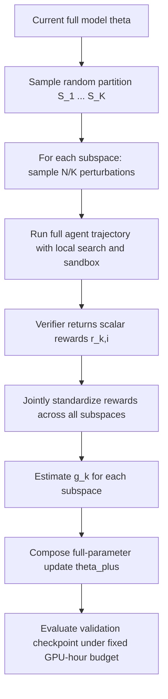

# Cooperative Coevolution for Resource-Constrained Agentic LLM Post-Training：把 Agent 后训练的显存瓶颈，换成更会用预算的子空间进化

### 元信息

| 字段 | 内容 |
|---|---|
| 原文 | [Cooperative Coevolution for Resource-Constrained Agentic LLM Post-Training](https://arxiv.org/abs/2608.02391) |
| 版本 | arXiv:2608.02391v1，2026-08-03 15:34:45 UTC 提交 |
| 作者 | Zhiyuan Wang, Shengcai Liu, Jiahao Wu, Ning Lu, Hui Ouyang, Shaofeng Zhang, Haoze Lv, Ke Tang |
| 代码 | [MetaronWang/CoPES](https://github.com/MetaronWang/CoPES)，2026-08-03 创建并推送首个提交 |
| 类型 | 大模型后训练，尤其是 tool-using agent 的资源受限 post-training |

### TL;DR

- 这篇论文研究的问题很具体：tool-using LLM agent 的轨迹很长，多轮生成、工具调用和环境反馈会把 GRPO 这类梯度式后训练推到显存瓶颈；标准 Evolution Strategy 虽然不反传、显存低，但在少量 GPU 场景下训练时间太长。
- 作者提出 Cooperative Parameter-subspace Evolution Strategy，简称 CoPES：每一步把全参数空间随机划成 `K` 个不相交子空间，只在一个子空间里扰动参数，但仍放回完整模型上下文中执行 agent 轨迹，然后把所有子空间的 reward 联合标准化并同步合成全参数更新。
- 核心机制不是“少训一些参数”，而是<u>每一步仍更新全参数</u>：它用随机子空间降低单个 reward 需要解释的扰动维度，用 `sigma_k = sqrt(K) sigma` 保持扰动范数尺度，用 joint z-score 避免不同子空间 reward 不可比。
- 主实验用 Qwen3.5-4B tool-using agent 做数学任务，在 MATH 训练集上后训练，评测 AIME 2024、AIME 2025、GSM8K、MATH-500、MATH-Test；固定到 full-parameter GRPO 最佳验证 checkpoint 的 GPU-hour 预算时，CoPES 恢复了 GRPO 验证增益的 92%，标准 ES 只有 67%。
- 显存账本是这篇最有解释力的数字：Qwen3.5-4B 在 128K context 下，full GRPO 理论需求约 453.44 GB，LoRA-GRPO 约 402.55 GB，ES/CoPES 约 12.78 GB；也就是说 LoRA 降低参数状态，但没有消除长上下文反传的 activation 成本。
- 结果边界也很清楚：实验主要是 Qwen3.5-4B、数学和多跳 QA 两类 agentic task；CoPES 在同预算内接近 full GRPO、明显好于标准 ES，但并没有证明所有模型、所有工具环境、所有 reward 形态都会同样受益。

### 研究问题：为什么 Agent 后训练不是普通 RLHF 的显存问题？

- 普通单轮推理任务里，训练样本通常是：
  - 一个 prompt；
  - 一段模型输出；
  - 一个 reward 或 verifier 判断。

- tool-using agent 的样本更像一条长轨迹：

```text
tau = (x, a_1, o_1, a_2, o_2, ..., a_T, o_T)
```

- 其中：
  - `x` 是任务输入；
  - `a_t` 是模型在第 `t` 轮选择的文本或工具动作；
  - `o_t` 是工具、检索器、sandbox 或环境返回的观察；
  - `T` 会随任务难度、工具失败、搜索分支和代码执行次数变长；
  - `R(tau)` 是整条轨迹结束后的标量奖励。

- 梯度式后训练的困难在于：
  - 需要保存模型权重、梯度、optimizer states；
  - 需要保存反向传播所需的中间 activation；
  - trajectory 越长，activation 和 logits/softmax 相关张量越多；
  - LoRA 只缩小可训练参数状态，并不取消 policy model 的反传。

- 论文把这个场景限定为资源受限设置：
  - 不是“大厂无限 GPU，可以把 ES 的慢用并行吞掉”；
  - 而是只有少量 GPU、单卡显存有限；
  - 这时标准 ES 的低显存优势很诱人，但 GPU-hour 太高会变成 wall-clock 训练时间。

### 论文主张：CoPES 要解决的是 ES 的“预算利用效率”

- 作者的 claim 可以拆成四层：

| 层次 | 主张 | 机制 | 证据 | 边界 |
|---|---|---|---|---|
| 问题层 | Agent RL 的长轨迹让 GRPO 显存压力很大 | 长上下文 activation 和 logits/softmax 张量随 context 增长 | 128K 下 full GRPO 约 453.44 GB，LoRA-GRPO 约 402.55 GB | 这是理论账本，不是所有框架的实测峰值 |
| 方法层 | ES 可以避开反传显存 | 只做 forward generation 和 reward evaluation | ES/CoPES 理论显存为 `8.68 + 0.032L` GB | ES 不自动省 GPU-hour |
| 改进层 | 子空间协同搜索能提高固定预算下的 ES 效率 | 随机划分参数子空间，联合标准化 reward，同步合成全参数更新 | CoPES 固定预算验证增益恢复 92%，标准 ES 为 67% | 主要验证在 Qwen3.5-4B |
| 实用层 | CoPES 是资源受限 agentic post-training 的折中方案 | 保留全参数更新和低显存，牺牲部分 GRPO 性能但省显存 | 数学和 QA 任务均优于标准 ES | 未来仍需更多模型、任务和自适应分组 |

- 这篇论文不是在说：
  - CoPES 一定比 GRPO 更强；
  - ES 训练成本已经不重要；
  - 子空间越多越好；
  - LoRA 在后训练中没有价值。

- 它真正想说的是：
  - 如果你的 bottleneck 是“长 agent 轨迹导致无法用 full GRPO 跑起来”；
  - 那么标准 ES 解决显存但可能太慢；
  - CoPES 试图在不回到反传的前提下，提高每个 perturbation reward 的信息利用率。

### 方法机制：从标准 ES 到 CoPES

#### Agentic post-training 目标

- 论文先把后训练目标写成：

```math
J(theta) = E_{x ~ D, tau ~ (pi_theta, E)(.|x)} [R(tau)]
```

- 变量解释：
  - `theta`：所有可训练模型参数；
  - `D`：任务分布；
  - `pi_theta`：当前 LLM policy；
  - `E`：工具环境，例如 local search 和 Python sandbox；
  - `tau`：多轮 agent 轨迹；
  - `R(tau)`：verifier 给出的标量奖励。

- 在固定 GPU-hour 预算 `B` 下，算法 `A` 得到：

```math
theta_B = A(theta_0, D, B)
```

- 所以问题不是抽象地最大化无限训练后的能力，而是：
  - 给你同样的训练预算；
  - 哪个算法得到的 `theta_B` 更好；
  - 哪个算法在少卡、低显存环境下仍能运行。

#### 标准 Evolution Strategy 的更新

- 标准 ES 每步采样 `N` 个高维 Gaussian 扰动：

```math
epsilon_i ~ N(0, I_d)
theta_i = theta + sigma epsilon_i
```

- 每个扰动模型都在同一个 batch 上跑 agent 轨迹，得到平均 reward：

```math
r_i = (1 / |B|) sum_{x in B} R(tau_{i,x})
```

- 再对 `N` 个 reward 做标准化：

```math
hat_r_i = (r_i - mu_r) / s_r
```

- 最后更新：

```math
theta_plus = theta + (alpha / N) sum_i hat_r_i epsilon_i
```

- 标准 ES 的优点：
  - 不需要反传；
  - 不存梯度和 optimizer states；
  - 不存反传 activation；
  - 可以全参数更新，不像 LoRA 只训练低秩 adapter。

- 标准 ES 的缺点：
  - 每个 reward 只告诉你“一个全维扰动整体好不好”；
  - 在数十亿维参数空间里，单个标量 reward 的解释负担很重；
  - agent 轨迹又很贵，不能无限扩大 population；
  - 少 GPU 场景无法靠大并行把 GPU-hour 换成短 wall-clock。

### CoPES 的三个关键设计

#### 设计一：随机参数子空间，而不是固定训练一小块

- CoPES 每一步把参数索引随机划成 `K` 个不相交子空间：

```math
S_k cap S_l = empty,  union_k S_k = {1, ..., d},  d_k = d / K
```

- 每个子空间得到 `N_k = N / K` 个 perturbation：

```math
epsilon_{k,i} ~ N(0, I_{d_k})
theta_{k,i} = theta + sigma_k P_k epsilon_{k,i}
```

- 这里 `P_k` 是把子空间向量嵌回全参数空间的算子。

- 这一步容易误解，关键是：
  - 每次只扰动一个子空间；
  - 但模型其余参数仍保留当前值，提供完整上下文；
  - reward 不是在孤立 adapter 上评估，而是在完整 tool-using agent 上评估；
  - 最终 `K` 个子空间更新会拼成一次全参数更新。

#### 设计二：按维度调 perturbation scale

- 如果沿用标准 ES 的 `sigma`，子空间扰动会因为维度更少而范数变小。

- 论文匹配 full-space 和 subspace 的期望平方范数：

```math
E[||delta||_2^2] = d sigma^2
E[||delta_k||_2^2] = d_k sigma_k^2
```

- 令二者相等得到：

```math
sigma_k = sigma sqrt(d / d_k) = sqrt(K) sigma
```

- 主实验里 `K = 4`，所以：
  - `sigma = 1e-3`；
  - `sigma_k = 2e-3`；
  - `alpha = 5e-4`；
  - 总 population 仍是 `N = 40`。

- 这个设计的意义：
  - 保持扰动强度可比；
  - 避免“子空间方法看起来稳定，只是因为动得更小”；
  - 后面的 ablation 也证明，单纯把标准 ES 的 `sigma` 调到 `2e-3` 并不能复现 CoPES 的收益。

#### 设计三：joint reward standardization

- CoPES 对所有子空间 reward 一起做标准化：

```math
mu_c = (1 / N) sum_{k=1}^{K} sum_{i=1}^{N_k} r_{k,i}
s_c = sqrt((1 / N) sum_{k=1}^{K} sum_{i=1}^{N_k} (r_{k,i} - mu_c)^2)
hat_r_{k,i} = (r_{k,i} - mu_c) / s_c
```

- 然后每个子空间形成方向：

```math
g_k = (1 / N_k) sum_i hat_r_{k,i} epsilon_{k,i}
theta_plus = theta + alpha sum_k P_k g_k
```

- 为什么不在每个子空间内部各自标准化？
  - 每个子空间只有 `N/K` 个样本，统计量更噪；
  - 不同子空间 reward 尺度不一致会让合成更新难以比较；
  - joint z-score 把所有扰动放在共同 reward 尺度上。

- 论文的消融结果支持这个判断：
  - joint standardization 在五个数学 benchmark 的 pass@1 上都更高；
  - 但作者没有夸大到“所有 pass@k 都统一更强”；
  - 在 GSM8K 和 MATH-500 的高 `k` 位置，曲线接近饱和并有小交叉。

### 算法流程：一轮 CoPES 怎么跑？

```text
Input:
  theta: 当前全参数
  B: 共享训练 batch
  R: verifier reward
  N: 总扰动数
  K: 子空间数
  sigma: full-space perturbation scale
  alpha: update step size

State:
  random partition seed
  perturbation seeds
  CPU weight backup

Loop:
  1. 随机划分 K 个参数子空间 S_1 ... S_K
  2. 对每个子空间设置 N_k = N / K, sigma_k = sqrt(K) * sigma
  3. 对每个子空间扰动:
     - 采样 epsilon_{k,i}
     - 构造 theta_{k,i} = theta + sigma_k P_k epsilon_{k,i}
     - 在完整 agent 环境里生成轨迹 tau_{k,i,x}
     - 用 verifier 计算 r_{k,i}
     - 恢复到同一个 pre-update theta
  4. 联合标准化所有 r_{k,i}
  5. 为每个子空间估计 g_k
  6. 同步合成全参数更新 theta_plus

Output:
  theta_plus

Failure boundary:
  如果 K 太大，每个子空间只有很少扰动，N_k 过小会让估计变差。
  如果参数强交互被随机分散，子空间估计可能破坏依赖结构。
```

### 实现细节：它不是只写了公式

- 代码仓库的结构说明这不是纯概念稿：
  - `src/CoEA/`：ES/CoPES 训练、partition、checkpoint、worker、vLLM 服务；
  - `src/GRPO/`：VeRL GRPO、tool runner、reward、rollout、dataset；
  - `src/agent/`：agent loop、tool schemas、math formatting、LLM clients；
  - `src/tools/`：local search service 和 Python sandbox；
  - `cmd/`：GRPO、LoRA-GRPO、标准 ES、CoPES、ablation、评测脚本。

- README 要求启动两个外部工具服务：
  - Local Search：基于 Wiki-18、E5 retriever、FAISS index；
  - Python Sandbox：用 Docker 隔离执行，默认 broker 端口是 `9000`。

- 这和论文实验一致：
  - 数学任务最多 3 次 local search、5 次 Python sandbox；
  - QA 任务最多 5 次 search、5 次 Python；
  - 最大 context length 是 128K；
  - 工具调用无效时会 retry；
  - 如果工具或 context 达到上限，仍尝试抽取最终答案。

- 复现边界也很明显：
  - README 里默认路径是 `/home/ubuntu/CoEA_exp`，需要替换；
  - 默认服务地址是 `10.16.51.39:8000` 和 `10.16.51.39:9000`，需要按机器改；
  - 验证环境写明 NVIDIA Driver `580.159.04`、CUDA `13.0`；
  - CoEA、GRPO、tool service 分成不同 Conda 环境，不能混装依赖。

### 实验设置：作者怎样避免只测一个玩具任务？

| 维度 | 设置 |
|---|---|
| 初始模型 | Qwen3.5-4B，数学任务另给 Qwen3.5-9B base 作为大模型参考 |
| 数学训练 | MATH 训练集，750 条 validation，移除 2 条不可用样本后 6,748 条 post-training |
| 数学评测 | AIME 2024、AIME 2025、GSM8K、MATH-500、MATH-Test |
| QA 训练 | HotpotQA 训练集，750 条 validation，89,697 条 post-training |
| QA 评测 | HotpotQA validation 5,000 条、2Wiki development 5,000 条、MuSiQue development 2,417 条 |
| Baseline | Qwen3.5-4B base、Qwen3.5-9B base、full-parameter GRPO、LoRA-GRPO、standard ES |
| 训练 batch | 所有 post-training 方法 prompt batch size 为 64 |
| ES/CoPES | `N=40`，`sigma=1e-3`，`alpha=5e-4`，CoPES 用 `K=4` |
| 选择协议 | 每 8 steps 在 held-out validation 上评估，full GRPO 最佳 checkpoint 定义 RQ2 固定预算 |

- 这个设计的好处：
  - 数学任务覆盖难题、小题、大测试集；
  - QA 任务检验另一种 reward 和工具使用形态；
  - 固定预算比较避免“谁训得更久谁赢”；
  - ablation 把 `K`、joint standardization、perturbation scale 分开。

- 仍要注意：
  - 结果依赖 verifier 和 answer extraction；
  - agent 环境是 local search + Python sandbox，不等于所有真实生产工具；
  - Qwen3.5-4B 的结论不能直接外推到 70B 或 MoE。

### 主结果：CoPES 的数字到底说明了什么？

- 论文摘要给出最核心的预算对照：
  - 在 full GRPO 最佳验证 checkpoint 的 GPU-hour 预算下；
  - CoPES 恢复了 GRPO validation-accuracy gain 的 92%；
  - 标准 ES 只恢复 67%；
  - CoPES 在五个数学 benchmark 的所有 pass@k 指标上都超过标准 ES 和 LoRA-GRPO。

- 这不是“CoPES 击败 full GRPO”的表述，而是：
  - 它以 ES 的低显存形态接近 full GRPO 的收益；
  - 它比标准 ES 更快到达有用 checkpoint；
  - 它比 LoRA-GRPO 更适合长上下文显存约束，因为 LoRA 仍要反传 activation。

- QA 结果给了更细的表格证据：

| Benchmark | Metric | Qwen3.5-4B | Full GRPO | Std. ES | CoPES |
|---|---:|---:|---:|---:|---:|
| 2Wiki | Acc. | 23.41 | 60.95 | 55.59 | 59.06 |
| 2Wiki | EM | 6.06 | 52.16 | 45.28 | 48.29 |
| 2Wiki | F1 | 8.68 | 58.49 | 51.53 | 55.50 |
| HotpotQA | Acc. | 29.51 | 53.87 | 53.22 | 53.30 |
| HotpotQA | EM | 8.27 | 47.33 | 46.52 | 46.96 |
| HotpotQA | F1 | 12.70 | 59.38 | 58.22 | 58.83 |
| MuSiQue | Acc. | 10.69 | 29.89 | 29.07 | 29.68 |
| MuSiQue | EM | 2.67 | 23.07 | 21.55 | 23.34 |
| MuSiQue | F1 | 4.75 | 33.28 | 31.70 | 33.73 |

- 从这张表看：
  - CoPES 在 9 个 QA metric 组合上全部超过标准 ES；
  - 在 HotpotQA 上几乎贴近 full GRPO；
  - 在 MuSiQue 的 EM/F1 上略高于 full GRPO；
  - 在 2Wiki 上仍落后 full GRPO，尤其 EM 和 F1 有明显差距。

- 因此更稳妥的结论是：
  - CoPES 是标准 ES 的强改进；
  - CoPES 是 full GRPO 的资源受限替代，不是全面替代；
  - 任务分布会影响它离 GRPO 的距离。

### 显存账本：为什么 LoRA 不是这篇里的最终答案？

- 附录给出 Qwen3.5-4B 参数量：

```math
P = 4,659,865,088
```

- full GRPO 固定状态包含：
  - FP32 model weights；
  - parameter gradients；
  - 两个 FP32 AdamW states。

```math
((4 + 4 + 8)P) / 2^30 = 69.44 GB
```

- LoRA-GRPO 的固定状态：
  - frozen FP32 base model：17.36 GB；
  - rank 32 LoRA 参数、梯度、optimizer states：1.19 GB；
  - 合计 18.55 GB。

- ES/CoPES 的 GPU-resident 固定状态：

```math
(2P) / 2^30 = 8.68 GB
```

- context-dependent memory 的关键差别：
  - GRPO / LoRA-GRPO：约 `3 GB / K tokens`；
  - ES / CoPES：只保留 KV cache，约 `0.032 GB / K tokens`。

- 因此作者写成：

```math
M_full(L) = 69.44 + 3L GB
M_LoRA(L) = 18.55 + 3L GB
M_ES/CoPES(L) = 8.68 + 0.032L GB
```

- 当 `L = 128`，即 128K context：
  - full GRPO：453.44 GB；
  - LoRA-GRPO：402.55 GB；
  - ES/CoPES：12.78 GB。

- 这里的研究意义是：
  - LoRA 很适合降低参数状态；
  - 但 agent 后训练真正麻烦的是长轨迹反传；
  - 如果 activation 是主成本，LoRA 并不能把问题从根上移走；
  - ES/CoPES 用 forward-only 训练改变的是计算图形态。

### 消融：CoPES 的收益来自哪里？

#### 子空间数 `K`

- 论文扩展了 `K in {1, 2, 4, 8}` 的 pass@k 曲线。

- 结果趋势：
  - `K=1` 退化为标准 ES；
  - 从 `K=1` 到 `K=4`，性能通常提高；
  - `K=8` 明显变差。

- 解释：
  - `K` 太小，维度仍然过高，reward 对扰动方向的解释能力弱；
  - `K` 太大，每个子空间只有 `N_k = 5` 个 perturbation；
  - 参数交互被切得太碎，也可能破坏 update 质量。

#### joint z-score

- 作者比较：
  - 所有子空间 reward 一起标准化；
  - 每个子空间内部独立标准化。

- 主要发现：
  - joint standardization 在五个数学 benchmark 的 pass@1 上都更好；
  - 高 `k` 上有些 benchmark 接近饱和，不能证明任意位置都绝对更优。

- 这说明作者的论证比较克制：
  - 支持 primary operating point；
  - 不把局部曲线交叉解释成失败；
  - 也不把 pass@1 收益泛化成所有采样预算收益。

#### perturbation scale

- CoPES 在 `K=4` 下使用 `sigma_k = 2 sigma`。

- 为排除“只是 sigma 更大”的解释，作者把标准 ES 也调到 `2e-3`。

- 结果：
  - 标准 ES 加大 perturbation scale 后性能下降；
  - 这说明 CoPES 的收益不是简单由更大扰动造成；
  - 子空间搜索和联合标准化才是主要机制。

### Figure/Table 证据怎么读？

| 证据位置 | 支持什么 | 不能证明什么 |
|---|---|---|
| Figure 1 | CoPES 每步随机划分子空间、评估扰动、联合标准化、合成更新的完整 workflow | 不能单独证明性能提升 |
| Table 4 | QA 任务中 CoPES 在 9 个 metric 组合上都超过标准 ES | 不能证明 CoPES 总是超过 full GRPO |
| Table S5 | 数据集规模和 split：数学 6,748 训练、QA 89,697 训练等 | 不能证明数据覆盖所有 agent 任务 |
| Figure S4/S8 | 验证 checkpoint 的选择和后峰值行为 | 不能证明 GRPO 后期下降的因果原因 |
| Figure S5 | `K=4` 通常优于 `K=1/2/8` | 不能推出固定 `K=4` 对所有模型最优 |
| Figure S6 | joint standardization 在 pass@1 上更稳 | 不能推出所有 pass@k 位置都占优 |
| Figure S7 | 标准 ES 增大 sigma 不能复现 CoPES | 不能完全排除其他实现细节贡献 |

### Mermaid：CoPES 的数据流



### 和相关工作的关系

- 相对 GRPO：
  - GRPO 是梯度式 RL，critic-free，但仍反传 policy model；
  - CoPES 不反传，使用 reward-weighted perturbation 估计方向；
  - GRPO 更接近主流高性能后训练，CoPES 更强调资源受限可运行性。

- 相对 LoRA-GRPO：
  - LoRA 降低 trainable parameter states；
  - 但长 agent trajectory 的 activation 仍要保存；
  - 在 128K 账本中，LoRA-GRPO 仍约 402.55 GB。

- 相对标准 ES：
  - 标准 ES 是 full-space perturbation；
  - CoPES 是 parameter-subspace perturbation；
  - 二者都保留 forward-only 和全参数更新。

- 相对 EGGROLL、ESSAM 等 ES 后训练工作：
  - 这些工作证明 ES 可用于 LLM 后训练；
  - CoPES 的定位是 agentic task 和资源受限固定预算；
  - 它把 cooperative coevolution 引入 full-parameter agentic LLM post-training。

### 失败案例与边界

- `K=8` 是最直接的失败信号：
  - 子空间过多；
  - 每个子空间 perturbation 太少；
  - 参数交互被过度拆散；
  - 更新质量下降。

- GRPO 后峰值下降的解释仍不确定：
  - 论文观察到后期 GRPO 输出中有 repetitive reasoning loops；
  - 但作者明确把这说成 hypothesis；
  - 不能把它当成 GRPO 一定会退化的因果证据。

- 理论显存账本不是实测峰值：
  - 作者有意省略 runtime-specific overhead；
  - 真实训练还会受 vLLM、Ray、FSDP、通信、缓存策略影响；
  - 因此数字适合比较机制，不应被当成部署 SLA。

- 工具环境仍相对受控：
  - Local Wiki Search 和 Python Sandbox 是清晰、可验证的工具；
  - 生产 agent 可能有网页浏览、数据库写入、文件系统、API side effects；
  - reward 延迟、工具安全、失败恢复都会更复杂。

- 模型规模没有充分扩展：
  - 主体是 Qwen3.5-4B；
  - 9B 只作为 base reference；
  - 还没有看到 14B、32B、70B、MoE 或多节点异构集群下的系统性结果。

### 可复现性检查

- 正面证据：
  - 论文给出 arXiv HTML/PDF；
  - 代码仓库公开；
  - README 有端到端环境说明；
  - `cmd/` 覆盖主实验和 ablation；
  - 附录给出数据 split、工具限制、评测协议、显存账本。

- 复现门槛：
  - 需要 CUDA 13.0 相关栈；
  - 需要独立环境跑 CoEA、GRPO 和 tool service；
  - 需要下载 Wiki-18、E5、FAISS index、Qwen3.5 base models；
  - 需要 Docker sandbox；
  - 默认 IP 和路径都不是开箱即用。

- 我会把这篇归为：
  - 研究证据较完整；
  - 工程复现成本较高；
  - 非常适合做方法深读；
  - 暂不适合被轻描淡写地包装成“低显存 GRPO 替代品”。

### 外部参考搜索与负证据

- 本轮检索了三个方向的外部参考：
  - 论文全名；
  - `CoPES` 与 `Agentic LLM Post-Training`；
  - `Cooperative Parameter-subspace Evolution Strategy`。

- 当前可见结果主要是：
  - arXiv 官方页；
  - arXiv new/list 页面；
  - Papers Cool 这类 arXiv 聚合页；
  - Hugging Face arXiv 展示类页面；
  - 作者官方 GitHub 仓库。

- 没有找到成熟第三方复现、作者长帖、issue 讨论或独立 benchmark 复测。

- 这个负证据对解读很重要：
  - 论文是 2026-08-03 刚提交；
  - 代码仓库也是同日初始化；
  - 因此当前证据主要来自作者论文和官方代码；
  - 还没有社区对训练成本、脚本可运行性、结果稳定性的独立检验。

- 所以本文对结果的语气必须保持分层：
  - “作者报告”可以明确写；
  - “理论显存估计”可以解释；
  - “代码公开”可以核对；
  - “生产可用”不能直接下结论；
  - “比 GRPO 更好”更不能概括化。

### 如果把它放进真实训练决策，该怎么判断？

| 约束问题 | 更适合的选择 | 原因 | 仍要补的检查 |
|---|---|---|---|
| 单卡/少卡显存不足，长上下文 agent 轨迹跑不动 GRPO | CoPES 或标准 ES | forward-only 避免反传 activation | 训练 wall-clock、工具服务吞吐、reward 噪声 |
| 有足够高显存 GPU，希望最高单任务效果 | full GRPO | 论文里 full GRPO 仍是强 baseline | 后峰值下降、looping、checkpoint 选择 |
| 只想快速做小规模 adapter 试验 | LoRA-GRPO | 工程栈成熟，参数状态低 | 长 context activation 仍可能爆显存 |
| reward 很稀疏，工具调用失败多 | 不宜直接照搬 | ES reward 方差可能很高 | 增加 dense reward、失败分类和轨迹诊断 |
| 工具有副作用或权限风险 | 先做安全环境和 reward 约束 | 后训练可能强化危险工具策略 | sandbox、权限、审计、拒绝策略 |

- 对资源受限团队来说，CoPES 的真正吸引力是：
  - 不需要先拥有能跑 full GRPO 的硬件；
  - 可以用较低显存做 full-parameter search；
  - 比标准 ES 更会利用固定 perturbation budget；
  - 代码仓库把 GRPO、ES、CoPES 和 ablation 脚本放在同一实验框架里，方便做横向比较。

- 但决策前至少要补四类测量：
  - 每个 training step 的平均 trajectory 长度；
  - local search 和 sandbox 的等待时间；
  - reward 方差和无效答案比例；
  - checkpoint 间 pass@k 方差，而不只是最优点。

### 安全 reward 的边界：低显存训练也可能强化坏行为

- CoPES 解决的是优化和资源问题，不自动解决 AI 安全问题。

- 如果 reward 只奖励最终答案正确：
  - agent 可能学会更多 search；
  - 也可能学会更激进地调用 Python；
  - 可能用不合规方式绕过格式限制；
  - 甚至可能把工具失败重试变成高频策略。

- 对带工具 agent，reward 至少应拆成几类：

```math
R_total = R_task + lambda_1 R_format + lambda_2 R_tool_safe - lambda_3 C_tool - lambda_4 C_risk
```

- 变量解释：
  - `R_task`：最终任务正确性；
  - `R_format`：答案格式、可抽取性、引用格式；
  - `R_tool_safe`：工具调用是否在允许 schema、权限和上下文内；
  - `C_tool`：工具次数、执行时间、检索成本；
  - `C_risk`：越权调用、危险代码、外部写入、疑似 prompt injection 响应；
  - `lambda_i`：不同目标的权重。

- 如果未来把 CoPES 用于浏览器 agent、代码 agent 或企业 API agent，应优先报告：
  - tool-call rejection rate；
  - invalid tool-call retry rate；
  - sandbox timeout rate；
  - side-effect attempts；
  - unsafe success cases；
  - reward hacking examples。

- 否则会出现一个研究风险：
  - 模型最终答案更好；
  - 但工具行为更不可控；
  - 评测只看 `pass@k`，没有发现 agent policy 已经偏向危险路径。

### 论文最值得复用的写法

- 这篇论文的结构对后训练研究有参考价值：
  - 先给系统瓶颈，不只讲算法；
  - 再给理论成本账本，明确显存项来自哪里；
  - 然后把方法拆成三个可消融设计；
  - 最后用固定预算比较，而不是只比较最终最高分。

- 对类似论文，我会建议沿用这套审稿问题：
  - 你的资源约束是什么，显存、GPU-hour、wall-clock 还是工具服务？
  - 你的方法降低的是哪一项成本？
  - baseline 是否在同一预算、同一 agent 环境、同一 verifier 下比较？
  - 结果是否有 ablation 排除平凡解释？
  - 是否报告失败模式，而不是只给最优曲线？

- CoPES 的强点正是在这里：
  - `K` 的消融排除了“子空间越多越好”；
  - `sigma` 的消融排除了“只是扰动更大”；
  - joint standardization 的消融解释了 reward 归一化的作用；
  - memory accounting 解释了为什么 LoRA 在长轨迹场景仍不够。

### 研究者视角的延伸追问

- 第一个问题：子空间如何自适应？
  - 当前 CoPES 每步随机划分；
  - 但 Transformer 参数存在层、注意力头、MLP、embedding、tool-use 行为相关模块等结构；
  - 如果能基于 reward sensitivity、Fisher 信息、activation attribution 或历史扰动收益做 adaptive partition，可能进一步提升样本效率。

- 第二个问题：agent tool policy 的哪些部分最适合 ES？
  - ES 对不可微环境友好；
  - tool-use 的 reward 往往稀疏、延迟、带执行失败；
  - 但不同模块对扰动的敏感性不同；
  - 未来可以比较 full-parameter CoPES、layer-wise CoPES、tool-head-only CoPES、routing-module CoPES。

- 第三个问题：CoPES 如何处理安全约束？
  - agent 后训练不只是把正确率推高；
  - 工具调用会引入权限、越权执行、sandbox escape、prompt injection 等风险；
  - 如果 reward 只看答案，CoPES 也可能强化危险策略；
  - 更稳的做法是把 correctness reward、tool safety reward、budget penalty 和 refusal/containment reward 共同纳入验证器。

- 第四个问题：低显存并不等于低成本。
  - CoPES 降低的是 GPU memory bottleneck；
  - 它仍要运行大量 perturbed agent trajectories；
  - 如果工具调用昂贵、sandbox 慢、检索服务瓶颈明显，训练总成本仍可能高；
  - 因此真实系统应同时报告 GPU-hour、wall-clock、tool-service CPU/RAM、sandbox failure rate、API cost。

- 第五个问题：评测要覆盖“会不会更会用工具”，而不是只看最终答案。
  - 数学和 QA reward 主要验证最终正确性；
  - agentic post-training 还应该追踪工具调用次数、无效调用、重复搜索、代码执行失败、上下文溢出、危险工具倾向；
  - 否则一个低显存训练法可能在答案指标上有效，却在工具行为上制造新风险。

### 结论

- CoPES 的价值不在于提出一个更响亮的 RL 算法名，而在于把 agent 后训练的约束拆清楚：
  - full GRPO：性能强，但长轨迹显存重；
  - LoRA-GRPO：参数状态轻，但 activation 仍重；
  - 标准 ES：显存轻，但固定预算效率弱；
  - CoPES：用子空间协同搜索提高 ES 在少 GPU 场景下的可用性。

- 对研究者来说，这篇最值得带走的是两个判断：
  - <u>Agent 后训练的瓶颈不只是优化算法，而是轨迹长度、工具环境和显存账本共同形成的系统问题。</u>
  - <u>如果 reward 只能以标量反馈长轨迹，减少单次扰动需要解释的参数维度，是提高 ES 信号效率的一条合理路线。</u>

- 但边界也必须保留：
  - 它尚未证明能替代 full GRPO；
  - 它尚未覆盖更多模型规模和真实复杂工具环境；
  - 它的复现依赖较重；
  - 它降低的是显存约束，不自动解决安全 reward、工具权限和生产 agent 的 side effect 问题。
