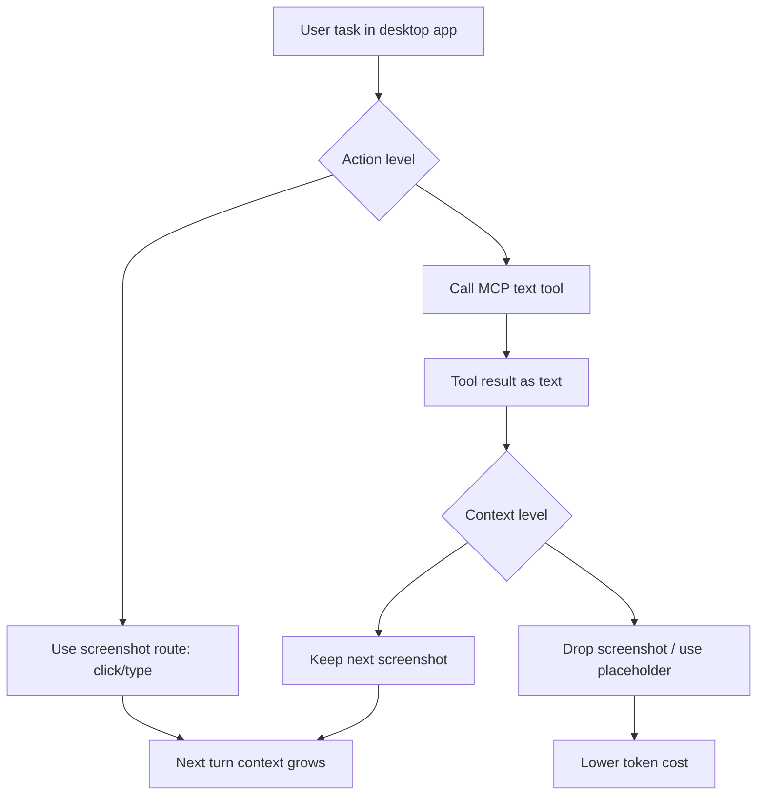

# Screenshots or Tools?：GUI-MCP 混合 Agent 不是“有工具就会用工具”

**原文**：[Screenshots or Tools? Eliciting Tool Use and Managing Multimodal Context in Hybrid GUI-MCP Computer-Use Agents](https://arxiv.org/abs/2608.03327)

**类型**：论文  
**领域**：大模型 Agent / Computer-use Agent / GUI-MCP / 后训练  
**版本**：arXiv:2608.03327v1，2026-08-04 08:35:51 UTC

### TL;DR

1. **这篇论文问的是混合 computer-use Agent 的基础选择题：截图还是工具？**作者把问题拆成两个层次：action level 选择 GUI 点击/键入还是 MCP text tool；context level 在工具调用成功后，下一张截图是否还需要保留。
2. **核心发现不是“工具一定有用”，而是同一套工具会因模型决策行为而符号反转。**在同一个 OSWorld-MCP 309-task GUI-MCP harness 下，MCP tools 让 reasoning model 提升 +4.0pp，却让 non-reasoning model 下降 -5.9pp，5-run means 且都超过 2SE。
3. **即使 reasoning model 受益，它仍严重少用工具。**工具可达任务有 230/309，但 Thinking checkpoint 只在 55/309 tasks 调用工具，即 task-level adoption 17.8%，reachable adoption 23.9%；作者把这个缺口称为 adoption gap。
4. **多轮 RL 能移动“是否调用工具”，但不能自动补上工具语义能力。**dense tool bonus 将 spreadsheet adoption 从 0.03 提到 0.33，并迁移到 greedy decoding，但 held-out accuracy 不跟随；工具调用执行成功不等于语义成功。
5. **上下文层面的压缩更有部署价值。**window-2 + drop-on-success 能把输入 token 降到约 53% 成本；单纯 inference-time 压缩会损失约 -3.9pp，但在同一 observation rule 下训练后，step-40 compressed checkpoint 达到 37.8%，对比 uncompressed base operating point 的 33.0%。
6. **最重要的工程结论是：混合 Agent 的瓶颈不在“有没有工具”，而在 tool-decision、tool-call semantics 和 train-inference observation matching。**继续堆 MCP server 或加 reward bonus 只能解决一部分问题。
7. **局限很明确。**结果只比较同一 8B backbone 的 Thinking 与 Instruct 两个 checkpoint，不能证明 reasoning trace 是唯一因果；RL 没补上工具语义；compression recovery 的 full-suite 增益有训练集贡献，跨 OS 和更多模型仍未验证。

### 1. 研究问题：为什么“工具可用”不等于“工具有用”？

#### 1.1 Computer-use Agent 有两条行动路线

| 路线 | 典型动作 | 优点 | 成本和风险 |
|---|---|---|---|
| Screenshot / GUI | 看截图、点坐标、键盘输入 | 通用，几乎所有软件都可操作 | vision token 贵，坐标易过期，多轮视觉历史膨胀 |
| Text tool / MCP | 调用 CLI、MCP server、agent skill | 精确、便宜、可结构化返回 | 覆盖有限，参数语义难，调用结果未必有视觉确认 |

混合 Agent 同时暴露两条路线。常见直觉是：

1. 有工具就应该能减少 GUI 操作；
2. 工具调用比截图便宜；
3. 给模型注入 tool schema 应该至少不坏；
4. 如果工具没带来收益，可能是工具本身质量差。

这篇论文反过来问：

1. 工具已经存在时，模型会不会选择它？
2. 工具调用成功时，模型是否理解参数语义？
3. 工具返回文本后，下一张截图是否仍有必要？
4. 训练时没见过压缩观察，部署时直接压缩会不会形成 OOD？

#### 1.2 两个层次的 screenshots-or-tools



论文贡献在于把两个选择分开测：

1. **Action level**：工具被注入后，模型是否调用，调用是否提高任务成功率。
2. **Context level**：工具成功后，能不能少保留截图，降低 token 成本。
3. **RL probes**：分别测试“调用决策能否被奖励移动”和“压缩观察能否通过匹配训练恢复精度”。

### 2. 实验设置：同一 harness、两个 checkpoint、309 个任务

#### 2.1 模型和 benchmark

| 项目 | 设置 |
|---|---|
| Backbone | Qwen3-VL-8B |
| Reasoning checkpoint | Qwen3-VL-8B-Thinking |
| Non-reasoning checkpoint | Qwen3-VL-8B-Instruct |
| Benchmark | OSWorld-MCP `test_all_no_internet` |
| 任务数 | 309 |
| MCP tool inventory | 120 tools, 9 application namespaces |
| Retrieval | BM25 top-18, keyed by active application |
| 解码 | greedy decoding |
| 最大步数 | `max_steps = 50` |
| 重复 | 5 repeated runs |
| 显著性 | `|Delta| > 2 SE` |

关键控制变量是：

1. harness 固定；
2. retriever 固定；
3. prompt template 固定；
4. tool set 固定；
5. 只比较两个 checkpoint 的行为差异。

这让“工具注入效果符号反转”更有说服力：不是不同工具、不同 benchmark、不同 prompt 造成的表面差异。

#### 2.2 统一 action space

模型每一步都可以：

1. 继续走 GUI：根据截图输出坐标动作；
2. 调 MCP：在当前 application namespace 里选择工具；
3. 终止任务：声明完成。

其中 MCP tool retrieval 是动态的：

1. 当前应用决定候选工具集合；
2. 多应用任务切换时，工具集合也变化；
3. 每步最多注入 top-18 tools；
4. 工具执行后返回结构化文本和 error feedback。

### 3. 主结果一：同一 MCP 注入对两个模型符号相反

#### 3.1 Overall result

| 模型 | GUI only | GUI+MCP window-4 | 变化 | 解读 |
|---|---:|---:|---:|---|
| Thinking | 30.5% | 34.5% | +4.0pp | 工具有帮助 |
| Instruct | 25.4% | 19.5% | -5.9pp | 工具有伤害 |

这就是论文标题里第一个“Screenshots or Tools?”：

1. 同样的工具不是单调收益；
2. 工具注入的符号取决于模型如何做 tool decision；
3. non-reasoning model 不是“更谨慎地不用工具”，而是更频繁误判终止、忽略工具或误用名称；
4. reasoning model 能避免这些失败，但仍远未充分采用工具。

#### 3.2 Per-domain decomposition

论文把 309 个任务拆到 calc、writer、impress、vs_code、os、multi_apps、gimp、thunderbird、vlc、chrome 等域。

值得单独看的是：

| 域 | 现象 | 为什么重要 |
|---|---|---|
| writer | Thinking 工具采用率 52%，但 invoked tasks 成功率低于 non-invoked | 高 adoption 不等于高 competence |
| vs_code | Thinking 从 57.1 到 68.6 | 工具可能在结构化代码任务里更有价值 |
| vlc | 16/17 tasks tool-reachable，但两个模型 adoption 都是 0 | 工具可达不代表模型会想到用 |
| gimp / thunderbird / chrome | zero-adoption block | 准确率变化更多是 prompt perturbation 和随机性 |

Appendix E 里一个关键负例是 writer：

1. 调用工具的任务成功率约 42%；
2. 不调用工具的任务成功率约 82%；
3. 原因可能是 difficulty self-selection，也可能是 writer 工具参数复杂导致 mis-parameterized calls。

### 4. Adoption gap：工具供应充足，但模型没有形成调用习惯

#### 4.1 Table 3 的诊断数字

| 指标 | Thinking | Instruct |
|---|---:|---:|
| Tool-reachable supply | 230/309 | 230/309 |
| Task-level adoption | 17.8% (55/309) | 10.4% (32/309) |
| Reachable adoption | 23.9% | 13.9% |
| TIR: MCP steps / total steps | 2.8% | 2.0% |
| False-success rate | 21.7% (67/309) | 33.0% (102/309) |
| Hallucinated tool names | 0 | 97, concentrated in 2 tasks |

作者把这个称为 adoption gap，因为：

1. 230 个任务工具可达；
2. Thinking 只在 55 个任务里实际调用工具；
3. reachable adoption 只有 23.9%；
4. VLC 这种几乎全工具可达的域也完全不调用。

#### 4.2 为什么不是简单“多奖励工具调用”？

如果问题只是模型懒得调用工具，那么 RL 给工具调用奖励应该既提高 adoption 又提高 accuracy。

论文的 Section 5.2 刚好测试这个假设：

1. 用 multi-turn GRPO；
2. 在 24-task spreadsheet subset 上加 dense tool bonus；
3. bonus 只奖励 execution-successful、non-read-only、未重复的 tool call；
4. bonus 放在 group normalization 之后，避免被轨迹平均和 z-score 稀释。

结果是：

| 结果 | 数字 | 解读 |
|---|---:|---|
| spreadsheet adoption | 0.03 -> 0.33 | 调用决策完全可被 steering |
| greedy adoption | 0.02 -> 0.29 | 不是采样噪声，迁移到 deterministic policy |
| step-level usage | 4.7x | 行为显著改变 |
| held-out accuracy | no sustained fail-to-pass flips | competence 没跟上 |
| regex find-and-replace semantic success | 0/23 | 工具执行成功不等于语义成功 |
| format conversion semantic success | 0/16 | 参数语义瓶颈仍在 |

论文的判断很直接：

```text
RL can move tool decision.
RL does not automatically teach tool-call semantics.
```

这对 Agent 后训练很重要：奖励“用了工具”只能教会调用频率，不能教会什么时候该用、参数怎么填、返回文本如何验证。

### 5. Context level：截图历史是成本瓶颈，但压缩必须匹配训练分布

#### 5.1 context construction 公式

论文将第 `t` 轮上下文写成：

```text
C_t =
  sigma(T_t)
  + windowed visual memory from tau_t to t-1
  + current user input u_t
  + instruction I
  + current screenshot H_t

tau_t = max(1, t - k + 1)
```

其中：

1. `k=4` 表示保留最近 4 张截图；
2. `k=2` 表示保留最近 2 张截图；
3. `drop-on-success` 在前一步 MCP 成功后，用文本 placeholder 替换下一张截图；
4. `window-2 + drop` 是 token-efficient knee。

#### 5.2 Accuracy-token frontier

| Thinking 配置 | Accuracy | Cumulative input | Peak p95 | Tok / 1%Acc |
|---|---:|---:|---:|---:|
| GUI only window-4 | 30.5 | 313.1K | 11385 | 10.6K |
| GUI+MCP window-4 operating point | 34.5 | 337.1K | 11544 | 10.1K |
| window-2 | 30.6 | 226.1K | 7314 | 7.8K |
| window-4 + drop | 32.3 | 342.4K | 11487 | 11.0K |
| window-2 + drop ctx_opt | 30.6 | 219.5K | 7243 | 7.7K |

作者的结论不是“立刻压缩就好”：

1. window depth 是主要 token lever；
2. window-2 能把输入成本降约三分之一；
3. 但 inference-only window-2 + drop 带来约 -3.9pp 损失；
4. drop rule 单独几乎不伤 accuracy，但不是主要 token lever；
5. 只有缩短 window 后，drop 才体现成本收益。

### 6. Multi-turn RL 的第二个结果：匹配 observation rule 才能拿回压缩收益

#### 6.1 训练设置

作者复用 multi-turn GRPO recipe，但把 `lambda_mcp` 设为 0，不再奖励工具调用。唯一变化是：

1. rollout 时启用压缩 observation policy；
2. evaluation 时也使用同一压缩 policy；
3. deployment 也按同一规则构造上下文；
4. 也就是 train、eval、deploy 的 observation rule 完全匹配。

两个 pre-registered criteria：

1. D13 degraded subset：13 个 inference-only compression 明显掉点的任务；
2. difference-in-differences：compressed-side gain 要比 rich-side gain 多至少 15pp。

#### 6.2 结果怎么读？

| 指标 | 结果 | 边界 |
|---|---|---|
| training reward | 0.52 -> 0.667, peak step 41 | in-distribution 可能含 memorization |
| step-40 compressed checkpoint | 37.8% | 对比 uncompressed base 33.0%，full-suite +4.8pp |
| input cost | 53% | 半成本附近运行 |
| peak context | -37% | 长程 serving 压力明显下降 |
| 235 non-training tasks | +0.8pp, n.s. | held-out 不损失，但也不是强泛化提升 |
| D13 rich-lean gap | step 30 collapse to 0 | 方向成立 |
| DiD threshold | 未达到 +15pp | 作者按失败记录，没有重设阈值 |

这段最值得肯定的是审慎：

1. full-suite 37.8% 很好看；
2. 但约 4.1pp margin 来自 74 个 training tasks；
3. 作者没有把它包装成强 OOD 泛化；
4. 真正稳健的结论是“matched observation rule 消除了压缩部署的 OOD 成本”。

### 7. 关键 Figure / Table 逐项证据

| 图表 | 支持的 claim | 不能证明什么 |
|---|---|---|
| Figure 1 | action level 和 context level 都是 screenshots-or-tools 选择 | 不证明视觉路线可以被完全替代 |
| Table 2 | 同一 MCP harness 下 Thinking +4.0pp、Instruct -5.9pp；不同 context policy 有成本-准确率 trade-off | 不说明所有模型都有同样符号反转 |
| Table 3 | adoption gap、false-success、hallucinated tool names 是行为差异核心 | 不证明 reasoning trace 是唯一因果 |
| Figure 2 | dense tool bonus 能把 adoption 移入 greedy policy | 不证明 accuracy 会跟随 |
| Figure 3 | compressed checkpoint 在部署平面上达到 37.8% 与 53% input cost | full-suite 增益含训练集贡献 |
| Figure 4 | D13 rich-lean gap 可以通过 matched training 关闭 | DiD +15pp criterion 未过 |
| Table 5 | window-2 + drop 是 token-efficient knee | 单独 inference compression 有准确率成本 |
| Table 6 | GRPO、KL、bonus、长度惩罚等训练细节可复查 | 单次训练配置不足以覆盖所有 reward designs |

### 8. 对 Agent 工程的直接启发

#### 8.1 MCP server 不是“装上就有收益”

一个 GUI-MCP Agent 至少要解决三类问题：

1. **Supply**：有没有覆盖当前 app 和 task 的工具。
2. **Decision**：模型是否知道什么时候用工具。
3. **Semantics**：模型是否能正确填参数、理解返回、验证副作用。

论文显示 supply 已经不低：

1. 230/309 tasks tool-reachable；
2. 120 tools 覆盖 9 个 application namespaces；
3. 但 Thinking reachable adoption 只有 23.9%；
4. 说明瓶颈不在 inventory 本身。

#### 8.2 工具奖励要从“调用”升级到“语义成功”

更合理的训练信号应该分层：

```text
reward_tool_use:
  + choose tool when cheaper route is valid
  + pass arguments that change the intended state
  + verify result against visual/text evidence
  - repeated side-effect-free calls
  - false success termination
  - tool call when GUI route is safer or tool-unreachable
```

也就是说：

1. `success:true` 不能直接当 semantic success；
2. zero-replacement find-and-replace 需要负反馈；
3. formatter conversion 需要检查实际文档状态；
4. 工具调用后的截图是否丢弃，应依赖结果可验证性。

#### 8.3 上下文压缩要和训练时 observation 一致

部署上最容易犯的错是：

1. 训练时给 full screenshot history；
2. 上线时为了省钱改成短窗口；
3. 工具成功后直接 drop screenshot；
4. 然后把准确率下降归因于“模型不够强”。

这篇论文给出的反例是：

1. inference-only compression 掉约 -3.9pp；
2. matched training 后 compressed policy 可在 53% input cost 下运行；
3. 235 non-training tasks 没有显著损失；
4. 所以问题更像 observation distribution mismatch。

### 9. 与近期 Agent 后训练工作的关系

这篇论文连接了两个方向：

1. **Agent 工具使用**：
   - 工具调用不是简单 API selection；
   - 它包含时机、参数、返回验证和上下文管理；
   - GUI 与 MCP 是互补路线，不是替代关系。

2. **多轮 RL / GRPO**：
   - dense bonus 能改变局部行为；
   - outcome-only signal 对具体工具语义 credit assignment 太粗；
   - train-inference observation matching 比单纯奖励工具调用更接近部署收益。

可以把它和 Tool-Integrated Reasoning、turn-level credit assignment、CUA inference-time scaling 这几条线连起来看：

| 问题 | 这篇论文的答案 |
|---|---|
| 为什么工具不用？ | 有 cheaper visual route，训练没要求模型选择工具 |
| 为什么用了也不准？ | 参数语义和状态验证没学会 |
| 为什么压缩会掉点？ | 部署 observation rule 与训练分布不一致 |
| RL 能修什么？ | 能修 adoption 或 observation adaptation，暂时没修 tool competence |

### 10. 结论与局限

#### 10.1 可以接受的结论

1. 在 OSWorld-MCP 309 tasks 上，MCP tools 的效果依赖模型 tool-decision behavior。
2. Reasoning checkpoint 与 non-reasoning checkpoint 在同一 harness 下出现符号反转。
3. 工具 adoption 是可被 RL 奖励移动的行为变量。
4. 工具调用语义能力不是 dense adoption bonus 自动带来的。
5. context compression 的收益需要 train/eval/deploy observation rule 匹配。

#### 10.2 必须保留的边界

| 局限 | 影响 |
|---|---|
| 两个 checkpoint 差异不止 reasoning trace | 不能证明 reasoning trace 是唯一因果机制 |
| 只用 Qwen3-VL-8B 系列 | 不能直接外推到 Claude/OpenAI/其他 CUA |
| RL run 配置有限 | 不能排除更好的 reward 或数据能补上 tool semantics |
| compression recovery full-suite 含训练集贡献 | 37.8% 不能简单当 OOD 泛化数字 |
| tool success 有 execution/semantic gap | 需要更强状态验证和环境反馈 |

#### 10.3 最终判断

这篇论文最有价值的判断是：

1. 混合 Agent 的能力不是 GUI 能力 + MCP 能力的线性相加；
2. 关键变量是 policy 是否知道该走哪条路线；
3. 如果路线选择错了，工具会从资产变成干扰；
4. 如果参数语义没学会，奖励工具调用会制造“更会调用但不更会完成任务”的模型；
5. 如果观察分布不匹配，省 token 的部署规则会变成 accuracy tax。

### 11. 更细的机制解释：为什么 action-level steering 没有变成能力提升？

#### 11.1 工具调用有三种“成功”

论文里最容易被忽略的一点是，工具调用的成功可以分成三层：

| 层次 | 判断方式 | 论文里的失败例子 |
|---|---|---|
| API execution success | server 返回 `success:true` | regex find-and-replace 调用成功但替换 0 处 |
| semantic state success | 应用状态真的变成目标状态 | format conversion 参数不对，执行了但文档没达到要求 |
| task success | benchmark 最终判定任务完成 | 工具调用改变了轨迹，但 held-out accuracy 不上升 |

dense tool bonus 主要奖励第一层。它能让模型更常调用工具，却没有告诉模型：

1. 这个任务是否应该调用工具；
2. 应该选择哪个 tool name；
3. 参数应该如何从视觉状态或用户目标中抽取；
4. 工具返回 `success:true` 后是否还要验证界面；
5. 如果工具“机械成功、语义失败”，下一步该如何修复。

所以作者说 bottleneck lies in tool-call semantics。这个判断比“RL 没效果”更准确：RL 确实有效移动了 adoption，只是优化目标没有覆盖真正缺失的语义能力。

#### 11.2 为什么 false-success 尤其危险？

Table 3 显示 false-success rate：

| 模型 | False-success rate |
|---|---:|
| Thinking | 21.7% (67/309) |
| Instruct | 33.0% (102/309) |

false-success 会同时伤害 action 和 context 两层：

1. **Action level**：
   - 模型以为工具完成任务；
   - 提前终止；
   - benchmark 判失败。

2. **Context level**：
   - drop-on-success 规则看到 MCP 成功；
   - 下一张截图被替换成 placeholder；
   - 如果工具只是机械成功，模型丢掉了发现错误的视觉证据。

这解释了为什么 window-2 + drop 不能被当作无条件省钱策略。它必须和更强的 semantic success detector 或 matched training 一起使用。

### 12. 公式块：把论文的两个训练信号翻译成人话

#### 12.1 轨迹回报

论文给每条轨迹 `tau` 一个 outcome-dominant return：

```text
R(tau) =
  succ(tau)
  - lambda_len * T / T_max
  - lambda_cap * 1[T >= T_max]

where:
succ(tau) in {+1, -1}
lambda_len = 0.05
lambda_cap = 0.20
T_max = 50
```

含义：

1. 成功/失败是主信号；
2. 长轨迹有轻微惩罚；
3. 撞到最大步数再额外扣分；
4. 这避免模型靠拖长轨迹获得更多训练样本。

#### 12.2 post-normalization dense tool bonus

```text
A_hat_t =
  (1 / T) * (R(tau) - mu_x) / sigma_x
  + lambda_mcp * b_t

where:
b_t = 1 if this step is a successful, non-read-only, non-repeated MCP call
lambda_mcp = 0.1
```

关键设计是 bonus 放在 normalization 之后：

1. 如果放进 `R(tau)`；
2. 再经过 trajectory average、z-score、`1/T` broadcast；
3. 信号会被稀释到约 `1e-4`；
4. 作者实测这是 dead signal。

这说明多轮 Agent RL 的 credit assignment 不能只看“有没有奖励项”，还要看奖励项进入优势估计的位置。

### 13. 对训练数据的启发：需要什么样的 tool-use 监督？

论文的负结果实际指出了下一批数据应该长什么样。

#### 13.1 只收成功轨迹不够

如果只收“任务成功且用了工具”的轨迹，模型可能学到：

1. 工具调用频率；
2. 常见 tool name；
3. 一些表面参数模板。

但它仍可能学不到：

1. 工具适用前提；
2. 视觉状态到参数的 grounding；
3. 工具执行后如何验证；
4. 失败返回和 zero-effect success 的区别；
5. 何时回退到 GUI。

#### 13.2 更好的数据 schema

```text
tool_use_trace:
  user_goal
  visual_state_before
  candidate_tools
  selected_tool
  argument_derivation:
    source_ui_elements
    transformed_parameters
    assumptions
  execution_result:
    api_success
    semantic_delta
    screenshots_after
  verification:
    expected_state
    observed_state
    pass_or_repair
  fallback:
    if tool failed semantically, next GUI/tool action
```

这类数据比单纯 action log 更贵，但能直接对准论文发现的瓶颈：工具语义和状态验证。

### 14. 对推理系统的启发：router、工具和截图应该协同，而不是互相覆盖

#### 14.1 运行时策略可以更保守

在没有重新训练之前，一个生产 GUI-MCP Agent 可以先做几条保守规则：

| 场景 | 建议 |
|---|---|
| 工具返回只说明 API 成功 | 不立即 drop 下一张截图 |
| 工具有复杂参数或 regex | 要求视觉/文本二次验证 |
| 当前 app tool coverage 不完整 | 保留 GUI route，不强推工具 |
| 多应用任务切换 | 重新检索 active app toolset |
| 模型 hallucinate tool name | 不把错误 tool call 当作普通失败，要回写负例 |
| false terminate 高 | 终止前加 state check |

这些规则不如训练优雅，但能避免把工具注入变成静默风险。

#### 14.2 context compression 的决策边界

drop-on-success 更适合以下情况：

1. tool result 包含完整 state delta；
2. 参数空间简单；
3. 任务目标可以从文本返回直接验证；
4. 后续步骤不依赖屏幕布局；
5. 训练时见过同样的 placeholder。

不适合以下情况：

1. 工具返回 `success:true` 但可能 zero effect；
2. 后续操作依赖视觉位置；
3. UI 状态可能因弹窗、焦点或格式变化偏移；
4. 任务需要颜色、布局、图像等非文本证据；
5. 模型没有在压缩 observation 上训练过。

### 15. 论文中的负控精神：哪些地方作者没有过度包装？

这篇论文有几个值得保留的写法：

1. **显著性门槛明确。**
   - 5-run means；
   - `|Delta| > 2SE` 才称显著。

2. **zero-adoption domains 不拿来强解释。**
   - 没有工具调用时，准确率变化可能只是 prompt perturbation；
   - 作者把它们从 per-domain adoption 机制计数里排除。

3. **DiD criterion 未过就记录失败。**
   - D13 rich-lean gap 方向成立；
   - 但 +15pp threshold 未达；
   - 作者没有事后调阈值。

4. **full-suite 37.8% 不被包装成 OOD。**
   - 约 4.1pp margin 来自 training tasks；
   - 真正可迁移的结论是 held-out non-training tasks 没显著损失。

5. **reasoning trace 不是被证明的因果机制。**
   - 两个 checkpoint 差异不只 trace；
   - 需要 within-model thinking toggle 才能定因果。

这种审慎对 Agent 论文很重要。很多工具使用论文容易把“工具可用”“调用次数上升”“最终成功率上升”混成一个故事，而这篇论文把它们拆开，反而更能指导工程。

### 16. 与安全的连接：为什么 AI 安全读者也该关心这篇 Agent 论文？

虽然它不是攻击论文，但它揭示了几个安全相关风险：

1. **false-success 会扩大误操作。**
   - Agent 以为工具成功，可能提前结束；
   - 在真实系统里，这可能对应错误文件、错误付款、错误配置。

2. **工具语义不清会放大权限风险。**
   - MCP tool 往往有更高权限和更低 token 成本；
   - 如果模型不理解参数，错误调用比 GUI 错点更难被用户察觉。

3. **context drop 可能删除审计证据。**
   - 工具调用后丢截图能省 token；
   - 但也可能丢掉发现工具无效或副作用异常的证据。

4. **reward hacking 需要在 step 级别防范。**
   - 作者限制 bonus 只对 non-read-only、non-repeated、execution-successful call 生效；
   - 这是为了防止重复无副作用调用刷奖励；
   - 生产训练也需要类似防刷设计。

因此，GUI-MCP Agent 的安全策略不应只问“工具是否危险”，还应问：

1. 模型是否知道何时不该用工具；
2. 工具结果是否经过语义验证；
3. 成功信号是否可能被奖励函数误读；
4. 上下文压缩是否丢掉了事故调查证据。

### 17. 继续研究的问题

后续工作可以沿五条线推进：

1. **within-model causality**
   - 使用同一模型的 thinking on/off；
   - 分离 reasoning trace、SFT 数据和 decoding style 的因果。

2. **semantic tool-use data**
   - 收集带参数推导和状态验证的工具轨迹；
   - 不只收“调用了哪个工具”。

3. **learned context policy**
   - 不固定 window-2 / window-4；
   - 让模型或 controller 学习何时保留截图、何时折叠。

4. **cross-OS / cross-app scaling**
   - OSWorld-MCP 只是一个 desktop benchmark；
   - 需要扩展到 mobile、browser、IDE、enterprise SaaS。

5. **route-aware safety evaluation**
   - 同时测 GUI 错误、tool 错误、false termination、context deletion；
   - 把 cost、accuracy、risk 放在同一个部署平面上。

### 18. 实现层检查：上线 GUI-MCP Agent 前应记录什么？

如果把论文结论翻译成工程日志，最少要记录以下字段：

| 日志字段 | 为什么需要 |
|---|---|
| `active_app` | MCP toolset 依赖当前应用，多应用任务会改变可用工具 |
| `retrieved_tools` | 区分工具不可达和工具可达但未采用 |
| `tool_reachable` | 计算 adoption gap 的分母，避免误把 supply 问题当成 decision 问题 |
| `selected_route` | 明确本步走 GUI、MCP 还是 terminate |
| `tool_name_valid` | 捕捉 hallucinated tool names |
| `api_success` | 记录机械执行是否成功 |
| `semantic_delta` | 记录应用状态是否真的变化 |
| `screenshot_retained` | 分析 drop-on-success 是否删除了关键证据 |
| `termination_check` | 诊断 false-success 和 premature termination |

没有这些字段时，团队只能看到最终 success/fail，无法判断失败来自哪里：

1. 工具根本没被检索出来；
2. 工具检索出来但模型没选；
3. 选了工具但参数错；
4. 参数没报错但状态没变；
5. 状态变化了但模型丢掉截图；
6. 模型过早宣布任务完成。

这也是论文比普通排行榜更有用的地方：它把 CUA 失败拆成 supply、decision、semantics、context、termination 五个环节。

### 19. 指标误读防线：读这篇论文时不要犯的四个错误

#### 19.1 不要把 adoption 当 accuracy

adoption 从 0.03 到 0.33 是强行为变化，但 held-out accuracy 没跟随。工程上如果只看 tool-call rate，会误判训练成功。

更稳的 dashboard 应该同时显示：

1. tool-call rate；
2. semantic success rate；
3. task success rate；
4. false-success termination；
5. cost per successful task。

#### 19.2 不要把 token saving 当免费收益

window-2 + drop 能把 input cost 降到很低，但 inference-only 会掉点。只有训练时也采用同一 observation rule，才能把这部分损失拿回来。

因此上线压缩策略前要问：

1. 模型训练时见过这种截图窗口吗？
2. placeholder 文本格式是否一致？
3. 工具成功信号是否经过语义验证？
4. 压缩后的错误能否被下一步恢复？

#### 19.3 不要把 reasoning checkpoint 的收益外推成“推理一定解决工具”

Thinking checkpoint 表现更好，但作者明确说两个 checkpoint 差异不止 reasoning trace。它避免了更多 hallucinated tool names 和 false termination，但仍有 adoption gap，也没自动学会 writer、regex、format conversion 的复杂参数语义。

#### 19.4 不要把 MCP degradation 归咎于工具注入本身

同一 harness 下 Thinking 是 +4.0pp，Instruct 是 -5.9pp，说明“工具注入有害”不是普遍规律。真正的判断应是：

```text
tool injection effect =
  tool supply
  x model route decision
  x parameter semantics
  x state verification
  x context policy match
```

任何一项为弱，最终效果都可能变号。

### 20. 研究者视角的领域延伸

这篇论文对下一代 Agent 训练有三个更长远的提示：

1. **工具语义可能需要显式课程。**
   - 先学简单 read-only 工具；
   - 再学 side-effect 工具；
   - 最后学需要视觉验证的参数化工具。

2. **观察策略应成为 policy 的一部分。**
   - context window、drop rule、placeholder 不是服务端小优化；
   - 它们改变了模型看到的状态；
   - 因此必须进入训练和评测契约。

3. **成本优化要和安全审计绑定。**
   - 少一张截图可能省钱；
   - 也可能少一个发现错误副作用的证据；
   - 对高权限工具，压缩策略应和风险等级联动。

最终，GUI-MCP Agent 的成熟度不应只用 benchmark accuracy 衡量。更完整的部署指标应同时包含：

| 维度 | 目标 |
|---|---|
| 成功率 | 任务真的完成 |
| 成本 | token 与步数可控 |
| 工具语义 | 参数和状态验证可靠 |
| 可解释性 | 每次 route decision 可回放 |
| 安全性 | false success、误调用、证据删除可检测 |

这也是本文的最低迁移边界：先把可观测性补齐，再谈自动压缩和高权限工具泛化。

**一句话总结**：`Screenshots or Tools?` 告诉我们，GUI-MCP Agent 的下一步不是继续堆工具，而是训练模型理解工具语义、学习何时采用工具，并把上下文压缩规则纳入训练分布；否则“工具可用”只能变成昂贵而不稳定的注入噪声。
