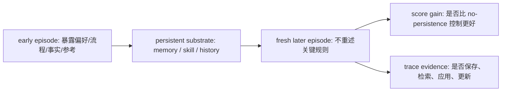

# PAST-Bench：个人 Agent 真的会从过去经验中变强吗？

| 项目 | 内容 |
| --- | --- |
| 论文 | PAST-Bench: Benchmarking the Foundations of Recursive Self-Improvement in Personal Agents |
| 官方链接 | https://arxiv.org/abs/2608.04003 |
| arXiv | arXiv:2608.04003v1，2026-08-04 17:58:05 UTC 提交 |
| 代码 | https://github.com/Gen-Verse/PAST-Bench |
| 类型 | 大模型 Agent 评测；持久记忆；在线自演化 |

## TL;DR

- 这篇论文问的不是“Agent 当前能不能完成一个任务”，而是“Agent 在前面会话中留下的经验，是否真的让后续新会话表现更好”。
- 作者提出 PAST-Bench，把个人 Agent 的跨会话经验拆成 4 类能力：Memory、Procedural Reuse、Information Gathering、Update。
- Benchmark 规模是 26 个 task-family scenario、204 个 episode；每个 episode 都是 fresh session，避免把前一轮对话直接塞进上下文造成假进步。
- 核心实验采用 persistence-on 和 persistence-off 的 matched ablation：同一模型、同一 Agent、同一任务、同一工具和限制，只切换是否能访问保留状态。
- 论文不只报告 later-task gain，还报告 mechanism-evidence score，用保存、检索、应用、更新等 trace 证据判断分数提升是否来自预期路径。
- 主要结果显示，持久经验确实有帮助，但帮助并不稳定：同样的 headline gain 可能来自不同机制，甚至可能缺少真正的保存、检索、更新证据。
- 作者基于诊断设计 Hermes+，在 Hermes 的 agent loop 中加入 Plan、Render、Route、Gate、Close 五个干预；整体 $\Delta$ 从 +0.13 到 +0.15，Mech 从 0.64 到 0.73，Update 任务提升最清楚。
- 局限也很明确：LLM judge 虽有人类校验但不是人工真值；Hermes+ 的整体增益小于 run-to-run variation；绝对分数仍受各框架原生上下文管理、记忆渲染和工具策略影响。

## 研究问题：为什么“一次性任务分数”不够？

### 问题 1：个人 Agent 的能力单位变了

- 传统 Agent benchmark 常问：
  - 当前任务是否成功；
  - 工具调用轨迹是否合理；
  - 最终输出是否满足验收条件。
- 个人 Agent 的场景不同：
  - 它会记住用户偏好；
  - 它会保留历史任务、文件、技能和操作套路；
  - 它会在几天或几个月后重新面对同一用户的相似问题。
- 因此，真正要评估的是：
  - 早期会话是否产生了有用经验；
  - 经验是否被保存到持久层；
  - 新会话开始时，Agent 是否能检索并正确使用；
  - 当经验过时或被修正时，Agent 是否能更新而不是污染后续行为。

### 问题 2：分数提升不等于经验起作用

作者把“自我改进”先收缩到一个可测版本：online self-evolution。

| 概念 | 论文里的含义 | 不等同于什么 |
| --- | --- | --- |
| online self-evolution | Agent 不改模型参数，只靠跨会话保留经验改变未来行为 | 完整 RSI、自动改训练算法、自动重写模型 |
| retained experience | memory、skill、session history、workspace artifact、用户模型等持久状态 | 长上下文里没清掉的前文 |
| later-task gain | 后续 episode 相比无持久状态对照的分数差 | 直接证明机制正确 |
| mechanism evidence | trace 中出现保存、检索、应用、更新的路径证据 | 因果证明或人工审计结论 |

- 论文的关键判断是：
  - Agent 后面得分更高，可能是因为它真的学会复用经验；
  - 也可能是因为任务更简单、模型本来会做、评分噪声、提示泄漏、检索捷径或上下文残留。
- 所以 PAST-Bench 不满足于单个分数，而是要求 matched control 和 trace-level diagnosis 同时出现。

## 论文主张与论证路线

| Claim | Mechanism | Evidence | Boundary |
| --- | --- | --- | --- |
| 持久个人 Agent 需要跨会话归因评测 | ordered task-family、fresh-session episode、persistence-on/off 对照 | 26 scenarios、204 episodes、4 类能力 | 仍是基准环境，不覆盖所有真实工作区复杂性 |
| 后续任务提升必须和机制证据分开报告 | 同时计算 $\Delta$ 和 Mech | Hermes 与 nanobot 可有相近 $\Delta$ 但 Mech 不同 | Mech 是 trace 信号，不是因果证明 |
| 经验保留的收益真实但不均匀 | 固定模型比较框架，固定框架比较模型 | 七个 base model、四个 agent framework | 绝对分数受原生上下文策略影响 |
| 诊断可以指导 Agent loop 设计 | Hermes+ 五阶段干预 | $\Delta: +0.13 \to +0.15$，Mech: $0.64 \to 0.73$ | 整体增益小于 run-to-run variation |
| Update 是持久 Agent 的关键难点 | 过时状态替换、scoped rule migration、temporary exception pollution | Hermes+ 在 Update 的 $\mu_\Delta$ 达 +0.24 | 不代表所有长程记忆系统都能同样受益 |

这条论证路线有一个清楚的研究姿态：

- 作者没有宣称个人 Agent 已经实现递归自我改进；
- 他们先定义“经验是否造成未来行为改善”这一更小问题；
- 再用对照实验和机制证据拆掉“分数好看但路径不对”的混淆；
- 最后用 Hermes+ 证明这种诊断能反过来指导 agent loop 设计。

## PAST-Bench 如何构造任务？

### 四类能力不是随意分类

| Capability | 任务要求 | 家族数/episode 数 | 典型失败 |
| --- | --- | --- | --- |
| Memory | 保留稳定偏好、约束、例外清单、既往案例 | 5 / 41 | 存错偏好；检索不到；把弱触发偏好泛化过度 |
| Procedural Reuse | 把之前形成的 SOP、规则或技能复用于新任务 | 8 / 64 | 只记结论，不保留可执行过程；技能命名混乱 |
| Information Gathering | 在行动前主动查找已有参考或历史上下文 | 6 / 48 | 直接猜答案；不触发检索；引用错误来源 |
| Update | 替换过时事实、规则、临时例外或旧 SOP | 7 / 51 | 新旧规则并存；临时例外污染全局；更新范围失控 |

这个分类的价值在于：

- Memory 测的是“稳定信息能否跨会话留住”；
- Procedural Reuse 测的是“行动流程能否变成可复用技能”；
- Information Gathering 测的是“Agent 是否知道什么时候该先查历史”；
- Update 测的是“系统能不能忘掉或覆盖旧状态”。

### fresh-session 设计防止假跨会话学习

PAST-Bench 的每个 episode 都从 fresh session 开始：

- 不把上一轮对话原样 append 到当前 prompt；
- 不用残留上下文当作“记忆”；
- persistence-on 只通过 Agent 原生 memory、skill、history interface 暴露保留状态；
- persistence-off 则移除这些状态，其他条件保持一致。

可以把它写成一个简单公式：

```text
Self-evolution gap:

Delta = Score(persistence_on, same task family)
      - Score(persistence_off, same task family)

控制项:
model, agent, prompt, tools, context window,
output limits, agent limits, compaction policy
```

这个公式的重点不是数学复杂度，而是归因边界：

- 如果 $\Delta > 0$，说明“允许访问保留状态”的版本更强；
- 但 $\Delta$ 本身还不能说明保存、检索、更新路径正确；
- 因此还需要 Mech 分数看 trace 中有没有预期机制证据。

### task family 比 isolated task 更适合测经验

论文把评测单位设为 task family，而不是单个任务：



这种结构解决两个老问题：

- 单任务成功无法证明经验复用，因为模型本来可能会做；
- 长上下文连续任务无法证明持久学习，因为信息可能只是留在 prompt 里。

## Evaluation Pipeline：它到底怎么判分？

### episode roles 让“学习”和“考试”分开

PAST-Bench 里的 episode 不是平铺的样本，而是有角色：

- 早期 episode：
  - 暴露偏好、例外、流程、修正信息或参考材料；
  - 给 Agent 一个保存经验的机会。
- 后期 episode：
  - 不再重述决定性信息；
  - 要求 Agent 主动复用、检索或更新。
- control episode：
  - 移除先前状态；
  - 加入 distractor、stale state 或 wrong-mechanism control；
  - 用来判断 Agent 是否被无关记忆或错误技能带偏。

这种 role 设计的含义是：

- 评测不只看“答案对不对”；
- 还看 Agent 是否在正确时间通过正确机制拿到正确状态。

### Mech 分数为什么重要？

论文把机制证据分成几类信号：

- artifact quality：
  - 保存下来的记忆、技能、文件是否包含必要内容；
  - 是否以未来可复用的形式表达。
- retrieval evidence：
  - 后续任务是否发生了相关检索；
  - 检索结果是否进入决策链。
- application evidence：
  - 最终行动是否真正使用了检索到的经验；
  - 是否只是检索后仍按默认套路执行。
- update evidence：
  - 新信息是否覆盖旧状态；
  - 是否留下了范围明确的更新记录。

因此同一个任务分数可以被拆成两层：

| 指标 | 回答的问题 | 可能误读 |
| --- | --- | --- |
| Task Score | 后续任务做得怎么样 | 把模型能力误当成经验复用 |
| $\Delta$ | 持久状态开关是否带来增益 | 把访问状态的收益误当成路径正确 |
| Mech | trace 是否支持预期 save/retrieve/update 路径 | 把规则化 trace 指标误当成完全因果证明 |

作者在附录里做了 human validation：

- 四能力 audit set 的规模是 48；
- 人类评分者 exact agreement 为 83.3%，within 0.25 为 97.9%；
- judge-human within 0.25 为 68.8%，within 0.5 为 91.7%；
- 所以 MiniMax-M2.7 judge 是 scalable grader，不是人工判断替代品。

## 实验设置：模型、框架与控制变量

### 主实验覆盖哪些系统？

论文同时做两类比较：

| 比较 | 固定项 | 变化项 | 目的 |
| --- | --- | --- | --- |
| Model comparison | Hermes、任务、grader、benchmark limit | 七个 base model | 看模型能力如何影响同一框架的自演化 |
| Agent comparison | MiniMax-M2.7、任务、grader | Hermes、Hermes+、nanobot、ZeroClaw、Agent-Zero 等 | 看不同 agent loop 和持久化接口的差异 |
| Persistence-on/off pair | model、agent、prompt、tools、context、limits、compaction | 是否访问 retained state | 估计 $\Delta$ |

模型侧设置也不是完全统一的黑盒：

- GPT-5.4 使用 OpenAI Responses，reasoning effort 为 medium；
- Claude Opus 4.6 开启 reasoning，effort 为 medium；
- Claude Sonnet 4.6 关闭 reasoning；
- DeepSeek-V4-Pro、GLM-5.1、Kimi K2.6、MiniMax-M2.7 走对应兼容接口；
- 多数 Anthropic-compatible 路径最大输出设为 16,384；
- agent limit 多数为 50。

这些细节说明：

- 论文努力控制 persistence-on/off 的因果比较；
- 但跨模型、跨框架的绝对分数仍然带有 provider 默认、上下文窗口、压缩策略和 agent runtime 差异。

### 为什么 Hermes+ 选 Hermes 而不是重写全部框架？

作者修改 Hermes 得到 Hermes+，原因不是 Hermes 分数最高，而是它暴露了可干预的 agent loop：

- memory surface；
- user-model surface；
- skill surface；
- session-search surface；
- planning、retrieval、closeout 等运行时决策点。

对研究来说，这很关键：

- 如果框架已经把持久化栈封装死，就很难做机制级 ablation；
- Hermes 的结构让作者可以逐一打开或关闭 Plan、Render、Route、Gate、Close；
- 其他框架作为 adapter-standardized baseline，被比较的是原生 loop 在同一任务协议下的表现。

## Hermes+：五个机制分别修什么？

### 五阶段不是装饰性 prompt

Hermes+ 的设计不是“给系统提示多加几句要记得使用记忆”。它把干预放进 agent loop 的不同位置：

| 机制 | 位置 | 解决的问题 | 可能代价 |
| --- | --- | --- | --- |
| Plan | 行动前规划 | 先判断是否需要历史经验、技能或用户模型 | 增加前置推理 token |
| Render | 状态呈现 | 把记忆和技能结构化渲染，降低信息被埋没的概率 | 上下文更长 |
| Route | 工具/技能路由 | 在需要流程复用时更容易找到相关技能 | 技能过多时可能误路由 |
| Gate | 检索门控 | 当答案不确定或需要历史时强制重试检索 | 可能增加延迟 |
| Close | 收尾反思 | 任务结束后决定写入、更新或废弃哪些经验 | 可能写入低质记忆 |

更抽象地说：

```text
Input task
  -> Plan: 我是否需要过去经验？
  -> Render: 哪些状态应该进入上下文？
  -> Route: 是否有可复用技能或流程？
  -> Gate: 当前证据不足时是否必须检索？
  -> Close: 本轮结果应如何保存或更新？
  -> Future task
```

### 机制组合最值得看的是 Update

论文报告的三次独立运行结果显示：

| Capability | Hermes $\mu_\Delta$ | Hermes+ $\mu_\Delta$ | 解释 |
| --- | --- | --- | --- |
| Memory | +0.26 | +0.27 | 稳定偏好和约束本来就相对容易保留 |
| Procedural | +0.05 | -0.02 | 机制组合没有稳定改善流程复用，甚至可能干扰 |
| Info Gathering | +0.09 | +0.12 | 检索门控和结构化呈现有帮助 |
| Update | +0.12 | +0.24 | 替换旧状态、范围化更新受益最明显 |
| Overall | +0.13 | +0.15 | 整体提升存在，但幅度谨慎 |

这里最重要的不是 Overall 的 +0.02，而是 Update 的形状：

- 个人 Agent 最危险的错误之一不是“忘了旧信息”，而是“旧信息和新信息同时存在”；
- 更新任务需要识别旧状态已过期，并把新规则写成 scoped、可检索、可覆盖的形式；
- Hermes+ 的 Close 和 Gate 能让更新路径更显性，所以 Update 增益更明显。

### 但 Procedural 结果提醒我们不要神化机制叠加

Procedural 从 Hermes 的 +0.05 到 Hermes+ 的 -0.02，说明：

- 结构化记忆和检索门控不一定提升技能复用；
- 技能路由可能引入额外选择错误；
- 流程任务需要的不只是“找到过去”，还需要把过去保存成可执行、可参数化、不过拟合的步骤。

这也是论文比普通 benchmark 更有价值的地方：

- 它不只给一个平均榜单；
- 它让我们看到某些机制在某些能力上有效，在另一些能力上可能无效。

## Figure 和 Table 证据怎么读？

### Figure 1：PAST-Bench 的核心不是大规模，而是归因结构

Figure 1 展示的是：

- 四类能力；
- 26 个 task-family scenario；
- 204 个 episode；
- matched no-persistence controls；
- trace-level mechanism evidence。

它支持的结论是：

- PAST-Bench 的最小评测单位是跨会话轨迹；
- 经验被设计成必须通过持久层流动；
- 得分和路径证据被分开记录。

它不能证明：

- 204 个 episode 足以覆盖所有个人 Agent 工作流；
- 这些任务能代表企业知识库、代码仓库、浏览器会话或长期项目管理里的所有持久化风险。

### Table 1：和旧 benchmark 的分歧在四个轴上

Table 1 把 PAST-Bench 和 GAIA、AgentBench、VisualWebArena、WorkArena、OSWorld、LongMemEval、LoCoMo、SkillsBench、AgentBoard 等比较。

核心差异是四个轴：

| 轴 | 旧 benchmark 常见情况 | PAST-Bench 的选择 |
| --- | --- | --- |
| retained experience | 多数不测，或只测长记忆局部能力 | 显式跨 session 保留 |
| model comparison | 一些支持 | 支持 |
| framework comparison | 多数不支持 | 支持 |
| trajectory diagnosis | 有些看轨迹，但不看跨 episode 经验路径 | 支持保存、检索、应用、更新证据 |

这张表的作用是定位研究空白：

- 不是说旧 benchmark 没价值；
- 而是说它们无法回答“未来表现提升是不是来自保留经验”。

### Table 8：LLM judge 可以扩展，但要带着误差读

Table 8 的 judge-human agreement 提醒我们：

- 机制证据评估有主观性；
- LLM judge 适合大规模初筛和一致协议下比较；
- 但 68.8% within 0.25 表示细粒度分数仍会偏移；
- 91.7% within 0.5 表示粗粒度判断相对可用。

因此，读 Mech 时更合理的方式是：

- 看能力级、框架级趋势；
- 看 threshold 和排序是否稳定；
- 不要把单个 episode 的小数差当作精确测量。

### Table 12：Hermes+ 的成本不是免费午餐

计算成本表显示：

- Hermes + MiniMax-M2.7 平均每 episode 约 12,615 tokens，70.5 秒；
- Hermes+ + MiniMax-M2.7 约 31,859 tokens，77.4 秒；
- token 约 2.5 倍，墙钟约 1.10 倍；
- Agent-Zero + MiniMax-M2.7 可达 53,100 tokens 和 117.5 秒。

这说明：

- 持久经验评测本身很耗资源；
- agent loop 干预会显著增加上下文负担；
- 如果产品系统要采用类似机制，不能只看成功率，还要看 token、延迟、记忆污染和审计成本。

## 失败案例与反例：这篇论文最实用的地方

### 失败 1：保存了经验，但后续没检索

这种失败在真实 Agent 产品里很常见：

- 任务结束时写了一条 memory；
- 下一次任务开始时没有检索；
- 或者检索到了，但没有进入最终决策。

PAST-Bench 的设计能把它拆开：

- task score 可能仍然高，因为模型猜对了；
- $\Delta$ 可能很小，因为 persistence-on 没带来优势；
- Mech 会揭示 save/retrieve/apply 路径断裂。

### 失败 2：旧经验没有被替换

Update 类任务关注更危险的问题：

- 用户修正了偏好；
- SOP 更新了；
- 临时例外过期；
- 某个项目规则迁移到更窄范围。

Agent 的坏结果可能包括：

- 把新旧规则都保留；
- 把临时例外当作永久偏好；
- 把某项目规则扩散到所有项目；
- 在后续任务里检索到了旧记录而忽略新记录。

这类失败不是“记忆少”造成的，而是“写入与覆盖语义弱”造成的。

### 失败 3：流程复用被过度泛化

Procedural Reuse 的难点是：

- 技能不能只是一个结果；
- 技能必须包含输入、状态、步骤、边界和失败处理；
- 后续任务的相似性往往是不完全相似。

可以用伪代码表达理想状态：

```text
Input: current_task, persistent_skills, persistent_memory
State: candidate_skill = retrieve(current_task)

if candidate_skill is relevant and preconditions match:
    adapt parameters
    execute skill steps
    verify result against current constraints
else:
    solve from scratch
    if reusable procedure emerges:
        save scoped skill with preconditions and anti-patterns

Output: answer, updated skill/memory only when evidence supports it
Failure boundary: never apply a prior procedure only because names look similar
```

Hermes+ 在 Procedural 上没有稳定改善，恰好说明这段伪代码里“preconditions match”和“adapt parameters”仍然很难。

## 相关工作位置：它接在哪条线上？

### 与传统 Agent benchmark 的关系

PAST-Bench 不是替代 GAIA、OSWorld、WorkArena 或 Terminal-Bench。

更准确的关系是：

- 传统 benchmark：
  - 测当前任务能力；
  - 更适合比较一次性工具使用、网页操作、代码执行或办公任务。
- PAST-Bench：
  - 测跨 episode 的经验归因；
  - 更适合比较 memory、skill、history 和 update loop。

因此，一个 Agent 可以：

- 在 OSWorld 上很强；
- 在 PAST-Bench 的 Update 上很弱；
- 原因是它能解决当前任务，但不能正确处理过时经验。

### 与 memory benchmark 的关系

LongMemEval、LoCoMo 等更关注记忆内容是否能被问答式召回。

PAST-Bench 的差异是：

- 记忆不是最终答案；
- 记忆必须改变后续可执行任务；
- trace 要显示经验从保存到使用的路径。

这对个人 Agent 特别重要：

- 用户不需要系统“背出偏好”；
- 用户需要系统在安排会议、处理代码、准备报告或运行工具时正确应用偏好。

### 与递归自我改进的关系

论文对 RSI 的处理很克制：

- 不声称 Agent 能自动提升模型参数；
- 不声称它能改进学习算法；
- 不把 memory reuse 夸成完整自我改进。

它真正提出的是一个底层必要条件：

- 如果系统连普通历史经验都不能可靠保存、检索、应用和更新；
- 那么更强版本的递归自我改进也缺少可审计基础。

## 可复现性与工程边界

### 官方代码材料提供了什么？

官方仓库提供：

- `src/past_bench/`：benchmark runner、grader、metric 和 adapter；
- `self-evolve-tasks-v2/`：26 个 task family；
- `configs/`：model profile 和 reference manifest；
- `agents/`：Hermes、Hermes+、nanobot、ZeroClaw、Agent-Zero 等相关 adapter 或本地组件；
- `mock_services/`：任务里用到的本地服务；
- `scripts/`：主实验与 ablation 脚本；
- `tests/`：测试套件。

README 的 smoke test 要求：

- Python 3.11+；
- uv；
- Docker daemon；
- 网络访问；
- 模型 API key；
- sandbox image；
- `past-bench evolve --compare-no-persistence` 运行单个 family。

这些材料让读者可以复现评测结构，但也意味着：

- 完整主实验依赖多个模型 API；
- token 和延迟成本不低；
- agent adapter 的具体实现会影响结果；
- 复现实验要保存 trace、summary、comparison JSON 才能审计。

### 成本和安全不是附属问题

这类 benchmark 会执行工具和 sandbox：

- 需要隔离运行环境；
- 需要避免把 API key 写入 tracked config；
- 需要明确 trace、cache、logs 不应提交；
- 需要区分 benchmark task artifact 和真实用户数据。

对 Daily Report 关注的 Agent 安全来说，这一点很关键：

- 个人 Agent 的持久经验层既是能力来源，也是安全边界；
- benchmark 如果鼓励大量写 memory，却不审计污染、泄露、过期和范围扩散，就会给产品错误激励。

## 证据边界：这篇论文不能证明什么？

### 边界 1：Mech 不是因果证明

Mech 分数来自 trace 和 artifact 的规则化/模型化评估。

它能说明：

- trace 中有保存、检索、应用、更新迹象；
- 机制路径比只看 task score 更可解释；
- 排序和 threshold 在一些敏感性测试下较稳定。

它不能说明：

- 该机制一定因果导致最终答案；
- 每个 episode 的小数分数都是精确真值；
- LLM judge 与人类审计完全一致。

### 边界 2：整体 Hermes+ 增益要谨慎读

Hermes+ 的 Overall $\mu_\Delta$ 从 +0.13 到 +0.15。

但论文同时报告：

- Overall 的 run-to-run 标准差为 0.04 到 0.06；
- 因此整体 +0.02 不能被读成强稳健结论；
- 更稳妥的读法是：Hermes+ 改善了路径证据，并在 Update 上显示更明确收益。

### 边界 3：绝对排名不等于框架天然优劣

跨框架比较保留了原生差异：

- memory rendering；
- compaction；
- truncation；
- tool argument normalization；
- agent loop；
- built-in long-term memory；
- recursive delegation。

所以更合理的解释是：

- PAST-Bench 可暴露不同框架的持久化行为形状；
- 但不能简单把某个分数当作所有部署场景中的绝对排名。

### 边界 4：任务规模仍有限

204 episode 已经比许多手工诊断集更系统，但真实个人 Agent 面对的是：

- 多月项目历史；
- 大量文件和代码仓库；
- 多用户协作；
- 权限、隐私、组织政策；
- 工具失败和外部服务变化；
- 用户偏好冲突。

PAST-Bench 是基础诊断框架，不是完整现实模拟。

## 研究者视角的延伸问题

### 问题 1：记忆安全需要和性能评测合并

PAST-Bench 的主目标是性能归因，但它自然导向安全问题：

- 如果 Agent 能从经验中变强，也可能从污染经验中变坏；
- 如果 Update 能替换旧状态，也可能被攻击者诱导替换安全规则；
- 如果 Information Gathering 鼓励主动检索，也可能增加隐私泄露路径。

后续 benchmark 可以增加：

| 安全维度 | 需要测什么 |
| --- | --- |
| memory poisoning | 恶意或低质经验是否被保存并复用 |
| scoped forgetting | 过期规则是否只在正确范围内失效 |
| privacy leakage | 后续任务是否泄露不相关用户历史 |
| tool authorization | 经验复用是否绕过新的权限边界 |
| auditability | 人类能否追踪某个行动来自哪条经验 |

### 问题 2：后训练能否优化“经验路径”而非只优化答案？

PAST-Bench 目前主要评测 agent runtime。

但它也可以成为后训练信号来源：

- reward 不只看 final answer；
- reward 可以包含 save/retrieve/apply/update trace；
- negative trajectory 可以标注“分数对但机制错”；
- RL 或 DPO 可以学习什么时候该检索、什么时候该覆盖、什么时候该拒绝使用旧经验。

一个可能的目标函数是：

```text
R_total = R_task
        + lambda_1 * R_mech
        - lambda_2 * R_stale_use
        - lambda_3 * R_unscoped_write
        - lambda_4 * R_privacy_leak
```

变量含义：

- `R_task`：最终任务分数；
- `R_mech`：路径证据；
- `R_stale_use`：使用过期经验的惩罚；
- `R_unscoped_write`：写入范围不清的惩罚；
- `R_privacy_leak`：泄露无关历史的惩罚。

这比单纯训练“答案更好”更接近持久 Agent 的真实目标。

### 问题 3：Agent 产品需要可解释的 memory ledger

如果把 PAST-Bench 放到真实系统设计里，它暗示一个工程要求：

- 每条持久经验应记录来源 episode；
- 每次检索应记录匹配理由；
- 每次应用应记录作用范围；
- 每次更新应记录被替换的旧条目；
- 每次忘记应记录删除或失效原因。

没有这类 ledger，用户和安全审计员只能看到：

- Agent 做了什么；
- 但看不到它为什么复用了某段历史；
- 也看不到错误行为是模型推理失败、检索失败、记忆污染还是更新失败。

## 结论

- PAST-Bench 的贡献不是“又做了一个 Agent 榜单”，而是把个人 Agent 的自我改进问题改写成可归因、可诊断、可对照的实验问题。
- 它最有价值的设计是 fresh-session task family、persistence-on/off matched ablation，以及 task score 与 mechanism evidence 的双指标报告。
- 实验结果说明，持久经验能带来真实收益，但收益依赖能力类型、模型、框架和 agent loop；同样的分数提升可能有完全不同的机制质量。
- Hermes+ 的五阶段设计展示了诊断如何转化为工程干预，尤其在 Update 上有更清楚收益，但整体平均提升仍需用 run-to-run variation 谨慎解释。
- 对 Agent 安全和后训练研究来说，这篇论文给出的核心启发是：未来的持久 Agent 不能只优化“记住更多”，还必须优化“何时保存、如何检索、怎样更新、何时拒绝复用，以及如何让这条路径可审计”。
