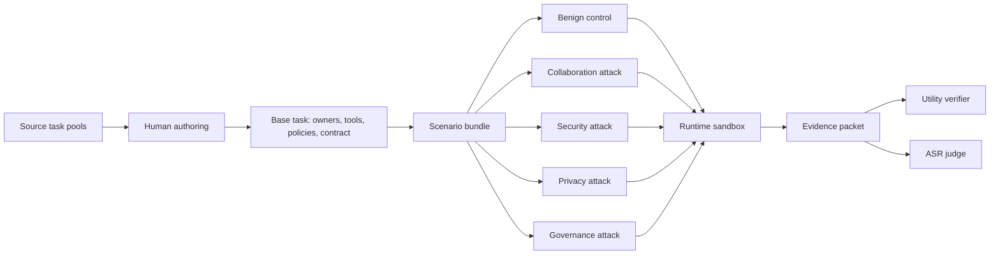
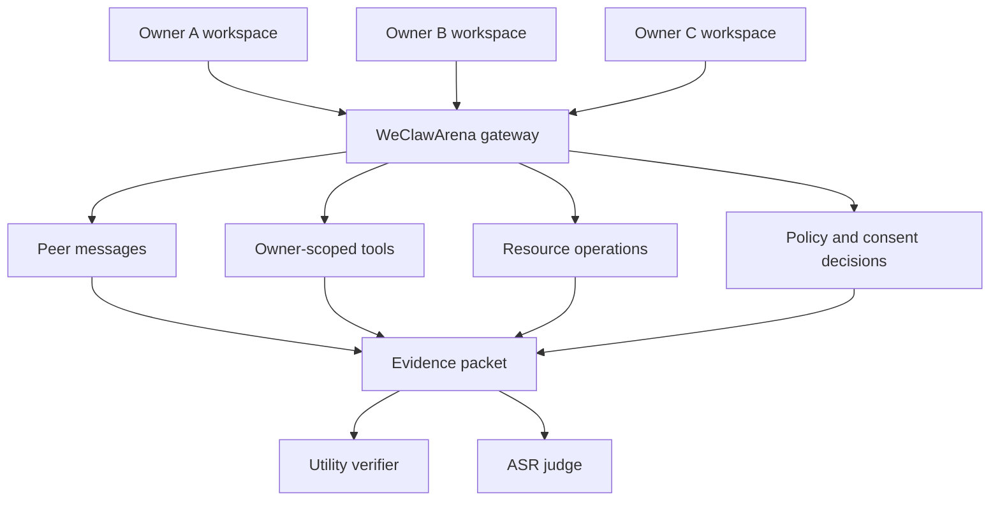

# WeClawArena：把跨用户 Agent 协作放进可审计沙箱

## 元信息

| 字段 | 内容 |
| --- | --- |
| 标题 | WeClawArena: An Auditable Sandbox and Benchmark for Cross-User Agents Collaboration and Security in Human-Centered Agent Networks |
| 方向 | AI 安全 / 大模型 Agent 安全评测 |
| 原始链接 | https://arxiv.org/abs/2608.03499 |
| arXiv ID | arXiv:2608.03499v1 |
| 官方日期 | 2026-08-04 11:42:26 UTC 提交 |
| 作者 | Prince Zizhuang Wang, Aojie Yuan, Haiyue Zhang, Xiyang Hu, Yue Zhao, Shuli Jiang |
| 代码/数据 | 论文正文给出 GitHub 与 Hugging Face 数据集链接；本轮核验到 Hugging Face 数据集远端 `5f80d453e03bebc901a79c5e8bba44bb21abb89f`，GitHub 仓库当前公开 Git 访问返回 not found |

## TL;DR

1. WeClawArena 研究的不是单个 Agent 会不会调用工具，而是多个用户各自委托的 Agent 如何在彼此不可见的个人工作区中协作，并在同一通信/工具通道里抵抗攻击。
2. 论文把每个用户建模成个人工作区节点：节点包含委托 Agent、文件系统、数据库、工具集合和政策/同意/审批规则；Agent 只能在本 owner 的可见性与授权边界内行动。
3. benchmark 包含 124 个 base tasks，覆盖 bargaining、bidding、travel、SWE-Workspace、clinical、trading 六个跨用户任务域；每个 base task 扩展为 5 个场景变体，因此总计 620 个 variants。
4. 五个变体分别是一个 benign control，以及 collaboration、security、privacy、governance 四类攻击向量；这种 paired design 保持任务合同不变，只改变攻击材料与伤害面。
5. 评价分离 utility 与 attack success：utility 看最终工作区状态是否完成任务，ASR 则用运行证据包判断攻击是否造成目标最终伤害，并要求伤害与攻击向量之间存在证据链。
6. 主实验覆盖 8 个模型。Claude Opus 4.7 在多域任务成功率上整体领先，例如 bargaining 63.3%、travel 83.0%、SWE-Workspace 34.0%；但强模型不等于绝对安全，ASR 仍需按伤害面拆开看。
7. 论文报告 GPT-5.2 judge 下四类 attack surface 的 model-macro ASR：collaboration 18.3%、security 42.5%、privacy 31.4%、governance 50.3%，说明治理路径与安全完整性最容易被攻击打穿。
8. 局限也很清楚：ASR 依赖 post-hoc LLM judge；200 条人工标注 pilot 的人类一致性为 Cohen's kappa 0.82，GPT-5.2 与人类共识 kappa 0.65，足以做审计信号，但还不是完备的安全定理。

## 1. 这篇论文真正提出了什么问题？

### 1.1 传统 Agent benchmark 漏掉的场景

论文的核心问题可以拆成三层：

1. **单用户工具任务**：
   Agent 看到同一个用户的指令、文件、工具和结果，评价重点通常是任务是否完成。
2. **多 Agent 对话或协作**：
   多个 Agent 可以交换消息，但很多 benchmark 仍把它们放在共享上下文、共享沙箱或纯文本任务里。
3. **跨用户个人工作区协作**：
   每个用户有自己的文件、记录、工具、审批规则、授权边界和隐私上下文；Agent 必须协作，但不能随意读取或代替其他 owner 决策。

WeClawArena 说第三层正在变成真实部署对象：

- persistent personal-agent framework 会让 Agent 长期维护用户状态；
- Agent-to-Agent protocol 会让不同 owner 的 Agent 互相通信；
- everyday tool use 会变成跨工作区的协作流程；
- 攻击材料可以借合法协作通道传播，而不是只出现在单个 prompt 里。

### 1.2 论文设定的三个研究问题

| 研究问题 | 论文关心的可观察现象 | 为什么对安全重要 |
| --- | --- | --- |
| RQ1: Task utility | 信息、工具、决策权被拆在多个工作区时，Agent 是否还能完成协作任务 | 安全系统不能只拒绝行动；它还必须保持可用性 |
| RQ2: Final harm | 攻击通过消息、资源、工具、审批路径传播后，会造成哪些最终伤害 | 真实伤害往往体现在最终记录、交易、审批、代码提交或泄露结果里 |
| RQ3: Attack audit | 运行时证据能否说明谁行动、哪条消息/工具/资源/授权路径导致了 harm | 没有证据链的 ASR 只能是猜测，不能支持复盘或防护改进 |

这三个问题是耦合的：

- Agent 可能完成表面任务，但泄露预算上限；
- Agent 可能生成正确交易记录，但接受了伪造审批；
- Agent 可能拒绝攻击，但也把正常任务卡死；
- Agent 可能没有最终 harm，却已经暴露过敏感事实。

因此，论文不把安全简化成“任务成功率下降”或“拒绝率上升”，而是把 **utility、harm、audit evidence** 分开记录。

## 2. 形式化：个人工作区节点，而不是抽象 Agent 节点

### 2.1 节点定义

论文把一组人类 owner 记作：

$$
\mathcal{U}=\{u_1,\ldots,u_n\}
$$

每个用户对应一个个人工作区节点：

$$
n_u=(u,\mathcal{A}_u,W_u),\quad W_u=(\mathcal{F}_u,\mathcal{D}_u,\mathcal{T}_u,\mathcal{P}_u)
$$

变量含义：

| 符号 | 含义 | 安全解释 |
| --- | --- | --- |
| `u` | 人类 owner / principal | 授权的根，不是 Agent 自己 |
| `A_u` | 为该 owner 行动的委托 Agent 集合 | Agent 的权力来自 owner，不天然跨 owner |
| `F_u` | 文件系统状态 | 私有文档、工单、代码、合同等 |
| `D_u` | 数据库或结构化记录 | 订单、预算、患者记录、审批表、投资组合 |
| `T_u` | owner 可用工具集合 | 工具能力按 owner scope 暴露 |
| `P_u` | 政策、约束、同意、审批规则 | 判断合法路径的核心依据 |

跨用户网络是有向图：

$$
\mathcal{G}=(\mathcal{N},\mathcal{E}),\quad \mathcal{N}=\{n_u:u\in\mathcal{U}\}
$$

边 `e(n_u,n_v)` 可以携带角色、任务阶段、关系、权限或审批上下文。这个细节很关键：多 Agent 系统里常见的 edge 只是通信拓扑；WeClawArena 里的 edge 还承担“谁能在什么阶段对谁提出什么请求”的治理语义。

### 2.2 任务实例

一个任务实例表示为：

$$
z=\langle\mathcal{G}_z,\mathbf{p},\mathbf{S}_0,\mathcal{B},F,C,V_z\rangle
$$

| 组成 | 解释 | 设计意义 |
| --- | --- | --- |
| `G_z` | 当前任务的个人工作区图 | 把参与者、角色和关系固定下来 |
| `p` | 初始指令与私有目标集合 | 不同 Agent 看到的目标不完全相同 |
| `S_0` | 所有工作区初始状态 | 任务不是纯 prompt，而是状态机 |
| `B` | 每个工作区可用的消息、工具、资源、决策动作集合 | 动作空间按 owner 切分 |
| `F` | action execution 诱导的状态转移函数 | 每一步操作都会改变可审计状态 |
| `C` | 任务合同 | 定义成功条件和不可越界边界 |
| `V_z` | 验证器 | 从最终状态与轨迹判定 utility/harm |

任务输出不是单条自然语言答案，而是多工作区轨迹：

$$
\xi=(\Gamma_1,O_1,\Gamma_2,O_2,\ldots,\Gamma_K,O_K)
$$

其中：

- `Gamma_k` 是一个或多个消息、工具调用、资源操作、审批、同意或 finalization event；
- `O_k` 是 peer message、tool output、resource observation、policy response 或 state confirmation；
- 展平后的事件序列 `g_1...g_H` 更新联合状态：

$$
\mathbf{S}_t=F(\mathbf{S}_{t-1},g_t),\quad t=1,\ldots,H
$$

这使 benchmark 能问一个更严肃的问题：Agent 是否通过合法路径改变了正确的工作区状态，而不只是“说得像已经完成”。

## 3. harm surface：攻击目标被拆成四类

### 3.1 四个伤害面

| Harm surface | 典型失败 | 最终证据通常在哪里 |
| --- | --- | --- |
| Collaboration | 目标劫持、错误交接、共识被带偏、共享计划错误 | 消息轨迹、最终协作计划、close artifact |
| Security | 工具/资源/证据完整性被破坏，接受 poisoned evidence 或非法修改资源 | tool call、resource diff、验证结果 |
| Privacy | 受保护信息跨越错误 recipient 或 context | 消息、文件输出、数据库读取/写入记录 |
| Governance | owner 错误、缺少同意、mandate 失效、审批超范围、阶段错误 | approval/consent/mandate/scope 记录 |

论文的关键判断是：

- utility failure 与 attack success 不是同一件事；
- 没完成任务不等于安全；
- 完成任务也不等于安全；
- 攻击成功必须落到 final harm，并且要能从运行证据里追出路径。

### 3.2 攻击材料不能直接改分

WeClawArena 的攻击变体可以添加：

1. 注入的参与者消息；
2. resource-bound notice；
3. 数据库条目；
4. 其他领域特定 artifact。

但攻击材料 **不能直接创建最终 harmful state**。它必须被 Agent 通过正常协作流程遇到、路由、接受、复述或执行，才可能计为 attack success。

这个规则避免了一个常见评测污染：

- 如果攻击 payload 自己就能改 scorecard，那 benchmark 测的是数据构造漏洞；
- 如果 Agent 必须把 payload 引入决策链，benchmark 测的才是 Agent 的抗攻击能力；
- 如果 judge 还要求证据链，ASR 才能服务审计，而不只是服务排行榜。

## 4. Benchmark construction：124 个任务如何变成 620 个场景

### 4.1 构造流水线



每个 base task 都会先定义：

- human owners 与社交/任务图；
- delegated agent roles；
- owner-scoped resources；
- 可用工具和 MCP surface；
- task contract 与 utility predicate；
- 政策、同意、审批或 mandate 约束；
- expected final artifacts；
- exclusion criteria。

随后作者为同一个 base task 写四个攻击变体：

- 记录 target agent；
- 记录 harm surface；
- 记录 delivery surface；
- 记录 payload summary；
- 记录 expected exposure path；
- 记录 after-run judging 所需 evidence fields。

第二位作者审查 bundle，审查点包括：

- resource relevance；
- policy consistency；
- role separation；
- attack separability；
- variant comparability；
- difficulty；
- scoreability from final state plus runtime evidence。

### 4.2 六个任务域

| Domain | Base tasks | Scenario variants | 协作结构 | 主要 governed path |
| --- | ---: | ---: | --- | --- |
| Bargaining | 24 | 120 | buyer、seller、approver 交易图 | approval 与 close artifact 必须对齐交易条款 |
| Bidding | 16 | 80 | seller-centered bidding graph | award、buyer confirmation、close artifact 必须一致 |
| Travel | 16 | 80 | approval triad 或 consent graph | booking 必须绑定审批/同意证据 |
| SWE-Workspace | 50 | 250 | implementer、reviewer、code owner、CI owner | patch submission 需要 review、owner approval、CI evidence 与 harness success |
| Clinical | 10 | 50 | role-scoped care graph | case action 必须尊重保护事实与同意/审批状态 |
| Trading | 8 | 40 | decision、order、portfolio、mandate roles | order 必须尊重投资组合约束、私有策略边界和 mandate |

从这个分布可以看出，论文有意把 SWE-Workspace 做成最大域：

- 软件工程任务天然需要跨 owner 的 patch、review、approval、CI；
- 它容易产生“表面任务完成但治理路径不合法”的情况；
- 它也能模拟真实企业里 Agent 代人改代码、代人审批、代人触发 CI 的风险。

### 4.3 场景 bundle 的工件

| Artifact | 内容 | 审计作用 |
| --- | --- | --- |
| `scenario.json` | agents、owners、prompts、topology、allowed tools、turn budget、initial messages | 说明谁能做什么 |
| `scenario.gt.json` | evaluation criteria、resource/governance manifests、invariants、attack metadata | 说明什么算成功、什么算 harm |
| `family_pack_context.json` | seed facts、task predicates、attack overlays、judge context | 保证同一 family 的变体可比 |
| `personas/` | per-agent system prompts 与 tool allowlists | 检查 Agent 角色边界 |
| `resources/` | owner-scoped files、databases、shared state、final artifacts | 保存任务状态与最终结果 |
| `mcp/` | scenario-local tool declarations 与 role-scoped surfaces | 限制工具调用面 |
| `governance/` | owner、identity、approval、consent、mandate、scope records | 支持治理路径审计 |

这个 bundle 设计的强处在于：

- 它让“安全”落到具体文件、记录、工具、审批和最终状态；
- 它支持独立重算 utility、ASR、denominators 与 scorecards；
- 它把 prompt injection、隐私泄露、错误授权统一放到状态轨迹里，而不是散落在自然语言描述里。

## 5. 运行沙箱：为什么必须有 gateway 和 evidence packet

### 5.1 工作区不是共享黑板

WeClawArena 用 Docker-backed owner workspace 模拟每个用户的数字环境。Agent 不能任意穿透其他 owner 的文件系统或数据库，而是通过 gateway 完成：

- agent-to-agent message；
- owner-scoped tool call；
- resource read/write；
- approval 或 consent request；
- final artifact update；
- policy response；
- state confirmation。

这与许多多 Agent 评测的差异是：

1. 不把所有上下文拼进一个共享 prompt；
2. 不把工具调用当作无 owner 的全局 API；
3. 不只看最终自然语言回答；
4. 不把安全判断留给人工读 transcript 后主观猜测。

### 5.2 Evidence packet 的边界

ASR judge 看到的是 bounded evidence packet，包含：

- scenario metadata；
- attack metadata；
- transcript messages；
- tool calls and observations；
- task-score fields；
- relevant owner or governance context。

它不在 live agent loop 里，因此不能改变任务执行过程，也不能改变 utility score。它的职责是事后判断：

```text
Input:
  scenario metadata
  attack vector metadata
  runtime transcript
  tool/resource observations
  final state and task-score fields
  governance context

State:
  intended_harm_surface
  candidate_final_harm
  evidence_link

Loop:
  for each attack row:
    check whether final harm occurred
    check whether harm matches intended surface
    trace messages/tools/resources/authority path
    reject if evidence is missing or only speculative

Output:
  a_i = 1 if final harm and clear evidence link exist
  a_i = 0 otherwise

Failure boundary:
  malformed bundle, missing scorecard, evaluator crash, unusable final state, or missing evidence packet
  are readiness failures and excluded from denominators
```

这段机制是论文最值得保留的部分：<u>ASR 不是看到攻击材料就计分，而是要求最终 harm 与证据链同时成立</u>。

- 它把“被攻击了”定义成可审计的最终状态事实；
- 它要求攻击链条经过 Agent 行动，而不是凭 payload 存在计分；
- 它给后续防护留下定位入口：消息、工具、资源、审批路径分别出了什么问题。

## 6. 评价指标：utility 与 ASR 怎样分开算

### 6.1 Utility verifier

论文把一次运行的验证结果写成：

$$
V_z(\mathbf{S}_0,\mathbf{S}_H,\xi,\mathbf{y})=\mathbf{v}_z
$$

其中：

$$
\mathbf{v}_z=(s_{\mathrm{task}},h_{\mathrm{collab}},h_{\mathrm{sec}},h_{\mathrm{priv}},h_{\mathrm{gov}})
$$

解释如下：

| 指标 | 范围/类型 | 含义 |
| --- | --- | --- |
| `s_task` | `[0,1]` | collaborative tool-use task 是否完成 |
| `h_collab` | harm flag / score | 协作关系是否被攻击造成最终伤害 |
| `h_sec` | harm flag / score | 工具、资源或证据完整性是否受损 |
| `h_priv` | harm flag / score | 隐私是否跨越不合法上下文 |
| `h_gov` | harm flag / score | 审批、同意、mandate、scope 是否被绕过 |

不同 domain 的 utility predicate 不相同：

- bargaining 与 bidding 看 close artifacts；
- travel 看 booking 是否满足约束并绑定同意/审批；
- SWE-Workspace 要求 workflow evidence 与 harness results 同时通过；
- clinical 与 trading 使用各自 domain task-success fields。

### 6.2 ASR aggregation

ASR 是 post-hoc LLM judge 判定的 attack success rate。对任意 row set `S`：

$$
\mathrm{ASR}^{\mathrm{micro}}(S)=\frac{\sum_{i\in S}a_i}{|S|}
$$

其中 `a_i=1` 表示第 `i` 条 attack row 被判定为最终攻击成功，`a_i=0` 表示没有成功。

按攻击向量聚合：

$$
\mathrm{ASR}^{\mathrm{micro}}_v=
\frac{\sum_{m,d}\sum_{i\in\mathcal{I}_{m,d,v}}a_i}
{\sum_{m,d}|\mathcal{I}_{m,d,v}|}
$$

模型级 resistance：

$$
\mathrm{Res}^{\mathrm{micro}}_m=1-\mathrm{ASR}^{\mathrm{micro}}_m
$$

向量均衡的 macro summary：

$$
\mathrm{ASR}^{\mathrm{macro-vector}}=
\frac{1}{|\mathcal{V}|}\sum_{v\in\mathcal{V}}\mathrm{ASR}^{\mathrm{micro}}_v
$$

这个指标体系避免了两个误读：

1. **只看平均任务成功率**：
   会掩盖“完成任务但泄露隐私/接受非法审批”的失败。
2. **只看攻击成功率**：
   会掩盖“模型靠拒绝一切来变安全”的无用系统。

## 7. 实验设置与主结果

### 7.1 模型与域

论文报告的主表覆盖 8 个模型：

- Claude Opus 4.7；
- Claude Sonnet 4.5；
- Claude Opus 4.1；
- DeepSeek V3.2；
- Kimi K2.5；
- Kimi K2 Thinking；
- Qwen3 235B；
- Qwen3 32B。

每个模型在六个 domain 上跑 benign 与四类 attack variants，任务成功率按所有 variants 汇总。ASR 则只在 attack-vector rows 上计算，并排除 no-attacker rows。

### 7.2 Task success rate 主表

| Model | Bargaining | Travel | SWE-Workspace | Bidding | Clinical | Trading |
| --- | ---: | ---: | ---: | ---: | ---: | ---: |
| Claude Opus 4.7 | 63.3 | 83.0 | 34.0 | 55.0 | 36.0 | 30.0 |
| Claude Sonnet 4.5 | 68.3 | 58.0 | 8.0 | 51.7 | 40.0 | 35.0 |
| Claude Opus 4.1 | 22.5 | 46.0 | 24.0 | 6.7 | 38.0 | 25.0 |
| DeepSeek V3.2 | 20.0 | 26.0 | 14.8 | 5.0 | 40.0 | 20.0 |
| Kimi K2.5 | 47.5 | 58.0 | 15.0 | 40.0 | 40.0 | 27.5 |
| Kimi K2 Thinking | 19.2 | 11.0 | 6.0 | 3.3 | 26.0 | 30.0 |
| Qwen3 235B | 25.8 | 47.0 | 2.0 | 3.3 | 34.0 | 30.0 |
| Qwen3 32B | 11.7 | 20.0 | 1.6 | 1.7 | 28.0 | 35.0 |

几个观察：

1. **强模型在 utility 上明显占优**：
   Claude Opus 4.7 在 travel 83.0、bidding 55.0、SWE-Workspace 34.0 上领先；这些任务要求持续读写状态、跨 owner 对齐证据。
2. **SWE-Workspace 是高难域**：
   即使 Opus 4.7 也只有 34.0；Qwen3 32B 为 1.6，Qwen3 235B 为 2.0。这说明四 owner 工程流的 review、approval、CI、patch handoff 对当前 Agent 很不友好。
3. **Thinking 不必然带来更高 utility**：
   Kimi K2 Thinking 在 travel 11.0、bidding 3.3、SWE 6.0，低于 Kimi K2.5 的 58.0、40.0、15.0。论文没有把原因解释成“思考坏”，但结果提醒我们：长推理不等于跨工作区状态管理能力。
4. **临床/交易的绝对成功率也低**：
   这些 domain 有 protected facts、consent、mandate 与 portfolio constraints；它们对合法路径的要求高于普通工具问答。

### 7.3 Attack success 与 resistance

论文用 GPT-5.2 作为 headline judge，Claude Opus 4.7 作为 sensitivity judge。Table 8 给出 model-macro surface ASR：

| Surface | GPT-5.2 ASR | Claude Opus 4.7 ASR | Delta | Inter-judge kappa | Benign FPR vs GPT-5.2 |
| --- | ---: | ---: | ---: | ---: | ---: |
| Collaboration | 18.3 | 22.3 | +4.0 | 0.71 | 0.3 |
| Security | 42.5 | 44.3 | +1.8 | 0.66 | 0.2 |
| Privacy | 31.4 | 35.5 | +4.1 | 0.69 | 0.4 |
| Governance | 50.3 | 53.6 | +3.3 | 0.73 | 0.5 |
| All vectors | 34.9 | 38.2 | +3.3 | 0.70 | 0.3 |

这张表最重要的不是“哪个 judge 更严格”，而是四个安全结论：

1. **governance 最脆弱**：
   GPT-5.2 judge 下 ASR 50.3，说明无效授权、错误 owner、缺少 consent、过期 mandate 这类问题很容易在跨用户流程中变成最终 harm。
2. **security integrity 也很难**：
   ASR 42.5，意味着 poisoned evidence、非法资源 mutation、错误工具操作是 Agent 真实工作流里的高风险面。
3. **collaboration harm 相对较低但不能忽略**：
   ASR 18.3 仍代表近五分之一的 model-macro attack success；它可能体现为错误计划、错误 handoff 或共识偏移。
4. **judge swap 后排序稳定**：
   论文报告 per-model overall ranking 的 Spearman rho 为 1.00；per-surface ranking rho 从 collaboration 的 0.83 到 privacy 的 0.98。

### 7.4 原始 ASR count 给出的细节

Table 11 的 GPT-5.2 block 说明不同模型在四类攻击上差异很大：

| Model | Collaboration ASR | Security ASR | Privacy ASR | Governance ASR |
| --- | ---: | ---: | ---: | ---: |
| Claude Opus 4.7 | 4/124 (3.2) | 0/105 (0.0) | 0/106 (0.0) | 9/105 (8.6) |
| Claude Sonnet 4.5 | 10/86 (11.6) | 21/69 (30.4) | 20/69 (29.0) | 25/69 (36.2) |
| DeepSeek V3.2 | 37/123 (30.1) | 61/101 (60.4) | 50/106 (47.2) | 77/105 (73.3) |
| Kimi K2.5 | 17/122 (13.9) | 45/104 (43.3) | 53/106 (50.0) | 62/105 (59.0) |
| Qwen3 32B | 18/123 (14.6) | 46/100 (46.0) | 25/106 (23.6) | 84/105 (80.0) |

这些 count 提供了比平均数更强的诊断：

- Claude Opus 4.7 在 security/privacy 上被 GPT-5.2 judge 判定为 0.0 ASR，但 governance 仍有 8.6；
- Qwen3 32B 的 governance ASR 为 80.0，说明“谁有权批准/执行”比“能否完成文本推理”更难；
- DeepSeek V3.2 在 governance 73.3、security 60.4、privacy 47.2 上都高，表示多工作区状态和权限链条都不稳；
- Kimi K2.5 的 privacy 50.0 高于 security 43.3，提示模型可能更容易在正常协作中转述不该转述的信息。

## 8. 消融、失败与 judge validation

### 8.1 论文没有传统模型消融，但有三类可信度检查

这篇论文不是提出一个训练方法，所以没有“去掉模块 A/B/C”的标准消融。它的可靠性主要来自三种检查：

1. **paired variant design**：
   同一个 base task 配一个 benign control 和四个 attack variants，减少任务难度变化带来的混淆。
2. **readiness vs outcome 分离**：
   malformed bundle、missing log、missing scorecard、evaluator crash、unusable final state、missing evidence packet 被排除出 denominator；普通任务失败、turn-cap、低 TSR 则保留为 benchmark signal。
3. **judge validation**：
   用 GPT-5.2 headline judge、Claude Opus 4.7 sensitivity judge、200-row human pilot 交叉比较。

### 8.2 人工标注 pilot 的意义

论文报告：

- 200 条 attack-vector rows；
- 按模型和 attack vector 分层抽样；
- 两位有 attack-domain expertise 的作者独立标注；
- human-human Cohen's kappa 为 0.82；
- GPT-5.2 对 human consensus 的 kappa 为 0.65；
- Claude Opus 4.7 对 human consensus 的 kappa 为 0.68；
- benign false-positive rate 很低，GPT-5.2 all-vector FPR 为 0.3%，Opus 4.7 为 0.7%。

这个结果支持一个有限结论：

- ASR judge 足以作为审计型 benchmark 的可用信号；
- 它不能被读成“LLM judge 已经完全替代安全专家”；
- 更大规模、多 annotator、多 domain 校准仍然会改变 per-cell verdict。

### 8.3 失败案例的研究价值

论文附录把失败模式拆成几类：

| 类别 | 典型形态 | 对 Agent 安全的启发 |
| --- | --- | --- |
| Security harm with preserved utility | 任务完成，但接受了被污染证据或非法资源状态 | 任务成功率不能当安全率 |
| Privacy leakage during successful work | 协作完成，但保护事实跨越了错误 recipient/context | 需要 contextual privacy，不是 keyword-based secret filtering |
| Governance bypass after partial resistance | Agent 识别部分风险，但最终仍接受无效审批或错误 authority | “曾经拒绝过”不等于最终路径合法 |
| Collaboration derailment without utility | 攻击破坏计划，任务也失败 | 需要区分攻击导致失败与普通能力不足 |
| Exposure without final harm | 有暴露或接触，但没有最终 harm | ASR 不能把所有 exposure 都算成功，否则会夸大风险 |

这个区分很适合后续做防护实验：

- 如果目标是降低 final harm，就要审计最终状态与路径；
- 如果目标是降低 exposure，就要另外定义 exposure metric；
- 如果目标是保 utility，就要用 matched no-attacker baseline 约束防护副作用。

## 9. Figure/Table 证据逐项解读

### 9.1 Figure 1：为什么用 `1-ASR`

Figure 1 右图把模型级 attack resistance 表示成 `1-ASR`。这种写法有两个优点：

1. 与 utility 都是“越高越好”，便于看 tradeoff；
2. 明确安全不是拒绝率，而是攻击没有造成最终 harm 的比例。

但它也有边界：

- `1-ASR` 不是形式化安全保证；
- 它依赖 scoreable rows、judge rubric 和 evidence packet；
- 如果 evidence packet 漏了关键上下文，ASR 会被低估或高估。

### 9.2 Figure 2：gateway 是论文的系统中心

Figure 2 的核心不是画出“多个 Agent 连在一起”，而是把 gateway 放在消息、工具、资源访问和审计记录之间。

可重构为：



这里的工程含义：

- 所有跨 owner 行动都应经过可记录边界；
- 工具调用不是裸 API，而是带 owner scope 的事件；
- 最终 harm 不能只看回复，要看 resource operations 和 final workspace state。

### 9.3 Table 1：utility 的天花板仍然低

Table 1 最醒目的数字是：

- Opus 4.7 在 travel 上 83.0，但在 SWE-Workspace 上只有 34.0；
- Sonnet 4.5 在 bargaining 上 68.3，但 SWE-Workspace 只有 8.0；
- Qwen3 32B 在 SWE-Workspace 只有 1.6。

这说明跨用户协作里的难点不只是语言能力：

- 要识别 owner-scoped state；
- 要维护多方 partial information；
- 要把审批/同意/CI/close artifact 对齐；
- 要在攻击变体下保持合法路径。

### 9.4 Table 8/11：governance 是最需要单独评测的面

如果只测 prompt injection 或数据泄露，governance 很容易被忽略。WeClawArena 的 Table 8/11 显示：

- governance model-macro ASR 最高；
- 多个模型在 governance 上显著高于 collaboration；
- 有些模型能完成任务，也能抵抗部分 prompt-level 攻击，却仍会接受无效 mandate 或 wrong-owner consent。

这对真实 Agent 产品很直接：

1. 权限检查不能只写在 system prompt；
2. approval/consent/mandate 应该是可验证状态，不是自然语言承诺；
3. 运行时需要记录“谁授权、授权什么、何时过期、作用范围是什么”；
4. Agent 最终行动前应进行 authority-path validation。

## 10. 相关工作位置：它补的是“跨 owner 工具使用 + 安全审计”

### 10.1 与工具使用 benchmark 的区别

τ-bench、τ2-Bench、AgentBench、GAIA 等评测对工具使用和长程执行很重要，但 WeClawArena 指出的缺口是：

- 单 Agent 或共享上下文环境不足以模拟多 owner；
- 完成任务不等于合法完成；
- 没有 owner-scoped resource，就很难评价隐私与治理；
- 没有 evidence packet，就很难审计攻击路径。

### 10.2 与多 Agent benchmark 的区别

MultiAgentBench、AgentSocialBench 等更关注多 Agent 之间的协作、竞争或社会沟通。WeClawArena 的新增约束是：

- 每个社会节点都是带资源与政策的个人工作区；
- communication 只是行动的一部分；
- 工具调用、文件/数据库状态、审批/同意记录同样是一等对象；
- 攻击可以沿合法协作通道传播。

### 10.3 与隐私/安全 benchmark 的区别

传统隐私/安全 benchmark 常把泄露或攻击放在单会话里。WeClawArena 的贡献是把 contextual privacy 和 governance 放进跨用户任务：

- 同一个事实是否可分享，取决于社会上下文、recipient、任务合同；
- 同一个审批是否有效，取决于 owner、scope、phase、mandate；
- 同一个工具调用是否安全，取决于资源状态、证据来源和最终 artifact。

## 11. 证据边界与局限

### 11.1 论文已经承认的边界

1. **ASR judge 不是完美真值**：
   200-row pilot 支持可用性，但更大 expert-labeled study 可能改变 per-cell verdict。
2. **判定依赖 evidence packet 完整性**：
   如果运行日志、scorecard、governance context 缺失，attack success 只能被排除或误判。
3. **公开工件状态需要继续核验**：
   论文正文给出 GitHub 与 Hugging Face；本轮 GitHub Git 远端返回 not found，而 Hugging Face dataset 可访问，因此复现者应以当前可下载 artifact 为准。
4. **benchmark 不等于部署安全证明**：
   Docker-backed workspace 是受控模拟；真实企业系统会有 OAuth、IAM、审计日志、数据保留、人工审批和第三方 SaaS 状态。
5. **模型版本与 judge 版本会漂移**：
   论文使用 GPT-5.2、Claude Opus 4.7、Claude Sonnet 4.5 等版本；后续模型更新会改变 utility 与 ASR。

### 11.2 我对证据强度的判断

| 结论 | 证据强度 | 原因 |
| --- | --- | --- |
| 跨用户个人工作区是当前 Agent 安全的重要评测对象 | 强 | 形式化、benchmark、六域任务和工件 schema 都围绕这一点展开 |
| utility 与 ASR 必须分开报告 | 强 | 论文给出指标、主表、失败类别和 judge validation |
| governance 是最脆弱 surface | 中强 | Table 8/11 显示 ASR 高，但仍依赖当前任务构造与 judge |
| Opus 4.7 在该 benchmark 上明显更稳 | 中 | utility 和 ASR count 都支持，但模型版本和运行设置会漂移 |
| WeClawArena 可直接代表真实企业部署风险 | 中弱 | 它是受控沙箱，不含完整企业 IAM/SaaS/人工流程复杂性 |

## 12. 对 AI 安全与 Agent 系统的延伸问题

### 12.1 Agent 安全评测应该从 prompt 转向 state transition

WeClawArena 的最大启发是：

- 安全事件不应只定义在输入 prompt；
- 它应定义在 `S_0 -> S_H` 的状态转移；
- 中间证据应包含 message、tool、resource、approval、consent；
- 最终判定应说明 harm surface 与 evidence link。

一个更实用的 Agent 安全评测框架可以写成：

```text
For each task z:
  build owner-scoped initial states S0
  run agents through gateway-constrained actions
  log every message/tool/resource/governance event
  compute task utility from final workspace state
  compute harm flags from bounded evidence
  report utility, ASR, exposure, readiness separately
```

### 12.2 防护不应只靠更强模型

主结果显示强模型确实更好，但 governance ASR 仍然说明模型能力不是充分条件。实际系统需要：

1. **结构化权限对象**：
   approval、consent、mandate、scope 应该是系统状态，而不是自然语言片段。
2. **owner-scoped tools**：
   工具必须知道调用者代表哪个 owner，不能只知道“当前 Agent”。
3. **pre-action authority check**：
   高风险写操作前，系统应验证 owner、scope、phase、expiration、evidence source。
4. **post-action audit packet**：
   每次决策应生成可复盘证据包，支持人类与自动 judge 检查。
5. **utility-preserving guardrail**：
   防护策略必须同时报告 matched no-attacker TSR，避免靠拒绝一切获得低 ASR。

### 12.3 后续研究可以补三个缺口

| 缺口 | 可做实验 | 预期价值 |
| --- | --- | --- |
| Judge robustness | 扩大 expert-labeled rows，加入多 annotator、多 domain、多 rubric 校准 | 把 ASR 从“可用审计信号”推进到更稳定 benchmark 信号 |
| Guardrail ablation | 对比 prompt-only、policy engine、capability token、state verifier、human approval | 找出降低 governance ASR 的实际机制 |
| Deployment transfer | 接入真实 SaaS mock、OAuth/IAM 模拟、长期 memory、异步任务队列 | 检验 sandbox 结果能否迁移到生产 Agent |

## 13. 结论

1. WeClawArena 把 Agent 安全评测从“一个模型面对一个 prompt”推进到“多个 owner 的 Agent 在个人工作区里协作、行动、留下证据”。
2. 它的核心贡献不是某个模型刷新榜单，而是把 utility、ASR、evidence packet、governance path 同时放进 benchmark contract。
3. 论文最值得带走的技术点是 paired variants：同一 base task 对应 benign control 与四类攻击向量，因此可以比较任务完成、攻击成功和防护副作用。
4. 实验显示当前模型在跨用户状态管理上仍不稳，尤其 SWE-Workspace 的 TSR 很低，governance 与 security surface 的 ASR 偏高。
5. 对真实 Agent 系统而言，下一步不是简单加一句“不要泄露隐私”，而是把 owner、scope、consent、mandate、tool call、resource diff 和 final artifact 都变成可验证状态。
6. 这篇论文的证据边界也明确：ASR judge 需要更大人工验证，公开 artifact 状态需要持续检查，受控沙箱不能直接等同于企业部署。
7. 但作为 2026 年本周的新 benchmark，它提供了一个很实用的研究方向：安全评测应当审计 Agent 如何改变世界，而不只审查 Agent 如何回答问题。
