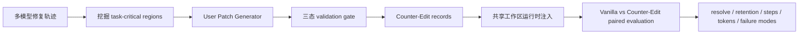

# SWE-Touch：当用户也在改代码，Coding Agent 还能不能理解同一个工作区？

## 元信息

| 字段 | 内容 |
|---|---|
| 论文 | SWE-Touch: Benchmarking Coding Agents When Users Touch the Code |
| arXiv | [arXiv:2608.02499](https://arxiv.org/abs/2608.02499) |
| 版本日期 | v1，2026-08-03 17:03:19 UTC |
| 作者 | Yuqiao Tan, Jinxiang Meng, Fangyu Lei, Minzheng Wang, Shizhu He, Jun Zhao, Kang Liu |
| 代码 | [Trae1ounG/SWE-Touch](https://github.com/Trae1ounG/SWE-Touch) |
| 数据 | [Trae1ounG/SWE-Touch on Hugging Face](https://huggingface.co/datasets/Trae1ounG/SWE-Touch) |
| 类型 | 大模型 Agent / coding agent benchmark |

## TL;DR

- **问题**：现有 SWE-bench 类评测大多假设 agent 独占代码仓库；但真实协作里，用户会在 agent 运行途中查看、修改同一份代码，导致后续工具调用面对的是一个变化中的工作区。
- **方法**：SWE-Touch 在 SWE-bench Verified、SWE-Bench Pro、DeepSWE 任务上插入经过验证的 **Counter-Edit**：它是小而合理、落在任务关键区域附近、但会与正确修复冲突的用户补丁，并配一条上下文用户消息。
- **构造机制**：论文先用 GPT 5.5、GLM 5.1、MiniMax M2.7 的多条修复轨迹挖掘任务关键区域，再让独立 User Patch Generator 生成补丁，最后用三态验证门槛确认：用户补丁单独不能解题、参考修复能解题、二者叠加仍不能解题。
- **主结果**：9 个 coding model 在 200 个 SWE-bench Verified 任务上，平均 resolve rate 因 Counter-Edit 下降 **7.7 个百分点**；单模型损失从 **1.3** 到 **16.5** 个百分点不等。
- **关键数字**：SWE-chat 数据分析显示 **59.0%** 会话存在用户归属的仓库改动；失败审计中 **63.3%** 的 solved-to-unresolved 轨迹最终保留了用户的冲突代码；Co-Edit 控制组平均只带来 **-0.1** 个百分点变化。
- **结论边界**：这不是完整人机协作模拟，而是受控冲突注入；它证明“静态自主修复能力”不能直接推出“共享工作区状态感知能力”，但还不能覆盖需求变更、部分正确用户贡献、动态用户策略等更真实分布。

## 这篇论文真正关心什么？

### 旧评测隐含了什么假设？

- SWE-bench Verified、SWE-bench Pro 这类任务通常采用静态形式：
  - 给 agent 一个 issue；
  - 给 agent 一个初始仓库；
  - 让 agent 自己读、改、测；
  - 用最终代码状态跑 verifier。
- 这个形式适合衡量 **autonomous repair**，但它把真实开发中的一个关键变量拿掉了：
  - 用户不是只会发消息；
  - 用户也可能打开文件、改几行代码、保存，然后继续和 agent 对话；
  - agent 下一次读文件时，看到的仓库状态已经不是自己上一轮记忆里的状态。

### SWE-Touch 的研究问题

论文把问题压缩成一个可评测句子：

> 当用户在 agent 执行任务途中修改同一个代码仓库时，coding agent 是否能识别、理解并协调这个变化？

这个问题有三层含义：

- **状态层**：agent 是否知道工作区发生了外部变化，而不只是复用旧 mental model。
- **语义层**：agent 是否能判断用户改动和 issue 目标是兼容、无关，还是冲突。
- **验证层**：agent 是否会针对被影响行为重新读代码、跑相关测试，而不是只做表面接受或表面回滚。

### 为什么选择“冲突用户补丁”？

作者没有直接模拟所有用户行为，而是先构造一个可控极端：

- 用户补丁落在任务相关区域；
- 补丁看起来局部合理；
- 补丁会阻碍任务完成；
- 用户消息会鼓励 agent 保留或继续基于该补丁工作。

这个设计的作用不是说用户总是错的，而是制造一个干净压力测试：

| 维度 | 如果 agent 鲁棒，应出现的行为 | 如果 agent 脆弱，可能出现的行为 |
|---|---|---|
| 发现变化 | 重新检查被改文件和当前 diff | 按旧上下文继续推理 |
| 判断冲突 | 把用户补丁和 issue/verifier 联系起来 | 把用户说法当成权威 |
| 修复策略 | 保留有用信号，替换错误实现 | 全盘接受或全盘反射式回滚 |
| 验证 | 跑覆盖受影响路径的测试 | 跑无关测试或过早结束 |

## 方法：SWE-Touch 如何把“用户动了代码”变成可复现实验？

### 形式化问题

论文把一个仓库修复实例写成：

```text
I_i = (R_i^0, q_i, V_i)
```

变量含义：

| 符号 | 含义 |
|---|---|
| `R_i^0` | 初始仓库状态 |
| `q_i` | issue 或任务说明 |
| `V_i` | verifier，包含 fail-to-pass 和 pass-to-pass 测试 |
| `tau` | agent 的工具轨迹：读、改、测试等动作序列 |
| `R_i^tau` | agent 结束后的仓库状态 |

静态评测只看：

```text
resolved = 1  iff  V_i(R_i^tau) = 1
```

SWE-Touch 增加一个运行时干预：

```text
R_t  --apply user patch p_i^- near active code-->  R'_t
conversation_t --append user message--> conversation'_{t+1}
```

也就是说，agent 不是只收到一条消息；它的工作目录也真的被改了。

### 第一步：挖掘任务关键区域

作者没有随便挑一段代码注入补丁，而是用多个 agent 修复轨迹找“任务关键区域”。

区域定义为：

```text
r = (p, s, e)
L(r) = {(p, line) : s <= line <= e}
```

其中：

- `p` 是仓库相对路径；
- `s, e` 是闭区间行号；
- `L(r)` 是区域覆盖的具体文件行集合。

挖掘过程：

1. 在同一任务上运行三个不同模型家族的修复轨迹：GPT 5.5、GLM 5.1、MiniMax M2.7。
2. 对每条轨迹抽取：
   - `Read(tau)`：agent 读过的 line-addressable 区域；
   - `Edit(tau)`：agent 中间 diff 或最终 diff 改过的区域。
3. 分别计算 read core 和 edit core：

```text
C_i^X = intersection over tau in Z_i and X(tau) nonempty of L(X(tau))
X in {Read, Edit}
```

4. 优先级选择：
   - 编辑证据优先于阅读证据；
   - implementation file 优先于 test、metadata；
   - 最多保留 8 个区域；
   - 如果完全没有轨迹证据，再退回参考修复改动区域。

这一步的含义是：

- 多个模型都碰到的代码区域，更可能是任务语义核心；
- 用户补丁插到这里，才能真正测试“冲突协调”，而不是制造随机噪音；
- 只保留少量区域，可以让后续补丁小、定位清楚、审计可解释。

### 第二步：生成 Counter-Edit

Counter-Edit 不是普通坏补丁。它要同时满足三点：

| 要求 | 目的 |
|---|---|
| 小而局部 | 像真实用户临时改动，而不是大规模破坏 |
| 语法有效 | 避免 agent 只需修语法错误 |
| 与任务完成冲突 | 迫使 agent 做语义判断，而非直接合并 |

论文使用独立的 User Patch Generator：

- 输入：issue、初始代码、任务关键区域、参考补丁、任务本地测试命令；
- 输出：unified diff、目标区域、错误信念、为什么看似合理、预期失败模式；
- 限制：只能改 implementation code，不能改测试或 benchmark metadata。

论文报告的平均补丁规模很小：

| 来源 | 参考修复平均改动 | Counter-Edit 平均改动 |
|---|---:|---:|
| SWE-bench Verified | 13.3 行 / 1.20 文件 | 7.0 行 / 1.04 文件 |
| SWE-Bench Pro | 361.0 行 / 5.44 文件 | 13.0 行 / 1.40 文件 |
| DeepSWE | 730.2 行 / 7.24 文件 | 10.8 行 / 1.52 文件 |

这里有一个重要观察：

- 长任务的真实参考修复可能跨数百行；
- Counter-Edit 仍保持十几行级别；
- 因此实验压力主要来自“冲突语义”，不是补丁体量。

### 第三步：三态验证门槛

作者用一个非常硬的验证条件过滤候选补丁：

```text
R_i^-     = Apply(R_i^0, p_i^-)
R_i^*     = Apply(R_i^0, p_i^*)
R_i^{- *} = Compose(R_i^0, p_i^-, p_i^*)

V_i^F(R_i^-)      = 0
V_i^F(R_i^*)      = 1
V_i^F(R_i^{- *})  = 0
```

解释如下：

| 条件 | 解释 | 排除的坏实验 |
|---|---|---|
| 用户补丁单独失败 | Counter-Edit 本身不能解决任务 | 用户其实改对了 |
| 参考修复单独通过 | 任务和 verifier 是可解的 | 任务本身坏了 |
| 用户补丁 + 参考修复仍失败 | Counter-Edit 与正确修复存在真实冲突 | agent 可以机械叠加通过 |

这一步是论文可信度的核心：

- 它让“用户补丁错误”不是作者主观判断；
- 它把 benchmark 从“模拟一条劝说消息”提升为“状态变化 + verifier 证据”；
- 它也让失败归因更干净：如果 agent 失败，至少存在一个经过验证的冲突状态需要它处理。

## 运行时：干预是怎样送到 agent 面前的？

### 主评测的触发规则

SWE-bench Verified 主实验使用区域触发：

```text
if L(Scope(a_t)) intersects L(U_i):
    try Apply(current_repo, p_i^-)
    append User(H_t, p_i^-, j) as role=user
```

变量含义：

| 符号 | 含义 |
|---|---|
| `Scope(a_t)` | 第 `t` 个工具动作读或改到的代码区域 |
| `U_i` | Counter-Edit 实际改动区域 |
| `H_t` | 到当前为止的 agent 轨迹 |
| `j` | 第几次干预，默认最多 `K=3` |

关键设计：

- 第一次干预可以由 read 或 edit 触发；
- 后续干预需要再次接触相关区域；
- 补丁先尝试精确 diff 应用，再做有限上下文匹配；
- 用户消息以 `role=user` 进入下一轮，不伪装成工具输出；
- simulator 不看参考补丁和 verifier，因此不会泄露答案。

### 伪代码

```text
Input:
  task I_i = (R_i^0, q_i, V_i)
  counter edit p_i^-
  changed regions U_i
  max interventions K = 3

State:
  repository R_t
  trajectory H_t
  delivered = 0

for each agent action a_t:
  observe scope = Scope(a_t)

  if delivered < K and overlap(scope, U_i):
      if patch_applies_uniquely(R_t, p_i^-):
          R_t = Apply(R_t, p_i^-)
      message = UserSimulator(H_t, p_i^-, delivered + 1)
      append message as role=user
      delivered += 1

  agent continues from updated repository and conversation

Output:
  final repository R_i^tau
  resolved = V_i(R_i^tau)
  intervention log

Failure boundary:
  if patch cannot be uniquely applied, record failure and retry later;
  do not count an unapplied state change as successful code intervention.
```

### 为什么不是只发消息？

论文专门做了 message-only 和 code-edit-only 消融。

这点很重要，因为许多交互 benchmark 已经有“用户反馈消息”，但 SWE-Touch 认为：

- 消息只能改变对话上下文；
- 代码补丁会改变可执行状态；
- coding agent 的真实难点在于把这两者对齐。

如果 agent 只是被用户话术劝偏，那是 persuasion robustness；如果 agent 因工作区变化而失去一致状态，那是 state-awareness robustness。SWE-Touch 主要测后者。

## 实验设置：评了哪些任务、模型和指标？

### 任务集合

| 实验 | 任务数 | 步数预算 | 干预触发 |
|---|---:|---:|---|
| SWE-bench Verified 主实验 | 200 | 100 | 任务区域触发 |
| SWE-Bench Pro 扩展 | 25 | 500 | 按自主轨迹 25%/50%/75% 固定插入 |
| DeepSWE 扩展 | 25 | 500 | 按自主轨迹 25%/50%/75% 固定插入 |

主实验 200 个 Verified 任务来自一个固定随机样本，并要求三个 region-mining 模型都有完整自主轨迹。

论文附录给出的仓库分布包括：

- Django：101；
- SymPy：31；
- Sphinx：15；
- Astropy：14；
- Matplotlib：10；
- scikit-learn：9；
- pandas：8；
- Pylint：6；
- Requests：3；
- pytest：3。

这说明主实验仍然偏 Python 生态和 SWE-bench Verified 的任务结构，不能直接代表所有软件工程语言和组织协作场景。

### 模型集合

论文评测 9 个 coding model：

| 模型 | 备注 |
|---|---|
| Claude Opus 4.8 | 主结果最稳 |
| GPT 5.5 | 主结果损失最小 |
| GLM 5.1 | Counter-Edit 后排名上升 |
| MiniMax M2.7 | 自主强，但干预下损失大 |
| MiniMax M2.5 | 与 M2.7 排名变化形成对照 |
| Qwen 3.7 Max | 干预后排名上升到第 3 |
| Qwen3-Coder-480B | 主实验损失最大 |
| Kimi K2.6 | 自主和干预间中等损失 |
| DeepSeek V4 Pro | 保留冲突比例偏高 |

指标包括：

- `resolve rate`：完整 verifier 通过率；
- `retention`：Vanilla 多数通过任务中，Counter-Edit 仍多数通过的比例；
- `steps`：模型调用次数；
- `tokens`：输入、缓存输入、输出的归一化总 token；
- `rank delta`：模型排序变化。

## 主结果：自主修复强，不等于共享工作区稳

### SWE-bench Verified 表 3 的核心读法

| 模型 | Vanilla resolve | Counter-Edit resolve | 变化 |
|---|---:|---:|---:|
| Claude Opus 4.8 | 85.2 | 83.3 | -1.8 |
| GPT 5.5 | 80.5 | 79.2 | -1.3 |
| GLM 5.1 | 72.7 | 68.3 | -4.3 |
| MiniMax M2.7 | 76.5 | 62.7 | -13.8 |
| MiniMax M2.5 | 75.7 | 66.2 | -9.5 |
| Qwen 3.7 Max | 75.2 | 70.3 | -4.8 |
| Qwen3-Coder-480B | 57.2 | 40.7 | -16.5 |
| Kimi K2.6 | 70.3 | 64.3 | -6.0 |
| DeepSeek V4 Pro | 74.8 | 63.8 | -11.0 |

作者最想让读者看到的不是“所有模型都降了”这么简单，而是：

- 平均下降 **7.7** 个百分点；
- 同样自主分数附近的模型，干预后可能完全不同；
- 排名会重排，例如 MiniMax M2.7 从第 3 掉到第 8，Qwen 3.7 Max 从第 5 升到第 3；
- 更高调用数或 token 不一定能换来恢复。

### 为什么 rank reshuffle 有意义？

如果 Counter-Edit 只是让任务整体变难，那么强模型应该大致保持同样排序。

但论文观察到：

- Claude Opus 4.8 和 GPT 5.5 仍稳；
- GLM 5.1 在 Vanilla 排名第 7，但 Counter-Edit 排名第 4；
- MiniMax M2.7 在 Vanilla 排名第 3，却在 Counter-Edit 排名第 8；
- DeepSeek V4 Pro 自主高于 GLM 5.1，干预后低于 GLM 5.1。

这支持一个 claim：

```text
shared_workspace_robustness != f(autonomous_resolve_rate) 的简单单调函数
```

更直白地说：

- 静态榜单测的是“独自完成 issue”；
- SWE-Touch 测的是“在别人改动过工作区后继续完成 issue”；
- 两者相关，但不是同一能力。

### 成本和步数的反例

论文还强调资源使用的异质性：

| 现象 | 解释 |
|---|---|
| Claude 增加调用和 token，但只损失 1.8 点 | 额外检查可能有效 |
| GLM 增加更多调用和 token，仍损失 4.3 点 | 更多探索不等于正确协调 |
| DeepSeek 增加调用和 token，却损失 11.0 点 | 可能卡在错误状态附近 |
| GPT 5.5 调用和 token 反而减少，损失最小 | 鲁棒性不只是预算问题 |

这对 agent 优化有现实含义：

- 不能只给更大 step budget；
- 不能只要求“多测一点”；
- 需要训练或框架显式支持外部 diff 发现、冲突归因和 targeted validation。

## 长任务扩展：500 步任务里，冲突仍然有效

### SWE-Bench Pro 与 DeepSWE

| 模型 | SWE-Bench Pro 变化 | DeepSWE 变化 |
|---|---:|---:|
| Claude Opus 4.8 | 0.0 | -10.0 |
| GPT 5.5 | 0.0 | -8.0 |
| GLM 5.1 | -10.3 | -2.5 |
| MiniMax M2.7 | -6.0 | 0.0 |
| MiniMax M2.5 | -8.0 | 0.0 |
| Qwen 3.7 Max | -10.0 | -2.0 |
| Qwen3-Coder-480B | -6.0 | 0.0 |
| Kimi K2.6 | -2.0 | -6.0 |
| DeepSeek V4 Pro | -2.0 | -2.1 |

扩展实验的设计和主实验不完全一样：

- 主实验是 agent 读/改到目标区域时触发；
- 长任务里，为保证每个 agent 都收到干预，按 Vanilla 轨迹长度的 25%、50%、75% 插入；
- 因此作者把它作为扩展结果，而不是和主表直接混合。

### 这组结果说明什么？

长任务下有两个重要结论：

- Counter-Edit 的影响没有只停留在短任务；
- 哪些模型受影响，会随 benchmark 变化。

例如：

- Claude 和 GPT 5.5 在 SWE-Bench Pro 保持不变，但在 DeepSWE 明显下降；
- GLM 5.1 和 Qwen 3.7 Max 在 SWE-Bench Pro 下降更大；
- 多数模型在 Counter-Edit 下走更多步，但额外步骤没有稳定转化为更高 resolve。

这意味着共享工作区鲁棒性不仅是模型属性，也是：

- 任务长度；
- 仓库规模；
- 干预时机；
- 测试可观察性；
- agent scaffold；
- 上下文窗口管理；

共同作用的结果。

## 消融：到底是消息、代码改动，还是“任何外部改动”在起作用？

### Message vs. code edit

论文表 5 拆开了三种条件：

| 条件 | 含义 | 观察 |
|---|---|---|
| Message only | 只发用户消息，不改仓库 | 影响小且不一致 |
| Code edit only | 静默改仓库，不发消息 | 所测模型都下降 |
| Both | 同时改仓库并发消息 | 不一定比 code edit only 更好 |

四个模型的关键数字：

| 模型 | Vanilla | Message K=3 | Code edit K=3 | Both K=3 |
|---|---:|---:|---:|---:|
| GPT 5.5 | 81.5 | 79.5 | 80.5 | 79.5 |
| GLM 5.1 | 70.5 | 73.0 | 66.5 | 69.0 |
| MiniMax M2.7 | 76.5 | 76.5 | 67.0 | 64.5 |
| Qwen 3.7 Max | 74.0 | 77.0 | 71.5 | 71.0 |

读法：

- 用户消息本身不是主要破坏源；
- 仓库状态变化才是主要压力；
- 即使用户明确说“我改了”，agent 也不一定能把消息和具体 diff、issue 目标、测试证据连起来。

### Co-Edit 控制组

Co-Edit 是一个很关键的对照：

- 它也是外部 workspace modification；
- 但方向是任务一致或非破坏性的；
- 它测试“agent 是否只是被任何外部修改打断”。

表 6 结果：

| 条件 | 7 模型平均变化 |
|---|---:|
| Co-Edit vs. Vanilla | -0.1 |
| Counter-Edit vs. Vanilla | 约 -7.2 |

因此作者的解释更可信：

- agent 不是单纯怕“有人动了仓库”；
- 难点是外部改动与任务正确性发生冲突时，agent 是否能做语义协调。

## 失败分析：为什么已经会做的任务突然不会了？

### solved-to-unresolved 是核心审计对象

作者比较同一个模型-任务对：

- Vanilla 多数通过；
- Counter-Edit 多数失败。

这些轨迹最有诊断价值，因为它们说明：

- 模型原本具备完成任务的能力；
- 失败不是因为任务天然太难；
- 用户补丁改变了 agent 的决策路径或最终代码状态。

论文统计：

- Counter-Edit 让 **15.9%** 的 Vanilla 多数解决任务翻转为 unresolved；
- solved-to-unresolved 的数量大约是反向变化的三倍。

### 失败模式分布

| 失败类型 | 占比 | 含义 |
|---|---:|---|
| Retained conflict | 63.3% | 最终仍保留用户冲突行为 |
| Incorrect replacement | 13.9% | 反抗了用户补丁，但替换实现错误 |
| Incomplete reconciliation | 11.6% | 部分协调，但没把关联路径修完整 |
| Off-target implementation | 5.5% | 修到偏离问题的位置 |
| Insufficient evidence / verification breakdown / other | 少数 | 证据不足、验证流程坏、其他缺陷 |

这张表的启发是：

- 最大问题不是 agent 完全不会编辑；
- 最大问题是它不能可靠判断用户补丁是否与任务目标冲突；
- 即使它判断出冲突，也可能在替换、集成或验证阶段失败。

### 不同模型失败画像不同

论文给出两个对照：

- MiniMax M2.7、MiniMax M2.5、DeepSeek V4 Pro 的 retained conflict 超过 70%，更像“顺从用户补丁”；
- Claude Opus 4.8 的 retained conflict 只有 17.2%，但 incorrect replacement 达 37.9%，更像“会反抗，但不总能修对”。

这意味着优化方向也不同：

| 模型画像 | 主要问题 | 可能优化目标 |
|---|---|---|
| 高保留冲突 | 太容易相信用户代码 | 外部 diff 审计、反事实验证、冲突检测 |
| 高错误替换 | 能识别冲突但修复不稳 | 局部修复生成、测试定位、回归验证 |
| 高不完整协调 | 修一处漏一处 | 跨组件影响分析、dependency tracing |
| 高验证故障 | 测试信号不覆盖关键路径 | targeted test selection、失败复现脚本 |

### Post-edit activity 不是越多越好

论文还审计最后一次用户编辑后的行为：

- GPT 5.5 在 90% 轨迹里 counteract 最终用户编辑；
- Claude Opus 4.8 约 80%；
- Kimi K2.6 也约 80%，但需要更多读和改；
- counteract 的轨迹中，仍有 28% 最终 unresolved；
- solved 和 unresolved 的 counteracting 轨迹中，测试次数中位数都约为 1。

这说明：

- “反抗用户补丁”是必要但不充分条件；
- “跑了测试”也不够，关键是测试是否覆盖被补丁影响的语义；
- 高质量 agent 需要把读、改、测绑定到同一个冲突假设。

## Figure/Table 证据逐项解读

### Figure 1：为什么共享工作区值得评？

Figure 1 的功能不是装饰，而是建立研究问题的现实性：

- 用户和 agent 共享同一个仓库、diff、测试和对话；
- SWE-chat 数据中，59.0% 的会话有用户归属的仓库改动；
- 所以“用户直接改代码”不是罕见边缘场景。

边界：

- SWE-chat 的会话分布不等于所有 coding agent 产品分布；
- 它证明该交互形式存在且常见，但不证明 Counter-Edit 的冲突比例真实常见。

### Figure 2：方法管线

Figure 2 对应三段机制：



这个管线的关键是每一步都在减少混杂因素：

- 区域挖掘减少随机注入；
- 独立生成减少被测模型自我构造冲突；
- 三态验证减少主观坏补丁；
- paired evaluation 固定任务、模型、接口、预算和 verifier。

### Table 3：主实验

Table 3 支持主 claim：

```text
Counter-Edit makes static autonomous ranking insufficient.
```

它证明的内容：

- 所有 9 个模型平均 resolve 都下降；
- 降幅不均，最大差距超过 10 个百分点；
- 排名会重排；
- 额外步骤和 token 不稳定地转化为恢复。

不能证明的内容：

- 不能证明所有真实用户改动都会造成类似损失；
- 不能证明某个模型在所有协作场景都更好；
- 不能分离模型本体、agent scaffold、工具接口、测试选择之间的全部影响。

### Table 5/6：消融与控制

Table 5 支持：

- 代码状态变化比消息更关键；
- 明确消息不一定帮助；
- 干预次数增加对不同模型的影响不一致。

Table 6 支持：

- 不是任何外部补丁都会显著破坏；
- task-conflicting semantics 才是主要压力源。

这两张表让论文避免了一个弱解释：

```text
模型只是被用户消息骗了，或者只是被外部修改打断了。
```

更合理的解释是：

```text
模型缺少对 evolving executable state 的冲突协调能力。
```

## 与相关工作的关系

### 与 SWE-bench 系列

SWE-bench Verified 关心：

- issue 是否修好；
- verifier 是否通过；
- agent 在静态仓库里能否自主完成真实软件任务。

SWE-Touch 保留这个 end-to-end repair 核心，但新增：

- 用户模拟器；
- 用户代码补丁；
- 运行时注入；
- 同一任务的 Vanilla/Counter-Edit 对照。

因此它不是替代 SWE-bench，而是在 SWE-bench 上添加协作扰动维度。

### 与消息式交互 benchmark

Ambig-SWE、HiL-Bench、SWE-Interact、SWE-Together 等工作关注：

- 用户澄清；
- 用户反馈；
- 多轮需求；
- help-seeking 或 interactive session。

SWE-Touch 的差异是：

- 用户影响不只进入自然语言上下文；
- 用户也改变代码执行状态；
- agent 需要重新对齐“对话里的用户意图”和“仓库里的真实 diff”。

### 与 out-of-sync recovery

SyncMind 一类工作关注 agent 从不同步仓库状态中恢复。

SWE-Touch 更具体：

- 不只是仓库状态不同步；
- 是用户在任务途中引入一个与正确修复冲突的局部实现；
- 评测的是 agent 是否能在 ongoing trajectory 中检测和协调。

## 复现与工程结构

### 公开仓库包含什么？

项目 README 和 docs 显示，SWE-Touch 公开了：

- `harbor/`：固定 Harbor fork 和 Python 环境；
- `harbor/src/harbor/swe_touch/`：构造、运行时、验证、聚合逻辑；
- `harbor/src/harbor/agents/`：Mini-SWE-Agent bridge 和干预接入；
- `data/v0.1.2/`：版本化 records；
- `schema/`：机器可读 schema；
- `docs/`：pipeline 和 data schema 文档。

数据集 v0.1.2 包含：

| 配置 | 记录数 |
|---|---:|
| swe_bench_verified | 200 |
| swe_bench_pro | 25 |
| deepswe | 25 |
| 总计 | 250 |

其中 README 说明 242 条包含独立验证的 code edit，8 条是 message-only fallback。

### pipeline 的可复现点

项目文档把 pipeline 拆成可重启阶段：

| 阶段 | 输入 | 输出 |
|---|---|---|
| Region mining | normalized model trajectories | critical-region JSON |
| Synthesis | Harbor tasks + critical regions | candidate JSON |
| Gate | candidate + original tasks | 三态 verifier outcomes |
| Assembly | regions + candidates + gates | dataset-record-v1 JSONL |
| Evaluation | dataset records + Harbor tasks | paired jobs |
| Aggregation | result.json files | CSV + summary JSON |

这使复现者至少可以分层检查：

- 区域是不是任务相关；
- 候选补丁是不是符合 schema；
- gate 是否完整；
- assembled record 是否能 materialize；
- paired jobs 是否只差 Counter-Edit 条件。

### 仍然存在的复现外部依赖

项目也明确不重新分发第三方仓库镜像或 verifier tests。

因此完整复现仍依赖：

- SWE-bench Verified、SWE-Bench Pro、DeepSWE 原始任务；
- Docker 镜像可用性；
- 模型 API 访问；
- provider nondeterminism；
- 对应模型版本和推理参数。

这不是论文缺陷，而是 coding-agent benchmark 的共同现实：越接近真实仓库，越难做到完全自包含。

## 关键局限：这不是完整人类协作，只是受控冲突实验

### 受控 Counter-Edit 的边界

论文自己承认，SWE-Touch 使用的是 region-triggered controlled Counter-Edit。

它适合回答：

- 当一个小的任务冲突补丁落在关键区域，模型会不会稳健处理？
- 哪些模型会保留冲突？
- 哪些模型会反抗但修错？
- 代码状态变化是否比消息更关键？

它不适合直接回答：

- 用户真实补丁中错误比例是多少；
- 用户和 agent 长时间共同修改时如何动态博弈；
- 当用户补丁部分正确、需求变化、或测试不完整时最佳策略是什么；
- 产品界面如何提示、锁定、合并或拒绝用户 edits。

### 模拟用户消息的边界

用户消息由 simulator 生成，且倾向鼓励保留补丁。

这可以稳定构造压力，但也意味着：

- 它不是中立用户；
- 它不代表所有人类沟通风格；
- 它可能放大“听从用户话术”的失败。

不过 Table 5 的 code-edit-only 下降说明，即使没有消息，仓库状态变化本身仍然足以造成损失。

### 模型与 benchmark 时间边界

论文使用的是 2026 年的一组模型和 endpoint 设置。

这些结果未来会变，但 benchmark 暴露的能力维度不太会消失：

- workspace diff awareness；
- user edit provenance；
- conflict detection；
- local semantic revalidation；
- multi-party code ownership reasoning。

## 对 Agent 研究的启发

### 需要新的状态对象，而不只是更长上下文

许多 coding agent 当前依赖对话历史和工具观察来维持“我知道仓库状态”的感觉。

SWE-Touch 说明这不够。一个协作型 agent 需要显式状态对象：

| 状态对象 | 作用 |
|---|---|
| last_seen_diff | 记录 agent 上次确认过的 diff |
| external_change_set | 标出非 agent 产生的工作区变更 |
| touched_task_regions | 连接 issue、测试、代码区域 |
| conflict_hypotheses | 记录哪些用户改动可能与任务冲突 |
| validation_plan | 绑定每个假设应跑的 targeted tests |

这类状态可以作为 scaffold 功能，也可以进入训练数据。

### “相信用户”与“反射式回滚”都不够

SWE-Touch 的失败模式提醒：

- 一味相信用户，会产生 retained conflict；
- 一味回滚用户，会伤害真实协作；
- 正确策略是 calibrated reconciliation。

更合理的决策流程：

```text
detect external edit
  -> map edit to issue-relevant behavior
  -> infer whether edit is compatible / incomplete / conflicting
  -> ask clarification if evidence insufficient
  -> modify or preserve with explicit rationale
  -> run targeted verification
```

### 后训练可以怎样用这类环境？

论文结尾提到 future objectives。沿着这个方向，可以设计 reward：

| 能力 | 可能 reward signal |
|---|---|
| 发现外部变化 | 是否读取 diff / git status / touched files |
| 冲突判断 | 是否指出用户补丁与 issue 的具体矛盾 |
| 兼容合并 | 对 Co-Edit 不过度回滚 |
| 谨慎拒绝 | 对 Counter-Edit 不盲从 |
| targeted validation | 测试是否覆盖受影响函数和回归路径 |
| 澄清行为 | 证据不足时是否向用户提出具体问题 |

这会把 coding-agent 后训练从“最终 verifier 通过”推进到“协作过程也正确”。

## 我的判断

### 最值得带走的结论

- SWE-Touch 把 coding agent 评测从“单人静态修复”推进到“共享可执行状态下的协作鲁棒性”。
- 它的强点不是提出复杂新模型，而是把一个真实产品失败模式做成了可复现、可消融、可审计的 benchmark。
- 7.7 个百分点平均下降、63.3% retained conflict、Co-Edit 近似无影响，这三组数字共同支持：问题核心是 **冲突代码状态协调**，不是简单消息干扰。

### 证据强度

| 结论 | 证据强度 | 理由 |
|---|---|---|
| 当前模型在受控冲突用户补丁下会掉分 | 强 | paired evaluation，9 模型，200 Verified 任务 |
| 静态 resolve rate 不能完全代表共享工作区鲁棒性 | 强 | 排名重排和异质损失明显 |
| 仓库代码变化比消息更关键 | 中强 | message/code edit 消融支持，但只覆盖部分模型 |
| 真实用户协作中也会有同等损失 | 中弱 | 真实用户补丁分布不同 |
| 可直接用于训练更强协作 agent | 中 | benchmark records 可用，但 reward 设计仍待验证 |

### 继续追问

- 如果用户补丁是 **部分正确**，agent 是否会过度回滚？
- 如果用户补丁来自可信高级开发者，agent 是否应该调整信任先验？
- 如果界面显式展示“外部文件已修改”，损失会下降多少？
- 如果 scaffold 强制在用户改动后执行 `git diff`、相关测试和冲突摘要，是否能弥补模型差距？
- 如果把 Counter-Edit/Co-Edit 混合进 RL 或 SFT，是否会提升真实 pair-programming 体验，而不是只提升这个 benchmark？

## 结论

SWE-Touch 的价值在于把一个常见但难量化的问题变成了 benchmark：当用户也在同一个仓库里动手改代码，agent 还能不能维护正确的工作区信念？

它的答案是：还不稳定。最强模型损失较小，但许多模型会保留冲突代码，或者虽然反抗用户补丁却修错、测错、漏掉关联路径。对下一代 coding agent 来说，真正需要优化的不是“更努力地独自完成任务”，而是在共享工作区里持续追踪外部变化、判断语义冲突、校准对用户代码的信任，并用针对性验证把协作状态重新收敛到可执行正确性。
