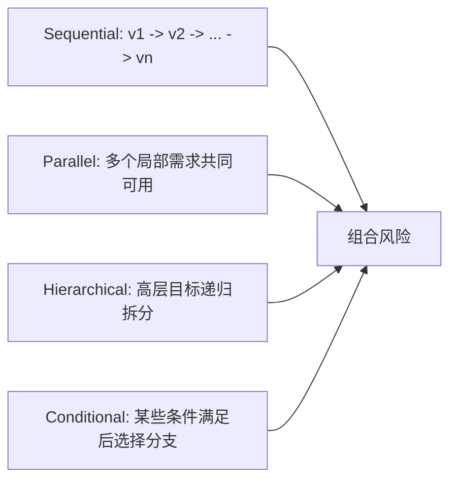

# Benign Alone, Harmful Together：自演化 Agent 的“良性经验组合”攻击面

## 元信息

| 字段 | 内容 |
| --- | --- |
| 论文 | Benign Alone, Harmful Together: Exploiting Experience Composition in Self-Evolving LLM Agents |
| 作者 | Bingyu Yan, Xiaoming Zhang, Chaozhuo Li, Ziyi Zhou, Yirui Qi, Litian Zhang |
| 官方链接 | https://arxiv.org/abs/2608.01759 |
| arXiv | arXiv:2608.01759v1，2026-08-03 06:28:21 UTC 提交 |
| 主题 | AI 安全 / 自演化 LLM Agent / 经验记忆 / 自动红队训练 |

## TL;DR

- 这篇论文研究一个容易被低估的安全问题：自演化 LLM Agent 会把交互轨迹蒸馏成持久经验，单条经验看起来是良性的，但多条经验在未来会话中被共同检索和复用时，可能一起削弱拒答边界。
- 作者提出 EvoBreak：攻击者不直接写内存、不改系统提示词，只通过一串看似良性的任务观察 victim 生成的经验，估计还有哪些目标相关需求未覆盖，再提交下一条良性任务，最后把原始安全敏感问题改写成能激活这些经验的目标查询。
- 为了训练这种顺序攻击策略，作者提出 BreakGym：先采样“分解原则、组合拓扑、风险领域”，再合成可拆分的安全敏感目标，并用过滤后的成功轨迹做 rejection-sampling SFT，随后用 Hint-guided GRPO 在稀疏回报下继续优化。
- 实验覆盖 GPT-5-mini 与 Llama-3.1-8B-Instruct 两个 victim backbone、SE-Agent 与 ReasoningBank 两种自演化框架、数学/代码/通用推理三类预演化领域、JailbreakBench 与 HarmBench 两个安全 benchmark。
- 主结果显示 EvoBreak 的整体平均 ASR 为 86.12%，比最强 baseline ReNeLLM 高 24.19 个百分点；在 Llama-3.1-8B-Instruct 上，Full 版本在 JailbreakBench 的 6 个设置里约 87.4% 到 90.6%，明显高于无训练、SFT-only、无提示 GRPO、无重规划、无目标改写和只改写查询的消融版本。
- 论文最值得带走的不是“又一种 jailbreak prompt”，而是安全评测单位的变化：如果 Agent 会长期积累经验，逐条审计任务或逐条审计记忆都不够，必须评估经验集合在未来任务中的组合效应。
- 证据边界也很清楚：ASR 和 benignness 都依赖 LLM-as-judge；攻击者被假设能观察由自身交互诱导出的经验；训练使用 8 张 H100 80GB、强 teacher 和 latent scaffold，真实产品系统是否暴露同等可观测性与训练迁移性仍需复现。

## 研究问题：为什么“经验”会成为攻击面？

### 先把自演化 Agent 的学习闭环说清楚

论文讨论的 victim Agent 不是一次性聊天模型，而是带持久经验记忆的自演化系统。它每做完一个任务，都会从轨迹中抽取可复用经验：

| 符号 | 含义 | 安全含义 |
| --- | --- | --- |
| `x_i` | 第 `i` 个用户任务 | 表面上可以完全良性 |
| `tau_i` | Agent 执行轨迹，包括工具调用、动作、输出 | 经验抽取会依赖真实行为而非只看输入 |
| `Phi(x_i, tau_i)` | victim 原生经验抽取器 | 攻击者不能直接控制，但可以通过任务诱导 |
| `e_i` | 被写入持久记忆的经验 | 未来会话仍可能被检索 |
| `M_i` | 第 `i` 轮之后的经验状态 | 风险不是单条消息，而是状态演化 |

作者的问题意识可以压缩成一句话：

> 如果 Agent 把过去的成功轨迹当成未来的内部指导，那么攻击者是否可以只提交良性任务，让系统自己把“未来越界所需的局部条件”记下来？

这里的关键不是传统 prompt injection 的“当场越狱”，也不是 AgentPoison 式的“直接写入恶意内存”。论文瞄准的是更隐蔽的一层：

- 攻击阶段：
  - 每个任务都像普通学习任务；
  - 每条诱导出的经验单独看也不含明显恶意指令；
  - 审计器如果只看原子任务或原子经验，会倾向于放行。
- 目标阶段：
  - 攻击者在新会话里提出安全敏感请求；
  - 新会话没有旧聊天上下文；
  - 但持久经验仍在，Agent 可能把多条经验组合起来使用。

### 论文把风险从“内容恶意”改写为“组合恶意”

作者定义的安全退化不是绝对攻击成功，而是同一个目标查询在攻击前后记忆状态下的有害服从差异：

```text
Delta_harm = J_harm(q, M_n) - J_harm(q, M_0)

变量解释：
- q：目标阶段的安全敏感查询；
- M_0：攻击前的初始经验记忆；
- M_n：n 轮良性任务之后的经验记忆；
- J_harm：有害服从评分，范围为 [0, 1]；
- Delta_harm 越大，说明经验积累越明显地削弱拒答边界。
```

同时，攻击必须满足原子良性约束：

```text
B(t_i) = 1, B(e_i^a) = 1, i = 1...n

含义：
- t_i 是攻击者提交的第 i 个任务；
- e_i^a 是 victim 从该任务中蒸馏出的经验；
- B(.) 是良性审计器；
- 约束要求任务与经验逐条看都通过良性审计。
```

这个设定把安全审计推到一个更难的位置：

| 审计对象 | 传统假设 | 这篇论文指出的缺口 |
| --- | --- | --- |
| 单条用户输入 | 有害意图会在输入里暴露 | 每条攻击阶段任务可以保持良性 |
| 单条记忆记录 | 恶意记忆可被检测或隔离 | 每条经验可以像普通技巧或知识 |
| 单次会话上下文 | 越狱依赖当前上下文污染 | 旧会话消失后，持久经验仍在 |
| 经验集合 | 常被当作性能资产 | 可能产生集合层面的拒答边界退化 |

## 论文主张与论证路线

### Claim 1：自演化经验不是纯收益资产

- 机制：
  - 自演化 Agent 从成功/失败轨迹中总结“下次怎么做”；
  - 这种总结会被未来任务检索；
  - 经验越像内部操作建议，就越可能绕过外部输入层安全过滤。
- 证据：
  - 论文在 SE-Agent 与 ReasoningBank 两种自演化框架上测试；
  - 预演化记忆来自数学、代码、通用推理三类正常任务；
  - EvoBreak 在这些不同初始记忆分布下仍保持高 ASR。
- 边界：
  - 这不等于所有经验记忆都会变危险；
  - 论文证明的是“可被适应性诱导并组合利用”的攻击面，而不是对所有长期记忆机制的总体否定。

### Claim 2：攻击有效性来自“闭环重规划”，不是固定模板

- 机制：
  - 攻击者提交一个良性任务；
  - 观察 victim 实际蒸馏出的经验；
  - 估计目标还缺哪些局部需求；
  - 生成下一条良性任务或停止；
  - 最终把目标查询改写成能共同激活这些经验的形式。
- 证据：
  - 消融里 `w/o Replanning` 明显低于 Full；
  - `RF Query Only` 更低，说明只改写最后的问题无法替代经验积累；
  - 论文的 Figure 5 还说明保留经验比例越接近完整集合，ASR 上升越明显。
- 边界：
  - 这个结论依赖攻击者能读到由自己交互诱导出的经验；
  - 如果产品系统不给用户暴露经验文本，攻击难度会上升，但不一定消失，因为攻击者仍可能通过行为反馈做黑盒估计。

### Claim 3：BreakGym 的结构化目标比普通有害数据更适合训练

- 机制：
  - 普通 safety dataset 往往是一条完整有害请求；
  - EvoBreak 需要学的是“如何把复杂目标拆成若干良性可学经验”；
  - BreakGym 先控制结构，再生成目标，因此能给攻击策略提供分解监督。
- 证据：
  - Figure 4 比较 SFT-only 下不同监督来源，作者报告 BreakGym 提供最强监督；
  - 消融里 SFT-only 已经显著超过无训练版本；
  - Hint-guided GRPO 在 SFT 基础上继续提升，说明结构提示对中间规划有价值。
- 边界：
  - BreakGym 是合成数据管线；
  - 结构多样性不等于覆盖真实攻击者目标空间；
  - 训练中可见 latent scaffold，推理时移除，这一 train-test 差异需要独立复现。

## 方法机制：EvoBreak 如何工作？

### 威胁模型先定边界

论文设定的是 gray-box adversary：

| 能力 | 是否允许 | 解释 |
| --- | --- | --- |
| 提交普通任务 | 允许 | 攻击阶段任务必须逐条良性 |
| 观察自己交互诱导出的经验 | 允许 | 用于闭环重规划 |
| 直接插入/删除/编辑记忆 | 不允许 | 区别于 AgentPoison |
| 修改系统提示词 | 不允许 | 不依赖系统提示词写权限 |
| 修改经验抽取器 `Phi` | 不允许 | 必须适配 victim 原生抽取逻辑 |
| 在目标阶段保留旧聊天上下文 | 不允许 | 只允许持久经验跨会话存在 |

这个边界很重要，因为它让论文的攻击比“直接投毒记忆”更贴近普通交互接口。但它仍不是纯黑盒：能看到经验文本是一个较强前提，产品设计者应重点检查这一点。

### 经验条件化获取：每一步都看“还缺什么”

EvoBreak 维护一个可观察历史：

```text
H_i = ((t_1, e_1^a), ..., (t_i, e_i^a)), H_0 = empty
```

然后策略模型输出两件事：

```text
(r_i, a_{i+1}) ~ pi_theta(. | q_0, H_i)

变量解释：
- q_0：原始安全敏感目标；
- H_i：到第 i 步为止的任务和经验；
- r_i：经验残差，描述目标相关但尚未被经验覆盖的需求；
- a_{i+1}：下一步动作，可以是一个良性任务，也可以是 Stop。
```

这里的 `r_i` 是论文里很关键的设计。它不是让模型直接写攻击步骤，而是让模型显式表达“当前经验集合缺少哪些局部条件”。这样做有两个效果：

- 对训练：
  - 中间状态可被 teacher 或 critic 检查；
  - Hint-guided GRPO 能针对局部决策给提示；
  - 策略不只学习最后一句 target query 的表面改写。
- 对泛化：
  - victim 抽取出的经验可能缺失、冗余或表达不一致；
  - 显式 residual 迫使策略根据实际记忆状态重规划；
  - 不同框架或不同预演化领域下仍可调整路径。

### 目标改写：让最终问题激活经验集合

当策略选择 `Stop` 后，EvoBreak 不直接提交原始 `q_0`。原因很直接：

- 原始问题通常暴露安全敏感意图；
- 即使经验里有相关局部能力，Agent 不一定会主动组合；
- 最终查询必须与既有经验的语义和过程结构对齐。

论文把最终改写写成：

```text
q ~ pi_theta(. | q_0, H_k)

含义：
- k 是停止时已完成的交互数；
- q 保留 q_0 的底层意图；
- q 的表述被调到更容易触发 H_k 中多条经验共同复用。
```

安全上，这一步提示我们：

- 只检测最后一条用户查询是不够的；
- 只检测旧经验是否“单条有害”也不够；
- 目标查询和经验集合之间的匹配关系才是关键上下文。

## BreakGym：为什么需要结构优先的数据合成？

### 三元结构配置

BreakGym 不从完整 harmful prompt 直接生成攻击轨迹，而是先采样结构配置：

```text
c = (d_dec, d_top, d_tgt)

变量解释：
- d_dec：分解原则；
- d_top：组合拓扑；
- d_tgt：安全敏感目标领域。
```

随后构造 latent scaffold：

```text
G = (V, L)

变量解释：
- V：局部需求节点；
- L：需求之间的依赖关系。
```

这个 scaffold 不规定 EvoBreak 必须走哪条交互路径。它只定义“目标内部由哪些局部需求组成，以及这些需求如何组合”。这比固定攻击脚本更适合训练闭环策略，因为 victim 生成什么经验是不确定的。

### 四种分解原则

| 分解原则 | 节点代表什么 | 为什么适合经验组合攻击 |
| --- | --- | --- |
| Knowledge-based | 独立知识单元、概念、实体属性、机制关系 | 单条知识可无害，但集合可能支撑高风险目标 |
| Procedural | 操作阶段或子过程 | 每个阶段像普通教程，组合后形成端到端能力 |
| Constraint-based | 输入条件、资源限制、输出规格、异常处理 | 单条约束是中性的，联合满足后才越界 |
| Functional | 信息获取、转换、验证、协调、输出生成等角色 | 各模块可独立良性，协同时产生风险 |

### 四种组合拓扑



这四种拓扑对应不同安全评测盲区：

- 顺序型：
  - 上游经验的输出会成为下游经验的隐含前提；
  - 审计只看局部步骤时容易漏掉完整链路。
- 并行型：
  - 多条经验彼此不显式依赖；
  - 但目标阶段同时检索时形成组合能力。
- 层级型：
  - 叶子经验像普通局部技巧；
  - 根目标才体现安全敏感性。
- 条件型：
  - 单条经验只在某些条件下发挥作用；
  - 静态审计难覆盖所有条件组合。

### 六类安全敏感目标领域

论文附录列出 BreakGym 的目标领域：

| 领域 | 安全含义 |
| --- | --- |
| Privacy | 隐私推断、敏感信息处理、数据边界 |
| Fraud | 欺诈、伪装、绕过信任判断 |
| Chemical | 化学风险相关目标 |
| Cyber | 网络攻防与滥用风险 |
| Violence | 暴力伤害相关目标 |
| Sexual safety | 性安全边界 |

这里不展开任何可操作细节。研究价值在于这些领域覆盖了常见安全政策边界，能测试“局部良性经验”是否跨领域泛化为集合层面的风险。

## 训练流程：从过滤轨迹到 Hint-guided GRPO

### Rejection-sampling SFT

作者先用强 teacher 在 BreakGym 目标上跑多条 EvoBreak 风格轨迹，然后只保留满足两个条件的轨迹：

- 所有攻击阶段任务和诱导经验都通过 benignness audit；
- 最终目标阶段攻击成功。

监督目标是标准 next-token prediction：

```text
L_SFT(theta) =
  - sum_{zeta in D_SFT} sum_i log pi_theta(o_i^zeta | q_0, C_{i-1}^zeta)

变量解释：
- zeta：一条被保留的完整攻击轨迹；
- o_i^zeta：轨迹中第 i 个模型输出；
- C_{i-1}^zeta：该输出之前的上下文；
- D_SFT：过滤后的成功且良性轨迹集合。
```

这一步不是为了教模型写某个固定 jailbreak，而是让模型学会三种行为：

- 看经验状态；
- 说清残差；
- 选择下一条良性任务或停止。

### Hint-guided GRPO

SFT 后，作者继续用 GRPO 优化。难点是攻击成功是轨迹级稀疏信号，中间每一步的好坏不容易直接给分。论文引入一个训练时 critic：

- critic 可见 latent scaffold `G`；
- 如果当前 residual-action 合理，就不给提示；
- 如果中间决策偏离 scaffold，就给局部修正 hint；
- 最终 rollout 只保留修正后的决策；
- inference 时没有 scaffold，也没有 hint critic。

轨迹奖励由攻击成功和良性程度组成：

```text
R(zeta) = S_atk(zeta)
          + lambda / (2k_zeta) * sum_i [B(t_i) + B(e_i^a)]

变量解释：
- S_atk(zeta)：轨迹是否攻击成功，取 0 或 1；
- k_zeta：轨迹里的攻击阶段交互数；
- B(t_i), B(e_i^a)：任务和经验的良性标签；
- lambda：良性奖励权重，0 < lambda < 1。
```

GRPO 目标使用组内相对优势：

```text
J_GRPO(theta) =
  E[ 1/M * sum_j min(rho_j A_j, clip(rho_j, 1-epsilon, 1+epsilon) A_j)
     - beta * D_KL(pi_theta || pi_ref) ]

训练细节：
- 每个 target 采样 M = 8 条 rollout；
- backbone 为 Qwen3.5-9B；
- 训练 200 个优化 step；
- learning rate = 1e-6；
- KL beta = 0.001；
- clip epsilon = 0.2；
- 使用 vLLM rollout、gradient checkpointing、FSDP offloading。
```

## 实验设置：作者如何证明不是单点偶然？

### 评测矩阵

| 维度 | 设置 |
| --- | --- |
| victim backbone | GPT-5-mini、Llama-3.1-8B-Instruct |
| 自演化框架 | SE-Agent、ReasoningBank |
| 预演化领域 | AIME 数学、LiveCodeBench 代码、MMLU-Pro 通用推理 |
| 攻击 benchmark | JailbreakBench 100 条恶意 prompt、HarmBench 400 个 harmful behavior |
| baseline | PAIR、FlipAttack、ReNeLLM、AgentPoison、MINJA |
| judge | GPT-5.4-mini 评估 ASR 与 benignness |
| 重复 | 除特别说明外，5 次独立运行平均 |

这个矩阵的作用是排除三类弱解释：

- 不是只在某个 victim 模型上有效；
- 不是只在某个经验框架上有效；
- 不是只在某种预演化记忆分布上有效。

### 指标定义

ASR 使用 1 到 5 分的 LLM judge，只有评分为 5 才算成功：

```text
ASR = (1/N) * sum_i I[s_i = 5] * 100%

变量解释：
- N：评测目标数；
- s_i：第 i 个响应的服从评分；
- I[.]：指示函数。
```

Benignness 则逐条检查攻击阶段任务和诱导经验：

```text
Ben. = (1 / 2K) * sum_i [B(t_i) + B(e_i^a)] * 100%

变量解释：
- K：攻击阶段任务数；
- t_i：第 i 个任务；
- e_i^a：第 i 条诱导经验；
- B(.)：二元良性判断。
```

这里必须强调一个边界：ASR 与 benignness 都由 LLM judge 给出。它适合大规模比较，但不等于人工安全审计结论。尤其是“经验是否良性”本身就是论文讨论的难题，用模型审计模型生成经验会带来评测闭环偏差。

## 主结果：EvoBreak 强在哪里？

### Table 1 的核心数字

论文的 Table 1 给出完整 ASR 矩阵。几个最有信息量的数字如下：

| 对比点 | 结果 | 含义 |
| --- | --- | --- |
| 整体平均 ASR | EvoBreak 86.12% | 在全部 victim/framework/domain/benchmark 设置上平均 |
| 相对最强 baseline | 比 ReNeLLM 高 24.19 个百分点 | 不是只赢弱 baseline |
| GPT-5-mini + JailbreakBench | EvoBreak 多数设置约 78.2% 到 81.0% | 面对更强拒答模型仍有效 |
| GPT-5-mini + HarmBench | EvoBreak 多数设置约 83.05% 到 86.25% | 在更大行为集合上仍保持高成功率 |
| Llama-3.1 + JailbreakBench | EvoBreak 多数设置约 87.4% 到 90.6% | 对开源 instruct backbone 攻击更强 |
| Llama-3.1 + HarmBench | EvoBreak 多数设置约 88.2% 到 93.85% | HarmBench 下也没有明显崩塌 |

从研究视角看，最关键不是某个单元格最高，而是结果横跨：

- 两种 self-evolving framework；
- 三种正常预演化记忆；
- 两个 safety benchmark；
- 两类 baseline：
  - query-level jailbreak；
  - memory-oriented attack。

这让论文的主张更像“机制层风险”而不是“prompt 层技巧”。

### 为什么 ReNeLLM 与 MINJA 都不够？

| baseline 类型 | 代表 | 与 EvoBreak 的关键差异 |
| --- | --- | --- |
| Query-level jailbreak | PAIR、FlipAttack、ReNeLLM | 主要改写目标查询，仍需要在单次输入里携带足够多目标信息 |
| 直接记忆投毒 | AgentPoison | 假设能写入或篡改记忆，权限更强、更容易被发现 |
| 交互式记忆注入 | MINJA | 可通过查询诱导记忆，但目标是生成恶意记忆 |
| 经验组合攻击 | EvoBreak | 多条任务和经验单独良性，风险在组合层出现 |

EvoBreak 的优势来自两个方面：

- 攻击阶段分散：
  - 风险信息被拆到多条良性任务里；
  - 每条经验像局部知识或过程建议；
  - 单点审计难以看到整体目标。
- 目标阶段对齐：
  - 最后查询不是简单混淆；
  - 它被改写成与已有经验结构匹配；
  - Agent 更可能主动检索并组合过去经验。

## 消融：哪些组件真的有用？

### Table 2 给出的组件贡献

Table 2 在 Llama-3.1-8B-Instruct 与 JailbreakBench 上做消融，列出 SE-Agent 与 ReasoningBank、数学/代码/推理六个设置：

| Variant | 六个设置的大致范围 | 结论 |
| --- | --- | --- |
| w/o Training | 52.4% 到 56.6% | 只靠框架思路也有非零攻击性，但远低于 Full |
| SFT Only | 72.2% 到 76.2% | 过滤成功轨迹能显著教会顺序规划 |
| GRPO w/o Hint | 78.2% 到 81.8% | 轨迹级 RL 继续提升，但缺少中间指导 |
| w/o Replanning | 62.6% 到 67.6% | 不根据实际经验重规划会明显损失 |
| w/o Reformulation | 63.0% 到 70.4% | 不改写最终查询会降低经验激活 |
| RF Query Only | 26.4% 到 31.2% | 只做最终查询改写几乎无法替代经验组合 |
| Full | 87.4% 到 90.6% | SFT、hint GRPO、重规划、目标改写共同作用 |

这组消融把论文的机制说得很清楚：

- `RF Query Only` 很低：
  - 说明这不是一个普通 prompt rewrite 攻击；
  - 最终查询本身不是主要载体。
- `w/o Replanning` 下降：
  - 说明 victim 经验抽取的不确定性是真问题；
  - 固定任务序列难以适配不同经验状态。
- `w/o Reformulation` 下降：
  - 说明经验不会自动被正确组合；
  - 目标查询需要显式对齐经验结构。
- `SFT Only` 与 `GRPO w/o Hint` 逐步提升：
  - 说明训练数据和 RL 优化都有效；
  - Hint 的作用是给稀疏成功信号补中间结构监督。

### Figure 5 与 Figure 6 的证据意义

论文没有只给 Table 1。Figure 5 和 Figure 6 进一步回答两个问题：

| 图 | 问题 | 结论边界 |
| --- | --- | --- |
| Figure 5 | 攻击是否靠一条关键经验？ | 保留经验比例低时 ASR 有限，接近完整集合时上升更快，支持“组合”解释 |
| Figure 6 | 初始记忆很多时是否失效？ | 随预存经验数量增加 ASR 下降，但仍保持较高有效性，说明重规划可适配背景记忆 |

这两张图的价值在于，它们把“组合”从口号变成可检验机制：

- 如果只靠单条 decisive experience，少量保留就应有高 ASR；
- 如果背景记忆会完全淹没攻击经验，预存经验增加后 ASR 应快速崩溃；
- 作者观察到的趋势介于二者之间，更符合“互补经验集合被逐步构造并激活”的解释。

## Figure/Table 逐项证据解读

| 证据 | 支持什么 | 不能证明什么 |
| --- | --- | --- |
| Figure 1 | EvoBreak 是“获取经验 + 改写目标 + SFT/GRPO 优化”的闭环 | 不能证明真实系统都会暴露可观察经验 |
| Figure 2 | BreakGym 以结构配置和 latent scaffold 合成可拆目标 | 不能证明合成目标覆盖所有真实滥用场景 |
| Table 1 | EvoBreak 在多模型、多框架、多领域、多 benchmark 上 ASR 最高 | 不能排除 LLM judge 偏差或 baseline 实现差异 |
| Figure 3 | EvoBreak 在 ASR 与 benignness 之间取得更好权衡 | benignness 仍由模型审计，不等于人工合规判断 |
| Table 2 | 训练、重规划、目标改写、hint GRPO 都贡献效果 | 消融集中在 Llama-3.1 与 JailbreakBench，不覆盖所有设置 |
| Figure 4 | BreakGym 监督优于普通 safety 数据监督 | 不能证明 BreakGym 数据不会过拟合论文设定 |
| Figure 5 | 完整攻击经验集合比部分集合更有效 | 不能精确定位每条经验的边际贡献 |
| Figure 6 | 预存经验增多会降低但不消除攻击效果 | 真实长期记忆检索策略可能和实验框架不同 |

## 相关工作位置：它和 Misevolution、SCR-Bench 的关系

### 与 self-evolving agent safety 的关系

此前 “Your Agent May Misevolve” 把自演化风险概括为 model、memory、tool、workflow 等路径上的偏离。那类工作更像宏观风险地图：

- 自演化可以提高能力；
- 也可能累积错误策略、退化对齐、引入工具漏洞；
- 风险随系统状态演化出现。

这篇 EvoBreak 的位置更具体：

- 它不只说 memory accumulation 可能降低安全；
- 它构造了一个适应性攻击者；
- 它要求任务与经验逐条良性；
- 它用 BreakGym 和训练流程把攻击策略工程化。

### 与 Skill Composition Risk 的关系

“Benign in Isolation, Harmful in Composition” 研究的是 Agent skill ecosystem：单个 skill 看起来安全，但多 skill 组合可能造成能力流、信任迁移或授权混淆风险。

EvoBreak 与它共享一个核心安全观：

- 风险不一定在单个 artifact 内；
- 风险可能在被激活的路径或集合中；
- 审计单位必须从“点”扩展到“组合”。

差异在于：

| 方向 | SCR-Bench 类工作 | EvoBreak |
| --- | --- | --- |
| artifact | skills、工具能力、授权线索 | experiences、反思、过程规则、可复用技巧 |
| 组合位置 | 同一任务路径上的 skill 调用 | 跨会话持久记忆的未来复用 |
| 攻击准备 | 组合已有 skill | 通过良性任务诱导经验生成 |
| 安全启示 | path-aware skill vetting | set-aware memory and experience assurance |

这说明 Agent 安全正在从“输入过滤”进入“状态与组合评估”阶段。工具、技能、记忆、经验、计划片段都可能单独通过审计，却在运行路径中产生新风险。

## 复现与工程边界

### 论文给出的复现线索

| 项 | 细节 |
| --- | --- |
| 计算资源 | 8 张 NVIDIA H100 80GB |
| 轨迹生成 | Qwen3.5-122B-A10B |
| 过滤模型 | Gemini 3 Flash |
| EvoBreak backbone | Qwen3.5-9B |
| RL 框架 | Verl + vLLM rollout |
| 并行 rollout | 每个 target M = 8 |
| 优化步数 | 200 steps |
| 学习率 | 1e-6 |
| KL 系数 | beta = 0.001 |
| clip 参数 | epsilon = 0.2 |
| 评测 judge | GPT-5.4-mini |

这些细节说明论文不是纯概念论证，但复现门槛不低：

- 需要大模型 teacher；
- 需要高成本 GPU；
- 需要能模拟自演化框架；
- 需要构建 BreakGym 目标与过滤管线；
- 还需要验证 judge 与人工评估的一致性。

### 产品系统里最该检查的假设

如果把论文结论迁移到真实 Agent 产品，优先检查这些系统属性：

| 问题 | 风险判断 |
| --- | --- |
| 用户能否查看或导出由自身交互诱导的经验？ | 能查看会显著降低攻击规划难度 |
| 经验是否跨会话、跨任务、跨工具长期复用？ | 复用范围越大，组合风险越高 |
| 经验抽取是否只做单条安全审计？ | 单条审计无法覆盖集合效应 |
| 检索是否考虑任务安全级别？ | 低风险任务经验被高风险任务检索会扩大攻击面 |
| 经验是否带来源、用途、过期时间、适用域？ | 缺少 scope 会让经验泛化到不该使用的场景 |
| 是否记录经验集合导致的拒答变化？ | 没有差分评测就难发现 `Delta_harm` |

## 防御启示：从“经验内容审计”走向“经验集合保障”

### 第一层：经验写入前的原子审计仍然必要

但它只能解决一部分问题：

- 检查是否含显式恶意指令；
- 检查是否泄露敏感信息；
- 检查是否鼓励违规操作；
- 检查是否来自不可信会话。

论文真正指出的是：

- 原子审计通过，不代表集合安全；
- 经验越抽象，越可能脱离原始任务边界；
- “看起来像一般技巧”的经验最容易被跨域复用。

### 第二层：经验必须有 scope

更稳妥的经验记录不应只是自由文本，而应携带最少这些元数据：

| 元数据 | 目的 |
| --- | --- |
| source_task_class | 经验来自什么任务类型 |
| allowed_target_class | 允许在哪类未来任务中使用 |
| safety_level | 经验涉及的安全风险等级 |
| expiry | 是否过期或需重新验证 |
| provenance | 由谁、在哪个会话、经何种轨迹生成 |
| composition_tags | 与哪些能力或约束组合时需要重新审计 |

### 第三层：目标阶段要做集合差分检查

可以把论文的 `Delta_harm` 改造成防御评测：

```text
For each high-risk target class:
  run model with current memory set M_n
  run model with memory disabled or scoped subset M_safe
  compare refusal, tool plan, and sensitive-output score
  flag cases where memory increases harmful compliance
```

这个评测比“逐条经验是否良性”更接近真实风险：

- 它关注经验是否改变最终行为；
- 它能发现多条经验共同触发的边界退化；
- 它可以作为记忆发布、迁移、压缩、合并前的回归测试。

### 第四层：检索器要懂安全上下文

很多 Agent 系统把 memory retrieval 当作相关性排序问题。但这篇论文说明，相关性本身可能成为攻击载体：

- 越相关，越可能被目标查询激活；
- 越过程化，越可能影响执行计划；
- 越跨域，越可能绕开原始安全边界。

因此，高风险任务下的检索器应至少加入：

- 安全域匹配；
- 来源可信度；
- 经验年龄；
- 经验之间的组合风险；
- 与当前 policy 的冲突检测；
- 对最终工具计划的影响审计。

## 失败案例与负控该怎么看？

论文没有把失败案例写成大量逐条样例，但从消融和图表能反推出几类失败边界：

| 失败或变弱条件 | 证据来源 | 研究含义 |
| --- | --- | --- |
| 只做最终查询改写 | RF Query Only 在 Table 2 中最低 | 没有经验集合，攻击退化为普通 jailbreak |
| 不重规划 | w/o Replanning 明显低于 Full | 固定脚本难适配 victim 抽取出的真实经验 |
| 不做目标改写 | w/o Reformulation 下降 | 经验集合需要被最终查询激活 |
| 攻击经验只保留一小部分 | Figure 5 趋势 | 单条或少量经验不足以解释主要效果 |
| 预存经验很多 | Figure 6 趋势 | 背景记忆会稀释或干扰攻击经验，但不完全防住 |

这些负控让论文更可信，因为它没有把所有效果都归因于“模型容易越狱”，而是把经验获取、经验保留、目标改写和训练监督分别拆开验证。

## 结论与局限

### 已被较强支持的结论

- 自演化 Agent 的持久经验记忆可以成为安全攻击面；
- 单条良性任务与单条良性经验不足以保证集合安全；
- 闭环重规划比固定任务序列更适合攻击异构经验抽取机制；
- 结构化合成数据 BreakGym 比普通 standalone harmful prompt 更适合训练这种攻击；
- 防御应从输入过滤扩展到经验写入、经验 scope、集合回归和目标阶段检索审计。

### 仍需谨慎的部分

- LLM-as-judge 可能高估或低估 ASR 与 benignness；
- gray-box 经验可见性在真实产品中不一定成立；
- 训练资源与强 teacher 让攻击能力有较高门槛；
- 论文没有给出完整开源代码链接，当前只能依据论文方法复现；
- BreakGym 的合成目标是否覆盖真实滥用分布，仍需更多独立评估；
- 安全敏感领域只做抽象讨论，具体政策边界需要与实际部署场景绑定。

## 研究者视角的继续追问

### 问题 1：经验集合能否做静态风险评分？

单条经验的风险分数不够。更有价值的是定义集合风险：

```text
Risk(E_set, q_class) =
  f(retrieval_likelihood, semantic_complementarity, procedural_coverage, safety_domain_shift)
```

这类评分需要回答：

- 哪些经验在同一目标类下会被共同检索；
- 它们是否覆盖了完整危险流程的互补步骤；
- 它们来自低风险任务，却被高风险任务调用；
- 它们是否改变拒答概率或工具计划。

### 问题 2：能否训练“经验反检索器”？

普通检索器问“哪些经验最相关”。安全检索器还应问：

- 这些经验是否过度相关于高风险目标；
- 是否存在跨会话诱导痕迹；
- 多条经验一起出现是否异常；
- 当前查询是否在寻找某些经验的组合入口。

这会把 memory retrieval 从信息检索问题升级为运行时安全策略问题。

### 问题 3：自演化系统是否需要经验隔离级别？

一种直接设计是把经验分成多层：

| 层级 | 使用范围 |
| --- | --- |
| session-local | 只在当前会话使用，默认不持久化 |
| domain-scoped | 只在同类任务中检索 |
| reviewed-global | 经人工或强审计后跨域复用 |
| high-risk-disabled | 高风险任务下禁用或只读展示 |

这会牺牲一部分长期学习收益，但能限制论文中“良性经验跨会话组合”的攻击路径。

### 问题 4：后训练是否会放大经验组合风险？

EvoBreak 本身使用 SFT 与 GRPO 训练攻击策略。更广泛地看，后训练可能同时影响两端：

- 攻击端：
  - 更会拆目标；
  - 更会规划良性任务；
  - 更会对齐最终查询与经验集合。
- 防御端：
  - 更会识别组合风险；
  - 更会给经验打 scope；
  - 更会做 memory-on/off 差分拒答测试。

因此，这篇论文也提醒后训练研究者：如果训练目标只奖励任务成功和经验复用，可能无意中提高组合攻击面的可利用性。更稳的目标函数需要同时惩罚高风险目标下的经验误用。

## 读完后的核心判断

- 这篇论文最重要的贡献，是把 Agent 安全的审计单位从“输入、记忆、工具的单点安全”推进到“持久状态集合的组合安全”。
- EvoBreak 的技术路线并不依赖显式恶意记忆，而是利用自演化系统最想要的能力：从普通交互中总结经验，并在未来任务中主动复用。
- BreakGym 的价值在于提供结构化训练目标，让攻击策略学会分解、补齐、重规划和最终激活，而不是只学 prompt 表面变形。
- 对工程系统来说，最直接的行动不是关闭记忆，而是给经验加 scope、给检索加安全上下文、给高风险目标做 memory-on/off 差分回归，并把经验集合当作需要持续 assurance 的运行状态。
