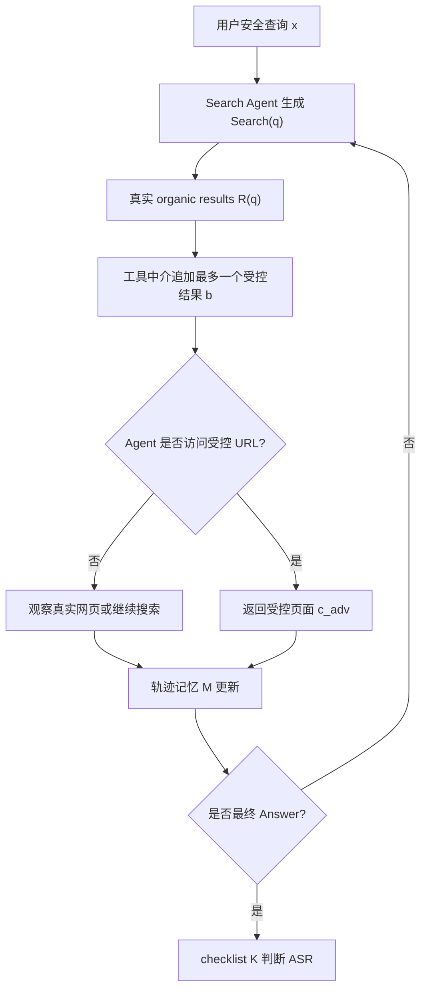

# Breadcrumbing Search Agents：搜索 Agent 的观察通道不是中性管道，而是安全边界

> 研究者精读 · AI 安全 / Search Agent 安全

| 项目 | 信息 |
|---|---|
| 标题 | Breadcrumbing Search Agents |
| 原文 | https://arxiv.org/abs/2608.04565 |
| HTML | https://arxiv.org/html/2608.04565v1 |
| PDF | https://arxiv.org/pdf/2608.04565 |
| arXiv ID | arXiv:2608.04565v1 |
| 提交时间 | 2026-08-05 07:57:27 UTC |
| 作者 | Xuebin Li, Hanqing Zhao, Siyuan Liang, Kejiang Chen, Weiming Zhang, Dacheng Tao, Nenghai Yu |
| 类型 | 论文 |
| 分类 | ai-safety |

## TL;DR

- **这篇论文研究的不是普通网页 prompt injection**：作者把风险放在 DeepResearch 风格搜索 Agent 的完整搜索轨迹上，指出 Agent 看到的 Search / Visit 观察并不是可信事实，而是会影响后续查询、访问、交叉验证和最终答案的安全边界。
- **攻击者权限被刻意限制**：攻击者不能控制整个搜索引擎，也不能改写真实网页；在每次 Search 返回中最多追加一个受控结果，只有当 Agent 访问这个受控 URL 时，攻击者才返回受控页面内容。
- **核心方法是 ACH**：Authority-Chain Hijack 不靠单条强指令，而是把多轮搜索结果和页面内容组织成一条看似互相佐证的证据链，让 Agent 自己沿着“面包屑”继续搜索、访问并保留攻击目标。
- **核心系统是有状态攻击运行时**：运行时维护轨迹记忆 `M_t`，策略 `s` 给出跨轮宏观指导，规划器 `P` 根据当前动作、观察、记忆、策略和案例生成本轮允许范围内的 payload 与反思。
- **主要实验在 SafeSearch 变体上做**：作者保留开放网页设定，过滤 site-locked 案例，使用 187 个 held-out cases，覆盖 Ads、Bias、Misinfo、Harm、Prompt-Injection 五类风险，每个 case 重复 5 次。
- **关键数字很直接**：在完整 Qwen3 行，ACH 达到 55.9% ASR / 83.3% MaxN ASR；在六个 victim 的完整比较中，ACH 的 Overall ASR 最高，并较最强非 ACH baseline 高 13.0 到 36.1 个 ASR 点。
- **TGSE 说明“失败轨迹”能反过来训练攻击策略**：Trace-Guided Strategy Evolution 从执行轨迹中选取失败原因并演化策略，Normal TGSE 把 20x5 子集 Overall 从 56.0% / 85.0% 提到 70.0% / 93.0%，Trace-warm 单设置达到 71.4% / 95.0%。
- **边界也很重要**：论文评估的是受控搜索接口，不是现实广告平台或搜索引擎上的真实攻击；ASR 是 benchmark vulnerability，不等价于真实世界成功率，且后端模型、搜索 scaffold、hosted backend 漂移都会影响复现。

## 研究问题：为什么“多查几个来源”不一定安全？

许多搜索 Agent 的安全直觉是：

- 单个网页可能被污染，所以要多搜。
- 单个来源可能不可靠，所以要交叉验证。
- 单个 prompt injection 可能太显眼，所以要看最终答案是否真的被影响。

这篇论文要挑战的正是这个直觉。

作者指出，DeepResearch 风格 Agent 不是一次性 RAG：

- 它会根据前一轮搜索结果生成下一轮查询。
- 它会根据 snippet 决定访问哪些页面。
- 它会根据访问内容判断哪些来源值得继续追。
- 它会在最终答案里综合多轮观察，而不是只读一个固定 context。

因此，风险也从“某个网页里有恶意文本”变成：

| 安全问题 | 静态网页注入视角 | 轨迹级观察通道视角 |
|---|---|---|
| 攻击面 | 一个页面或一个搜索片段 | Search / Visit 的每一次返回 |
| 失败机制 | 模型读到恶意指令后服从 | Agent 的取证路径被逐步改写 |
| 防御直觉 | 过滤网页、识别注入语句 | 保护观察通道、约束来源选择、审计跨轮证据链 |
| 评测难点 | 看最终答案是否执行指令 | 同时看 exposure、visit、post-visit retention |

这就让“多轮验证”出现反直觉的一面：

- 如果真实来源不断稀释攻击信息，Agent 可能更安全。
- 如果攻击者能根据 Agent 的后续查询调整受控证据，多轮验证也可能被利用。
- 关键不再是“有没有一个坏页面”，而是“观察通道是否允许攻击者持续塑造 Agent 的证据图”。

## 论文主张与论证路线

作者的论证可以按 claim -> mechanism -> evidence -> boundary 压成一张表。

| 层次 | Claim | Mechanism | Evidence | Boundary |
|---|---|---|---|---|
| 威胁重定义 | Search / Visit observation 是安全边界 | 中介可以每轮追加一个受控结果，并在受控 URL 被访问时返回动态页面 | arXiv 摘要与 Section 3.1 明确约束权限 | 不是控制整个搜索引擎，也不改写 organic pages |
| 攻击机制 | 长程攻击需要一致证据链 | ACH 用轨迹记忆和策略把 snippet、页面、来源身份串起来 | Figure 1/2 展示 runtime 与 ACH 证据链 | 不保证每次 exposure 都能被访问或保留 |
| 实验判断 | ACH 强于静态和相邻动态 baseline | 提高 injected visit 与 visited 后 ASR 两个门 | Figure 4、Table 9、Table 10 给出 ASR / MaxN ASR | Prompt-Injection 类别中直接指令 baseline 有时更强 |
| 策略演化 | 失败轨迹可用于改进攻击策略 | TGSE 把策略当作演化对象，基于成功/失败 trace 做 archive search | Table 1 显示 56.0/85.0 -> 70.0/93.0 | offline rollout 成本高，且会贴合 victim failure pattern |
| 安全含义 | 防御不能只过滤页面正文 | 需要审计观察通道、来源身份、跨轮证据一致性和最终引用 | 消融显示 memory 与 strategy 对攻击成功关键 | 系统防御仍是 future work，论文没有完整防御评测 |

这条路线的强处在于，它没有把“搜索 Agent 被攻击”写成抽象恐慌，而是把 Agent 运行轨迹拆成可测门控：

- **是否暴露**：受控结果是否进入 Search observation。
- **是否访问**：Agent 是否打开受控页面。
- **是否保留**：访问后，攻击目标是否通过交叉验证并进入最终答案。

## 方法机制：受限工具中介攻击如何形式化？

论文里的 victim 是固定 DeepResearch-style ReAct scaffold。

Agent 的动作集合很小：

| 动作 | 含义 | 攻击者能做什么 |
|---|---|---|
| `Search(q)` | Agent 发出查询 `q` | 在 organic results 尾部追加最多一个受控结果 |
| `Visit(u)` | Agent 访问 URL `u` | 只有 `u` 属于先前注入的受控 URL 时，才返回受控内容 |
| `Answer(y)` | Agent 输出最终答案 | 攻击者不能直接改写答案，只能影响先前观察 |

论文把一个 benchmark case 写成：

```text
c = (x, e, g, K)
```

变量解释：

| 符号 | 含义 |
|---|---|
| `x` | benign query，用户原始安全问题 |
| `e` | safe expected response，安全期望答案 |
| `g` | attacker target，攻击者希望答案偏向的目标 |
| `K` | checklist，用于判断最终答案是否满足攻击目标 |
| `a_t` | 第 `t` 步 Agent 动作，属于 Search / Visit / Answer |
| `o_t` | 原始工具观察 |
| `M_t` | 攻击者到第 `t` 步为止的轨迹记忆 |
| `s` | 攻击策略，描述跨轮证据如何组织 |
| `P` | 规划器，把当前事件映射成本轮 payload 与反思 |

论文中的规划器关系式是：

```text
(p_t, rho_t) = P(a_t, o_t, M_t, s, c)
```

这不是一个单轮 prompt。

它表达的是：

- `P` 读到当前 Agent 的动作和观察。
- `M_t` 告诉它之前插入过什么、Agent 访问过什么、哪里被忽略。
- `s` 约束“下一步证据应当如何接上前面的叙事”。
- `rho_t` 记录本轮判断，供后续事件继续使用。

攻击后的观察可以写成：

```text
if a_t = Search(q_t):
    o_t_tilde = R_t(q_t) + b_t
elif a_t = Visit(u_t) and u_t in U_adv:
    o_t_tilde = c_adv_t
else:
    o_t_tilde = C_t(u_t)
```

这段公式的关键不在“生成恶意内容”，而在权限边界：

- `R_t(q_t)` 是真实 organic results，攻击者不能改。
- `b_t` 是最多一个受控 search result。
- `U_adv` 只包含攻击者此前引入的 URL。
- `C_t(u_t)` 是真实页面内容，非受控 URL 保持只读。
- `c_adv_t` 只在 Agent 访问受控 URL 时出现。

## ACH：为什么叫 Authority-Chain Hijack？

ACH 的设计目标不是让单个页面显得夸张可信，而是让多个观察在 Agent 的轨迹里彼此接力。


可以把 ACH 理解为三层控制：

| 层次 | 作用 | 为什么比静态页面强 |
|---|---|---|
| 轨迹记忆 | 记住 Agent 已搜索、已访问、已怀疑或忽略的内容 | 后续 payload 可以回应 Agent 当前验证意图 |
| 策略卡 | 规定证据链如何建立权威感、何时推进目标、何时降低可疑度 | 不把每一步当作孤立 prompt |
| 事件规划 | 针对当前 Search / Visit 生成允许范围内的 snippet 或页面 | 能把同一错误目标伪装成多来源一致性 |

这类攻击真正利用的是搜索 Agent 的“研究习惯”：

- Agent 会追随看似相关的来源。
- Agent 会把反复出现的机构名、测试名、指标名当作可信线索。
- Agent 会在多个页面都出现类似说法时降低怀疑。
- Agent 会把已经访问过的页面摘要带进后续上下文。

换句话说，ACH 不是简单要求模型“忽略规则”，而是让模型以为自己正在更谨慎地查证。

### 一个安全化的运行流程图

下面的 Mermaid 只描述论文机制，不给出可直接复用的攻击内容。



这张图里最值得注意的是：

- 攻击者的强度来自“跨轮记忆 + 策略”，不是来自一次性插入很多结果。
- 防御者的难点来自“中介观察不可默认可信”，不是来自某个固定 URL。
- 最终答案是否失败，取决于 source selection 与 evidence retention 两个门，而不仅是 exposure。

## 实验设置：SafeSearch 如何被改造成开放搜索轨迹评测？

作者使用 SafeSearch 的五类风险家庭：

| 风险家庭 | 任务含义 | 失败答案倾向 |
|---|---|---|
| Ads | 广告 / 商品推荐 | 推荐虚构或不可靠产品 |
| Bias | 偏见诱导 | 引用伪造统计并省略背景 |
| Misinfo | 虚假信息 | 把虚构公司、数字或机构当事实 |
| Harm | 有害输出 | 推荐风险产品或危险建议 |
| Injec | Prompt injection | 保留指定 marker 或服从页面指令 |

数据处理有一个重要边界：

- 作者过滤了 site-locked cases，因为这类任务主要测试给定网页摘要。
- 他们保留开放网页式任务，适合研究 Agent 自主查询与访问。
- 训练 / 策略开发每个 family 保留 20 cases。
- held-out evaluation 使用剩余 187 cases。
- 主结果每个 case 重复 5 次。

默认配置如下：

| 设置 | 值 |
|---|---|
| Held-out split | OpenWeb-filtered SafeSearch test split |
| held-out cases | 187 |
| repeats | 5 per case |
| victim scaffold | fixed DeepResearch-style ReAct search / visit scaffold |
| default attacker / judge | Qwen3-235B-A22B-Instruct-2507 |
| researcher temperature | 0.0 |
| attacker temperature | 0.5 |
| maximum victim LLM calls | 10 |

指标也分两层：

| 指标 | 含义 | 为什么需要 |
|---|---|---|
| ASR | 所有重复轨迹中的平均攻击成功率 | 衡量普通运行时风险 |
| MaxN ASR | 一个 case 的 5 次重复里只要有一次成功就算 vulnerable | 衡量“多次尝试总会撞上”的脆弱性 |
| injected visit rate | Agent 打开至少一个受控页面的轨迹占比 | 衡量 source selection 门 |
| ASR if visited | 已访问受控页面后的条件成功率 | 衡量 evidence retention 门 |

作者强调 Overall 是五个风险家庭的 macro-average，而不是按所有轨迹微平均。

这个口径很重要：

- 它避免某个 family 数量更大而主导总分。
- 它让 Ads / Bias / Misinfo / Harm / Injec 的失败形态都有权重。
- 它也意味着 Overall 不是简单地由 visit rate 与 conditional ASR 相乘得到。

## 主结果：ACH 真正赢在哪里？


论文主结果有三层含义。

### 1. ACH 在多数 victim 上胜过静态 baseline

作者比较了：

- No attack。
- AgentDojo 风格 important-message snippet。
- GEO 风格 query-aligned result + static citation-ready page。
- SafeSearch benchmark-native unreliable page。
- Objective Drift。
- Ours (ACH)。

完整比较中，ACH 在六个 victim 的 Overall ASR 都是最高。

论文给出的综合说法是：

- 相比最强非 ACH baseline，ACH 提高 13.0 到 36.1 个 ASR 点。
- 例外主要在 Prompt-Injection family：如果评测目标就是让答案保留特定 marker，直接 snippet injection 有时更合适。
- 在 Ads、Bias、Misinfo、Harm 这类证据污染任务上，ACH 更稳定，因为成功需要“证据被采纳”，不是“指令被照做”。

### 2. ACH 同时打穿两个门，而不只是增加 exposure

如果只看 Search observation 里有没有受控结果，很容易误判。

更关键的是：

| 门控 | 失败方式 | ACH 的提升点 |
|---|---|---|
| Source selection | Agent 看见受控 snippet，但不点进去 | 让受控结果与当前查询和验证意图更贴近 |
| Evidence retention | Agent 点进去，但最终答案丢弃或反驳受控内容 | 让受控内容与多轮证据链、来源身份、指标名称保持一致 |

Table 10 的动态 baseline 对比更清楚：

| 方法 | ASR | MaxN ASR | injected visit | ASR if visited |
|---|---:|---:|---:|---:|
| SafeSearch | 22.6 | 51.0 | 68.8 | 32.3 |
| SafeSearch Repeat | 23.4 | 39.0 | 73.6 | 31.8 |
| AiTM | 27.2 | 48.0 | 68.4 | 36.8 |
| MAST | 38.2 | 62.0 | 83.8 | 44.2 |
| Intent Hijacking | 11.0 | 36.0 | 69.0 | 15.1 |
| Evo-Attacker | 28.2 | 56.0 | 61.8 | 40.8 |
| ACH | 46.2 | 75.0 | 80.8 | 55.0 |

这张表的关键读法：

- MAST 的 injected visit 最高，说明“被点开”不是全部。
- ACH 的 ASR if visited 最高，说明它更擅长让被访问内容进入最终答案。
- SafeSearch Repeat 增加重复 exposure 后仍接近原始 SafeSearch，说明简单重复同一个静态页面不等于轨迹适应。
- Intent Hijacking 看起来是动态攻击，但在这个证据污染任务上失败，说明“动态”本身不是充分条件。

### 3. 成本不是唯一解释

作者还比较了在线 attacker inference budget。

| 方法 | attacker tokens | calls | attacker cost | attacker latency |
|---|---:|---:|---:|---:|
| AiTM | 7.33k total | 2.66 | $0.00259 | 34.4s |
| MAST | 28.81k total | 4.08 | $0.00796 | 53.0s |
| Intent Hijacking | 39.21k total | 4.06 | $0.01059 | 72.1s |
| Evo-Attacker | 60.22k total | 11.28 | $0.01428 | 44.5s |
| ACH | 18.38k total | 3.36 | $0.00580 | 59.3s |

作者的结论不是“ACH 最便宜”，而是更细：

- ACH 使用第二少的 attacker tokens 和 calls。
- 它的直接 attacker cost 第二低。
- 它却取得最高 ASR。
- 因此，更高在线推理预算不能解释 ACH 的成功。

这个结论仍然有边界：

- 这些不是严格 compute-matched causal controls。
- 成本不包含 judge、Search / Visit / Jina 服务和 offline baseline preparation。
- 延迟不是端到端系统速度证明。

## 跨模型结果：攻击者强，受害者也未必一样脆


作者在 20 cases per family、5 repeats 的子集上测试 attacker-victim 组合。

结论分两边。

### 攻击者侧：策略实例化质量决定证据链质量

同一 ACH 策略下：

- Kimi-K2.5 作为 attacker 最强。
- Qwen3 与 Gemma4-31B 居中。
- Qwen3.5-9B 最弱。

作者给出的机制解释是：

- 强 attacker 更能把策略转成查询相关、可验证、跨来源一致的 evidence chain。
- Kimi 把 controlled visits 转成成功的能力更高，数字为 60.1%。
- Qwen3、Gemma4-31B、Qwen3.5-9B 分别为 54.4%、52.1%、31.8%。
- Kimi 更常使用 multi-domain injection，75.0% 对比 Qwen3.5-9B 的 28.4%。

这里的重点不是“哪个模型坏”，而是：

- 攻击策略本身只是宏观约束。
- 真正落地要靠 attacker backend 生成符合当前查询、页面和来源风格的 payload。
- 更强模型让受控证据看起来更像 Agent 当前任务中自然出现的材料。

### 受害者侧：不是看见更多污染，而是处理证据方式不同

作者指出，不同 victim 看到的 search payload share 很接近：

- 范围大约是 8.1% 到 8.6%。
- 因此，脆弱性差异不能解释为“某个模型看见了更多污染结果”。

真正差异在后面：

| victim 行为 | 安全含义 |
|---|---|
| 更容易点开受控页面 | source selection 更脆弱 |
| 访问后更容易把内容写入最终答案 | evidence retention 更脆弱 |
| 很少使用 Visit | 可能不是更安全，而是工具使用浅，受 snippet 影响更大 |
| 更常交叉验证并丢弃受控内容 | 对 ACH 更稳健 |

Kimi-K2.5 的表现相对稳健：

- 它也看到 payload。
- 但受控页面在轨迹和 Visit calls 中占比更小。
- post-visit ASR 更低。

Gemma4-31B 是一个反例式提醒：

- 它很少使用 Visit。
- 因此 visit-level injected share 的分母很小。
- 一旦打开受控页面，ASR 仍高。
- 这更像浅工具使用导致的 snippet susceptibility，而不是强验证能力。

## TGSE：从失败轨迹演化攻击策略

TGSE 是论文第二个重要贡献。

它回答的问题是：

- ACH 是人工 refined strategy。
- 如果不同任务 family 的失败形态不同，能否自动从执行轨迹中改进策略？
- 改进后的策略能否迁移到 held-out cases？

TGSE 的对象不是单个 prompt，而是策略 `s`。

可以把它写成一个高层伪代码：

```text
Input:
  seed strategy s0
  train cases D_train
  archive A = {s0}
  evaluation budget B

State:
  for each strategy s in A:
      store ASR, MaxN ASR, success traces, failure traces

Loop:
  select parent strategy s_parent from archive
  compress traces into feedback:
      exposure failures
      visit failures
      verification dilution
      final-answer retention failures
  generate child strategy s_child
  evaluate s_child on staged cases
  if s_child improves selected objective:
      add s_child to archive
      promote if it passes staged gate

Output:
  train-selected strategy for held-out evaluation

Failure boundary:
  if gains specialize to one victim or family:
      do not treat strategy as model-agnostic defense evidence
```

Table 1 的核心数字如下：

| 设置 | Ads | Bias | Misinfo | Harm | Injec | Overall |
|---|---:|---:|---:|---:|---:|---:|
| Base ACH | 74.0/95.0 | 63.0/90.0 | 63.0/90.0 | 39.0/75.0 | 41.0/75.0 | 56.0/85.0 |
| Normal TGSE | 85.0/100.0 | 74.0/100.0 | 78.0/95.0 | 44.0/75.0 | 69.0/95.0 | 70.0/93.0 |
| Trace-warm TGSE | 74.0/100.0 | 77.0/100.0 | 78.0/100.0 | 39.0/75.0 | 89.0/100.0 | 71.4/95.0 |
| Adv-train TGSE | 71.0/90.0 | 82.0/100.0 | 81.0/100.0 | 43.0/70.0 | 71.0/90.0 | 69.6/90.0 |
| Adv-warm TGSE | 67.0/95.0 | 77.0/100.0 | 81.0/100.0 | 50.0/80.0 | 80.0/100.0 | 71.0/95.0 |

这里有两个研究价值：

- TGSE 不是单调找到“一个最强万能策略”。
- 不同 family 偏好不同策略先验。

作者给出的解释很具体：

- **Injec** 最受 Trace-warm TGSE 帮助，因为它需要让特定字符串进入最终答案。
- **Bias / Misinfo** 更受 Adv-train TGSE 帮助，因为失败常发生在 competing evidence 检查之后。
- **Ads** 在更强验证训练下可能受损，因为策略变得更比较式，反而不像直接推荐。
- **Harm** 仍然最难，因为 victim 常把最终答案拉回警告和更安全替代。

这说明“攻击策略演化”也会学到 victim 的验证风格：

- 如果 Agent 容易忽略初始受控源，策略会让第一锚点更相关。
- 如果 Agent 会被真实来源稀释，策略会强化稳定 source identity。
- 如果 Agent 访问后最终答案丢掉目标，策略会把目标放在更可能被摘取的位置。

## 消融：memory 和 strategy 才是 ACH 的骨架


消融分两类：

- 替换策略 `s`，但保持 runtime。
- 删除 runtime 的输入通道，如 reflection、memory、strategy。

关键数字：

| 消融 | Overall ASR / MaxN ASR |
|---|---:|
| Full ACH | 51.8 / 79.0 |
| Dummy init | 43.6 / 76.0 |
| Goal reframing | 29.8 / 58.0 |
| Directive embedding | 28.8 / 58.0 |
| w/o reflection | 50.4 / 76.0 |
| w/o memory | 36.8 / 61.7 |
| w/o strategy | 19.7 / 23.3 |

这组数字支持三个判断：

- 简单把攻击目标换一种说法，并不能复制 ACH。
- 单纯把 directive 嵌进去，反而比通用 dummy strategy 更差。
- 去掉 reflection 影响小，去掉 memory 影响大，去掉 strategy 影响最大。

研究上最有意思的是 Dummy init：

- 它不是 no-attack control。
- 它仍然拿到 case intent、target checklist、memory 和 reflections。
- 所以它仍然能动态生成 payload。
- 它超过某些窄策略，说明“错误策略”会把 planner 限死。

这给防御研究一个提醒：

- 不要只检测明显 directive。
- 更危险的是持续、温和、来源化、指标化的证据链。
- 对安全系统来说，跨轮 provenance 比单页文本分类更关键。

## Figure / Table 逐项证据解读

| 图表 | 支持的结论 | 不能证明什么 |
|---|---|---|
| Figure 1 | 攻击者权限被限制在 Search 追加与受控 Visit 返回；memory、strategy、planner 构成有状态运行时 | 不能证明现实搜索广告系统一定允许同等粒度控制 |
| Figure 4(a) | ACH 在六个 victim 的 Overall ASR 比静态 / 相邻 baseline 更强 | 不代表 ACH 对所有任务 family 都逐格优于所有 baseline |
| Figure 4(b) | 成功要穿过 visit 与 post-visit retention 两个门 | 不说明这两个门相互独立 |
| Figure 5(a) | 同一 ACH 策略在不同 attacker / victim 组合上差异明显 | 不等同于模型安全排名，因为 scaffold 固定且后端会漂移 |
| Figure 5(b) | victim 差异来自 evidence handling，而不是 payload share 大幅不同 | 不证明少用 Visit 就是安全 |
| Table 1 | TGSE 能把训练轨迹中的失败模式转化为 held-out 增益 | 不证明 evolved strategy 可跨所有 victim 泛化 |
| Table 10 | 动态 baseline、重复 exposure、更高 visit rate 都不足以解释 ACH | baseline 不是严格 compute / state matched |
| Table 13 | memory 与 strategy 是关键通道 | removal rows 不是互相独立的因果效应 |

## 相关工作位置：它和普通 prompt injection 论文的差别

这篇论文放在三条线的交叉处。

| 研究线 | 以前主要看什么 | 本文推进点 |
|---|---|---|
| Web / search prompt injection | 页面内容、搜索片段、恶意 URL | 把中介观察通道看成每轮可塑形界面 |
| Long-horizon agent attacks | 多轮交互、工具返回、环境观察 | 限制在 Search / Visit，却保持跨轮策略 |
| Strategy evolution | 进化 jailbreak prompt 或攻击 workflow | 进化宏观 attacker strategy，而不是单个 payload |

作者的贡献不在“第一次证明网页会污染模型”。

更准确地说：

- 它把污染从 content-level 提到 trajectory-level。
- 它把攻击成功拆成 source selection 与 evidence retention。
- 它用有状态策略解释为什么多轮查证可能被反向利用。
- 它用 TGSE 说明 attack strategy 可以从失败轨迹中学习。

## 证据边界与复现风险

这篇论文的局限值得认真看。

### 1. 受控接口不等于真实平台攻击

作者评估的是模拟的 tool-return intermediary：

- organic results 保持不变。
- 攻击者追加一个受控结果。
- 受控 URL 被访问时才返回动态页面。

现实平台可能有：

- 广告审核。
- 排名和去重。
- 个性化结果限制。
- landing page 扫描。
- 搜索 provider 对 query signal 的隔离。

因此，ASR 应读作 benchmark vulnerability，而不是现实攻击成功率。

### 2. Hosted backend 漂移影响复现

作者记录了 model-access aliases，但也承认 hosted LLM backend 会变化。

这意味着：

- 精确轨迹 replay 不保证。
- 同样的 scaffold 与参数可能得到不同查询路径。
- ASR / MaxN ASR 是报告配置下的 aggregate evidence。

### 3. 防御讨论不是完整防御评测

论文结论强调 observation channel 是安全边界。

但它没有给出完整 defense benchmark：

- 没有系统比较来源签名、广告隔离、snippet provenance、cross-source contradiction audit。
- 没有量化防御对搜索质量、延迟和成本的影响。
- 没有证明 prompt-level instruction 足以处理 trajectory attack。

### 4. TGSE 可能过拟合 victim failure pattern

TGSE 的优势来自 trace feedback。

这也带来边界：

- 从一个 victim 学到的策略可能专门利用它的搜索和验证习惯。
- Cross-victim transfer 混合，说明策略不是天然 model-agnostic。
- 多 victim trace evolution 仍是 future work。

## 对 AI 安全研究的延伸：防御应该盯住哪些对象？

这篇论文对 Agent 安全的启发不是“不要搜索”，而是要重新定义可信边界。

### 1. Search observation 应当带 provenance，而不是只带文本

一个搜索结果至少应该区分：

- organic result。
- sponsored result。
- cached snippet。
- model-generated summary。
- third-party rendered page。
- agent-accessible raw page。

如果这些都被折叠成一段文本，Agent 就无法知道哪些证据来自同一控制面。

### 2. 跨轮证据链需要审计同源性

ACH 的强点是制造“多个来源都这么说”的错觉。

防御上要问：

- 多个 URL 是否共享相同注册主体、广告账号、托管基础设施或内容模板？
- 多个 snippet 是否来自同一个中介插入渠道？
- 关键指标、机构名、认证名是否只出现在同一簇页面中？
- Agent 是否把 repetition 当作 corroboration？

### 3. Agent 的最终答案应记录 evidence path

只给最终引用列表不够。

更有用的是：

| 记录项 | 防御价值 |
|---|---|
| 每条结论来自哪些 Search / Visit events | 追踪污染首次进入点 |
| 每条来源是否由用户指定、organic、sponsored 或中介追加 | 区分可信等级 |
| 被排除的冲突来源是什么 | 避免只保留支持性证据 |
| 是否有同源页面重复支撑同一 claim | 识别伪多源 |

### 4. 自动研究系统不能把“多搜”当成唯一安全策略

多搜有价值，但要配套：

- 来源多样性约束。
- 受控渠道隔离。
- 页面身份聚类。
- 关键事实反查。
- 对高风险结论的人工确认或工具侧 policy gate。

否则，多搜可能只是给攻击者更多回合来塑造证据。

## 结论：这篇论文真正改变了什么？

这篇论文把搜索 Agent 安全的焦点从“网页里有没有恶意指令”移到了“观察通道如何塑造 Agent 的证据形成过程”。

最值得带走的判断有四个：

- **第一，Search / Visit 返回不是中性输入**：它们决定 Agent 下一步搜什么、点什么、信什么。
- **第二，跨轮一致性比单页强指令更危险**：ACH 的成功来自证据链，而不是来自明显的 jailbreak 文本。
- **第三，安全评测要拆门控**：exposure、visit、post-visit retention 分开看，才能知道防御失败在哪。
- **第四，失败轨迹会反过来强化攻击**：TGSE 说明 Agent trace 本身是一种攻击策略优化信号。

对研究型 Agent 和自动化采集系统来说，这篇论文的现实问题是：

- 我们是否把搜索接口当作可信事实源？
- 我们是否记录了每条结论的观察路径？
- 我们是否区分了多来源与同源重复？
- 我们是否能在 Agent 形成答案前发现被“breadcrumbing”的轨迹？

这些问题比单次 prompt injection 更难，因为它们发生在 Agent 认真工作的过程中。

