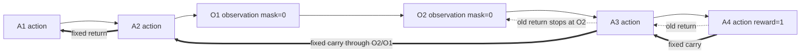

# verl REINFORCE++ 多轮归因修复：为什么 observation token 不能把最终奖励切断

### 元信息

| 字段 | 内容 |
|---|---|
| 项目 | [verl-project/verl](https://github.com/verl-project/verl) |
| 变更 | `[algo] fix: carry running_return through observation spans in REINFORCE++ (#7278) (#7300)` |
| Commit | [8a1bf6d5b080173e29834aca55ee8d47549b2ea6](https://github.com/verl-project/verl/commit/8a1bf6d5b080173e29834aca55ee8d47549b2ea6) |
| PR | [#7300](https://github.com/verl-project/verl/pull/7300)，2026-08-10 06:23:35 UTC merged |
| Issue | [#7278](https://github.com/verl-project/verl/issues/7278)，2026-08-06 提出，2026-08-10 关闭 |
| 分类 | 大模型后训练 / 多轮 Agent RL / REINFORCE++ advantage 估计 |
| 本文边界 | 代码级深读；不把一次修复夸大成完整算法论文 |

### TL;DR

- 这次 verl 变更修复的是 REINFORCE++ 在多轮 Agent RL 里的一个归因错误：当 trajectory 中间插入 tool observation / environment feedback 这类 `response_mask=0` 的 token span 时，旧实现会把 `running_return` 清零，导致最终 outcome reward 不能传回 observation 之前的 assistant action。
- 受影响函数是 `verl/trainer/ppo/core_algos.py` 中的 `compute_reinforce_plus_plus_outcome_advantage`，它从右向左扫描 token-level rewards，用 `running_return = reward_t + gamma * running_return` 构造每个 response token 的 return。
- bug 的根源不是 REINFORCE++ 公式本身，而是 mask 语义混淆：trailing padding / EOS 后 token 确实应该让 return 归零；但多轮 Agent 中间的 observation token 只是“非 assistant 动作”，应被跳过，而不是被当作轨迹终止。
- 官方 issue 给出最小复现：同样 4 个 assistant token、最终 reward 为 1.0；紧凑序列返回 `[1,1,1,1]`，插入两个 observation token 后旧实现只给后两个 action `[1,1]` 奖励，前两个 action 变成 `[0,0]`。
- 修复只改核心函数 4 行左右：先算 `new_running_return`，对 `mask=1` 的有效 assistant token 写入 return 并更新状态；对 `mask=0` 的 observation token 写 0，但把已有 `running_return` 原样 carry through。
- 新增 6 个 CPU 回归测试，覆盖 observation span 不阻断 return、observation 自身 return 为 0、trailing padding 为 0、gamma 折扣跨 observation gap、batch 维度独立、无 observation 的单轮行为不变；PR 同时报告 23 个既有 core algorithm 测试无回归。
- 这件事对后训练很关键：多轮 tool-use / agentic RL 的 credit assignment 不能只按 token mask 做乘法清零；必须区分“模型动作 token”“环境观测 token”“padding/EOS 后 token”三种语义，否则训练会系统性低估早期探索、工具选择和中间规划的价值。
- 局限也明确：这不是对所有 advantage estimator 的重新设计；它修复的是 REINFORCE++ outcome reward 路径。更复杂的 dense reward、per-turn reward、multi-agent handoff、partial rollout 或异步环境仍需要单独审计 mask、discount 和 state boundary。

### 这次变更真正关心什么问题？

- verl 的定位是 LLM 后训练框架：
  - README 把它描述为 production-ready RL training library；
  - 支持 PPO、GRPO、REINFORCE++、RLOO、DAPO、DrGRPO、GSPO 等算法；
  - 训练后端可接 FSDP、FSDP2、Megatron-LM；
  - rollout 端可接 vLLM、SGLang、HF Transformers；
  - 还明确支持 multi-turn with tool calling。

- 这次修复落在一个很窄但很关键的位置：
  - 多轮 Agent RL 里，模型输出 action；
  - 环境或工具返回 observation；
  - 模型继续根据 observation 输出后续 action；
  - 最终 outcome reward 可能只在最后一步出现；
  - advantage estimator 必须把这个最终 reward 正确归因到前面所有相关 action。

- 如果 observation token 被误当成 episode break：
  - observation 之后的 action 能得到奖励；
  - observation 之前的 action 得不到奖励；
  - 训练会误以为早期 tool call、查询、计划、探索没有贡献；
  - 对长程 Agent 任务尤其有害，因为成功往往依赖前几步拿到正确信息。

### 代码路径：这个 bug 在训练闭环里的位置

| 层级 | 组件 | 本次相关性 |
|---|---|---|
| 数据/任务 | prompt、tool environment、reward function | 产生多轮 action-observation-action 序列 |
| Rollout | vLLM / SGLang / custom agent loop | 生成 response token，并插入 observation span |
| Mask | `response_mask` | 标记哪些 token 属于模型 response，可参与 policy/advantage |
| Reward | `token_level_rewards` | outcome reward 常常只落在最后一个有效 token |
| Estimator | `compute_reinforce_plus_plus_outcome_advantage` | 从右到左计算 returns 与 advantages |
| Optimizer | PPO-style policy update | 用 advantage 决定哪些 token 被加强或削弱 |

- 关键点是：
  - `response_mask=1` 不等于“轨迹仍活着”；
  - `response_mask=0` 也不等于“episode 已结束”；
  - 在多轮场景中，`response_mask=0` 可能只是 observation，不应消耗模型动作 credit。

### 原始实现：一个看似合理的 reset 为什么错？

修复前的逻辑可简化为：

```text
running_return = 0

for t from right to left:
  running_return = reward[t] + gamma * running_return
  returns[t] = running_return
  running_return = running_return * response_mask[t]
```

- 这段代码在单轮 response 或 padding 场景下很自然：
  - 有效 token 的 mask 是 1；
  - EOS 之后或 padding token 的 mask 是 0；
  - 扫到 padding 区域时清零，避免把无效区的状态带到真实 response。

- 但 multi-turn Agent trajectory 里存在另一种 `mask=0`：
  - tool response；
  - environment feedback；
  - observation span；
  - 它们位于两个 assistant action span 之间，而不是 response 末尾。

- 于是旧逻辑出现语义冲突：
  - 它想用 mask 做“有效 token 过滤”；
  - 同时又把 mask 当作“终止信号”；
  - 当 observation 在中间出现时，终止信号是假信号，最终 reward 被截断。

### 最小复现：同样动作序列，只因插入 observation 就丢失早期奖励

官方 issue 的复现可以抽象成两个序列：

| 场景 | 序列 | mask | final reward | 期望 valid-token return | 旧实现 valid-token return |
|---|---|---|---:|---|---|
| Compact | A1 A2 A3 A4 | 1 1 1 1 | A4=1.0 | 1 1 1 1 | 1 1 1 1 |
| Expanded | A1 A2 O1 O2 A3 A4 | 1 1 0 0 1 1 | A4=1.0 | 1 1 1 1 | 0 0 1 1 |

- 两个序列表达的是同一个动作链：
  - A1/A2 是早期 assistant action；
  - O1/O2 是工具或环境返回；
  - A3/A4 是后续 assistant action；
  - 最终 reward 来自任务完成。

- 如果 `gamma=1`，observation token 不应改变 valid action 的 return。
- 旧实现的问题是：
  - 反向扫描先从 A4 把 reward 带到 A3；
  - 扫到 O2/O1 时，因为 mask 为 0，把 `running_return` 清掉；
  - 再扫到 A2/A1 时已经没有 reward 信号。

### 正确语义：observation token 应该跳过，不应该终止

修复后的思想是把“写 return”和“携带状态”拆开：

```text
new_running_return = reward[t] + gamma * running_return

if response_mask[t] == 1:
  returns[t] = new_running_return
  running_return = new_running_return
else:
  returns[t] = 0
  running_return = running_return
```

- 对有效 assistant token：
  - 它是 policy 需要学习的动作；
  - return 应该写到该位置；
  - `running_return` 应继续向左传播。

- 对 observation token：
  - 它不是模型动作，不应该被 policy loss 训练；
  - 因此 `returns[t]` 应为 0；
  - 但它也不是 episode 终止，因此不能清除已有 reward。

- 这个 carry-through pattern 与 verl 中 GAE 的处理一致：
  - GAE 也会在 observation token 上跳过 value / TD-error 更新；
  - 同时保留 `nextvalues` 和 `lastgaelam`；
  - 这说明项目里已经有正确语义，只是 REINFORCE++ 分支没有同步这套处理。

### 公式解释：mask 有两层角色，必须分开

令：

- `r_t`：第 `t` 个位置的 token-level reward；
- `m_t`：`response_mask[t]`，assistant token 为 1，observation/padding 为 0；
- `G_t`：向左传播的 running return；
- `R_t`：写入训练张量的 return；
- `gamma`：折扣因子。

旧实现等价于：

```text
G_t = r_t + gamma * G_{t+1}
R_t = G_t
G_t = m_t * G_t
```

问题在最后一行：

- 当 `m_t=0` 是 padding，清零合理；
- 当 `m_t=0` 是 observation，清零不合理；
- 因为 observation 位于有效动作之间，不应割断 `G_{t+1}`。

修复后的语义更接近：

```text
G'_t = r_t + gamma * G_{t+1}
R_t = m_t * G'_t
G_t = m_t * G'_t + (1 - m_t) * G_{t+1}
```

- 当 `m_t=1`：
  - `R_t=G'_t`；
  - `G_t=G'_t`；
  - 与普通反向 return 递推一致。

- 当 `m_t=0`：
  - `R_t=0`；
  - `G_t=G_{t+1}`；
  - observation 自身不训练，但 reward 信号继续穿过它。

### gamma 折扣：为什么 observation gap 不应额外消耗折扣步？

新增测试里有一个很关键的边界：`gamma=0.5`，序列是两个 action、两个 observation、一个带 reward 的 action。

| 位置 | 类型 | mask | reward | 修复后 return |
|---|---|---:|---:|---:|
| t0 | action | 1 | 0 | 0.5 |
| t1 | action | 1 | 0 | 1.0 |
| t2 | observation | 0 | 0 | 0 |
| t3 | observation | 0 | 0 | 0 |
| t4 | action | 1 | 2.0 | 2.0 |

- 这里的含义是：
  - discount 发生在模型动作之间；
  - observation 是环境反馈，不是新的 policy action；
  - 因而 observation gap 被跳过，不额外乘两次 `gamma`。

- 这对 tool-use RL 很重要：
  - 工具返回可能很长；
  - 如果 observation token 数量越多，早期 action 的折扣越严重；
  - 模型会被训练成偏好短 observation 或少用工具，而不是偏好真正有效的策略。

### 流程图：修复前后 reward 如何穿过 observation



- 修复前：
  - `running_return` 在 O2/O1 被乘 0；
  - A1/A2 看不到最终 reward。

- 修复后：
  - O2/O1 的 `returns` 仍为 0；
  - 但 `running_return` 保留；
  - A1/A2 得到与 compact 序列一致的 credit。

### 测试设计：6 个新增测试分别守住什么边界？

| 测试 | 守住的行为 |
|---|---|
| `test_observation_span_does_not_block_returns` | 插入 observation 后，valid action 的 returns 与 compact 序列一致 |
| `test_observation_positions_have_zero_returns` | observation token 自身不参与 return / advantage |
| `test_trailing_padding_stays_zero` | 末尾 padding 仍为 0，修复不能让 padding 获得奖励 |
| `test_gamma_discount_across_observation_span` | observation 被跳过，不作为额外 discount step |
| `test_batch_dimension` | batch 中不同样本独立计算，不互相污染 running state |
| `test_no_observation_tokens_unchanged` | 单轮全 mask=1 的旧行为保持不变 |

- 这组测试的设计比“只测 issue 复现”更完整：
  - 它覆盖了 observation 与 padding 的区分；
  - 覆盖了 `gamma<1` 的折扣语义；
  - 覆盖了 batch 维度；
  - 覆盖了无 observation 的回归边界。

- PR 报告还跑了既有 core algorithm 测试：
  - 新增 multi-turn REINFORCE++ 测试 6 passed；
  - 既有 `test_core_algos_on_cpu.py` 23 passed；
  - 这说明修复目标是局部语义改正，而不是重写 estimator。

### 为什么这不是“小 bug”：它会改变多轮 Agent RL 的训练压力

- 在单轮数学题或单段回答里：
  - `response_mask=0` 多半只出现在 EOS 后；
  - 旧实现很难暴露问题。

- 在多轮 Agent 任务里：
  - 模型先决定调用什么工具；
  - 环境返回 observation；
  - 模型再决定下一步；
  - 最终 reward 可能只在整个任务完成时出现。

- 如果 early action 的 return 被清零：
  - 第一次工具选择得不到 credit；
  - 第一次搜索 query 得不到 credit；
  - 早期代码执行、调试、规划得不到 credit；
  - 后续 action 却被错误地当成唯一贡献者。

- 这会带来几类训练偏差：
  - 模型可能学不到“先获取信息再回答”的策略；
  - 长程任务里的前置探索被低估；
  - 多轮环境越多、observation 越长，偏差越明显；
  - outcome reward 变成“只奖励最后一个 assistant span”的近似。

### 与 GRPO/PPO/GAE 的位置关系

| Estimator | 在 verl 中的典型语义 | 与本修复的关系 |
|---|---|---|
| GRPO | 按 group outcome reward 标准化，再广播到 response mask | 不直接受此次函数影响，但同样依赖 mask 语义 |
| PPO + GAE | 用 value 与 TD-error 递推 advantage | 代码里已有 observation carry-through pattern |
| REINFORCE++ | outcome reward 的反向 return 递推，再 masked whiten | 本次修复对象 |
| REINFORCE++ baseline | 先做 group baseline，再按 response length 展开 | 需要另行看具体 mask/trajectory 假设 |
| RLOO / ReMax | 其他 outcome-only 估计器 | 不应自动假设都覆盖多轮 observation 语义 |

- 研究者视角下，这件事提醒我们：
  - “支持 multi-turn rollout”不等于“所有 estimator 都天然 multi-turn safe”；
  - rollout、mask、reward、advantage 的契约必须逐项对齐；
  - 不同 estimator 之间共享同一 `response_mask` 时，更要说明 mask 是 action mask、loss mask、还是 terminal mask。

### 训练张量视角：为什么同一个 mask 容易被误用？

- 在后训练系统里，mask 通常先从工程需要出发：
  - padding token 不能参与 loss；
  - prompt token 不能参与 response-side policy loss；
  - observation token 不是模型生成的 action，也不能参与 policy loss；
  - EOS 之后的填充区必须保持 0，避免 shape 对齐带来伪梯度。

- 这些需求都会诱导一个二值张量：
  - `1` 表示“这个位置要训练”；
  - `0` 表示“这个位置不要训练”；
  - 对 policy loss 来说，这个定义足够；
  - 对 return scan 来说，这个定义不够。

- return scan 需要回答的是另一个问题：
  - “奖励能不能从右边传到左边？”
  - 这个问题与“当前位置是否参与 loss”不是同一个谓词；
  - observation 不参与 loss，但它仍处在同一条轨迹中；
  - padding 不参与 loss，且它不属于轨迹；
  - 所以二者在 loss mask 上相同，在 discount/terminal 语义上不同。

| token 类型 | 是否模型动作 | 是否参与 policy loss | 是否应写入 return | 是否应截断 future reward |
|---|---:|---:|---:|---:|
| assistant action | 是 | 是 | 是 | 否 |
| tool observation | 否 | 否 | 否 | 否 |
| environment feedback | 否 | 否 | 否 | 否 |
| prompt / system | 否 | 否 | 否 | 通常不在 response scan 内 |
| trailing padding | 否 | 否 | 否 | 是 |
| EOS 后无效区 | 否 | 否 | 否 | 是 |

- 旧实现把最后两列合并了：
  - “不写 return”被实现成“清空 running return”；
  - 在 padding 上没有问题；
  - 在 observation 上就是错误。

- 修复后仍然没有新增一个显式 `terminal_mask`：
  - 它通过反向递推保留了 observation span 的 carry-through；
  - 但长期看，框架若要覆盖更多多轮形态，最好把 mask 的角色拆得更清楚；
  - 否则每个 estimator 都要在自己的循环里重新解释同一个二值 mask。

### 从 AgentLoopManager 到 advantage：中间发生了什么语义转换？

- issue #7278 特别提到 `AgentLoopManager.generate_sequences` 对 `response_mask=0` 的语义：
  - tool observations 是 0；
  - trailing padding 也是 0；
  - 这说明生成端已经把两种不同来源压成了同一种标记。

- 生成端这样做有工程合理性：
  - observation 不是 actor policy 直接采样出来的 token；
  - padding 也不是 actor policy 的 token；
  - 对 rollout batch 来说，把它们都标成 0 可以统一 shape 和 loss filtering。

- 但 advantage 端要恢复时间语义：
  - action 之间的 observation 是环境 transition；
  - padding 是 batch 对齐产物；
  - transition 应该连接前后 action；
  - padding 应该隔离真实序列和无效区。

可以把多轮 Agent RL 的一个样本看成：

```text
prompt
  -> action_1
  -> observation_1
  -> action_2
  -> observation_2
  -> action_3
  -> final_reward
```

- 对 policy gradient 来说：
  - `action_1/action_2/action_3` 是可学习决策；
  - `observation_1/observation_2` 是状态转移证据；
  - final reward 应反向影响所有可学习决策。

- 对 token batch 来说：
  - 所有内容都被拼到同一个张量里；
  - mask 只告诉算法哪些位置是 response action；
  - 如果 estimator 不知道 observation 是 transition，就会把它误判成 boundary。

### 这次修复对“工具调用训练”的具体影响

- 搜索型 Agent：
  - 早期 query 的质量决定后续证据；
  - 旧实现可能只奖励最终组织答案的 token；
  - 修复后，最终正确答案能回传到 query 选择。

- 代码型 Agent：
  - 先运行测试、再读错误、再改代码；
  - 测试输出是 observation；
  - 如果测试输出切断 return，第一次测试选择和调试路径会被低估。

- 数学工具 Agent：
  - 先调用计算器或符号工具；
  - observation 是中间计算结果；
  - 成功 reward 应该奖励“什么时候调用工具、传什么参数”，而不是只奖励最后解释。

- 浏览器或环境交互 Agent：
  - 页面状态、工具响应、环境截图都可能插入 trajectory；
  - observation span 的 token 数量可能远大于 action token；
  - 若按 token 数额外 discount，长 observation 会被错误惩罚。

### 审计其他 estimator 的检查表

| 检查点 | 要问的问题 | 可能发现的问题 |
|---|---|---|
| mask 来源 | `response_mask` 是 loss mask、action mask，还是 terminal mask？ | 同一 mask 被多个语义复用 |
| observation 位置 | mask=0 是否可能出现在两个 action span 中间？ | 中间 observation 被当成 EOS |
| padding 处理 | 末尾 padding 是否仍保持 return/advantage 为 0？ | 修复 observation 时让 padding 获得伪 return |
| discount 规则 | `gamma` 是否跨 observation token 消耗步数？ | 工具输出越长，早期动作越吃亏 |
| dense reward | observation token 上是否可能有 reward？ | 非动作位置 reward 被错误学习或错误丢弃 |
| batch 独立 | `running_return` 是否在 batch 维度独立？ | 不同样本间状态污染 |
| whitening | masked whitening 是否只在 action token 上做？ | observation/padding 改变 advantage 归一化 |
| truncation | 截断 response 是否被当作正常终止？ | 被截断样本的 return 被高估或低估 |

- 这份检查表的价值在于：
  - 它把“bug 修复”转成了“算法实现审计方法”；
  - 可以用在 REINFORCE++ 之外的 estimator；
  - 也适合检查新加的 agentic rollout、multi-turn sandbox、tool calling recipe。

### 一个更一般的伪代码：分离 action、observation、padding

如果未来要把语义写得更显式，可以考虑三类 mask：

```text
Input:
  reward[t]
  action_mask[t]       # 模型动作，可训练
  transition_mask[t]   # observation，可穿过
  terminal_mask[t]     # padding / true boundary，不可穿过

State:
  G = 0

for t from right to left:
  if terminal_mask[t] == 1:
    G = 0
    return[t] = 0
    continue

  if transition_mask[t] == 1:
    return[t] = 0
    continue

  if action_mask[t] == 1:
    G = reward[t] + gamma * G
    return[t] = G
```

- 这不是本次 PR 的实际代码；
  - 实际修复更小；
  - 它没有要求数据结构升级；
  - 它保持了现有 `response_mask` API。

- 但这个伪代码能说明研究边界：
  - 如果未来 trajectory 类型更复杂；
  - 如果需要区分 true terminal、padding、observation、system-injected context；
  - 显式类型化会比继续重载一个二值 mask 更稳。

### 数值例子：为什么两行公式会改变训练方向？

考虑一个很小的多轮样本：

| 位置 | 内容 | mask | reward | 旧 return | 新 return |
|---|---|---:|---:|---:|---:|
| 0 | 选择搜索关键词 | 1 | 0 | 0 | 1 |
| 1 | 请求工具执行 | 1 | 0 | 0 | 1 |
| 2 | 工具返回页面摘要 | 0 | 0 | 0 | 0 |
| 3 | 工具返回证据片段 | 0 | 0 | 0 | 0 |
| 4 | 根据证据生成答案 | 1 | 0 | 1 | 1 |
| 5 | 最终答案完成 | 1 | 1 | 1 | 1 |

- 从任务因果看：
  - 位置 0 的搜索关键词决定了工具能否拿到好证据；
  - 位置 1 的工具调用决定了是否进入正确环境状态；
  - 位置 4/5 只是把证据组织成最终答案；
  - 所以最终 reward 不应只奖励最后两步。

- 从旧 return 看：
  - 位置 2/3 的 observation 把 `running_return` 清零；
  - 位置 0/1 被训练器视为没有贡献；
  - 这会削弱模型学习“先搜什么、怎样调用工具”的能力。

- 从新 return 看：
  - observation 自身仍不训练；
  - 但 reward 穿过 observation；
  - 早期 action 获得应有 credit；
  - policy update 才能把完整策略链条推向成功轨迹。

再看 `gamma=0.9` 的情形：

```text
action_1 -> observation_long -> action_2 -> reward=1
```

- 如果 observation 被当作很多普通时间步：
  - observation 越长，`action_1` 的 return 越小；
  - 同一个工具结果，只因 tokenization 更长就降低 credit；
  - 这不是策略质量差异，而是表示长度带来的训练偏差。

- 如果 observation 被当作 transition：
  - 折扣只发生在可学习动作之间；
  - `action_1` 与 `action_2` 的距离由决策步决定；
  - 工具输出长度不会无端惩罚早期策略。

### 反例边界：哪些 mask=0 不能 carry through？

- 末尾 padding：
  - 它不是环境状态；
  - 它只是 batch 对齐；
  - 必须保持 return 为 0；
  - 也不能让右侧无效区影响左侧真实 token。

- 真正 episode boundary：
  - 如果一个 batch 里拼接了两个独立 episode；
  - 第一个 episode 的 reward 不应传到第二个 episode；
  - 这时需要 terminal 信息，而不只是 response mask。

- 截断样本：
  - 如果 rollout 因最大长度截断；
  - 最后一个 token 未必代表自然终止；
  - 是否传播 return 取决于 reward 定义和 truncation policy。

- 非动作但带监督的特殊 token：
  - 某些系统可能把 tool decision metadata、function-call arguments 或 hidden control token 混在 response span；
  - 它们是否参与 loss、是否传递 credit，要按训练契约决定；
  - 不能简单沿用 observation 的处理。

- 因此，本次修复是一个最小正确改动：
  - 它解决 issue 中明确的 observation span；
  - 它没有替代更完整的 trajectory type system；
  - 它也没有证明所有 mask=0 中间段都应无条件 carry through。

### 为什么这个问题在 2026 年变得更重要？

- LLM 后训练正在从单轮问答走向长程任务：
  - 数学推理不再只是直接生成答案；
  - 代码任务会运行测试、读日志、修改文件；
  - 浏览器任务会观察页面状态；
  - 安全任务会调用扫描器、解释报告、再做修复。

- 在这些任务中，reward 常常稀疏：
  - 最终通过测试才给正 reward；
  - 最终解题正确才给正 reward；
  - 最终完成工具目标才给正 reward；
  - 中间 observation 没有单独 reward，却承载了策略因果链。

- 稀疏 reward 加多轮 observation 会放大实现细节：
  - 单轮场景下一个 mask reset 只是边界处理；
  - 多轮场景下同一个 reset 会变成 credit blocker；
  - 训练越长、工具越多、trajectory 越复杂，偏差越难用人工检查发现。

- 这也是为什么 Scout 表里这个 commit 值得深读：
  - 它不是发布流程改名；
  - 也不是泛泛的文档更新；
  - 它精确触及 Agentic RL 的 reward propagation 语义；
  - 这种语义错误一旦进入大规模训练，会影响模型学到的行动策略。

- 更细地说，它提醒后训练工程不要只把“多轮”理解成数据格式：
  - 真正的多轮训练还要求估计器理解状态转移；
  - 要求奖励能沿着动作因果链传播；
  - 要求工具观测不会被误当成终止边界；
  - 要求测试能覆盖等价轨迹，而不是只覆盖能否跑通。

### 为什么“测试 compact vs expanded 等价性”很有力？

- 普通单元测试常检查：
  - shape 是否正确；
  - padding 是否为 0；
  - loss 是否能跑通；
  - batch 是否不报错。

- 这些测试无法发现本 bug：
  - 因为旧实现没有崩溃；
  - 输出张量形状正确；
  - observation 位置也确实是 0；
  - 只有早期 action 的 return 语义错了。

- compact vs expanded 测试建立了一个更强的不变量：
  - 当 action 序列和 reward 相同；
  - observation 只是插入的环境证据；
  - valid action 的 return 不应因为 observation token 的存在而改变。

- 这个不变量适合推广：
  - 插入更长 observation；
  - 插入不同文本长度的工具结果；
  - 改变 tokenizer 导致 observation token 数不同；
  - 只要 action decision graph 不变，credit assignment 就不应无故改变。

### 对线上训练监控的启发

- 如果一个训练团队已经在做 multi-turn RL，可以加入几类诊断指标：
  - 按 turn index 统计 average advantage；
  - 按 observation span length 统计 early-turn return；
  - 比较 first action、middle action、last action 的 reward sensitivity；
  - 对同一任务构造 compact/expanded ablation。

- 这些指标能提前暴露：
  - early action 长期 advantage 接近 0；
  - observation 越长，早期 return 越小；
  - 工具调用前 token 学不到；
  - 成功样本的 credit 只集中在最后一轮。

- 它们也能区分两类问题：
  - 如果 reward function 本身稀疏，所有 turn 都可能弱；
  - 如果只有 observation 前 action 弱，mask/return 递推更可疑；
  - 如果只有特定工具 observation 后出问题，可能是该工具的 batch 拼接或 mask 构造异常。

### 对代码项目的工程判断

- 变更范围小：
  - 核心算法文件只改 `compute_reinforce_plus_plus_outcome_advantage`；
  - 新增一个 CPU 测试文件；
  - commit 统计为 153 additions、4 deletions，其中大部分是测试。

- 风险控制相对清晰：
  - 单轮全 mask=1 的行为不变；
  - observation token 的 return 保持 0；
  - trailing padding 仍为 0；
  - batch 独立性有测试。

- 仍需继续看的边界：
  - `response_mask=0` 同时承载 observation 与 padding，函数内没有显式区分二者；
  - 当前修复依赖“中间 mask=0 是 observation、末尾 mask=0 是 padding”的递推上下文；
  - 如果未来有特殊 mask 模式，例如中间无效 action、截断片段、partial rollout 拼接，仍需补充契约。

### 失败模式：如果类似 bug 留在训练系统里，会怎样表现？

- 指标层面：
  - overall reward 可能仍上升；
  - 后期 action 的 policy gradient 看起来正常；
  - early turn 的行为改进迟缓；
  - 多轮任务长度越长，credit mismatch 越难从单一 reward 曲线看出来。

- 行为层面：
  - 模型可能不稳定地选择工具；
  - 对 observation 前的规划缺乏学习；
  - 更偏向短链路回答；
  - 在需要先查证、再推理、再行动的任务上效果弱。

- 调试层面：
  - 只看 compact sequence 的单元测试不会发现问题；
  - 只看 final success rate 也可能误判为 reward function 或环境噪声；
  - 必须构造“同一 action 序列 + 插入 observation”的等价性测试。

### 可复现性与证据边界

- 官方证据足够支持以下结论：
  - issue #7278 在 CPU 上给出最小复现；
  - PR #7300 在 2026-08-10 合并；
  - commit 修改了核心函数并新增 6 个测试；
  - commit message 报告新增测试 6 passed、既有测试 23 passed。

- 不能从这次变更推出：
  - verl 所有 multi-turn RL 路径都已完成 mask 语义审计；
  - 所有 estimator 都与 GAE 一样正确处理 observation；
  - 真实大规模训练的收益数字；
  - 对异步 rollout、工具失败、环境重试、partial trajectory 的完整覆盖。

- 更稳妥的后续验证包括：
  - 用真实 multi-turn tool-calling 数据比较修复前后 early-turn advantage 分布；
  - 按 observation span 长度分桶看 return 是否稳定；
  - 在 `gamma<1` 下确认工具输出长度不会改变 action 间折扣；
  - 检查其他 estimator 是否也把 mask 同时当作 loss mask 和 terminal mask。

### 对后训练研究的延伸问题

- 第一，Agent RL 的最小训练单元应该是什么？
  - 如果按 token 做 credit，observation token 是结构节点；
  - 如果按 turn 做 credit，action span 才是决策单位；
  - 如果按 episode 做 credit，工具调用和环境反馈只是 transition。

- 第二，mask 需要类型化。
  - 一个二值 `response_mask` 很方便；
  - 但它隐藏了 padding、observation、tool output、system message、assistant action 的差异；
  - 长远看，训练框架可能需要 `action_mask`、`loss_mask`、`terminal_mask`、`discount_mask` 分离。

- 第三，后训练框架的回归测试要覆盖轨迹等价性。
  - 同一 action 序列在插入 observation 后，valid action returns 应保持语义一致；
  - 同一 reward 在不同 tokenization / observation length 下，不应产生无关训练压力；
  - 这类测试比单纯检查 tensor shape 更能保护算法语义。

- 第四，多轮 Agent 的 credit assignment 与安全也有关。
  - 如果早期动作拿不到 reward，模型可能学不到谨慎查证；
  - 如果 observation 长度影响折扣，模型可能学到规避工具；
  - 如果终止和观察混淆，训练系统可能奖励短视策略。

### 结论

- 这次 `verl` 修复看起来只有几行，但它触及多轮 Agent RL 的核心契约：environment observation 不是 assistant action，也不是 episode termination。
- 正确做法是：
  - observation 自身不写 return；
  - final outcome reward 能穿过 observation；
  - padding/EOS 后 token 仍保持无效；
  - 单轮行为不回归。
- 对后训练工程来说，最值得记住的是：mask 不是一个万能布尔开关。只要训练数据从单轮回答进入 action-observation-action 轨迹，advantage estimator 就必须显式维护“哪些 token 学习、哪些 token 传递 credit、哪些 token 终止轨迹”的边界。
