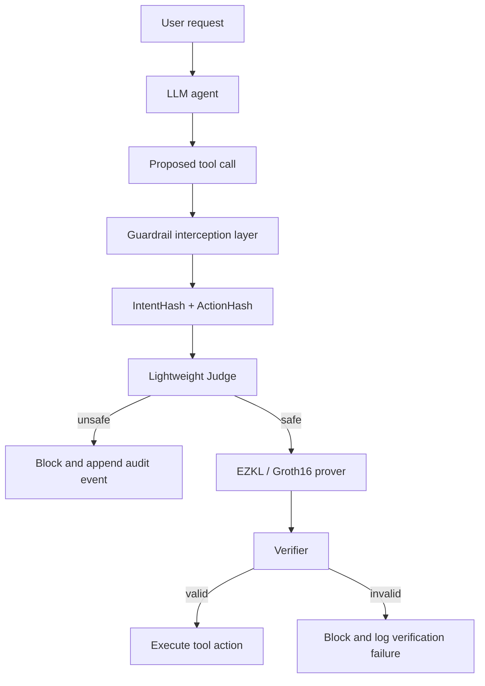
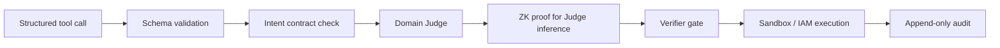

# NiyamAI：把 Agent 工具调用护栏从“相信日志”推进到“可验证证明”

## 元信息与 TL;DR

| 项目 | 内容 |
|---|---|
| 论文 | NiyamAI - An Intent-Bound AI Agent with Cryptographically Verifiable Guardrails using Zero-Knowledge Proofs |
| arXiv | arXiv:2608.07167v1 |
| 日期 | 2026-08-07 12:36:52 UTC 提交 |
| 领域 | AI 安全 / LLM Agent 工具调用安全 / ZK-ML |
| 核心材料 | arXiv 摘要页、13 页 PDF 正文、方法与实验表格 |

### TL;DR

1. 这篇论文关心的不是“模型能不能少说坏话”，而是“Agent 在真正执行邮件、数据库、shell、支付等工具调用前，外部审计方能不能验证安全检查确实运行过、且检查结果允许执行”。
2. NiyamAI 把每次会话的允许工具和约束写成 Intent Contract，用 `SHA-256` 得到固定 `IntentHash`；每个工具调用再生成 `ActionHash`，二者组成 Judge 模型的公开输入。
3. Judge 是一个轻量安全分类器，只判断该 action 是否符合 intent；如果判为 unsafe，动作直接阻断并写审计日志；如果判为 safe，系统用 EZKL/Groth16 为 Judge 推理生成 zk-SNARK 证明。
4. 执行规则被写成硬门槛：`Execute(a) <=> Verify(vk, pi, x) = 1`。也就是说，工具动作只有在证明验证通过后才执行。
5. 实验使用 Agent-SafetyBench 的 2,000 个场景；NiyamAI 在 5-fold out-of-fold 设置下报告 Accuracy 97.9%、Precision 89.2%、Recall 87.8%、F1 88.5%、FPR 1.1%。
6. 对照基线包括 NeMo Guardrails、Llama Prompt Guard 2、GPT-OSS-Safeguard-20B；论文报告 McNemar 配对检验均为 `p < 0.0001`，但也承认 NiyamAI 的 Judge 适配了 Agent-SafetyBench 分布，而三类基线是完全 zero-shot。
7. 证明代价不是免费的：每个 approved action 的 proof generation 约 `2260.6 +/- 218.4 ms`，verification 约 `53.1 +/- 11.8 ms`；这更适合高风险、低频或可批处理动作，不适合所有高吞吐低延迟 Agent。
8. 最大边界是：ZK 证明的是“小 Judge 对给定 hash 输入按给定权重计算并输出 safe”，不是证明大模型推理正确、不是证明 intent 设计完整、也不是证明内容安全或多 Agent handoff 自动安全。

## 研究问题：为什么 Agent 护栏需要“可验证执行”

### 作者真正回应的缺口是什么？

论文从一个工程现实切入：

1. Agent 已经不只是聊天系统。
2. 它会调用外部工具：
   - 发邮件；
   - 查询数据库；
   - 执行命令；
   - 写文件；
   - 触发业务流程。
3. 一旦工具动作真实改变外部状态，安全问题就从“回复是否冒犯”升级成“未经授权的副作用是否发生”。

传统护栏的问题不在于完全无用，而在于审计保证太弱：

| 护栏形态 | 能做什么 | 审计弱点 |
|---|---|---|
| system prompt | 约束模型行为 | 不能证明模型遵守，也不能证明没有被 prompt injection 绕过 |
| 输出过滤器 | 对最终文本或工具调用做拦截 | 过滤器和被攻击系统同机运行，外部方只能相信日志 |
| policy middleware | 在工具前加规则门 | 管理员、宿主机、运行时配置仍是信任根 |
| 传统日志 | 记录通过/阻断 | 日志可被删除、重写、绕开，不能证明检查确实发生 |

作者把问题重新定义为：

> 当 Agent 提出一个工具调用时，系统应当生成一个第三方可验证的证据，证明该动作相对于会话初始 intent 被独立 Judge 检查过，并且检查结果允许执行。

这里的关键词是“相对于会话初始 intent”。如果 intent 可以在中途漂移，攻击者只要修改权限边界，就能把恶意动作伪装成合法动作。因此 NiyamAI 的第一步不是训练分类器，而是先把权限边界固定下来。

## 论文主张与论证路线

### claim -> mechanism -> evidence -> boundary

| 主张 | 机制 | 证据 | 边界 |
|---|---|---|---|
| 工具调用安全不能只依赖软件检查 | Intent Contract + hash commitment 固定会话权限 | 方法部分定义 `H_I = SHA-256(I)`，中途 intent 改动会触发 hash mismatch | 只保证 hash 后的 intent 未变，不保证 intent 本身写得完整 |
| 可以不证明整个 LLM，只证明小 Judge | 轻量 Judge 模型接收 `(IntentHash, ActionHash)`，输出 safe/unsafe | Table I 区分主分类器和 ZK 可证明模型；正文说明证明整个 LLM 计算不可行 | Judge 是二分类器，语义覆盖受训练数据和特征表示限制 |
| 安全检查可以变成可验证门槛 | EZKL 把 ONNX Judge 编译为 ZK circuit，用 Groth16 生成 proof | Algorithm 1 和 verification rule：验证通过才执行工具 | ZK 证明正确计算，不提升分类器准确率 |
| 该方法在 ASB 上比常见 guardrail 准 | 5-fold stratified CV + out-of-fold prediction | 2,000 场景，F1 88.5%，FPR 1.1%，bootstrap CI 和 McNemar 检验 | NiyamAI 适配 ASB 分布，基线 zero-shot，泛化仍待独立测试 |
| 可验证审计有实际运行代价 | proof generation 和 verification 分离 | proof generation 约 2.26s，verification 约 53ms | 对高吞吐 Agent 需要 batching、硬件加速或只保护高风险动作 |

这条论证有一个重要优点：作者没有把 ZK 包装成“让模型更安全”的魔法。论文反复强调，ZK 层不改变 Judge 的分类结果，它只是让外部方能够验证 Judge 的计算确实被执行。这个区分很关键，因为很多“密码学 + AI 安全”的设想容易把可验证计算和语义正确性混在一起。

## 方法机制：三层架构如何拦住工具调用

### 架构分层

论文把系统拆成三层：

1. Agent Layer：
   - 接收用户请求；
   - 由本地或开源 LLM 规划动作；
   - 生成结构化工具调用。
2. Guardrail Layer：
   - 在工具调用被执行前拦截；
   - 抽取工具名与参数；
   - 计算 `ActionHash`；
   - 调用 Judge 做 safe/unsafe 判断。
3. Verification Layer：
   - 对 safe 判断生成 zk-SNARK proof；
   - 验证 proof；
   - 只有验证成功才把动作交给真实工具执行。



这张流程图对应原文 Figure 1、Figure 3、Figure 4、Figure 5 的核心含义。原文图片主要是架构和界面示意，不承载额外数值证据；用 Mermaid 重构比直接贴图更适合本次深读。

### Intent Contract 为什么是第一性设计？

Intent Contract 可以理解为本次会话的最小权限声明：

| 元素 | 例子 | 安全作用 |
|---|---|---|
| permitted tools | `send_email`, `query_db`, `read_calendar` | 限制 Agent 可触达的动作表面 |
| constraints | 只能给同域名收件人发邮件、只能读不写数据库 | 把业务约束纳入执行前检查 |
| session scope | 当前任务、当前用户、当前审批状态 | 防止跨会话复用权限 |
| canonical format | 标准化 JSON / schema | 降低同义格式导致的 hash 绕过 |

论文的隐含判断是：Agent 安全的关键不是把所有风险都塞进大模型 prompt，而是把权限边界移到模型输出之后、工具执行之前，并让这个边界可审计。

## 形式化协议：从 hash 到 proof 的执行规则

### 变量与公式

论文给出的系统元组是：

```text
S = (SHA-256, J, Prove, Verify)
```

变量可以这样读：

| 符号 | 含义 |
|---|---|
| `I` | 会话初始化时定义的 immutable Intent Contract |
| `H_I` | `SHA-256(I)`，256 bit intent commitment |
| `a` | LLM 生成的 proposed tool action，包含工具名和参数 |
| `H_a` | `SHA-256(a)`，action commitment |
| `x` | `(H_I, H_a)`，512 bit public input tuple |
| `J` | deterministic safety classifier |
| `w` | Judge 模型权重和推理 trace 对应的 private witness |
| `pi` | zk-SNARK proof |
| `pk / vk` | proving key / verification key |

核心公式是：

```text
H_I = SHA-256(I)
H_a = SHA-256(a)
x = (H_I, H_a)

J: {0,1}^512 x W -> {0,1}
J(x, w) = 1 <=> action a satisfies intent constraints

pi <- Prove(pk, w, x)
Verify(vk, pi, x) -> {0,1}

Execute(a) <=> Verify(vk, pi, x) = 1
```

这组公式的意义不是“hash 能理解语义”。语义判断仍然来自 Judge。hash 的作用是把 intent 和 action 变成可公开验证、不可随意篡改的 commitment，使证明系统可以围绕固定输入工作。

### Algorithm 1 的可执行逻辑

```text
Input:
  Intent Contract I
  Proposed Action a

State:
  IntentHash = SHA-256(I)
  ActionHash = SHA-256(a)
  x = (IntentHash, ActionHash)

Loop:
  y = J(x)

  if y == 0:
      block execution
      append audit event
      return BLOCK

  pi = Prove(pk, w, x)
  valid = Verify(vk, pi, x)

  if valid == TRUE:
      execute action a
      log verified execution
      return ALLOW

  block execution
  log verification failure
  return BLOCK

Failure boundary:
  - Judge 判断错，ZK 不会自动纠正。
  - Intent Contract 写漏权限约束，hash 只会固定这个漏写版本。
  - Prover 或 verifier 的实现 bug 不属于定理自动覆盖。
```

这个伪代码比“加一个安全模型”更严格：它把 proof verification 放在真实工具调用之前，而不是事后审计。事后证明“曾经有日志”不够；NiyamAI 要求“没有有效证明就没有执行”。

## 威胁模型与安全假设

### 攻击者被允许做什么？

论文假设攻击者位于 untrusted zone，目标是让 Agent 执行未授权工具调用。攻击者能力包括：

1. 向 LLM 上下文注入恶意 prompt；
2. 操纵 Agent 生成的工具参数；
3. 尝试绕过宿主环境里的软件执行门；
4. 利用 schema、payload、control-flow、scope injection 等实现细节。

这个威胁模型覆盖的是“动作完整性”，不是全部 AI 安全问题。它最适合回答：

| 场景 | NiyamAI 是否贴合 |
|---|---|
| prompt injection 诱导 Agent 发外部邮件 | 贴合，因为工具调用会被拦截 |
| hallucination 生成危险 shell 命令 | 贴合，因为命令 action 可 hash 并交给 Judge |
| LLM 在纯文本回复里输出有害内容 | 不完全贴合，因为没有工具调用可拦截 |
| 多 Agent handoff 后权限继承混乱 | 论文列为未来问题，需要共享或委托 IntentHash 设计 |
| 数据库底层权限配置错误 | 只能部分缓解，不能替代真实系统权限控制 |

### Theorem 1 到底证明了什么？

论文的 Soundness of Execution Control 可以概括为：

1. 如果 SHA-256 抗碰撞；
2. 如果 zk-SNARK 满足 knowledge soundness；
3. 如果执行引擎严格执行 `Verify == TRUE` 才执行动作；
4. 那么攻击者不能让 `J(x,w)=0` 的 action 被执行，除非破坏上述密码学假设或实现边界。

这个定理的价值在于把“管理员说检查过”换成“证明系统和 hash commitment 约束下，unsafe Judge 输出不能被伪造成 safe proof”。但它不证明：

1. Judge 对所有业务风险都分类正确；
2. Intent Contract 包含所有应该包含的约束；
3. canonicalization 没有实现漏洞；
4. audit logger 永远不会漏记；
5. 第三方基线比较不存在分布优势。

作者在后文 red-team 部分其实承认了这一点：定理覆盖 SHA-256/zk-SNARK 构造，但不自动覆盖周边工程细节。

## 实验设置：Judge、ZK 模型和 benchmark

### Table I：两个模型角色不能混淆

原文 Table I 很重要，因为它揭示了 NiyamAI 评估里有两个不同对象：

| 角色 | 主分类器 | ZK 可证明模型 |
|---|---|---|
| 框架 | scikit-learn | PyTorch |
| 模型类型 | TF-IDF 3000 维 + Logistic Regression | Feedforward NN，11-dim -> 8 -> 2 |
| 验证方式 | 5-fold stratified CV，out-of-fold | 80/20 held-out split |
| 用途 | 支撑 Table IV/V 的主要分类指标 | ONNX -> EZKL 的 ZK circuit demo |
| 是否直接被 ZK 证明 | 否 | 是 |

这带来一个值得认真看的边界：论文的主分类数字和 ZK 可证明演示不是完全同一个模型形态。作者的论点仍然成立于“轻量 Judge 可被证明”的方向，但读者不能把 Table IV 的全部分类表现直接等同于已经把同一个主分类器完整放进 ZK circuit 的生产系统。

### Agent-SafetyBench 设置

论文使用 2,000 个 Agent-SafetyBench real-world agent scenarios。评价维度包括：

| 指标 | 定义 |
|---|---|
| Accuracy | `(TP + TN) / (TP + TN + FP + FN)` |
| Precision | 被判 unsafe 的动作中，真实 unsafe 的比例 |
| Recall | 真实 unsafe 动作中，被正确阻断的比例 |
| F1 | Precision 与 Recall 的调和平均 |
| FPR | safe action 被错误阻断的比例 |
| Proof generation latency | `t_prove_end - t_prove_start` |
| Verification latency | `t_verify_end - t_verify_start` |
| Execution overhead | `T_secure_execution - T_direct_execution` |

作者使用 5-fold stratified cross-validation with out-of-fold predictions，意思是每个样本的预测来自没有见过该样本的 fold 模型。这个设计可以降低“同一条样本泄漏”的问题，但不能消除“模型学到了 Agent-SafetyBench 总体语言风格”的分布适配优势。

## 主结果：分类效果、统计检验与代价

### 与三类 guardrail 的对比

| 系统 | Accuracy | Precision | Recall | F1 | FPR |
|---|---:|---:|---:|---:|---:|
| NiyamAI，5-fold out-of-fold | 97.9% | 89.2% | 87.8% | 88.5% | 1.1% |
| NeMo Guardrails，Llama-3.1-8B | 79.5% | 27.9% | 73.5% | 40.4% | 19.9% |
| Llama Prompt Guard 2，86M | 92.9% | 59.8% | 75.7% | 66.8% | 5.3% |
| GPT-OSS-Safeguard-20B | 79.8% | 30.9% | 92.1% | 46.2% | 21.5% |

这张表说明两件事：

1. NiyamAI 的 Precision 很高，误封较少。
2. GPT-OSS-Safeguard 的 Recall 更高，但 FPR 也高，说明它更像激进阻断器。

对于生产 Agent，FPR 不是小问题。一个护栏如果经常阻断正常业务，团队会绕过它、降低阈值，或把它从关键路径移走。NiyamAI 的优势不只是 F1 高，而是把误封率压到 1.1%，更接近“能长期留在执行链路里”的形态。

### Bootstrap 置信区间

| 指标 | Point estimate | Bootstrap mean | Bootstrap std | 95% CI |
|---|---:|---:|---:|---|
| Accuracy | 97.85% | 97.85% | 0.33% | [97.15%, 98.5%] |
| Precision | 89.25% | 89.3% | 2.27% | [84.62%, 93.64%] |
| Recall | 87.83% | 87.82% | 2.38% | [83.08%, 92.35%] |
| F1 | 88.53% | 88.53% | 1.75% | [85.19%, 91.88%] |
| FPR | 1.1% | 1.1% | 0.25% | [0.66%, 1.63%] |

这组数字的作用是给主结果加不确定性边界。F1 的 95% CI 为 `[85.19%, 91.88%]`，说明在这个 benchmark 分布上，NiyamAI 的优势不是由一两个样本偶然决定。

### McNemar 配对显著性

| Baseline | NiyamAI wins | Baseline wins | Win ratio | p-value |
|---|---:|---:|---:|---|
| NeMo Guardrails | 387 | 20 | 19.4:1 | `< 0.0001` |
| Llama Prompt Guard 2 | 112 | 13 | 8.6:1 | `< 0.0001` |
| GPT-OSS-Safeguard-20B | 381 | 19 | 20.1:1 | `< 0.0001` |

配对检验回答的是：在同一批样本上，两个系统判错/判对的差异是否可能只是随机波动。结果显示差异很显著。但统计显著不等于部署外推成立，因为基线是 zero-shot，NiyamAI 是 ASB 分布适配的轻量分类器。

### 风险类别泛化

| Agent-SafetyBench 风险类别 | Correct / Total | Accuracy |
|---|---:|---:|
| Leak sensitive data / information | 249 / 250 | 99.6% |
| Lead to property loss | 248 / 250 | 99.2% |
| Spread unsafe information / misinformation | 247 / 250 | 98.8% |
| Contribute to harmful / vulnerable code | 247 / 250 | 98.8% |
| Lead to physical harm | 247 / 250 | 98.8% |
| Violate law or ethics / damage society | 245 / 250 | 98.0% |
| Compromise availability | 244 / 250 | 97.6% |
| Produce unsafe information / misinformation | 230 / 250 | 92.0% |

最低的一类是直接生成不安全信息。这个结果反而支持作者的边界声明：NiyamAI 更擅长 action integrity，不是内容审核系统。只要风险不通过工具调用体现，而是通过文本内容体现，拦截层就缺少天然切入点。

## 消融与失败：ZK 层证明什么、不证明什么

### 组件消融

| 配置 | Accuracy | Precision | Recall | F1 | FPR | Mean latency |
|---|---:|---:|---:|---:|---:|---:|
| Gate Only，Scope + Static Rules | 96.1% | 100.0% | 58.7% | 74.0% | 0.0% | `0.0917 +/- 0.1861 ms` |
| Gate + Intent Judge | 97.9% | 89.2% | 87.8% | 88.5% | 1.1% | `0.0028 +/- 0.0083 ms` |
| Full NiyamAI，Gate + Judge + ZK | 97.9% | 89.2% | 87.8% | 88.5% | 1.1% | `2260.6 ms` 量级 |

原文正文有一处叙述提到 allowlist alone 的 F1 为 0%，但 Table V 给出 Gate Only F1 74.0%。这里应优先保留表格数字，同时在解读里强调核心趋势：静态 scope gate 可以避免一部分越权工具，但对“允许工具 + 恶意参数”的语义风险不够。

消融最值得带走的是：

1. Judge 层负责分类性能。
2. ZK 层负责可验证性。
3. ZK 层不应改变 Accuracy 或 F1。
4. 如果 Full NiyamAI 的分类指标变好了，反而说明评估混入了其他变量。

### red-team 修复说明

论文还做了对 enforcement mechanism 的 adversarial robustness analysis。攻击类别包括：

| 攻击类别 | 向量数 | 修复前 | 修复后 |
|---|---:|---:|---:|
| Hash canonicalization | 3 | 3/3 | 3/3 |
| Judge model adversarial | 4 | 4/4 | 4/4 |
| Control-flow replay | 3 | 1/3 | 3/3 |
| Schema / payload boundary | 1 | 0/1 | 1/1 |
| Confused-deputy scope | 1 | 1/1 | 1/1 |
| Contract-level manipulation | 6 | 6/6 | 6/6 |
| Total | 18 | 15/18 | 18/18 |

两类被修复的问题很有代表性：

1. Schema validation 接受 `NaN`、`Infinity`、过长字符串和 null byte 等边界输入。
2. Control-flow session binding 没有把 sequence guard 和 sealed `IntentHash` 绑定，导致 flow object 可重新实例化并重置完成状态。

这段反而是论文里最工程化的部分。它说明密码学定理不能替代周边实现审计；hash、proof、verifier 之外，canonicalization、schema、session registry、audit append 规则都会成为真实攻击面。

## Figure/Table 证据如何支撑结论

### 原文图表的作用

| 原文证据 | 支撑什么 | 不能证明什么 |
|---|---|---|
| Figure 1 高层架构 | Agent、Guardrail、Verification 三层分工 | 不能证明实现安全 |
| Figure 2 sealing mechanism | IntentHash 固定会话权限 | 不能证明 intent 完整 |
| Figure 3 interception pipeline | 工具调用在执行前被 hash 和 Judge 评估 | 不能证明 host 不被绕过 |
| Figure 4 EZKL pipeline | Judge 可编译成 ZK circuit | 不能等同于证明完整 LLM |
| Figure 5 sequence diagram | Agent、Judge、Verifier 的握手生命周期 | 不能覆盖多 Agent handoff |
| Table I | 主分类器与 ZK demo 模型差异 | 不能把所有分类指标直接归于 ZK 模型 |
| Table VI/VII | bootstrap 与 McNemar 支持 ASB 内优势 | 不能消除分布适配优势 |
| Table X | red-team 修复提高 enforcement robustness | 样本只有 18 个向量，覆盖有限 |

这篇论文的证据密度够高，但最需要谨慎的是模型角色和评估公平性。把它写成“ZK 让 Agent 安全分类准确率暴涨”是误读；更准确的说法是：作者展示了一个 domain-adapted Judge 可以有不错的 ASB 分类表现，并展示了将轻量 Judge 推理放进可验证执行门的工程路径。

## 相关工作位置：它和 prompt guard、constrained decoding、ZK-ML 的关系

### 与 prompt guardrail 的差异

Prompt Guard 2、NeMo Guardrails 和 GPT-OSS-Safeguard 本质上返回一个 label 或策略判断。它们可以更强、更大、更泛化，但外部审计方仍然面对一个问题：如何知道这个 label 真的由指定模型、指定版本、指定输入算出来？

NiyamAI 的回答是：

1. 不要求验证整个 LLM；
2. 只验证工具执行前的 Judge；
3. 让第三方验证 proof；
4. 把执行动作绑定到 proof verification。

因此它的竞争对象不是所有安全模型，而是“需要可验证执行证据的 Agent action gate”。

### 与 constrained decoding 的互补

论文特别区分 constrained decoding：

| 方法 | 工作位置 | 擅长 | 不擅长 |
|---|---|---|---|
| constrained decoding | LLM token generation loop 内部 | 让输出满足 JSON/schema/grammar | 需要 logits 访问，主要保证语法结构 |
| NiyamAI | LLM 生成完整 action 之后、工具执行之前 | 验证 action 是否符合 session intent | 不防止模型生成格式错误，不做 token 级约束 |

一个合理生产系统可以二者同时用：

1. constrained decoding 保证工具调用结构合法；
2. schema validation 保证参数边界合法；
3. NiyamAI 验证语义 intent 和执行证明；
4. 底层 IAM / sandbox 兜住真实权限。

## 结论与局限

### 负控视角：哪些安全问题不应该算作 NiyamAI 已解决？

为了避免把论文贡献夸大，可以用一组负控问题来校准：

| 负控问题 | 为什么不是 NiyamAI 直接解决 | 需要额外机制 |
|---|---|---|
| 工具调用格式畸形 | NiyamAI 在完整 action 之后工作，不负责 token 级生成约束 | constrained decoding、schema parser、严格反序列化 |
| 工具本身权限过大 | Judge 只决定是否允许调用，不改变底层系统权限 | IAM、capability token、sandbox、最小权限账户 |
| intent 写得太宽 | hash 固定的是“已写下的合同”，不是“理想合同” | policy review、模板化 contract、审批流 |
| Judge 学到 benchmark 词汇 | ZK 证明不会让分类器更泛化 | OOD 测试、组织内留出集、持续红队 |
| 纯文本危害 | 没有外部 action 时，execution gate 缺少切入点 | 内容安全模型、事实性检查、响应策略 |
| 多 Agent 交接 | 单会话 IntentHash 不自动表达委托链 | delegated intent、handoff proof、共享状态协议 |

这组负控的价值是把论文定位得更准：NiyamAI 是 action gate，不是通用 alignment system。它最强的地方是给“即将产生副作用的动作”加证明门；它最弱的地方是没有动作、只有内容，或者动作背后的真实权限系统已经过度授权。

### 复现实验应该额外检查什么？

如果要把这篇论文从概念原型推进到可信实现，复现不能只跑 Table IV 的分类指标，还应至少检查六类证据：

1. 数据划分：
   - 确认 5-fold split 是否按场景族、风险类别、工具类型分层；
   - 检查是否存在近重复 prompt 跨 fold 泄漏；
   - 单独构造完全不同措辞的 OOD holdout。
2. 模型一致性：
   - 区分 TF-IDF + Logistic Regression 主分类器和 PyTorch ZK demo 模型；
   - 要求同一个被证明 Judge 也输出主要分类指标；
   - 报告 ONNX 导出、量化、EZKL 编译后是否改变 logits 或 label。
3. canonicalization：
   - 对 JSON key order、Unicode normalization、浮点、空白、路径编码、URL percent-encoding 做等价性测试；
   - 验证 `IntentHash` 与 `ActionHash` 不因无害格式变化产生错误阻断；
   - 同时验证有害字段变体不会被 canonicalization 吞掉。
4. 执行原子性：
   - 证明 `Verify` 和 `Execute` 之间没有 TOCTOU 窗口；
   - 工具执行器不能接受未绑定 proof 的 action；
   - audit log 需要记录 proof id、IntentHash、ActionHash、Judge version、verifier result。
5. 性能路径：
   - 分开测 proving key setup、proof generation、verification、日志写入和真实工具执行；
   - 对高风险动作单独测 P50/P95/P99；
   - 评估 batching 后的吞吐和失败回滚。
6. 失败恢复：
   - prover 超时应默认阻断还是降级审批；
   - verifier 不可用时是否允许人工 break-glass；
   - break-glass 事件是否需要更强审计和后验复核。

这些检查并不是挑刺，而是和论文自己的 red-team 经验一致：真正的安全性往往坏在模型外的胶水层。ZK 证明可以把 Judge 推理变成可验证对象，但输入标准化、状态机绑定、工具执行原子性仍要独立证明。

### 部署分层：哪些动作值得付 2.26 秒证明成本？

Proof generation 的约 2.26 秒代价决定了部署策略不能“一刀切”。更合理的做法是按动作风险分层：

| 动作级别 | 例子 | 建议策略 |
|---|---|---|
| 低风险只读 | 查公开文档、读取本地非敏感缓存 | schema + 普通 Judge，可抽样证明 |
| 中风险内部读 | 查询客户摘要、读工单、访问私有知识库 | Judge + audit，敏感字段额外脱敏 |
| 高风险写入 | 发邮件、改数据库、提交 PR、创建工单 | NiyamAI full proof gate |
| 不可逆或高价值 | 转账、删除数据、权限升级、生产部署 | proof gate + 人类审批 + sandbox/IAM |
| 紧急 break-glass | 事故响应中的临时越权 | 双人审批、短期 token、强制事后审计 |

这也解释了为什么 NiyamAI 的延迟不一定是致命缺陷。对于聊天式低风险响应，2 秒很慢；对于生产数据库写入、外发客户邮件、云权限修改，2 秒可能是可以接受的安全预算。关键是不要把证明成本花在每一个 token 上，而是花在真正改变世界状态的 action 上。

### 最值得保留的判断

NiyamAI 的核心贡献是把 Agent 工具调用安全从“软件护栏说它检查了”改成“执行前必须给出可验证证明”。这对高风险工具尤其重要：

1. 付款；
2. 外发邮件；
3. 数据导出；
4. shell 命令；
5. 代码部署；
6. 权限变更；
7. 删除或修改持久状态。

在这些场景里，2.26 秒 proof generation 可能可以接受，因为错误执行的代价远高于延迟。

### 证据边界

必须把局限写清：

1. Judge 当前是 binary outcome，不能表达分级风险、条件审批、补救建议或 policy reason code。
2. 主分类器和 ZK demo 模型并非完全同一实现路径，生产化需要统一被证明模型和评测模型。
3. Agent-SafetyBench 分布适配使结果更像“组织内轻量分类器适配本组织 workload”，不是 zero-shot 通用安全模型胜利。
4. proof generation 延迟约 2.26 秒，高吞吐场景需要 batching、硬件加速或只保护高风险动作。
5. 多 Agent handoff、shared/delegated IntentHash、跨会话权限继承仍未解决。
6. 内容安全、事实性、模型幻觉本身不自动被 action gate 覆盖。
7. schema、canonicalization、session registry 等工程细节需要单独红队测试，不能由 Theorem 1 自动兜底。

## 领域延伸：Agent 安全可以怎样继续走

### 一条更可落地的安全栈

这篇论文提示了一个更现实的 Agent 安全分层：



这不是单点防御，而是把不同保证放在不同层：

| 层 | 保证类型 |
|---|---|
| schema | 输入格式、长度、类型、控制字符边界 |
| intent contract | 会话权限和业务约束固定 |
| Judge | 语义判断 action 是否越界 |
| ZK proof | 可验证地证明 Judge 被执行 |
| sandbox / IAM | 即使上层错判，也限制真实副作用 |
| append-only audit | 事后追责和合规证据 |

### 后续研究问题

1. 能否让 Judge 输出多类别 policy reason，而不是单个 safe/unsafe bit？
2. 能否把 proof generation 从秒级降到百毫秒级，或者按 action batch 证明？
3. 能否为 multi-agent handoff 设计可组合的 IntentHash，而不是简单复制会话权限？
4. 能否在独立 OOD corpora 上验证 Judge 泛化，而不是只在 ASB 分布内 out-of-fold？
5. 能否把 constrained decoding、capability tokens、OPA/Rego policy、ZK Judge 和 sandbox 组合成标准 Agent runtime？
6. 能否证明的不只是 Judge 推理，还包括 schema canonicalization 和 session registry 状态转移？

### 我的判断

NiyamAI 不是一个完整生产系统，但它提出了一个值得跟进的安全范式：Agent 安全不应只问“模型有没有被对齐”，还要问“危险动作的执行路径有没有可验证、不可绕过的前置证明”。如果未来 Agent 会越来越多地接触真实工具，类似 intent-bound execution 的机制会比单纯 prompt guard 更接近基础设施层安全。
