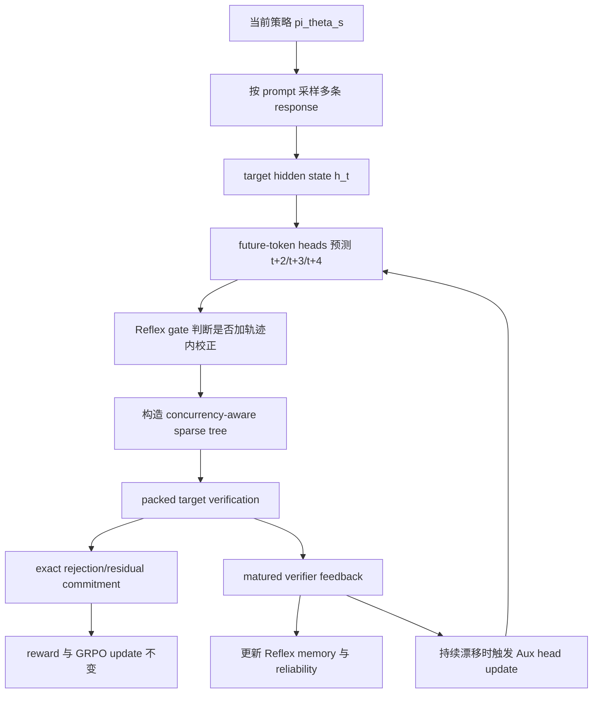

# SpecRoll：把 GRPO 的 rollout 加速问题拆成“快反馈”和“慢更新”

## 元信息

| 字段 | 内容 |
|---|---|
| 标题 | SpecRoll: Fast-Slow Verifier-Feedback Adaptation for Speculative Reinforcement Learning Rollouts |
| 类型 | 论文 |
| 方向 | 大模型后训练 |
| arXiv | https://arxiv.org/abs/2608.04962 |
| PDF | https://arxiv.org/pdf/2608.04962 |
| HTML | https://arxiv.org/html/2608.04962 |
| 版本日期 | arXiv:2608.04962v1，2026-08-05 |
| 代码入口 | https://anonymous.4open.science/r/SpecRoll-26062006 |

## TL;DR

- **这篇论文要解决的问题**：GRPO 这类可验证奖励 RL 后训练越来越常见，但 rollout 生成仍然要逐 token 自回归采样，长回答、每题多条响应和大 batch 会把训练时间卡在生成阶段。
- **核心方法**：SpecRoll 把 speculative decoding 放进 GRPO rollout，但不训练一个单独自回归 drafter；它用目标模型隐藏状态上的多个 future-token heads 生成候选树，再用 exact target verification 保证最终采样分布仍等价于目标策略。
- **关键创新**：作者把 verifier 反馈拆成两个时间尺度：Reflex 是无反传、轨迹内的隐藏状态校正；Aux/slow path 只在持续漂移被检测到时更新 proposal head 参数。
- **为什么不是简单 speculative decoding**：RL 中目标策略每轮都在变，静态 proposer 会 stale；持续在线训练 drafter 又会带来反传、优化器状态和同步开销。SpecRoll 的主张是：短期错配用局部记忆纠偏，长期错配才值得动参数。
- **主要实验**：在 Qwen2.5-1.5B/3B/7B/14B 和 Llama-3.1-8B 上，覆盖 GSM8K、SimpleRL-Abel-Level3to5、DAPO-Math-17K 三个数学推理数据集，硬件为单张 NVIDIA B200。
- **关键数字**：相对 vanilla GRPO，SpecRoll 达到 1.26x-2.15x generation speedup 和 1.21x-2.04x end-to-end speedup；相对 FastGRPO，15 个 matched settings 中 generation 和 E2E 都更快，平均 pairwise E2E 增益约 1.18x。
- **消融结论**：Heads only、Heads + Reflex、Heads + Aux、Full SpecRoll 四组显示 Reflex 和 Aux 都能提升同一组 future-token heads，其中 Reflex 单独收益更大，组合最强。
- **局限**：实验还停在 14B 以内、数学推理任务、单一 B200 环境；对代码、多语、超长上下文、更大模型、多机 pipeline 的泛化仍需额外验证。

## 研究问题：为什么 rollout 才是后训练的硬瓶颈？

### GRPO 里的慢点在哪里？

- GRPO 的吸引力在于不用 value model，而是对同一 prompt 的多条 sampled responses 做组内相对优势。
- 但每次 policy update 之前，系统仍要从当前策略采样多条完整回答。
- 对数学推理任务来说，回答往往长，且每个 prompt 生成 8 条 response 时，生成阶段会反复执行同一个大模型的自回归 forward。
- 这意味着训练不是只慢在 backward，也慢在 rollout：
  - 生成 token 的 sequential dependency 无法完全并行。
  - policy 每轮更新后，proposal 分布会漂移。
  - 如果 speculative drafter 太重，节省的 target forward 又可能被 drafter 训练和同步吃掉。

### 论文重新定义的问题

作者没有把问题表述成“如何让推理更快”，而是更精确地问：

> 在不改变 GRPO 采样分布和优化目标的前提下，如何让 rollout 里的每轮 target verification 接受更多有效候选，同时让 proposal 适应不断变化的 policy？

这个定义很重要，因为 RL rollout 的候选生成不能只追求速度：

- 如果改变了 target sampling distribution，reward、advantage 和 policy update 的统计意义都会变。
- 如果 proposal 需要频繁反传，rollout 加速会变成另一个训练任务。
- 如果只优化平均接受长度 AAL，可能生成更大的树但浪费更多候选；作者因此同时看 AAL 和 acceptance rate。

## 论文主张与论证路线

| Claim | Mechanism | Evidence | Boundary |
|---|---|---|---|
| rollout 生成是 GRPO 的主要 wall-clock 瓶颈之一 | 在每个 policy update 中，每个 prompt 采样 8 条 response，长序列逐 token 生成 | Figure 1 给出 Llama-3.1-8B/DAPO-Math-17K 的时间与成本对比：SpecRoll 45.3h，FastGRPO 47.4h，GRPO 92.5h | 单张 B200、数学任务；不同系统栈和并行策略可能改变瓶颈比例 |
| speculative rollout 必须保持 exact target sampling | anchor token 由 target 采样，树节点由 target 条件分布做 rejection/residual verification | Appendix B 的 Algorithm 1 和 Theorem B.1 证明 node-wise verification 输出目标分布 | 证明依赖 target logits 与普通 autoregressive forward 数值一致 |
| stale proposer 的错误可分成 distribution error 与 coverage error | 用候选集合 C、目标 top-K 集合 C*、条件重归一化分布 pC/qC 分解 acceptance surrogate gap | Equation 10-11 和 Figure 3 区分“候选选对但概率放错”和“重要候选没覆盖” | surrogate 是局部保守下界，不等同于完整 rollout 的全局收益 |
| 短期错配不必每次反传更新参数 | Reflex 用 delayed verifier feedback 构造隐藏状态方向，只在同一 trajectory 内临时校正 | Table 2 中 Heads + Reflex 在四个 Qwen2.5 尺度上均优于 Heads only | 依赖延迟反馈方向仍能预测后续错误；无预测性时 gate 会关闭 |
| 长期漂移仍需要慢路径 | Aux reservoir 记录 matured verifier records，连续 degraded windows 后只更新 proposal heads | Table 2 中 Heads + Aux 也优于 Heads only，Full SpecRoll 最强 | Aux 更新有 1.8% rollout-time overhead guard，不适合任意频繁触发 |
| SpecRoll 的收益来自更有效使用候选预算 | Concurrency-aware sparse tree 按活跃 response 数分配节点预算，Reflex/Aux 提升接受率 | Table 1 中 SpecRoll 在 14/15 设置 acceptance rate 高于 FastGRPO，15/15 E2E 更快 | FastGRPO 的 AAL 有时更高，所以不是“更长 accepted continuation”单指标胜出 |

## 方法机制：SpecRoll 的数据流

### 一次 GRPO iteration 内发生什么？



### 这张流程图的重点

- **target policy 是权威采样器**：
  - 第一个 anchor token 从目标策略采样。
  - speculative tree 只是让后续 target conditionals 可以批量验证。
  - 任何候选是否提交，由 exact verifier 决定。
- **proposal heads 是轻量组件**：
  - 不再维护独立自回归 drafter。
  - 不需要 drafter KV cache。
  - 每个 horizon head 从同一个 hidden state 预测未来位置。
- **反馈有成熟延迟**：
  - 当前 proposal 的错误，要等 target verification 后才知道。
  - Reflex 不假设这个错误永远有用，而是用 reliability lower bound 判断它能否预测后续错误。
- **GRPO 目标不变**：
  - reward computation 不变。
  - policy objective 不变。
  - target backbone 不从 Reflex/Aux 的辅助误差里接收梯度。

## 公式拆解：从 rollout 目标到错误分解

### 1. rollout proposal engine 的目标

论文把理想 engine 写成：

```text
maximize_E   E[A_t] / Cost(E)
subject to   X ~ pi_theta_s
```

变量解释：

- `E`：rollout 中的 speculative proposal engine。
- `A_t`：第 t 个 verification round 的 accepted progress。
- `Cost(E)`：构造候选、验证、反馈处理、可能的辅助更新成本。
- `X ~ pi_theta_s`：最终采样出的 response 必须服从当前目标策略。

这条约束是全文的安全线：

- 速度不是第一原则。
- 分布不变才是第一原则。
- 所有加速都只能改变“验证候选如何组织”，不能改变“提交 token 来自哪里”。

### 2. concurrency-aware tree budget

SpecRoll 在活跃 response 数变化时调整每条 response 的节点预算：

```text
N_t = clip(floor(C_hw / B_t), N_min, N_max)
```

含义如下：

| 符号 | 含义 | 设计作用 |
|---|---|---|
| `B_t` | 当前还没结束的 response 数 | 越多 response 同时活跃，每条 response 的树预算越小 |
| `C_hw` | 模型与硬件 profile 后的 verification capacity | 用硬件容量约束总 target verification 工作量 |
| `N_min` / `N_max` | 每条 response 的树节点下界/上界 | 防止 budget 过小或过大 |
| `T_t` | prefix-closed sparse tree | 只决定哪些 target conditional 一起算 |

这个公式回应了 RL rollout 的一个特殊形态：

- 生成早期，很多 response 都在跑，固定大树会浪费 target verification。
- 生成后期，短回答已经结束，活跃 response 变少，固定小树会低估硬件余量。
- 因此节点预算应该跟 `B_t` 反向变化，而不是为整段 rollout 用一个固定 tree size。

### 3. acceptance surrogate 的两个错误源

对一个已成熟 proposal node，令候选集合为 `C`，目标 top-K 集合为 `C*_K`。

论文定义条件分布：

```text
p_C(v) = p(v) / p(C)
q_C(v) = q(v) / q(C)
Omega_C = sum_v min(p_C(v), q_C(v)) = 1 - TV(p_C, q_C)
```

保守 acceptance surrogate 为：

```text
tilde_A_C = p(C) * Omega_C
```

它的 gap 可以分解为：

```text
p(C*_K) - tilde_A_C
= p(C) * TV(p_C, q_C)       # distribution error
  + p(C*_K) - p(C)           # coverage error
```

这一步是 Reflex 的理论入口：

- **distribution error**：候选集合里包含了重要 token，但 proposal 在这些 token 之间分配错了概率。
- **coverage error**：候选集合漏掉了 target top-K 里的重要 token。
- 二者都降低 acceptance，但需要不同校正方向：
  - 前者把已有候选的 logit 分布推向 target。
  - 后者把遗漏 token 相对 selection boundary 往上推。

## Reflex：无反传的轨迹内快反馈

### feedback direction 如何构造？

Reflex 在 matured proposal 上构造一个共同稀疏支持集：

```text
S = C union TopK_k(q) union TopK_k(p) union {y*}
```

这里：

- `C` 是 proposal 保留候选。
- `TopK_k(q)` 是 proposal 认为重要的 token。
- `TopK_k(p)` 是 target 认为重要的 token。
- `y*` 是实际 target token。
- 实现里 top-k budget 为 48，并会去重与截断。

distribution 方向：

```text
r_dist = W_S^T (p_S - q_S)
```

coverage 方向：

```text
r_cov = sum_{y in O} p_S(y) * (W_y - W_b*)
O = C*_K \ C
b* = argmin_{b in C} q(b)
```

解释：

- `W_S` 是 vocabulary projection 中支持集对应的行。
- `p_S - q_S` 把 proposal logits 往 target 分布靠。
- `O` 是被漏掉的 target-important token。
- `b*` 是 retained candidate 中 proposal 分数最低的边界 token。
- `W_y - W_b*` 表示把遗漏 token 往候选边界内推。

### memory 与 gate 为什么必要？

Reflex 不会把每个历史错误都直接套到当前 prefix。

它维护 trajectory-horizon 级别的 memory：

```text
m_i,h <- rho_h * m_i,h + (1 - rho_h) * e_i,tau,h
```

然后用 delayed alignment 估计可靠性：

```text
dRel_i,h = mean(a_i,h) - z_delta * std(a_i,h) / sqrt(n_i,h)
```

只有当 `dRel_i,h > 0`，才把 memory 作为隐藏状态扰动：

```text
u_i,h = m_i,h / RMS(m_i,h)
Delta z_i,t,h = alpha_i,t,h * RMS(z_i,t,h) * u_i,h
z_tilde_i,t,h = z_i,t,h + Delta z_i,t,h
```

这个 gate 的意义很直接：

- 如果 delayed feedback 的方向稳定，memory 会积累并通过 lower bound。
- 如果错误方向变化很快，memory 会互相抵消。
- 如果样本数少或方差大，`z_delta * std / sqrt(n)` 会压低可靠性。
- 因此 Reflex 的默认动作不是“纠偏”，而是“有证据才纠偏”。

### Reflex 的伪代码

```text
Input:
  target policy pi_theta, prefix x_<=t, horizon heads g_phi_h
  trajectory memory m_i,h, reliability stats R_i,h
  active concurrency B_t, hardware capacity C_peak

State:
  per trajectory-horizon memory m_i,h
  matured verifier records
  reservoir R_h for slow updates

Loop for each rollout round:
  1. compute target hidden state h_t
  2. sample anchor token a from pi_theta(. | x_<=t)
  3. for each horizon h in {1,2,3}:
       predict z_t,h from future-token head
       if feedback count, alignment lower bound, and boundary safeguards pass:
           apply bounded Reflex correction Delta z_t,h
       else:
           keep z_t,h unchanged
       form proposal distribution q_t,h
  4. set N_t = clip(floor(C_peak / B_t), N_min, N_max)
  5. build ordered sparse tree without replacement
  6. run packed target verification
  7. commit accepted token path by exact node-wise rejection/residual sampling
  8. for matured records:
       compute distribution error and coverage error
       update m_i,h, alignment stats, and reservoir
  9. if sustained drift guardrails pass:
       update one selected proposal head with bounded Aux loss

Output:
  target-distribution-correct rollout samples for unchanged GRPO update

Failure boundary:
  if target logits are not numerically equivalent to ordinary autoregressive forward,
  or if verifier residual sampling is replaced by greedy longest-branch selection,
  the exactness claim no longer follows.
```

## 慢路径：什么时候才更新 proposal head？

### 为什么需要 Aux？

Reflex 只在单条 trajectory 内工作：

- 它可以处理局部、短期、可预测的 proposer mismatch。
- 它不能让 proposal head 永久学习一个跨 batch 都存在的新偏差。
- 当 policy update 持续改变 target distribution 时，长期漂移必须通过参数更新吸收。

### Aux 的触发条件

论文的慢路径不是“每轮在线训练 drafter”，而是满足多重 guardrail 才更新：

| 条件 | 具体规则 | 作用 |
|---|---|---|
| 持续漂移 | 64 条 matured records 的监控窗口内，连续 3 个窗口 degraded | 避免瞬时波动触发训练 |
| reservoir 数量 | 对应 horizon 至少 64 条 matured records | 保证更新样本不是偶然噪声 |
| cooldown | 距上次 Aux 至少 10 个完整 rollout batches | 防止频繁同步 |
| overhead cap | 累计 Aux 时间不超过 rollout generation time 的 1.8% | 防止加速器本身变成瓶颈 |
| head selection | 多个 horizon 同时 eligible 时，只更新 degradation 最大者 | 控制写入范围 |

Aux loss 包含：

```text
L_aux =
  KL(p_S || q_raw_S)
  + 0.1 * KL(p_S || q_eff_S)
  + 1.5 * L_rank
  + lambda_p * L_prox
```

这里的设计边界也很重要：

- 只更新 horizon-specific proposal heads。
- target backbone 冻结。
- vocabulary projection 冻结。
- 目标策略的 GRPO 梯度来自原来的 reward 和 policy objective。
- Aux 每次最多使用 256 条 matured records。

## 实验设置：对照是否公平？

### 模型、数据与训练协议

| 维度 | 设置 |
|---|---|
| 模型 | Qwen2.5-1.5B、3B、7B、14B；Llama-3.1-8B |
| 数据集 | GSM8K、SimpleRL-Abel-Level3to5、DAPO-Math-17K |
| 硬件 | 单张 NVIDIA B200 |
| seed | 42 |
| epoch | 1 |
| 每 prompt responses | 8 |
| sampling | temperature 1.0，nucleus 0.95，无 top-k truncation |
| 最大 prompt 长度 | 2048 tokens |
| 最大总序列长度 | 2048 tokens |
| optimizer | AdamW，target policy LR 1e-6 |
| GRPO | KL coefficient beta=0.04，clip epsilon=0.1 |
| LoRA | rank 64，scale 32，dropout 0 |

### proposal 与 baseline

- SpecRoll 使用三个 horizon heads：
  - 预测 `t+2`、`t+3`、`t+4`。
  - 每个 head 使用 residual transformation。
  - vocabulary projection 复用并冻结 target projection。
- heads 预训练：
  - 数据为 ShareGPT-V4.3-derived corpus。
  - 训练 1 epoch。
  - 最大序列长度 1024。
  - AdamW learning rate 3e-4。
- FastGRPO drafter：
  - 使用同一 ShareGPT-derived corpus。
  - 最大序列长度 2048。
  - 预训练 learning rate 5e-5。
  - online drafter learning rate 1e-4。

公平性来自 matched run：

- 相同 target checkpoint。
- 相同 prompt 顺序。
- 相同 reward function。
- 相同 group size。
- 相同 response limit。
- 相同 target sampling implementation。
- timing 统计包含 proposal construction、verification、feedback、triggered auxiliary work。

## 主结果：速度提升来自哪里？

### Table 1 的核心读法

论文报告了三类数字：

- `Gen.`：相对 vanilla GRPO 的 generation speedup。
- `E2E`：相对 vanilla GRPO 的端到端训练 speedup。
- `AAL`：每轮 target verification 接受的 speculative tokens 数。
- `Acc.`：被测试 speculative candidates 中被 verifier 接受的比例。

关键结论如下：

| 结论 | 证据 |
|---|---|
| SpecRoll 相对 vanilla GRPO 稳定加速 | 15 个 model-dataset 设置中 generation speedup 为 1.26x-2.15x，E2E 为 1.21x-2.04x |
| SpecRoll 相对 FastGRPO 也稳定更快 | 15 个 matched settings 中 generation 和 E2E 都高于 FastGRPO |
| 平均提升不只是局部异常 | SpecRoll 平均 generation speedup 1.57x，平均 E2E 1.51x；FastGRPO 分别为 1.33x 和 1.29x |
| acceptance rate 是更关键的解释变量 | SpecRoll 在 14/15 设置中 Acc. 高于 FastGRPO |
| AAL 不是单独胜负指标 | FastGRPO 有时 AAL 更高，例如 Qwen2.5-14B/SimpleRL，但 E2E 仍更慢 |

### 为什么 AAL 高不一定更好？

一个直观误区是：

- 如果每轮接受更长 continuation，系统就一定更快。

SpecRoll 的结果提示这个判断不充分：

- AAL 衡量 committed progress per verification round。
- Acceptance rate 衡量 tested candidates 有多少真正转化成 accepted tokens。
- 如果树更大、候选更多、drafter 更重，AAL 可能高，但单位计算预算的有效接受率不一定高。
- SpecRoll 的优势更像是“同样或更少的 proposal/verification 成本，转化出更多有效 token”。

## 消融：快路径和慢路径是否互补？

### Table 2 的四组 SpecRoll 变体

| 变体 | 保留内容 | 去掉内容 | 用来回答的问题 |
|---|---|---|---|
| Heads only | future-token heads + concurrency-aware verifier | Reflex 与 Aux | 轻量 heads 自身是否足够 |
| Heads + Reflex | heads + 快反馈 | Aux | 无反传轨迹内校正是否有效 |
| Heads + Aux | heads + 慢更新 | Reflex | 持续漂移参数更新是否有效 |
| Full SpecRoll | heads + Reflex + Aux | 无 | 两条路径是否互补 |

在 SimpleRL-Abel-Level3to5 上，四个 Qwen2.5 尺度都呈现同一方向：

- Reflex-only 全部优于 Heads only。
- Aux-only 全部优于 Heads only。
- Reflex 单独收益通常比 Aux 更大。
- Full SpecRoll 在 generation speedup、E2E speedup、acceptance rate 上最强。

以 Qwen2.5-14B 为例：

| 方法 | E2E speedup | AAL | Acc. |
|---|---:|---:|---:|
| Heads only | 1.16x | 1.740 | 0.083 |
| Heads + Reflex | 1.36x | 1.780 | 0.089 |
| Heads + Aux | 1.27x | 1.750 | 0.086 |
| Full SpecRoll | 1.45x | 1.970 | 0.115 |

这个消融支持作者的核心分工：

- Reflex 处理“trajectory 内马上能用的错误方向”。
- Aux 处理“跨 trajectory 持续出现的 proposal drift”。
- 两者不是同一个机制的重复，而是在不同时间尺度上使用 verifier feedback。

## Figure/Table 逐项证据解读

### Figure 1：成本故事是否成立？

Figure 1 用 Llama-3.1-8B 在 DAPO-Math-17K 上的 wall-clock 和成本举例：

| 方法 | 时间 | 成本 |
|---|---:|---:|
| GRPO | 92.5h | 约 636.6 美元 |
| FastGRPO | 47.4h | 约 326.1 美元 |
| SpecRoll | 45.3h | 约 311.7 美元 |

它支持的 claim 是：

- SpecRoll 相对 vanilla GRPO 的收益非常明显。
- 相对 FastGRPO 的额外收益较小但仍存在。
- 对一次单卡训练 run 来说，节省可以换算成 GPU-hours 和美元成本。

它不能证明的是：

- 不能证明所有硬件价格下成本比例相同。
- 不能证明多机训练里瓶颈仍在同一位置。
- 不能证明 longer training run 中收益线性外推。

### Figure 2：机制图的作用

Figure 2 不是结果图，而是架构证据：

- 它把 future-token heads、Reflex、sparse-tree verification、matured feedback、persistent update 放进同一个 GRPO iteration。
- 它强调 reward computation 和 GRPO policy update 不变。
- 它说明反馈不是直接改 target policy，而是先进入 proposal side。

这张图支撑的是“分布保持 + proposal 自适应”的机制主张。

### Figure 3：为什么错误要拆成两类？

Figure 3 给了两个 proposal error 的例子：

- distribution error：
  - 正确 token 已在候选集合里。
  - 但 proposal 在候选内概率分配与 target 不一致。
  - 这种情况需要调整 retained candidates 的相对 logit。
- coverage error：
  - target 重要 token 没进入候选集合。
  - 即便候选内分布看起来合理，也无法接受漏掉的 token。
  - 这种情况需要把 omitted target-important token 推过 selection boundary。

这张图解释了为什么 Reflex 要同时构造 `r_dist` 和 `r_cov`，而不是只用 KL 或只用 top-1 命中。

### Table 1：整体效率表

Table 1 支撑的结论最强：

- 覆盖 5 个模型 x 3 个数据集。
- 每个 setting 都比较 vanilla GRPO、FastGRPO、SpecRoll。
- SpecRoll 在所有 15 个 setting 的 generation 和 E2E 上都胜过 FastGRPO。

但它仍有边界：

- 每个表项是一个 completed matched run，不是多 seed 置信区间。
- 数据集集中在数学推理。
- 硬件固定为单张 B200。

### Table 2：机制消融表

Table 2 的价值在于排除两个替代解释：

- 不是只靠 future-token heads：
  - Heads only 明显弱于 Reflex/Aux 组合。
- 不是只靠慢速在线更新：
  - Reflex-only 已经带来较大收益。

因此，论文的机制 claim 比“我们做了一个更好的 speculative drafter”更细：

- 轻量 heads 降低 proposal overhead。
- Reflex 用 delayed verifier feedback 做 fast local correction。
- Aux 只在 drift 持续时做慢 consolidation。

## 相关工作中的位置

### 与系统级 RLHF/RL 后训练框架的关系

DeepSpeed-Chat、OpenRLHF、ReaL、HybridFlow、PipelineRL 主要处理：

- 调度。
- 训练/推理资源复用。
- resharding。
- pipeline overlap。
- inter-stage idle time。

SpecRoll 的位置不同：

- 它减少的是 rollout 内部 target decoding 的 sequential cost。
- 因此它理论上可以和 pipeline 系统互补。
- 但这也意味着论文还没有证明在复杂 production pipeline 中叠加后仍保持同等收益。

### 与 Medusa/EAGLE/FastGRPO 的关系

SpecRoll 借鉴了 parallel future-token heads 的思路，但目标场景是 RL rollout：

- Medusa 类方法主要面向推理加速。
- EAGLE 类方法强调 feature prediction 和 draft tree。
- FastGRPO 已经把 concurrency-aware speculative decoding 带入 GRPO。

SpecRoll 相对 FastGRPO 的区别在于：

- 不维护 standalone EAGLE-style autoregressive drafter。
- 不把持续 online drafter training 作为唯一适配方式。
- 把 verifier feedback 拆成 fast memory 与 slow parameter update。

## 失败、反例与证据边界

### 作者主动承认的边界

- 模型规模：
  - 只覆盖到 14B。
  - 没有 70B 或 MoE 规模实验。
- 任务范围：
  - 主要是数学推理。
  - 没有代码生成、多语、多模态或 agentic task。
- 硬件范围：
  - 单张 NVIDIA B200。
  - 未覆盖不同 GPU、不同推理 kernel、不同通信拓扑。
- 训练长度：
  - 每个数据集训练 1 epoch。
  - 更长训练的 proposer drift 与 Aux 触发模式仍需观察。

### 复现实验时最容易踩的坑

| 风险点 | 为什么会影响结论 | 应该记录的证据 |
|---|---|---|
| packed target forward 与普通 forward 不一致 | exactness 证明依赖同一 prefix 下 target logits 等价 | 对抽样 prefix 做逐 token logit diff，记录最大误差与容忍阈值 |
| cache extraction 改变 accepted path 状态 | speculative tree 接受后要把 KV cache 对齐到提交路径 | 对比继续生成若干 token 的分布或 logits 是否一致 |
| response 长度分布变化 | generation speedup 与 active concurrency 强相关 | 每个训练阶段的长度直方图、unfinished response 数曲线 |
| Aux 触发频率过高 | 慢路径可能吞掉 rollout 加速收益 | 每个 dataset 的触发次数、median/mean/max latency、累计占比 |
| reward variance 为零的 group 比例不同 | GRPO update 有些 group 不贡献梯度，会改变有效训练量 | 每轮有效 group 数、被跳过 group 数、reward 方差统计 |
| FastGRPO drafter 调参不足 | baseline 过弱会放大 SpecRoll 相对优势 | drafter 预训练 loss、online LR、acceptance 与 AAL 曲线 |

这些不是论文的硬伤，而是把方法搬到另一个训练栈时必须重新验算的工程条件。

尤其是 exact verification 的部分，不能只看最后任务分数相近：

- 如果提交 token 的边际分布已经偏离 `pi_theta`，短期 reward 可能仍然上升。
- 但这种上升可能来自采样偏置，而不是同一个 GRPO objective 的无偏估计。
- 因此复现实验至少要同时报告：
  - target logits equivalence。
  - verifier residual sampling 的实现。
  - accepted path cache 的一致性。
  - reward 曲线与 rollout 分布诊断。

### 我会保留的怀疑点

- **多 seed 稳定性**：
  - 表格很完整，但没有呈现跨 seed 方差。
  - 如果 response length 分布或 reward variance 波动大，wall-clock 可能有明显 run-to-run noise。
- **FastGRPO baseline 的实现细节**：
  - 作者尽量匹配数据、target、prompt 顺序和 sampling 设置。
  - 但 FastGRPO drafter 架构与 SpecRoll heads 不同，公平比较仍依赖实现质量。
- **manifested gain 与 learning quality 的关系**：
  - Appendix G 说 GSM8K reward dynamics 相近。
  - 但 reward 曲线相近不等于所有能力指标都不变。
- **exactness 的工程前提**：
  - 理论要求 tree-packed target logits 等价于普通 autoregressive forward。
  - 真实系统中 cache extraction、mask、position id、batch packing 的细节都可能破坏这个前提。

## 细读 Appendix：理论证明到底证明了什么？

### Appendix A：Reflex 方向是局部 surrogate 的下降方向

Appendix A 的第一层结论是：

- 在支持集和权重固定时，distribution feedback 可以写成 restricted KL 的负梯度方向。
- coverage feedback 可以写成一个边界排序 surrogate 的负梯度方向。
- 二者非负加权后，仍是某个局部 surrogate 的下降方向。

这说明 Reflex 不是随便把误差向量加到 hidden state 上。

但这个证明也很克制：

- 它只在固定支持集、固定权重的点上成立。
- 它不保证支持集变化后全局 KL 一定下降。
- 它不保证完整 rollout 的任务 reward 一定提高。

### Appendix A 的延迟记忆界

作者进一步分析了 delayed feedback memory：

- 设 feedback 有固定延迟 `d0`。
- 设 EMA decay 为 `rho`。
- 设 predictable field 的漂移有上界 `Gamma`。
- 设噪声满足条件 sub-Gaussian。

于是 tracking radius 可以拆成两部分：

```text
epsilon = drift_error + noise_error
```

直观解释如下：

| 项 | 越大意味着什么 | 设计含义 |
|---|---|---|
| `Gamma * ell_H(rho,d0)` | policy 或 proposer 错误场漂移快 | memory 不能拖太久，否则旧反馈失效 |
| `sigma * sqrt(nu_H(rho))` | verifier feedback 噪声大 | 需要更多成熟样本或更保守 gate |
| `z_delta` | 置信惩罚更强 | gate 更难通过，减少误纠偏 |

这部分证明支撑的是“为什么要可靠性下界”，而不是“Reflex 永远有收益”。

### Appendix B：exact tree verification 的证明边界

Appendix B 的关键是 node-wise rejection/residual 过程：

- 每个候选按 slot-specific proposal 分布抽出。
- 接受概率使用当前 residual target mass 与 proposal 概率之比。
- 拒绝后 residual 重新归一化。
- 如果全部拒绝，从 residual 中采样 fallback。

它证明的是：

- 对每个 visited node，输出 token 的分布等于目标条件分布。
- 递归到树上后，anchor 加后续 token 的联合分布等价于 ordinary autoregressive sampling。

它没有证明的是：

- greedy longest branch 也正确。
- 任意 tree packing 实现都正确。
- 任意 numerical approximation 都不会影响分布。

所以在工程实现中，最重要的不是“树长不长”，而是“每个节点的 residual bookkeeping 是否严格”。

## 对 AI 安全评测的间接意义

虽然这篇论文属于后训练系统效率，但它对 AI 安全评测有一个间接提醒：

- 很多安全训练也依赖采样、过滤、verifier 或 reward model。
- 如果采样路径被加速器悄悄改变，安全评估看到的 failure rate 可能不再对应原策略。
- 如果 verifier feedback 被用作局部校正信号，就必须区分“proposal 更接近 target”与“行为更安全”。

一个更安全的设计原则是：

| 原则 | 在 SpecRoll 中的对应 | 推广到安全训练时的要求 |
|---|---|---|
| 最终判定器权威 | exact target verifier 决定 token 提交 | safety verifier 或 policy verifier 不能被 proposal 绕过 |
| 快反馈可撤销 | Reflex memory 随 trajectory 结束重置 | 安全局部校正应可审计、可关闭 |
| 慢更新有门槛 | Aux 要连续 degraded windows 与 overhead cap | 安全参数更新要有稳定证据与回归测试 |
| 分布诊断独立于 reward | Table 1 同时报告 speed、AAL、Acc. | 安全训练也应报告采样偏置与拒答/误拒统计 |

这也是本文最值得带走的系统观：

- 加速、适配和安全约束不能混在一个黑盒优化里。
- 最好把“谁提议”“谁验证”“谁提交”“谁学习”拆开，并分别记录证据。

## 对后训练研究的启发

### 1. rollout engine 可能成为后训练算法的一部分

过去讨论 RL 后训练时，常把重点放在：

- reward design。
- policy objective。
- KL penalty。
- exploration。
- data mixture。

SpecRoll 提醒我们：

- rollout generation 的统计正确性和系统效率，本身会限制哪些算法可扩展。
- 当每个 update 都要采样大量长回答时，decoder-level acceleration 不是纯工程优化，而是决定训练预算能否覆盖更多探索。

### 2. verifier feedback 不只能用于 reward

在 GRPO 语境里，verifier 常被理解为 reward source。

SpecRoll 把 verifier 的另一种价值提取出来：

- 它暴露 target distribution 与 proposal distribution 的局部差异。
- 这些差异可以转成 proposal hidden-state correction。
- 只要 exact target verification 仍是提交 token 的权威，proposal side 可以更激进地自适应。

这对 AI 安全和 agent 后训练也有类比意义：

- 安全 verifier 的反馈未必只能变成拒答 reward。
- 它也可能成为生成过程中的局部校正信号。
- 但前提是校正信号不能绕过最终安全判定器。

### 3. “快记忆 + 慢参数”的结构值得推广

SpecRoll 的快慢分工可以概括为：

| 层 | 适合吸收的信号 | 更新代价 | 风险 |
|---|---|---:|---|
| Reflex memory | 同一 trajectory 内短期可预测误差 | 低，无反传 | 错误方向不稳定时可能误导 |
| Aux head update | 跨 trajectory 持续漂移 | 中，需要优化一步 | 过频更新会吞掉加速收益 |
| Target policy GRPO | reward 驱动的能力变化 | 高，主训练路径 | 改变模型能力与行为 |

这种结构对后训练系统很有启发：

- 不同反馈不一定要进同一个参数通道。
- 局部、短寿命、可撤销的校正可以先存在 memory 中。
- 只有反复出现的稳定模式才值得写入参数。

## 继续追问

- **能否用于代码 RL？**
  - 代码任务也有 verifiable rewards，但 response length、compile/test latency、失败分布与数学不同。
  - SpecRoll 的 target-token exactness 能保留采样分布，但是否能提升端到端训练，要看生成时间相对 sandbox test 时间的占比。
- **能否和 pipeline RL 叠加？**
  - 如果 PipelineRL 已经隐藏了部分 rollout latency，SpecRoll 减少 token-level decoding 后的边际收益需要重新 profile。
  - 两者可能互补，也可能在 scheduling 上互相影响。
- **Reflex gate 能否用于安全拒答校正？**
  - 技术上，delayed verifier feedback 可以构造局部方向。
  - 但安全任务中错误类型更复杂，不能把“更接近 target distribution”等同于“更安全”。
- **更大模型会怎样？**
  - 大模型 target verification 更贵，speculative decoding 潜在收益更高。
  - 但 future-token heads、packed verification、cache extraction 的内存压力也更大。
- **多 seed 与置信区间是下一步必需证据**：
  - 当前结果足够支持“方法值得关注”。
  - 若要作为生产后训练系统组件，还需要跨 seed、跨硬件、跨任务、跨训练长度的稳定性报告。

## 小结

- SpecRoll 的贡献不是简单地把 speculative decoding 搬到 GRPO。
- 它抓住了 RL rollout 的两个特殊点：
  - 目标策略持续漂移。
  - 每轮生成有大量并发 response，且并发度随完成情况变化。
- 方法上，它用：
  - future-token heads 降低 proposal overhead；
  - concurrency-aware sparse tree 贴合 rollout 并发；
  - exact verifier 保持目标采样分布；
  - Reflex 吸收短期轨迹内错误；
  - Aux 吸收持续 proposal drift。
- 证据上，15 个 matched settings 都显示相对 FastGRPO 的 generation/E2E 优势，Table 2 支持快慢路径互补。
- 边界上，它仍是数学推理、14B 内、单 B200、单 seed 风格的系统论文；真正进入通用后训练栈前，还需要更大规模、更复杂任务和更多工程栈的复现。
