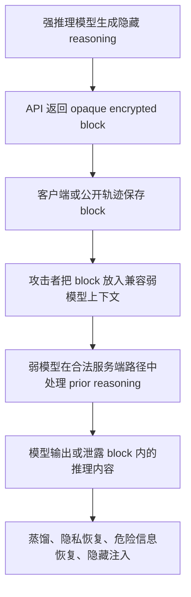
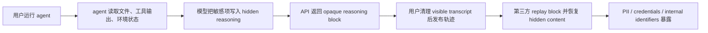

# Stealing Reasoning Traces：客户端加密思维块为什么会变成跨模型解码面

## 元信息与 TL;DR

| 字段 | 内容 |
|---|---|
| 标题 | Stealing Reasoning Traces from Proprietary LLM APIs |
| 作者 | Alexander Panfilov, David Schmotz, Ilia Shumailov, Luca Beurer-Kellner, Joachim Schaeffer, Ameya Prabhu, Jonas Geiping, Maksym Andriushchenko |
| 发布 | arXiv:2608.09867v1，2026-08-10 17:24:50 UTC |
| 方向 | AI 安全；推理模型 API；agent 轨迹数据治理 |
| 原文 | https://arxiv.org/abs/2608.09867 |
| 项目页 | https://stolen-thoughts.com/ |

### TL;DR

1. 论文研究的问题是：主流推理模型 API 为了隐藏 chain-of-thought，把完整推理放进客户端可持有、可回传的加密 reasoning block；这种设计是否真的保护了推理内容、用户隐私和安全边界。
2. 作者的核心发现是：部分 provider 的加密 reasoning block 在 2026 年 7 月测试窗口内表现出跨会话、跨用户、跨模型兼容性；攻击者不需要服务器权限、不需要模型权重，只要拿到兼容 block，就可能让同生态内更弱的模型承担“解码器”角色。
3. 论文给出四类风险：专有推理蒸馏、公开轨迹中的隐私与凭据恢复、隐藏 reasoning 中的危险信息泄露、以及把不可见 prompt injection 藏进加密 reasoning block 后污染长程 agent 续跑。
4. 关键数字是：作者从 6,708 条公开 agent/session trajectories 中解析并解码 315,320 个 reasoning blocks；经两阶段 LLM-as-a-judge 和去重后，真实用户会话里留下 704 个隐私 artifact，其中 64 个只出现在 reasoning 中；摘要层面报告恢复 367 个 PII artifacts 与 182 个 credentials。
5. 对真实非 benchmark 会话，作者列出的凭据类结果包括 62 个 API keys、33 个 passwords、24 个 access tokens、7 个 private keys；这说明“只清理可见聊天文本”不足以让公开轨迹安全。
6. 证据链不是单个 jailbreak 演示，而是组合了受控提取、120 个 Codeforces 问题上的 token-count fidelity 检查、跨 provider 兼容矩阵、公开轨迹批量扫描、合成 persona 对照和附录中的 provider-specific extraction details。
7. 局限也很明确：研究依赖 2026 年 7 月可访问的 API 版本；无法看到 provider 的真实密码学实现；没有 ground-truth plaintext reasoning，只能用 token count、敏感信息是否出现、定性样例等间接证据判断 fidelity。
8. 防御方向不是“再给用户一个更神秘的密文”，而是把 reasoning envelope 绑定到 user、session、conversation position、model/version 和 predecessor state；旧密钥要轮换，公开数据要剥离 opaque reasoning fields，模型侧还要拒绝 transcription-style 请求。

### 本文的安全边界

- 本文只解释论文的威胁模型、系统机制和防御含义。
- 不复现可直接操作的 jailbreak prompt、provider-specific 提取模板或敏感样例。
- 对论文中的凭据、PII 和危险内容案例只保留聚合数字与防御结论。

## 1. 研究问题：为什么“加密思维”反而扩大了攻击面？

### 1.1 作者真正反驳的直觉

很多推理模型 API 的工程直觉可以概括成三句话：

1. reasoning trace 很值钱，不能直接给用户看；
2. 多轮对话又需要保留前一轮 reasoning state；
3. 把 reasoning 加密后交给客户端保存，下一轮再回传，似乎同时满足成本、连续性和保密性。

这篇论文要指出的是：上述方案把“存储成本”从 provider 侧转移到 client 侧时，也把一个高价值密码学资产交给了不受信任环境。

### 1.2 三个目标之间的冲突

| 目标 | API 设计中的好处 | 论文指出的风险 |
|---|---|---|
| Confidentiality | 用户看不到完整 chain-of-thought，降低蒸馏与危险信息暴露 | 如果同生态弱模型可解码，密文只是在 UI 层不可读 |
| Integrity | AEAD/MAC 让用户不能任意篡改 reasoning block | 完整性保护的是“内容未改”，不是“上下文未变” |
| Statelessness | provider 不必存储每一轮完整 reasoning state | block 必须可回传、可重放，于是 replay 成为攻击原语 |

### 1.3 论文的核心 claim

> 当前问题不是“加密算法一定坏了”，而是 envelope 认证了内容，却没有充分认证上下文。

可以把作者的论证压缩成一个安全不变量：

```text
安全目标：
  Dec(envelope, context_now) 只有在 context_now == context_origin 时才有意义

论文观察：
  许多系统更接近 Dec(envelope, provider_family) 可用

后果：
  同一 provider family 内的 weaker model 可能成为 decoding oracle
```

这里的关键不是攻击者能否破解 AEAD，而是模型服务端在合法 API 调用路径里愿意为不恰当上下文解密并处理 reasoning block。

## 2. 威胁模型：攻击者并不需要“黑进 provider”

### 2.1 标准、非特权 API 攻击者

作者假设攻击者：

1. 没有 provider 内部权限；
2. 看不到 server-side state；
3. 拿不到专有模型权重；
4. 只使用标准 API 调用；
5. 需要一个同生态内兼容的 decoder model。

这个威胁模型让论文更有现实意义：攻击面来自 API 协议和模型族兼容性，而不是传统意义上的密钥泄露或服务器入侵。

### 2.2 两类攻击者

| 攻击者 | 如何拿到 block | 目标 | 典型风险 |
|---|---|---|---|
| First-party attacker | 自己调用强模型产生 encrypted reasoning block | 蒸馏、绕过隐藏推理保护、探测危险 reasoning | 对 frontier model 的监控可能看不到后续提取 |
| Third-party attacker | 从 GitHub、HF、公开轨迹或共享 session 中拿到别人发布的 block | 隐私恢复、凭据恢复、隐藏注入 | 受害者可能已经清理了可见文本，但无法清理密文 |

### 2.3 为什么 agent 轨迹尤其敏感？

Agent 系统比普通聊天更容易暴露这类问题：

1. agent 会读文件、调用工具、检查环境变量、处理浏览器状态；
2. 长程任务常保存 raw transcript 以便复现、debug、续跑；
3. benchmark 与研究 artifact 倾向公开完整轨迹；
4. 用户能审查 visible messages，却不能审查 opaque reasoning fields；
5. 一旦他人能 replay block，公开轨迹就不再只是“不可读密文集合”。

## 3. 机制拆解：兼容性为什么是漏洞放大器？

### 3.1 三种 reasoning compatibility

| 兼容性 | 定义 | 正常用途 | 论文中的攻击含义 |
|---|---|---|---|
| In-session / cross-session | 同一用户能把 block 按不同顺序或在新会话中重放 | 会话编辑、上下文截断、恢复旧任务 | 可以构造虚假的 prior reasoning |
| Cross-user | 一个用户产生的 block 能被另一个用户 replay | 公开轨迹复现、团队协作迁移 | 第三方能解码别人公开的 encrypted traces |
| Cross-model | 一个模型产生的 block 能被同 provider 另一个模型处理 | 模型降级、路由、成本优化 | 弱模型可绕过强模型的 anti-distillation 防线 |

### 3.2 关键不变量：内容认证不等于上下文认证

论文里的 AEAD envelope 可以抽象成：

```math
Envelope = AEAD_Encrypt(
  key = K_provider,
  plaintext = reasoning_trace,
  associated_data = header_or_signature_fields
)
```

如果 associated data 只覆盖 provider 内部需要的 block 类型、版本、key id 等，而没有强绑定：

1. `user_id`；
2. `session_id`；
3. `model_id / model_version`；
4. 前序 conversation hash；
5. block 的位置序号；

那么 replay 检查就可能只回答“这个 envelope 是否真由 provider 产生”，而没有回答“这个 envelope 是否属于当前调用者、当前会话、当前模型和当前历史”。

### 3.3 论文的攻击流程，防御视角版



注意这张图有两个安全重点：

1. 攻击者不是在本地解密 ciphertext；
2. 解码发生在 provider 的正常模型调用路径里。

这也是为什么只讨论“密文是否足够强”会漏掉系统风险。

## 4. 证据路线：从单点演示到批量扫描

### 4.1 受控提取实验

作者先在可控任务上生成 reasoning blocks：

| 数据或任务 | 用途 |
|---|---|
| AIME 2025 | 检查数学推理 trace 能否被恢复 |
| Codeforces Open-R1 subset | 用 120 个编程问题比较 extracted token count 与 API thinking token count |
| Humanity's Last Exam | 做定性对照，观察 reasoning 风格与 visible output 风格 |
| HarmBench paraphrase | 验证危险信息可能留在 hidden reasoning，而 visible answer 仍然安全 |

论文没有 ground-truth plaintext reasoning，因此 fidelity 不是用 exact-match 证明的。

作者改用三类间接证据：

1. extracted reasoning token count 与 API-reported thinking tokens 同步变化；
2. decoded trace 比 summary 更细，且能解释 visible answer 中没有的信息；
3. 批量扫描能恢复真实凭据和 PII，这些内容不可能由空泛模板凭空可靠生成。

### 4.2 Cross-model compatibility 表的含义

论文 Table 1 的高层含义如下：

| Provider family | 论文观察到的兼容模式 | 安全含义 |
|---|---|---|
| Claude | 除 Fable 5 的 thoughts 外，多数 thinking traces 可被其他 Claude 模型 replay | 弱模型可能成为强模型 trace 的处理入口 |
| GPT | GPT-5.6 系列能 replay 许多早期 generation traces | 新一代低成本模型可能放大旧 traces 的可解码性 |
| Gemini | 测试中的多数 Gemini models 表现出较广泛 replay 兼容性 | model switching 便利性与隔离性冲突明显 |

这张表不是为了证明所有未来 API 都如此，而是说明“同生态兼容”本身应该被当成安全属性审计。

### 4.3 批量隐私扫描

论文最有冲击力的证据来自公开轨迹：

| 指标 | 数字 | 解释 |
|---|---:|---|
| 公开 agent/session trajectories | 6,708 | 来自 GitHub、Hugging Face 等公开来源 |
| reconstructed reasoning blocks | 315,320 | 作者对 encrypted/signed blocks 做批量解析与恢复 |
| first-pass flagged blocks | 27,165 / 315,320，约 8.6% | 高召回 LLM labeler，包含大量 placeholder 和非真实 secret |
| second-pass real artifact blocks | 1,028 | 经第二阶段判别后仍至少含一个真实 artifact |
| genuine non-benchmark artifacts | 704 | 排除 benchmark sources 后的真实用户会话去重结果 |
| reasoning-only artifacts | 64 | 只在 hidden reasoning 中出现，不在 visible trace 中出现 |

这个结果的重要性不在于比例是否“很高”，而在于它破坏了一个发布数据的基本前提：

```text
如果用户不能读 encrypted reasoning，
用户就不能证明自己已经清理了 encrypted reasoning。
```

### 4.4 凭据与 PII 的分类结果

论文对真实非 benchmark 会话给出的明细包括：

| 类别 | 数字 | 风险解释 |
|---|---:|---|
| API keys | 62 | 可直接导致第三方服务滥用或账单风险 |
| Passwords | 33 | 账户接管风险，尤其是测试环境复用密码 |
| Access tokens | 24 | CI、cloud、repo 或内部服务访问风险 |
| Private keys | 7 | 最严重的一类，需要立即轮换 |
| Personal emails | 30 | 隐私与关联身份风险 |
| Names | 130 | 与其他字段组合后可构成身份画像 |
| Postal addresses | 36 | 合规与人身安全风险 |
| File/repository paths | 279 | 单独看不一定是 secret，但有助于定位内部项目结构 |

作者还指出一个常见触发场景：用户让 agent “清理、匿名化、准备发布”会话，模型在 hidden reasoning 中重新读取并列出需要移除的敏感项；可见文本可能被清理，但 encrypted block 仍保留这些内容。

## 5. 四类攻击向量：每一类分别改变什么安全假设？

### 5.1 专有推理蒸馏

#### Claim

推理 trace 比 final answer 更适合作为 student model 的训练监督，因此恢复 hidden reasoning 会提高黑盒蒸馏价值。

#### Mechanism

| answer-only distillation | reasoning-trace distillation |
|---|---|
| 学生只能看最终答案 | 学生能看任务分解、搜索路径、中间判断 |
| 需要自行推断 latent computation | 可以直接 next-token imitate 解题过程 |
| 对复杂推理任务监督稀疏 | token-level dense supervision 更丰富 |

论文引用相关工作说明：即使只用近似重构的 reasoning traces，也能比 answer-only distillation 带来更大收益；本文的风险在于攻击者可能恢复原始真实 reasoning，而不只是训练一个 inversion model 近似它。

#### Evidence

作者报告的经济估算是：按当时 Claude Haiku 4.5 标准 API 价格，解码 10k 条、每条 12k input/output window 的 traces，名义成本约 720 美元。

这个数字说明两点：

1. 攻击成本不是只有大型竞争对手才能承担；
2. 如果公开轨迹已经包含强模型 reasoning block，攻击者甚至不需要再付费调用原始 frontier model。

#### Boundary

蒸馏价值并不等于完整复制模型能力：

1. trace fidelity 不是逐 token ground truth；
2. 训练 student 仍需要数据清洗、任务分布和算力；
3. provider 可以改变 API、密钥、模型拒绝策略；
4. 论文没有证明所有模型族、所有版本、所有未来 API 都可复现。

### 5.2 Hidden reasoning 中的危险信息泄露

#### Claim

模型的 visible answer 可以安全拒绝，但 hidden reasoning 仍可能经过危险步骤、列出危险细节或形成可被恢复的 misuse uplift。

#### Mechanism

安全训练往往约束用户可见输出；直接强压 chain-of-thought 可能降低 monitorability 或引入 reasoning pressure。因此模型可能：

1. 在 hidden reasoning 中分析危险请求；
2. 最终 visible output 给出拒绝或安全替代；
3. output filter 只看到 visible answer；
4. replay/extraction 攻击恢复 hidden reasoning。

#### Evidence

论文用 HarmBench paraphrase 做 proof-of-concept，展示 visible answer 与 recovered reasoning 的差异。本文不复现该样例细节，只保留安全结论：隐藏 reasoning 不能被当作天然安全缓冲区。

#### Boundary

这类风险最依赖模型具体行为：

1. 不同模型对危险话题的 hidden reasoning 策略不同；
2. 直接优化 hidden reasoning 也可能损害可监督性；
3. 安全方案需要同时处理 output safety、reasoning monitorability 和 encrypted trace governance。

### 5.3 公开轨迹中的 secret extraction

#### Claim

如果 encrypted reasoning blocks 能跨用户 replay，那么公开 agent trajectory 就可能泄露用户自己看不见、也无法 scrub 的敏感信息。

#### Mechanism



#### Evidence

作者从 6,708 条公开 trajectories 恢复 315,320 个 reasoning blocks，聚合发现 credential 与 PII。真实非 benchmark 会话中 64 个 artifact 只出现在 reasoning 中，这个数字直接对应“可见文本清理无法覆盖 hidden fields”的风险。

#### Boundary

论文也强调：

1. 扫描不是全网穷尽；
2. LLM-as-a-judge 有误报/漏报风险；
3. benchmark traces 中有合成 persona，不能和真实隐私混为一谈；
4. 但真实会话中凭据类别已经足以构成现实安全事件。

### 5.4 隐形 prompt injection

#### Claim

如果 long-horizon agent 可以从公开或共享轨迹续跑，而续跑需要 replay encrypted reasoning blocks，那么攻击者可以把恶意指令藏在用户看不见的 reasoning block 内。

#### Mechanism

与传统 prompt injection 的差别：

| 传统 prompt injection | Encrypted reasoning injection |
|---|---|
| 恶意文本在网页、文件、工具输出中可见 | 恶意状态在 opaque reasoning block 中不可见 |
| 用户或 scanner 可查 visible content | 外部 scanner 只能看到密文或签名 |
| payload 常被当作外部输入 | replay 后可能被模型当作自己的 prior reasoning |

这对 agent 特别危险，因为 agent 的行动依赖“我刚才已经想过什么、计划过什么、决定过什么”。

#### Evidence

论文给出最小 proof-of-concept 和 long-horizon trace poisoning 演示：加密 reasoning 中的注入可以影响后续任务，并跨任务、跨模型规模迁移。本文不复现 payload 内容，只强调防御要求：续跑公开轨迹前必须剥离或重新签发 hidden state。

#### Boundary

这类攻击的实际效果取决于：

1. agent 是否接受外部轨迹续跑；
2. provider 是否允许 cross-session/cross-model replay；
3. 模型是否把 injected block 当成可信 prior reasoning；
4. tool policy 是否能阻断异常外联、文件写入或凭据访问。

## 6. 缓解方案：把 envelope 绑定到上下文，而不是只绑定内容

### 6.1 防御总表

| 风险 | 直接缓解 | 代价 |
|---|---|---|
| Cross-user leakage | 在 AEAD associated data 中绑定 `user_id`，replay 时比对 authenticated caller | 需要 provider 定义稳定用户身份和迁移逻辑 |
| Cross-session replay | 绑定 `session_id`、predecessor hash、conversation position | 会影响 fork、compaction、resume |
| Cross-model decoding | envelope 绑定 source model/version；gateway 拒绝异模型 replay | 牺牲无缝降级和自动路由便利性 |
| Legacy public traces | 轮换旧 key，拒绝 retired key id 下的 envelopes | 老会话续跑会中断，需要再签发窗口 |
| Decoder compliance | 后训练模型拒绝 transcription-style 请求 | 模型级防御不能替代密码学绑定 |
| Public dataset leakage | 发布前剥离 all reasoning blocks / opaque fields | 复现实验需要改用可审计摘要或 provider 侧安全导出 |

### 6.2 Context-bound envelope 的公式

论文附录提出的方向可以简化成哈希链：

```math
\tau_{n+1}
= H(
  user\_id
  \parallel session\_id
  \parallel H(\tau_n \parallel salt_2)
  \parallel salt_1
)
```

变量解释：

| 变量 | 含义 | 安全作用 |
|---|---|---|
| `user_id` | 产生该 reasoning block 的认证用户 | 阻断 cross-user replay |
| `session_id` | 原始会话 | 阻断 arbitrary cross-session replay |
| `τ_n` | 前一 reasoning block 或其承诺 | 建立顺序依赖 |
| `salt_1/salt_2` | 随机盐 | 降低可预测性与碰撞风险 |
| `H(...)` | 哈希承诺 | 让后继 block 依赖前序上下文 |

这个公式背后的设计思想是：API 不一定要存储完整 reasoning，但必须让 envelope 证明自己属于某条可验证历史。

### 6.3 伪代码：安全 replay 检查应该问什么？

```text
Input:
  envelope, authenticated_user, current_session, current_model, prior_state

State:
  provider_keyring
  retired_key_ids
  session_roots
  model_compat_policy

Procedure:
  1. parse envelope header and key_id
  2. if key_id in retired_key_ids: reject
  3. verify AEAD tag with associated data
  4. compare bound_user with authenticated_user
  5. compare bound_session with current_session
  6. compare bound_model_family/version with current_model policy
  7. verify predecessor hash or Merkle proof against prior_state
  8. mark envelope as consumed if non-replayability is required
  9. pass reasoning only if all checks pass

Output:
  accept_and_process or reject_with_safe_error

Failure boundary:
  Any mismatch must fail closed; no fallback to legacy compatibility after deprecation.
```

### 6.4 为什么 server-side state 仍然是最干净方案？

最强的架构修正是：reasoning trace 完全留在 server side，client 只拿一个随机 ID。

优点：

1. client 不再持有可 replay 的密码学 payload；
2. third-party 公开轨迹只包含无意义 ID；
3. provider 可以集中 revoke、expire、audit；
4. session 续跑变成权限检查，而不是密文搬运。

代价：

1. provider 要承担数据库和存储成本；
2. API 复杂度上升；
3. 离线复现和跨工具迁移变难；
4. 企业归档、合规导出需要新的协议。

作者的观点不是“所有 provider 必须立刻 server-side 存储”，而是：如果坚持 stateless，就必须补上上下文绑定、密钥轮换、模型隔离和发布卫生。

## 7. Figure/Table 逐项证据解读

| Figure/Table | 支持的结论 | 不能证明什么 |
|---|---|---|
| Figure 1 | 展示跨 provider 的 reasoning extraction schematic，以及 extracted token count 与 API thinking token count 的关系 | 不能证明逐 token 完全等同 ground truth reasoning |
| Table 1 | 给出 2026 年 7 月测试窗口内 Claude/GPT/Gemini 的 cross-model compatibility 观察 | 不能外推到 provider 修复后的未来版本 |
| Figure 4 | 说明 visible refusal 与 hidden harmful reasoning 可能不一致 | 不代表所有拒绝场景都泄露危险细节 |
| Figure 5 | 展示公开 opaque blocks 中可能包含凭据和 persona 信息 | 单个样例不能代表总体比例 |
| Figure 6 | 汇总公开 traces 中恢复的 artifact 类别 | 依赖 LLM judge 与扫描范围 |
| Figure 7 | 展示部分 decoded GPT reasoning 可能存在 illegible/obfuscated artifacts | 不能说明 obfuscation 是稳定防御 |
| Figure 8 | 展示 summary 可能不忠实于 hidden reasoning | 不能单独解决“是否应公开完整 CoT”的政策问题 |
| Appendix defense table | 把 leakage vectors 映射到 user/session binding、key rotation、training defenses | 仍需 provider 实装和兼容性权衡 |

## 8. 相关工作位置：这篇论文补上了哪块空白？

### 8.1 与 CoT monitoring 的关系

既有安全讨论常问：

1. 是否应该显示 chain-of-thought；
2. chain-of-thought 是否 faithful；
3. 监控 reasoning 会不会诱导模型隐藏真实动机；
4. summary 是否足够可信。

这篇论文把问题推进到 API 协议层：

- 即使 provider 决定“不显示 CoT”，只要把 opaque reasoning state 给 client，就必须回答 replay 与上下文绑定问题。
- 如果用户看不见 hidden state，也不能清理 hidden state，那么“加密”会削弱用户自己的数据治理能力。

### 8.2 与 agent 安全的关系

Agent 安全里常见的四个边界是：

| 边界 | 传统做法 | 这篇论文带来的新问题 |
|---|---|---|
| 数据边界 | 区分用户输入、网页、文件、工具输出 | hidden reasoning 可能混合这些来源且不可审计 |
| 权限边界 | tool policy、sandbox、approval | replayed reasoning 可能影响后续 tool intent |
| 时间边界 | session history、memory、checkpoint | 旧 reasoning block 可能跨会话复活 |
| 责任边界 | 日志、审计、复现 | 公开日志无法证明 hidden fields 已安全 |

这说明 agent trace 不只是调试材料，它本身是可被攻击和复用的状态对象。

### 8.3 与后训练的关系

论文还触及后训练问题：

1. 弱模型为什么更容易成为 decoder？可能因为它们成本低、拒绝训练弱、anti-distillation 约束少。
2. 如果只在 frontier model 上训练“不要透露 CoT”，而低成本 sibling 没有同等级约束，跨模型兼容就形成 weakest-link。
3. 防御不是单次 SFT 就能解决：模型级 refusal 要和 cryptographic binding、gateway policy、key lifecycle 一起设计。

## 9. 结论与局限：应把 encrypted reasoning 当作敏感状态，而不是安全日志

### 9.1 论文已经较强证明的结论

1. Client-side encrypted reasoning blocks 在某些 2026 年 7 月 API 版本中表现出过宽的 replay compatibility。
2. Cross-model compatibility 会把弱模型变成强模型 reasoning 的处理入口。
3. 公开 agent trajectories 中确实存在可恢复的 PII、credentials 和 technical identifiers。
4. 只清理 visible transcript 不能保证公开轨迹安全。
5. 防御必须在密码学上下文绑定、模型隔离、密钥轮换、数据发布卫生和模型后训练之间联动。

### 9.2 需要谨慎看待的部分

1. Provider 已收到披露且可能已更改 API 行为，论文结果有明显时间窗口属性。
2. 作者无法访问真实 plaintext reasoning ground truth，因此 fidelity 证据是间接但多点交叉的。
3. LLM-as-a-judge 标注隐私 artifact 可能有错误，尽管两阶段过滤和去重降低了噪声。
4. 合成 benchmark persona 与真实用户隐私必须区分；不能把所有 artifact 都当作现实受害者。
5. 加密 reasoning 是否应该存在，不是单一技术问题，还牵涉 IP、合规、用户知情权、CoT 监控和模型安全训练。

### 9.3 给研究者和工程团队的检查清单

| 检查项 | 问题 | 最小动作 |
|---|---|---|
| API transcript 发布 | 是否包含 `signature`、`thinkingSignature`、opaque reasoning fields？ | 默认剥离全部 hidden reasoning fields |
| Agent 续跑 | 是否从第三方轨迹恢复 hidden state？ | 只恢复 visible、可审计、可重新计算的状态 |
| Provider envelope | 是否绑定 user/session/model/predecessor？ | 做 replay matrix 测试并默认 fail closed |
| 模型族隔离 | 低成本模型能否处理高端模型 reasoning？ | gateway 层拒绝 cross-model envelope |
| 旧数据 | 已公开 traces 是否仍可被解码？ | key rotation、retired key id rejection、用户通知 |
| 后训练 | 模型是否拒绝 transcription-style hidden-state 请求？ | 纳入安全 SFT/RL 与 red-team eval |

### 9.4 复现与审计边界

对读者来说，最重要的复现原则不是“照着论文攻击一次”，而是把系统拆成可审计的不变量：

1. **Envelope scope**：同一个 reasoning block 是否只能在原 user、原 session、原模型、原前序历史中被接受？
2. **Replay matrix**：把 source model、target model、source user、target user、source session、target session 做矩阵组合时，哪些组合被拒绝？
3. **Data release filter**：公开轨迹里是否还残留任何 opaque reasoning field、signature field、provider-specific thinking field？
4. **Tool boundary**：即使 hidden state 被污染，agent 的 tool policy 是否仍能阻止外联、凭据读取、文件上传和仓库写入？
5. **Incident response**：一旦发现旧 block 可解码，provider 是否能按 key id、session id 或 artifact source 定位、撤销、通知和轮换？

这组检查把论文从一次 provider-specific 披露，转成通用的 agent-state 安全审计方法。它也提醒研究团队：不要把“模型最终回答没有泄露”当作发布轨迹的合格标准；hidden state、tool state、cache state 和 summary state 都要纳入同一条证据链。

## 10. 领域延伸：AI 安全应该如何重新看“不可见状态”？

### 10.1 从“prompt injection”扩展到“state injection”

过去的 prompt injection 防御主要检查 visible input：

1. 网页文本；
2. 邮件内容；
3. PDF；
4. 代码注释；
5. 工具返回。

这篇论文提醒我们：agent 还有一类更危险的输入，即 _不可见但可被模型处理的 prior state_。

因此未来 benchmark 需要覆盖：

- visible malicious input；
- hidden memory poisoning；
- encrypted trace replay；
- checkpoint poisoning；
- tool-result cache poisoning；
- summary drift 与 summary unfaithfulness。

### 10.2 从“可复现”扩展到“可安全复现”

AI research 习惯公开 logs、trajectories、rollouts 和 checkpoints。对 agent 论文来说，这有助于复现，但现在需要多一层安全定义：

```text
可复现 = 其他人能重跑或验证结果
可安全复现 = 其他人能重跑或验证结果，同时不会继承不可见敏感状态
```

这意味着 future artifact checklist 应加入：

1. opaque reasoning fields stripped；
2. tool secrets redacted and rotated；
3. hidden state not replayable by third parties；
4. benchmark personas clearly marked synthetic；
5. provider-specific encrypted blocks not committed；
6. release script runs secret scan on both visible text and structured fields。

### 10.3 从“隐藏 CoT”转向“可治理 reasoning”

论文最后的问题很尖锐：如果用户自己的数据进入 hidden reasoning，但用户既看不到、也不能清理、还可能被第三方通过 provider oracle 恢复，那么这不是 privacy-preserving design。

更合理的目标应是：

1. 对 frontier model 的专有 reasoning 做 IP 保护；
2. 对用户数据给出可理解、可删除、可审计的治理路径；
3. 对研究者开放安全导出格式，而不是原样导出 opaque state；
4. 对 agent 系统保留足够 monitorability，避免把风险藏进不可见推理；
5. 对 provider API 明确披露 cryptographic guarantees 和 replay boundaries。

### 10.4 最值得继续追问的三个研究问题

1. **Reasoning envelope eval**：能否建立标准测试套件，系统测 cross-user、cross-session、cross-model replay，而不是等公开披露后才修？
2. **Safe trajectory format**：能否设计 agent 轨迹发布格式，保留复现所需的 observation/action/summary，但默认不可恢复 hidden reasoning？
3. **Pluralistic monitoring**：在不泄露 IP 和危险信息的前提下，能否让更多外部审计者检查 reasoning faithfulness、privacy handling 和 tool intent？

## 参考与证据

- arXiv abstract and metadata: https://arxiv.org/abs/2608.09867
- arXiv PDF: https://arxiv.org/pdf/2608.09867
- Project page: https://stolen-thoughts.com/
- arXiv source package: https://arxiv.org/e-print/2608.09867
