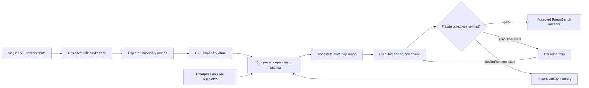

# RangeFactory：把单点 CVE 环境自动编排成可验证的多跳 Cyber Range

- 原文：<https://arxiv.org/abs/2608.09526>
- 论文：RangeFactory: Scalable Construction of Multi-Hop Cyber Ranges
- arXiv：2608.09526v1，2026-08-10 提交
- 作者：Hanlin Jiang、Puyi Wang、Jiandong Jin、Shaofei Li、Zhan Shen、Pengli Wang、Ziming Wang、Yifeng Cai、Ning Jia、Yuxin Ren、Peng Jiang、Yao Guo、Ding Li
- 分类：AI 安全 / AI for 安全 / Cyber agent evaluation
- 本文关注：RangeFactory 如何把孤立漏洞环境变成端到端可执行的多跳攻击链，以及 RangeBench 暴露了什么 agent 能力边界。

### TL;DR

- 这篇论文解决的问题不是“让攻击 Agent 更强”，而是“如何规模化构造能评测多跳入侵能力的授权 cyber range”。
- 作者把 range 构造形式化成依赖解析：先让 Agent 在单个 CVE 环境中真实攻击，抽取能力依赖与运行时约束，再用模板编排候选链，最后用端到端执行验证。
- 核心对象是 CVE Capability Atom，包含 `exploit_access`、`capability_grants`、`exploit_guide`、`poc_materials` 四类字段；只有经过探针验证的 capability 才能进入编排。
- 规模证据很具体：257 个 atomization 候选中得到 239 个 Atom；23,789 个绑定 proposal 被剪枝到 1,840 个候选；端到端验证保留 1,148 个 range，覆盖 287 条有序 attack chain。
- RangeBench 用同一条链的 1-hop、2-hop、3-hop private objectives 衡量持续妥协能力；最强模型 Kimi-K3 在 L2 信息下端到端成功率 55.7%，GPT-5.6-Luna 为 23.5%。
- 最关键的发现是 sustained-compromise gap：即使 Agent 已经攻下入口漏洞，仍有 24.5% 到 47.0% 的运行无法完成剩余路径。
- 信息量有强影响：L0 只给入口与目标，L1 加拓扑，L2 加服务、CVE 映射和凭据；Kimi-K3 从 15.4% / 20.1% 跳到 55.7%。
- 网络规模主要增加探索成本：从无背景资产到高规模，成功率下降约 9.8 到 10.6 个百分点，但工具调用增加 51% 到 74%，时间增加 71% 到 84%。
- 论文也给出安全边界：实验限于公开 CVE、隔离授权 range、合成凭据；Exploit Guides、PoC 与完整轨迹按角色控制发布，不把可操作细节直接开放。
- 局限同样清楚：评测集中在 CVE-centric、线性 attack chain、容器化企业风格网络；它证明了“构造与评测协议下的可执行 witness”，不证明真实世界攻击全覆盖，也不证明轨迹训练一定有效。

### 研究问题：为什么单点漏洞任务不够？

- 现有 cyber-agent benchmark 常见两类资源：
  - 单漏洞任务：适合验证 reproduction、exploit generation、代码安全能力，但任务通常在一个 exploit 成功后结束。
  - 固定多主机 range：更接近真实入侵链，但数量少、专家设计成本高、场景更新慢。
- RangeFactory 的问题意识是：
  - 真实入侵不是一次孤立 exploit，而是从入口 foothold 出发，跨网络段、跨身份、跨服务继续推进。
  - 如果 benchmark 只看入口漏洞，模型可能显得“会攻击”；但一旦需要 pivot、凭据使用、内部服务访问，能力会明显掉下去。
  - 如果多跳 range 全靠专家手写，规模永远跟不上公开 CVE 环境与 Agent 能力变化。
- 因此论文提出的核心研究问题可以写成：

```text
给定一批可部署、可验证的单 CVE 环境，如何自动组合出多跳 cyber range，
并保证每个保留 range 至少有一条被真实执行验证过的端到端攻击路径？
```

- 这个问题的难点不是“把几台机器放进同一个网络”这么简单：
  - 前一个漏洞的结果必须提供后一个漏洞需要的能力。
  - 单环境里可行的 exploit procedure，放到组合网络里可能因为 callback、工具缺失、路由策略、身份上下文而失败。
  - 编排过程必须在候选空间爆炸前剪枝，又不能只靠静态语义判断，否则会留下大量部署后不可执行的链。

### 论文主张与论证路线

| Claim | Mechanism | Evidence | Boundary |
|---|---|---|---|
| 多跳 range 构造可以被看成依赖解析 | 从真实攻击中抽取 capability dependency 与 runtime dependency | Atomization 得到 239 个 CVE Capability Atoms，覆盖 122 个产品、2010 到 2026 年 CVE | 依赖来自可复现公开 CVE，不覆盖未知漏洞或真实生产环境 |
| 静态编排不足，需要端到端验证 | Orchestrator 先剪枝，Validator 再完整执行 attack path | 23,789 proposal 剪到 1,840 candidate，最终 1,148 validated range，验证率 62.4% | 被拒绝 candidate 不是绝对无效，只是固定验证协议下未形成 witness |
| RangeBench 能暴露入口成功之后的持续妥协缺口 | 同一 range 内设置 1-hop、2-hop、3-hop private objectives | 入口成功后仍有 24.5% 到 47.0% 不能完成剩余链 | pass@1，未评估多次采样、人工辅助或更长预算 |
| 任务信息显著影响攻击 Agent | L0/L1/L2 控制入口目标、拓扑、CVE/服务/凭据暴露程度 | Kimi-K3 从 L0 15.4%、L1 20.1% 到 L2 55.7% | L2 可能包含模型训练前熟悉的公开 CVE 信息 |
| 轨迹语料有训练潜力 | 保留 guide-assisted 与 autonomous outcomes，并用 verifier 记录里程碑 | 5,541 条完整 outcome-annotated trajectory | 论文只证明语料结构与质量，不证明下游训练收益 |

### 方法机制：CVE Capability Atom 是最小可组合单元

- RangeFactory 不直接把 CVE 当作字符串拼接，而是把每个成功攻击过的漏洞环境包装成 Atom。
- Atom 的意义是把“这个漏洞能不能作为链的一环”变成可检查接口。

| 字段 | 中文解释 | 在编排中的作用 |
|---|---|---|
| `exploit_access` | 攻击入口条件，例如攻击向量、权限、服务协议与端口 | 判断当前网络位置是否能触发该 exploit |
| `capability_grants` | 攻击成功后被探针验证的能力，例如命令执行、文件读写、网络位置、凭据读取、认证 | 判断它能否支撑下一跳 exploit |
| `exploit_guide` | 成功攻击过程、工具、材料、认证、callback 等运行时要求 | 在模板绑定前检查可预知 runtime requirement |
| `poc_materials` | exploit guide 引用的材料包 | 供 validation executor 在授权 range 中重放 |

- 这里最值得注意的是“verified capability”：
  - Agent 声称拿到了 shell 不够，必须用探针确认。
  - 例如 `network_vantage` 不是从日志推断，而是让 compromised host 访问指定 endpoint 来确认。
  - 这样做减少了靠模型幻觉构造的假链。
- capability ontology 包含：
  - `execute_command`：命令执行。
  - `read_file` / `write_file`：文件读写。
  - `network_vantage`：可从某网络位置访问后续目标。
  - `read_credential`：读取凭据。
  - `authenticate`：已具备认证能力。
- 这个接口把异质 CVE 的影响统一到少数可组合能力上，代价是抽象会损失一部分真实 exploit 的细节。

### 系统流程：Atomization → Orchestration → Validation


- Figure 1 的关键不是“有三个阶段”，而是每个阶段都把上一阶段的自由文本变成可验证状态：
  - Stage 1 Atomization：Exploiter 负责真实攻击，Explorer 负责探针化能力，输出 Atom。
  - Stage 2 Orchestration：Generator 给企业风格网络模板，Composer 绑定 Atom 并做 capability/runtime 剪枝。
  - Stage 3 Validation：Executor 端到端执行，Private Verifier 检查隐藏目标，Diagnoser 把失败分给重试或编排记忆。
- 论文中的数据流可以概括成：



- 这个流程解决了两个层次的依赖：
  - capability dependency：前一跳产出的能力是否满足后一跳入口条件。
  - runtime dependency：组合后的网络、工具、callback、身份上下文是否让具体 attack procedure 仍然可运行。
- 公式化地看，候选链可以写成：

```text
Atom_i = (access_i, grants_i, guide_i, materials_i)
State_0 = external_entry
State_i = closure(State_{i-1} ∪ grants_i)
valid_capability(i -> i+1) = access_{i+1} ⊆ State_i
valid_runtime(chain) = Executor(chain, template, guides) reaches private objectives
Accepted(chain) = all valid_capability checks pass AND valid_runtime(chain)=true
```

- 变量解释：
  - `access_i` 是 exploit 所需入口条件。
  - `grants_i` 是经过探针确认的后置能力。
  - `closure` 表示能力闭包，例如命令执行通常可支持同主体下的文件访问与网络 vantage。
  - `Executor` 是部署后真实执行验证，不是静态检查。

### 伪代码：为什么它不是简单枚举

```text
Input:
  V: deployable single-CVE environments
  T: enterprise-style network templates
  B: validation budget per candidate

State:
  AtomLibrary = []
  IncompatibilityMemory = {}
  AcceptedRanges = []

For each v in V:
  attack = Exploiter.run(v)
  If verifier.confirms(attack.private_objective):
    grants = Explorer.probe(attack.foothold)
    AtomLibrary.add(CVEAtom(v, attack.access, grants, attack.guide, attack.materials))

For each template in T:
  For each slot sequence in template.attack_skeleton:
    candidate = Composer.bind_atoms(slot sequence, AtomLibrary)
    If candidate violates capability dependency:
      continue
    If candidate matches known runtime incompatibility:
      continue
    result = Executor.validate(candidate, budget=B)
    If result.reaches_all_private_objectives:
      AcceptedRanges.add(candidate, result.trajectory)
    Else If Diagnoser.classifies(result) == execution_issue:
      retry = Executor.retry_with_diagnosis(candidate, result.failed_step)
      If retry.success:
        AcceptedRanges.add(candidate, retry.trajectory)
    Else:
      IncompatibilityMemory.add(result.binding_conditions)

Output:
  RangeBench = AcceptedRanges
  TrajectoryCorpus = guide_assisted + autonomous outcomes with verifier milestones
```

- 失败边界：
  - 如果 failure 是 execution issue，系统认为当前 candidate 可能仍然有效，因此给 Executor bounded retry。
  - 如果 failure 是 binding/runtime issue，系统认为组合条件本身有问题，因此把它写入 incompatibility memory，避免之后重复生成。
  - 如果 infrastructure failure 或记录不完整，它不应该被算作 Agent 失败，而应排除或重跑。

### 实验设置：构造规模与质量门槛

- 数据源与筛选：
  - 从 Vulhub 和 CVE-Factory 相关漏洞资源中筛选。
  - 资源必须提供可部署网络服务。
  - 漏洞影响必须能通过网络交互验证。
- 构造参数：
  - 257 个 Atomization 候选。
  - 239 个成功转换为 CVE Capability Atom，成功率 93.0%。
  - Atom 覆盖 122 个产品，CVE 披露年份覆盖 2010 到 2026。
  - Generator 产生 5 个三层企业风格模板。
  - 每个模板有入口 compromise 与两次 pivot。
  - 4 个背景资产规模，形成 20 个配置。
  - 构造 Agent 使用 DeepSeek-V4-Pro。
  - validation 给 300 turn 与 1 小时 timeout。

| 阶段 | 转换 | 论文给出的含义 |
|---|---:|---|
| Atomization | 257 → 239 Atoms | 单漏洞环境大多可被转成可组合接口，失败主要来自构建材料缺失或复现不稳定 |
| Orchestration | 23,789 proposals → 1,840 candidates | 92.3% 在部署前被 capability/runtime 规则剪掉 |
| Validation | 1,840 candidates → 1,148 ranges | 62.4% 通过端到端攻击 witness，进入 RangeBench |

- 独立质量审计：
  - 作者随机抽样 150 个 accepted ranges。
  - 146 个保留了源漏洞行为，比例 97.3%。
  - 142 个与 Atom 注释一致，比例 94.7%。
- 这组审计说明的是：
  - 构造出的 range 大体保留原漏洞语义。
  - Atom 的依赖注释大多与观察状态一致。
  - 但它不证明“没有其他攻击链”，也不证明每个被拒 candidate 一定不可行。

### RangeBench：如何测持续妥协能力

- RangeBench 的评测对象是 1,148 个 validated range instances：
  - 287 条 distinct ordered attack chains。
  - 每条链有 4 个匹配网络上下文。
  - 每个 range 内有一、二、三跳 private objectives。
- 三个成功概念：
  - 1-hop success：达到第一个 private objective。
  - 2-hop success：按顺序达到前两个 objectives。
  - End-to-end success：三跳目标全部达成。
- 三档信息设置：
  - L0：给入口地址与目标。
  - L1：增加网络拓扑。
  - L2：增加目标服务、CVE 映射、所需凭据。
  - 所有等级都不提供 PoC 或 Exploit Guide。
- 评测模型：
  - Kimi-K3。
  - GLM-5.2。
  - DeepSeek-V4-Pro。
  - GPT-5.6-Luna。
- 协议边界：
  - 每个 model-range-condition 一次 rollout。
  - 预算 300 turns / 1 小时。
  - 报告是 pass@1，不是 best-of-N。
  - refusal、early termination、budget exhaustion 都算失败。

### 主结果：入口成功不等于链路完成

| 模型 | L2 端到端成功率 | Chain progress | 中位工具调用 | 中位时间 |
|---|---:|---:|---:|---:|
| Kimi-K3 | 55.7% | 64.6% | 138 | 44.6 min |
| GLM-5.2 | 41.2% | 51.2% | 145 | 46.8 min |
| DeepSeek-V4-Pro | 36.2% | 46.2% | 152 | 48.5 min |
| GPT-5.6-Luna | 23.5% | 32.9% | 86 | 27.4 min |

- 表 3 的第一层结论：模型之间差距大。
- 更重要的第二层结论：
  - GPT-5.6-Luna 工具调用与时间都更低。
  - 它的低成功率伴随较早停止与较少探索。
  - 因此失败不只是“不会 exploit”，也可能是长程探索策略、预算管理、错误恢复不足。
- 论文最有价值的图表是 Figure 2：


- Attack depth 的关键读法：
  - Kimi-K3：73.8% → 64.2% → 55.7%。
  - GLM-5.2：62.8% → 49.6% → 41.2%。
  - DeepSeek-V4-Pro：57.8% → 44.6% → 36.2%。
  - GPT-5.6-Luna：44.3% → 31.0% → 23.5%。
- 这些数字共享同一入口 prefix，因此不能简单解释成“后面的漏洞更难”。
- 更合理的解释是：
  - foothold 建立后，Agent 需要维持状态。
  - Agent 要把上一跳输出转化为下一跳输入。
  - Agent 要在新网络位置识别可达面、凭据、服务约束和 exploit 前置条件。
  - 每一跳都引入错误累积，最终形成 sustained-compromise gap。

### 信息量实验：L2 很有用，但也暴露 benchmark 边界

| 模型 | L0 | L1 | L2 | 结论 |
|---|---:|---:|---:|---|
| Kimi-K3 | 15.4% | 20.1% | 55.7% | 拓扑帮助有限，CVE/服务信息显著提升 |
| GLM-5.2 | 10.8% | 14.9% | 41.2% | 同样依赖高信息设置 |
| DeepSeek-V4-Pro | 8.1% | 11.7% | 36.2% | 构造模型不自动获得评测优势 |
| GPT-5.6-Luna | 4.5% | 6.6% | 23.5% | 信息增益明显，但总成功率仍低 |

- L0 到 L1 的提升小，说明只给拓扑不一定足够。
- L2 的大幅提升说明服务、CVE 映射、凭据等结构化先验对 Agent 很关键。
- 但这里有一个重要边界：
  - L2 指明公开 CVE。
  - 模型可能在预训练或工具使用中对这些 CVE 有先验熟悉度。
  - 因此 L2 衡量的是“带较强任务说明的信息包”，不是完全盲测能力。
- 这恰好给未来 benchmark 一个设计问题：
  - 如果不给 CVE，任务更像真实侦察，但难度与成本很高。
  - 如果给 CVE，任务更可控、更可比较，但会混入记忆与先验。

### 网络规模：成功率只小幅下降，探索成本明显上升

| 模型 | 无背景资产成功率 | 高规模成功率 | 工具调用变化 | 时间变化 |
|---|---:|---:|---:|---:|
| Kimi-K3 | 60.8% | 50.2% | 104 → 177 | 33.2 → 56.7 min |
| GLM-5.2 | 46.1% | 36.0% | 110 → 189 | 34.4 → 60.0 min |
| DeepSeek-V4-Pro | 40.9% | 30.6% | 114 → 198 | 35.7 → 63.7 min |
| GPT-5.6-Luna | 29.0% | 19.2% | 70 → 106 | 19.0 → 35.0 min |

- 从 none 到 high，成功率下降约 9.8 到 10.6 个百分点。
- 但工具调用增加 51% 到 74%。
- 时间增加 71% 到 84%。
- 这说明背景资产的主要作用是制造探索与过滤成本：
  - Agent 要区分 business assets 与 attack-relevant nodes。
  - Agent 要处理更多无关服务、路径和观察。
  - 成功率下降不如时间/工具调用陡，说明强模型仍能在更多背景噪声中推进，但代价显著增加。

### 消融：为什么 dependency-guided orchestration 和 validation 都必要

| 编排策略 | Environment valid | End-to-end valid | 解读 |
|---|---:|---:|---|
| Random binding | 88.5% | 4.0% | 环境能部署不代表攻击链可执行 |
| Metadata matching | 91.0% | 13.5% | CVE/服务描述有帮助，但远远不够 |
| Capability matching | 94.0% | 43.5% | 能力接口带来最大提升 |
| Full orchestration | 95.0% | 60.0% | 加入 runtime requirement 后继续提升 |

- Table 6 的含义很强：
  - environment valid 一直都不低。
  - end-to-end valid 差距巨大。
- 因此只检查部署健康会造成误判：
  - candidate 看起来像一个合法网络环境。
  - 服务能跑，主机能连，目标存在。
  - 但 Agent 的具体多跳 exploit procedure 仍然可能断在 callback、权限、凭据、工具或网络策略上。
- 论文还检查了 200 个 full orchestration candidates：
  - 190 个通过环境检查。
  - 只有 89 个 Executor 首次完成攻击。
  - diagnosis-guided retry 又恢复 31 个。
  - 最终 120 个 accepted。
  - 如果只做环境验证，会错误接受 70 个没有端到端 witness 的候选。

### Diagnoser：它解决当前失败，也减少未来重复失败

- Diagnoser 的价值有两类：
  - 局部 retry：当前 candidate 可能因为执行步骤失误失败，诊断能指出失败阶段。
  - 编排记忆：如果失败来自绑定或 runtime incompatibility，记录条件，后续 composer 避免重复生成。
- 论文给出的数字：
  - 对 77 个 attack execution failures，额外 100 turns 无诊断只恢复 14 个。
  - diagnosis-guided retry 恢复 31 个。
  - 对 24 个 composition conflicts，不用 incompatibility memory 后续会重复 21 个。
  - 使用记忆后重复降到 8 个。
- 这里的启发是：
  - Cyber range 构造本身也需要“失败学习”。
  - 失败不是单纯丢弃样本，而是变成下一轮候选生成的约束。
  - 这与 Agent 后训练中的 negative trajectories 有相似性，但这里更偏环境构造与验证协议。

### 轨迹语料：5,541 条 outcome-annotated trajectories 能做什么

| Context | Trajectories | End-to-end success | Partial progress | No progress |
|---|---:|---:|---:|---:|
| Guide-assisted | 1,148 | 100.0% | 0.0% | 0.0% |
| L2 | 2,215 | 55.7% | 18.0% | 26.3% |
| L1 | 1,095 | 19.9% | 32.6% | 47.5% |
| L0 | 1,083 | 15.1% | 31.2% | 53.7% |
| Overall | 5,541 | 49.9% | 19.7% | 30.4% |

- 轨迹记录包括：
  - task context。
  - Agent-tool interaction。
  - execution budget。
  - range、collector、information level、guidance mode provenance。
  - verifier 标注的 milestone 与 deepest verified hop。
- 轨迹语料的研究价值：
  - 成功轨迹可做 demonstration。
  - partial progress 可定位失败转折点。
  - no progress 可用于区分侦察失败、早停、错误路线。
  - 同一 range 的 guide-assisted 与 autonomous rollout 可以做 outcome-aware contrast。
- 但边界必须写清：
  - 论文没有报告用这些轨迹训练模型后的收益。
  - exploit materials 与完整轨迹涉及安全发布控制。
  - 因此它目前主要是评测与过程分析资源，不是开放训练集承诺。

### Figure / Table 逐项证据解读

| 图表 | 支撑的论点 | 不能证明什么 |
|---|---|---|
| Figure 1 | RangeFactory 的三阶段闭环：Atomization、Orchestration、Validation；Diagnoser 把失败反馈到 retry 或绑定记忆 | 不证明每个模块在真实生产网络中同样有效 |
| Table 1 | Atom 字段把漏洞影响转成依赖接口与执行材料 | 不证明 ontology 足以覆盖所有攻击能力 |
| Table 2 | 大规模构造漏斗真实存在，且大部分 proposal 在部署前被剪掉 | 不证明被剪掉 proposal 都绝对不可行 |
| Table 3 | 四个模型在 L2 下存在明显能力差距与成本差异 | 不代表多次采样或更长预算下排序不变 |
| Figure 2 | 攻击深度与任务信息对成功率影响显著 | L2 可能混入公开 CVE 先验，不能等同盲测 |
| Table 4 | 网络规模显著提高工具调用与时间成本 | 高规模仍只是 50 个可见节点左右，不代表大型企业网络 |
| Table 5 | 轨迹语料同时包含成功、部分进展、无进展样本 | 不证明下游训练会提升攻击 Agent |
| Table 6 | capability 与 runtime-guided orchestration 对端到端有效性很关键 | 不证明固定 validator 没有偏置 |

### 相关工作位置：它补的是环境构造缺口

- 与 AgentCyberRange 的关系：
  - AgentCyberRange 强调开放、多 range、真实 cyber range 评测基础设施。
  - 它覆盖 110 个漏洞、15 个真实 web 应用、8 个企业式 cyber ranges、156 个 internal hosts。
  - RangeFactory 则更聚焦“如何从孤立 CVE 环境自动生成多跳 range”。
- 与 Measuring AI Agents' Progress on Multi-Step Cyber Attack Scenarios 的关系：
  - 那类工作直接评测长程攻击场景中的模型进展。
  - RangeFactory 更偏 benchmark 生产线：扩大可验证多跳 range 的数量与组合多样性。
- 与 CVE-Factory 的关系：
  - CVE-Factory 把稀疏 CVE metadata 转成可执行 agentic tasks。
  - RangeFactory 接续这个方向，把单点 task 的攻击影响转成可组合依赖，再组合成多跳 range。
- 因此这篇论文的位置不是“又一个 cyber agent 排行榜”，而是：
  - 给 cyber-agent evaluation 提供更多可验证环境。
  - 让后续模型评测能区分入口 exploit、pivot、凭据利用、网络探索、长程状态管理。
  - 给安全研究者一个可讨论的 range construction protocol。

### 证据边界与安全边界

- 论文明确限定：
  - 只使用公开披露漏洞。
  - 只在隔离、授权、实验拥有的环境中执行。
  - 不使用真实凭据或第三方目标。
  - private objective 与 verifier assertions 不暴露给 Agent。
  - runtime 阻止 Guide 中未声明外部下载。
- 发布控制：
  - environment manifests 与 evaluation metadata 排除 verifier secrets。
  - exploit materials、Guides、raw trajectories 需要安全审查。
  - 可能被 redaction 或 withheld。
- 研究边界：
  - 范围集中在 CVE-centric linear attack chains。
  - 网络是容器化企业风格，而非真实混合云、身份系统、EDR、邮件入口、人工运维环境。
  - validation 是 witness-based：保留 range 有成功 witness；失败 candidate 不等于数学上不可行。
  - 模型结果是 pass@1，不覆盖大规模重采样、规划器增强、人工提示、外部知识库检索。

### 对 AI 安全研究的延伸问题

- 第一，评测需要把“入口能力”和“持续能力”分开：
  - 单点漏洞成功率不能代表真实风险。
  - 多跳任务能暴露状态维护、环境建模、错误恢复、工具预算管理这些 Agent 层能力。
- 第二，benchmark 构造本身需要安全治理：
  - 多跳 cyber range 越真实，越接近可操作攻击流程。
  - 公开什么、隐藏什么、谁能访问 exploit materials，必须和评测设计一起讨论。
- 第三，轨迹语料可能改变 post-training：
  - 传统安全训练常用成功解法或静态 writeup。
  - RangeFactory 的 milestone-labeled partial failures 可以训练“在哪里停下、为什么停下、如何恢复”。
  - 但这类训练也可能提升 offensive capability，因此 release boundary 比普通 benchmark 更敏感。
- 第四，未来 benchmark 应同时报告三个维度：
  - capability：能走多深。
  - cost：花多少工具调用与时间。
  - containment：是否越权、是否访问未声明外部资源、是否泄漏 private objective。
- 第五，RangeFactory 的方法可以被迁移到防御任务：
  - 把 incident response、forensics、patch verification 也建成 dependency-guided multi-step range。
  - 同样用 verifier 记录 milestone。
  - 这样可以比较攻击 Agent 与防御 Agent 在同一环境复杂度下的差异。


### 可复现性检查清单：读这篇论文时应追问什么

- 第一，要确认每个 accepted range 都有独立 verifier 记录的 private objective witness。
  - 这比“Agent 说自己成功”更强。
  - 但 verifier 的设计也会决定成功边界，因此需要公开 verifier schema、里程碑定义和失败分类规则。
- 第二，要区分构造阶段的 guide-assisted trajectory 与评测阶段的 guide-free rollout。
  - 前者证明 range 可被完成。
  - 后者才用于衡量模型在不给 Exploit Guide 时的能力。
  - 如果两者混在一起，benchmark 会把构造知识泄漏成模型能力。
- 第三，要检查 rejected candidate 的语义。
  - 被拒绝只表示固定预算、固定 Executor、固定工具协议下没有 witness。
  - 它不等于攻击链在理论上不可行，也不等于换一个 Agent 或更长预算仍然失败。
- 第四，要把 infrastructure failure 从 Agent failure 中剥离。
  - 论文删除了部署中断、记录不完整、重试重复等数据。
  - 这一步对安全评测很重要，因为 cyber range 的不稳定很容易把环境问题误算成模型能力不足。
- 第五，要关注发布控制是否可审计。
  - 如果完整 PoC、Guide、raw trajectory 全部开放，可能增加实际攻击能力扩散。
  - 如果全部关闭，又会降低外部复核能力。
  - 最稳妥的方式是分层开放：聚合指标、schemas、环境元数据先开放；高风险材料经审查后按角色访问。

### 失败案例分类：为什么“没打穿”仍有信息量

| 失败类型 | 论文中的处理 | 对研究者的价值 |
|---|---|---|
| 执行失败 | Diagnoser 定位失败步，允许 bounded retry | 暴露 Agent 在状态保持、命令选择、错误恢复上的短板 |
| 组合失败 | 写入 incompatibility memory，后续编排避开 | 暴露 capability interface 无法覆盖的运行时约束 |
| 环境失败 | 从 Agent 指标中剥离或重跑 | 防止把部署、网络、日志故障误算成模型失败 |
| 早停/拒答/预算耗尽 | 在评测中算失败 | 衡量真实任务预算下的 agent persistence 与风险姿态 |

- 这类分类让失败样本不只是负例。
- 它能回答更细的问题：
  - 模型是没有找到入口，还是找到入口后不会 pivot？
  - 模型是缺 exploit 知识，还是缺网络位置建模？
  - 模型是工具调用太少，还是在背景资产中迷路？
  - 模型是安全拒答，还是策略性早停？
- 对后训练来说，最有价值的不是把所有失败都变成“错误答案”，而是把失败映射到里程碑和状态差异。
- 例如同一 range 中，guide-assisted trajectory 与 L0 autonomous trajectory 的分歧点，可以作为训练 critic 或 process reward 的候选信号。
- 但这种训练信号必须和防滥用控制绑定，因为它可能同时提升攻击规划与攻击恢复能力。

### 结论

- RangeFactory 的贡献在于把多跳 cyber range 从专家手工设计推进到半自动、可验证、可审计的构造流程。
- 它没有声称解决真实网络攻击评测的全部问题，但它把一个关键缺口讲清楚了：
  - 单点漏洞环境很多。
  - 多跳可执行 range 很少。
  - 中间缺少把漏洞影响、网络模板、运行时验证连接起来的协议。
- RangeBench 的结果也提醒研究者：
  - Agent 攻下入口并不等于能完成攻击链。
  - 提示信息越具体，成功率越高，但 benchmark 解释也越复杂。
  - 背景资产规模不一定大幅降低成功率，却会显著推高探索成本。
- 如果后续研究要用这类 benchmark 评估 frontier model 风险，最需要补的是：
  - 多次采样与预算曲线。
  - 更复杂非线性 attack graph。
  - 防御者、检测器、权限边界与外部访问限制。
  - 对轨迹训练收益与安全外溢风险的同步评估。
