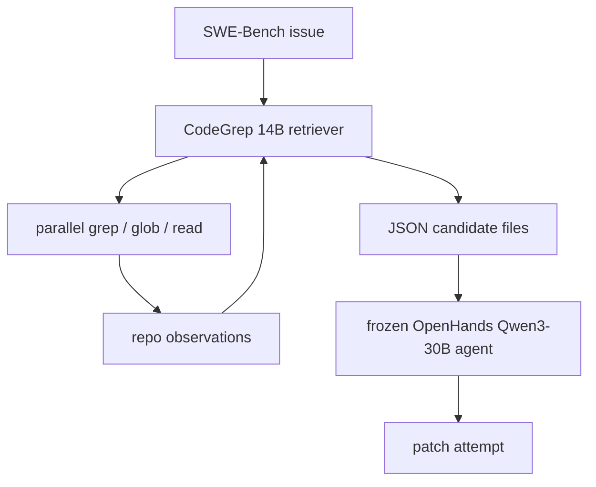

# CodeGrep：把 coding agent 的“找文件”阶段单独训练成一个 RL 检索代理

## 元信息

| 项目 | 内容 |
|---|---|
| 论文 | CodeGrep: An RL-Trained Retrieval Agent for LLM Coding Agents |
| 作者 | Wuya Chen, Yihao Yang, Yang Cao, Yue Lin |
| 机构 | Netease Guangzhou AI Lab；Independent Researcher |
| 时间 | arXiv v1，2026-08-06 11:07:42 UTC |
| 链接 | <https://arxiv.org/abs/2608.05886v1> |
| 方向 | 大模型 Agent / coding agent / tool-use RL |

## TL;DR

1. **这篇论文解决的问题很窄，但很关键**：coding agent 在真正改代码前，常把大量 token 和轮次花在 `grep`、`glob`、`view_file` 这类仓库探索上；作者把“找相关文件”从主 coding agent 中拆出来，训练一个 14B 的专用检索代理 CodeGrep。

2. **方法上，它不是静态 embedding retriever**：CodeGrep 基于 Qwen3-14B-Instruct，用 GRPO 训练，最多 4 轮，每轮最多并行 8 个只读工具调用，工具包括 `grep`、`glob`、`read`，最终只输出候选文件 JSON，交给冻结的 OpenHands 主代理。

3. **训练数据来自行为轨迹挖掘**：作者从 67,074 条开源 OpenHands 轨迹中挖出文件阅读行为，用 CATM 判断“某文件是否被过去 agent 读过并产生了有内容的后续推理”，保留 31,977 个有效训练样本，避免只用 gold patch 文件导致监督过窄。

4. **核心数字不是大幅提高解决率，而是降低成本**：在全部 500 个 SWE-Bench Verified 实例上，基线 OpenHands 为 25.8% resolve；CodeGrep v3 注入后为 27.0%，提升 +1.2 个百分点；已解决实例的平均轮次从 23.0 降到 19.6，token 从 631K 降到 514K。

5. **论文最有价值的结论是“精度阈值”**：BM25 文件精度 0.375 会伤害下游，Jina-1.5B 精度 0.445 基本中性，CodeGrep v3 精度 0.677 才进入节省 rollout 成本的区间；也就是说，低质量上下文不是“聊胜于无”，而可能污染主代理。

6. **奖励设计的教训很具体**：把效率惩罚乘在 reward 层会让 GRPO KL 漂移到约 0.31；挪到 advantage 层后 KL 降到约 0.09；再删除下游不用的 line-range 奖励，v3 才同时获得更短 rollout、更高 reward 和更低 token。

7. **局限同样明确**：论文承诺会发布模型、训练管线、RL 环境和评测 harness，但当前 arXiv 页面未给出已公开代码；评测只覆盖一个 OpenHands + Qwen3-30B 下游栈，精度阈值是否迁移到 Claude Code、Cursor、Devin 或真实企业仓库仍未证明。

## 研究问题：为什么“找文件”值得单独训练？

### 论文关心的不是“模型会不会写补丁”

作者把 coding agent 的失败拆成两段：

1. **定位阶段**：
   - agent 读 issue；
   - 用 `grep`、`glob`、`view_file` 猜测相关模块；
   - 在错误路径上反复搜索；
   - 把大量无关文件塞进上下文。

2. **修复阶段**：
   - agent 已经接近相关文件；
   - 推断 bug 机制；
   - 修改代码；
   - 跑测试或结束。

论文的判断是：许多系统把这两段混在一个大 agent 里做，但第一段有更清晰的动作空间、奖励信号和可隔离评测。因此，CodeGrep 不是要替代 OpenHands，而是作为一个**前置检索子代理**，把主代理带到更好的起点。

### 作者为什么不用普通 RAG？

论文把 BM25 和 Jina-1.5B 当作对照，背后的问题是：

| 检索方式 | 优点 | 在 coding agent 场景中的问题 |
|---|---|---|
| BM25 | 快、简单、可复现 | issue 里的词不一定出现在真正修复文件里；错误关键词会把 agent 带偏 |
| Dense embedding | 能处理语义相似 | 仍是单轮静态匹配，不会像开发者一样顺着调用链追踪 |
| Agentic retrieval | 能多轮读代码、改查询 | 如果用主 agent 做，轮次慢、token 贵、上下文污染严重 |
| CodeGrep | 只负责多轮并行找文件 | 训练和运行复杂；当前 release 尚未落地 |

这个定位很重要：论文并不声称“代码检索只要上 RL 就能解决”，而是说**当检索结果要直接注入主代理上下文时，precision 比 recall 更要命**。

## 论文主张与论证路线

| Claim | Mechanism | Evidence | Boundary |
|---|---|---|---|
| coding agent 的探索前缀浪费严重 | 把文件定位拆成独立子代理，先产出候选文件 | 基线 OpenHands 已解决实例平均 23.0 轮、631K token | 只在 SWE-Bench Verified + OpenHands 栈中量化 |
| agentic retriever 比 BM25/Jina 更适合仓库搜索 | CodeGrep 多轮并行调用 `grep/glob/read`，可根据观察改写查询 | CodeGrep v3 file precision 0.677，高于 BM25 0.375、Jina 0.445 | 还未证明在非 Python 仓库、超大 monorepo、闭源代码中同样成立 |
| 下游收益取决于 precision threshold | 低精度候选污染上下文，高精度候选压缩探索 | BM25 使 resolve 降到 25.2%，token 升到 763K；CodeGrep v3 为 27.0%、514K | 阈值区间 0.45 到 0.68 是经验观察，不是理论定理 |
| 效率信号应放在 advantage 层 | 保留原始 reward 的组内排序，只缩放 rollout 梯度贡献 | v1 KL 到约 0.31；v2/v3 分别约 0.09/0.15 | 结论依赖 GRPO 训练设置和作者的工具预算 |
| line-range 奖励会成为噪声 | OpenHands 下游只消费文件路径，不消费 line ranges | v3 删除 line-range 后 reward 约 0.60-0.65，turn 稳定到约 2.1 | 如果下游编辑器真正消费行号，这个判断可能改变 |

## 方法机制：CodeGrep 到底做了什么？

### 推理时的数据流



这个结构的关键是**解耦**：

1. CodeGrep 被训练；
2. OpenHands 主代理冻结；
3. 注入内容只是一组候选文件；
4. 下游 resolve、rounds、tokens 的变化可以归因到检索前缀。

### 工具接口为什么要限制？

CodeGrep 的动作空间很克制：

1. `grep`：正则搜索；
2. `glob`：路径匹配；
3. `read`：读取文件内容；
4. 每轮最多 8 个并行调用；
5. 最多 4 轮，其中 3 轮探索、1 轮回答；
6. 最终答案是固定 JSON：

```json
{
  "files": ["path/to/file.py"],
  "line_ranges": []
}
```

这套限制让任务从“通用 coding”变成“只读检索”。它的好处是奖励更清楚，风险更低；代价是它不会给出 patch，也不会替主代理做语义修复。

### RL 环境为什么不用 Docker？

论文指出，如果为了每个 SWE-Bench 任务启动官方 Docker image：

1. 单个 image 可能 1-3GB；
2. 拉取需要分钟级；
3. 数千个 repo/commit 会消耗 TB 级磁盘；
4. 但检索训练只需要读代码，不需要运行 Python 依赖。

作者改用 Git worktree 沙箱：

| 层 | 做法 | 作用 |
|---|---|---|
| Layer 1 | 抽取唯一 `(repo, commit)` 对 | 去掉重复环境构建 |
| Layer 2 | 一个 bare repo 共享 `.git` 对象库 | 把 `N * repo_size` 降为 `repo_size + N * worktree_size` |
| Layer 3 | 在 worktree 内执行只读工具 | 毫秒级准备 rollout，适合单节点 RL |

安全边界也很工程化：

1. 路径规范化，拒绝逃逸 repo root；
2. 全局并发上限 64；
3. `grep/glob` 10 秒超时，`read` 5 秒超时；
4. 工具输出截断到 4096 字符；
5. `grep` 最多 50 个匹配，`read` 最多 200 行。

## 训练数据：CATM 为什么比 gold patch 更合适？

### gold patch 文件不是完整监督

如果只把最终补丁修改过的文件当作正例，会漏掉很多“必须读但不必改”的文件：

1. API 定义文件；
2. 调用链上的辅助模块；
3. 失败测试旁边的 fixture；
4. 迁移、配置或注册入口；
5. 只用于理解边界条件的文件。

因此，作者提出 CATM：Code Agent Trajectory Mining。

### CATM 三阶段

| 阶段 | 输入 | 处理 | 输出 |
|---|---|---|---|
| Stage 1 mining | 67,074 条 OpenHands 轨迹 | 抽取 `view` 文件阅读调用，记录后续 assistant reasoning | 候选文件及后续推理长度 |
| Stage 2 judge filtering | 文件路径、任务、后续推理 | GLM-5.1-FP8 判断 RELEVANT / NOT_RELEVANT | 保守过滤后的相关文件 |
| Stage 3 weighting | 推理长度 `l(f)` | 指数饱和权重，低于 0.15 丢弃 | 并入训练目标的 hard positive 文件 |

作者最终得到：

1. 原始轨迹：67,074；
2. 有效训练样本：31,977；
3. retention：47.7%；
4. judge 阶段约 5 小时；
5. 数据源覆盖 1,823 个 Python 仓库的开源 OpenHands 轨迹。

### 权重公式怎样理解？

论文给出文件级推理强度：

```text
w_tilde(f) = 1 - exp(-ln(2) * l(f) / beta)
w(f)       = w_tilde(f) / mu_raw
G(x)       = G_patch(x) union { f in L(x) : w(f) >= 0.15 }
```

变量解释：

| 变量 | 含义 |
|---|---|
| `l(f)` | agent 读完文件 `f` 后，下一条 reasoning 的 token 长度 |
| `beta` | 全局中位 reasoning 长度 |
| `mu_raw` | 未归一化权重均值 |
| `G_patch(x)` | SWE-Bench gold patch 涉及的文件 |
| `L(x)` | CATM 从轨迹中挖出的候选相关文件 |
| `G(x)` | 训练 reward 使用的最终目标文件集合 |

这个设计的直觉是：如果 agent 读完某文件后写出较长、较具体的推理，那么该文件更可能真参与了解题；但长度不能线性放大，所以用指数饱和函数。

## 奖励设计：v1 到 v3 的真正教训

### 基础 F-beta

论文使用 precision-biased F-beta，`beta=0.5`：

```text
F_beta = (1 + beta^2) * precision * recall / (beta^2 * precision + recall)
beta = 0.5
```

因为 `beta < 1`，precision 的权重更高。作者的理由很直接：

1. 多给一个错误文件，会污染主代理上下文；
2. 少给一个正确文件，主代理还有机会自己搜索回来；
3. 因此 false positive 的边际伤害可能高于 false negative。

### 三版 reward 的差别

| 版本 | Base score | 效率信号位置 | 失败或收益 |
|---|---|---|---|
| v1 | `(F_file + F_line_range) / 2` | reward 层乘工具调用惩罚 | KL 漂移到约 0.31，下游效率几乎不改善 |
| v2 | 同 v1 | advantage 层缩放 | KL 控制到约 0.09，但 completion length 一度冲到约 2000 token |
| v3 | 只保留 `F_file` | advantage 层缩放 | reward 更高，turn 稳定到约 2.1，下游 token 降 19% |

### 为什么 line-range 被删除？

这不是“行号无用”的一般结论，而是**接口匹配问题**：

1. OpenHands 下游编辑工具消费的是文件路径；
2. 它没有 `view_range` 这样的行范围输入；
3. CATM-only 文件天然没有 gold line range；
4. 因此 line-range 奖励会把优化能力拉向下游不用的维度。

如果另一个 coding agent 的编辑器明确消费行号，line-range 奖励可能重新变得有用。论文把这一点和 Cognition SWE-grep 做了对照：Cognition 博客保留 file + line retrieval 的 weighted F1，但具体数学细节没有完全公开。

## 实验设置与主结果

### 下游栈

| 项目 | 设置 |
|---|---|
| Benchmark | SWE-Bench Verified，500 instances |
| 主代理 | OpenHands |
| 主模型 | Qwen3-30B-A3B-Instruct-2507 |
| temperature | 0 |
| 最大轮次 | 100 |
| 对照 | Baseline、BM25 top-2、Jina-1.5B top-2、CodeGrep v1/v2/v3 |
| 关注指标 | resolve rate、已解决实例轮次、已解决实例 token、未解决实例轮次 |

### 检索质量结果

| Retriever | F-beta mean | F-beta median | Precision | Recall | F-beta >= 0.8 | Turns |
|---|---:|---:|---:|---:|---:|---:|
| BM25 | 0.359 | 0.455 | 0.375 | 0.386 | 7.0% | - |
| Jina-1.5B | 0.427 | 0.500 | 0.445 | 0.468 | 7.0% | - |
| CodeGrep v1 | 0.562 | 0.556 | 0.641 | 0.486 | 36.7% | 3.8 |
| CodeGrep v2 | 0.526 | 0.556 | 0.589 | 0.483 | 31.7% | 2.9 |
| CodeGrep v3 | 0.576 | 0.714 | 0.677 | 0.435 | 43.0% | 2.3 |

这里最值得看的是 precision：

1. BM25：0.375；
2. Jina：0.445；
3. CodeGrep v3：0.677。

CodeGrep v3 的 recall 不是最高，但 precision 最高。论文认为这正是下游注入场景所需要的形状。

### 下游结果

| Config | Resolve | 已解决轮次 | 已解决 token | 未解决轮次 |
|---|---:|---:|---:|---:|
| Baseline | 25.8% | 23.0 | 631K | 32.0 |
| BM25 | 25.2% | 22.9 | 763K | 29.7 |
| Jina-1.5B | 25.8% | 23.2 | 587K | 27.8 |
| CodeGrep v1 | 27.0% | 22.7 | 627K | 26.2 |
| CodeGrep v2 | 26.6% | 21.4 | 584K | 26.4 |
| CodeGrep v3 | 27.0% | 19.6 | 514K | 27.5 |

从结果看，CodeGrep 的收益不是“让大量新任务突然可解”，而是：

1. resolve 小幅提升：25.8% 到 27.0%；
2. 已解决任务更快：23.0 轮到 19.6 轮；
3. token 明显下降：631K 到 514K；
4. v1 和 v3 resolve 相同，但 v1 token 几乎不降，说明“检索质量”必须转化成“更短探索前缀”才有意义。

## 关键图表逐项解读

### Figure 1：系统图证明了可归因性

Figure 1 把训练和推理拆开：

1. 训练侧：67K agent trajectories → GRPO → CodeGrep checkpoint；
2. 推理侧：SWE-Bench issue → CodeGrep 工具检索 → candidate files → frozen OpenHands → patch。

这个图的作用不是装饰，而是说明评测因果链：主代理冻结，所以 CodeGrep 注入前后的差异主要来自检索结果，而不是主代理同时被微调。

### Figure 2：reward 位置影响 KL 与工具轮次

Figure 2 给出三条训练曲线：

| 面板 | 观察 | 论证作用 |
|---|---|---|
| Reward | v3 升到约 0.60-0.65，v1/v2 约 0.45-0.48 | 删除 line-range 后，优化目标更贴合文件定位 |
| KL | v1 到约 0.31，v2/v3 约 0.09/0.15 | reward 层效率缩放会扰乱 GRPO 组内比较 |
| Tool turns | v3 稳定约 2.1，v1/v2 后期回到约 2.6 | v3 更能把检索压缩到短 rollout |

### Table 2 和 Table 3：精度阈值是主线

这两张表要一起读：

1. BM25 precision 低，结果不是“便宜地帮一点忙”，而是 token 从 631K 增到 763K；
2. Jina precision 中等，resolve 不变，token 降到 587K；
3. CodeGrep v3 precision 最高，resolve 到 27.0%，token 降到 514K。

因此，论文真正提出的经验规律是：

```text
low precision retrieval  -> context pollution -> hurts downstream
medium precision retrieval -> roughly neutral
high precision retrieval -> rollout compression
```

### Table 8：案例说明节省来自哪里

django-15278 的案例尤其有解释力：

| 路径 | 行为 | 结果 |
|---|---|---|
| Baseline | 前 18 个动作搜索 `oauth2`，读偏题测试和迁移操作文件 | 74 actions、3.2M tokens、未解决 |
| CodeGrep 注入 | 候选文件包含 `related.py`，第 6 个动作打开它，第 12 个动作最小编辑 | 15 actions、307K tokens、通过 |

这个案例说明，CodeGrep 没有“写出答案”。它只是把主代理从错误关键词探索中拉出来，让主代理更快接近 `OneToOneField` 的真实定义。

## 消融、失败与边界

### v1 失败：reward 层缩放让策略漂移

v1 的公式可以概括为：

```text
R_v1 = 0.5 * (F_file + F_line_range) * sigma(c_bar)
sigma(c_bar) = 1 / max(1, c_bar / 4)
```

问题是 GRPO 的 advantage 是组内相对比较；如果直接缩放 reward，就会改变同组样本之间的排序和方差。论文观察到的结果是：

1. KL 漂移更高；
2. mean turns 约 3.8；
3. 下游 resolve 虽到 27.0%，但 token 只从 631K 到 627K；
4. 检索“看起来有用”，但没有把探索前缀真正压短。

### v2 失败：advantage 层稳定了 KL，却打开长度利用

v2 把效率信号移到 advantage：

```text
R_v2 = 0.5 * (F_file + F_line_range) * 1[c_bar > 0]
A_i_v2 = A_i * sqrt(min(c_bar_i / 4, 1))
```

这样做保住了 reward 的任务排序，但 Appendix D 显示：

1. completion length 在 400-500 step 附近可到约 2000 token；
2. clipping ratio 接近 20%；
3. F-beta mean 低于 v1；
4. 下游 token 降 7%，介于 v1 和 v3 之间。

### v3 收敛：只奖励下游真正消费的东西

v3 简化为：

```text
R_v3 = F_file * 1[c_bar > 0]
A_i_v3 = A_i * sqrt(min(c_bar_i / 4, 1))
```

它的研究意义在于提醒我们：Agent RL 的奖励不应只看“看起来更细”的标签，还要看**下游接口是否消费这个标签**。如果主代理只拿文件路径，那么 line-range 就可能从帮助信号变成噪声信号。

## 与相关工作的关系

### 与 Cognition SWE-grep 的关系

Cognition 的 SWE-grep 博客同样强调：

1. coding agent 的上下文检索会拖慢主流程；
2. 最多 4 轮、每轮最多 8 个并行工具调用是一个实用设计点；
3. 文件和行范围检索可用 precision-biased F-beta 训练；
4. 低质量上下文会污染主代理。

CodeGrep 的差别是：

1. 它把训练数据挖掘、reward 迭代和下游 SWE-Bench Verified 结果写成论文式可审查结构；
2. 它显式比较 BM25、Jina 和三个 CodeGrep 版本；
3. 它提出 line-range 对 OpenHands 这类接口可能是噪声；
4. 它承诺开放模型和环境，但当前仍需要等待实际 release。

### 与 OpenHands / SWE-Bench 的关系

OpenHands 提供了可插拔 agent scaffold，SWE-Bench Verified 提供了真实 GitHub issue 修复任务。CodeGrep 的价值恰好在两者之间：

1. SWE-Bench 让“候选文件是否帮到修复”能被 end-to-end 检验；
2. OpenHands 让“主代理冻结，只换检索前缀”成为可操作实验；
3. 67K OpenHands 轨迹又反过来变成训练检索代理的行为监督。

这形成了一个闭环：过去 agent 的阅读行为训练新的检索 agent，新检索 agent 再压缩未来 agent 的阅读行为。

## 研究者视角的判断

### 最值得带走的结论

1. **coding agent 的工具调用历史本身是训练数据**：过去 rollout 中“读了什么、读完后想了什么”可以转化成检索监督，不必只依赖 gold patch。

2. **上下文检索有负收益区间**：只要最终要把候选文件塞进主代理，precision 不够时检索会拖累主代理，而不是无害补充。

3. **Agent RL 的奖励必须对齐下游接口**：line range 在某些产品里可能有价值，但在 OpenHands 文件级注入里会成为死信息。

4. **效率收益可能比 resolve rate 更现实**：在 500 个 SWE-Bench Verified 上，+1.2pp resolve 不是革命性数字；但 19% token 下降对批量评测和真实开发成本都很可观。

### 不能过度推出的结论

1. 不能说 CodeGrep 已证明所有 coding agent 都应配 RL retriever；
2. 不能说 precision threshold 的具体数值会迁移；
3. 不能说 line-range 奖励普遍没用；
4. 不能说模型、数据、环境已完全可复现，因为论文当前只承诺 will release；
5. 不能把 SWE-Bench Verified 的 token 节省直接等同于真实企业 monorepo 的延迟节省。

## 可复现性检查清单

| 项目 | 论文给出的证据 | 当前边界 |
|---|---|---|
| 数据规模 | 67,074 trajectories；31,977 effective samples | CATM judge 输出和过滤样本需等 release |
| 训练硬件 | 单节点 8×B200，约 27 小时 | 成本高，普通实验室不易复现 |
| 模型 | Qwen3-14B-Instruct + LoRA rank 32 | CodeGrep checkpoint 当前未在 arXiv 页公开 |
| 评测 | SWE-Bench Verified 500 instances | 仅一个主代理和模型栈 |
| baseline | BM25、Jina-1.5B、OpenHands baseline | BM25 tokenizer 和 Jina 细节需按 appendix 复刻 |
| release | 承诺模型、pipeline、environment、harness | 需要等官方仓库或模型页实际上线 |

## Detail Inventory

| 维度 | 论文中可抽取的细节 | 为什么重要 |
|---|---|---|
| 方法名 | CodeGrep；CATM；worktree-based sandbox | 三个名字分别对应模型、数据和环境，不应混成一个“检索系统” |
| 输入 | SWE-Bench issue 描述、目标仓库、指定 commit | 检索代理不能访问未来 patch，只能读当前仓库 |
| 动作 | `grep`、`glob`、`read` | 只读动作降低安全风险，也让 reward 更容易定义 |
| 输出 | candidate file list；line ranges 在 v3 不进入 reward | 下游 OpenHands 只消费文件路径，这是 v3 的关键前提 |
| 训练算法 | GRPO；LoRA rank 32；KL coefficient 0.02 | 说明它是多 rollout 组内比较，不是普通 SFT |
| 训练硬件 | 单节点 8×B200；约 27 小时 | 成本边界明显，不能当作轻量 baseline |
| 数据来源 | Nebius 开源 OpenHands trajectories | 行为监督来自真实 agent 轨迹，而非人工文件标签 |
| Benchmark | SWE-Bench Verified 500 instances | 下游有效性用真实 issue 修复验证，不只看检索指标 |
| Baseline | no retrieval、BM25 top-2、Jina-1.5B top-2 | 让“静态检索不够”这个判断有对照 |
| 消融 | v1、v2、v3 三轮 reward 设计 | 论文最有研究价值的部分是 reward 位置和接口匹配 |

## 算法流程：从历史轨迹到候选文件

下面的伪代码是对论文方法的结构化复述，不是作者原文代码：

```text
Input:
  D = 67,074 OpenHands trajectories
  P = SWE-Bench patch file labels
  Repo(commit) = target repository snapshot

State:
  L(x) = mined file set for issue x
  G(x) = training target file set
  policy = Qwen3-14B-Instruct with LoRA

For each trajectory tau in D:
  For each assistant tool_call in tau:
    If tool_call is view/read file:
      Normalize path under repository root
      Skip README, issue docs, directories, extensionless files
      Capture next assistant reasoning as post_reasoning
      Keep the longest post_reasoning per file

For each candidate file f:
  judge = GLM-5.1-FP8(task, path, post_reasoning)
  If judge is NOT_RELEVANT:
    discard f
  Else:
    compute w(f)
    If w(f) >= 0.15:
      add f to L(x)

For each issue x:
  G(x) = patch_files(x) union L(x)
  Run GRPO rollouts:
    For at most 4 turns:
      model emits up to 8 parallel grep/glob/read calls
      sandbox returns truncated observations
    model emits answer.files
    reward = F_beta(answer.files, G(x))
    advantage = advantage * sqrt(min(avg_tool_calls_per_turn / 4, 1))

Output:
  CodeGrep checkpoint that returns candidate files for a frozen coding agent
```

这个流程最容易误读的地方有两个：

1. **CATM 不是把所有读过的文件都当正例**：
   - 它先看读完文件后的 reasoning；
   - 再用 judge 过滤；
   - 再用强度权重过滤；
   - 最后才并入 `G(x)`。

2. **CodeGrep 训练的不是摘要能力**：
   - 它不输出“这个 bug 应该怎么修”；
   - 它也不输出自然语言解释给主代理；
   - 它只输出文件路径，避免把低质量摘要变成新的幻觉源。

## 负例为什么重要：BM25 的伤害不是偶然

论文里的 BM25 对照很有提醒意义，因为很多工程系统默认认为：

1. 静态检索很便宜；
2. 多塞几个候选文件不会太坏；
3. 主模型自己会判断哪些上下文有用。

CodeGrep 的结果反驳了这个直觉。BM25 的 resolve 从 25.8% 降到 25.2%，已解决实例 token 从 631K 升到 763K。这个组合说明：

1. 它不是单纯“多花 token 但结果一样”；
2. 它也不是“少量噪声被主代理完全忽略”；
3. 错误文件会改变主代理的搜索路径、注意力分配和后续命令选择；
4. 对 coding agent 来说，上下文污染本身就是一种行为干预。

如果把这个现象放到实际开发环境里看，风险会更明显：

| 场景 | 低精度检索可能造成的后果 |
|---|---|
| 大型 monorepo | agent 在相似模块间来回跳转，错误路径越搜越深 |
| 框架迁移任务 | issue 词汇来自用户业务层，真正修复点在底层兼容层 |
| 安全修复 | 错误候选文件可能让 agent 忽略真正的权限边界 |
| 测试驱动修复 | agent 过度关注 failing test，而不是被测实现 |

因此，这篇论文对 Agent 安全也有间接启发：**检索子代理虽然只读，但它能通过上下文选择影响主代理的行动轨迹**。如果检索层没有审计，主代理做出的错误 patch 可能会被误归因到推理模型，而不是前置上下文污染。

## 复现实验应重点检查什么？

如果后续官方 release 上线，复现者不应只看最终 resolve rate，而要至少检查五组指标：

1. **检索质量**：
   - file-level precision；
   - file-level recall；
   - F-beta mean / median；
   - 高质量尾部比例 `F_beta >= 0.8`。

2. **下游效率**：
   - resolved rounds；
   - resolved tokens；
   - unresolved rounds；
   - 共同解决实例上的 paired comparison。

3. **训练稳定性**：
   - KL-to-reference；
   - average tool-use turns；
   - completion length；
   - clipping ratio；
   - gradient norm。

4. **行为诊断**：
   - 是否重复调用相同工具；
   - 是否用宽泛关键词扫全仓；
   - 是否过早停止；
   - 是否输出不存在路径；
   - 是否偏向测试文件或 README。

5. **数据污染检查**：
   - CATM 是否从同一 benchmark 的未来信息中挖标签；
   - judge 是否把失败轨迹中的误读文件当正例；
   - gold patch 文件和 mined 文件的比例；
   - 同一 repo 多 commit worktree 是否被正确隔离。

这些检查比“能否复现 27.0% resolve”更关键。因为 CodeGrep 的主张是一个结构性主张：高精度 agentic retrieval 可以压缩探索前缀。如果复现实验只看解决率，很容易漏掉论文最核心的成本收益。

## 继续追问

1. **能否把检索 reward 和最终 patch reward 联合训练？**
   - 当前 CodeGrep 只看文件级相关性；
   - 下一步可以让检索代理承担一部分下游 resolve 信号；
   - 风险是 credit assignment 更难，且 rollout 成本上升。

2. **精度阈值是否随主代理能力移动？**
   - 更强主代理也许能从低精度候选中恢复；
   - 更弱主代理也许更容易被错误文件污染；
   - 因此 0.45-0.68 的阈值区间只能作为这篇论文的经验点。

3. **多文件复杂修复是否需要从“候选文件”升级为“证据图”？**
   - 真实 bug 往往涉及调用链、配置、测试和入口；
   - 只给文件列表可能不够；
   - 但给自然语言摘要又会引入不可验证幻觉；
   - 一个折中方向是输出 typed evidence graph，而不是自由文本总结。

4. **安全边界能否形式化？**
   - CodeGrep 是只读工具代理，天然比可写 coding agent 安全；
   - 但它仍能读大范围代码、输出上下文、影响主代理决策；
   - 如果未来进入企业仓库，需要权限隔离、敏感文件过滤和审计日志。

5. **轨迹挖掘会不会复制旧 agent 的偏见？**
   - CATM 从历史 OpenHands 行为学习；
   - 如果旧 agent 常走某些错误探索路径，judge 过滤不一定完全清除；
   - 论文已承认 discarded 样本中有大量 misdirected reads；
   - 更强的负样本建模可能比继续扩大正样本更重要。

## 结论

CodeGrep 的价值不在于把 SWE-Bench resolve 一下拉高很多，而在于它把 coding agent 的一个长期混杂问题拆清楚了：**文件定位既是工具使用问题，也是可训练的 RL 检索问题**。

对 Agent 研究来说，这篇论文给出三条可操作经验：

1. 从历史 agent 轨迹里挖“读文件后的推理”，可以构造比 gold patch 更贴近探索行为的监督；
2. 当候选上下文要注入主代理时，precision threshold 比平均 recall 更能解释下游收益；
3. 多轮工具 RL 的奖励设计要贴着下游接口写，不能奖励主代理根本不用的结构。

最终，这篇论文把“快一点找到该看的文件”从工程技巧提升成可评测、可训练、可消融的 Agent 子问题。它没有解决 coding agent 的补丁合成，也没有证明跨产品泛化，但它很清楚地说明：在 agent 系统里，速度和可靠性有时不是靠更大的主模型，而是靠把最浪费的前缀阶段单独建模。

## 参考链接

1. arXiv: <https://arxiv.org/abs/2608.05886v1>
2. Cognition SWE-grep: <https://cognition.com/blog/swe-grep>
3. Nebius OpenHands trajectories: <https://nebius.com/blog/posts/openhands-trajectories-with-qwen3-coder-480b>
4. OpenHands paper: <https://arxiv.org/abs/2407.16741>
5. SWE-Bench paper: <https://arxiv.org/abs/2310.06770>
