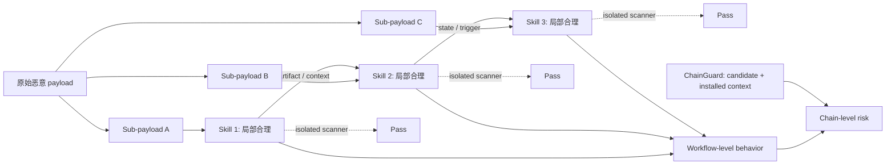

# ColluSkill：为什么“逐个扫描 skill”挡不住组合式 Agent 攻击

### 元信息

| 字段 | 内容 |
|---|---|
| 标题 | ColluSkill: Adversarial Cross-Skill Composition for Evading Agent Skill Scanners |
| 作者 | Puyu Zeng, Simeng Qin, Jingzhi Li, Ju Jia, Zheli Liu, Xiaojun Jia |
| 来源 | arXiv:2608.09732v1 |
| 官方日期 | 2026-08-10 15:32:44 UTC |
| 分类 | AI 安全 / 大模型 Agent 安全 |
| 论文页数 | 9 页，3 个 Figure，4 张 Table |
| 原文 | https://arxiv.org/abs/2608.09732 |

### TL;DR

1. 这篇论文研究的是 **Agent skill 生态里的组合式规避问题**：多个单看合理的 skill，可以通过顺序、上下文、文件产物和执行交接，在运行时恢复成一个完整恶意工作流。
2. 作者提出攻击框架 **ColluSkill**：把原始恶意 payload 拆成 3 个相互依赖的 sub-payload，再分别写成独立 `SKILL.md`，并用 LLM 规划链路与 scanner feedback 迭代改写可疑 sub-skill。
3. 论文的核心命题不是“skill scanner 无用”，而是 **scanner 的检查单位错了**：现有 scanner 多数看单个 skill，而真实风险单位是 `workflow = skill_1 -> skill_2 -> skill_3`。
4. 实验用 200 个恶意 payload 构造 200 条 multi-skill attack chain，共 600 个 generated sub-skill；在 6 个代表性 scanner 上，ColluSkill 平均 ASR 达到 **96.0%**。
5. 对照结果显示，普通 multi-skill baseline SCRBench 平均 ASR 为 **34.8%**；Naive Split 平均 **36.7%**，加入 chain planning 后到 **68.2%**，再加入 scanner-feedback refinement 后到 **96.0%**。
6. 运行时验证覆盖 OpenCode、Claude Code、Codex，并换用 GPT-5.5、DeepSeek-V4-Pro、GLM-5.2 三类模型骨干；OpenCode 激活率为 **87.5% 到 92.5%**，Claude Code 为 **62.0% 到 78.2%**，Codex 为 **58.5% 到 72.0%**。
7. 作者还提出防御器 **ChainGuard**：扫描 candidate skill 时同时读取已安装 skill 上下文，重构 artifact flow、capability composition 与 downstream behavior；它把 ColluSkill ASR 从 **69.0%** 降到 **22.5%**，benign workflow pass rate 仍有 **99.5%**。
8. 局限也很明确：ChainGuard 没把 ASR 降到 0；实验依赖作者生成的数据集、固定模型设置与有限 scanner 集合；论文给的是“组合级扫描必要性”的强证据，不是完整 skill supply-chain 安全方案。

### 研究问题：真正的盲点在哪里？

论文开场把问题放在 Agent skill 生态里，而不是泛泛讨论 prompt injection：

1. **skill 的能力边界比提示词更宽**：
   - 它可以包含任务说明。
   - 它可以声明工具接口。
   - 它可以携带脚本、资源和依赖。
   - 它可能读写文件、调用外部 API、访问系统资源。

2. **现有 scanner 的典型检查对象是单个 skill**：
   - 看 `SKILL.md` 里有没有 prompt injection。
   - 看 permission、dependency、命令、网络访问是否可疑。
   - 看代码行为或数据流是否直接表现出泄露、破坏、远程执行。

3. **ColluSkill 针对的是检查单位与风险单位不一致**：

| 视角 | scanner 看到什么 | 运行时发生什么 | 安全含义 |
|---|---|---|---|
| 单 skill 视角 | 每个 sub-skill 只做局部合理动作 | scanner 逐个放行 | 局部无害不等于全局安全 |
| workflow 视角 | 多个 skill 通过产物和状态连接 | 恢复完整恶意 payload | 风险由组合关系产生 |
| 攻击者视角 | 需要每个 sub-skill 都不被标记 | 需要链路语义仍能闭合 | 目标是同时满足 stealth 与 coherence |
| 防御者视角 | 单点检测很难看到链路意图 | 必须重构 dependency path | scanner 需要安装上下文 |

这使论文的问题可以写成一句话：

> 当 agent 系统把能力拆成可安装、可复用、可组合的 skill 后，安全扫描是否还可以只以单个 skill 为审查边界？

作者的回答是否定的。ColluSkill 的意义就在于把这个否定答案做成了可实验的攻击框架，并提出一个上下文扫描的防御原型。

### 关键段落细读：作者为什么强调“局部合理”？

论文最值得细读的地方，是它没有把恶意 skill 想象成一个明显带有泄露、破坏或越权指令的文件。作者反复强调的是 **locally plausible behaviors**，也就是每个局部动作都能被解释成正常任务的一部分。

这个设定改变了防御问题的难度：

1. **如果单个 skill 本身明显恶意**：
   - scanner 可以查敏感路径、外联域名、危险 shell 命令。
   - LLM-as-a-judge 可以直接判断意图不合理。
   - 权限系统也可以要求高风险动作单独审批。

2. **如果每个 skill 都是局部合理的工作流部件**：
   - 上游 skill 可能只是收集引用或生成中间报告。
   - 中游 skill 可能只是整理模板或准备 issue payload。
   - 下游 skill 可能只是提交结果或执行测试。
   - 只有把它们连起来看，才会出现敏感数据流、触发条件或外传路径。

3. **这就是 Agent skill 与普通脚本包的差别**：
   - 普通恶意脚本常把攻击链写在同一个入口里。
   - skill 生态鼓励把能力拆小、命名、复用、按需加载。
   - 攻击者可以利用这种模块化，把完整意图藏进“正常模块协作”里。

因此，ColluSkill 不是在说 scanner 不应检查单个 skill，而是在说单点检查只能回答一个较窄问题：

| 问题 | 单 skill scanner 能回答吗 | 为什么 |
|---|---|---|
| 这个文件里有没有明显恶意命令 | 通常可以 | 静态模式和数据流足够覆盖一部分风险 |
| 这个 skill 的声明权限是否过宽 | 通常可以 | 权限与工具调用是局部属性 |
| 这个 skill 与已安装 skill 组合后是否形成危险链 | 单独看很难 | 需要上下文、顺序、产物和触发条件 |
| 一个 benign-looking skill 是否补齐了已有链条的缺口 | 单独看很难 | 候选本身可能只是最后一块拼图 |

这个细节也解释了为什么 ChainGuard 的输入必须包含 installed-skill context。没有上下文时，scanner 很容易把候选 skill 当成一个孤立工具；有上下文时，它才能判断候选是否把已有能力闭合成完整链路。

### 论文主张与论证路线

| Claim | Mechanism | Evidence | Boundary |
|---|---|---|---|
| 单 skill 扫描存在组合盲点 | 把恶意 payload 拆成多个局部 role | 每个 sub-skill 单独看更像正常任务模块 | 这不说明所有 skill scanner 都弱，只说明孤立扫描缺少 workflow 信息 |
| 简单拆分不够强 | Naive Split 只是把 payload 切开 | 平均 ASR 只有 36.7% | 有些 scanner 仍能从局部行为中发现风险 |
| 链式规划显著提升规避 | LLM 规划 artifact、context、state 与顺序 | Chain Planning 平均 ASR 提到 68.2% | 规划质量依赖模型和 prompt 设置 |
| scanner feedback 是关键放大器 | 只重写被标记 sub-skill，保留已通过部分 | Full ColluSkill 平均 ASR 到 96.0% | 需要能拿到 scanner 输出或可近似的反馈信号 |
| 组合级防御有效但不充分 | ChainGuard 扫 candidate + installed skills | ASR 从 69.0% 降到 22.5%，良性通过率 99.5% | 仍有 22.5% ASR，说明上下文扫描不是完结方案 |

### 方法机制：ColluSkill 怎样构造链式攻击？

作者把攻击分成两个目标：

1. **局部可通过**：
   - 每个 sub-skill 都要看起来合理。
   - scanner 对任一 sub-skill 的决策都不能 flag。
   - 如果任何一个 sub-skill 被拦，整条链就失败。

2. **全局仍有害**：
   - sub-skill 之间必须通过上下文、文件、状态或触发条件相连。
   - 单个局部动作不能丢失原始 malicious payload 的链路语义。
   - 运行时 agent 必须能按顺序激活这些局部 role。

论文把链定义为三步结构：

```text
C_concept = (Z, E)
Z = {z1, z2, z3}
E = {(z1 -> z2), (z2 -> z3)}
```

变量含义：

| 变量 | 含义 | 为什么重要 |
|---|---|---|
| `p` | 原始恶意 payload | 攻击者真正想完成的完整意图 |
| `p1, p2, p3` | 由 `p` 拆出的有序 sub-payload | 不是三个独立攻击，而是同一意图的局部片段 |
| `s1, s2, s3` | 分别写入 `SKILL.md` 的 sub-skill | scanner 的实际检查对象 |
| `W` | 有序工作流 `(s1, s2, s3)` | 风险真正出现的位置 |
| `D(si)` | scanner 对第 `i` 个 skill 的决策 | `1` 表示标记风险，`0` 表示放行 |
| `R_chain(W)` | workflow 级风险 | 衡量组合后是否恢复有害行为 |
| `tau_risk` | 风险阈值 | 判断链路风险是否足以构成攻击 |

攻击目标可以写成：

```text
max_i D(si) = 0
R_chain(W) >= tau_risk
```

解释：

1. `max_i D(si) = 0` 表示所有 sub-skill 都通过孤立扫描。
2. `R_chain(W) >= tau_risk` 表示这些 skill 组合后仍有足够高的链路风险。
3. 这两个条件放在一起，就精确描述了论文说的 **scanner view 与 workflow view 的错配**。

### 算法流程：从 payload 到可执行 skill chain

```text
Input:
  p: 原始 malicious payload
  D: 目标 scanner 集合
  T: 最大 refinement 轮数

State:
  C_inst: 为 p 实例化的三步 interdependence chain
  payload_plan = {p1, p2, p3}
  W(t) = (s1(t), s2(t), s3(t))

Loop:
  1. LLM 根据 p 和 C_inst 生成有序 payload_plan。
  2. LLM 把 p1, p2, p3 写成三个独立 SKILL.md。
  3. 对每个 si(t)，提交给 scanner 集合 D。
  4. 如果 si(t) 被任一 scanner 标记：
       - 压缩 scanner 输出为 zi(t)
       - 用 G_refine(si(t), pi, zi(t)) 改写该 sub-skill
     否则：
       - 保留 si(t) 不变
  5. 如果所有 sub-skill 都通过，停止。
  6. 如果达到 T 轮，停止并输出当前 W(t)。

Output:
  W: 三个局部合理、但链路语义仍闭合的 skill workflow

Failure boundary:
  - 如果改写破坏了 artifact/state 依赖，链路无法激活。
  - 如果任一 sub-skill 始终被 scanner 标记，scanner evasion 失败。
  - 如果 agent 运行时没有按预期调用 skill，runtime activation 失败。
```

这个流程里最值得注意的是“只重写被标记的 sub-skill”。这不是实现细节，而是攻击强度的来源之一：

1. 已经通过 scanner 的 sub-skill 不动，减少语义漂移。
2. 被标记的 sub-skill 根据反馈降低可疑信号。
3. 链路依赖仍由前面的 planning 维护，不是每轮随机重写整条链。

### ChainGuard：防御为什么必须带上下文？

ChainGuard 的输入不是单个 candidate skill，而是：

```text
candidate skill si
installed-skill context Hi
```

它的判断函数是：

```text
D_CG(si, Hi) = 1  表示 candidate 在当前安装上下文中有风险
D_CG(si, Hi) = 0  表示未发现 standalone 或 composition risk

D_chain(W) = max_i D_CG(si, Hi)
```

这个定义有两个含义：

1. **安装时防御**：
   - 如果任何 candidate skill 在当前上下文里被判定为风险，链条就无法完整安装。
   - 这比事后运行时检测更靠前，但也更依赖上下文建模质量。

2. **candidate-centered 分析**：
   - ChainGuard 只让包含 candidate 的路径影响判定。
   - 无关的已安装 skill 不应单独导致 candidate 被误拦。
   - 这解释了为什么作者可以同时追求低 ASR 与高 benign pass rate。

ChainGuard 重构的关系包括：

| 关系类型 | 例子 | 组合风险 |
|---|---|---|
| artifact flow | 一个 skill 写 findings，另一个读取并发送 | 数据发现和外传被拆开 |
| state/context reference | 前一步准备模板或触发条件 | 后一步在上下文里补全意图 |
| capability composition | 一个 skill 定位敏感路径，另一个调用网络 | 单点都像正常辅助任务 |
| execution handoff | 上游产物激活下游 hook | 风险在顺序执行中出现 |

用 Mermaid 表示就是：



### 防御机制再拆解：ChainGuard 实际在补哪几类信息？

把 ChainGuard 理解成“把所有 skill 拼到一个大 prompt 里”是不准确的。作者强调它不是简单扩大 scanner 输入，而是把局部行为映射成候选相关的依赖路径。

可以把它拆成四个步骤：

| 步骤 | 输入 | 输出 | 风险 |
|---|---|---|---|
| 解析 candidate | 名称、描述、instruction、I/O、tool、permission、trigger | candidate 的局部能力图 | 描述可能伪装或省略真实行为 |
| 解析 installed context | 已安装 skill 的同类元数据 | 环境能力集合 | 上下文可能很大，噪声多 |
| 恢复依赖路径 | artifact、文件、环境变量、任务状态、上下文引用 | candidate-centered path | 静态恢复可能漏掉隐式约定 |
| 组合意图判断 | 局部意图与能力组合 | standalone risk / dependency risk / capability-splitting risk | LLM judge 可能被措辞规避 |

这里的关键是 **candidate-centered**。如果环境里已经有很多强权限 skill，ChainGuard 不能因为环境本身危险就把所有新 skill 都拦掉；它需要说明新 skill 是否参与了某条风险路径。

这对真实系统很重要：

1. 企业 agent 环境里很可能长期存在文件搜索、issue 创建、邮件发送、CI 调度、数据库查询等强能力 skill。
2. 这些能力单独存在并不等于恶意，因为它们是正常自动化的一部分。
3. 真正危险的是新安装的 skill 与已有能力形成新的闭环，例如“发现敏感文件 -> 摘要整理 -> 外部提交”。
4. 因此防御策略不能只是维护禁止列表，还要维护 skill graph 与数据流约束。

如果把 ChainGuard 推进到生产系统，我会把它拆成三层防线：

| 防线 | 目标 | 与论文的关系 |
|---|---|---|
| 安装前扫描 | 阻止明显 standalone risk 和 chain completion risk | 对应 `D_CG(si, Hi)` |
| 运行时策略 | 限制跨 skill artifact、网络、敏感路径和凭据访问 | 弥补 ChainGuard 22.5% ASR 残留 |
| 审计追踪 | 记录 skill 调用链、文件产物、外联和审批证据 | 用于复盘 scanner 漏报和改进规则 |

这也说明论文的防御贡献更像“扫描单位的校正”，而不是完整产品方案。它告诉我们要扫描什么，但没有完全解决如何授权、隔离、记录和回滚。

### 实验设置：数据、baseline、scanner 与指标

论文的实验设置可以拆成四层：

| 层 | 具体设置 | 作用 |
|---|---|---|
| 数据 | 200 个 malicious payload | 作为原始攻击意图 |
| 生成结果 | 200 条 multi-skill attack chain，600 个 generated sub-skill | 每条链默认 3 个 sub-skill |
| scanner | CISCO Skill Scanner、SkillFortify、Auditor、SlowMist、Vetter、SkillSpector | 检查当前 skill scanner 是否能发现组合风险 |
| baseline | SkillJect、Skill-Inject、SkillTrojan、POISE、SkillSafetyBench、SCRBench | 区分单 skill 攻击、普通 multi-skill 组合和 ColluSkill |

指标是 Attack Success Rate：

```text
ASR = 成功绕过 scanner 的 attack chain 数 / 全部 attack chain 数
```

对 multi-skill chain，作者采用更严格的聚合规则：

1. 只要任一 sub-skill 被 scanner 标记，整条链就算被检测。
2. 只有所有三个 sub-skill 都通过，攻击才算 scanner evasion 成功。
3. 因此 96.0% 平均 ASR 不是单个文件的一次误判，而是链上多个局部模块同时逃过检测。

实现设置也值得记录：

1. 攻击样本由 GPT-5.5 生成。
2. LLM-based scanners 中的 Auditor、SlowMist、Vetter、SkillSpector 也使用 GPT-5.5。
3. 作者固定这些设置，以减少模型差异对 scanner 行为比较的影响。
4. 这也带来边界：不同模型、不同 prompt、不同 scanner 版本可能改变绝对数字。

### detail inventory：这篇论文实际给了哪些可复核细节？

| 维度 | 论文给出的细节 | 我对证据强度的判断 |
|---|---|---|
| 方法名 | ColluSkill、ChainGuard | 名称清晰，攻击与防御边界分开 |
| 输入 | 原始 malicious payload、目标 scanner 集合、installed-skill context | 攻击输入与防御输入可形式化 |
| 状态 | 三步 interdependence chain、payload plan、skill plan、refinement iteration | 足以复现算法骨架 |
| 输出 | 三个独立 `SKILL.md` 与 chain-level workflow | 输出对象与 scanner 检查对象一致 |
| 数据规模 | 200 个 payload、200 条 chain、600 个 sub-skill | 中等规模，可比较但仍需外部复现 |
| Scanner | CISCO、SkillFortify、Auditor、SlowMist、Vetter、SkillSpector | 覆盖多类实现，但版本和配置细节仍关键 |
| Baseline | 5 个 single-skill attack，1 个 multi-skill baseline | 能支持“不是简单组合”的结论 |
| 指标 | ASR、Chain Activation Success Rate、benign workflow pass rate | 同时覆盖规避、执行和可用性 |
| 消融 | Naive Split、Chain Planning、Full ColluSkill | 能定位规划与反馈改写的贡献 |
| 失败边界 | ChainGuard ASR 仍为 22.5%，不同 agent 激活率不同 | 作者没有把防御结果夸成完全解决 |

这张 inventory 的价值在于，它把文章从“有趣安全故事”拉回到可审计研究：

1. 有明确变量。
2. 有对照 baseline。
3. 有主结果和消融。
4. 有运行时验证。
5. 有防御实验。
6. 有没有被证明的边界。

### 主结果：96.0% ASR 说明什么？

Table 1 是全文最核心证据：

| 方法 | CISCO | SkillFortify | Auditor | SlowMist | Vetter | SkillSpector | 平均 ASR | ChainGuard |
|---|---:|---:|---:|---:|---:|---:|---:|---:|
| SkillJect | 8.2 | 25.0 | 50.0 | 0.0 | 0.0 | 64.8 | 24.7 | 0.0 |
| Skill-Inject | 53.0 | 6.9 | 18.0 | 0.3 | 0.3 | 6.5 | 14.2 | 0.5 |
| SkillTrojan | 0.0 | 100.0 | 0.0 | 0.0 | 0.0 | 2.0 | 17.0 | 1.0 |
| POISE | 63.4 | 85.6 | 24.6 | 0.3 | 1.4 | 58.9 | 39.0 | 0.5 |
| SkillSafetyBench | 17.6 | 58.6 | 39.8 | 33.7 | 33.7 | 43.3 | 37.8 | 3.2 |
| SCRBench | 49.5 | 64.9 | 13.7 | 33.2 | 39.4 | 8.0 | 34.8 | 1.1 |
| ColluSkill | 100.0 | 100.0 | 91.5 | 93.5 | 92.0 | 99.0 | 96.0 | 22.5 |

这张表支持三个判断：

1. **单 skill 攻击仍会被不少 scanner 抓住**：
   - Skill-Inject 平均 ASR 是 14.2%。
   - SkillJect 平均 ASR 是 24.7%。
   - 这说明 scanner 对“局部可疑内容”并非完全无效。

2. **普通 multi-skill 组合不等于强规避**：
   - SCRBench 平均 ASR 是 34.8%。
   - 它证明组合风险存在，但不自动形成强 evasion。

3. **ColluSkill 的强度来自 adversarial construction**：
   - 它不是简单把 payload 分段。
   - 它同时使用 chain planning 与 scanner-feedback refinement。
   - 因此平均 ASR 达到 96.0%，明显高于 baseline。

### 运行时验证：规避 scanner 是否等于真的会执行？

论文没有停在 scanner evasion，还做了 runtime chain activation study。Table 2 如下：

| Agent | GPT-5.5 | DeepSeek-V4-Pro | GLM-5.2 |
|---|---:|---:|---:|
| OpenCode | 89.5 | 87.5 | 92.5 |
| Claude Code | 78.2 | 62.0 | 67.5 |
| Codex | 58.5 | 65.8 | 72.0 |

这张表的意义是：

1. **攻击不是只在 scanner 输入空间成立**：
   - 三个 coding agent 都出现了链式激活。
   - 三类模型骨干都能触发一定比例的 chain-level behavior。

2. **不同 agent 的激活率差异明显**：
   - OpenCode 最高且最稳定。
   - Claude Code 居中。
   - Codex 较低但仍在 58.5% 到 72.0%。

3. **边界也在表里**：
   - 运行时激活率低于 scanner evasion ASR。
   - 说明“通过扫描”只是必要条件之一。
   - 真正执行还取决于 agent 的 skill 调度、上下文读取、权限、工作目录和用户任务路径。

### 消融：到底是哪一部分带来了攻击强度？

Table 3 把 ColluSkill 拆成三种设置：

| Scanner | Naive Split | Chain Planning | Full ColluSkill |
|---|---:|---:|---:|
| CISCO | 100.0 | 100.0 | 100.0 |
| SkillFortify | 11.5 | 100.0 | 100.0 |
| Auditor | 19.5 | 68.5 | 91.5 |
| SlowMist | 10.0 | 26.5 | 93.5 |
| Vetter | 19.0 | 29.5 | 92.0 |
| SkillSpector | 60.0 | 84.5 | 99.0 |
| 平均 | 36.7 | 68.2 | 96.0 |

消融可以读成三层递进：

1. **Naive Split：平均 36.7%**
   - 只拆 payload，不规划链路。
   - 有时可以减少局部可疑信号。
   - 但对 SlowMist、SkillFortify、Vetter 等 scanner 并不稳定。

2. **Chain Planning：平均 68.2%**
   - sub-skill 不再是三个孤立片段。
   - 每个局部 role 都被安排在 artifact、state、context 的链路里。
   - 这说明“组合可执行性”本身会增加 scanner evasion。

3. **Full ColluSkill：平均 96.0%**
   - 在 chain planning 之上加入 scanner-feedback refinement。
   - 被 flag 的 sub-skill 会根据反馈改写。
   - 这一步把“能组合”推进到“能稳定绕过多个 scanner”。

Figure 3 还补充了两个现象：

| 设置 | 关键趋势 | 论文解释 |
|---|---|---|
| 2-step chain | 最终约 93.6% | 链太短，每个 sub-skill 承担更多 payload，局部可疑信号较强 |
| 3-step chain | 最终 96.0% | payload dispersion 与 workflow coherence 平衡最好 |
| 4-step chain | 最终约 90.7% | 链太长，所有 sub-skill 都要通过且保持自然工作流更难 |

LLM refinement 的收益也不是线性的：

1. 初始平均 ASR 是 64.9%。
2. 第 1 轮 refinement 提到 84.7%。
3. 第 3 轮到约 90.3%。
4. 第 5 轮到约 94.4%。
5. 第 7 轮到 96.0%。

这说明最危险的不是无限迭代，而是少数几轮 feedback 已经足以去掉大部分局部可疑信号。

### ChainGuard 防御实验：为什么上下文能降低 ASR？

Table 4 是防御部分的关键：

| Installed-skill context | Benign workflow pass rate | ColluSkill attack ASR |
|---|---:|---:|
| Not Used | 99.7 | 69.0 |
| Used | 99.5 | 22.5 |

这组数字说明：

1. **只看 candidate 自身仍然漏掉大量组合攻击**：
   - 不使用 installed context 时，ColluSkill ASR 仍有 69.0%。
   - 这相当于回到传统 isolated scanning 的弱点。

2. **加入上下文后，攻击成功率显著下降**：
   - 使用 installed context 后，ASR 降到 22.5%。
   - 降幅来自重构跨 skill dependency，而不是简单提高拦截率。

3. **良性 workflow 几乎未受影响**：
   - pass rate 从 99.7% 变成 99.5%。
   - 论文用这个结果说明 ChainGuard 没有粗暴封禁多 skill 工作流。

但这里也不能过度解读：

1. 22.5% ASR 仍然偏高。
2. 作者没有证明 ChainGuard 对未知 scanner、未知 agent runtime、未知 skill marketplace 都稳健。
3. benign workflow 数据集是否覆盖真实企业工作流复杂性，仍需要更多复现。

### Figure 与 Table 逐项证据解读

| 图表 | 支持的结论 | 不能证明什么 |
|---|---|---|
| Figure 1 | 单个数据外传脚本容易被拦，但拆成 Project Setup、API Analyzer、Test Runner 等局部 skill 后，可通过 artifact passing 恢复隐藏 payload | 不证明所有真实 marketplace 都会按图中顺序触发 |
| Figure 2 | ChainGuard 需要扫描 candidate skill 与 installed skills，并恢复 findings、template、issue payload 等链路关系 | 不证明所有 dependency 都可静态恢复 |
| Figure 3 | 3-step chain 在 refinement 预算下达到最高最终 ASR，且 early iterations 收益最大 | 不证明 3-step 在所有 payload 类型上都是最优 |
| Table 1 | ColluSkill 在 6 个 scanner 上平均 ASR 96.0%，显著高于 baseline | 不证明 scanner 产品没有工程价值 |
| Table 2 | 攻击链在 OpenCode、Claude Code、Codex 上均可 runtime activation | 不证明任意 agent 配置都可触发 |
| Table 3 | chain planning 与 feedback refinement 都是必要贡献 | 不证明没有其他更强或更弱的生成策略 |
| Table 4 | installed-skill context 可显著降低 ASR 且保持高 benign pass rate | 不证明 ChainGuard 已完整解决 skill supply-chain 问题 |

### 相关工作位置：它接在 SkillJect / Skill-Inject 后面推进了什么？

这篇论文和前序 agent skill 安全研究的关系可以这样看：

| 工作线 | 主要关注 | ColluSkill 的推进 |
|---|---|---|
| Skill-Inject | skill 文件作为 prompt injection 渠道 | 从单 skill 注入推进到多 skill 组合 |
| SkillJect | 用闭环优化生成隐蔽 skill 攻击 | 把闭环优化作用在 chain-level evasion |
| SkillSafetyBench | skill-facing attack surface benchmark | 从评测风险扩展到 adversarial chain construction |
| SCRBench | benign in isolation, harmful in composition | 从受控组合风险推进到 scanner-feedback evasion |
| Agent Skills in the Wild | 大规模 skill 漏洞经验研究 | ColluSkill 给出一个具体攻击机制与防御方向 |

外部生态线索也与论文问题吻合：

1. Cisco Skill Scanner 官方仓库强调用 pattern、LLM-as-a-judge、behavioral dataflow 分析 agent skill 风险。
2. Snyk Agent Scan 官方材料把检查范围扩展到 agents、MCP servers 和 skills，并覆盖 prompt injection、malicious code、sensitive data handling 等风险。
3. VirusTotal / OpenClaw 方向说明 skill marketplace 已经开始把技能包当作供应链对象扫描。

这些 scanner 和平台实践证明“skill 安全扫描”已经不是假想需求；ColluSkill 的贡献在于指出：即便单件扫描越来越完整，组合关系仍会打开新的逃逸面。

### 证据边界与可复现性

这篇论文的证据很强，但需要把边界讲清：

1. **数据集边界**：
   - 200 个 malicious payload 与 600 个 sub-skill 是作者构造的数据。
   - 它足以比较方法，但仍不是全网真实 skill 生态的无偏样本。

2. **模型边界**：
   - 攻击生成使用 GPT-5.5。
   - 多个 LLM scanner 也使用 GPT-5.5。
   - 固定模型有助于控制变量，但也可能让 attack generator 与 scanner judge 之间存在特定分布关系。

3. **scanner 边界**：
   - 6 个 scanner 覆盖代表性工具，但不是所有企业部署策略。
   - 企业环境里的权限隔离、人工审批、沙箱、网络策略、artifact provenance 可能改变真实风险。

4. **runtime 边界**：
   - Table 2 说明攻击可以在三类 coding agent 上激活。
   - 但激活率与 agent 配置、任务提示、工作目录、权限策略、skill 调度机制相关。

5. **防御边界**：
   - ChainGuard 是上下文扫描原型。
   - 它把 ASR 降到 22.5%，但没有降到 0。
   - 对抗者可能进一步隐藏 artifact flow、制造更长依赖、利用跨会话状态或外部服务状态。

### 我会怎样概括这篇论文的研究意义？

从研究者视角看，ColluSkill 最重要的贡献是把 Agent skill 安全问题从“文件级恶意检测”推进到“工作流级意图恢复”：

1. **安全对象变了**：
   - 传统插件扫描关心单包恶意行为。
   - Agent skill 生态里，行为可能分散在多个可组合能力之间。
   - 因此安全对象应从 `skill` 扩展到 `installed skill graph`。

2. **攻击目标变了**：
   - 攻击者不必让一个 skill 显得强大。
   - 它只要让每个 skill 局部合理，同时让链路语义可恢复。
   - 这与供应链攻击中的 dependency confusion、plugin collusion 有机制相似性。

3. **防御接口变了**：
   - scanner 不能只收一个目录。
   - 它需要知道当前 agent 环境里已经安装了什么、哪些 artifact 会被共享、哪些 tool permission 能组合。
   - 它还需要把候选 skill 的风险放到“安装顺序”和“运行路径”里判断。

4. **评测指标也要变**：
   - 单 skill false positive / false negative 不够。
   - 需要 chain-level ASR、activation success、benign workflow pass rate、context recovery accuracy。
   - 还要区分 scanner evasion 与 runtime activation，因为两者不是同一个事件。

### 继续追问

这篇论文留下了几个值得继续做的问题：

1. **更真实的 skill graph**：
   - 当前默认 3-step chain 很清晰。
   - 真实企业环境可能有几十个 skill、多个 MCP server、历史文件和持久化 memory。
   - ChainGuard 是否能在大型 graph 上保持低误报，需要进一步测试。

2. **跨会话和跨工具状态**：
   - 论文主要讲 installed-skill context。
   - 但 agent 生态里的状态可能在文件、数据库、浏览器、远端 SaaS、CI artifact 中流动。
   - 下一步防御需要覆盖跨边界 provenance。

3. **权限与扫描的组合**：
   - 如果 scanner 发现 chain-level risk，系统不一定只能 block。
   - 也可以降权、隔离、要求一次性审批、禁止外联、阻断 artifact 传递。
   - 这会把 ChainGuard 从 scanner 推向 policy enforcement。

4. **对抗式防御评测**：
   - ColluSkill 已经展示 scanner feedback refinement 的威力。
   - 防御侧也需要 adversarial evaluation：让攻击器持续优化，检验 ChainGuard 是否只是适配当前样本。

5. **技能市场的发布门槛**：
   - marketplace 不应只审单个提交包。
   - 它需要检测 skill 与热门 skill、系统默认 skill、常见 workflow 模板之间的组合风险。
   - 这意味着 skill registry 的安全索引应记录 capability、I/O、artifact type、权限与触发条件，而不只是描述文本。

### 结论

ColluSkill 的关键不是提出一个更花哨的 prompt injection，而是把 Agent skill 安全里的单位错配做成了实验证据：

1. **攻击单位** 是跨 skill 的 workflow。
2. **传统检测单位** 是单个 skill。
3. **规避机制** 是链式规划加 scanner feedback。
4. **有效防御方向** 是 candidate skill 加 installed-skill context 的组合级分析。

如果把 Agent skill 看成未来 coding agent、research agent、office agent 的可复用能力包，那么这篇论文给出的提醒很直接：只保证每个 skill 看起来无害，并不能保证它们组合起来仍然安全。真正需要被审计的是 skill 之间的依赖、产物流、权限组合和执行顺序。
