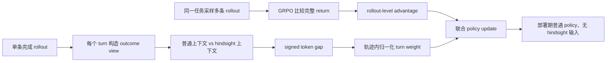

# Trajectory-Relative Hindsight Distillation：把事后信息从“整条轨迹”分配回每一个 Agent 决策

## 元信息与 TL;DR

- 论文：Trajectory-Relative Hindsight Distillation for Agentic Reinforcement Learning
- arXiv：arXiv:2608.07371v1
- 官方日期：2026-08-07 16:12:58 UTC
- 作者：Haoyu Zheng, Yun Zhu, Qing Wang, Wenqiao Zhang
- 代码：<https://github.com/Chihaya-Anon-chan/TRIAL>
- 主题：大模型 Agent 后训练；长程交互；GRPO；hindsight distillation；逐 turn credit allocation

### TL;DR

- 这篇论文解决的问题是：多轮 Agent 强化学习常只有稀疏终局奖励，GRPO 能比较不同完整 rollout 的好坏，却不能告诉模型“这一条轨迹里的哪一个 turn 更应该被更新”。
- TRIAL 的核心做法是：对同一条已完成轨迹，在每个决策 turn 构造一个训练期才可见的 hindsight outcome view，把该 turn 的真实后果暴露给 scorer，再比较同一段 response tokens 在普通上下文与 hindsight 上下文下的 log-probability gap。
- 论文不是把 hindsight 当作新输入喂给部署期 Agent；它只在训练时使用 outcome view，部署时仍保留普通在线策略，没有额外推理模块、teacher routing 或 hindsight prompt。
- 方法关键在“轨迹相对归一化”：先把每个 turn 的绝对 gap 聚合成 turn score，再除以整条轨迹按 eligible tokens 加权的平均 score，得到平均乘子为 1 的 turn weight。这样 dense supervision 被重新分配，但平均强度被固定。
- 实验覆盖 WebShop 和 ALFWorld，两种 backbone 是 Qwen2.5-3B-Instruct 与 Qwen3-1.7B。TRIAL 在 8 个 backbone × environment × metric 组合里都超过 GRPO，并在 6 个组合里达到或并列最高。
- 最醒目的数字来自 WebShop + Qwen3-1.7B：GRPO success 是 56.4%，TRIAL 到 75.2%；task score 从 78.7% 到 85.7%。
- 消融把 dense hindsight pathway 固定，只替换 turn profile：Uniform 说明“有 dense hindsight”本身不够，Permuted 说明“非均匀权重”本身也不够；TRIAL 的 source-aligned relative profile 在四个 aggregate metrics 上都高于两者。
- 局限也很明确：证据主要来自文本交互环境和离散 action；每次更新要多做 hindsight-conditioned forward pass；主结果是 single seed，跨 seed 方差和统计显著性还没有被充分测量。

## 研究问题：为什么 GRPO 的 rollout 优势还不够？

### 稀疏奖励给了“整局输赢”，却没有给“局部因果”

- Agentic RL 的典型训练单元是完整轨迹：

```text
tau = (o_1, a_1, o_2, a_2, ..., a_K, o_{K+1})
```

- 在 WebShop 里，轨迹可能包含：
  - 搜索商品；
  - 打开候选页面；
  - 选择颜色与尺码；
  - 最后 purchase。

- 在 ALFWorld 里，轨迹可能包含：
  - 去某个房间位置；
  - 查看容器；
  - 拿起物体；
  - 移动物体到目标容器。

- GRPO 的相对优势通常来自同一任务下多条 rollout 的终局 return：

```text
A_i = (R_i - mean(R)) / (std(R) + eps)
```

- 这个信号回答的是：
  - 哪条完整 rollout 比同组其他 rollout 更好；
  - 哪条完整 rollout 更差；
  - 终局奖励应如何形成 group-relative advantage。

- 但它没有直接回答：
  - 第 3 个 turn 的错误是否比第 8 个 turn 更关键；
  - 一个无状态变化的 action 是否应该被下调；
  - 一个发现目标物位置的 turn 是否应该比终点放置 turn 获得更强监督；
  - 同一条成功轨迹里，不同 action 的贡献是否应当同权。

### Hindsight distillation 给了局部信号，但还缺少分配规则

- Hindsight 的直觉是：
  - 轨迹完成后，我们知道某个 action 之后环境返回了什么；
  - 训练时可以让 scorer 看到这个后果；
  - 再问：如果知道这个后果，同一个 response token 的概率应该怎样变化？

- 论文要解决的第二层问题是：
  - 一条 rollout 有很多 turn；
  - 每个 turn 都能产生 token-level gap；
  - raw gap magnitude 不天然可比，因为不同 turn 的 token 数、语义位置和上下文长度不同；
  - 如果直接把所有 gap 当作同权 dense loss，可能只是“更多监督”，而不是“正确分配监督”。

- 因此 TRIAL 的问题定义可以写成：

```text
保留 signed token-level revision；
在同一条轨迹内重新分配 turn-level emphasis；
同时控制整条轨迹的平均 multiplier 不漂移。
```

## 方法主张：TRIAL 在 GRPO 外面加一层轨迹相对 hindsight 分配

### 论文的 claim -> mechanism -> evidence -> boundary

| 层次 | 论文说法 | 机制 | 证据 | 边界 |
|---|---|---|---|---|
| Claim | 长程 Agent 需要 turn-level dense supervision | 对每个 turn 构造 outcome view | WebShop/ALFWorld 主表超过 GRPO | 文本离散 action 环境 |
| Mechanism | Hindsight gap 可提供 signed token revision | 比较普通上下文与 hindsight 上下文的同一 token log-prob | Eq. 4 与 Algorithm 1 | gap 是 policy discrepancy，不等价于真实因果重要性 |
| Allocation | turn weight 要在轨迹内相对归一化 | turn score 除以 token-weighted trajectory average | Uniform/Permuted 消融 | 依赖 outcome view 可序列化 |
| Deployment | 训练期用 hindsight，部署期不用 | 丢弃 augmented context 与 profile | 论文明确无额外 inference cost | 训练成本增加 |

### Figure 1 的作用：区分 rollout-relative 和 trajectory-relative

- Figure 1 不是装饰图，而是在定义两个互补颗粒度：
  - outcome-relative：跨 rollout 比较完整轨迹，得到一个 trajectory-level 信号；
  - trajectory-relative：在同一条完成轨迹里，比较每个 turn 的普通 policy view 和 hindsight policy view；
  - one policy update：两类信号最后汇合到同一个 policy update。

- 这张图的关键含义是：
  - TRIAL 没有替代 GRPO；
  - TRIAL 也不是给每个 step 重新估计 environment reward；
  - 它是在 GRPO 已给出 rollout outcome signal 后，把 hindsight revision 分配回 turn 和 token。



## 公式细读：TRIAL 如何把 hindsight 分配成 mean-one turn profile？

### 1. 轨迹与 eligible token

- 对任务 `x`，rollout policy 采样一组 `G` 条多轮轨迹。
- 每条轨迹 `tau` 包含 observation、action、下一个 observation：

```text
tau = (o_1, a_1, o_2, ..., a_K, o_{K+1})
a_k = (y_{k,1}, ..., y_{k,T_k})
```

- `m_{k,t}` 是 token mask：
  - generated response token 可用于 hindsight learning；
  - prompt token 和 padding token 排除；
  - 如果模型生成 reasoning token，论文实验中这些 response 内的 reasoning tokens 也计入 eligible。

- 每个 turn 的 eligible token 数：

```text
n_k = sum_t m_{k,t}
N_tau = sum_k n_k
```

### 2. Hindsight-conditioned policy gap

- 每个 turn 先构造 outcome view：

```text
z_k = OutcomeView(tau, k)
```

- 普通上下文是：

```text
h_{k,t} = [P_k; y_{k,<t}]
```

- Hindsight 上下文把当前 turn 的真实后果加入 scoring prompt：

```text
P_k^+ = Aug(P_k, z_k)
h_{k,t}^+ = [P_k^+; y_{k,<t}]
```

- 同一 token 在 hindsight view 与 ordinary view 下的 log-probability gap：

```text
Delta_{k,t}(pi) = sg( clip_c( log pi_T(y_{k,t}|h^+_{k,t}) / pi(y_{k,t}|h_{k,t}) ) )
```

- 这个 gap 的方向很重要：
  - positive gap：看到真实后果后，这个 token 更被支持，应提高概率；
  - negative gap：看到真实后果后，这个 token 更不被支持，应降低概率；
  - absolute gap：该 token 局部 revision 的强度。

### 3. Turn score 与轨迹相对权重

- 每个 turn 的 absolute gap 均值：

```text
s_k = (1 / n_k) * sum_t m_{k,t} * |Delta^old_{k,t}|
```

- 整条轨迹的 token-weighted 平均：

```text
s_tau = (1 / N_tau) * sum_j n_j * s_j
```

- TRIAL turn weight：

```text
w_k = s_k / s_tau
sum_k n_k * w_k = N_tau
```

- 最后一行是整篇方法的校准点：
  - 按 eligible tokens 加权后，平均 multiplier 等于 1；
  - 所以 TRIAL 不是简单增大 dense loss；
  - 它是在平均强度固定的前提下，把监督从低 revision turn 移到高 revision turn。

### 4. 一个三 turn 小例子

| turn | eligible tokens | absolute gap score `s_k` | trajectory average `s_tau` | weight `w_k` | 解释 |
|---|---:|---:|---:|---:|---|
| T1 | 10 | 0.10 | 0.20 | 0.50 | 低于平均，减少 dense emphasis |
| T2 | 10 | 0.20 | 0.20 | 1.00 | 接近平均，保持 unit profile |
| T3 | 10 | 0.30 | 0.20 | 1.50 | 高于平均，上调监督 |

- 这个例子说明：
  - 如果所有 turn 一样长，权重就是相对 gap；
  - 如果 token 数不同，`s_tau` 会按 eligible token 加权；
  - 如果整条轨迹 total gap 近似为 0，论文把 `w_k` 退化为 1，避免数值不稳定。

## 联合优化：为什么它没有改变 GRPO 的优势估计？

### Dense hindsight objective

- actor 优化时，TRIAL 刷新当前 policy 下的 detached gap，构造 dense objective：

```text
L_dense =
- (1 / M) * sum_{tau,k,t}
  m_{tau,k,t} * w_{tau,k} * Delta^theta_{tau,k,t}
  * log pi_theta(y_{tau,k,t} | h_{tau,k,t})
```

- `M` 是 microbatch 中 eligible tokens 总数。
- 当 microbatch 没有 eligible token 时，dense loss 置 0。
- `w_{tau,k}` 决定 dense update 往哪里集中。
- `Delta` 的符号决定 token probability 上调还是下调。

### 与 outcome objective 合并

- TRIAL 最终优化：

```text
b_g = alpha * sg(|L_GRPO|)
L(theta) = L_out(theta) + clip_{b_g}(lambda_g * L_dense)
```

- 这里有三个边界设计：
  - `lambda_g` 在 warmup 前为 0，之后才启用 dense term；
  - dense contribution 会相对 detached GRPO loss magnitude 被 clamp；
  - clamp 饱和时 dense term 梯度为 0，outcome-policy gradient 仍然工作。

- 所以论文并没有说 hindsight 可以替代 reward：
  - GRPO 仍负责跨 rollout 的 outcome comparison；
  - TRIAL 负责同一 rollout 内的 hindsight allocation；
  - dense term 被限制在 outcome loss 的尺度边界内。

## Algorithm 1：训练流程拆成 6 步看

```text
Input:
  actor pi_theta
  task batch {x_b}
  interaction interface: OutcomeView, Aug

State:
  pi_old = pre-update rollout snapshot
  pi_T = frozen scoring snapshot

Loop:
  1. 用 pi_old 收集多条 completed trajectories 和 final returns
  2. 用 group returns 计算 GRPO advantage 与 L_out
  3. 对每条 trajectory、每个 turn:
       z_{i,k} = OutcomeView(tau_i, k)
       P^+_{i,k} = Aug(P_{i,k}, z_{i,k})
       h^+_{i,k,t} = [P^+_{i,k}; y_{i,k,<t}]
  4. 对同一批 realized tokens:
       比较 ordinary context 与 augmented context
       计算 Delta_old、turn score s_{i,k}、detached profile w_{i,k}
  5. actor optimization:
       刷新 Delta_theta
       构造 L_dense
       用 L_out + clipped dense term 更新 theta
  6. 丢弃 hindsight evidence、augmented contexts、profile

Output:
  updated ordinary policy pi_theta

Failure boundary:
  如果 outcome view 无法和 turn 对齐，或没有 serializable post-action evidence，
  TRIAL 的核心假设就不成立。
```

## 实验设置：作者具体比较了什么？

### Benchmarks 与 metrics

| 环境 | 任务形态 | 训练/评估边界 | 指标 |
|---|---|---|---|
| WebShop | 文本购物交互，搜索、页面导航、选择属性、购买 | 训练 rollouts 来自 released training goal pool；最终评估完整 500 test goals | success 与 dense task score |
| ALFWorld | 文本化 embodied household tasks | Seen 140 games；Unseen 134 games；六类任务分别报告 | binary success，Seen/Unseen 分开 |

- WebShop interaction cap：15 environment turns。
- ALFWorld interaction cap：50 turns。
- 训练期 validation 使用固定 128-instance diagnostic subset。
- main table 使用完整官方评估集，不把 diagnostic results 混入 final evaluation。

### Models、baseline 与训练配置

- Backbones：
  - Qwen2.5-3B-Instruct；
  - Qwen3-1.7B。

- Baselines：
  - same-stack GRPO；
  - SERL；
  - SDAR；
  - GRPO+OPSD；
  - RLSD。

- 训练配置：

| 配置项 | WebShop | ALFWorld |
|---|---:|---:|
| training task batch | 16 | 16 |
| rollouts per task | 8 | 8 |
| PPO minibatch | 64 | 256 |
| microbatch per GPU | 8 | 32 |
| max prompt tokens | 4096 | 2048 |
| max response tokens | 512 | 512 |
| auxiliary coefficient | 0.005 | 0.01 |
| gap clipping bound `c` | 2.0 | 2.0 |
| auxiliary activation step | 25 | 25 |
| relative clamp `alpha` | 1.0 | 1.0 |

- 共同训练条件：
  - 150 optimization steps；
  - learning rate `1e-6`；
  - group-relative methods 每个 task instance 采样 8 条 trajectories；
  - 训练使用 8 张 H20 GPU。

### 代码库复现边界

- 官方代码 README 给出的默认入口：
  - `BENCHMARK=alfworld bash scripts/run.sh`
  - `BENCHMARK=webshop bash scripts/run.sh`
  - `BENCHMARK=alfworld bash scripts/evaluate.sh`
  - `BENCHMARK=webshop bash scripts/evaluate.sh`

- 脚本层默认参数与论文相互印证：
  - `TRAIN_SIZE=16`
  - `VAL_SIZE=128`
  - `TOTAL_STEPS=150`
  - `NUM_GPUS=8`
  - `ENGINE=vllm`

- 评估脚本明确：
  - ALFWorld evaluation size 是 134，且固定 eval games；
  - WebShop evaluation size 是 500，且固定 eval goals；
  - checkpoint 必须是 `global_step_*` 目录。

## 主结果：TRIAL 相对 GRPO 到底提升在哪里？

### Table 1 的关键读法

- 作者报告完整比较矩阵，而不是只给 aggregate average。
- ALFWorld 拆成六类：
  - Pick and Place；
  - Pick Two and Place；
  - Look at Object；
  - Heat and Place；
  - Cool and Place；
  - Clean and Place。

- WebShop 报两个指标：
  - Succ.；
  - Score。

### Qwen3-1.7B：WebShop 是最强证据点

| 方法 | WebShop Success | WebShop Score |
|---|---:|---:|
| GRPO | 56.4 | 78.7 |
| SERL | 67.6 | 81.1 |
| SDAR | 70.0 | 81.8 |
| GRPO+OPSD | 60.8 | 79.1 |
| RLSD | 68.4 | 81.4 |
| TRIAL | 75.2 | 85.7 |

- 对 GRPO：
  - success 提升 `18.8` 个百分点；
  - score 提升 `7.0` 个百分点。

- 对最强非 TRIAL baseline：
  - success 高于 SDAR `5.2` 个百分点；
  - score 高于 SDAR `3.9` 个百分点。

- 这说明提升不是只来自 partial credit：
  - success 代表完整完成购物目标；
  - score 代表属性满足的部分质量；
  - 两者同步上升，支持“更多目标完成 + 更好中间选择”的解释。

### ALFWorld：提升不是单一任务类驱动

- Qwen3-1.7B 上：
  - GRPO Seen Avg. 是 62.9；
  - TRIAL Seen Avg. 是 68.6；
  - GRPO Unseen Avg. 是 58.2；
  - TRIAL Unseen Avg. 是 68.7。

- Qwen2.5-3B 上：
  - TRIAL 把 Seen Avg. 从 GRPO 的 58.6 提到 79.3；
  - 把 Unseen Avg. 从 50.7 提到 73.1；
  - 论文称 Seen 提升 20.7，Unseen 提升 22.4。

- 这个结果对 Agent 训练特别重要：
  - Seen 改善可能来自环境熟悉；
  - Unseen 改善更像是策略迁移；
  - 两者同时改善，说明 turn allocation 不只是记住训练轨迹模板。

## 消融：为什么不是“只要加 dense hindsight 就行”？

### Table 2 的四组对照

| 方法 | Dense hindsight | turn profile | source-turn 对齐 | 目的 |
|---|---|---|---|---|
| GRPO | 否 | 无 | 无 | outcome-only reference |
| Uniform | 是 | 全部 `w=1` | 有 | 测试 dense hindsight 本身 |
| Permuted | 是 | 非均匀但打乱 | 无 | 测试非均匀权重本身 |
| TRIAL | 是 | gap-dependent relative profile | 有 | 完整方法 |

### 控制变量的意义

- Uniform 的意义：
  - 如果 Uniform 已经接近 TRIAL，说明收益主要来自 dense hindsight；
  - 但论文结果显示 Uniform 只把 WebShop success 从 56.4 提到 62.8，且其他三个 aggregate metrics 不稳定。

- Permuted 的意义：
  - 它保留非均匀 multiplier 的值；
  - 但把 multiplier 分配到别的 active turn；
  - 如果 Permuted 接近 TRIAL，说明“非均匀”足够；
  - 但 TRIAL 在四个 aggregate metrics 都超过 Permuted。

- TRIAL 相对 Uniform：
  - WebShop success 多 12.4 点；
  - WebShop score 多 7.9 点；
  - ALFWorld Seen 多 8.6 点；
  - ALFWorld Unseen 多 11.2 点。

- TRIAL 相对 Permuted：
  - WebShop success 多 18.4 点；
  - WebShop score 多 9.4 点；
  - ALFWorld Seen 多 2.2 点；
  - ALFWorld Unseen 多 4.5 点。

### 消融结论

- 论文真正证明的是三个层次的递进：
  - dense hindsight 有一定价值，但不足以解释全部收益；
  - 非均匀 profile 有一定价值，但不能随便贴到别的 turn；
  - source-aligned relative profile 才把“看到后果后 policy assessment 变化最大的 turn”和实际更新位置对应起来。

## Figure 3/4：机制诊断支持什么，不能证明什么？

### Figure 3：训练动态

- Qwen3-1.7B + ALFWorld 的 diagnostic validation：
  - 每 5 个 optimization steps 评估一次；
  - dense term 在 step 25 后启用；
  - 启用后 26 个 checkpoints 里，TRIAL 在 22 个点超过 GRPO；
  - 最后 TRIAL 是 70.3%，GRPO 是 62.5%。

- 机制曲线显示：
  - mean absolute-gap turn score 从早期约 0.23-0.24 降到末期约 0.19；
  - profile dispersion 从约 0.22-0.23 升到约 0.30。

- 这组趋势的解释是：
  - 模型学会以后，整体 hindsight gap 变小；
  - 但相对分布更异质；
  - 也就是说，不是每个 turn 都同等“需要被修正”，而是越来越能分出哪些 turn 的 hindsight revision 更集中。

### Figure 4：一次 Pick-Two 轨迹的 allocation trace

- 图中一个 18-turn 成功轨迹显示：
  - 发现物体位置的 turn 被 upweighted；
  - 拿取物体后的 acquisition 相关 turn 往往更高；
  - 产生 no state change 的无效 action 被 downweighted；
  - 终端 completion turn 接近 unit mean。

- 21 条成功 Pick-Two trajectories 的分类统计显示：
  - Acquisition 的 mean relative multiplier 最大；
  - Placement、Navigation、Inspection/other、Completion 分布不同；
  - Completion 没有被简单当成“最重要 turn”。

- 这支持一个有用判断：
  - TRIAL 学到的不是“最后一步给更多权重”；
  - 它更像是在寻找“outcome view 最改变 policy 评价的 turn”；
  - 在 ALFWorld 的 Pick-Two 场景里，发现位置和成功拿取往往比终点放置更能解释策略差异。

### 不能过度推出的结论

- Figure 4 是机制说明，不是统计显著性证明。
- Error bars 是 descriptive SEM，不是用于显著性声明。
- Turn score 是 hindsight-conditioned policy discrepancy，不等价于严格因果 attribution。
- 如果环境 outcome view 序列化得不好，profile 可能强调 scorer 容易变化的文本，而不是真正决定 reward 的 action。

## 相关工作位置：TRIAL 和已有后训练方法的差异

### 与 GRPO/GiGPO/RAGEN

- GRPO：
  - 解决跨 rollout 的 outcome advantage；
  - critic-free；
  - 但粒度停留在完整 trajectory 的 return。

- GiGPO/RAGEN 等长程 Agent RL 工作：
  - 更关注多轮环境里的 reward dynamics、state-aligned grouping 或 self-evolution；
  - 仍主要围绕 outcome-based advantage 估计。

- TRIAL 的差异：
  - 不改变 GRPO advantage；
  - 不重新定义 reward；
  - 在完成轨迹内部，根据 hindsight policy gap 做 turn-level reallocation。

### 与 OPSD/RLSD/SDAR/SERL

- OPSD、RLSD、SDAR、SERL 都使用 hindsight/self-distillation 思想。
- TRIAL 的关键差异不是“有没有 hindsight”，而是：
  - 同一条轨迹内所有 eligible turns 被共同校准；
  - turn score 与 eligible token mass 做比值；
  - profile 的 eligible-token-weighted mean 固定为 1；
  - source-turn correspondence 被消融单独验证。

### 与更细粒度 token/step reweighting

- 其他方法可能选择某些 step、token 或 segment 来更新。
- TRIAL 的位置是：
  - token 级别保留 signed gap；
  - turn 级别做相对 allocation；
  - trajectory 级别固定 mean multiplier；
  - rollout 级别保留 GRPO outcome comparison。

## 复现与工程边界

### 代码库入口读法

- README 显示项目定位为 TRIAL 官方代码。
- 安装要求：
  - Python 3.10；
  - Torch 2.6.0 CUDA 12.4 wheel；
  - flash-attn；
  - vLLM；
  - Ray；
  - Transformers 不高于 4.57.3。

- 训练入口：
  - `scripts/run.sh` 根据 `BENCHMARK` 分派到 `train_alfworld.sh` 或 `train_webshop.sh`；
  - 两个训练脚本都先跑 `trial.preflight`；
  - 再用 `trial.prepare_data` 生成 parquet；
  - 最后调用 `trial.train --config-name <benchmark>`。

- 评估入口：
  - `scripts/evaluate.sh` 要求 `MODEL_PATH` 和 `CHECKPOINT`；
  - checkpoint 必须指向已有 `global_step_*`；
  - 通过 `trainer.val_only=true` 复用训练框架跑固定评估。

### 复现风险

- 训练成本不是小样本 CPU 级别：
  - 论文和代码默认 8 GPU；
  - 用 vLLM rollout；
  - 还要额外 hindsight-conditioned scoring pass。

- single seed 是主要统计边界：
  - 表格点估计很清楚；
  - 但没有多 seed 置信区间；
  - 对 WebShop 这种 500 goals 的完整评估，点估计仍有参考价值；
  - 对 ALFWorld task family 子列，部分 family 的样本规模更小，需要谨慎读。

- outcome view 接口是方法迁移的关键：
  - WebShop 可以把点击后页面状态写入 hindsight view；
  - ALFWorld 可以把 post-action text state 写入 hindsight view；
  - 对浏览器 Agent、GUI Agent、代码执行 Agent，post-action evidence 可能更长、更嘈杂、更难对齐。

## 负控与失败案例：读这篇论文时最容易误解的地方

### 误解一：TRIAL 等于给每一步都补一个奖励

- 论文没有把 turn score 定义成 environment reward。
- `s_k` 来自 ordinary view 与 hindsight view 的 probability discrepancy。
- 这意味着：
  - turn score 衡量的是“看到后果后，scorer 对原 response 的评价改变了多少”；
  - 它不是“这一 turn 对最终成功的真实边际贡献”；
  - 它也不是可直接替代 reward model 的标量奖励。

- 这个区分很重要，因为一个 turn 可以有很大 hindsight gap，却不一定是最终 reward 的因果瓶颈。
- 例如：
  - 某个 action 后返回了很长页面；
  - hindsight context 让 token probability 变化很大；
  - 但页面变化可能只是信息丰富，而不一定决定最终购买成功。

- 因此 TRIAL 的可信边界是：
  - outcome view 需要足够局部；
  - scorer 的 gap 需要和动作后果语义相关；
  - profile 的解释不能直接上升为因果归因。

### 误解二：消融只是在证明“权重越尖锐越好”

- Permuted control 专门反驳这个误解。
- 它保留非均匀 multiplier 值，却打乱 source-turn assignment。
- 如果权重尖锐本身就是答案，Permuted 应该接近 TRIAL。
- 论文结果显示：
  - Permuted 在 ALFWorld 上仍有一定价值；
  - 但 WebShop 反而低于 Uniform；
  - TRIAL 在四个 aggregate metrics 上都更高。

- 这说明作者想证明的不是“稀疏 profile 更强”，而是：
  - 哪个 turn 产生了 hindsight gap，就应该在哪个 turn 上使用相应 profile；
  - 非均匀权重必须保持语义位置；
  - 打乱位置后，profile 可能成为噪声。

### 误解三：终点 turn 应该自然拿到最大权重

- Figure 4 的 Pick-Two 例子对这个直觉很有用。
- 终点 completion turn 接近 mean profile，而 acquisition 类 turn 的平均 multiplier 更高。
- 原因是：
  - 终点 action 的后果往往很明确；
  - 但真正改变后续状态空间的是发现位置、拿取物体、恢复搜索等中间 turn；
  - hindsight view 对这些 turn 的 policy assessment 改变更大。

- 对 Agent 训练来说，这是一条重要经验：
  - 失败通常不是“最后一步才失败”；
  - 成功也不是“最后一步才值得学”；
  - 中间 observation-action coupling 往往决定策略是否进入正确状态子空间。

### 误解四：部署期可以把 hindsight prompt 一起用上

- 论文明确把 hindsight evidence、augmented context、profile 都丢弃。
- 部署期 policy 只看普通 interaction history。
- 这避免了一个常见泄漏问题：
  - 如果训练时看到未来后果，部署时也要求看到后果，就会变成不可用的 oracle input；
  - TRIAL 只把未来后果用于训练期 scorer；
  - 更新后的 ordinary policy 才是最终部署对象。

- 但这也带来一个训练-部署差距：
  - policy 在训练中被 hindsight gap shaping；
  - 部署时没有 outcome view；
  - 如果训练期 view 过强或格式过拟合，可能学到不可泛化的 shortcut。

## 逐项证据清单：这篇深读实际依赖哪些可核对细节？

| 证据项 | 具体内容 | 为什么重要 |
|---|---|---|
| 官方日期 | arXiv v1 发布于 2026-08-07 16:12:58 UTC | 满足本周采集窗口 |
| 方法图 | Figure 1/2 区分 rollout-relative outcome 与 trajectory-relative hindsight | 说明 TRIAL 是补充 GRPO，不是替代 GRPO |
| 公式 | Eq. 4, Eq. 5, Eq. 6, Eq. 7, Eq. 8 | 支撑 signed gap、mean-one profile 与 clipped joint loss |
| 主表 | Table 1 覆盖两种模型、两环境、六个 baseline 方法 | 证明不是单一 benchmark 或单一 backbone 现象 |
| 消融 | Table 2 的 Uniform 与 Permuted | 拆分 dense hindsight、非均匀 profile、source-turn correspondence |
| 动态 | Figure 3 的 22/26 checkpoints 与 70.3 vs 62.5 | 展示 dense term 启用后的训练轨迹，而非只看终点 |
| 轨迹 | Figure 4 与 Table 4 的 Pick-Two 行为对比 | 解释 acquisition、discovery、no-change action 的 profile 差异 |
| 代码 | README 与 scripts/run.sh/evaluate.sh | 确认复现实验入口和默认训练/评估设置 |

## 如果把 TRIAL 迁移到真实工具 Agent，应先做哪些审计？

### 1. OutcomeView 审计

- 对每类工具调用定义最小 post-action evidence：
  - HTTP 工具：状态码、目标域名、响应摘要、错误类型；
  - 代码执行：exit code、stderr 摘要、关键断言结果；
  - 浏览器动作：URL、可见状态变化、点击目标是否存在；
  - 文件编辑：diff 摘要、测试结果、lint 结果。

- 不建议把完整日志无差别塞进 hindsight view：
  - 长日志会放大格式噪声；
  - scorer 可能关注无关 token；
  - turn score 会偏向信息量大的工具，而不是决策质量高的工具。

### 2. Profile 分布审计

- 训练过程中应记录：
  - 不同工具类型的平均 `w_k`；
  - error turn 与 success turn 的权重分布；
  - 重复无效 action 是否被持续 downweight；
  - 高风险 tool call 是否异常获得高 multiplier。

- 如果某类工具长期权重过高，需要判断：
  - 是因为它真实承载关键反馈；
  - 还是因为它的 observation 格式更容易改变 log-probability；
  - 或者因为 prompt 模板泄漏了 outcome 标签。

### 3. 安全负控

- 可以构造三类安全负控：
  - 同一 outcome view 打乱到其他 turn，复现 Permuted 控制；
  - 保留 action 但移除敏感字段，观察 profile 是否仍异常；
  - 对已知 harmless tool result 加噪声，检查模型是否被格式而非语义牵引。

- 对安全场景尤其要避免：
  - 把“拒绝后果”简单当作所有安全 turn 的正信号；
  - 把“任务失败”简单等同于安全成功；
  - 让 hindsight view 暗示部署期无法获得的监管标签。

### 4. 评价设计

- 真实工具 Agent 迁移不应只看最终成功率。
- 至少要同时报告：
  - task success；
  - tool error rate；
  - repeated action rate；
  - unsafe action rate；
  - recovery after failed action；
  - profile entropy 或 dispersion；
  - source-turn alignment ablation。

- 这样才能区分：
  - Agent 是否真的更会恢复；
  - 还是只是更保守、更少探索；
  - 或者只是对某些高反馈工具过拟合。

## 复现检查表：不用重训也能先核对什么？

### 论文结果核对

- 先看 arXiv 摘要中的核心数字：
  - WebShop + Qwen3-1.7B success 从 56.4 到 75.2；
  - task score 从 78.7 到 85.7；
  - TRIAL 在 8 个 aggregate 组合里都超过 GRPO；
  - controlled ablation 说明 relative turn allocation 有额外贡献。

- 再看正文 Table 1：
  - Qwen2.5-3B 与 Qwen3-1.7B 要分开读；
  - ALFWorld Seen 与 Unseen 不要混成一个平均；
  - WebShop success 和 score 要一起看，避免只挑一个指标。

- 最后看 appendix：
  - 训练步数是 150；
  - auxiliary term 第 25 步启用；
  - gap clipping bound 是 2.0；
  - WebShop 与 ALFWorld 的 auxiliary coefficient 不同。

### 代码结果核对

- README 给出的是最小运行入口，不等于完整复现实验说明。
- 真正需要确认的文件包括：
  - `scripts/train_webshop.sh`；
  - `scripts/train_alfworld.sh`；
  - `scripts/evaluate.sh`；
  - benchmark config；
  - `trial.preflight` 与 `trial.prepare_data` 的输出。

- 如果本地没有 8 GPU，仍可以做轻量审计：
  - 检查数据准备是否能生成 parquet；
  - 检查 preflight 是否能识别 WebShop/ALFWorld；
  - 用很小 step 数跑 smoke test；
  - 不把 smoke test 的成功率当作论文复现结果。

### 写作边界核对

- 本文没有声称 TRIAL 适用于所有 Agent 环境。
- 本文没有把 turn weight 当成严格因果贡献。
- 本文没有把 single-seed 表格读成统计显著性结论。
- 本文也没有把 hindsight view 当作部署期输入。

- 这些边界反而是论文可取之处：
  - 方法定义清楚；
  - 训练期和部署期分开；
  - 消融能分辨 dense signal 与位置对齐；
  - 局限没有被隐藏在平均分后面。

## 领域延伸：这篇论文对 Agent 后训练真正有用的地方

### 1. 它把“事后信息”变成可校准的训练资源

- 很多 Agent 系统天然记录 trajectory：
  - action；
  - observation；
  - tool result；
  - error message；
  - final reward 或 human rating。

- TRIAL 提醒我们：
  - 不一定要把所有轨迹日志直接做 SFT；
  - 也不一定只用终局 reward 做 RL；
  - 可以把 post-action evidence 作为训练期 view，用同一 response 的 probability shift 来估计局部 revision。

### 2. 它避免了“所有中间步骤同权”的粗糙假设

- 多轮 Agent 的失败经常不是最后一步失败：
  - 早期搜索 query 错了；
  - 中间选择了错误工具；
  - 某个 observation 没有被记住；
  - 某个无状态变化 action 被重复执行。

- 如果 dense hindsight 全部同权，模型可能学到很多低价值修正。
- TRIAL 的 mean-one profile 给了一个可审计约束：
  - 平均更新强度不变；
  - 只改变位置；
  - 便于和 Uniform control 比较。

### 3. 对 AI 安全的潜在关联

- 这篇不是安全论文，但它对安全训练有两个启发：
  - 如果安全事件有可序列化的 post-action evidence，类似 profile 可用于强调真正改变风险判断的 turn；
  - 如果 outcome view 被污染或错误对齐，dense hindsight 可能把监督集中到错误位置。

- 因此在高风险 Agent 里，需要额外审计：
  - outcome view 是否泄漏部署期不可用信息；
  - scorer 是否把“格式变化”误判为“安全相关 revision”；
  - turn weight 是否长期偏向某类工具或某类观测；
  - negative gap 是否会诱导模型压低必要但短期失败的探索动作。

### 4. 后续研究问题

- 是否可以把 TRIAL profile 和 process reward model 对齐比较？
- 多 seed 下，WebShop 的 18.8 点 success gain 是否稳定？
- 在 browser-use、代码修复、MCP tool-use 这类高噪声环境中，OutcomeView 应该包含多少 post-action evidence？
- 如果一个 action 短期看无效、长期却是必要探索，trajectory-relative hindsight 会不会过度 downweight？
- 能否对 turn profile 做 counterfactual validation，而不只做 Permuted control？
- 对安全任务，是否应该把 harmful outcome view 与 benign outcome view 分开校准，而不是共享同一个 absolute gap 规则？

## 结论

- TRIAL 的贡献不在“首次使用 hindsight”，而在把 hindsight supervision 做成平均强度固定、轨迹内相对分配的 profile。
- 它保留 GRPO 的 rollout-level outcome advantage，同时把同一 rollout 内的 token-level revision 分配给更需要更新的 turn。
- 实验最有说服力的部分是：
  - WebShop/Qwen3-1.7B 的 success 从 56.4% 到 75.2%；
  - ALFWorld Seen/Unseen 都提升；
  - Uniform 与 Permuted 消融拆开了 dense feedback、非均匀权重、source-turn correspondence。
- 证据边界同样清楚：
  - 文本离散 action；
  - single seed；
  - 训练成本增加；
  - outcome view 对齐质量决定方法能否迁移。

- 对研究者来说，这篇论文最值得带走的问题不是“TRIAL 是否一定替代 GRPO”，而是：
  - 当我们已经有完整 Agent 轨迹时，是否应该继续只用终局 reward；
  - 当我们使用事后信息时，是否有校准过的 turn allocation；
  - 当 dense supervision 起作用时，我们能否证明它作用在正确的 turn，而不只是增加了训练信号。
