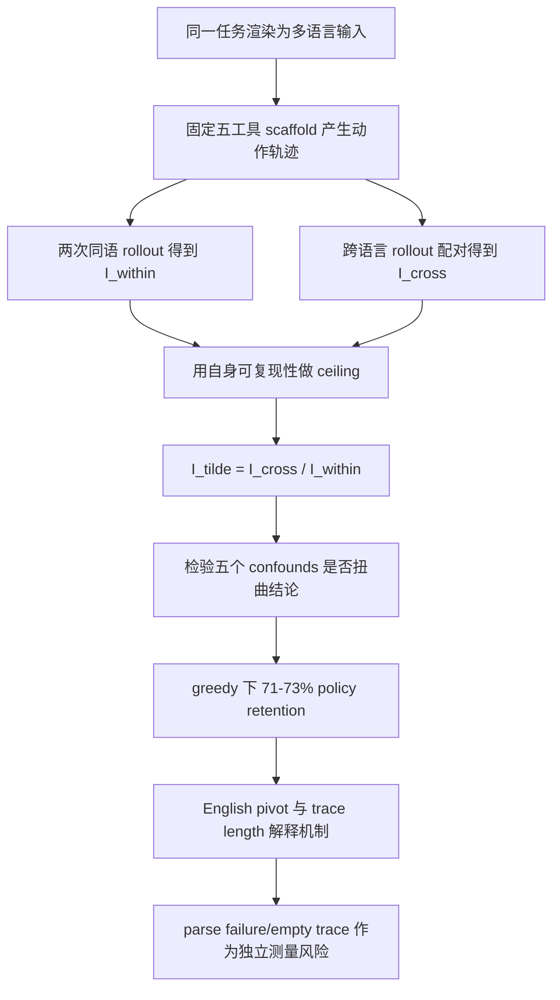
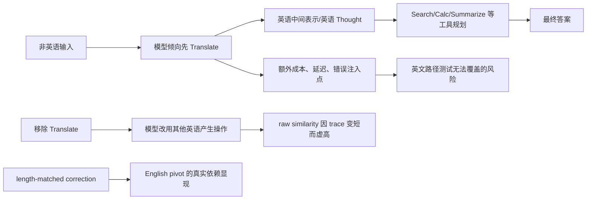

# Actions Speak Louder than Words：多语言 Agent 评测不能只看答案，还要看它到底调用了哪些工具

### 元信息与 TL;DR

| 项目 | 内容 |
|---|---|
| 论文 | Actions Speak Louder than Words: Measuring Cross-Lingual Policy Retention in Tool-Using Agents |
| 作者 | Sourabrata Mukherjee, Kalika Bali, Sunayana Sitaram |
| 机构 | Microsoft Research India |
| 官方链接 | https://arxiv.org/abs/2608.11110 |
| 版本 | arXiv:2608.11110v1, 2026-08-11 16:18:34 UTC |
| 方向 | 大模型 Agent / 多语言评测 / Tool-use policy |
| 公开材料 | arXiv PDF、HTML、两个 Hugging Face 数据集；arXiv 指向的 GitHub 仓库当前为空仓库 |

1. 这篇论文问的不是“同一个 Agent 用不同语言提问时答案是否一样”，而是“它是否走了同一条工具调用路线”。作者把可审计对象从 final answer 改成 executed action trace，因为 Agent 的成本、延迟、权限、审计和失败模式都在动作路径里。
2. 实验覆盖 8 个模型、6 个并行 benchmark、41 种语言、505 个 cell、2,382,875 次 rollout。任务使用统一 symbolic tool scaffold，工具集合是 `Search`、`Calc`、`Translate`、`Summarize`、`Finish`；工具调用只解析和比较，不真实执行。
3. 核心指标是归一化 policy retention：`I_tilde = I_cross / I_within`。`I_within` 衡量同一语言两次 rollout 的动作一致性，`I_cross` 衡量不同语言之间的一致性；这个比值回答“模型自身可复现的动作策略里，有多少在换语言后还保留”。
4. 论文指出 naive trace similarity 有五个混淆：无同语 baseline、trace length 影响、empty trace 得满分、模型自身 reproducibility ceiling、随机 chance floor。每个修正都让多语言动作差异更大，而不是更小。
5. 在 greedy decoding 下，四个 protocol-adherent frontier 模型都只保留约 71-73% 的自身动作策略；模型身份只解释 5.7% 方差，benchmark 解释 26.9%。这意味着 raw model ranking 多半是在排名采样噪声或轨迹形状，而不是多语言 Agent 能力。
6. 机制上，Agent 大量把非英语任务先转成英语再规划。`Translate` 是 adapted benchmark 中最常用工具，非拉丁脚本输入下 reasoning text 仍约 99% ASCII；移除或强制 `Translate` 的干预说明 English pivot 不是表面相关，而是 causal load-bearing。
7. 最尖锐的测量失败来自 GPT-OSS-120B：单个 trace-extraction regex 让它 76.4% rollout 无 parseable trace，测得准确率低于 2%；加入两个 worked examples 后 measured accuracy 提升 26 倍，但可读输出上的准确率几乎不动，说明修的是 harness legibility，不是模型能力。
8. 局限同样重要：工具是 symbolic 而非真实执行；released GitHub 仓库当前为空；部分 benchmark 无 gold answer 或授权限制；低资源语言合成翻译未经 native speaker 审核；71-73% 结论只适用于 greedy decoding 下的四个 adherent frontier 模型。

### 研究问题：为什么“答案一致”不等于“Agent 行为一致”？

论文把 Agent 的多语言可靠性问题重新定义为一组更细的审计问题：

| 传统多语言评测问法 | Agent 场景里的缺口 | 论文改问的问题 |
|---|---|---|
| Hindi 和 English 的 final answer 是否相同？ | 同答可能经过不同工具、不同中间翻译、不同检索顺序 | 同一任务换语言后，action trace 是否仍相同？ |
| 每个模型在多语言 QA 上准确率如何？ | 准确率不说明权限、审计、成本和失败路径 | 哪些动作策略被语言扰动改变？ |
| 非英语任务是否能得到正确答案？ | 正确答案可能依赖英语 pivot，带来额外脆弱点 | 模型是否先翻译、再规划、再回答？ |
| benchmark 分数能否排名模型？ | trace length、empty trace、chance floor 会伪造排名 | 排名前是否先剥离五个测量混淆？ |

用一句话概括：<u>这篇论文把多语言 Agent 评测从“输出语义是否对齐”推进到“可审计动作策略是否保留”</u>。

这对 Agent 安全尤其关键：

1. 权限系统通常绑定工具调用序列，而不是自然语言答案。
2. 审计日志能看见 `Search -> Translate -> Calc -> Finish`，却不一定知道最终答案背后的 reasoning 是否安全。
3. 英文回归测试如果只覆盖英文 trace，就无法证明 Hindi、Tamil、Odia 等输入下仍走同一条受控路径。
4. 一个模型在两种语言都答对，仍可能在非英语路径里多调用一次翻译、多泄露一次上下文、多绕过一次权限检查。

### 论文主张与论证路线

| Claim | Mechanism | Evidence | Boundary |
|---|---|---|---|
| 多语言 Agent 的核心测量对象应是动作策略 | 用统一五工具 scaffold 解析 `Action: ToolName(args)` trace | 8 模型、6 benchmark、41 语言、2.38M rollouts | 工具不真实执行，只研究 emitted tool-use policy |
| naive trace similarity 不可用 | 五个 confounds 会改变符号、排名或幅度 | Table 1 中从 unmatched 到 matched replicates，修正后 gap 从 `+0.0625` 到 `+0.0861`，greedy 下到 `+0.2074` | 依赖单一 trace-similarity metric `S`，未比较替代距离族 |
| frontier 模型在 greedy 下呈现相近 retention | 用 `I_cross / I_within` 去掉自身 reproducibility ceiling | 四个 adherent frontier 模型均为 71-73%；model identity 只解释 5.7% 方差 | 只限 T=0 和四个 adherent frontier 模型；小模型与 Aya 不在同一规律内 |
| English pivot 是结构性机制 | 非英语任务常先 `Translate`，reasoning text 仍近似 ASCII | Qwen3 的 50.5% tool calls 是 Translate；禁止/强制 Translate 的干预产生 dose-response | Sarvam-M 的 mandate compliance 只有 81.4%；不能推出所有模型都该强制翻译 |
| harness 解析会制造虚假失败 | 单 regex 无法解析模型可读但格式不合的工具说明 | GPT-OSS 两个 exemplars 后 measured accuracy 提升 26 倍，scorable accuracy 基本不动 | 这是 measurement pathology，不是证明 GPT-OSS 更强 |

论文的说服路径很清楚：



### 方法机制：`I_cross / I_within` 到底在修什么？

作者首先把一个任务表示成 `z`，把语言表示成 `ell`。同一个语义任务被渲染成不同语言的输入：

```text
x^(ell_i)(z), x^(ell_j)(z)
```

模型在固定 scaffold 下输出动作序列：

```text
A = [Action_1, Action_2, ..., Finish]
```

相似度函数 `S(A, B)` 比较两个动作序列。论文没有把原始跨语言相似度直接当结论，而是构造两个同样受随机 seed 影响的量：

| 符号 | 含义 | 为什么需要 |
|---|---|---|
| `I_within` | 同一语言、同一任务、两次不同 seed rollout 的 trace similarity | 给模型自身可复现性建立 baseline |
| `I_cross` | 不同语言、同一任务、不同 seed rollout 的 trace similarity | 测语言变化带来的动作差异 |
| `I_tilde` | `I_cross / I_within` | 表示换语言后保留了多少自身动作策略 |
| `c` | chance floor，由 permutation 估计 | 防止短 trace 或工具集合太小造成“随机也很像” |

公式可以写成：

```text
I_within = E_{z, ell}[ S(A_1^(ell)(z), A_2^(ell)(z)) ]
I_cross  = E_{z, ell_i != ell_j}[ S(A_1^(ell_i)(z), A_2^(ell_j)(z)) ]
I_tilde  = I_cross / I_within
```

变量解释：

| 变量 | 解释 |
|---|---|
| `z` | 一个 canonical task，例如一条阅读理解或合成工具任务 |
| `ell` | 语言 arm，例如 English、Hindi、Tamil、Odia |
| `A_1, A_2` | 同条件下不同 serving seed 产生的两条 trace |
| `S` | trace similarity，衡量工具序列相似程度 |
| `I_within` | ceiling：模型不换语言时自己能复现多少 |
| `I_cross` | effect：换语言后动作策略相似多少 |
| `I_tilde` | retention：effect 相对 ceiling 的比例 |

伪代码如下：

```text
Input:
  tasks Z
  languages L
  models M
  tool alphabet T = {Search, Calc, Translate, Summarize, Finish}
  trace similarity S

State:
  traces[model, task, language, replicate]
  within_pairs = []
  cross_pairs = []

For each model m in M:
  For each task z in Z:
    For each language ell in L:
      Generate two rollouts with same scaffold and different serving seeds
      Extract Action traces with the same parser
      If either trace is empty:
        mark parse/adherence failure and exclude that pair from retention

  For each language ell:
    Add S(trace[z, ell, r1], trace[z, ell, r2]) to within_pairs

  For each language pair ell_i != ell_j:
    Add S(trace[z, ell_i, r1], trace[z, ell_j, r2]) to cross_pairs

  Length-match both directions
  Estimate I_within, I_cross, I_tilde = I_cross / I_within
  Bootstrap at task level for intervals
  Estimate chance floor c by permutation over unrelated tasks

Output:
  policy retention by model, benchmark, temperature, and intervention

Failure boundary:
  If parse failure or empty-trace rate is high, report adherence separately and do not rank retention.
```

这个设计的关键不是公式复杂，而是它避免了一个常见偷懒：直接比较 Hindi trace 和 English trace，然后把差异叫作“语言效应”。如果模型同一语言两次运行都不稳定，那么跨语言差异必须先除以这个自身不稳定性，否则排名会变成“谁更 deterministic”。

### 实验设置：六个 benchmark 与八个模型

论文保留的 benchmark 都必须满足一个强条件：不同语言 arm 的第 `i` 行必须真的是同一个任务，而不是只和 English 配对、或者不同语言配置 row order 不一致。

| Benchmark | 角色 | 关键点 |
|---|---|---|
| FLORES-200 | adapted public benchmark | 因 Hub gating 未在 released adapted dataset 直接再分发 |
| XQuAD | adapted public benchmark | 1,189 tasks，12 languages，按 question `id` 对齐 |
| XNLI | adapted public benchmark | 2,490 tasks，15 languages；许可原因不直接再分发 |
| Belebele | adapted public benchmark | 900 tasks，16 languages；必须用 `link + question_number` 对齐 |
| XCOPA | adapted public benchmark | 100 tasks，11 languages，按 `idx` 对齐 |
| Synthetic | purpose-built | 100 agentic tasks，English 加 22 种语言，强调多步工具使用 |

Hugging Face adapted dataset 卡片进一步说明，早期数据里有几个会直接改变结论的修复：

1. Belebele 如果按 row index join，只有约 51% 行是真正平行；改用 `link + question_number` 后 900/900 对齐，gold agreement 100%。
2. XQuAD 从 1,190 去重到 1,189。
3. XCOPA 的 Turkish/Thai 常量 `question` 列通过多数投票修正，改了 120 个值。
4. XNLI/FLORES-200 不直接再分发，是因为授权和 license 边界，而不是实验中没用。

Synthetic dataset 卡片也给了一个重要边界：

1. 100 个合成 agentic tasks，每个有 English 和 22 个非英语版本。
2. 非英语字段由大模型生成并自动检查，未经过 native speaker 审核。
3. 工具调用不真实执行，因此不能把数据集当成 agent execution environment。
4. 早期版本曾有 515/2,200 个 synthetic 非英语实例退回英文、678 个实例是 romanized；当前 release 声称已做修正。

模型覆盖如下：

| 模型 | 用途 | 注意点 |
|---|---|---|
| Gemma-3-27B | frontier adherent 主比较 | dense |
| Sarvam-M | frontier adherent 主比较 | Indic-specialised dense |
| Qwen3-235B-A22B | frontier adherent 主比较 | MoE |
| Llama-4-Maverick | frontier adherent 主比较 | MoE，17B active/128 experts |
| GPT-OSS-120B | measurement pathology 分析 | 大量 parse failure，不进入主 retention 规律 |
| Gemma-3-4B | 边界测试 | 同家族同 recipe，规模小 6.75 倍 |
| Qwen3-8B | 边界测试 | 同家族不同 training mix |
| Aya-Expanse-8B | 第四 vendor / multilingual post-training | 31.2% rollout 无 parseable trace，作为 adherence failure |

### 主结果：每次修正都让语言效应更大

Table 1 的信息可以重构为：

| Estimator | `I_within` | `I_cross` | Raw gap | Length-matched | Cells > 0 |
|---|---:|---:|---:|---:|---:|
| Unmatched token budget | 0.6634 | 0.5370 | +0.1264 | +0.0625 | 14/15 |
| Matched budget, single-replicate pairing | 0.7103 | 0.6049 | +0.1054 | +0.0878 | 16/16 |
| Matched replicates, lenient exclusion | 0.6821 | 0.5711 | +0.1110 | +0.0946 | 18/18 |
| Matched replicates, `T=0.5` | 0.7033 | 0.6011 | +0.1023 | +0.0861 | 24/24 |
| Matched replicates, `T=0` | 0.8371 | 0.6064 | +0.2307 | +0.2074 | 24/24 |

这张表支撑了一个反直觉判断：

1. 如果混淆是在制造虚假语言效应，修正后 gap 应该缩小。
2. 实际上修正后 gap 变大：unmatched 的 `+0.0625` 到 matched 的 `+0.0861`，greedy 下进一步到 `+0.2074`。
3. 因此 naive pipeline 不是夸大风险，而是在压低风险。
4. 最核心的机制是 sampling noise 会降低 `I_within`，让模型看上去“跨语言没那么差”；greedy decoding 抬高 same-language ceiling 后，跨语言差异暴露出来。

Figure 2 和 Figure 3 的证据可以这样读：

| 图 | 支撑什么 | 不能证明什么 |
|---|---|---|
| Figure 2a | Greedy decoding 让 `I_within` 增加 0.134，但 `I_cross` 只增加 0.005 | 不能说明跨语言任务完全不受温度影响，只说明比较对象下的 agreement 近似不动 |
| Figure 2b | 归一化后，T=0 的模型间 spread 从 13.6 点缩到 2.6 点 | 不能拿这 2.6 点直接排名模型，因为区间和 aggregation 仍有边界 |
| Figure 2c | T=0 下 24/24 cell 的 raw gap 均为正，bootstrap interval 排除 0 | 不能证明所有 benchmark、所有语言、所有工具集都一样 |
| Figure 3 | `I_cross` 随 temperature 基本平坦，`I_within` 下滑更快 | 不能把高温下 gap 缩小解释成语言差异消失 |
| Figure 4 | 48 个 length-matched gap 全为正，T=0 的 24 个更强 | 不能证明 trace length 已经不重要；后文反而证明 length 是 causal driver |

### 为什么 raw model ranking 是危险的？

Table 2 和 Table 3 的核心在于拆开 absolute gap 与 normalized retention。

| 模型 | `T=0.5` 的 `I_tilde` | `T=0` 的 `I_tilde` |
|---|---:|---:|
| Gemma-3-27B | 0.8311 | 0.7276 |
| Sarvam-M | 0.9219 | 0.7076 |
| Qwen3-235B | 0.7855 | 0.7331 |
| Llama-4-Maverick | 0.8553 | 0.7092 |
| spread | 0.136 | 0.026 |

解释要分三步：

1. 在 `T=0.5` 下，模型间看起来差很多，Sarvam-M 的 `I_tilde` 甚至最高。
2. 到 `T=0` 后，四个模型都落在 71-73% 附近，spread 只有 2.6 percentage points。
3. 排名反转不是小问题：按 uncorrected absolute gap 排名，`T=0.5` 和 `T=0` 的 rank correlation 是 `rho = -0.80`。

Table 3 的方差分解更关键：

| 因素 | `T=0` 解释的 `I_tilde` 方差 | `T=0.5` 解释的 `I_tilde` 方差 |
|---|---:|---:|
| Model identity | 5.7% | 74.8% |
| Benchmark | 26.9% | 6.9% |
| Residual | 67.4% | 18.3% |

这说明：

1. `T=0.5` 时“哪个模型”看似最重要，但这很大程度来自 sampling noise。
2. `T=0` 后模型身份解释力下降到 5.7%，benchmark 结构反而更重要。
3. 读者不应把论文结果理解成“某模型多语言 Agent 更安全”，而应理解成“当前 frontier agentic tool-use policy retention 可能存在一个约 71-73% 的 greedy regime”。

### English pivot：模型不是直接用任务语言规划

论文最有机制感的部分是 English pivot。它不是只观察“模型有时翻译”，而是做了干预。

基础观察：

1. 在 adapted benchmark 中，`Translate` 是每个 compliant 模型最常用的工具。
2. 在 Devanagari、Tamil、Odia 等非拉丁脚本输入下，模型的 reasoning text 仍约 99% ASCII。
3. Qwen3 的 tool calls 中 50.5% 是 `Translate`，Sarvam-M 是 18.0%，这种差异给干预提供了剂量梯度。

干预设计：

| 干预 | 改动 | 观察 |
|---|---|---|
| Translate removed | 从工具表中删除 `Translate` | 所有四个模型基本不调用不存在的工具；但 raw 数字会假装变好 |
| Translate mandated | 要求非英语任务第一步必须 `Translate` | 三个模型 98.7-99.6% compliance，Sarvam-M 只有 81.4% |
| Think in task language | 要求 Thought 用任务语言写 | Gemma 非拉丁脚本 Thought 仅 0.79%，Sarvam 仅 0.08% |

关键结论不是“翻译工具总是坏”，而是：

1. 移除 `Translate` 后，模型不是少做事，而是替换成其他英语产生操作，例如 `Search`、`Calc` 或 `Summarize`。
2. Raw estimate 会误读：删除 `Translate` 让 trace 变短，短 trace 更容易相似，所以 raw 指标看似提升。
3. Length-matched 后，删除 English pivot 会按模型使用它的程度降低 cross-lingual agreement。
4. 强制 `Translate` 是否有帮助，取决于模型原本还有多少 head-room；这个预测在四个模型上预注册验证，但 magnitude 不能泛化。

可以把 English pivot 的因果链写成：



### 测量失败案例：GPT-OSS 不是不会做，而是不按 regex 写

第 6 节是这篇论文对评测工程最有用的部分。它说明 Agent benchmark 里的“格式解析”可以制造多语言失败。

GPT-OSS-120B 的现象：

| 现象 | 数字/证据 | 解释 |
|---|---:|---|
| 无 parseable trace | 76.4% rollouts | 单 regex 找不到合规 `Action:` 调用 |
| measured accuracy | 低于 2% | 解析器把可读但不合格式的输出当失败 |
| raw invariance | 反而很高 | empty trace pairs 被算成 1.0 similarity |
| 两个 worked examples 后 | measured accuracy 提升 26 倍 | 修复输出格式可解析性 |
| scorable rollouts accuracy | 几乎不动 | 模型能力没有同步变强 |

这个案例对 Agent 评测的含义很直接：

1. 单一 ReAct regex 不是中性测量工具。
2. parse failure 可能不是语言均匀分布的，因此会伪装成 cross-lingual failure。
3. empty trace 不能被当成“两个空轨迹完全一致”，否则不行动的模型会获得高 invariance。
4. 论文建议同时报告 parse-failure rate，并把超过约 20% 的模型设为 unranked。
5. Aya-Expanse-8B 也出现 31.2% 无 parseable trace，说明这不是 GPT-OSS 单例。

### 五个 confounds：为什么它们不是统计细节，而是评测定义本身

论文把五个混淆拆开，是因为每个混淆都对应一种实际评测事故。

| Confound | 表面问题 | 在 Agent 评测里的实际后果 | 论文处理 |
|---|---|---|---|
| C1 no baseline | 没有同语自一致性参照 | 把模型自己的不稳定误记为语言效应，或反过来掩盖语言效应 | 每个 cell 做两次 rollout，用 `I_within` 作为 ceiling |
| C2 trace length | 短 trace 更容易相似 | 删除工具、少做步骤、提前 `Finish` 可能被误判为更稳定 | 双向 length matching，只接受两个方向符号一致的比较 |
| C3 empty traces | 空 trace 与空 trace 相似度为 1 | 不调用工具的模型会在 raw invariance 上获益 | 任一侧 empty 就 drop pair，并单独报告 empty/parse failure |
| C4 reproducibility ceiling | 模型自身不复现 | raw gap 其实在排名 deterministic 程度 | 用 `I_cross / I_within` 归一化 |
| C5 chance floor | 五工具 alphabet 下随机 trace 也可能相似 | 小模型短 trace 的 raw retention 被 chance floor 托高 | permutation 估计 unrelated-task 相似度 |

这五项里，C2 和 C5 对小模型尤其危险：

1. 如果一个小模型倾向输出很短 trace，例如一两个工具就结束，它的随机相似度底线会天然偏高。
2. 如果评测者只看 raw retention，它可能看起来比大模型更“跨语言一致”。
3. 论文给出的反例是 Qwen3-8B：它平均 trace 很短，chance floor 高；chance-corrected 后反而落出 frontier band。
4. 因此，小模型在 Agent tool-use 评测中不应只报告平均 trace similarity，还要报告 trace length distribution、chance floor 和 parse failure。

这也解释了为什么本文不急于发模型排行榜。一个排行榜至少要满足：

1. 同一 temperature 下比较。
2. 同一 scaffold、同一工具 alphabet、同一解析器。
3. 同时报告 `I_within`、`I_cross`、`I_tilde`、chance-corrected retention。
4. 对 high empty-trace 或 high parse-failure 模型设 unranked。
5. 对每个 benchmark 分开报告，再讨论 pooled number。

### 数据修复为什么改变结论？

Hugging Face 数据卡里的修复不是清洁数据的附带工作，而是直接服务于论文主张。多语言 policy retention 需要“同一任务跨语言对齐”，这比普通 bitext 更严格。

一个典型错误是 Belebele 的 row-index join：

```text
错误做法:
  English row 42  <-> Hindi row 42

问题:
  不同语言 config 的 row order 不保证一致
  row 42 可能不是同一个 passage/question

修复:
  link + question_number 作为 alignment key
  900/900 对齐
  gold agreement = 100%
```

如果不修：

1. 跨语言 trace 差异会混入任务差异，因为模型回答的根本不是同一题。
2. `I_cross` 会被系统性压低，但这个降低不是语言导致的。
3. English pivot 的强弱也可能被错配任务污染，因为不同任务天然调用不同工具。
4. 任何后续 ablation 都会建立在错误配对上，导致干预解释失真。

Synthetic 数据的修复同样关键：

| 问题 | 数字 | 对实验的影响 |
|---|---:|---|
| 非英语实例退回英文 | 515/2,200 | 会虚假提高跨语言一致性，因为“非英语 arm”实际是英语 |
| romanized 而非 native script | 678 instances | 会削弱脚本差异测试，尤其影响 English pivot 与 ASCII reasoning 判断 |
| gold answers 曾丢失 | 全部 gold 缺失 | correctness 与 trace invariance 无法分开比较 |

这些修复说明本文不是“拿现成多语言 benchmark 套一个 Agent prompt”那么简单。作者真正做的是把 benchmark 变成可比较的过程测量对象。

### 对真实 Agent 安全评测的迁移模板

如果把本文协议迁移到真实企业 Agent，不能照搬 symbolic tools，而要把动作、参数、权限和副作用一起记录。

| 本文对象 | 真实系统对应物 | 需要新增的证据 |
|---|---|---|
| `Action: Search(args)` | 实际检索 API 调用 | query、索引范围、返回文档 ID、权限过滤日志 |
| `Action: Translate(args)` | 翻译服务或内部 pivot | 输入是否含敏感数据、翻译结果是否进入持久日志 |
| `Action: Calc(args)` | 计算工具或 notebook | 代码片段、执行环境、文件读写 diff |
| `Action: Summarize(args)` | 摘要/压缩上下文 | 原文片段是否被越权带入摘要 |
| `Finish` | 用户可见回答或下游动作 | 是否触发外部 side effect |

更严格的评测应把 retention 拆成三层：

```text
trace_retention      = 工具序列是否保留
argument_retention   = 工具参数是否保留
side_effect_retention = 环境状态变更是否保留
```

三者不能互相替代：

1. 工具序列相同，但参数可以泄露不同字段。
2. 参数相同，但权限过滤结果可能因语言触发不同 parser 或 classifier。
3. side effect 相同，也不能说明中间路径安全，因为日志或临时文件可能已经暴露信息。

因此，本文最适合作为“评测协议设计论文”来读，而不是简单的多语言能力论文。

### 数据与可复现性边界

论文和公开页面给出的可复现性证据并不完全等价，需要拆开：

| 材料 | 当前可用性 | 应如何使用 |
|---|---|---|
| arXiv PDF/HTML | 可访问 | 主论文证据来源 |
| Hugging Face adapted dataset | 可访问，包含 XQuAD/Belebele/XCOPA 三个 config | 可验证 released adapted subset 的结构、license 和对齐修复 |
| Hugging Face synthetic dataset | 可访问，含 `default` 与 `as_generated_rendering` | 可验证 100 合成任务、23 语言与机器翻译边界 |
| GitHub repository | 官方链接存在，但当前为空仓库 | 只能写作“代码链接存在但代码未落地”，不能当作代码复现证据 |
| FLORES-200/XNLI restricted build | 论文与 dataset card 说明可从授权源重建 | 需要用户自有授权和 token，不能把 released HF dataset 误当完整 6 benchmark |

这带来几个边界：

1. 论文声称 code、prompts、results 和 2.38M per-rollout traces released，但当前 GitHub 页面显示 empty repository；这可能是发布时序问题，也可能是链接尚未填充。日报写作不能替作者补全。
2. Hugging Face adapted dataset 只直接分发 XQuAD、Belebele、XCOPA；FLORES-200 和 XNLI 需要按脚本从授权源重建。
3. Synthetic 非英语任务是机器生成、机器验证，不能用于翻译质量、真实语言特征或高风险部署判断。
4. 工具调用是 symbolic，论文不测真实 tool side effects；因此它证明的是 action policy divergence，不是实际 API side effect divergence。

### 相关工作位置：它把两个评测传统接了起来

论文处在两个传统之间：

| 传统 | 代表问题 | 本文差异 |
|---|---|---|
| Agent benchmark | ReAct/Toolformer/AgentBench/GAIA 一类评测关注任务完成或最终分数 | 本文把中间 action trace 当主对象 |
| 多语言 benchmark | XTREME、MEGA、XQuAD、XNLI 等关注跨语言 final output | 本文要求同一任务在不同语言下 procedure 可比 |
| multilingual CoT/latent language | 研究模型是否在 hidden state 或 reasoning 中使用英语 | 本文用工具动作干预验证 English pivot 的行为后果 |
| factual consistency | 问不同语言是否检索同一事实 | 本文问不同语言是否执行同一过程 |

它的重要性在于把“多语言能力”从语义正确性延伸到治理层：

1. Agent 的权限边界绑定 action，不绑定 answer。
2. Agent 的审计证据是 route，而不是模型声称自己做了什么。
3. 多语言安全如果只测 final answer，会漏掉同答异路的安全差异。

### 结论与局限：研究者应该带走什么？

最值得带走的判断有四个：

1. <u>答案一致不是行为一致</u>。一个 Agent 在英文和印地语里都答对，仍可能在非英语路径中多一次翻译、多一次检索、多一个审计节点。
2. <u>Agent 多语言评测必须报告 action trace</u>。如果 benchmark 只给 final answer accuracy，它无法回答权限、成本、失败路径和审计问题。
3. <u>归一化 baseline 不是数学装饰</u>。没有 `I_within`，跨语言差异会混入模型自身不稳定性；没有 chance floor，短 trace 会伪造一致性。
4. <u>English pivot 是可干预的结构机制</u>。它不是“模型内部可能用英语”的推测，而是在工具动作层面可观察、可移除、可强制、可失败的机制。

但结论必须带边界：

| 局限 | 对解读的影响 |
|---|---|
| 工具 symbolic，不真实执行 | 不能推出真实 API 权限或 side effect 风险幅度 |
| 单一 trace similarity `S` | 可能遗漏不同工具代价、参数语义、可交换步骤 |
| `T=0` regularity 只覆盖四个 adherent frontier 模型 | 71-73% 不能泛化到小模型、所有 vendor 或高温采样 |
| 部分语言与合成数据未经 native speaker 审核 | 不能做语言质量或文化属性结论 |
| GitHub 仓库当前为空 | 代码级复现尚不能从官方 repo 完成 |
| parse failure 与 empty trace 高度依赖 harness | 评测框架本身必须作为被审计对象 |

### 继续追问：这篇论文对 Agent 安全和后续评测意味着什么？

后续研究可以沿三个方向推进：

1. **从 symbolic trace 到 executed side effect**
   - 当前 trace 不真实执行工具。
   - 下一步应把 `Search/Calc/Translate/Summarize` 换成带权限、速率限制、日志和回滚的真实 sandbox tool。
   - 目标不是只看 trace similarity，而是比较 side-effect diff：哪些文件被读、哪些 API 被调、哪些数据被带出边界。

2. **从 sequence similarity 到 policy equivalence**
   - 两条 trace 可能顺序不同但语义等价，也可能工具名相同但参数泄露不同。
   - 更好的 metric 应考虑工具成本矩阵、参数敏感性、权限等级和可交换步骤。
   - 例如 `Translate -> Search` 和 `Search -> Translate` 在安全意义上未必等价，因为前者先改变输入语义，后者先暴露原始输入。

3. **从 English pivot 观察到防御设计**
   - 如果非英语任务默认进入英语中间路径，安全 policy 不能只写目标语言或英文 prompt 约束。
   - 可以测试双轨防御：输入语言 policy、pivot 后英文 policy、工具调用前 policy 三者是否一致。
   - 也可以把 pivot 检测作为 runtime monitor：当一个非英语任务突然产生额外翻译、摘要或检索路径时，提升审计等级。

一个更严格的 Agent 安全评测协议可以写成：

```text
For each protected task:
  Render task in multiple languages
  Run two same-language replicates and two cross-language replicates
  Record:
    final answer
    action trace
    tool arguments
    side-effect diff
    parse failure / empty trace
    policy violation receipts

  Compute:
    answer accuracy
    trace retention
    side-effect retention
    permission-retention
    language-specific failure mode

  Reject a model ranking if:
    parse failure > threshold
    empty trace dominates any language arm
    chance floor is not measured
    same-language reproducibility is missing
    action trace and final answer are collapsed into one score
```

这就是本文的核心价值：它没有把多语言 Agent 安全包装成一个新排行榜，而是先证明排行榜前的测量对象还没定义清楚。对研究者来说，最重要的问题不是“哪个模型第一”，而是“我们到底在测答案、动作、权限，还是解析器能不能读懂模型输出”。
