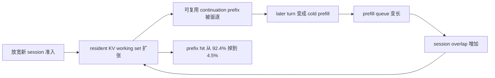

# MISA-T：混合 RL rollout 调度不能只盯 prefix hit

### 元信息与 TL;DR

| 字段 | 内容 |
| --- | --- |
| 论文 | Scheduling Mixed RL Rollouts Beyond Prefix Locality |
| arXiv | https://arxiv.org/abs/2608.11152 |
| 版本 | arXiv:2608.11152v1，2026-08-11 17:10:50 UTC |
| 作者 | Zetao Hong、Song Yuan、Yuanhao Ding、Yibo Zhu、Daxin Jiang、Zhibin Wang、Chen Tian |
| 主题 | 大模型后训练系统、混合 rollout serving、KV cache、路由层准入控制 |

- **这篇文章做什么**：它研究 RL 后训练里越来越常见的混合 rollout 服务：RLVR、RLHF、Agentic rollout 共用异步 inference pool 时，只有 prefix-aware placement 不足以控制 KV cache 竞争。
- **核心方法**：作者提出 MISA-T，即 Mix-aware Session Admission with a Time factor。它不是替换训练器、reward 或推理引擎，而是在 routing layer 做三件事：自适应 session admission、按 workload 划分受保护 KV 容量、用 session residency time 修正 KV 需求。
- **关键机制**：router 保留 trainer 指定的 workload mixture，不擅自改采样比例；它只决定一个请求是进入某个 inference instance，还是暂时 HOLD 等待，避免新 session 把已有 continuation 的可复用 KV 挤掉。
- **关键证据**：在 rollout-only ablation 中，相对 sweep-tuned cache-aware vLLM Router，MISA-T 在 Step3.7 上把 sample rate 提高 **53.3%**，在 Qwen3.6-35B-A3B 上提高 **43.6%**。
- **端到端证据**：在 matched 50-iteration Step3.7 训练中，MISA-T 把 rollout throughput 提高 **35.6%**，平均 iteration time 降低 **22.8%**，prefix hit 从 **74.5%** 提到 **96.2%**。
- **混合比例边界**：trainer 的目标 Agent/RLVR/RLHF mixture 是 **48.6/33.1/18.2%**；MISA-T 消耗比例是 **45.9/33.3/20.8%**，total-variation deviation 为 **2.71** 个百分点，低于 vLLM Router 的 **4.14**。
- **局限**：MISA-T 假设请求带有 workload label，并依赖 inference instance 及时上报 serving-state snapshot；延迟或缺失快照会影响 KV demand 与 admission cap 的估计。

### 研究问题：为什么 prefix-aware routing 不够？

- 论文的起点不是“怎样让单个请求找到 prefix 最长的机器”。
- 它真正关心的是：
  - 后训练 rollout 已经从单一 benchmark 采样，变成多个反馈范式和任务域共用推理池；
  - 同一 inference pool 里，RLVR、RLHF、Agentic trajectory 对 KV cache 的占用时间和增长形态完全不同；
  - placement 只能决定请求放在哪里，不能决定新 session 是否应该被准入。

| 旧问题 | 新问题 |
| --- | --- |
| 哪台机器有最长可复用 prefix？ | 多少个不同 session 可以同时占用受保护 KV 容量？ |
| 如何减少 prefill？ | 如何防止新 session 造成 KV churn，把未来 continuation 变成 cold prefill？ |
| 如何提高单类请求吞吐？ | 如何提高混合 rollout completion rate，同时不扭曲 trainer 指定的 mixture？ |
| 路由器只做 placement | 路由器还要做 session admission 与 class quota |

- 作者的隐含判断是：在 RL post-training 中，serving layer 已经进入训练闭环。
- rollout 不只是“模型服务请求”，而是会影响训练迭代时间、样本返回速度、策略版本 staleness 和混合任务比例的系统组件。
- 这让路由层从普通负载均衡器，变成了训练系统里的资源控制器。

### 背景：三类 rollout 的资源形状不一样

论文把混合 workload 拆成三类：

| Workload | 请求结构 | token 形态 | KV 行为 | 主要成本 |
| --- | --- | --- | --- | --- |
| RLVR | 单轮 | 短输入、长输出 | decode 期间持续增长 | 长 decode |
| RLHF | 单轮 | 输入与输出较均衡 | 中等 residency | prefill + decode |
| Agentic | 多轮 | 长输入、短输出 | turn 之间保留 long prefix | prefix reuse + residency |

- 这个表的意义不在于给 RLVR/RLHF/Agent 做永久定义。
- 它说明同一数量的 session，不代表同一数量的 KV 压力。
- 对 Agentic rollout 来说，工具调用期间模型没有生成 token，但 KV 仍可能需要留在 cache 里等待下一轮 continuation。
- 因此，只看模型 inference time 会低估 agent session 对 cache 的占用。

论文给出一个 128K context 限制下的在线混合 trace：

| Workload | Requests | Sessions | Input p50 | Input p95 | Input p99 | Output p50 | Output p95 | Output p99 |
| --- | ---: | ---: | ---: | ---: | ---: | ---: | ---: | ---: |
| Agent | 73,659 | 1,058 | 37,757 | 103,209 | 123,207 | 148 | 1,612 | 3,930 |
| RLHF | 599 | 599 | 60 | 2,564 | 2,564 | 7,344 | 24,447 | 37,101 |
| RLVR | 809 | 809 | 156 | 1,129 | 1,277 | 47,583 | 130,815 | 130,958 |

- Agent 的输入 p95 超过 **103K**，但输出 p50 只有 **148**。
- RLVR 的输入很短，但输出 p95 超过 **130K**。
- RLHF 位于中间，既有 prompt prefill，也有较长 response decode。
- 这组数字解释了为什么“prefix hit rate 高”仍不足以完整描述效率：
  - Agent 需要保留长 prefix；
  - RLVR 会用长 decode 拉高活跃 KV；
  - RLHF 会在 prefill 与 decode 之间消耗较均衡资源。

Agent task-state occupancy 进一步显示：

| Model | Model request | Tool / orchestration gap |
| --- | ---: | ---: |
| Step3.7 | 93.4% | 6.6% |
| Qwen3.6-35B-A3B | 77.3% | 22.7% |

- Qwen3.6-35B-A3B 的工具编排 gap 达 **22.7%**。
- 对 routing layer 来说，这段 gap 不是“无成本等待”：
  - 如果保留 KV，它占 residency；
  - 如果驱逐 KV，下一轮要重做 cold prefill；
  - 如果无节制准入新 session，系统会进入 prefix eviction 正反馈。

### 论文主张：准入是 KV 承诺


- Figure 1 的关键不是画了一个新训练框架。
- 它把 MISA-T 放在 router/scheduler 位置：
  - trainer 释放 rollout tasks，并限制最大并发与策略版本 staleness；
  - rollout workers 把任务转成模型请求；
  - router 做 request admission 与 instance selection；
  - agent server 继续维护工具调用和 sandbox 交互。
- 这个定位很重要：
  - MISA-T 不修改 model execution；
  - 不改变 physical KV allocation；
  - 不改变 agent runtime；
  - 只依赖 request metadata、runtime metrics、session-cache snapshots。

作者的核心 claim 可以写成：

| Claim | Mechanism | Evidence | Boundary |
| --- | --- | --- | --- |
| 混合 rollout 需要 admission control | 新 session 会承诺未来 KV 增长、continuation 与 turn 间 residency | high-load vLLM Router 在 Qwen3.6 上 prefix hit 只有 4.5% | 需要 session identity 与 workload label |
| class-agnostic cap 不够 | 不同 class 的 KV footprint 和 residency 不一样 | MISA 相对 Session Admission 提升 rollout throughput | quota 依赖近期长度统计 |
| residency-time weighting 有额外收益 | 用 block-time demand 分配受保护容量 | MISA-T 在 Step3.7/Qwen3.6 上继续超过 MISA | snapshot 延迟会影响估计 |
| serving 改进不能破坏 trainer mixture | router 只 HOLD 或 place 请求，不改任务标签和采样来源 | TV deviation 从 4.14 降到 2.71 | 有限 50-iteration 结果，不是长期收敛证明 |

### 方法机制：MISA-T 的三层控制


MISA-T 的路由逻辑可以拆成三层：

1. **Adaptive session admission**
   - 已经在实例上的 session continuation 优先保护；
   - 新 session 需要看全局 protected session cap 是否还有 headroom；
   - 没有 headroom 的请求进入 HOLD，并被周期性重评估。

2. **Workload-aware session caps**
   - 全局 cap 不把所有 workload 混在一起；
   - 按 Agent/RLVR/RLHF 等 class 估计 KV footprint；
   - 给每个 class 分配 soft quota，避免某类 session 独占 protected KV。

3. **Residency-time-aware accounting**
   - 同样大小的 KV footprint，如果保留时间不同，真实压力也不同；
   - Agent 的工具间隔、RLVR 的长 decode、RLHF 的中等 residence 都要纳入 block-time；
   - class quota 由空间需求扩展为 `KV blocks * residency time`。

可以把控制流程写成伪代码：

```text
Input:
  request r with session s_r, workload class b_r
  candidate instance w
  protected cap K_w(t)
  active sessions O_w, pending sessions P_w
  class caps K_{w,b}(t)

State:
  session-cache snapshots
  class footprint estimates k_bar_b
  class residency estimates T_hat_b
  prefix-hit reference h*_w(t)
  observed prefix hit h_hat_w(t)

Loop for each scheduling epoch:
  update overload pressure G_w(t) = max(0, h*_w(t) - h_hat_w(t))
  compute global session cap K_w(t)
  compute per-class block-time demand R_{w,b}
  convert class quota into K_{w,b}(t)

Decision for request r:
  if s_r in O_w or s_r in P_w:
      admit continuation to preserve locality
  else if global cap has headroom and class cap b_r has headroom:
      admit new session and mark as pending
  else:
      HOLD request and re-evaluate later

Output:
  PLACE on instance w, or HOLD without deleting demand from ledger

Failure boundary:
  if workload label is missing or snapshots are stale,
  class demand and cap estimates can temporarily drift.
```

### 公式：从 prefix cost 到 block-time demand

论文先定义 placement 层的 prefill cost：

```math
\hat{c}_{r,w}(t)=d_w(t)+\frac{L_r-H_{r,w}(t)}{\mu_w(t)}
```

变量含义：

| 变量 | 含义 |
| --- | --- |
| `L_r` | 请求 `r` 的 prompt length |
| `H_{r,w}(t)` | 在 instance `w` 上可复用 prefix |
| `d_w(t)` | instance `w` 的 prefill backlog delay |
| `mu_w(t)` | measured prefill throughput |

- 这个公式仍是 prefix-aware placement 视角：
  - 复用 prefix 越多，`L_r-H_{r,w}(t)` 越小；
  - queue 越长，`d_w(t)` 越大。
- 但它不能告诉 router 新 session 是否应该进入 cache。
- 因此论文引入 session 的 KV block-time：

```math
Z_s=\int k_s(t)dt \approx \bar{k}_s T_s
```

变量解释：

| 变量 | 含义 |
| --- | --- |
| `k_s(t)` | session `s` 在时刻 `t` 保留的 KV blocks |
| `T_s` | session 的有效 residency duration |
| `bar{k}_s` | conservative reference footprint |
| `Z_s` | session 对 KV 的 block-time 占用 |

- 对 Agent workload，`T_s` 包含工具执行间隔。
- 这一步是 MISA-T 与普通 prefix router 的分水岭：
  - prefix router 主要看“这次请求能复用多少”；
  - MISA-T 看“准入这个 session 会把多少 KV 在多长时间里锁在 protected set 里”。

protected KV 约束写成：

```math
\sum_{s \in \mathcal{P}_w(t)} \tilde{k}_s(t) \le C_w
```

- `P_w(t)` 是 instance `w` 上受保护 session 集合；
- `tilde{k}_s(t)` 是 controller 的 reserved-footprint estimate；
- `C_w` 是受保护 KV budget。

这不是物理分配器的硬内存公式，而是 routing layer 的逻辑安全线：只要 protected set 的估计占用不过量，就更可能保持 continuation 的 prefix locality。

### 目标函数：吞吐要高，但不能改 trainer 合约

论文把 rollout completion rate 定义为：

```math
S_\pi(T)=\frac{1}{T}\sum_{b\in\mathcal{B}}N_b^\pi(T)
```

其中：

| 符号 | 含义 |
| --- | --- |
| `B` | workload classes，例如 Agent、RLVR、RLHF |
| `N_b^pi(T)` | 策略 `pi` 在时间 `T` 内交付给 trainer 的 class-b 完整 rollout 样本数 |
| `S_pi(T)` | 完整 rollout 样本吞吐，而不是 request RPM |

- Agent trajectory 必须在所有 turn 和工具交互完成后才算一个样本。
- 所以 request throughput 可能很高，但 rollout sample throughput 不一定高。
- 这点对 RL 训练很关键，因为 trainer 等的是完整样本、reward/verifier 结果和 group completion，不是单个 HTTP 请求。

设计目标是：

```math
\max_{\pi}\liminf_{T\rightarrow\infty}S_\pi(T)
\quad
\text{subject to}
\quad
Q_b^\pi(T)=o(A(T)),\ \forall b\in\mathcal{B}
```

解释：

- `A_b(T)` 是 trainer 到时间 `T` 已释放的 class-b rollout units；
- `Q_b^pi(T)=A_b(T)-N_b^pi(T)` 是 class-b backlog；
- backlog 条件要求 router 不要长期拖延某一类 workload；
- 如果 trainer 释放比例收敛到目标 mixture `rho`，且各类 backlog 相对总量不持续增长，完成样本比例也会接近 `rho`。

这就是论文标题里 “Beyond Prefix Locality” 的真实含义：

- 不否认 prefix locality；
- 但把它纳入 trainer mixture contract 与 protected KV capacity constraint；
- 让 routing policy 既追吞吐，也不能把训练数据分布服务层扭歪。

### MISA：先按空间 KV 需求分配 quota

MISA-T 的中间版本 MISA 先不看时间，只看空间 footprint：

```math
S_{w,b}=N_{w,b}\bar{k}_b
```

| 变量 | 含义 |
| --- | --- |
| `N_{w,b}` | instance `w` 上 class `b` 当前可见的 unfinished session demand |
| `bar{k}_b` | class `b` 的保守 resident block 估计 |
| `S_{w,b}` | class-b 的空间 KV demand |

然后按 demand 分配 block quota：

```math
M^{space}_{w,b}
=C_w\frac{S_{w,b}}{\sum_{b'}S_{w,b'}}
```

再转成 session cap：

```math
K^{space}_{w,b}
=\max\left\{1,\left\lfloor\frac{M^{space}_{w,b}}{\bar{k}_b}\right\rfloor\right\}
```

- 这样做的好处：
  - class demand 大，quota 会变大；
  - footprint 大，能容纳的 session 数会下降；
  - 不同 class 不再争同一个无差别 session cap。
- 这样做的缺口：
  - 它仍把“占用 1 秒”和“占用 20 秒”的 KV footprint 视作相同压力；
  - 对 Agent 这种 turn 间保留长 prefix 的 workload，仍可能低估真实 block-time。

### MISA-T：再把 residency time 加进去

MISA-T 用 block-time demand 替换空间 demand：

```math
R_{w,b}=S_{w,b}\hat{T}_b=N_{w,b}\bar{k}_b\hat{T}_b
```

其中 `T_hat_b` 是 class `b` 最近观测到的 useful KV residency duration。

如果 class `b` 获得 block quota `M_{w,b}`，它的 backlog drain time 近似为：

```math
\tau_{w,b}\approx\frac{N_{w,b}\bar{k}_b\hat{T}_b}{M_{w,b}}
```

所以按 `R_{w,b}` 分配 quota 可以近似平衡各类 workload 的 drain time：

```math
M^{time}_{w,b}
=C_w\frac{R_{w,b}}{\sum_{b'}R_{w,b'}}
```

```math
K^{time}_{w,b}
=\max\left\{1,\left\lfloor\frac{M^{time}_{w,b}}{\bar{k}_b}\right\rfloor\right\}
```

这个设计有两个容易忽略的点：

- `T_hat_b` 只影响 budget share，不直接把 session cap 除以时间。
- `bar{k}_b` 仍负责把分到的 blocks 转成 session 数。

因此 MISA-T 不是简单惩罚慢 workload，而是承认：

- residency 长的 workload 需要更大 protected budget；
- backlog 积累的 class 会获得更大 quota；
- backlog 被排空后，quota 会自然下降；
- router 仍不改变 trainer release 的 label 和 mixture。

### 实验设置：它到底和谁比？

论文使用两类实验：

| 实验 | 目的 | 模型 / 系统 |
| --- | --- | --- |
| matched end-to-end training | 看 serving 改进是否缩短训练迭代，同时不破坏 task score 与 mixture | Step3.7，50 iterations |
| rollout-only ablation | 隔离 routing policy 对吞吐和 prefix hit 的作用 | Step3.7 与 Qwen3.6-35B-A3B |
| CPU KV offloading compatibility | 看 MISA-T 能否和 CPU-backed KV tier 共存 | Step3.7 rollout-only |

baseline 和变体包括：

| Router | 作用 |
| --- | --- |
| vLLM Router sweep | cache-aware placement baseline，并对 static concurrency 做 sweep |
| vLLM Router 128K-safe | 根据 128K context KV 容量保守配置 |
| Session Admission | class-agnostic adaptive admission |
| MISA | session admission + workload-specific caps |
| MISA-T | MISA + residency-time weighting |
| vLLM Router high-load | 给 Qwen3.6 baseline 同样宽松并发上限，用来复现 eviction feedback |

硬件与模型细节：

- Step3.7 是 **196B-A11B sparse-MoE**。
- Step3.7 使用 **两台 NVIDIA H200 inference nodes**，每台运行一个 TP=8 replica。
- Qwen3.6-35B-A3B 使用 **16 张 NVIDIA H100 80GB HBM3**，组织为四个 TP=4 replicas。
- vLLM Router 的 static-concurrency sweep：
  - Step3.7 以 **32** 为步长，最佳观测并发为 **128**；
  - Qwen3.6 以 **16** 为步长，最佳观测并发为 **48**。

### 端到端结果：快了，但不能牺牲训练混合比例


Table 4 的核心结果如下：

| Router | Iter. time | RPM | Sample rate | Prefill TPS | Decode TPS | Prefix hit | Agent | RLVR | RLHF |
| --- | ---: | ---: | ---: | ---: | ---: | ---: | ---: | ---: | ---: |
| vLLM Router | 0.0% | 0.0% | 0.0% | 0.0% | 0.0% | 74.5% | 48.3 | 29.4 | 22.4 |
| MISA-T | -22.8% | +32.5% | +35.6% | +33.6% | +38.0% | 96.2% | 45.9 | 33.3 | 20.8 |

- 结果支持三个判断：
  - 第一，MISA-T 不是只提高 prefix hit，它同时提高 request、prefill、decode 和 sample rate。
  - 第二，端到端 iteration time 下降 **22.8%**，说明 serving 改进能穿透到训练循环。
  - 第三，completed workload mixture 没有被 serving policy 大幅扭曲。

target mixture 与 consumed mixture：

| 指标 | Agent | RLVR | RLHF | TV deviation |
| --- | ---: | ---: | ---: | ---: |
| Trainer target | 48.6 | 33.1 | 18.2 | - |
| vLLM Router consumed | 48.3 | 29.4 | 22.4 | 4.14 |
| MISA-T consumed | 45.9 | 33.3 | 20.8 | 2.71 |

- 这张表是论文中很关键的证据。
- 如果一个 router 只靠偏置某类短任务来刷吞吐，它可能让 RL 数据分布偏离 trainer 目标。
- MISA-T 的论点是：提升吞吐来自更好的 admission 与 KV 保护，而不是偷换 workload mixture。
- 作者还报告，在 SWE-Pro、SWE-Verified、SWE-MTLG 上，同一训练 horizon 下 MISA-T 与 vLLM Router 的 pass@4 绝对差异低于 **0.5** 个百分点。

### Rollout-only 消融：三层机制各自贡献什么？

Table 5 给出了固定 checkpoint 下的 rollout-only serving 结果：

| Model | Router | Sample rate | RPM | Prefill TPS | Decode TPS | Prefix hit |
| --- | --- | ---: | ---: | ---: | ---: | ---: |
| Step3.7 | vLLM Router 128K-safe | -21.7% | -27.8% | -29.5% | -22.1% | 97.1% |
| Step3.7 | vLLM Router sweep | 0.0% | 0.0% | 0.0% | 0.0% | 95.9% |
| Step3.7 | Session Admission | +11.7% | +22.7% | +20.5% | +16.8% | 97.1% |
| Step3.7 | MISA | +23.3% | +28.8% | +25.4% | +19.8% | 97.3% |
| Step3.7 | MISA-T | +53.3% | +45.5% | +40.4% | +26.5% | 97.8% |
| Qwen3.6-35B-A3B | vLLM Router 128K-safe | -12.2% | -10.2% | -9.0% | -6.8% | 95.9% |
| Qwen3.6-35B-A3B | vLLM Router sweep | 0.0% | 0.0% | 0.0% | 0.0% | 92.4% |
| Qwen3.6-35B-A3B | Session Admission | +19.3% | +23.7% | +23.4% | +7.8% | 96.3% |
| Qwen3.6-35B-A3B | MISA | +30.9% | +28.9% | +30.2% | +12.3% | 79.2% |
| Qwen3.6-35B-A3B | MISA-T | +43.6% | +37.5% | +36.5% | +18.3% | 95.3% |
| Qwen3.6-35B-A3B | vLLM Router high-load | -55.2% | -52.5% | -57.3% | -38.5% | 4.5% |

这组消融可以分四层读：

1. **保守 128K-safe 配置不是免费午餐**
   - 它能维持较高 prefix hit；
   - 但 Step3.7 sample rate 下降 **21.7%**；
   - 说明只靠保守并发会牺牲吞吐。

2. **Session Admission 已经能打断 eviction feedback**
   - Step3.7 sample rate 提升 **11.7%**；
   - Qwen3.6 sample rate 提升 **19.3%**；
   - 这证明“准入”本身比单纯 placement 多解决了一个问题。

3. **MISA 的 class quota 有独立贡献**
   - 相对 Session Admission，MISA 在 Step3.7 又提升 **10.4%** rollout throughput；
   - 在 Qwen3.6 上又提升 **9.7%**；
   - 说明 workload-aware capacity allocation 不只是复杂化设计。

4. **MISA-T 的 residency weighting 是最大增益来源之一**
   - 相对 MISA，MISA-T 在 Step3.7 进一步提升 **24.3%**；
   - 在 Qwen3.6 上进一步提升 **9.7%**；
   - Step3.7 的差异更大，说明 residency-time signal 在特定 workload mix 下非常关键。

最尖锐的对照是 Qwen3.6 high-load baseline：

- 给 vLLM Router 同样宽松的并发上限，并不会自动带来更高吞吐。
- 它的 prefix hit 从 sweep baseline 的 **92.4%** 掉到 **4.5%**。
- request throughput 下降 **52.5%**，prefill TPS 下降 **57.3%**，decode TPS 下降 **38.5%**。
- 这正是作者说的正反馈：
  - admitted sessions 增加；
  - resident KV working set 变大；
  - continuation prefix 被驱逐；
  - later turn 变成 cold prefill；
  - queue 和 session overlap 变长；
  - 进一步制造驱逐压力。

### Controller 行为：cap 收缩不是静态限流


论文用 Figure 4 展示 controller timeline：

- base cap 跟随 moving session-length reference；
- current cap 负责真正 gate new-session admission；
- prefix-hit degradation 被确认后，controller 临时降低 current cap；
- 红色区间表示相对近期健康 hit rate 的 pressure windows；
- 早期 long-tailed session growth 会触发更多修正；
- 随着 completed-session observations 更新 reference，cap 更对齐，pressure 变少。

这说明 MISA-T 的 cap 不是手写静态值：

| 控制信号 | 作用 | 边界 |
| --- | --- | --- |
| moving completed-session length | 更新 baseline cap | 对突发长尾有滞后 |
| prefix-hit reference | 识别可达到的健康命中水平 | 不是固定 hit-rate 阈值 |
| waiting queue | 识别持续排队压力 | 需要过滤短期抖动 |
| pending session set | 防止 snapshot 间过度准入 | 依赖 session visibility |
| held demand ledger | HOLD 不等于丢弃需求 | 需要周期性重评估 |

- 这个设计对生产系统有启发：
  - admission controller 要认识到 telemetry 延迟；
  - 压力信号需要 confirmation 和 slope checks；
  - pending state 是防止过度乐观的重要缓冲。

### CPU KV offloading：MISA-T 与物理 cache 层互补


论文还测试了 CPU KV-cache offloading：

- 实验只改变 serving option：
  - MISA-T concurrency configuration 不变；
  - CPU tier 配置 **1.3 TB** KV-cache capacity；
  - CPU 维护 GPU resident KV-cache state 的 backup copy。
- 结果显示：
  - warm-up 后 GPU KV-cache usage 在 steady-state 多数时间接近或超过 **90%**；
  - 相对 no-offload trace，CPU offloading 让 GPU KV cache 保持更高利用；
  - mean per-replica RPM 提升 **35.6%**。

这个实验支持一个分层判断：

| 层 | 负责什么 |
| --- | --- |
| MISA-T routing layer | 控制逻辑 session admission、class quota、residency-aware protected capacity |
| CPU/GPU KV offloading layer | 决定可复用 KV state 物理上在 GPU 还是 CPU |
| 推理引擎 | 执行模型、维护底层 KV blocks、服务实际请求 |

- MISA-T 不与 offloading 竞争同一职责。
- 它控制“哪些 session 值得被保护”，offloading 控制“保护的 state 放在哪里”。
- 对大规模后训练系统来说，这个分层比单点优化更重要。

### 相关工作位置：它补的是路由层缺口

论文把自己放在几条线之间：

| 方向 | 已有关注 | MISA-T 的位置 |
| --- | --- | --- |
| PagedAttention / vLLM | KV memory management | 继续复用底层能力，不替代 |
| RadixAttention / SGLang | structured generation 的 prefix reuse | 承认 prefix reuse 重要，但认为它不是全部 |
| Preble / DLPM / k-LPM | prefix-aware load balancing、fairness、latency | 从 placement 扩展到 session admission 和 class quota |
| AReaL / DORA 等异步 RL 系统 | rollout 与 training 并行化 | 在 shared inference pool 内控制混合 rollout serving |
| long-output RL / agentic serving workload studies | 描述长输出或 agent workload | 把观测到的异质性转成可执行 admission policy |

它的贡献不是“发现 KV cache 很重要”。

更准确地说：

- 它把 mixed RL rollout serving 明确建模为 trainer contract 下的 routing 问题；
- 它把 session admission 从静态 concurrency tuning 改成在线控制；
- 它把 workload heterogeneity 从经验观察转成 class-specific quota；
- 它把 agentic turn gap 这类非模型执行时间纳入 KV residency accounting。

### 失败案例与证据边界

论文最有价值的失败案例是 high-load vLLM Router：

```text
More concurrency
  -> more distinct sessions admitted
  -> larger resident KV working set
  -> reusable continuations evicted
  -> later turns become cold prefill
  -> queue and overlap grow
  -> still more eviction pressure
```

用 Mermaid 表示这个正反馈：



这条链说明：

- 并发上限不是越大越好；
- prefix-aware placement 在准入过量时会失效；
- 只看“当前请求能否复用 prefix”会低估未来 continuation 的损失；
- session-level accounting 是必要的中间层。

但证据边界也要清楚：

| 边界 | 影响 |
| --- | --- |
| 需要 workload labels | 没有可靠 label 时，class quota 会失效或退化 |
| 依赖及时 snapshots | delayed/incomplete snapshots 会让 KV-demand estimate 与 cap 短期失准 |
| 实验集中在两个模型家族 | Step3.7 与 Qwen3.6 结果不能自动外推到所有 MoE/密集模型 |
| workload mix 来自作者部署 trace | 其他训练组织、任务域、工具执行时间可能改变收益 |
| pass@4 差异只在三个 SWE benchmark 上报告 | 只能说明该设置下没有明显任务分数回退 |
| 未给出开源实现入口 | 复现实验需要近似重建 routing metrics、session identity 与 cache snapshots |

### 进一步拆解：为什么这是后训练问题，不只是 serving 问题？

这篇论文容易被误读成普通推理系统优化。更准确的读法是：它讨论的是后训练闭环中的 rollout 供给侧控制。

如果只看 online serving，我们通常关心：

- 单请求 latency；
- 总 request per minute；
- GPU 利用率；
- prefix cache hit；
- 请求排队时间。

但 RL post-training 还多出一层训练语义：

| 后训练语义 | 对 serving 的额外要求 |
| --- | --- |
| on-policy 或近似 on-policy | 样本不能无限期滞后于当前策略版本 |
| group completion | 同一 prompt 的多个 response 常常要一起交给 reward/verifier 或 advantage estimator |
| verifier / reward pipeline | 完整 rollout 返回速度影响训练器何时能更新 |
| 多域 mixture | serving 不能因为某类样本短或便宜就改变训练分布 |
| Agent 环境交互 | 模型请求和工具执行交替，cache residency 横跨非模型时间 |

所以 MISA-T 实际处理的是一个跨层问题：

1. **训练器层**
   - 决定采样比例、最大并发、策略版本 staleness；
   - 不希望 router 偷偷改变训练任务组成。

2. **rollout worker 层**
   - 把训练任务转成模型请求；
   - 维护 rollout unit、group identity 和 session identity。

3. **router 层**
   - 选择实例；
   - 控制新 session 准入；
   - 保护已有 continuation 的 prefix locality。

4. **inference engine 层**
   - 执行 prefill 和 decode；
   - 维护物理 KV block；
   - 上报 cache snapshot 和 throughput metrics。

这个分层解释了为什么论文反复强调 trainer contract。MISA-T 的野心不是让 router 决定训练该学什么，而是让 router 不要因为局部资源拥塞破坏 trainer 原本想采的样本结构。

### 和近期后训练系统工作的区别

把它和最近常见后训练系统工作并排看，定位会更清楚：

| 工作类型 | 典型问题 | MISA-T 是否直接解决 |
| --- | --- | --- |
| rollout 生成加速 | speculative decoding、partial rollout、长尾 response | 不直接改生成算法，但改善混合请求准入 |
| advantage / reward 归因 | mask、observation span、outcome reward 传递 | 不改 estimator，但确保 rollout unit 更快返回 |
| RL 框架工程 | actor/rollout/reward/critic 同步、权重更新、数据缓冲 | 不替代框架，只作为 shared inference pool 的 router policy |
| Agent 安全 harness | 工具权限、持久化状态、攻击链评分 | 不做安全评测，但 agent session 的长 prefix 与 tool gap 是其 workload 之一 |
| KV offloading / cache 管理 | 物理 cache 放 GPU 还是 CPU、如何分页或换出 | 不做物理分配，但决定哪些 session 逻辑上应被保护 |

这让 MISA-T 的贡献更像一个接口契约：

- training stack 需要向 serving layer 标注 `workload_class`、`session_id`、`rollout_unit_id`、`group_id`；
- serving layer 需要向 router 提供 session-cache snapshot、prefix hit、prefill throughput、queue pressure；
- router 需要向训练侧保持 mixture fidelity，而不是只返回“我更快了”。

如果这些字段缺失，MISA-T 会退化：

- 没有 `session_id`，无法判断 continuation；
- 没有 `workload_class`，无法做 class quota；
- 没有 completed-session length history，`bar{k}_b` 会不稳；
- 没有 residency observation，`T_hat_b` 只能用粗糙先验；
- 没有 group identity，可能不知道同一 prompt 的 sibling rollouts 正在等待。

### 复现与落地时应该检查什么？

如果研究者或工程团队想复现 MISA-T，不应只问“公式有没有实现”。更关键的是先检查系统能不能提供足够观测。

| 检查项 | 为什么重要 | 不满足时的风险 |
| --- | --- | --- |
| session 标识是否稳定 | 判断 continuation 与 new session | 把 continuation 当新 session HOLD 或冷路由 |
| workload label 是否可信 | 按 class 分配 protected KV | 某类 workload 被错误限流或过度准入 |
| cache snapshot 是否及时 | cap 基于 active/pending/protected session | snapshot 滞后导致过度准入 |
| prefix hit reference 是否自适应 | overload pressure 不能用固定阈值 | 长上下文 workload 被误判为异常 |
| HOLD 是否保留 demand ledger | 暂停不等于需求消失 | backlog 被低估，mixture 被服务层扭曲 |
| group rollout 是否可见 | 同组样本可能共同决定训练步 | sibling response 被拆散，训练等待更久 |
| 权重同步是否纳入实验 | 更新权重会清空 prefix cache | rollout-only 结果高估端到端收益 |

这也解释了为什么作者同时做 rollout-only 和 end-to-end：

- rollout-only 可以隔离 router policy；
- end-to-end 可以暴露权重同步、训练迭代、reward/verifier 等闭环成本；
- 两者都需要，否则容易把 serving 微基准误读成训练系统收益。

### 对 Agent workload 的特殊意义

Agentic rollout 在这篇论文里不是主角，但它是最能说明问题的 workload。

一个多轮工具调用轨迹可能长这样：

```text
turn 1 model request
  -> tool call
  -> sandbox execution / browser / code run
  -> observation appended
turn 2 model request with long accumulated prefix
  -> tool call
  -> more observation
turn 3 model request
  -> final answer or task result
```

对普通 request scheduler 来说，工具执行期间似乎没有模型负载。

对 KV-aware rollout router 来说，这段时间有三种选择：

- 保留 KV，等待下一轮 continuation；
- 驱逐 KV，释放容量但下一轮重做 prefill；
- 把新 session 放进来，冒着已有 agent session 被挤掉的风险。

MISA-T 选择把这段等待纳入 residency time，而不是假装它不存在。这一点对 coding agent、browser agent、MCP tool agent 都有意义，因为这些系统的真实瓶颈常常不是单次 decode，而是多轮状态能否被稳定保留下来。

### 哪些结论不能从论文推出？

为了避免过度外推，需要把不能推出的结论单独列出来：

| 不能推出的结论 | 为什么 |
| --- | --- |
| MISA-T 一定优于所有推理路由器 | 对照集中在 vLLM Router baseline 与作者系统设置 |
| 高 prefix hit 一定代表训练更快 | 128K-safe baseline prefix hit 高但吞吐下降 |
| Agent workload 一定要获得最大 quota | quota 来自当前需求、footprint 和 residency，不是固定偏好 |
| 只要加 CPU offloading 就不需要 admission | offloading 扩展物理容量，不能替代逻辑准入 |
| router 可以随意改变 workload mixture | 论文目标恰恰是保持 trainer mixture contract |
| pass@4 不变说明所有任务质量不变 | 只报告 SWE-Pro、SWE-Verified、SWE-MTLG 上低于 0.5 个百分点差异 |

这组边界让文章的结论更可信：作者没有把 MISA-T 包装成通用后训练框架，而是把它限制在 routing-layer policy，并明确它需要 label、snapshot 和近期统计。

### 研究者视角：这篇文章改变了什么理解？

我认为这篇文章的价值在于把后训练系统里的 rollout serving 从“吞吐工程”提升到“训练合约保护”。

可以分三点看：

1. **RL rollout 的单位不是 request**
   - Agentic trajectory 需要多轮模型请求和工具执行；
   - RLVR/RLHF 需要完整样本和 reward/verifier；
   - trainer 等的是 rollout unit，而不是单个 request。

2. **KV cache 是跨时间资源**
   - 一次准入会影响未来 continuation；
   - tool gap 期间没有模型 token 生成，但 cache residency 仍在；
   - 因此 block-time 比单点 KV footprint 更接近真实压力。

3. **Serving policy 不能偷偷改训练数据分布**
   - 如果短样本总是更容易被服务，训练会消耗偏斜 mixture；
   - 如果 Agent long-prefix session 被频繁驱逐，agentic rollout 会变慢并拖累训练；
   - 所以 router 要在吞吐与 mixture fidelity 之间守住 trainer contract。

这对后续研究提出几个问题：

- **对 GRPO / DAPO / RLHF 训练框架**：
  - 是否应该把 rollout serving metrics 暴露给 trainer？
  - trainer 的 sampling mixture 是否应根据 serving pressure 做可审计的反馈调节？
  - 如果调节了，怎么区分“系统优化”与“训练分布漂移”？

- **对 Agent RL**：
  - agent sandbox、工具执行、浏览器/代码环境等待时间是否都应进入 residency accounting？
  - 多 Agent handoff 会不会产生更长的 retained-context window？
  - session identity 在跨工具、跨服务、跨进程时如何稳定标注？

- **对推理系统**：
  - prefix hit rate 应该和 rollout sample throughput、TV mixture deviation 一起报告；
  - 单独追求 GPU occupancy 或 RPM 可能掩盖训练样本层面的偏差；
  - KV offloading 与 routing admission 应该作为两个层次共同设计。

### 结论与局限

- MISA-T 的核心贡献不是一个更聪明的 hash 路由器。
- 它把混合 RL rollout 的路由问题重新定义为：
  - 在 trainer 指定的 workload mixture 下；
  - 控制 new session admission；
  - 保护 continuation locality；
  - 按 KV footprint 与 residency time 分配 protected capacity；
  - 最终提高完整 rollout sample throughput。

论文最强证据是：

| 结论 | 证据 |
| --- | --- |
| rollout-only 吞吐显著提升 | Step3.7 +53.3%，Qwen3.6 +43.6% sample rate |
| 端到端训练更快 | Step3.7 50 iterations 中 sample rate +35.6%，iteration time -22.8% |
| prefix locality 被保护 | 端到端 prefix hit 从 74.5% 到 96.2% |
| mixture fidelity 没被牺牲 | TV deviation 从 4.14 降到 2.71 |
| residency weighting 有独立价值 | MISA-T 相对 MISA 继续提升 Step3.7 +24.3%、Qwen3.6 +9.7% |

最重要的局限是：

- 需要可靠 workload label；
- 需要及时 serving-state snapshots；
- 缺少开源实现与独立复现；
- 实验 workload 和模型有限；
- 结果证明的是路由层 admission policy 在这些设置中有效，不是证明所有后训练系统都应采用同一 quota 公式。

最后还要注意一个实践边界：MISA-T 的收益来自“少准入一点新 session，保护更值得保护的 continuation”，这在工程上可能显得反直觉。很多后训练平台遇到 rollout 慢，会先提高并发、扩更多 replica、调大队列长度；论文的 high-load 对照说明，这类直觉在长上下文混合 workload 下可能适得其反。真正需要记录的是每个 session 后续还会回来几次、回来时能复用多少 prefix、等待期间 KV 值不值得继续保留，以及这类等待会不会让另一类 rollout 在 trainer 视角下长期欠账。

如果把它放到后训练系统研究的主线里，MISA-T 的提醒很直接：

- rollout serving 不再只是推理工程的下游细节；
- 它会影响训练节奏、样本可得性、混合比例和策略版本新鲜度；
- 因此，下一代 RL post-training stack 需要把 trainer、rollout worker、router、KV cache 和 agent runtime 当作一个共同优化的系统，而不是几个松散拼接的服务。
