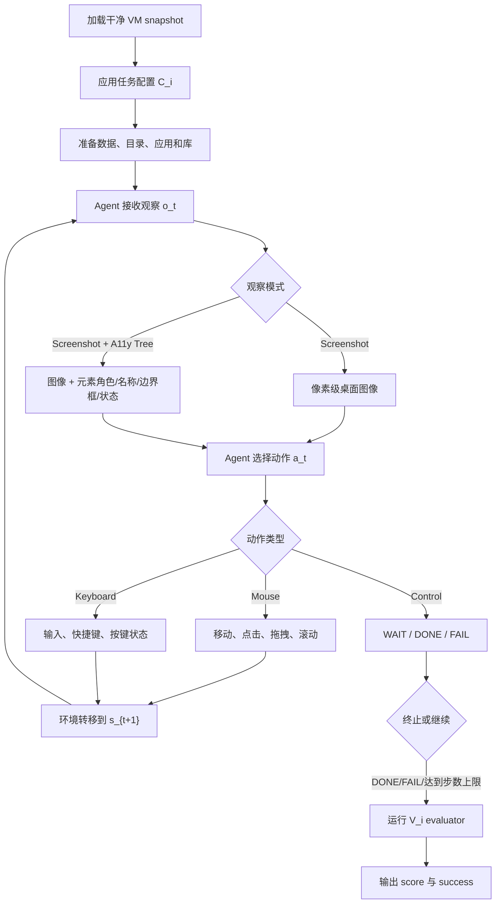

# DSAgentBench：把数据科学 Agent 从“会写代码”拉回真实电脑

### 元信息

| 字段 | 内容 |
|---|---|
| 论文 | DSAgentBench: Can Agents Automate End-to-End Data-Science Workflows in Real Computer Environments? |
| 作者 | Mizanur Rahman、Mohammed Saidul Islam、Ridwan Mahbub、Md Tahmid Rahman Laskar、Shafiq Joty、Enamul Hoque Prince |
| 机构 | York University；Nanyang Technological University；Salesforce AI Research |
| 官方链接 | [arXiv:2608.10366v1](https://arxiv.org/abs/2608.10366)；[GitHub: vis-nlp/DSAgentBench](https://github.com/vis-nlp/DSAgentBench) |
| 日期 | arXiv v1 于 2026-08-11 01:45:56 UTC 提交 |
| 主题 | 大模型 Agent；真实电脑环境；数据科学工作流；GUI/terminal/Jupyter/VS Code 协同；确定性执行评测 |

### TL;DR

- **这篇论文要回答的问题**：当前 Agent 是否真的能在真实电脑里完成端到端数据科学工作，而不是只在 notebook 沙盒里生成一段可运行代码。
- **核心方法**：作者构造 DSAgentBench，把 OSWorld 扩展成数据科学环境，加入 Jupyter Notebook、VS Code、Chrome、terminal、Kaggle API、OpenML、SQLite 和任务级文件系统配置。
- **任务规模**：benchmark 有 **275 个真人编写任务**，覆盖数据获取、EDA、特征工程、建模、评估部署、可视化报告六类生命周期任务。
- **评测机制**：每个任务都配一个确定性 Python evaluator，检查最终文件、数值、图表标签、模型指标或报告产物；成功阈值是总体得分 **>= 0.95**。
- **关键结果**：最强的 Claude-4.6-Sonnet 在 Screenshot + A11y Tree 设置下只有 **56.70%** 成功率；GPT-5 为 **29.81%**；人类参考为 **85.09%**；开源 GUI Agent 在 screenshot-only 下最高也不到 **1%**。
- **关键诊断**：增加交互步数不能解决本质问题，GPT-4o 从 15 步放宽到 50 步只从 **24.54%** 升到 **25.81%**；terminal-first 提示也只从 **19.34%** 升到 **20.73%**。
- **论文的真正贡献**：它把 Agent 评测从“代码答案是否对”推进到“能否在真实 OS 状态中持续感知、行动、调试、保存产物并被独立 evaluator 验证”。
- **局限**：代码仓库当前公开内容很少；开源 Agent 没有 A11y Tree 设置；可视化任务仍有小比例 LLM judge；错误分析抽样覆盖 604 条闭源轨迹和 150 条开源轨迹，不等于全量失败模式。

### 研究问题：为什么“会写 Python”不等于“会做数据科学”？

作者开篇做了一个很重要的切分：

- 代码生成 benchmark 问的是：模型能否把自然语言需求翻译成函数、SQL 或 notebook 片段。
- GUI/OS benchmark 问的是：模型能否点击、输入、打开应用、在网页或桌面上完成一般任务。
- 数据科学 Agent 真正要面对的是：在一个持续变化的电脑环境里，把数据、代码、模型、图表和中间判断串成闭环。

这三类能力不是简单相加。

| 能力层 | 典型 benchmark 测到什么 | DSAgentBench 认为还缺什么 |
|---|---|---|
| 代码正确性 | 单元测试、函数输出、脚本执行 | 文件路径、依赖安装、数据载入、交互式调试 |
| 数据分析 | SQL、表格问答、模型训练子任务 | 任务前后状态、工具切换、结果保存、报告产物 |
| 电脑控制 | Web/desktop 导航、按钮点击、表单填写 | 数据科学语义目标、统计指标、模型性能、图表语义 |
| 端到端工作流 | 少量 pipeline 或 notebook 沙盒 | 真实 OS、Jupyter/VS Code/terminal/browser/database 协同 |

因此，论文的中心问题可以写成一句更尖锐的话：

> 一个 Agent 若只会生成合理代码，却不能在 VS Code 弹窗、terminal 报错、数据文件位置、Notebook 执行状态和最终 evaluator 之间保持一致，它还不是可靠的数据科学 Agent。

这个问题意识对 Agent 研究很关键。

- 它把“任务成功”从文本答案转为外部世界状态。
- 它把“推理链”从模型内部 token 转为可审计轨迹。
- 它把“自动化数据科学”从单轮问答推进到多工具执行系统。

### 论文主张与论证路线

作者的论证不是单纯发布一个 benchmark，而是按以下链条推进：

```text
Claim:
  现有评测低估了真实数据科学 Agent 的困难。

Mechanism:
  真实工作流需要 OS grounding、跨工具协调、中间状态读取、统计/建模判断和最终产物验证。

Evidence:
  DSAgentBench 构造 275 个真实环境任务，用 15 个模型评测；
  最强 Agent 56.70%，GPT-5 29.81%，人类 85.09%，开源 Agent < 1%。

Boundary:
  benchmark 目前主要在 Ubuntu/OSWorld 体系内；
  可视化小部分评测引入 LLM judge；
  代码仓库尚未完全释放任务和 evaluator。
```

这条路线的意义在于：

- 它没有把失败归因给某个模型“不够聪明”。
- 它把失败拆成 grounding、terminal、code、logic、budget exhaustion、recovery 等可观察变量。
- 它通过消融证明：“给更多步数”或“偏向 terminal”并不能自动填平差距。

### 方法机制：DSAgentBench 到底把什么放进环境？

论文把一个任务形式化为：

```text
T = {(C_i, I_i, V_i)} for i = 1...N

C_i = 任务配置：
  - 初始 OS 状态
  - 文件系统结构
  - 预装库和应用
  - 数据集位置
  - 初始化/清理过程

I_i = 自然语言任务说明：
  - 分析目标
  - 输出格式
  - 需要保存的文件或报告

V_i = 确定性 Python evaluator：
  - 检查脚本是否存在并执行
  - 检查输出文件、数值、模型指标或图表
  - 给出 [0, 1] 连续分数
```

成功条件也很严格：

```text
success(task_i) = 1 if score_i >= 0.95 else 0

Task Success Rate = mean(success(task_i)) * 100%
Average Score     = mean(score_i)
```

这个定义避免了两个常见误判：

- 代码执行成功但输出值错误，不算真正成功。
- 图表文件存在但轴标签、变量映射或语义不对，也不应等价于成功。

环境本身扩展自 OSWorld。

| 组件 | 论文中的角色 | 为什么重要 |
|---|---|---|
| Ubuntu VM | 真实操作系统状态 | 让 Agent 面对窗口、路径、焦点、依赖、弹窗 |
| Screenshot | 像素级观察 | 测试视觉 grounding 与界面理解 |
| A11y Tree | 结构化 UI 元数据 | 测试元素角色、名称、边界框对 grounding 的增益 |
| PyAutoGUI action space | 统一动作接口 | 让不同模型都通过鼠标、键盘和控制 token 操作 |
| Jupyter Notebook | 交互式分析环境 | 支持 notebook 式探索、执行和检查 |
| VS Code | 多文件脚本环境 | 更接近工程化数据分析，但也更容易暴露 terminal/路径问题 |
| Chrome | 文档和外部数据访问 | 测试 web 工具与数据源调用 |
| Kaggle/OpenML/SQLite | 数据源 | 覆盖 CSV、多表、数据库和公开数据平台 |

### 数据集构造：275 个任务从哪里来？

作者采用三阶段 pipeline：

1. **数据源收集**
   - 来自 GitHub、Kaggle、OpenML、SQLite、Web API 等公开来源。
   - 以表格数据为主，同时保留少量图像和文本任务。
   - 排除许可不清、限制性强或不可再分发的数据。

2. **任务与 evaluator 设计**
   - 两名有五年以上经验的数据科学 annotator 先从 100 个高排名 Kaggle notebook 里抽取常见 workflow。
   - 四名专家在三个月、约 400 个工作小时里写出 275 个任务。
   - GPT-5、Claude 4.5 Sonnet、Gemini 3 只用于润色说明和发现边界情形；任务逻辑、预期输出和 evaluator 由人类定义。

3. **双 annotator 验证**
   - creator 编写任务和 evaluator。
   - verifier 独立检查说明清晰度、可执行性和 evaluator 正确性。
   - 初始一致认可率为 **86%**。
   - 其余任务经过讨论修订，最终 275 个任务全部达到双方认可。

任务结构的统计很能说明 benchmark 不是“玩具题”：

| 维度 | 分布 |
|---|---|
| 难度 | Hard 47.6%；Medium 46.9%；Easy 5.5% |
| 阶段结构 | Multi-stage 56.7%；Single-stage 43.3% |
| 数据模态 | Tabular 95.3%；Image 3.6%；Text 1.1% |
| 数据来源 | GitHub 37.1%；Kaggle 29.8%；OpenML 18.9%；SQLite 7.6%；Web 6.5% |
| 工具 | Python 100.0%；VS Code 81.1%；Jupyter Notebook 18.9%；Chrome 10.2% |

六类任务覆盖完整生命周期：

| 类别 | 任务数 | 任务要点 |
|---|---:|---|
| Data Acquisition | 23 | 找表、读列、合并记录、计算聚合指标 |
| Exploratory Data Analysis | 119 | schema 检查、统计汇总、过滤、相关性、排序 |
| Feature Engineering | 37 | 缺失值处理、编码、缩放、新特征、降维 |
| Modeling | 41 | 多模型训练、交叉验证、stacking、指标比较 |
| Evaluation and Deployment | 12 | 调参、显著性、验证策略、最终参数与性能保存 |
| Visualization and Reporting | 33 | 图表、交互可视化、PowerPoint 报告、标签和图例检查 |

值得注意的是，EDA 占 **119/275**，也就是最大的一类。

- 这符合作者引用的行业观察：数据科学大量时间耗在准备和探索上。
- 对 Agent 来说，EDA 不是单个函数调用，而是不断看中间结果、改查询、重跑脚本和保存结果。
- 这让 benchmark 更接近“分析员工作台”，而不是静态题库。

### 执行流程：Agent 在每一步看到什么、能做什么？

DSAgentBench 的交互循环可以概括为：



这个 loop 的边界条件很重要：

- 主实验最大交互步数是 **15 actions**。
- 每个动作后有等待，保证窗口和输出稳定。
- 轨迹、动作和时间戳会被记录，用于复现和失败诊断。
- agent 不能调用特权任务 API，只能通过标准 GUI/键盘/鼠标空间间接使用 terminal、Jupyter、VS Code 和浏览器。

这比“给模型一个文件路径，让它写代码”更接近现实。

例如，一个建模任务可能要求：

```text
Input:
  - 多个 retail 数据表
  - store/date 连接键
  - 预测 weekly sales 的目标

State:
  - 文件系统里已有数据
  - VS Code 或 Jupyter 已启动
  - 可能需要安装/导入库

Loop:
  1. 读取数据并检查 schema
  2. 合并多表
  3. 训练多个回归模型
  4. 使用 meta-learner 做 stacking
  5. 交叉验证并计算平均误差
  6. 保存 summary 文件

Output:
  - 模型比较结果
  - 指定格式的性能指标文件

Failure boundary:
  - 只写了代码但未执行：失败
  - 执行了但没有保存文件：失败
  - 保存文件但指标不达标或字段错误：失败
```

### 评测协议：为什么它比“代码跑通”更严格？

每个任务结束后，evaluator 会从 VM 中收集脚本、输出文件、图表、训练模型或报告产物，并执行任务专属检查。

| 任务类型 | evaluator 检查什么 | 示例阈值或规则 |
|---|---|---|
| 数值分析 | 文件存在、脚本执行、数值解析、误差容忍 | Pearson correlation 允许 epsilon = 0.01 |
| 分类/建模 | 模型训练产物、准确率/F1、最低性能线 | accuracy 或 F1 >= 0.7 |
| 可视化 | 文件非空、变量映射、标题、坐标轴、图例 | 先过确定性 gate，再少量调用 LLM judge |
| 报告产物 | 文件格式、内容字段、图表和文字是否匹配任务 | 检查最终 artifact，而不只看生成代码 |

论文特别处理了 visualization 的主观性：

- 只有约 **10%** 任务调用 LLM judge。
- judge 只在确定性 gate 之后判断视觉质量和语义对齐。
- 避免自评：GPT-4o 输出由 Gemini-2.5-Pro 判断，其他模型输出由 GPT-4o 判断。
- 这个设计不能完全消除 judge 偏差，但比全程 LLM-as-judge 更克制。

可以把 evaluator 理解成一个“事后审计器”：

```text
def evaluate(task_artifacts):
    assert script_exists()
    assert script_runs_successfully()
    assert required_output_files_exist()

    if task.kind == "numeric":
        value = parse_numeric_output()
        score = match_with_tolerance(value, ground_truth, epsilon)

    if task.kind == "modeling":
        metric = load_saved_metric()
        score = 1.0 if metric >= threshold else partial_credit(metric)

    if task.kind == "visualization":
        deterministic_gate = check_file_and_chart_metadata()
        if deterministic_gate:
            score = constrained_visual_judge()

    return clamp(score, 0, 1)
```

这里的关键不在于 evaluator 多复杂，而在于它把“回答”绑定到真实文件和可执行结果。

- Agent 不能靠看似合理的解释蒙混过关。
- 中间窗口状态必须最终落成 artifact。
- 失败可以被定位到脚本、文件、图表、指标或动作轨迹。

### 主结果：最强 Agent 也没接近人类参考

论文评测了 15 个闭源、混合和开源模型/Agent。

闭源模型包括 GPT-4o、O4-mini、GPT-5-mini、GPT-5、Gemini-2.5-Pro、OpenAI CUA、Claude Sonnet 4/4.5/4.6。混合模型包括 Jedi-3B/7B + GPT-4o。开源 GUI Agent 包括 UI-TARS、GUI-OWL、OpenCUA-72B 等。

核心结果如下：

| 模型或参考 | Screenshot Overall | Screenshot + A11y Tree Overall | 关键解读 |
|---|---:|---:|---|
| Human Performance | 85.09 | 85.09 | 三名人类参考：两名 applied scientists 和一名硕士毕业生 |
| Claude-4.6-Sonnet | 50.55 | 56.70 | 最强 Agent，但仍离人类差 28.39 个百分点 |
| GPT-5 | 23.63 | 29.81 | A11y Tree 有帮助，但仍不到三成 |
| GPT-4o | 19.34 | 24.54 | 结构化 UI 信息提高约 5.2 点 |
| Gemini-2.5-Pro | 14.49 | 20.81 | grounding 改善后仍受 terminal/code/reasoning 限制 |
| GPT-5-mini | 15.20 | 19.03 | 小模型在长程工作流里更容易早期失败 |
| Open-source agents | 最高约 0.73 | N/A | 论文中开源 Agent 不支持 A11y Tree，screenshot-only 近乎全灭 |

这张表支持三个判断。

1. **A11y Tree 有帮助，但不是银弹**
   - GPT-4o 从 19.34 到 24.54。
   - GPT-5 从 23.63 到 29.81。
   - Claude-4.6-Sonnet 从 50.55 到 56.70。
   - 提升存在，但没有改变任务困难的本质。

2. **闭源强模型和开源 GUI Agent 差距巨大**
   - 开源模型并非完全不会输出代码或动作。
   - 论文诊断显示，它们常在 UI grounding 和 terminal 控制层面失败。
   - 这说明 GUI grounding 训练不能自动泛化到数据科学语义任务。

3. **人类参考不是满分，也说明任务确实有现实难度**
   - 85.09% 不是 100%。
   - 这些任务需要真实操作、调试和保存 artifact，人也会犯错。
   - 因此 benchmark 不是简单用人类上限制造夸张差距。

### 分类型结果：难点不是平均分，而是 workflow 结构

任务类别上的差异很明显。

以 Screenshot + A11y Tree 设置为例：

| 模型 | Data Acquisition | EDA | Feature Engineering | Modeling | Visualization | Evaluation | Overall |
|---|---:|---:|---:|---:|---:|---:|---:|
| GPT-4o | 13.04 | 29.66 | 35.14 | 21.95 | 15.62 | 8.33 | 24.54 |
| GPT-5 | 26.08 | 33.44 | 29.72 | 32.22 | 15.15 | 33.33 | 29.81 |
| Gemini-2.5-Pro | 4.35 | 22.78 | 33.33 | 14.81 | 30.77 | 0.00 | 20.81 |
| Claude-4.6-Sonnet | 47.82 | 64.88 | 56.75 | 46.34 | 42.42 | 66.67 | 56.70 |
| Human | 73.91 | 90.76 | 91.89 | 73.17 | 78.79 | 83.33 | 85.09 |

这里最值得看的是：

- 数据获取对许多模型仍很难，因为它要求理解文件、数据库、浏览器或 API 之间的关系。
- Evaluation 类任务样本较少，但对模型来说高度脆弱，因为要把统计验证、模型性能和输出保存统一起来。
- EDA 虽然常见，但并不简单；它要求模型不断读中间输出，而不是一次性写完脚本。
- Visualization 不只是生成图片，还要正确映射变量、标签、趋势和报告语义。

作者还按 workflow 结构、难度和工具拆分。

| 对比维度 | 论文观察 | 机制解释 |
|---|---|---|
| Single-stage vs Multi-stage | 单阶段普遍高于多阶段 | 多阶段需要跨步骤保持状态，任何中间错误都会传播放大 |
| Easy/Medium/Hard | 难度越高成功率越低 | hard 任务通常要求 5+ 步、复杂分析和多工具协调 |
| Jupyter vs VS Code | Jupyter 任务常高于 VS Code | Notebook 交互更集中；VS Code 更容易触发 terminal、路径、环境和弹窗问题 |
| Screenshot vs Screenshot + A11y | A11y 通常提高表现 | 结构化 UI metadata 改善 grounding，但不能替代分析推理 |

### 消融：更多步数和 terminal-first 为什么都救不了？

论文做了两个特别有解释力的消融。

第一个是交互步数预算。

| GPT-4o 设置 | 15 steps | 30 steps | 50 steps |
|---|---:|---:|---:|
| Task Success Rate | 24.54 | 25.45 | 25.81 |
| Average Score | 0.55 | 0.56 | 0.57 |

如果失败主要来自“还差几步没做完”，把 15 步放宽到 50 步应该大幅提升。

但结果只提升 **1.27 个百分点**。

这说明失败更像是结构性错误：

- 初始文件或 UI 元素 grounding 错了。
- 代码逻辑方向错了。
- terminal 报错没有被正确解释。
- 模型以为自己完成了，但 evaluator 需要的 artifact 没有生成。
- 后续动作在错误状态上继续滚动，步数越多只是把错误拖长。

第二个是 terminal-first 提示。

```text
GPT-4o screenshot-only:
  standard prompting      = 19.34%
  terminal-first prompting = 20.73%

delta = +1.39 percentage points
```

这也很关键。

- terminal 确实适合数据科学任务。
- 但“偏向 terminal”不会自动解决路径、依赖、文件保存、图表检查、任务理解和统计判断。
- 一个 Agent 若不知道什么时候读文件、什么时候执行、什么时候检查输出、什么时候停止，terminal 只是另一个容易失败的界面。

### 错误分析：失败不是一个单点 bug

作者人工检查了：

- **604 条闭源模型轨迹**，使用 Screenshot + A11y Tree。
- **150 条开源模型轨迹**，使用 Screenshot-only。

根因分类包括 grounding、terminal、code、logic。

| 模型 | Grounding | Terminal | Code | Logic |
|---|---:|---:|---:|---:|
| CUA | 94.44 | 2.78 | 0.46 | 2.31 |
| GPT-4o | 80.00 | 5.64 | 13.33 | 1.03 |
| Gemini-2.5-Pro | 43.08 | 36.15 | 13.85 | 6.92 |
| GPT-5 | 41.67 | 8.33 | 38.33 | 11.67 |
| Claude-4.6-Sonnet | 32.77 | 9.24 | 43.70 | 14.29 |
| GUI-OWL-7B | 97.09 | 1.09 | 1.45 | 0.36 |
| UI-Tars-1.5-7B | 98.18 | 1.82 | 0.00 | 0.00 |
| Jedi-7B | 81.89 | 6.69 | 7.09 | 4.33 |

这张表最反直觉的一点是：

- 越弱的 GUI Agent，失败越集中在 grounding。
- 越强的 Agent，失败更分散到 code 和 logic。

这说明 benchmark 不是单纯 UI benchmark。

当模型连 terminal 都打不开、弹窗都处理不了时，失败表现为 grounding；当模型终于能稳定控制环境时，更深层的数据科学判断、代码正确性和任务理解问题才暴露出来。

时间结构也很有信息量。

| 模型 | Mean FF Step | Median FF | Early | Mid | Late | Budget Exhaustion | Recovery |
|---|---:|---:|---:|---:|---:|---:|---:|
| CUA | 13.62 | 15 | 3.41 | 3.41 | 93.17 | 100.0 | 0.0 |
| GPT-4o | 8.77 | 15 | 41.54 | 3.59 | 54.87 | 93.85 | 1.54 |
| Gemini-2.5-Pro | 5.80 | 6 | 42.02 | 45.38 | 12.61 | 62.31 | 19.23 |
| GPT-5-Mini | 5.92 | 4 | 57.38 | 19.67 | 22.95 | 63.08 | 3.08 |
| GUI-OWL-7B | 14.16 | 15 | 2.91 | 4.00 | 93.09 | 100.0 | 0.0 |
| UI-Tars-1.5-7B | 14.40 | 15 | 0.00 | 0.00 | 100.00 | 100.0 | 0.73 |
| Jedi-7B | 12.10 | 15 | 11.02 | 18.11 | 70.87 | 98.43 | 1.18 |

FF 是 first failure step，也就是轨迹中第一次检测到错误的步骤。

这给出两种不同的失败形态：

- **晚期失败但预算耗尽**：模型一直在动作，但没真正推进到 evaluator 需要的正确产物。
- **早中期失败但较少耗尽预算**：模型更快暴露计划或 grounding 错误，有时也更可能恢复。

成功轨迹的效率也有差别：

| 模型 | 成功运行平均步数 | 中位步数 |
|---|---:|---:|
| Gemini-2.5-Pro | 6.76 | 6 |
| GPT-5-Mini | 7.33 | 5 |
| GPT-4o | 10.03 | 15 |
| Claude-4.6-Sonnet | 10.93 | 12 |
| CUA | 15.00 | 15 |

这里不能简单说“步数越少越好”。

- Gemini 成功时更快，但也有较多早中期失败。
- Claude-4.6-Sonnet 成功率最高，但平均步数更长。
- CUA 成功运行也用满步数，说明它可能更依赖长轨迹探索。

### 图表证据：哪些 Figure/Table 真正支撑了主张？

论文里最关键的证据可以分成五类。

| 图表 | 支撑的主张 | 不能证明什么 |
|---|---|---|
| Figure 1 | 一个真实任务轨迹会跨数据获取、代码执行和最终输出 | 不代表所有任务都按同一路径完成 |
| Figure 2 | benchmark 构造包含数据源、任务/evaluator 设计、双人验证 | 不证明任务覆盖了所有数据科学行业场景 |
| Table 1 | DSAgentBench 比旧 benchmark 同时覆盖 OS、web、terminal、cross-app、数据科学和可视化 | 不证明它在每个维度都比所有旧 benchmark 更难 |
| Table 2/6 | 275 个任务覆盖不同难度、来源、工具和生命周期类别 | 任务仍以 tabular 数据为主，图像/文本比例较小 |
| Table 3/4 | 当前模型在人类参考下方，且多阶段/VS Code/困难任务更难 | 不能直接比较所有模型的训练数据和工具栈公平性 |
| Table 10/12 | 失败可分解为 grounding、terminal、code、logic 和轨迹时序 | 错误分析是抽样人工检查，不是全量标签 |
| Table 11 | 增加步数收益很小 | 不能说明更长规划记忆或不同动作空间无用 |

如果只保留一个证据闭环，我会选：

```text
Table 1:
  说明现有 benchmark 缺 real-computer + data-science workflow 交叉覆盖。

Table 2:
  说明 DSAgentBench 任务确实有多阶段、多工具、多来源结构。

Table 3:
  说明强 Agent 在同一 evaluator 下仍显著落后人类。

Table 10/11:
  说明失败不是简单步数不足，而是 grounding/code/logic/terminal 的组合失效。
```

### 与相关工作的定位：它不是替代 OSWorld，而是把 OSWorld 用到数据科学语义层

DSAgentBench 和几个邻近方向的关系如下：

| 方向 | 代表 | 与 DSAgentBench 的关系 |
|---|---|---|
| 代码生成 | HumanEval、DS-1000 | 只验证代码或局部数据操作，不要求真实桌面状态 |
| 数据科学 Agent | MLAgentBench、DSBench、DABStep、DA-CODE | 关注分析能力，但多在沙盒或静态环境里 |
| Web/GUI Agent | WebArena、VisualWebArena、OSWorld、ScreenSpot-Pro | 有真实 UI 交互，但不是完整数据科学生命周期 |
| 可视化/表格理解 | ChartQA、Text2Vis、VisEval、DashboardQA | 测图表语义或 dashboard QA，但不要求长程 artifact 生成 |
| DSAgentBench | 本文 | 把 OS-level interaction 与数据科学任务/evaluator 绑定 |

它最重要的定位是：

- 不是发明一个全新 Agent 架构。
- 不是证明某个模型最强。
- 而是把评测对象重新定义为“在真实电脑中完成可验证数据科学工作流”。

这个定位会影响后续研究问题。

例如，未来做数据科学 Agent 时，论文暗示只优化以下能力不够：

- 更强代码补全。
- 更长上下文。
- 更准 screenshot grounding。
- 更多 tool wrapper。

真正需要优化的是跨层闭环：

```text
Perception:
  识别当前桌面/文件/terminal/notebook 状态

Planning:
  把自然语言目标拆成可执行的数据科学步骤

Execution:
  通过 GUI/keyboard/terminal/Jupyter/VS Code 执行动作

Inspection:
  读取中间结果、报错、图表和保存文件

Repair:
  判断错误源，重跑或改写脚本

Finalization:
  生成 evaluator 需要的 artifact，并在正确位置保存
```

### 局限与证据边界

这篇论文的结论有说服力，但边界也要说清。

1. **公开仓库目前很轻**
   - arXiv 页面给出官方 GitHub。
   - 本轮查看时仓库只有 README 和 License，README 只有标题。
   - 论文说将释放完整 prompts、evaluator、配置和脚本；复现仍依赖后续代码发布。

2. **开源 Agent 与闭源 Agent 的观察设置不完全对称**
   - 开源 Agent 在论文中只报告 screenshot-only。
   - 原因是它们当前不支持 A11y Tree 输入。
   - 这符合能力现实，但会让“开源 vs 闭源”的比较同时混入观察模态差异。

3. **可视化任务仍有 LLM judge 成分**
   - 作者已经把 judge 限制在约 10% 任务，且放在确定性 gate 之后。
   - 但视觉语义和设计质量仍不是完全客观的数值验证。
   - 因此可视化结果应比数值/建模任务更谨慎解读。

4. **任务以 tabular 数据为主**
   - Tabular 占 95.3%。
   - 这很符合很多企业数据科学场景。
   - 但对多模态科学数据、复杂文本分析、图像医学/遥感等场景的外推仍有限。

5. **15 步主设置可能低估某些 Agent 的长期恢复能力**
   - 作者做了 30/50 步消融，收益很小。
   - 但不同规划器、外部记忆或 checkpoint-repair 策略可能在更长 horizon 下有不同表现。
   - 所以更准确的结论是：当前模型在当前动作空间中失败不主要由 15 步预算解释。

### 研究者视角：这篇论文对 Agent 评测的启发

DSAgentBench 最值得带走的不是“Claude-4.6-Sonnet 56.70%”这个排行榜数字，而是评测范式的变化。

它提醒我们：

- Agent benchmark 不能只看最终文本。
- 也不能只看代码是否能跑。
- 对真实工作任务来说，关键是外部世界状态是否被正确改变。

在数据科学场景里，正确改变外部状态意味着：

- 数据被正确读入和连接。
- 中间统计结果被检查过。
- 模型训练和验证指标符合任务目标。
- 图表和报告语义正确。
- 结果保存到 evaluator 能找到的位置。
- Agent 能在出错时识别并修复，而不是继续生成看似合理的解释。

这对下一代 Agent 系统提出了几个更具体的问题。

| 后续问题 | 为什么重要 |
|---|---|
| 如何训练 Agent 读取和利用 intermediate artifacts？ | 数据科学任务的真相往往在中间输出，而不在初始 prompt |
| 如何把 terminal/Jupyter/VS Code 状态统一成可学习状态？ | 多工具状态割裂会导致计划和执行断裂 |
| 如何评测错误恢复，而不只是最终成功率？ | 真实工作中错误不可避免，恢复能力决定可靠性 |
| 如何把 evaluator 设计成开放但可复现？ | 太严格会误杀合理解法，太宽松会放过表面成功 |
| 如何避免 benchmark 变成固定 UI 脚本？ | Agent 应该解决数据科学问题，而不是记住点击路径 |

对 AI 安全和 Agent 可靠性来说，这篇论文也有一个隐含结论：

- 如果 Agent 连普通数据科学任务中的路径、窗口、脚本、输出和 evaluator 都不能稳定对齐，那么把它放进更高权限、更高风险的企业数据环境前，必须先建立更细粒度的操作审计和权限边界。

换句话说，DSAgentBench 不只是能力 benchmark。

它也是一个可靠性压力测试：

```text
能力问题:
  Agent 能否完成任务？

可靠性问题:
  Agent 失败时能否被定位？

安全问题:
  Agent 在误解 UI、路径或数据时，会不会把错误动作带到真实系统？

工程问题:
  我们能否用 evaluator、轨迹日志和 artifact 检查把这些风险收敛到可审计边界？
```

### 结论

DSAgentBench 给出的答案很清楚：当前 Agent 距离“自主完成端到端数据科学工作流”还有明显差距。

这个差距不是单个模型榜单能解释的。

- 弱 Agent 先卡在 UI grounding。
- 强 Agent 继续暴露 terminal、code 和 logic 错误。
- A11y Tree 能帮忙，但不能替代数据科学推理。
- 更多步数和 terminal-first 提示只能带来很小提升。

因此，这篇论文的价值在于把数据科学 Agent 的评测单位从“答案”改成“真实电脑里的可验证工作产物”。

这会让后续研究更难，但也更接近真正需要部署的 Agent。
