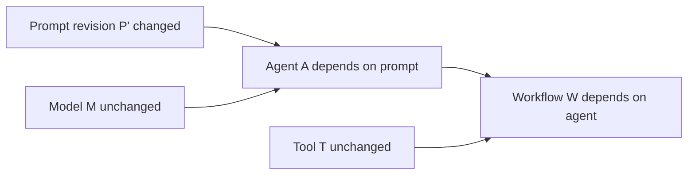

# Agentic Configuration Management：把 Agent 系统当成可审计配置来治理

## 元信息

| 项目 | 内容 |
|---|---|
| 标题 | Agentic Configuration Management (ACM): A Reference Configuration Model for Governed Agentic Systems |
| 作者 | Audrey Quessada-Vial |
| 发布 | arXiv:2608.11166v1，2026-08-11 17:28:39 UTC |
| 方向 | 大模型 Agent / AgentOps / 配置治理 |
| 原文 | https://arxiv.org/abs/2608.11166 |
| 官方实现 | https://github.com/audreyqvial/ACM |

## TL;DR

- 这篇论文要解决的问题不是“怎样让 Agent 更会执行任务”，而是“当一个 Agent 系统由 agents、prompts、tools、models、skills、workflows、policies 和运行时事件共同决定行为时，怎样把这些东西作为一个可版本化、可审计、可复现的配置整体来治理”。
- 作者提出 **Agentic Configuration Management, ACM**：一个不绑定 LangGraph、CrewAI 或 OpenAI Agents SDK 的配置治理参考模型。它把影响 Agent 行为的对象抽象成 **Agentic Configuration Item, ACI**，每次变更生成不可变 revision，再用 release baseline 固定一组精确 revision。
- ACM 的核心结构是四张相互关联的图：Configuration Graph 描述静态配置依赖，Evolution Graph 描述 revision 与 baseline 演化，Assurance Graph 描述政策、证据和合规约束，Runtime Graph 描述执行观察，但运行时观察不能直接改写配置 revision。
- 论文给出形式化语义：生命周期按 `Draft < Validated < Approved < Released < Deprecated < Archived` 单调推进；质量、保证、影响、可用性分开评价；依赖影响传播定义在有限 lattice 上，迭代到最小不动点，保证终止、收敛和确定性。
- 实验不是跑任务成功率，而是验证治理语义：27 个治理场景覆盖 immutable revision、baseline、dependency propagation、runtime replay、dynamic agents、cross-framework projection；官方报告中 27/27 场景有测试覆盖，379 个测试通过、0 失败。
- 跨框架证据来自 LangGraph、CrewAI、OpenAI Agents SDK 三种不同 introspection regime。论文报告节点、关系、分支覆盖都是 100%，但也明确记录了 CrewAI Flow state schema 等无法完整保留的信息，避免把 projection loss 静默吞掉。
- 量化影响实验包含 3 个框架 × local/intermediate/global 三类变更，共 9 个案例；local 和 intermediate 影响 2 个 ACI，global 影响 5 个 ACI；固定点迭代 3 次；严格口径下 residual inspection scope reduction 为 84.6%、69.2%、61.5%。
- 局限也很清楚：ACM 目前不是执行框架，不覆盖分布式执行、多 Agent 规划、学习/自适应、长期记忆、MCP/A2A 原生协议或工业级大规模验证；它证明的是“受控实验范围内的配置治理可行性”，不是所有 Agent 系统都已被完整标准化。

## 1. 研究问题：Agent 系统的“配置”已经不只是代码

### 1.1 作者真正要补的缺口是什么？

- 传统软件配置管理关心的是：
  - 哪些文件、依赖、构建参数组成一个 release；
  - 每个 artifact 的版本和来源是什么；
  - 变更会影响哪些下游组件；
  - release 能否在未来被重建、审计、回滚。
- 现代 Agent 系统的行为来源更分散：
  - prompt revision 会改变推理偏好；
  - tool envelope 会改变可执行动作；
  - model choice 会改变能力边界；
  - workflow graph 会改变控制流；
  - policy、assurance evidence、runtime trace 又会影响系统是否允许上线。

作者的判断是：当前 LLMOps / AgentOps 平台通常能做 observability、trace、evaluation、prompt versioning，但它们没有一个**框架无关的完整配置模型**，能把异构 Agent 系统表示成一个被治理的配置对象。

### 1.2 为什么这不是已有 AgentOps 的普通扩展？

| 能力 | LLMOps / AgentOps 常见做法 | ACM 试图补上的层 |
|---|---|---|
| 执行观察 | trace、日志、eval run、成本与延迟 | 运行时事件要能回指精确配置 revision |
| prompt 管理 | prompt version、label、rollback | prompt 只是 ACI 的一种，和 tools/models/workflows/policies 一起进入配置图 |
| 工作流编排 | 框架内 graph、crew、handoff | projection 后进入统一 Configuration Graph |
| 合规/证据 | 平台或组织自定义字段 | Assurance Graph 明确连接政策、证据、评估结果 |
| 变更影响 | 通常依赖人工或框架局部结构 | policy-governed propagation 到最小不动点 |

**关键转向**：

- ACM 不问“这个 Agent 怎样跑得更好”；
- ACM 问“这个 Agent 的行为由哪些可治理对象决定，哪些 revision 被 release，哪个 runtime event 来源于哪个 revision，变更后哪些对象必须重新评估”。

## 2. 论文主张与论证路线

| Claim | Mechanism | Evidence | Boundary |
|---|---|---|---|
| 异构 Agent 系统可以用框架无关的配置表示治理 | ACI、四图模型、typed relationships、release baseline | 论文把 agents/prompts/tools/models/workflows/policies/runtime observations 都放入统一 metamodel | 不声称覆盖所有未来框架和协议 |
| 配置治理和运行时执行必须分开 | Configuration Graph 与 Runtime Graph 分离；runtime event 只能记录 provenance，不能改写 immutable revision | 形式化定义 `Gamma_C(v)` 与 `rho(v)`，并用 replay 重建 Runtime Graph | 不解决模型随机输出本身的可复现 |
| 依赖影响可以确定性传播 | propagation policy、impact lattice、worklist algorithm、least fixed point | local/intermediate/global 影响实验跨三框架得到一致 impact set | 实验配置规模小，指标是 inspection scope，不是人工成本 |
| 跨框架治理等价可以靠 semantic projection 达到 | LangGraph/CrewAI/OpenAI Agents SDK adapters，把 native constructs 投影到 ACM | 27 个场景，三框架 projection，节点/关系/分支覆盖报告 | projection loss 仍存在，特别是动态或 opaque 语义 |
| 参考实现可操作化论文模型 | Python 3.11-3.13、Pydantic v2、adapters、harness、tests、fixtures、reports | 官方仓库含 `acm/`、`adapters/`、`harness/`、`scenarios/fixtures`、`tests/` 与自动报告 | 不是生产平台，也不是标准，只是 reference v0.1 |

这条论证路线很工程化：

1. 先指出传统 SCM、AI governance、LLMOps/AgentOps、Agent 框架各自只覆盖部分问题。
2. 再把 Agent 配置抽象成 ACI 和四张图，明确哪些关系属于配置、演化、保证、运行时。
3. 然后定义生命周期、质量、保证、影响、可用性五类状态，避免把所有治理结论压成一个粗糙 status。
4. 接着把变更影响传播写成不动点问题，证明在有限 lattice 上收敛。
5. 最后用三个真实框架的 adapter、27 个治理场景和 9 个影响实验说明“可实现、可复现、可跨框架”。

## 3. 方法机制：ACM 怎样表示一个 Agent 系统？

### 3.1 四图模型是整篇论文的骨架

论文把 ACM 写成：

```text
G_ACM = (G_C, G_E, G_A, G_R)
```

| 图 | 负责什么 | 典型节点/关系 | 为什么要分开 |
|---|---|---|---|
| `G_C` Configuration Graph | 静态配置与结构依赖 | agent、prompt、tool、model、workflow、policy reference | 影响传播只在清晰的配置依赖域里计算 |
| `G_E` Evolution Graph | revision、baseline、lineage | supersedes、derived-from、baseline membership | 历史 release 不能被当前变更污染 |
| `G_A` Assurance Graph | 政策、证据、合规约束 | assurance evidence、policy、evaluation result | 缺证据和低质量不能混为一谈 |
| `G_R` Runtime Graph | 执行观察与状态重建 | runtime entity、normalized event、provenance link | 运行时状态不能直接修改 governed configuration |

这不是简单分层，而是为了限定语义：

- **影响传播**只看 Configuration Graph；
- **历史追溯**看 Evolution Graph；
- **证据解释**看 Assurance Graph；
- **执行重放**看 Runtime Graph；
- 四者通过 provenance 和 revision-level links 相互连接。

### 3.2 ACI：把 Agent 生态里的可变对象变成受治理对象

ACI 是 Agentic Configuration Item。它不是传统 CI 的简单改名，因为 Agent 系统里被治理的对象更宽：

- agents；
- prompts；
- skills；
- composite subsystems；
- workflows；
- tools；
- language models；
- policies；
- assurance evidence；
- runtime observations。

每个 ACI revision 至少包含四组信息：

| 组成 | 例子 | 治理意义 |
|---|---|---|
| Identity | `item_id`, `revision_id` | 区分逻辑对象和精确 revision |
| Governance State | lifecycle、quality、assurance、impact、eligibility | 不同治理维度独立计算 |
| Configuration Content | content、digest、metadata | 固定配置内容与完整性 |
| Governance Metadata | provenance、tags、custom properties | 支持审计、归因和组织扩展 |

### 3.3 Release baseline：治理完整系统，而不是治理单个 prompt

Release Baseline 是一组精确 ACI revision 的不可变集合：

- baseline 引用的是 revision，不是会变化的 item 名字；
- baseline 是系统级一致性、合规和可复现的评价边界；
- baseline 发布后不可变，后续变更要生成新 revision 和新 baseline；
- runtime observation 只能链接到 baseline 中的 revision，不能改写 baseline。

这解决了 Agent 系统里常见的审计问题：

- 不能只说“用了某个 Agent”；
- 必须说“用了这个 agent revision、这个 prompt revision、这个 tool envelope revision、这个 model/config revision、这个 workflow revision，并且这些 revision 构成某个 release baseline”。

## 4. 形式化语义：治理状态为什么要拆开？

### 4.1 五个配置治理维度

论文给每个配置 revision `v` 一个治理描述符：

```text
Gamma_C(v) = (L(v), Q(v), A(v), I(v), El(v))
```

| 符号 | 含义 | 怎样产生 | 不能和什么混淆 |
|---|---|---|---|
| `L(v)` | lifecycle | 显式治理动作赋值 | 不是依赖传播结果 |
| `Q(v)` | quality | 本地质量评价函数 | 不等于证据完整性 |
| `A(v)` | assurance | 本地证据完整性评价 | 不等于模型表现好坏 |
| `I(v)` | impact | 依赖传播稳定后的影响状态 | 不直接表示执行失败 |
| `El(v)` | eligibility | 从 `L,Q,A,I` 本地计算 | 不参与传播，只在传播后计算 |

生命周期是单调的：

```text
Draft < Validated < Approved < Released < Deprecated < Archived
```

这个设计避免三类常见错误：

- 把“证据不完整”误读成“配置质量差”；
- 把“某个 prompt 被改了”误读成“工作流已经失败”；
- 把“运行时发生 drift”直接写回 release 配置，破坏历史可复现。

### 4.2 影响传播：从 local change 到最小不动点

影响传播由配置关系和传播政策共同决定：

```text
Pi : E_C -> P
P = {Blocking, Warning, Informational, None}
```

| Policy | 作用 | 治理含义 |
|---|---|---|
| Blocking | 影响沿关系传播，并可能限制 operational eligibility | 关键依赖变更后必须重新评估 |
| Warning | 传播注意信号，但不直接决定可用性 | 需要治理关注，但不必然阻断 |
| Informational | 保留可追溯依赖，不贡献影响 | 只是解释和审计关系 |
| None | 不传播影响 | 结构关系存在，但当前政策禁用传播 |

传播迭代写成：

```text
iota(k+1) = Prop_{G_C,Pi}(iota(k))
iota*     = Prop_{G_C,Pi}(iota*)
```

直觉流程如下：

```text
Input:
  - validated Configuration Graph G_C
  - propagation policies Pi
  - initial impact valuation iota(0)

State:
  - worklist = ACIs whose impact may affect dependents

Loop:
  while worklist is not empty:
    pick one changed ACI
    inspect outgoing governed relationships
    apply the relationship policy
    if dependent impact state increases:
      update dependent impact
      enqueue dependent

Output:
  - stabilized impact valuation iota*
  - eligibility computed locally from L,Q,A,iota*
```

论文强调两个边界：

- propagation 只更新 impact，不更新 lifecycle、quality、assurance；
- propagation 找到的是“必须重新治理关注的配置闭包”，不是“必然执行失败的组件集合”。

### 4.3 一个 prompt 变更的例子



如果 `P'` 被标为 Local impact：

- `A` 因依赖 prompt，可能得到 Propagated impact；
- `W` 因依赖 agent，也可能得到 Propagated impact；
- `T` 和 `M` 是否受影响取决于关系方向与 policy；
- eligibility 要等 `iota*` 稳定后再从 `L,Q,A,I` 计算。

这比“一跳依赖检查”更强，因为它能捕捉经由中间 revision 传播的二阶影响。

## 5. Operationalization：官方实现如何落地？

### 5.1 五阶段 pipeline

论文把实现分成五步：

| 阶段 | 输入 | 输出 | 关键点 |
|---|---|---|---|
| Framework Extraction | native framework config | native entities/relationships | 只取 governance-relevant 信息 |
| Semantic Projection | native constructs | ACM concepts | 框架差异限制在 adapter 内 |
| Canonical Normalization | projected items | immutable ACI revisions | stable identity、reference resolution、digest |
| Governance Processing | normalized graph | governance states / impact set | 使用同一个 governance kernel |
| Governed Representation | evaluated ACM graph | audit、impact analysis、runtime integration | 给审计和发布治理使用 |

### 5.2 三个 adapter 为什么有代表性？

| 框架 | 原生拓扑 | projection 难点 | ACM 的处理 |
|---|---|---|---|
| LangGraph | 显式 execution graph | nodes、edges、routing conditions 可直接 introspect | 结构提取为主 |
| CrewAI | crews、tasks、flows、metadata | 部分 flow topology 是动态解析，静态 introspection 不完整 | 显式提取 + adapter metadata 重建 |
| OpenAI Agents SDK | agent handoffs | 不是传统 workflow graph，而是 delegation topology | 从 agent definitions 和 handoffs 重建 |

这个选择很重要：

- LangGraph 代表“图结构显式”；
- CrewAI 代表“声明式对象 + 动态约定”；
- OpenAI Agents SDK 代表“handoff / delegation”；
- 三者能投影到同一个 ACM graph，说明治理语义不必绑定某个执行范式。

### 5.3 官方仓库给出的实现证据

官方仓库 `acm-project-scaffold` 的结构与论文一致：

| 路径 | 作用 |
|---|---|
| `acm/models` | ACI、enum、reference、status 等核心模型 |
| `acm/propagation` | assurance、eligibility、impact、quality、engine |
| `acm/runtime` | runtime spec、instance、signal、governance |
| `acm/state_machines` | revision、baseline、lifecycle transition validation |
| `adapters` | LangGraph、CrewAI、OpenAI Agents extraction/projection |
| `harness` | scenario runner、oracle、impact analysis、reporter |
| `scenarios/fixtures` | S01-S27 规范场景 |
| `tests` | scenario、adapter、impact、runtime、property tests |

README 给出的运行方式也说明它不是纯论文概念：

- core 依赖 Pydantic v2；
- optional extras 支持 LangGraph、CrewAI、OpenAI execution；
- `run_evaluation.py --repeat 10` 用于重复执行 scenario 并验证 digest stability；
- impact experiment 依赖 frozen oracle 与 manifest，强调 evidence chain。

## 6. 实验：论文到底证明了什么？

### 6.1 研究问题不是 task benchmark

ACM 的实验问题是治理语义问题：

| RQ | 问题 | 证据类型 |
|---|---|---|
| RQ1 | reference model 是否能表示治理相关配置概念？ | 27 个场景的模型覆盖 |
| RQ2 | operationalization 是否符合第 5 节治理语义？ | lifecycle、quality、assurance、impact、eligibility、runtime、baseline 预期结果对比 |
| RQ3 | 异构框架能否投影到治理等价 ACM 表示？ | LangGraph/CrewAI/OpenAI Agents SDK projection |
| RQ4 | impact analysis 是否可复现，并减少检查范围？ | 9 个量化影响案例，重复执行 |

因此不要把它读成“ACM 让 Agent 解题更强”。它评估的是：

- 配置能否被表示；
- 状态能否按规则计算；
- 影响能否确定性传播；
- 不同框架投影后能否得到一致治理结果。

### 6.2 27 个治理场景覆盖哪些语义？

官方 evaluation report 的摘要是：

| 指标 | 数值 |
|---|---:|
| 场景覆盖 | 27 / 27 |
| pass | 24 |
| pass_with_deviation | 3 |
| fail | 0 |
| skipped | 0 |
| tests passed | 379 |
| tests failed | 0 |
| YAML fixtures measured | 11 |

场景组包括：

- Configuration and baseline；
- Propagation and assurance；
- Runtime, replay and drift；
- Dynamic agents and permissions；
- Portability and robustness。

三个 `pass_with_deviation` 不是失败，而是作者明确记录的模型选择：

- runtime mutation 的 drift classification 部分在 conformity layer 派生；
- undeclared runtime mutation 的解释细节没有成为 engine enum 的一阶状态；
- prompt drift mismatch 作为独立结果，而不是直接提升为一阶 drift judgment。

这反而是可信信号：projection 或治理模型的损失被显式记录，而不是在报告里被掩盖。

### 6.3 Cross-framework projection 的关键数字

| Metric | LangGraph | CrewAI | OpenAI Agents SDK |
|---|---:|---:|---:|
| Node coverage | 100% | 100% | 100% |
| Relationship coverage | 100% | 100% | 100% |
| Branch coverage | 100% | 100% | 100% |
| Entry point preserved | Yes | Yes | Yes |
| Terminal nodes preserved | Yes | Yes | Yes |
| Agent-prompt references | 100% | 100% | 100% |
| Agent-tool references | 100% | 100% | 100% |
| Normative properties preserved | 10 | 9-10 | 10 |
| Approximated properties | 1 | 1 | 1 |
| Unsupported properties | 0 | 0-1 | 0 |

解释这张表时要注意：

- 100% 覆盖是“实验定义的 governance-relevant perimeter”内的覆盖；
- approximated 多涉及 conditional branch 的语义不透明；
- CrewAI Flow 的 `state_schema` 在部分设置下是 unsupported；
- 作者没有把“信息完全相同”当目标，而是把“治理相关信息被保留或损失被记录”当目标。

## 7. 影响传播实验：为什么 fixed point 有实际意义？

### 7.1 九个影响案例

实验组合是：

```text
3 frameworks x 3 change classes = 9 cases
```

| Framework | Change | Impact Size | Impact Ratio | Impact Depth | Fixed-point Iterations | Inspection Scope Reduction |
|---|---|---:|---:|---:|---:|---:|
| LangGraph | Local | 2 | 0.182 | 2 | 3 | 0.846 |
| LangGraph | Intermediate | 2 | 0.182 | 2 | 3 | 0.692 |
| LangGraph | Global | 5 | 0.455 | 2 | 3 | 0.615 |
| CrewAI | Local | 2 | 0.182 | 2 | 3 | 0.846 |
| CrewAI | Intermediate | 2 | 0.182 | 2 | 3 | 0.692 |
| CrewAI | Global | 5 | 0.455 | 2 | 3 | 0.615 |
| OpenAI Agents | Local | 2 | 0.182 | 2 | 3 | 0.846 |
| OpenAI Agents | Intermediate | 2 | 0.182 | 2 | 3 | 0.692 |
| OpenAI Agents | Global | 5 | 0.455 | 2 | 3 | 0.615 |

论文的主张不是“运行更快”，而是：

- 三个框架的 impact set 一致；
- 重复执行得到一致 metrics；
- local/intermediate/global 的影响范围能被稳定区分；
- reduction 是 residual inspection scope reduction，不是人工工时节省。

### 7.2 一跳依赖检查为什么不够？

论文还给了一个 13 个 item、18 条 relation 的对照：

- naive one-hop traversal 找到 6 / 9 个受影响 item；
- ACM fixed-point propagation 找到 9 / 9 个；
- 多出来的 3 个来自中间 revision 继续传播的二阶影响。

这就是 formalism 的工程含义：

- 只看直接依赖，适合“快速提醒”；
- 治理 release，需要知道 transitive impact；
- 如果 propagation policy 是 Blocking，漏掉二阶影响可能导致未经 reassessment 的配置进入 released baseline。

## 8. 图表与公式逐项证据解读

| 图表/公式 | 支持的 claim | 证据含义 | 不能证明什么 |
|---|---|---|---|
| Figure 1 | ACM 是 governance layer，不是 execution framework | 把 Agent frameworks、LLMOps、deployment environments 放在 ACM 下游/旁路 | 不能证明实际平台集成成本低 |
| Figure 3 / Formula (1) | 四图模型能分离配置、演化、保证、运行时 | `G_ACM=(G_C,G_E,G_A,G_R)` 给出清晰语义边界 | 不能证明四图是唯一合理分解 |
| Figure 4 / Table 4 | ACI revision 可统一表示异构配置项 | identity、governance state、content、metadata 分离 | 不能证明所有未来 Agent artifact 都能直接映射 |
| Figure 6 | release baseline 应引用 immutable revisions | 审计和回放的边界是 baseline，不是 loose artifacts | 不能解决外部服务状态漂移 |
| Formula (15)-(16) | eligibility 是局部函数 | `El(v)=f_elig(L,Q,A,I)`，且在 impact 稳定后计算 | 不定义每个组织的具体合规规则 |
| Formula (17)-(19) | impact propagation 是不动点计算 | 在固定 `G_C` 和 policy 上迭代到 `iota*` | 不保证 future extension 自动满足证明条件 |
| Table 8-12 | 实现层证据 | 27 场景、9 影响案例、跨三框架一致结果 | 不是工业规模、不是任务能力 benchmark |
| Table 13-15 | 边界与威胁 | 明确 deferred capabilities、validity threats、mitigations | 不能把 ACM 当成完整标准或生产平台 |

## 9. 相关工作位置：ACM 更像“Agent 配置管理层”

### 9.1 和传统 SCM 的关系

ACM 借用了传统软件配置管理里的成熟机制：

- immutable revisions；
- controlled baselines；
- provenance；
- dependency relationships；
- release audit；
- reproducible reconstruction。

但它把这些机制扩展到 AI-native artifacts：

- prompt 不只是文本片段，而是受治理 revision；
- tool schema 不只是运行时参数，而是影响可执行行动的配置项；
- agent handoff 不只是框架内部关系，而是 governance-relevant dependency；
- runtime trace 不只是日志，而是能回指 baseline 的 normalized event stream。

### 9.2 和 LLMOps / AgentOps 的关系

ACM 与 LLMOps/AgentOps 不是替代关系：

- LLMOps/AgentOps 更关注 execution monitoring、evaluation、prompt management、trace；
- ACM 关注 producing those executions 的配置对象、关系、证据和 release baseline；
- 两者结合时，trace 可以提供 runtime evidence，ACM 可以提供 lifecycle/assurance/impact/eligibility 解释层。

### 9.3 和 Agent 框架的关系

Agent 框架负责执行：

- LangGraph 负责图式控制流；
- CrewAI 负责 roles/tasks/flows；
- OpenAI Agents SDK 负责 agent handoff 和工具调用抽象。

ACM 负责治理：

- 什么 revision 被执行；
- 什么依赖会传播影响；
- 哪些 evidence 支持 release；
- 哪些 runtime event 能被 replay；
- 哪些配置仍 eligible for operational use。

## 10. 证据边界与可复现性

### 10.1 最强证据

- 论文给出清晰的 formal semantics，而不是只画架构图。
- 参考实现公开，目录和论文机制对应。
- 官方自动报告给出 scenario/test/fixture/impact experiment 数字。
- projection loss 被分类为 preserved、declared_by_adapter、approximated、unsupported。
- 影响传播不是只凭直觉，而是和 naive one-hop inspection 做了对比。

### 10.2 主要局限

| 局限 | 影响 |
|---|---|
| 只评估 LangGraph、CrewAI、OpenAI Agents SDK | 不能推出所有 Agent 框架都可无损投影 |
| 实验规模小 | 不能证明数千 ACI 的工业系统性能和治理流程可用性 |
| 规范场景由同一研究构造 | 有 shared assumptions 风险 |
| 没有 machine-assisted verification | 不动点证明是论文级形式化，不是 theorem prover 证书 |
| 不覆盖学习/长期记忆/自修改执行 | 对持续自适应 Agent 的治理仍需扩展 |
| 不原生覆盖 MCP/A2A | 可通过 projection 表示 endpoint/contract，但协议语义未成为核心模型 |

### 10.3 对读者最重要的边界

- ACM 治理的是配置和规范化运行时观察，不治理 LLM 内部随机推理过程。
- ACM 的 reproducibility 是 governance-level reproducibility，不是保证模型每次生成同样 token。
- ACM 的 inspection reduction 是配置检查范围减少，不是实测人力成本下降。
- ACM 的 cross-framework equivalence 是 governance-equivalent，不是 native structure 完全相同。

## 11. 关键段落细读：作者为什么反复强调 separation？

### 11.1 配置和执行分离不是洁癖，而是复现性的前提

论文多次区分 governed configuration 与 runtime observation。这个选择看似抽象，其实是在回应 Agent 系统里最麻烦的复现问题：

- 同一套 prompt、tool 和 workflow，在不同模型采样下可能产生不同 trace；
- 同一条 trace，如果没有回指精确 revision，就只能说明“发生过什么”，不能说明“哪个被批准的配置允许它发生”；
- 如果 runtime event 能直接改写 release configuration，历史审计就会被后续执行污染。

因此 ACM 的思路是：

- 配置 revision 负责回答“这个系统被批准成什么样”；
- runtime event 负责回答“这次执行观察到了什么”；
- provenance link 负责回答“这个执行实体从哪个配置 revision 实例化而来”；
- replay 负责回答“给定 baseline 和事件序列，能否重建相同 runtime graph”。

这个边界对 AI 安全尤其重要。很多事故复盘会把“模型说了什么”当成全部证据，但 Agent 系统的风险通常来自一组配置共同作用：提示词如何约束目标、工具权限如何开放、handoff 关系如何传递任务、policy 是否要求人工确认、runtime 中是否发生未声明 mutation。没有配置和运行时分离，复盘会退化成阅读日志；有了分离，复盘才可能追问“这个日志是否符合当时 released baseline 的治理预期”。

### 11.2 assurance 和 quality 分离，避免把“没证据”误当成“坏配置”

ACM 把 `Q(v)` 和 `A(v)` 拆开，是论文里一个容易被忽略但很实用的设计：

- quality 评价 revision 本身是否满足质量规则；
- assurance 评价支持该判断的证据是否完整；
- 一个配置可能质量看起来可接受，但缺少必要证据；
- 一个配置也可能证据齐全，但证据显示它质量不合格。

如果把二者合成一个 `status`，治理系统会出现两种坏情况：

- **过度阻断**：所有证据缺失都被当成质量失败，导致工程团队无法区分“需要补证据”还是“需要改配置”；
- **虚假放行**：某个测试通过被当成完整 assurance，忽略了安全审查、权限审查、baseline consistency 等其他证据。

ACM 的局部评价函数不规定每个组织的具体规则，但规定了状态空间和计算顺序。这个抽象的好处是：金融、医疗、企业内部自动化可以有不同的 evidence requirement，却仍然共享“quality 与 assurance 分开、impact 稳定后再算 eligibility”的治理语法。

### 11.3 projection loss 显式化，是跨框架治理的诚实成本

论文没有声称把 LangGraph、CrewAI、OpenAI Agents SDK 全部无损转换成同一种原生结构。它真正要求的是：

- 治理相关信息能进入 ACM；
- 无法从原生框架直接 introspect 的信息由 adapter metadata 声明；
- 只能保留拓扑、不能保留条件语义的地方标成 approximated；
- 当前模型没有概念表达的地方标成 unsupported。

这个态度比“统一 IR 吞掉所有框架差异”更可靠。Agent 框架的抽象会快速变化，尤其是动态 handoff、runtime-created agents、Crew/Flow 混合拓扑、MCP server tool schema 等场景，很难保证一个转换器永远无损。ACM 的关键不是消灭差异，而是把差异限制在 semantic projection boundary，并把损失记录进治理证据。对审计者来说，“这里是 approximated conditional branch”比“转换成功”更有价值，因为前者暴露了需要人工复核的边界。

## 12. 失败模式：如果没有 ACM 这类模型，会漏掉什么？

### 12.1 只看 trace，会漏掉配置漂移

一个 Agent 执行失败后，trace 可能显示某个 tool 被调用错了。但 trace 本身通常不能回答：

- 这个 tool schema 是哪个 revision；
- 调用权限是否来自 released baseline；
- tool envelope 有没有在上次审查后被扩大；
- prompt 是否在同一 baseline 中引用了旧 tool description；
- 失败前是否存在未声明 runtime mutation。

ACM 会把这些问题变成配置图和运行时图之间的关系问题。失败不再只是“某次执行异常”，还可能是“执行实体与被批准配置之间的 conformance 破裂”。

### 12.2 只看一跳依赖，会漏掉间接影响

论文的一跳对照实验很小，但揭示了真实工程风险：

- prompt 变更直接影响 agent；
- agent 变更间接影响 workflow；
- workflow 又可能进入 release baseline；
- 如果只查直接依赖，就可能只要求 agent reassessment，而漏掉 workflow 或 baseline reassessment。

在普通软件系统里，依赖传播已经是配置管理常识；在 Agent 系统里，这件事更复杂，因为依赖不只是库和 API，还包括提示词语义、工具权限、模型行为、handoff 拓扑和 policy 约束。ACM 用 propagation policy 区分 Blocking、Warning、Informational、None，是为了让组织能表达“哪些关系会阻断发布，哪些关系只需要记录注意”。

### 12.3 只管 prompt version，会漏掉系统级 baseline

很多 AgentOps 工具会先从 prompt management 做起，这是必要但不充分的：

- prompt revision 只是一个 ACI；
- prompt 依赖哪个 model；
- agent 使用哪些 tools；
- workflow 如何组织 agent；
- policy 如何限制 tool use；
- assurance evidence 是否覆盖这些 revision；
- runtime event 是否从这个 baseline 实例化。

这些问题都超出了单独 prompt versioning。ACM 的 release baseline 提醒我们，真正上线的是一个配置集合，而不是单个 prompt。对高风险 Agent，审计单位也应该是 baseline，而不是零散 artifacts。

## 13. 可复现性清单：读这篇论文时应核对哪些材料？

| 核对项 | 论文/仓库证据 | 为什么重要 |
|---|---|---|
| arXiv 日期 | 2026-08-11 提交 | 确认本周候选有效 |
| 论文长度与材料 | 77 页、12 图、17 表 | 支撑深读而非新闻摘要 |
| 官方仓库更新时间 | 2026-08-11 pushed | 代码与论文发布时间一致 |
| 场景 fixtures | `scenarios/fixtures/*.yaml` | 规范场景不是口头描述 |
| 自动报告 | evaluation / preservation / impact reports | 提供测试覆盖和量化数字 |
| adapter 文件 | LangGraph、CrewAI、OpenAI Agents extractors | 证明跨框架 projection 有实现入口 |
| impact oracle | oracle manifest 与 digest | 说明影响实验有 frozen expected set |
| tests | 适配器、场景、传播、runtime、property tests | 检查 reference implementation 的可运行边界 |

这个清单也提示了复现的限制：如果读者要独立确认全部结果，不能只读论文摘要，还要运行仓库中的 tests、evaluation runner 和 impact experiment，并核对 adapter metadata 如何声明 projection loss。

## 14. 领域延伸：Agent 安全和后训练为什么也该关心配置治理？

### 11.1 对 Agent 安全

Agent 安全问题常被描述成 prompt injection、tool misuse、permission escalation、data exfiltration。ACM 提供了一个更底层的追问方式：

- 哪个 prompt revision 允许了危险工具？
- 哪个 tool envelope revision 改变了权限边界？
- 哪个 policy evidence 支持这个 agent 被 release？
- runtime 中的异常 handoff 能否回指到 released baseline？
- 变更一个 shared model 或 shared tool 后，哪些 workflows 必须 reassessment？

这会把安全审查从“看一段 prompt 是否危险”推进到“看完整 agentic configuration baseline 是否仍 eligible”。

### 11.2 对后训练

后训练经常关注 SFT/RL/RFT 的数据、reward、policy、checkpoint 和 evaluation。ACM 的思想可以迁移成：

- 训练数据 revision；
- reward model revision；
- evaluator prompt revision；
- rollout policy revision；
- checkpoint baseline；
- safety assurance evidence；
- evaluation runtime events。

如果把训练管线也表示成 governed configuration graph，就能更清楚地区分：

- 模型质量变化来自 checkpoint；
- reward hacking 风险来自 evaluator/reward 配置；
- 安全退化来自数据 revision；
- 复现实验需要哪个 baseline。

这不是论文直接验证的结果，而是机制类比：ACM 的配置治理语义可以启发后训练流水线审计。

### 11.3 对 AgentOps 工具生态

现有 AgentOps 工具通常先收集 runtime evidence，再展示 trace 和 metrics。ACM 提醒我们还缺一层：

- runtime evidence 必须挂到 exact configuration revision；
- release 不能只由“测试通过”决定，还要看 lifecycle、assurance、impact、eligibility；
- adapter 必须报告 projection loss，而不是把缺失字段当作不存在；
- baseline 应该是组织治理对象，而不是 CI/CD 临时产物。

## 15. 结论

ACM 的价值在于把 Agent 系统从“一个会运行的框架对象”重新看成“由很多可治理配置项组成的 release baseline”。

最值得带走的判断是：

- Agent 的可审计性不能只靠 runtime trace；
- trace 必须能回指 immutable configuration revision；
- prompt、tool、model、workflow、policy 都应该进入同一治理图；
- 变更影响需要 policy-governed fixed-point propagation；
- projection loss 必须显式记录；
- 跨框架治理等价比跨框架执行统一更现实。

这篇论文的证据还处在 reference model 与受控实验阶段，但它提出的问题很实在：当 Agent 系统越来越像一个由模型、工具、权限、工作流和运行时事件共同组成的软件系统时，仅有 observability 不够，配置本身必须成为一等治理对象。
