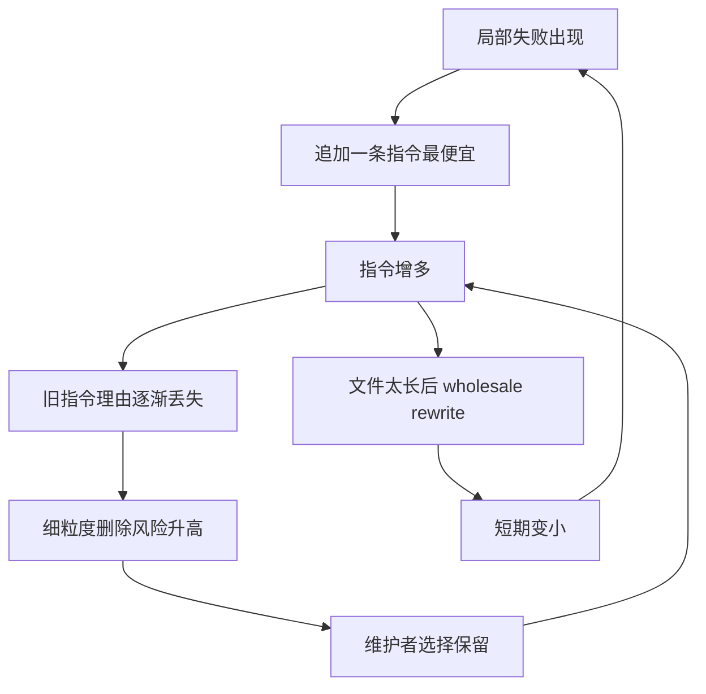

# Why Does CLAUDE.md Keep Growing?：Agentic Coding 中的灾难性记住

### 元信息

| 字段 | 内容 |
|---|---|
| 标题 | Why Does CLAUDE.md Keep Growing? Catastrophic Remembering in Agentic Coding |
| 作者 | Kushal Chakrabarti |
| 机构 | South Park Commons |
| 链接 | [arXiv:2608.11095](https://arxiv.org/abs/2608.11095) |
| 版本 | v1，2026-08-11 16:00:55 UTC 提交 |
| 方向 | 大模型 Agent / agentic coding / prompt maintenance |

### TL;DR

- 这篇论文讨论的不是“怎样写一个更强的 CLAUDE.md”，而是一个更基础的维护问题：为什么 `CLAUDE.md`、`AGENTS.md`、`copilot-instructions.md` 这类 agentic coding 上下文文件会持续变长，却很少被细粒度删除。
- 作者把现象命名为 **catastrophic remembering**：和灾难性遗忘相反，系统不是忘掉该保留的知识，而是因为忘了某条指令当初为什么被加入，维护者只好保留本该删除的指令。
- 论文给出一个机制模型：提示词维护者面对隐藏约束集合，只能看到带噪声、被审查过的失败反馈；追加一条指令成本近似 `O(1)`，但要安全证明某条旧指令可删，需要考虑指令子集的反事实组合，最坏成本变成 `O(2^|D|)`。
- 真实仓库证据来自 1,867 个 GitHub 仓库、247,694 条 instruction lifetimes 和 28,426 次可跟踪删除：agentic README 的 instruction count 生命周期内平均增长 +226%，每次 commit 净增约 +4.9 条指令，删除 hazard 随年龄下降，log-hazard slope 为 -0.032/commit。
- 大规模重写不是修复。论文把一次 commit 删除至少一半指令定义为 rewrite；77.3% 的 instruction deaths 来自 rewrite 或迁移，首次 rewrite 后文件降到 59.5%，但 10 次相关 commit 后又恢复到 91.5%，并且 rewrite 后增长率从 4.1%/commit 升到 4.9%/commit。
- 干预方案是 **prompt comments**：指令对 executor 可见，comment 只对下一个 maintainer 可见，记录“失败是什么、假设是什么、这个假设后来表现如何”。在 inverted IFEval 的可验证世界里，informative comments 把 51 步 excess size 从 +211.3% 降到 +1.4%，在 WildIFEval 复制实验中把约束满足率从 50.4% 提到 62.0%，相对提升 23.1%。
- 局限同样清楚：真实仓库部分是观察性研究；controlled experiment 的 cover 只有 2 到 3 条、15 步或 51 步；WildIFEval 使用 LLM judge 而非代码 verifier；结论主要覆盖公开 GitHub 的英文 agent context files，不能直接外推到非英文指令、系统提示词或 agent skill 文件。

### 研究问题：为什么“只增不删”值得单独研究？

- Agentic coding 的上下文文件已经变成一种轻量程序：
  - 它定义代码风格、测试命令、权限边界、禁止事项和项目约定。
  - 它会被 coding agent 反复读入，并影响后续每一次编辑。
  - 它不像普通 README 只解释给人看，而是直接参与执行轨迹。

- 但这些文件有一个反直觉的维护状态：
  - 删除整个文件不可行，因为已有研究显示带 context file 的仓库完成 agent 任务更快、token 更少。
  - 什么都保留也不可行，因为 instruction-following 会随着约束堆叠下降。
  - 真正困难的是“删掉哪一条”，而不是“要不要有一个文件”。

- 论文把问题重新表述为：
  - 维护者面对一个 prompt `D_t`。
  - 每条 instruction `d` 可能曾经修复某个失败。
  - 时间过去后，失败现场、添加理由和可复现实验消失。
  - 删除 `d` 的风险变得局部而尖锐；保留 `d` 的成本变得扩散而慢性。

### 论文主张与论证路线

| Claim | Mechanism | Evidence | Boundary |
|---|---|---|---|
| Agentic prompt 会持续增长 | 新失败容易通过追加指令修复，旧指令缺少可恢复理由 | 1,867 个仓库中 instruction count 生命周期内平均 +226% | 只测公开 GitHub 上三类 context files |
| 增长不是简单 staleness | 如果是过期，旧指令应更容易被删；如果是 imperfect recall，旧指令应更不容易被删 | deletion hazard 随 instruction age 下降，log-hazard -0.032/commit | matcher 只在 50 个手工 transition 上验证 |
| Rewrite 不能修复根因 | rewrite 删除的是“整块文件”，不是对单条指令的因果审计 | 首次 rewrite 后降到 59.5%，10 次 commit 后回到 91.5% | rewrite 阈值固定为 50%，迁移规则会 censor 一部分 deaths |
| Prompt comments 能阻断 ratchet | 把 latent reasoning 写在 maintainer 可见、executor 不可见的 channel 里 | inverted IFEval 中 T=51 excess 从 +211.3% 到 +1.4% | controlled world 规模小，约束可机械验证 |
| Comments 还能买回 instruction-following | 减少无关约束干扰，让真实约束更容易被满足 | WildIFEval 从 50.4% 到 62.0%，相对 +23.1% | 使用 LLM judge，且是 seeded excess 不是真实生长 |

### 方法机制：把 prompt 维护写成隐藏约束估计

论文的形式化模型并不复杂，核心是把“维护 CLAUDE.md”视为一个在线估计问题。

```text
目标：
  找到最小 instruction set D*，在不降低任务约束满足率的前提下，让 prompt 尽量短。

观察限制：
  维护者只能看到任务失败或通过，不能直接看到失败对应哪一个隐藏约束。

维护动作：
  追加 instruction 很便宜；删除 instruction 要证明它不再贡献任何约束。
```

作者定义：

```math
D^\star = \arg\min_{D \in M} |D|,
\quad
M = \arg\max_D \mathbb{E}_{j,c \in C_j}[q_c(D,j)]
```

变量解释：

| 变量 | 含义 |
|---|---|
| `j = (o_j, C_j)` | 一个任务，包含可见目标 `o_j` 和不可见约束集合 `C_j` |
| `D_t` | 时刻 `t` 的 prompt instruction 集合 |
| `d` | 某条具体 instruction |
| `q_c(D,j)` | 在 prompt `D` 下，任务 `j` 满足约束 `c` 的概率 |
| `D*` | 在保持最大约束满足率时，最短的 instruction cover |
| `|D_t| / |D*| - 1` | excess size，即超过最优 prompt 的比例 |

关键在删除成本。作者写出某条指令对约束 `c` 的边际贡献：

```math
\Delta_c(d|D) =
\mathbb{E}_j[q_c(D,j) - q_c(D \setminus \{d\},j)]
```

如果对所有约束 `c` 都有 `Δ_c <= 0`，这条指令才是 excess。问题是，单条删除测试不够，因为 redundancy 会让两条互相替代的指令看起来都“可删”，但同时删除就坏掉。诚实审计需要探测指令子集，最坏成本是：

```math
O(2^{|D_t|})
```

这就是论文的中心机制：

- 写下某条 instruction 的 latent reasoning `r_d`，成本近似 `O(1)`。
- 事后恢复 `r_d`，成本随 prompt size 和历史缺失急剧上升。
- 当 `r_d` 不可恢复时，维护者理性选择是“保留”，不是“冒险删除”。

### 灾难性记住：和灾难性遗忘的对称关系

论文最有价值的概念贡献，是把 prompt 膨胀从“工程习惯差”转成一个可测机制。

| 维度 | Catastrophic forgetting | Catastrophic remembering |
|---|---|---|
| 对象 | 参数或表示 | 人写给 agent 的 instruction |
| 失败形态 | 覆盖掉应该保留的知识 | 保留本该删除的约束 |
| 原因 | 新任务梯度破坏旧任务能力 | 旧指令的添加理由不可恢复 |
| 典型修复 | rehearsal、regularization、memory | prompt comments、provenance、可验证维护 |
| 资源约束 | 固定参数容量 | 固定上下文窗口和注意力预算 |

这个类比的意义在于：

- Agent memory 里“遗忘”通常有可观测代理信号，例如时间戳、冲突、context overflow。
- Agentic instructions 不一样，旧并不等于错，少触发也不等于没用。
- 因此，删除策略不能只看 age 或 frequency，而要看“当初为什么加入、现在是否仍支撑约束”。

### 观察性实验：真实仓库中 prompt 如何长大？

作者统计三类文件：

- `CLAUDE.md`
- `AGENTS.md`
- `copilot-instructions.md`

数据规模：

| 指标 | 数值 |
|---|---:|
| GitHub 仓库数 | 1,867 |
| instruction lifetimes | 247,694 |
| tracked deletions | 28,426 |
| hand-annotated transition 验证 | 50 |
| matcher precision / recall | 1.000 / 0.933 |

主要结果：

- 文件生命周期内 instruction count 平均增长 **+226%**。
- 平均每次触碰该文件的 commit 净增 **+4.9** 条 instruction。
- median file 已经有 **39** 条 instruction。
- 删除不是稳定剪枝，而常常是大规模 rewrite 或迁移。

作者用 deletion hazard 区分三种机制：

| 机制 | 对 deletion hazard 的预测 | 论文观察 |
|---|---|---|
| Instruction staleness | 越旧越过期，hazard 应随年龄上升 | 不符合 |
| Content fragility | 脆弱指令早死，剩下的更稳定，hazard 下降 | 部分符合但解释不足 |
| Imperfect recall | 越旧越想不起为什么写，hazard 下降；多作者时更强 | 符合 |

关键数字：

- Nelson-Aalen hazard 曲线显示 deletion hazard 随 instruction age 下降。
- repository-stratified bootstrap 下，log-hazard slope 为 **-0.032/commit**，区间约为 `[-0.047, -0.019]`。
- 多作者交互项为 **β_multi-author×age = -0.021**，`z = -11.7`，说明人越多，理由越容易丢。

### Rewrite 为什么不是解决方案？

论文把 rewrite 定义为：一次 commit 中 instruction 数量减少至少一半。这个定义粗糙，但足够捕捉“推倒重写”。

证据链：

- 77.3% 的 instruction deaths 来自 wholesale rewrite 或迁移到 sibling file。
- 其中 rewrite 和 migration 被当作 competing risks 做 censor，因为这类变化并不表示维护者逐条判断某条 instruction 没价值。
- 52 个文件按第一次 rewrite 对齐后，平均 instruction count 在 `t=0` 降到 rewrite 前的 59.5%。
- 10 次相关 commit 后，平均又恢复到 91.5%。
- rewrite 前增长率约 4.1%/commit，rewrite 后反而到 4.9%/commit。

用流程图看：



这说明 rewrite 只是把 `D_t` 暂时缩短，并没有恢复每条 instruction 的 provenance。下一轮失败到来时，追加仍然是低成本动作，ratchet 会重新启动。

### 干预设计：prompt comments 是给维护者看的，不是给 executor 看的

作者的方案不是把注释也塞给模型执行，而是区分两个 channel：

| Channel | 谁能看到 | 写什么 | 目的 |
|---|---|---|---|
| Instruction | executor 和 maintainer | 具体行为约束 | 影响 agent 输出 |
| Comment | maintainer | 失败、假设、结果 | 帮下一轮维护者判断是否保留 |

论文强调 comment 必须携带 outcome-grounded latent reasoning，而不是长得像注释的噪声。一个有效 comment 至少包含：

- 触发添加的失败是什么。
- 当前 instruction 试图覆盖哪个 hidden constraint。
- 它与其他 instruction 的关系是什么。
- 后续 rounds 中这个假设是否继续成立。

伪代码可以概括如下：

```text
Input:
  prompt D_t
  comments R_t
  failed task feedback F_t
  hidden verifiers C_j only visible to harness

State:
  maintainer-visible state = D_t + R_t
  executor-visible state = strip_comments(D_t + R_t)

Loop:
  1. executor runs task with instructions only
  2. harness scores constraints and returns censored feedback
  3. maintainer adds, edits, or deletes instructions
  4. if adding instruction d:
       write comment r_d = failure + hypothesis + observed outcome
  5. before next executor run:
       remove comments from executor prompt

Output:
  D_{t+1}: shorter prompt if latent reasoning proves instruction is excess
  R_{t+1}: provenance that keeps future deletion cheap

Failure boundary:
  if comments do not encode outcomes, they behave like comment-shaped noise
```

### Controlled experiment：inverted IFEval 如何让最优 prompt 可见？

真实 prompt 的 `D*` 不可知，因此不能直接测 excess size。作者用 inverted IFEval 构造可验证世界：

1. 隐藏原始 benchmark item 的 instructions `D_j`。
2. 保留 verifier `C_j`，但只让 harness 看到。
3. 用更强模型把 `D_j` 摘成任务目标 `o_j`。
4. 让 maintainer 从 `o_j` 和带噪反馈中重建 prompt。
5. 因为原始 `D_j` 已知，所以最小 cover `D*` 可计算。

核心对比：

| Arm | T | N | `|D_T|` | Excess size | Constraint satisfaction |
|---|---:|---:|---:|---:|---:|
| no prompt comments | 15 | 552 | 3.5 | +60.4% ±18.4 | 39.0% ±2.8 |
| comment-shaped noise | 15 | 552 | 3.3 | +53.2% ±14.6 | 40.3% ±2.7 |
| informative comments | 15 | 552 | 2.1 | -5.8% ±6.6 | 38.2% ±2.6 |
| no prompt comments | 51 | 184 | 6.6 | +211.3% ±105.3 | 44.0% ±4.9 |
| comment-shaped noise | 51 | 184 | 5.3 | +147.9% ±79.9 | 42.6% ±4.9 |
| informative comments | 51 | 184 | 2.2 | +1.4% ±22.1 | 44.0% ±4.7 |

解读：

- `T=15` 时，informative comments 在几乎不损失 constraint satisfaction 的情况下，把 prompt 拉到低于或接近 minimum cover。
- `T=51` 时，差距更明显：无注释 prompt excess +211.3%，informative comments 只有 +1.4%。
- comment-shaped noise 不能复制效果，说明不是“多写点旁白”有用，而是保存可操作的因果理由有用。

### WildIFEval 复制：真实约束里 comments 是否还能帮忙？

IFEval 的优点是 verifier 可机械执行，缺点是世界太干净。作者进一步用 WildIFEval 做复制：

- 每个 world 含 `K` 条真实 human-written constraints。
- 再混入 `G` 条来自其他 items 的 noisy instructions。
- WildIFEval 没有代码 verifier，因此用 arm-blind LLM judge 评分。
- judge 只看一个 constraint 和一个 response，不看 prompt、arm label 或历史。

关键设置和结果：

| 设置 | 数值 |
|---|---:|
| worlds | 64 |
| `K` | 1 |
| `G` | 16 |
| noisy instructions 造成的 correctness 损失 | 65.6% 到 41.5%，下降 24.1pp |
| comments 后满意率 | 50.4% 到 62.0% |
| 绝对提升 | 11.6pp，95% CI [5.1, 18.3]pp |
| 相对提升 | 23.1% |
| 第二 judge 复核 | 效果为 7.8pp，对比主 judge 的 11.6pp，差异 CI 覆盖 0 |

这部分证明的是“无关指令会伤害真实约束，comments 能买回一部分能力”。它没有证明真实仓库里同样会自然生长到这组 `G=16` 的噪声配置；这个外推仍要靠观察性仓库研究支撑。

### Figure 和 Table 逐项证据

| 图表 | 支撑什么 | 不能证明什么 |
|---|---|---|
| Figure 1a | 在 controlled world 中，informative comments 让 excess size 靠近最优 cover | 不能证明所有真实 CLAUDE.md 都会同幅度改善 |
| Figure 1b | 真实 agentic README 生命周期内 instruction count +226% | 不能单独区分增长机制 |
| Figure 2 | latent reasoning 未写下时，删除风险变成事后反事实审计 | 这是机制图，不是独立实验 |
| Figure 3 | 六个仓库样例显示 rewrite 后 ratchet 仍存在 | 样例图不能代表全部，只提供直观证据 |
| Figure 4 | 52 个文件首次 rewrite 对齐后，10 commit 内恢复到 91.5% | rewrite 阈值固定为 50%，其他阈值未系统变化 |
| Figure 5 | deletion hazard 随 age 下降，支持 imperfect recall | matcher 和 segmentation 误差仍可能影响斜率 |
| Table 1 | 把隐藏约束反馈拆成 instructability、interference、redundancy、censoring、stochasticity | 这些是假设属性，不是完整的人类维护模型 |
| Table 2 | informative comments 在 T=15 和 T=51 降低 excess size 且不牺牲满意率 | 任务是 inverted IFEval，可机械验证但规模偏小 |

### 相关工作位置：它补上的是“可删性”

论文把自己放在四条线之间：

- Agentic context file 经验研究：
  - 既有工作证明 context files 有用，也证明它们会增长。
  - 本文进一步把文件增长拆成单条 instruction lifetime，估计 deletion hazard。

- Agent memory 和 eviction：
  - MemGPT、Mem0、Zep、FSFM 等系统通常有 staleness、contradiction、overflow 等可观察触发器。
  - Agentic prompt 的 authored instruction 没有这么干净的删除信号。

- 软件工程注释传统：
  - 好注释记录 why，而不是重复 what。
  - Prompt comments 的核心就是把这个惯例搬到 agent-readable instruction 的维护层。

- Instruction following benchmark：
  - IFEval、FollowBench、WildIFEval 原本测“需要满足的约束越来越多会怎样”。
  - 这篇论文反过来测“无关或过时约束越来越多会怎样”。

### 证据边界与局限

作者没有回避边界，重要限制包括：

- 仓库研究是观察性证据：
  - 它能显示增长、rewrite、hazard 形态。
  - 它不能像 randomized experiment 一样单独证明所有真实仓库的因果机制。

- corpus 处理有固定选择：
  - 50% rewrite threshold 没有系统变化。
  - matcher 只在 50 个手工 transition 上验证。
  - per-corpus segmentation grammar 是最大的未测试自由度。

- Controlled experiment 世界偏小：
  - cover 通常只有 2 到 3 条 instruction。
  - horizon 是 15 或 51 步。
  - 一个模型同时扮演 maintainer 和 executor。
  - 约束是英文、机械可验证的 IFEval 约束。

- WildIFEval 复制有 judge 边界：
  - human-written constraints 没有代码 verifier。
  - 评分来自 arm-blind LLM judge。
  - 第二 judge 能复现方向，但 judge 不是 ground truth。

- 外推范围有限：
  - 未测非英文 instructions。
  - 未测系统提示词。
  - 未测 agent skill files。
  - 未测多 agent 团队长期协作下 comment 本身是否也会腐化。

### 关键段落细读：作者怎样把“工程坏味道”变成研究对象？

#### 第一层：先承认 context file 有价值

- 论文没有把 `CLAUDE.md` 增长简单说成“维护者懒”或“agent 乱写”。
- 作者先承认 context file 的正面作用：
  - 它能保留项目惯例。
  - 它能减少重复探索。
  - 它能让 agent 更快完成任务。
- 这一步很重要，因为如果 context file 本身无用，结论会退化成“删掉就好”。
- 论文真正提出的问题是：
  - 有用的信息和过时的信息混在同一个执行通道。
  - 维护者没有低成本办法区分二者。
  - 因此 prompt 维护缺的不是写入机制，而是删除机制。

#### 第二层：把删除风险写成反事实问题

- 普通代码里，删除一行代码可以通过单元测试、类型检查、编译器和覆盖率给出反馈。
- Agentic instruction 的删除更难：
  - 它可能只在某类未来任务中触发。
  - 它可能和另一条 instruction 共同覆盖一个约束。
  - 它可能曾经修复的是一个不再可见的失败。
- 作者用 `Δ_c(d|D)` 把这个难点压缩成一句话：
  - 要判断 `d` 是否 excess，必须知道移除它后每个 hidden constraint 的满足概率是否下降。
  - 但 hidden constraint 不直接暴露，失败反馈也不会说“是哪条 instruction 救了你”。
- 这使删除从文本编辑问题变成 counterfactual evaluation 问题。

#### 第三层：把 age slope 当作机制检验

- 如果论文只说“文件越来越长”，证据并不强，因为很多机制都能解释增长：
  - 项目变复杂。
  - 需求变多。
  - agent 能力变化。
  - 团队越来越依赖自动化。
- 作者真正有识别力的一步，是看单条 instruction 的死亡风险如何随年龄变化。
- 三种机制给出不同预测：
  - staleness：越老越可能不适用，所以更容易死。
  - fragility selection：脆弱的早死，剩下的自然更稳。
  - imperfect recall：越老越难知道为什么存在，所以越不敢删。
- 论文观察到 hazard 下降，并且多作者文件中 age 的负效应更强。
- 这并不能完全排除所有选择偏差，但它让“忘记为什么”成为比“自然过期”更贴合数据的解释。

#### 第四层：把 comment 设计成维护通道，而不是执行通道

- 很多 prompt 工程建议会把“解释理由”也放进模型上下文。
- 这篇论文刻意避免这种混淆：
  - executor 只读 instruction。
  - maintainer 读 instruction 和 comment。
  - harness 在执行前剥离 comment。
- 这个设计让实验问题更干净：
  - 如果 comment 起作用，不是因为 executor 得到更多提示。
  - 而是因为 maintainer 在下一轮能更便宜地判断保留、编辑或删除。
- 对 agentic coding 来说，这个区分很关键：
  - 写给 agent 执行的规则越多，干扰越强。
  - 写给未来维护者的 rationale 越清楚，规则越可删除。

### 细粒度实验解读：为什么 Table 2 不是“短 prompt 总是更好”？

- Table 2 的正确读法不是“informative comments 让 prompt 更短，所以更好”。
- 作者同时看两个目标：
  - excess size 是否下降。
  - constraint satisfaction 是否保持 parity。
- 如果 comment 只是让 maintainer 激进删除，满意率会下降；那不是胜利。
- 结果显示：
  - `T=15` 时 informative comments 的 excess 为 -5.8%，constraint satisfaction 为 38.2%，和 control 的 39.0% 接近。
  - `T=51` 时 informative comments 的 excess 为 +1.4%，constraint satisfaction 为 44.0%，和 control 的 44.0% 持平。
- 也就是说，comment 不是用正确率换长度，而是在同等正确率下减少多余 instruction。

公式化地看，目标不是：

```math
\min |D_T|
```

而是：

```math
\min |D_T|
\quad
\text{s.t.}
\quad
\mathbb{E}[q_c(D_T,j)] \approx \mathbb{E}[q_c(D^\star,j)]
```

这个约束条件决定了论文的实践边界：

- 不能为了“清爽”删除安全规则。
- 不能为了 token 预算牺牲关键任务约束。
- 只能在有 verifier、历史结果或 rationale 支撑时删除。

### 对安全规则的特殊含义

- Agentic coding 文件里常见的规则不只是风格偏好，还包括安全边界：
  - 不要提交 secret。
  - 不要运行 destructive command。
  - 不要绕过测试。
  - 不要访问未授权网络。
- 这些规则的删除风险更高，因为失败可能低频但严重。
- 因此，prompt comments 对安全规则的价值可能不是让它们更容易删除，而是让它们更容易被正确维护：
  - 说明规则防的是哪类事故。
  - 说明适用路径和例外路径。
  - 说明验证命令或审计证据。
  - 说明如果要删除，需要先满足什么替代控制。

可以把安全规则分成三类：

| 类型 | 删除策略 | comment 应记录 |
|---|---|---|
| 硬安全边界 | 默认不可删，只能迁移到更强控制 | 威胁、事故、合规原因、替代控制 |
| 工作流防错规则 | 可在工具化后删除或压缩 | 触发失败、工具覆盖范围、剩余人工步骤 |
| 风格/偏好规则 | 可按项目当前约定合并 | 适用模块、冲突规则、维护者共识 |

这个分类是论文之外的延伸，但它遵循论文机制：删除不是文本长度决策，而是 provenance 和 verifier 决策。

### 可复现性与数据释放信号

- arXiv 页面和 HTML 正文说明论文释放了代码、prompt、benchmark suites 和 per-rollout traces。
- 但当前 GitHub 仓库页面显示 repository 为空，说明“释放承诺”和“可立即复现”之间仍需二次核验。
- Hugging Face 数据页可访问 adapted multilingual agentic tool-use dataset 的字段、语言标签和样例，但这属于另一篇候选 `Actions Speak Louder than Words` 的材料，不应混入本篇结论。
- 对本篇 `CLAUDE.md` 论文，主 Agent 本轮可确认的是：
  - arXiv abstract、PDF、HTML 均可访问。
  - 论文内部给出数据规模、matcher 验证、rewrite 定义、IFEval/WildIFEval 设计和 limitations。
  - 若未来要复现实验，还需要确认作者是否发布了仓库抓取、segmentation、matcher、judge prompts 和 synthetic worlds。

### 如果把这篇论文用于真实团队，应该怎么落地？

- 最小改动不是重写所有规则，而是给新增规则加 rationale：

```text
Instruction:
  Run the integration test before editing payment code.

Comment:
  Added after task #42 broke a webhook retry path that unit tests missed.
  The integration test covers idempotency and signature verification.
  If payment tests move into CI-required checks, this instruction can be reduced.
```

- 第二步是把旧规则分批审计：
  - 找到没有 comment 的长期 instruction。
  - 根据最近失败、issue、测试或代码路径补 provenance。
  - 没有证据的规则先标记为 unknown，而不是立刻删除。

- 第三步是把 deletion audit 工具化：
  - 每条 instruction 关联一个验证命令或风险标签。
  - 删除 PR 必须说明替代控制。
  - Agent 修改 `CLAUDE.md` 时必须同时更新 comment。

- 这套实践不需要等待新模型能力：
  - 它首先改变信息结构。
  - 让未来维护者看见“为什么”。
  - 再让删除从恐惧驱动变成证据驱动。

### 一个容易误读的点：comments 不是越多越好

- 论文支持的是 informative comments，不是把每条规则旁边都写一段无检验价值的解释。
- 如果 comment 只重复 instruction 的字面含义，它会变成第二层噪声：
  - 维护者仍然不知道失败来自哪里。
  - 未来删除仍然没有证据。
  - prompt 文件只是从“规则膨胀”变成“规则加注释一起膨胀”。
- 因此，comment 的最低质量标准应当是可审计：
  - 能指向一次失败或一次验证。
  - 能说明这条规则覆盖哪个约束。
  - 能说明什么时候可以合并、迁移或删除。
- 这也解释了为什么论文里的 comment-shaped noise 没有显著效果：形式像注释不够，必须保存可用于维护决策的 latent reasoning。
- 换句话说，comment 的目标不是扩写 prompt，而是让未来维护者知道一条规则何时仍然必要、何时已经被测试或工具替代。

### 对 Agent 研究的延伸问题

- 如果 agent memory 需要 eviction policy，那么 agentic prompt 也需要 **deletion policy**：
  - 不是按年龄删。
  - 不是按 token budget 粗暴截断。
  - 而是按“是否仍有可恢复的因果理由”删。

- Prompt comments 可能变成 AgentOps 的基础结构：
  - 每条长期 instruction 都应有 provenance。
  - 每次失败修复都应记录 counterfactual hypothesis。
  - 每次删除都应绑定可复现实验或验证结果。

- 对 coding agent 来说，`CLAUDE.md` 不该只是规则清单，更像一个维护中的小程序：
  - instruction 是执行路径。
  - comment 是维护路径。
  - test harness 是回归边界。
  - deletion review 是安全更新。

- 最值得继续追问的是：
  - comments 会不会也增长成第二个不可维护文件？
  - 能否让 agent 自动生成、压缩、验证和淘汰 comments？
  - 对安全规则而言，哪些 instruction 允许删除，哪些必须保守保留？
  - 当多个 coding agents 共享一个仓库时，comment channel 是否需要权限、签名和审计？

### 结论

- 这篇论文的重要性在于，它把 `CLAUDE.md` 变长这件工程小事，提升成一个可建模、可测量、可干预的 agentic coding 维护问题。
- 它最强的贡献不是“大家以后多写注释”，而是说明：长期 prompt 的问题不只是上下文窗口不够大，而是 **可删除性没有被设计进系统**。
- 对研究者来说，下一步不应只做更长上下文或更强 instruction-following，而要研究带 provenance、带 verifier、带 deletion audit 的 agent prompt 生命周期。
