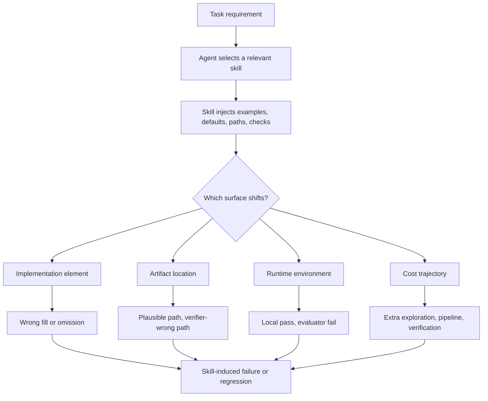

# Agent Skills Can Be Harmful：技能不是免费上下文，而是会改变轨迹的配置项

### 元信息

| 字段 | 内容 |
|---|---|
| 论文 | Agent Skills Can Be Harmful: An Empirical Study of Skill-Induced Failures in LLM Agents |
| 作者 | Gen Dong, Yanjie Gao, Liqun Li, Tianyin Xu, Yu Hua, Fan Yang |
| 时间 | arXiv v1，2026-08-12 10:15:19 UTC |
| 链接 | https://arxiv.org/abs/2608.11888 |
| 类型 | LLM Agent / 技能复用 / 失败归因实证研究 |

### TL;DR

- 这篇论文研究一个很具体的问题：LLM Agent 加载 `SKILL.md` 一类可复用技能后，为什么有时会失败或变慢，而不只是问“技能平均有没有帮助”。
- 作者把同一任务在不同技能设置下做成对照实验：固定任务、验证器、仓库或容器状态、Agent 框架和模型，只改变技能设置，再比较 `FAIL/PASS` 与 `PASS/PASS` 轨迹差异。
- 数据来自 SkillsBench 和 SWE-Skills-Bench，并扩展了公开技能候选；潜在成对比较从 826 扩展到 20,664，执行后得到 665 个候选，再筛成 307 个确认案例。
- 307 个案例里，125 个是功能失败，182 个是高置信效率回归；功能失败最大类是 Task-Implementation Fault，占 86/125，也就是 68.8%。
- 效率回归不是简单的“prompt 太长”：在 `T=2.0` 阈值下，Excessive Procedure 占 114/182，也就是 62.6%；其中过度验证 67 例，重型实现流水线 30 例。
- 作者还做了 SkillTriage：先把目标轨迹和参考轨迹规范化，再抽取差分证据，最后按 taxonomy 归因。它在功能失败上 exact subcategory 命中 111/125，在效率回归上命中 132/182。
- 论文最重要的判断是：<u>技能不是免费的提示词增强，而是会改变选择、环境、实现路径、验证范围和成本结构的运行时配置</u>。
- 局限也很清楚：实验只覆盖两个技能 benchmark、一个主 Agent 运行栈和特定技能生态；taxonomy 标签需要人工判断，SkillTriage 也只做“确认失败后的归因”，不是自动发现所有问题。

### 研究问题：为什么“技能有时有用”还不够？

这篇论文的背景不是“Agent 会不会用工具”，而是更细的一层：

- Agent 技能通常以文档包、示例、流程、约束、模板或检查表的形式提供。
- 它们被设计为可复用知识，目标是减少重复推理、给 Agent 一个更好的执行起点。
- 但技能不是静态知识库条目；一旦被加载，它会影响：
  - Agent 选择什么路线；
  - 读哪些文件；
  - 改哪些路径；
  - 是否安装依赖；
  - 是否多跑测试；
  - 是否把示例当成任务要求。

已有 benchmark 可以回答一个平均问题：

| 旧问题 | 可以得到的答案 | 不足 |
|---|---|---|
| 技能平均是否提高 pass rate | 某些任务上提高，某些任务上下降 | 不知道下降是由哪段技能内容或哪类轨迹变化触发 |
| 技能是否增加 token 或时间 | 可以测 token/time overhead | 不知道成本来自上下文膨胀、额外探索、依赖修复还是重复验证 |
| 某个技能是否“相关” | 可由名称、描述、embedding 判断 | 相关不等于安全；很多失败来自看起来相关的技能 |

作者要回答的是机制问题：

- 同一任务能被不加载技能或换一个匹配技能解决时，为什么某个技能会让它失败？
- 同一任务两个轨迹都通过验证时，为什么某个技能会让 token 或时间显著增加？
- 这些失败能不能被自动化工具归因到可修复的根因？

这使论文的研究单位从“模型能力”转到“技能诱导的轨迹差分”。

### 论文主张与论证路线

| Claim | Mechanism | Evidence | Boundary |
|---|---|---|---|
| 技能会诱导功能失败 | 固定任务、验证器、模型与环境，只改变技能设置，比较 `FAIL/PASS` | 125 个确认功能失败；86 个属于任务实现故障 | 只能说明这些 benchmark 和运行栈里的技能诱导机制 |
| 相关技能也会害人 | 大多数功能失败不是明显不适用，而是相关技能让实现元素错填、漏填或写错位置 | Applicability Mismatch 只有 2/125；Task-Implementation Fault 86/125 | 不能推出所有技能市场都同分布 |
| 成本回归主要来自轨迹动作 | 技能把探索、实现流水线、测试、调试、依赖修复变成额外步骤 | Excessive Procedure 114/182；过度验证 67，重型实现 30 | token/time 受运行环境影响，作者用高阈值降低噪声 |
| 自动归因可以做成 triage | 先规范化目标/参考轨迹，再抽取差分信号，再按 taxonomy 判断 | 功能失败 exact subcategory 111/125；效率回归 132/182 | 它处理的是已确认失败后的归因，不替代失败发现 |

### 方法机制：用成对执行把“技能诱导”隔离出来


作者的核心设计是 contrastive pair：

- target run：被审计的技能运行。
- reference run：同一任务下的无技能运行，或另一个语义匹配技能运行。
- 固定项：
  - 任务说明；
  - 验证器或测试；
  - 仓库、容器、输入数据；
  - Agent 框架；
  - 模型；
  - 运行证据记录方式。
- 变化项：
  - 技能设置。

因此，参考轨迹不是“标准答案”，而是 pseudo-oracle：

- 如果 target 失败而 reference 通过，说明同一任务在同一条件下可以被解决。
- 如果二者都通过但 target 成本显著更高，说明技能可能诱导了额外成本。
- 如果两条轨迹差异能落到 skill scope、环境、路径、实现元素或成本阶段，就可以进一步归因。

### 两类失败的形式化定义

功能失败比较简单：

```text
Functional Failure:
target_outcome = FAIL
reference_outcome = PASS
```

效率回归要求更严格。作者只比较 `PASS/PASS` 对，避免把“没做完所以省 token”这类情况混进去：

```text
令 r_tok  = target_tokens / reference_tokens
令 r_time = target_time   / reference_time

Efficiency Regression(T):
min(r_tok, r_time) > 1.0
and
max(r_tok, r_time) > T

主实验取 T = 2.0
```

这个定义有两个含义：

- 两个指标都要比 reference 更差，排除 token 与时间之间的简单 tradeoff。
- 至少一个指标要超过 2 倍，聚焦高置信成本回归。

### 数据与评测设置

| 组件 | 论文做法 | 为什么重要 |
|---|---|---|
| 原始 benchmark | SkillsBench 与 SWE-Skills-Bench | 都有可执行任务和确定性 verifier |
| 技能扩展 | 从公开技能站点找语义匹配技能，最多保留 top-5 | 不只看原始 curated skill，扩大对照空间 |
| Agent 栈 | OpenCode 1.15.1 + Claude Opus 4.6 | 代表现代代码/任务 Agent 设置 |
| 记录证据 | 技能、轨迹、verifier、token、执行时间 | 归因必须依赖轨迹差分，而非只看结果 |
| 数据筛选 | 去掉证据不足、verifier 过窄、重复同因案例 | 降低把普通噪声当技能问题的风险 |

潜在比较空间的扩展很关键：

| Benchmark | Pair type | 原始潜在比较 | 扩展后潜在比较 |
|---|---:|---:|---:|
| SkillsBench | with/no-skill | 168 | 504 |
| SkillsBench | cross-skill | 168 | 2,520 |
| SWE-Skills-Bench | with/no-skill | 490 | 2,940 |
| SWE-Skills-Bench | cross-skill | 0 | 14,700 |
| Total | - | 826 | 20,664 |

从这个角度看，论文不是简单复跑 benchmark，而是把 benchmark 改造成失败归因数据源。

### 方法流程：四阶段从执行到 taxonomy


四阶段可以写成伪代码：

```text
Input:
  benchmarks B = {SkillsBench, SWE-Skills-Bench}
  curated skills C
  public skill candidates P
  deterministic verifier V

State:
  task t
  skill setup s
  run record R(t, s) = {outcome, tokens, time, trajectory, artifacts}

Loop:
  for each curated skill c:
    retrieve public skills p with embedding similarity >= 0.7
    keep top-5 candidates

  for each task t:
    execute no-skill and skill setups
    collect R(t, s)

  for each target/reference pair:
    if target FAIL and reference PASS:
      mark functional-failure candidate
    if both PASS and cost ratio satisfies T=2.0:
      mark efficiency-regression candidate

  refine candidates:
    remove insufficient evidence
    remove verifier-narrow false positives
    collapse duplicate same-task/same-skill effects
    manually assign one root-cause label

Output:
  confirmed cases = 307
  functional failures = 125
  efficiency regressions = 182
```

这个流程最值得注意的边界是：

- 它依赖 deterministic verifier，因此更适合代码、文件、数据处理、可执行任务。
- 它不是从开放世界任务中发现所有技能风险，而是在可控任务中隔离技能造成的差异。
- 它要求 reference run 通过或更便宜，因此会漏掉“两种技能都失败”或“无技能也失败”的场景。

### RQ1：从候选到 307 个确认案例

| 阶段 | 功能失败 | 效率回归 | 合计 |
|---|---:|---:|---:|
| 自动标出的候选 | 315 | 350 | 665 |
| 最终分析案例 | 125 | 182 | 307 |

功能失败的来源：

- with/no-skill audit：
  - 起点 70 个候选；
  - 最终 38 个确认案例。
- cross-skill audit：
  - 起点 245 个候选；
  - 最终 87 个确认案例。

效率回归的来源：

- with/no-skill：
  - 最终 128 个。
- cross-skill：
  - 最终 54 个。

这说明 cross-skill 对功能失败特别重要：

- 如果只比较无技能和有技能，很多“技能 A 失败但技能 B 成功”的差异不会出现。
- 对技能生态来说，这比平均 pass rate 更有用，因为真实用户面临的是“哪个技能更合适”，不是“是否永远不加载技能”。

### RQ2：功能失败主要不是“不相关技能”，而是相关技能误导实现

125 个功能失败被分成四类：

| 类别 | 计数 | 占比 | 机制 |
|---|---:|---:|---|
| Applicability Mismatch | 2 | 1.6% | 技能元数据让 Agent 把不该用的技能用于任务 |
| Environment Mismatch | 13 | 10.4% | 技能引入依赖、安装、路径、工作目录或运行时状态偏差 |
| Task-Implementation Fault | 86 | 68.8% | 技能让任务要求被错填、漏填，或流程过重导致未完成 |
| Artifact Misplacement | 24 | 19.2% | 产物写到合理但不是任务指定的位置 |

这里最反直觉的地方是：

- Applicability Mismatch 只有 2 例。
- 大多数坏处不是“明显不相关技能被错误加载”。
- 真正危险的是“看起来相关”的技能，把 reusable default、示例、模板、路径习惯或检查表伪装成任务要求。

### Task-Implementation Fault：最大类别如何发生？

Task-Implementation Fault 内部有三类：

| 子类 | 计数 | 占比 | 解释 |
|---|---:|---:|---|
| Excessive Workflow | 4 | 3.2% | 技能诱导过度探索或设置，没来得及产出 |
| Incorrect Required-Element Fill | 46 | 36.8% | 用错误方法、API、值、策略或结构填充任务要求 |
| Required-Element Omission | 36 | 28.8% | 漏掉任务要求的字段、选项、行为或依赖步骤 |

作者给出的代表性例子很能说明问题：

- 一个表格任务要求把净出口算成 GDP 百分比。
- target run 在技能影响下使用 `(Exports - Imports) / GDP`。
- reference run 使用 `(Exports - Imports) / GDP * 100`。
- verifier 判断 target 值小了约 100 倍。

这个例子不是普通算术错误，而是技能导致的任务表达误读：

- 技能可能给出“比率”类示例；
- Agent 把示例默认形式迁移到当前任务；
- 当前任务要求的是百分数表示；
- reference run 证明同一任务可以正确做出百分比版本。

### 环境与路径：技能会改变 verifier 看到的世界

环境类失败有 13 个：

- Broken Environment：5 个。
- Incompatible Environment：8 个。

Artifact Misplacement 有 24 个。

这两类共同指出一个边界：

- 技能不只影响文本推理；
- 它还会影响 shell 命令、安装状态、工作目录、包解析、产物路径；
- verifier 看到的是最终仓库和运行环境，不是 Agent 自认为测试通过的那个世界。

论文里的典型模式包括：

- Agent 安装了外部包并在 `/tmp` 里验证，但任务 verifier 从仓库内包导入。
- Agent 认为真实包名是 `langchain_classic`，于是把文件写到“更合理”的目录，但任务明确要求写到 `libs/langchain/langchain/`。

这对 Agent 安全很重要：

- 如果技能能诱导环境变更，它就不只是 prompt injection 风险。
- 更准确的单位是：技能 + 轨迹 + 仓库状态 + verifier 可见产物。

### RQ3：效率回归主要来自动作，而不是 prompt 长度

182 个高置信效率回归的分类：

| 类别 | 计数 | 占比 | 机制 |
|---|---:|---:|---|
| Context Bloat | 46 | 25.3% | 技能正文或引用材料让每次模型调用更贵 |
| Excessive Procedure | 114 | 62.6% | 技能诱导额外探索、实现流水线、验证或调试 |
| Dependency Resolution | 22 | 12.1% | 技能引入脆弱依赖，虽然最终通过但修复成本高 |

Context Bloat 内部也有一个强结论：

| 子类 | 计数 | 说明 |
|---|---:|---|
| Skill Body Bloat | 43 | 成本主要来自始终加载的技能正文 |
| Supplementary Material Bloat | 3 | 成本来自额外读取参考、模板或文档 |

这支持一个实际设计原则：

- skill body 应该短；
- 长示例、模板、背景材料应放到明确触发的 lazy-loaded reference；
- 否则每次模型调用都会为“也许用得上”的内容付费。

### Excessive Procedure：技能把可选谨慎变成强制流程

Excessive Procedure 是最大效率回归类：

| 子类 | 计数 | 占比 | 轨迹表现 |
|---|---:|---:|---|
| Excessive Exploration | 17 | 9.3% | 过度读仓库、查架构、找模式 |
| Heavy Implementation Pipeline | 30 | 16.5% | 使用多阶段转换、子进程、模拟或复杂构建 |
| Excessive Verification | 67 | 36.8% | 重复测试、重建、调试、检查清单 |

这里的关键不是“验证不好”。问题是验证范围没有和任务风险、变更大小、剩余预算绑定：

- 小改动也进入完整检查清单。
- 已产出主 artifact 后，技能仍诱导多轮验证和调试。
- 有些技能把“最好做”的流程写成“必须做”的流程。

这给技能作者的启发非常直接：

- 把验证策略写成条件分支，而不是固定清单。
- 区分 tiny edit、medium integration、large migration。
- 写明何时停止验证，何时升级到更重流程。

### RQ4：SkillTriage 如何把 taxonomy 变成工具？


SkillTriage 不是用来自动发现失败的工具，而是用来做 post-confirmation triage：

- 输入：
  - 任务；
  - target run；
  - reference run；
  - loaded skill；
  - verifier 结果；
  - 轨迹、产物、token/time。
- 输出：
  - 高层类别；
  - 子类别；
  - 归因理由；
  - 引用的技能片段或轨迹证据；
  - 修复建议。

它的三阶段流程：

1. Input construction：
   - 规范化任务视图；
   - 规范化 target/reference 两个 run view；
   - 检查是否有最低限度的轨迹、技能和 verifier 证据。
2. Differential evidence：
   - 对功能失败抽取 DS1-DS5；
   - 覆盖 skill scope、环境、实现、artifact location；
   - 对效率回归抽取阶段级和 action-tag 级成本差异。
3. Attribution：
   - 给模型 taxonomy、规范化输入和差分证据；
   - 让模型选择最能解释 target/reference 差异的根因。

### 机制细读：相关技能为什么会变成偏差源？

论文里最有价值的机制，不是“技能可能坏”，而是解释了“相关技能也会坏”。



可以把这条链拆成四个观察：

- 第一，技能的相关性只解决 selection 问题，不解决 compatibility 问题。
  - 一个 RAG 技能确实和 RAG 任务相关；
  - 但它可能把示例里的参数集合当成当前任务的完整参数集合；
  - 于是遗漏 `model_name` 这类 verifier 要求的字段。
- 第二，技能提供的是 reusable procedure，不是 task-local truth。
  - reusable procedure 对很多任务有帮助；
  - 但当前任务可能有更硬的输出路径、格式、百分比单位或包内集成点；
  - 当 Agent 用技能默认流程覆盖任务约束时，错误就会出现。
- 第三，技能会改变 Agent 的停止条件。
  - 原本一次实现加一次测试就够；
  - 技能可能要求完整扫描、全量重建、多轮检查；
  - 这就是效率回归里 Excessive Verification 最大的原因。
- 第四，技能把“解释性上下文”变成“行动性约束”。
  - 人读技能文档时会知道示例只是示例；
  - Agent 可能把示例写成 implementation plan；
  - 所以技能设计必须显式标注 mandatory、optional、example、fallback 和 stop condition。

### 公式视角：成本回归为什么要同时看 token 和时间？

作者没有只用 token，也没有只用 wall time，而是要求两者都变差：

| 判断方式 | 会误判什么 | 本文定义如何缓解 |
|---|---|---|
| 只看 token | 某些轨迹 token 多但命令少，实际更快 | 要求 time ratio 也大于 1 |
| 只看时间 | 网络、安装、缓存、机器负载可能造成波动 | 要求 token ratio 也大于 1 |
| 只看均值 | 少数小波动会污染标签 | 主阈值 `T=2.0` 只收高置信大回归 |
| 只看单 run | Agent 随机性可能造成偶然路线 | 用同任务 reference run 做 contrast |

因此，`min(r_tok, r_time) > 1` 的作用是排除 tradeoff：

- 如果 token 更多但时间更少，不能直接说技能让任务变差。
- 如果时间更长但 token 更少，也可能是外部命令或环境波动。
- 只有两个维度同时恶化，并且至少一个维度超过阈值，才进入高置信效率回归。

这个定义也解释了为什么论文最后仍然说它不是“全部性能问题”：

- 它更偏向 precision，而不是 recall。
- 它可能漏掉只在 token 或只在时间上显著变差的技能。
- 但作为根因 taxonomy 的数据源，高置信样本比泛化覆盖更重要。

### 对技能作者的可执行修正

这篇论文隐含了一组更具体的 skill authoring 规则：

| 风险 | 写技能时应怎么避免 | 对应证据 |
|---|---|---|
| 示例被当成任务要求 | 给示例加“仅当任务要求 X 时使用” | Wrong fill / omission 占多数 |
| 路径被替换成“更合理路径” | 明确任务指定路径优先于包习惯路径 | Artifact Misplacement 24 例 |
| 安装或切换目录污染 verifier | 把环境变更写成 gated action，并要求恢复或说明 | Environment Mismatch 13 例 |
| 检查清单无限扩张 | 给验证步骤加停止条件和预算条件 | Excessive Verification 67 例 |
| 技能正文太长 | 把长示例、背景、模板移到 lazy reference | Context Bloat 中 43/46 来自 skill body |

更理想的 `SKILL.md` 不应该只是“怎么做”，还应该写：

- 适用条件；
- 不适用条件；
- 必须遵守的任务约束优先级；
- 可选流程和升级条件；
- 什么时候不要继续探索；
- 什么时候停止验证；
- 哪些操作会改变环境或路径。

### SkillTriage 的结果与边界

功能失败：

| 子集 | Exact subcategory | Category | Task-Implementation 子类 |
|---|---:|---:|---:|
| With/no-skill | 35/38，92.1% | 37/38，97.4% | 15/17，88.2% |
| Cross-skill | 76/87，87.4% | 80/87，92.0% | 61/69，88.4% |
| Combined | 111/125，88.8% | 117/125，93.6% | 76/86，88.4% |

效率回归：

| 子集 | Exact subcategory | Category | Excessive Procedure 子类 |
|---|---:|---:|---:|
| With/no-skill | 98/128，76.6% | 102/128，79.7% | 49/69，71.0% |
| Cross-skill | 34/54，63.0% | 43/54，79.6% | 29/45，64.4% |
| Combined | 132/182，72.5% | 145/182，79.7% | 78/114，68.4% |

残余错误集中在 taxonomy 边界：

- 功能失败里，Incorrect Required-Element Fill 和 Required-Element Omission 有时难分。
- Environment Mismatch 和 Wrong Artifact Location 也可能共现。
- 效率回归里，一条高成本轨迹可能同时有依赖修复、验证循环和 skill-body 成本。

所以 SkillTriage 的合理定位不是自动判官，而是 triage assistant：

- 给出证据；
- 标出可能根因；
- 暴露边界不确定性；
- 帮技能作者或平台维护者更快定位修复面。

### 关键 Figure / Table 证据解读

| 证据 | 支持什么 | 不能证明什么 |
|---|---|---|
| Fig. 2 differential evaluation | 技能归因要靠 target/reference pair，而不是单条失败轨迹 | 不能保证 reference run 是唯一正确路线 |
| Fig. 3 methodology | 论文从 benchmark、技能扩展、执行记录到人工 refinement 是一条闭环 | 不能覆盖开放世界全部技能生态 |
| Table I comparison space | 扩展后 20,664 个潜在成对比较让 cross-skill 归因可行 | 潜在比较不等于全部执行成功 |
| Table II dataset flow | 665 候选筛成 307 确认案例，说明作者做了证据过滤 | 人工筛选仍带主观判断 |
| Table III functional taxonomy | 86/125 指向 Task-Implementation Fault，反驳“坏技能多是不相关技能” | 不能推出每个平台都同样分布 |
| Table IV efficiency taxonomy | 114/182 指向 Excessive Procedure，说明动作成本大于纯上下文成本 | token/time 在不同运行栈可能变化 |
| Table V/VI SkillTriage | taxonomy 可被工具化，尤其功能失败归因较稳 | 效率回归 exact subcategory 仍明显更难 |

### 与相关工作的关系

论文建立在三个邻近方向上：

| 方向 | 已有工作关心什么 | 本文补上的问题 |
|---|---|---|
| Agent skills benchmark | 技能平均是否提升任务表现 | 技能具体通过什么机制诱导失败或成本 |
| Agent failure taxonomy | 从轨迹中总结 Agent 失败类型 | 把失败归因限定到 loaded skill 的差分影响 |
| SWE / tool-use Agent 评测 | Agent 是否完成仓库任务、工具任务 | 技能如何改变文件路径、验证环境和实现路线 |

它和一般 prompt injection / malicious tool 研究也不同：

- 本文的技能不一定恶意；
- 失败常来自“有用但过强”的指导；
- 风险更像配置错误、过度泛化和成本失控。

这使它更接近日常 Agent 平台会遇到的问题：

- 技能市场里大量技能是善意的；
- 用户加载技能是为了提高效率；
- 但善意技能仍可能把任务拉进错误抽象层。

### 结论与局限

可以把这篇论文的结论压缩成三句话：

1. 技能是一个会改变 Agent 轨迹的配置项，不是中性的知识补丁。
2. 技能风险主要来自相关技能对任务实现、产物路径、环境状态和验证范围的误导。
3. 更安全的技能系统需要 compatibility check、cost prediction、lazy loading 和 paired correctness/cost evaluation。

局限需要保留：

- 数据只来自 SkillsBench 与 SWE-Skills-Bench，虽然覆盖多个领域和仓库任务，但不是所有 Agent 场景。
- 主运行栈是 OpenCode + Claude Opus 4.6，其他模型、框架、权限系统可能改变分布。
- 公开技能检索依赖名称、描述、embedding 相似度和阈值，可能漏掉其他技能形态。
- 功能失败和效率回归标签需要人工判断，作者用排除模糊样本、group consensus 和 SkillTriage 一致性检查降低风险，但不能消除主观性。
- SkillTriage 只对“已确认的 target/reference 差异”做归因，不能自动保证真实部署里所有技能风险都会被发现。

### 研究者视角的继续追问

这篇论文最值得继续推进的方向不是再做一个更大的 pass-rate 榜单，而是把“技能加载”做成可验证的运行时决策：

- Skill compatibility：
  - 能否从任务中抽取 hard constraints，例如路径、API、输出格式、环境、禁止动作？
  - 能否在加载技能前检测技能默认值、示例路径、依赖建议是否冲突？
- Cost-aware routing：
  - 能否估计一个技能会增加多少固定上下文成本？
  - 能否预测它可能诱导多少额外探索、验证和依赖修复步骤？
- Budget-aware execution：
  - 技能是否应该声明轻量、标准、严格三档验证策略？
  - Agent 是否应根据 change size 和 remaining budget 自动降级流程？
- Security boundary：
  - 技能能否声明它会影响的权限面：文件、shell、网络、依赖、测试、提交？
  - 技能市场是否应该提供轨迹级回放证据，而不只是评分和描述？
- Evaluation design：
  - 未来 benchmark 应该同时报告 pass rate、token/time、reference-pair delta、artifact correctness 和 environment divergence。
  - 对 Agent 安全来说，平均成功率不足以描述风险；更重要的是失败是否可归因、可复现、可阻断。

最实用的 takeaway 是：<u>技能复用的安全边界不在技能文本本身，而在技能文本如何改变 Agent 的下一条轨迹</u>。如果平台只审查 `SKILL.md` 内容，不审查它诱导的文件变更、环境变更、验证循环和成本曲线，就会漏掉这篇论文最关心的那类失败。

这个边界需要持续验证。
