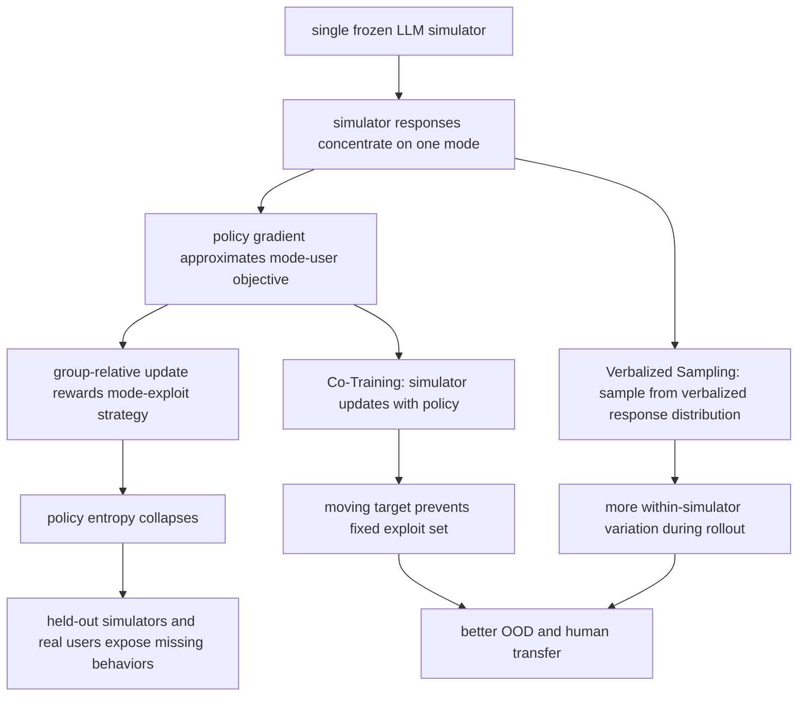

# One Frozen Simulator Is Not Enough：为什么多轮 Agent RL 不能只靠一个冻结用户模拟器

## 元信息与 TL;DR

| 字段 | 内容 |
|---|---|
| 论文 | One Frozen Simulator Is Not Enough: Simulator Collapse in Multi-Agent RL |
| 方向 | 大模型 Agent / 大模型后训练 |
| 官方链接 | <https://arxiv.org/abs/2608.12253> |
| PDF | <https://arxiv.org/pdf/2608.12253> |
| arXiv 版本 | `arXiv:2608.12253v1` |
| 官方提交时间 | 2026-08-12 16:55:50 UTC |
| 作者 | Simon Yu, Nicholas Tomlin, Marwa Abdulhai, Ximing Lu, Derek Chong, Abe Hou, Dilara Soylu, Sergey Levine, Christopher D. Manning, Weiyan Shi |
| 篇幅 | 41 页，28 个图 |
| 本文关注 | 多轮 RL 里，训练环境的多样性如何决定 Agent 是否能泛化到新用户和真实用户 |

### TL;DR

1. 这篇论文讨论的不是普通“用户模拟器不够像人”，而是一个更具体的训练失败：如果多轮 RL 只用一个冻结 LLM 当用户，策略会学会利用这个模拟器的主导反应模式，训练奖励上升，但迁移到其他模拟器和真人时下降。
2. 作者把这个失败命名为 **simulator collapse**：冻结模拟器在训练轨迹上呈现低多样性，导致策略梯度接近“模式用户”的梯度；GRPO/REINFORCE 的组内优势不再比较用户鲁棒性，而是在比较谁更会 exploit 这个单一模式。
3. 理论部分用 POMDP 表达多轮互动：状态是完整对话历史，策略 `pi_theta` 与用户模拟器 `phi_psi` 共同决定轨迹分布；当模拟器每轮偏离其 mode 的概率很小，真实训练梯度与 deterministic mode-user objective 的梯度距离被总 collapse error 控制。
4. 作者给出两类互补修复：**Verbalized Sampling** 在推理/rollout 时让冻结模拟器先说出多个可能回复及概率再采样，增加单个模拟器内部多样性；**Co-Training** 在训练时同步更新用户模拟器，让策略面对不断移动的 partner，避免锁定固定 exploit set。
5. 实验覆盖三类多轮任务：Persuasion for Good、`tau^2`-bench 和 CooperBench；Qwen3-4B-Instruct 上，`tau^2` Retail 从 RL Single 的 46.1 提到 VS 的 55.5、Co-Training 的 60.5、Population Co-Training 的 62.2；Airline 从 29.8 提到 36.9、44.4、45.7。
6. 人类实验不是只看 LLM panel：`tau^2` Retail 与 Persuasion for Good 各 4 个条件、每格 N=40，共 320 个 Prolific session；`tau^2` task outcome 从 RL Single 的 0.43 提到 VS 的 0.63、Co-Training 的 0.70。
7. 消融说明“人多”本身不够：Population Co-Training 的 checkpoint pool 在 `K=5` 附近最好，过小缺少差异，过大会引入 stale partner；模拟器 reward 若太 adversarial 或太 cooperative，都会把模拟器重新推向单一模式。
8. 局限也很清楚：实验是英文、文本、两方互动；LLM held-out panel 仍可能共享 alignment bias；Co-Training 多约 2 倍训练计算；SCOPE 框架的论文承诺需要进一步检查公开仓库、版本和复现实验脚本。

---

## 1. 研究问题：为什么“训练奖励上涨”可能是坏信号？

### 论文真正反对的基线是什么？

作者针对的是一个常见多轮 Agent RL 配方：

1. 用一个冻结 LLM 模拟用户。
2. 让 Agent 和这个模拟器反复交互。
3. 用任务终局 reward 做 REINFORCE / GRPO 类更新。
4. 选训练中表现最好的 checkpoint。
5. 默认认为它也会迁移到真实用户或新模拟器。

问题在于，多轮任务里的模拟器不是静态 verifier：

| 单轮可验证 RL | 多轮人机互动 RL |
|---|---|
| verifier 通常只判断最终答案 | 用户模拟器决定下一轮状态 |
| 环境反馈相对固定 | 模拟器分布改变策略访问到的历史 |
| reward hacking 多发生在答案格式或解题捷径 | exploit 可能发生在对话策略、请求顺序、协调话术 |
| 训练成功通常更接近任务成功 | 训练成功可能只是学会哄好一个 frozen user |

这篇论文的核心问题是：

```text
当训练环境本身由一个 mode-collapsed LLM 充当时，
RL 到底是在学习通用互动能力，
还是在学习一个只对这个模拟器有效的脚本？
```

### 为什么它属于 Agent 与后训练交叉问题？

这篇文章不是单纯 benchmark 论文，也不是只改 RL 算法：

1. **Agent 侧**：任务都是多轮互动，包括说服、客服工具调用、协作编码。
2. **后训练侧**：核心训练环路是 multi-turn RL，涉及 group-relative advantage、entropy collapse、policy checkpoint selection。
3. **安全/可靠性侧**：如果企业用 LLM 用户模拟器训练客服、销售、协作编码 Agent，训练曲线好看不代表部署可用。
4. **评测侧**：它把“看一个 held-out score”推进到“看训练 reward、OOD eval、policy entropy、zero-variance batches、人类转移”联动诊断。

---

## 2. 论证路线：claim -> mechanism -> evidence -> boundary

### 总主张

作者的总 claim 可以拆成四层：

| 层级 | 内容 | 证据类型 |
|---|---|---|
| claim | 单冻结模拟器会让 multi-agent RL 发生 simulator collapse | 理论定义 + 训练曲线 |
| mechanism | 模拟器 mode 主导轨迹，策略梯度近似 mode-user 梯度，策略熵几何下降 | POMDP、TV bound、log-odds 递推 |
| evidence | VS 与 Co-Training 分别打断 collapse 链条，在三类任务和人类实验上提升 | Table 1/2/3、Figure 3/4/15/16/19 |
| boundary | LLM panel、人类样本、英文文本任务、计算成本、reward shaping 都限制结论外推 | Appendix A/F |

### 关键流程图



这个图的重点不是“多样性越多越好”的口号，而是两条修复分别作用在不同断点：

1. VS 改的是每一轮模拟器响应分布。
2. Co-Training 改的是跨训练步的 partner 分布。
3. Population Co-Training 再把“最新 partner”扩成一组近期 checkpoint。

---

## 3. 方法机制：从 POMDP 到 simulator collapse

### 多轮互动如何形式化？

论文把多轮对话写成两方 POMDP / POSG：

| 符号 | 含义 | 在论文中的作用 |
|---|---|---|
| `s_t` | 到第 `t` 轮前的完整历史 | 决定策略和模拟器看到的上下文 |
| `a_t^pi` | Agent 在第 `t` 轮的动作或 utterance | 由策略 `pi_theta(. | s_t)` 采样 |
| `a_t^phi` | 用户模拟器回复 | 由 `phi_psi(. | s_t, a_t^pi)` 采样 |
| `tau` | 完整轨迹 | 终局 reward `R(tau)` 的对象 |
| `J(theta; psi)` | 策略目标 | 对 `tau ~ (pi_theta, phi_psi)` 的期望 reward |
| `d_psi^{pi_theta}(s)` | 状态访问分布 | 由策略和模拟器共同决定 |

公式写作：

```text
tau = (s_0, a_0^pi, a_0^phi, ..., s_T)
J(theta; psi) = E_{tau ~ (pi_theta, phi_psi)}[R(tau)]

关键点：
模拟器不只是打分器；
它决定策略会进入哪些历史状态，也决定后续梯度来自哪些交互片段。
```

### policy update 为什么会被模拟器模式污染？

作者使用 group-relative normalization：

```text
给定同一任务的一组 G 条轨迹：

A_hat_n = (R(tau_n) - R_bar) / sigma_R
R_bar = (1/G) * sum_n R(tau_n)
sigma_R = sqrt((1/G) * sum_n (R(tau_n) - R_bar)^2)
```

如果模拟器在训练历史上总给类似反应，会出现两种情况：

1. `sigma_R = 0`：组内 reward 没有差异，更新停住。
2. `sigma_R > 0`：差异主要来自 Agent 是否更会利用模拟器固定偏好，而不是是否能服务多类用户。

这就是论文说的“active but biased gradient”：梯度没有消失，但朝向错误。

### simulator collapse 的定义

论文先定义模拟器在某个历史和 Agent 动作后的 mode：

```text
a_phi^*(s, a^pi) in argmax_{a^phi} phi_psi(a^phi | s, a^pi)

epsilon_phi(s, a^pi) = 1 - phi_psi(a_phi^*(s, a^pi) | s, a^pi)
```

解释：

1. `a_phi^*` 是模拟器最可能给出的回复。
2. `epsilon_phi` 是偏离该回复的概率。
3. 如果训练轨迹上 `epsilon_phi` 很小，模拟器虽然表面能生成很多文本，但在策略实际访问的状态里近似 deterministic。

定义 3.1 的要点：

```text
如果在训练 rollout 访问到的 simulator turns 上，
E[epsilon_phi(s_t, a_t^pi)] <= epsilon_star，
就称模拟器在训练 rollouts 上 epsilon_star-collapsed。
```

作者强调这一定义绑定训练分布：

1. 一个模拟器跨数据集可能很丰富。
2. 但当前策略访问到的历史可能很窄。
3. 只要这些历史上的回复集中，RL 仍会 collapse。

---

## 4. 理论链条：梯度、方差、熵与迁移失败

### Theorem 3.2：collapse 让梯度靠近 mode-user objective

作者构造两个环境：

| 环境 | 用户模拟器行为 |
|---|---|
| `M_phi` | 按原始 `phi_psi` 分布采样 |
| `M_mode` | 每个用户回合都确定性输出 mode `a_phi^*` |

定义一条 rollout 上的累积 collapse error：

```text
epsilon_bar_H(theta) = E[sum_{t=1}^H epsilon_phi(s_t, a_t^pi)]
```

在 reward 有界、policy score 有界的假设下：

```text
D_TV(P_phi^theta, P_mode^theta) <= epsilon_bar_H(theta)

|| grad_theta J_phi(theta) - grad_theta J_mode(theta) ||
    <= 2 * B * R_max * epsilon_bar_H(theta)
```

研究含义：

1. 当每轮偏离 mode 的概率很小，真实训练轨迹分布接近 mode-user 轨迹分布。
2. 策略更新不是“没学到东西”，而是学到了一个 deterministic user 的最优脚本。
3. 论文也承认该 bound 是解析方向，不是对实际 GRPO surrogate 的精确刻画。

### Lemma 3.3：组内方差会失去用户侧对比

作者把 reward 方差拆成两部分：

```text
Var[R_x | x]
= E_{agent randomness}[ Var_{user randomness}(R_x | x, agent randomness) ]
+ Var_{agent randomness}[ E_{user randomness}(R_x | x, agent randomness) ]
```

| 方差项 | 表示什么 | collapse 后的问题 |
|---|---|---|
| simulator-side contrast | 用户不同反应导致的 reward 差异 | 被 mode-collapsed simulator 压低 |
| agent-side contrast | Agent 自身采样导致的 reward 差异 | 剩下的多是“谁更会 exploit mode” |

Figure 19 的 zero-variance batch fraction 从约 60% 升到超过 85%，就是这个机制的经验诊断之一。

### Proposition 3.4 / Corollary 3.5：策略质量会集中到 exploit set

作者抽象出策略簇 `Y`，把一组能利用 mode-user 的策略叫作 `A_x`。如果 `A_x` 相对其他策略有 gap `Delta_x`，KL-regularized softmax 更新会让 log-odds 递增：

```text
log q_{k+1}(A_x | x) / q_{k+1}(A_x^c | x)
>=
log q_k(A_x | x) / q_k(A_x^c | x) + g_x
```

迭代后：

```text
q_k(A_x | x)
>= 1 / (1 + ((1 - q_0(A_x|x)) / q_0(A_x|x)) * exp(-k * g_x))
```

解释：

1. 如果 exploit set 固定，策略质量会几何速度向它集中。
2. 当 exploit set 也是低熵文本模式，例如固定开场、固定追问、固定协调脚本，token entropy 会跟着下降。
3. 这解释了 Figure 3/4/19 中训练 reward 上升、OOD eval 回落、entropy 近零的组合。

---

## 5. 两种修复：VS 与 Co-Training 的分工

### Verbalized Sampling：不训练模拟器，但改变 rollout 采样

VS 的想法来自前作 Verbalized Sampling：

1. 不直接让模拟器给一个最可能回复。
2. 先让它列出多个可能回复及概率。
3. 再从这个 verbalized distribution 中采样。

在本文里，它的作用是提高每轮 `epsilon_phi`：

| 直接 prompting | Verbalized Sampling |
|---|---|
| 容易输出最典型回复 | 显式展开候选回复分布 |
| 用户侧 variance 低 | 用户侧 variance 较高 |
| 梯度接近 mode-user | 梯度更接近 reference-user |
| 不增加训练模型数量 | 增加推理/rollout 解码成本 |

论文的 Proposition 3.7 给出正向版本：

```text
如果 p_phi^VS(. | s, a^pi) 与 reference distribution P(. | s, a^pi)
在每轮 TV 距离上不超过 eta，
那么轨迹分布与梯度距离也由 eta_bar_H 控制。
```

边界也必须写清：

1. reference distribution 不等于真实用户分布。
2. VS 可能漏掉某些行为类型，尤其当候选数有限或模型 verbalization 本身偏合作。
3. 它缓解 collapse，但 Figure 25/26 显示不能完全消除。

### Co-Training：让 exploit target 不再固定

Co-Training 的核心不是“换一个更强用户模型”，而是让用户模拟器和策略一起更新：

1. 同一条 rollout 里，Agent 和 simulator 都接收自己的训练信号。
2. simulator 的 mode 随训练步改变。
3. 昨天有效的 exploit strategy，今天可能不再有效。
4. 因此 Corollary 3.5 依赖的固定 `A_x` 被破坏。

作者还提出 Population Co-Training：

| 方法 | partner 来源 | 直觉 |
|---|---|---|
| Co-Training | 最新 simulator checkpoint | moving target |
| Population Co-Training | 近期 simulator checkpoint pool | 保留当前差异，减少单一最新 partner 的偶然性 |
| Frozen ensemble | 固定不同模型 | 有多样性，但不会随策略共同进化 |
| Persona-Guided | 单模型加 persona prompt | 增加表面条件，不一定改变训练轨迹分布 |

关键边界：

1. Co-Training 需要 simulator reward 设计，否则 simulator 会 collapse 到另一个 mode。
2. 训练计算更贵，因为两个模型更新。
3. Population pool 太大会引入 stale checkpoint，太小又没有足够差异。

---

## 6. 实验设置：三个多轮场景分别测什么？

### 任务矩阵

| Benchmark | 互动结构 | reward | 为什么适合本文 |
|---|---|---|---|
| Persuasion for Good | 说服捐款者给公益项目捐款 | `min(donation/2, 1)` | 连续 reward，能观察话术多样性和真人转移 |
| `tau^2`-bench | 用户与客服 Agent 共同修改共享状态 | retail / airline 成功率 | 工具调用、政策遵循、用户 pushback 都会影响多轮轨迹 |
| CooperBench | 两个编码 Agent 协作解决可能冲突的任务 | 二元 task success | 对称合作，不再是固定用户-助手关系 |

### 模型、基线与评估

论文主实验包括这些方法：

| 方法 | 是否更新 Agent | 是否更新 simulator | 多样性来源 |
|---|---:|---:|---|
| Base | 否 | 否 | 无训练 |
| RL Single | 是 | 否 | 单个 GPT-5-mini simulator |
| Persona-Guided | 是 | 否 | per-rollout persona prompt |
| Ensemble Models | 是 | 否 | `K=3` 冻结模型轮换 |
| Verbalized Sampling | 是 | 否 | 单模拟器内部 verbalized distribution |
| Co-Training | 是 | 是 | 最新 trainable simulator |
| Population Co-Training | 是 | 是 | `K=5` 近期 checkpoint pool |

训练细节值得注意：

1. 对话任务用 Qwen3-4B-Instruct 和 Qwen3-8B。
2. CooperBench 用 Qwen3.5-9B 和 Qwen3.5-27B，因为更小模型很难完成任务。
3. 每 16 步评估一次，选择 held-out panel 平均最好的 checkpoint。
4. 表格按 matched optimizer-step count 比较，不是严格 matched compute。
5. 附录报告 Qwen3-4B 在 `tau^2` Retail 上 250 步约 280 GPU-hours，Co-Training 约 560 GPU-hours。

### detail inventory：这篇论文真正抽取了哪些细节？

| 维度 | 论文给出的具体对象 | 为什么重要 |
|---|---|---|
| 方法名 | Simulator Collapse、Verbalized Sampling、Co-Training、Population Co-Training、SCOPE | 不是单一技巧，而是一组训练环境诊断与修复 |
| 状态变量 | `s_t`、`a_t^pi`、`a_t^phi`、`tau`、`R(tau)` | 把用户模拟器从“回复生成器”提升为状态转移的一部分 |
| 理论量 | `epsilon_phi`、`epsilon_bar_H`、`A_x`、`g_x`、`D_TV` | 连接 mode collapse、梯度偏差和策略熵下降 |
| 训练算法 | REINFORCE + group-relative normalization，保留 GRPO clipped ratio | 说明失败不是因为没用复杂算法，而是训练环境信号偏了 |
| 任务规模 | P4G、`tau^2` retail/airline、CooperBench | 分别覆盖说服、工具客服、协作编码三种交互结构 |
| 模型 | Qwen3-4B-Instruct、Qwen3-8B、Qwen3.5-9B、Qwen3.5-27B | 小中等开源模型上展示，避免只依赖闭源策略模型 |
| held-out panel | 6 个模拟器或 3 个 partner panel | 用 unseen simulator 检验是否只适配训练 partner |
| 人类实验 | 320 个 Prolific session，N=40 per cell | 直接测试 LLM panel 之外的 sim-to-real 转移 |
| 消融 | pool size、simulator reward、VS on GPT-5/GPT-5-mini、Olmo-3-7B | 说明方法边界而不是只报告主表胜利 |

这个 inventory 的作用是防止把论文读成“多模型 ensemble 更好”。真正的新意在于作者把多轮 RL 的失败定位到训练环境的分布退化，并且用理论、曲线、人类实验和消融共同支撑。

### 伪代码：单模拟器 RL 与 Population Co-Training 的差异

```text
Input:
  task distribution D
  policy pi_theta
  simulator phi_psi
  reward R
  checkpoint buffer B

Single-simulator RL:
  freeze phi_psi
  for step k in 1..K:
    sample task x ~ D
    rollout group {tau_i} with pi_theta and frozen phi_psi
    compute terminal rewards R(tau_i)
    compute group-relative advantages A_hat_i
    update pi_theta only
  Output:
    policy that may exploit phi_psi's dominant mode

Population Co-Training:
  initialize buffer B with recent simulator checkpoints
  for step k in 1..K:
    sample task x ~ D
    sample active simulator phi from B
    rollout group {tau_i} with pi_theta and active phi
    compute policy reward and simulator reward
    update pi_theta on agent turns
    update phi on simulator turns
    periodically push simulator checkpoint into B
    keep buffer near current disagreement, avoid stale overflow
  Output:
    policy trained against moving simulator population
```

失败边界也可以写进伪代码：

1. 如果 `B` 只有一个 checkpoint，population 退化成单 moving target，差异不足。
2. 如果 `B` 太旧，旧模拟器能力落后，梯度会被 stale partner 稀释。
3. 如果 simulator reward 把用户推到“总拒绝”或“总合作”，moving target 仍然会 collapse。
4. 如果 held-out panel 与训练 simulator 共享同一类 alignment bias，人类实验才是更硬的外部验证。

---

## 7. 主结果：单模拟器 RL 是 transient peak，不是稳态泛化

### Table 1：用户模拟器场景

Qwen3-4B-Instruct 的关键数字：

| 方法 | P4G reward | `tau^2` Retail | `tau^2` Airline |
|---|---:|---:|---:|
| Base | 0.216 | 40.4 | 24.0 |
| RL Single | 0.275 | 46.1 | 29.8 |
| Persona-Guided | N/A | 49.2 | 31.6 |
| Ensemble K=3 | 0.394 | 57.1 | 40.1 |
| Verbalized Sampling | 0.484 | 55.5 | 36.9 |
| Co-Training | 0.438 | 60.5 | 44.4 |
| Population Co-Training | 0.508 | 62.2 | 45.7 |

Qwen3-8B 的关键数字：

| 方法 | P4G reward | `tau^2` Retail | `tau^2` Airline |
|---|---:|---:|---:|
| Base | 0.253 | 48.1 | 30.2 |
| RL Single | 0.342 | 52.5 | 35.2 |
| Ensemble K=3 | 0.450 | 62.4 | 43.6 |
| Verbalized Sampling | 0.587 | 60.7 | 40.2 |
| Co-Training | 0.556 | 66.1 | 48.2 |
| Population Co-Training | 0.568 | 67.9 | 49.7 |

这些数字的读法：

1. RL Single 的 best checkpoint 确实高于 Base。
2. 但 Figure 4/20/21 显示它通常是短暂峰值，训练后期会回落。
3. Population Co-Training 在 `tau^2` 两个 split 上最稳。
4. Qwen3-8B 的 P4G 例外：VS 的 0.587 略高于 Population Co-Training 的 0.568，说明连续捐款 reward 场景下，单轮 response-level 多样性可能已经捕获主要信号。

### Table 2：CooperBench 对称合作

| 方法 | Qwen3.5-9B success | Qwen3.5-27B success |
|---|---:|---:|
| Base | 23.7 | 47.8 |
| Cross-play Haiku | 28.8 | 54.3 |
| Cross-play Ensemble K=3 | 29.8 | 56.1 |
| Self-play | 32.8 | 61.7 |
| Population self-play | 33.6 | 62.4 |

这个结果说明：

1. collapse 不是只发生在“用户模拟器”设定。
2. 固定 partner cross-play 也会碰到 partner-capacity ceiling。
3. 自博弈和 population self-play 能让协作策略继续面对变化。
4. 但 CooperBench 增益幅度较小，说明 SWE 风格协作任务还有模型能力和协调机制的瓶颈。

---

## 8. 人类实验：LLM panel 之外的转移证据

### 设计

人类实验在两个任务上做：

| 维度 | `tau^2`-bench | Persuasion for Good |
|---|---|---|
| 条件 | Base / RL Single / VS / Co-Training | 同左 |
| 每格样本 | N=40 | N=40 |
| 总 session | 4 条件 x 2 任务 x 40 = 320 | 同一批设计 |
| 招募 | Prolific，英语母语、95% 以上 approval、50+ submissions | 同左 |
| 主要 outcome | objective task reward `[0,1]` | intended donation USD `[0,2]` |
| 主观指标 | 1-7 Likert | 1-7 Likert |

### Table 3 的主数字

| 方法 | `tau^2` task | `tau^2` natural | P4G donation | P4G natural |
|---|---:|---:|---:|---:|
| Base | 0.41 | 4.77 | 0.51 | 3.93 |
| RL Single | 0.43 | 5.11 | 0.46 | 3.21 |
| Verbalized Sampling | 0.63 | 5.38 | 0.74 | 4.33 |
| Co-Training | 0.70 | 5.50 | 0.69 | 4.45 |

结论要分层：

1. `tau^2` task outcome 上，Co-Training 最强，从 RL Single 的 0.43 到 0.70。
2. P4G donation 上，VS 最强，从 RL Single 的 0.46 到 0.74。
3. P4G naturalness 上，RL Single 甚至低于 Base，说明单模拟器训练可能让话术更僵硬。
4. 统计显著性标记主要针对与 RL Single 的 Welch t / Holm-Bonferroni 比较；样本量是中等规模，不是大规模线上 A/B。

---

## 9. 消融：Population 与 reward shaping 的边界

### pool size 为什么不是越大越好？

作者在 `K in {1,3,5,10}` 上做了 sweep：

| K | 含义 | 论文结论 |
|---:|---|---|
| 1 | 只有一个移动目标 | 差异不够，接近普通 Co-Training |
| 3 | 少量历史 partner | 有提升但不充分 |
| 5 | 默认设置 | P4G 和 `tau^2` Retail 上略优 |
| 10 | 更大历史池 | stale checkpoint 稀释当前训练信号 |

作者给出的核心解释是：

```text
pool 的价值来自 current disagreement，
不是来自堆越多越旧的 partner。
```

### simulator reward 为什么是关键？

在 `tau^2` 上，作者比较三种 simulator reward：

| 变体 | reward | 失败方式 |
|---|---|---|
| adversarial | `r_phi = -r_pi` | 模拟器约 98% refusal，过度对抗 |
| cooperative | `r_phi = r_pi` | pushback 约 2%，策略 reward-hack 过度合作用户 |
| curriculum | 围绕组内方差 0.25 设计 | 保持有效变化，主实验采用 |

公式写作：

```text
curriculum reward ~ exp(-((sigma_pi^2 - 0.25)^2) / 0.02)

直觉：
二元 reward 下，p(1-p) 在 p=0.5 最大。
把模拟器推到“太容易”或“太难”都会减少训练信号；
只有保持不确定性，策略才会学习应对不同用户。
```

这点非常重要，因为它说明 Co-Training 不是免费午餐：

1. 更新模拟器可能让环境变丰富。
2. 也可能让环境坍缩成另一个极端。
3. reward shaping 是方法成功的必要条件之一。

---

## 10. Figure/Table 证据逐项解读

### Figure 1 / Figure 3：collapse 的形状

关键读法：

1. training reward 持续上升。
2. held-out eval 先升后降。
3. policy entropy 接近 0。

这三个信号一起出现，才构成 simulator collapse 的经验图像。如果只看 best checkpoint，RL Single 会显得有效；如果看全训练曲线，它更像学会了 frozen simulator 的短脚本。

### Figure 4：两类修复都保留 entropy

Figure 4 把 P4G eval、`tau^2` Retail eval 和 policy entropy 放在一起：

1. RL Single 训练后期回落。
2. Persona-Guided 处在 RL Single 与 population methods 之间。
3. VS、Ensemble、Co-Training、Population Co-Training 都改善 OOD。
4. Co-Training 两个变体还出现 simulator-update kick pattern，说明 moving target 不是静态 ensemble 的简单替代。

### Figure 19：诊断链更完整

Figure 19 对 `tau^2` Retail 报告四个诊断：

| 诊断 | collapse 中的含义 |
|---|---|
| zero-variance batch fraction | 组内 reward 无差异，训练信号退化 |
| all-success batch fraction | 模拟器过于容易或策略 exploit 成功 |
| all-failure batch fraction | 策略集中后在新条件下失败 |
| policy entropy | 话术/策略空间收缩 |

论文说 RL Single 在这些指标上都恶化；Co-Training 和 Population Co-Training 是唯一能长期保持四项健康的方法。

### 失败案例如何读？

论文没有把失败只描述成“分数下降”，而是给了一个可操作诊断模板：

| 观察 | 表面解释 | 更深层解释 |
|---|---|---|
| 训练 reward 上升 | Agent 学会任务 | 也可能只是学会训练模拟器偏好的脚本 |
| OOD eval 先升后降 | 训练过拟合 | 过拟合对象不是样本，而是模拟器 mode |
| entropy 接近 0 | 回答更稳定 | 稳定可能意味着策略空间收缩，无法应对 pushback |
| zero-variance batches 增多 | 任务太容易或太难 | 组内优势失去用户侧对比，GRPO 信号退化 |
| P4G naturalness 低于 Base | RL 没带来体验提升 | 单模拟器训练可能让话术公式化、操控感更强 |

这个模板对实际训练 Agent 很有用。很多工程训练日志只报告 reward、success、loss 和 KL；本文提示还应保存：

1. partner identity 与 partner checkpoint。
2. rollout 内用户行为类型分布。
3. 每个 batch 的 reward variance。
4. 策略输出 entropy 与策略簇多样性。
5. 新 simulator、真实用户或人工 adversarial user 上的转移曲线。

### 为什么 Persona-Guided 不够？

Persona-Guided 在 `tau^2` 上有提升，但明显弱于 VS、Co-Training 和 Population Co-Training。原因可以从机制上理解：

1. persona prompt 改变的是输入条件。
2. 它不保证每个访问历史上的 response distribution 变宽。
3. 它也不让 partner 随 policy 学习而改变。
4. 因此它只能部分缓解“用户太单一”，不能打断固定 exploit set 的几何积累。

这个结论对很多 Agent 训练很现实：给模拟器加 persona、性格、背景、情绪标签有帮助，但如果它在关键状态仍然给出高度典型的顺从回复，策略仍会学到窄脚本。

### Figures 15/16：人类实验不是附录点缀

两个人类实验图值得单独看，因为它们直接挑战 LLM panel 的可信性：

1. `tau^2` 中，Co-Training 在 task outcome、helpfulness、honesty、safety、naturalness 上整体更强。
2. P4G 中，VS 与 Co-Training 都拉高 naturalness、engagement 和 donation asks。
3. RL Single 在 P4G naturalness 上低于 Base，说明“训练过”不必然让真人体验更好。

---

## 11. 相关工作位置：它和普通 user simulation 论文的区别

### 与 Verbalized Sampling 的关系

本文把 VS 从“提升 LLM 输出多样性”的通用方法，接到 multi-turn RL 的用户模拟器问题上：

| VS 原始视角 | 本文视角 |
|---|---|
| 直接 prompting 过度 typical | frozen simulator 在 rollout 中过度 modal |
| verbalize 多个候选和概率 | 让 RL 看到更多用户反应 |
| 关注生成多样性 | 关注策略梯度和迁移 |

### 与 `tau` / `tau^2` / CooperBench 的关系

这些 benchmark 原本主要用于评估 Agent 在多轮工具、用户、协作里的表现。本文的变化是：

1. 不只把它们当 eval。
2. 把它们放进 RL training loop。
3. 研究训练环境的分布如何改变策略。

### 与 Agent RL 系统的关系

论文引用 DAPO、GRPO、SWE-RL、SPIRAL 等工作，但重点不是提出一个更复杂 optimizer。它更像一个训练环境论文：

1. 如果 verifier 是 deterministic，单环境 RL 可能足够。
2. 如果 environment 是 LLM user，环境分布本身就是变量。
3. 后训练系统需要记录 partner diversity、reward variance、policy entropy，而不是只记录 reward 曲线。

### 与安全评测和红队训练的类比

虽然本文不是 AI 安全论文，但它对安全训练也有直接启发：

| Agent 后训练问题 | 安全/红队类比 |
|---|---|
| frozen user simulator 太单一 | frozen attacker 或 frozen judge 太单一 |
| policy 学会 exploit simulator mode | 模型学会 exploit eval harness |
| held-out LLM panel 仍共享偏差 | 自动安全裁判可能共享拒答/放行偏差 |
| Co-Training 需要 reward 保持 variation | 红队生成器需要奖励覆盖新攻击面而非单一 jailbreak 模板 |

因此，后续如果把 RL 用于安全拒答、工具权限、Agent 行为契约，也应避免只围绕一个固定 adversary 或一个固定 judge 训练。否则模型可能在安全 benchmark 上变强，却在真实用户、真实攻击者或真实工具环境里暴露同样的 simulator collapse。

---

## 12. 局限、复现边界与继续追问

### 局限

| 局限 | 具体含义 |
|---|---|
| LLM panel 偏差 | held-out simulators 也是 aligned LLM，可能共享 RLHF 偏差 |
| 任务范围 | 英文、文本、两方互动，尚未证明 N 方、多模态、非英语成立 |
| 计算成本 | VS 增加 rollout 解码；Co-Training 同步更新两个模型，约 2x per-step compute |
| reward 依赖 | Co-Training 成功依赖 simulator reward 保持变化，不能随便套用 |
| 代码承诺 | 论文称释放 SCOPE，但需要进一步核查公开仓库、安装文档和实验脚本 |
| 人类实验规模 | 320 个 session 有价值，但仍不是生产规模长期部署测试 |

### 研究者视角的领域延伸

这篇文章给 Agent 后训练带来的关键提醒是：

1. **训练环境多样性是模型能力的一部分**：多轮 RL 不是只优化 policy，还在隐式选择用户分布。
2. **RL 曲线需要联合诊断**：training reward 上升、OOD eval 回落、entropy 下降，比单个 best checkpoint 更有解释力。
3. **user simulator 需要被审计**：应报告 simulator mode concentration、pushback rate、refusal rate、zero-variance batches，而不是只写“用 GPT-5 模拟用户”。
4. **Agent 安全也可借鉴**：如果安全评测用一个固定攻击者、固定用户、固定裁判，策略可能同样学会评测 exploit。
5. **后训练基础设施要支持 population**：SCOPE 的价值若能复现，重点在统一 multi-model rotation、self-play、dual-model co-training，而不是某个单独 prompt 技巧。

### 可以继续追问的实验

1. 如果用户模拟器换成开源、多温度、多 persona、多语言混合，VS 与 Co-Training 的相对收益是否变化？
2. 如果真实用户反馈进入 online loop，是否仍需要 trainable simulator，还是可以用 active pool curation 替代？
3. 在代码 Agent、浏览器 Agent、MCP 工具 Agent 里，是否也存在“评测用户/评测环境 collapse”？
4. Co-Training 的 simulator reward 能否自动学习，而不是手工设定 curriculum？
5. 是否能把 `epsilon_phi` 或行为分布差异做成训练前诊断，提前决定是否值得跑昂贵 Co-Training？

### 一句话结论

这篇论文最值得带走的不是“用更多模拟器”，而是一个更硬的后训练原则：

```text
多轮 Agent RL 的泛化，不只取决于 policy 是否足够强，
还取决于训练环境是否持续暴露真实互动中的分布尾部。
一个冻结、顺从、模式集中的 LLM 用户，
会把 reward 曲线变成一面误导性的镜子。
```
