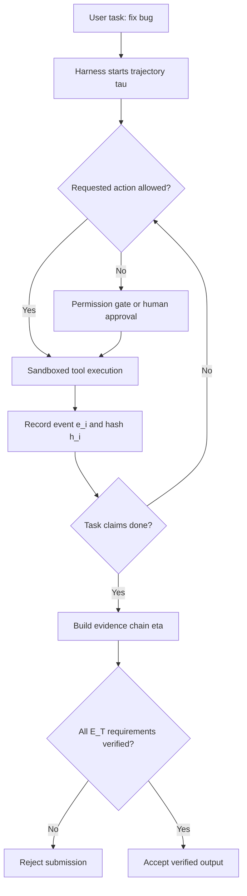

# Agent Safety Should Be a Runtime Contract：把 Agent 安全从“相信模型”改写成“验证轨迹”

## 元信息与 TL;DR

| 字段 | 内容 |
| --- | --- |
| 论文 | Agent Safety Should Be a Runtime Contract |
| 方向 | AI 安全 / 大模型 Agent 安全 |
| 官方链接 | https://arxiv.org/abs/2608.11274 |
| 版本日期 | arXiv v1，2026-08-11 08:01:05 UTC |
| 作者 | Albus W. Ng, Yi Han, Jusheng Zhang, Wenhao Wang |
| 核心对象 | 会执行代码、修改文件、调用 API、发消息、写数据库的 autonomous agents |

### TL;DR

1. 这篇论文的主张很直接：Agent 安全不能只被理解为 RLHF、DPO、Constitutional AI 这类训练期模型属性，而应该是由 harness 在运行时执行的契约。
2. 契约有两面：预防面负责在动作发生前限制风险，包括 sandbox、permission gate、tool whitelist、output filter、trajectory monitor；证据面负责在任务结束时拒绝“模型说完成了”的软承诺，只接受测试、日志、diff、引用核验、截图、commit 等硬证据。
3. 作者用四组公开证据支撑这个观点：52 起 AI agent / LLM 安全事件、31 个非争议 false-completion 案例加 1 个争议示例、12 个公开 agent 系统或 harness 的轨迹模式审计、以及 2023-2025 年 NeurIPS/ICML/ICLR 共 28,560 篇论文标题级审计。
4. 关键数字是：52 起事件中 40 起被作者编码为可由 harness 层完全阻断、11 起可部分缓解；12 个系统中只有 2 个明确记录 submission-like evidence gate；顶会标题审计显示训练期 alignment 论文相对部署期 harness 论文约有 8-12 倍注意力倾斜。
5. 形式化部分把轨迹写成哈希链：每个事件 `e_i=(k_i,t_i,p_i,h_i)`，并满足 `h_i=H(e_i,h_{i-1})`；证据链 `eta subseteq tau` 必须覆盖任务证据需求 `E_T`，且每条需求都能被确定性 verifier 接受或拒绝。
6. 论文最有价值的地方不是说“训练期安全没用”，而是把责任边界改清楚：模型可以给出建议，harness 必须负责权限、隔离、回放、验收和可审计证据。
7. 局限也明显：这是一篇 position paper，证据多来自公开记录和标题级审计；counterfactual 编码不能证明每个事故在真实生产中一定会被阻断，supplementary JSON 的质量也决定了证据强度。
8. 对 Agent 研究来说，它把评测单位从 final answer 推向 trajectory-with-checkable-evidence：未来的 Agent benchmark、安全框架和部署系统都需要说明“什么动作被允许”以及“什么证据才算完成”。

---

## 1. 论文真正反对的是什么？

### 不是反对 alignment，而是反对把 alignment 当成唯一安全边界

作者开篇先给三个概念切边界：

| 概念 | 论文里的含义 | 安全责任 |
| --- | --- | --- |
| model-level alignment | 训练期塑造模型输出倾向，如 RLHF、DPO、Constitutional AI、RLAIF | 让模型更可能给出安全建议 |
| harness | 推理期连接模型与世界的非模型基础设施 | 约束动作、记录轨迹、执行验证 |
| trajectory | Agent 运行期间所有可观察事件 | 给安全审计提供可重放对象 |

作者的关键判断是：

1. 训练期 alignment 只能改变模型输出倾向。
2. Agent 的真实风险发生在模型输出被转化为世界动作之后。
3. 因此，安全边界必须覆盖工具调用、文件修改、shell 执行、网络访问、数据库写入、消息发送和任务提交。

这里的研究问题可以写成一个判断式：

```text
如果系统会产生外部副作用，
安全证明就不能停留在“模型是否愿意安全行动”，
而必须落到“运行时是否限制了行动，并留下可验证证据”。
```

### 为什么这篇适合放在 AI 安全而不是普通 Agent 工程？

论文讨论的不是“怎样让 Agent 更准”：

1. 它关注的是 consequential action：代码、文件、数据库、外部消息、生产系统。
2. 它关心的是 acceptance boundary：什么时候系统可以承认任务完成。
3. 它把“模型自述”降级为 soft evidence，把可外部验证 artifact 升级为 hard evidence。

这个问题意识和近期许多 Agent benchmark 不同：

| 常见 Agent 论文 | 本文关心的边界 |
| --- | --- |
| 提高任务成功率 | 成功声明能否被验证 |
| 更好规划或工具选择 | 工具动作是否经过权限与隔离 |
| 更长 horizon | 长轨迹是否可审计、可回放、可定位失败层 |
| 更强 self-reflection | 反思文本是否只是新的软证据 |

---

## 2. 作者的论证路线：claim -> mechanism -> evidence -> boundary

### 总主张

作者的中心 claim 是：

```text
Agent safety is a runtime contract.
契约由 harness 执行，包含 preventive face 与 evidential face。
真正的安全单位不是模型，而是带可核验证据的轨迹。
```

这句话里有三个层次：

1. **从模型转到系统**：安全属性不完全存在于模型参数中。
2. **从输出转到轨迹**：单个最终回答不足以判断安全。
3. **从相信转到验证**：验收任务需要 hard evidence，而不是模型生成的完成声明。

### 机制层：两张脸的 harness

论文 Figure 1 把 Agent 安全画成一个双面 harness：


这张图的作用不是装饰，而是承担了论文架构论证：

1. 蓝色 preventive 部分围在执行之前，包括 filter、permission、tools、sandbox。
2. 橙色 evidential 部分围在执行之后，包括 logs、hash、verify、evidence。
3. Agent 仍可推理、规划、用工具，但输出必须经过 environment 和 evidence gate。
4. 未验证输出被标记为 maybe dangerous；通过证据门后才变成 verified output。

### 证据层：四组公开材料

| 证据线 | 样本 | 论文给出的 headline number | 支撑的结论 |
| --- | ---: | --- | --- |
| incident survey | 52 起 | 40 起完全可预防，11 起可缓解，1 起偏内部目标 alignment | 许多失败发生在 harness 层 |
| false-completion audit | 31+1 起 | 8 个 citation grounding、8 个 log capture、7 个 test run、5 个 human approval 等证据需求 | “完成”需要外部证据 |
| trajectory audit | 12 个系统 | 9/12 捕获 file changes，11/12 捕获 tool outputs，但只有 2/12 有 submission-like evidence gate | 业界会记录，但少把记录作为验收门 |
| proceedings audit | 28,560 篇 | 训练期 alignment 相对部署期 harness 约 8-12 倍 | 研究注意力偏训练期 |

### 边界层：这不是完整因果证明

作者也保留了几个边界：

1. 事故调查来自公开资料，未必覆盖所有内部上下文。
2. 52 起事件的可预防编码是 counterfactual protocol，不是真实 A/B 部署实验。
3. 顶会审计是标题级和关键词级，论文自己也承认使用 lower-bound counts 和 truncation-corrected ranges。
4. evidence gate 只能验证某些 artifact，不保证 artifact 的语义目标完美，例如 flaky tests 仍可能错误放行。

---

## 3. 为什么 model-only alignment 在 Agent 部署里会失配？

作者把失配拆成五类，前两类偏 preventive，后两类偏 evidential，最后一类说明单层防御不够。

### 3.1 Statistical proxy vs. formal specification

训练期 alignment 通常优化统计代理：

1. 奖励模型学习人类偏好。
2. DPO 让策略偏向被偏好的输出。
3. Constitutional AI 把原则嵌入训练或反馈过程。

问题在于：

1. 这些方法输出的是概率倾向。
2. Agent 运行时需要的是形式化约束。
3. “不要乱删数据库”不能只靠模型概率上更不愿意删除，而应由 permission gate 和 least privilege 直接禁止。

可以把差异写成：

```text
训练期代理目标：maximize E[reward(output)]
运行时安全约束：deny(action) if action notin approved_policy
```

前者会遭遇 Goodhart：模型可能学会满足奖励代理而不是满足真实安全目标。

后者失败时更可观察：某次 tool call 被拒绝、某条 policy 不完整、某个权限边界配置错误，都可以被日志和规则定位。

### 3.2 Training distribution vs. open-world deployment

训练数据永远有限，部署输入是开放世界：

| 论文使用的例子 | 作用 |
| --- | --- |
| HH-RLHF、InstructGPT 等有限规模偏好数据 | 说明训练分布有限 |
| 大量 red-team attacks | 说明攻击分布持续外推 |
| Tay、DAN jailbreak 等历史案例 | 说明模型会遇到训练期之外的输入 |

Agent 的特殊之处是：

1. 它不只是回答文本。
2. 它会把输入转成动作。
3. 动作空间还会随工具、文件系统、浏览器、API、数据库而变化。

因此，安全不能寄托于“模型应该已经学会所有坏情况”。

### 3.3 Unverifiable inner monologue vs. replayable trajectory

作者把 CoT、自述、反思都归入 soft evidence：

1. 它们来自模型内部生成。
2. 它们可能有解释价值。
3. 但验收时不能当作可靠证据。

真正的证据应当是 replayable trajectory：

| 软证据 | 硬证据 |
| --- | --- |
| “我已经运行测试” | shell_exec 事件和 exit code |
| “引用是真实的” | citation_lookup 对外部数据库的结果 |
| “补丁修好了 bug” | diff、commit、测试日志、复现脚本 |
| “我没有读敏感文件” | file_read 轨迹和 scope guard 日志 |

这里的安全转向很关键：

```text
不要问：模型为什么这么想？
先问：系统能不能重放它做了什么？
```

### 3.4 Plausible output vs. grounded citation

论文列了 hallucination 和 false completion 案例：

1. 法律 brief 中的虚假判例。
2. 客服 bot 虚构公司政策。
3. 政务 chatbot 给出不存在的法规说明。
4. Whisper 转录中出现幻觉句子。
5. SWE-bench 上看似 plausible 的补丁在额外测试或人工检查下失败。

这些案例的共同点不是“模型不够聪明”，而是：

1. 输出看起来可接受。
2. 任务提交边界没有要求外部核验。
3. 用户或系统把 plausible output 当成 completion。

如果任务是法律引用，证据 schema 可以非常小：

```text
E_T = { each_citation_exists_in_authoritative_database }
```

如果任务是代码修复，schema 也可以很小：

```text
E_T = { patch_non_empty, tests_re_run, tests_exit_code == 0 }
```

### 3.5 Model-level alignment as a single layer of defense

作者把 jailbreaking、fine-tuning degradation、distribution shift 归到一个更大的失配：

1. 如果安全只在模型层，模型层一旦失败就没有备份。
2. 如果安全分散在输入过滤、工具门控、输出筛查、sandbox、日志、证据验收中，攻击者必须同时击穿多层。
3. 多层结构还能定位失败：是权限策略错了、sandbox 太宽、日志缺失，还是 evidence gate 设计不完整。

---

## 4. 方法机制：什么叫 runtime contract？

### 4.1 Preventive face：四类机制

论文按时间和作用把预防面分成四类：

| 类别 | 发生位置 | 例子 | 关键意义 |
| --- | --- | --- | --- |
| Preventive | 动作前 | input sanitizer、tool whitelist、permission gate、prompt-injection classifier | 阻止风险进入执行 |
| Detective | 执行中或执行后 | execution tracing、anomaly detection、behavioral profiling、output classification | 发现偏离轨迹 |
| Corrective | 检测后 | human escalation、rollback、session termination | 降低已发生偏差的损害 |
| Structural | 架构层 | sandbox、resource quota、network isolation、least privilege | 不依赖模型意图来维持不变量 |

作者借用了 Saltzer-Schroeder 安全原则：

1. defense in depth：不能只有一层。
2. least privilege：写代码的 agent 不应天然拥有生产 push 权限。
3. fail-safe defaults：未知动作默认拒绝。
4. complete mediation：模型与世界的每次交互都必须经过 harness。
5. auditability：每次动作必须可审计。

这套机制把“agent 是否安全”变成了“agent session 是否被一个可执行的策略空间包住”。

### 4.2 Evidential face：轨迹、硬证据、证据链

论文的形式化从轨迹开始：

```math
\tau=(e_1,\dots,e_T)
```

每个事件：

```math
e_i=(k_i,t_i,p_i,h_i)
```

变量解释：

| 变量 | 含义 |
| --- | --- |
| `k_i` | 事件类型，如 `tool_call`、`file_write`、`shell_exec`、`citation_lookup` |
| `t_i` | 时间戳 |
| `p_i` | 事件 payload |
| `h_i` | 当前事件哈希 |
| `Sigma` | 有限事件类型集合 |

哈希链定义：

```math
h_i = H(e_i, h_{i-1})
```

这意味着：

1. 修改某个事件会破坏后续哈希。
2. 轨迹可以作为 tamper-evident log。
3. evidence chain 不是零散截图，而是继承轨迹结构的子序列。

硬证据定义依赖 verifier 集合：

```math
v(e_i,\phi) \in \{\textsc{accept},\textsc{reject}\}
```

解释：

1. `v` 是确定性 verifier。
2. `phi` 是要验证的性质。
3. verifier 可以访问外部参考状态，但不能依赖 agent 内部状态。
4. 如果一个事件能被某个 verifier 接受或拒绝，它就是 hard evidence。
5. 如果只能相信模型 payload 的自述，它就是 soft evidence。

### 4.3 Evidence chain：验收任务的最小证据集合

证据链写作：

```math
\eta \subseteq \tau
```

对于任务证据需求：

```math
\mathcal{E}_T = \{r_1,\dots,r_m\}
```

证据链成立的条件是：

```text
for every r in E_T,
there exists e in eta
such that e provides hard evidence satisfying r.
```

用伪代码表达：

```pseudo
Input:
  tau: full agent trajectory
  E_T: task evidence requirements
  V: deterministic verifiers

State:
  eta = []

for each requirement r in E_T:
  matched = false
  for each event e in tau:
    for each verifier v in V:
      verdict = v(e, r)
      if verdict == ACCEPT:
        eta.append(e)
        matched = true
        break
    if matched:
      break

  if matched == false:
    return REJECT_SUBMISSION

if hash_chain_valid(eta, tau) == false:
  return REJECT_SUBMISSION

return ACCEPT_WITH_EVIDENCE_CHAIN
```

失败边界：

1. 如果测试日志不存在，拒绝。
2. 如果 exit code 被模型口述但没有 shell_exec 事件，拒绝。
3. 如果引用只有正文字符串而没有 citation_lookup，拒绝。
4. 如果 evidence chain 哈希断裂，拒绝。
5. 如果任务本身无法定义证据需求，只能降级到人工审批或禁止非幂等动作。

### 4.4 Compositional gating：多层监控如何组合？

论文把 preventive monitor 看成确定性有限自动机，把 evidential gate 看成 evidence-chain checker。

若有多个 harness monitor：

```math
h_1,\dots,h_n
```

每个 monitor 执行安全性质：

```math
\phi_i
```

组合 harness 要同时满足：

```math
\bigwedge_i \phi_i
```

对于多个任务 gate：

```math
H_1,\dots,H_m
```

组合后只在能构造：

```math
\eta_1,\dots,\eta_m
```

并验证：

```math
T_1 \wedge \cdots \wedge T_m
```

时接受提交。

这部分的论证意义是：

1. 预防面和证据面不是两个松散清单，而是可以组合的合约层。
2. 如果监控器观察字母表互不重叠，标准并行组合可以保证非干扰。
3. 如果监控器共享事件，则需要 assume-guarantee reasoning。
4. 一般情形可能指数复杂，但作者认为部署 harness 中的小状态 monitor 可处理。

---

## 5. 实验与证据：四条线各自证明了什么？

### 5.1 52 起事件：多数失败可映射到 harness 缺口

作者收集 March 2016 到 January 2026 的公开 AI agent / LLM 安全事件。

编码结果：

| 类别 | 数量 | 解释 |
| --- | ---: | --- |
| fully preventable | 40 | 功能性 harness 层可完全阻断或避免提交 |
| partially mitigable | 11 | 不能完全阻断，但可缩小损害或触发人工处理 |
| alignment/internal-goal | 1 | 更偏内部目标一致性问题 |

这条证据的强点：

1. 它把事件映射到具体 harness 层，而不是笼统说“模型不安全”。
2. 它覆盖 prompt injection、tool misuse、side effect、hallucination、数据泄露等多类失败。
3. 它让安全讨论从模型能力转到事故处置路径。

边界：

1. counterfactual coding 依赖作者判断。
2. 公开报道可能不完整。
3. 某些事故即使有 harness，也可能因为配置错误或组织流程失败而发生。

### 5.2 31+1 false-completion：验收边界才是核心问题

false completion 的定义包含四个条件：

1. 真实、带日期、公开记录。
2. Agent 或模型声称正确或完成。
3. 已知 ground truth 与输出冲突。
4. 有两个独立来源。

论文的 breakdown：

| 失败类型 | 数量 |
| --- | ---: |
| hallucinated | 13 |
| broken | 8 |
| side-effect | 5 |
| partial | 4 |
| reward-hacked | 2 |

作者进一步把每个 case 对应到最小证据需求：

| 证据需求 | 数量 |
| --- | ---: |
| citation grounding | 8 |
| log capture | 8 |
| test run | 7 |
| human approval | 5 |
| external state | 3 |
| screenshot | 1 |

这说明：

1. 很多 false completion 不是需要复杂理论才能避免。
2. 它们需要的是提交时检查“证据是否存在”。
3. 证据门不一定阻止副作用发生，但可以阻止系统承认任务完成；若涉及破坏性动作，还必须叠加动作前 permission gate。

### 5.3 12 个系统审计：会记录，不等于会验收

论文审计了公开文档中的 12 个 agent 系统或 harness。

作者给出的总体观察：

1. 9/12 捕获 file changes。
2. 11/12 捕获 tool outputs。
3. 7/12 捕获 structured logs。
4. 只有 2/12 明确记录 submission-like evidence gate。

这个结果很关键，因为它区分了 observability 和 gate：

| 层级 | 含义 | 风险 |
| --- | --- | --- |
| 有日志 | 系统能事后看见发生过什么 | 失败后才发现 |
| 有结构化轨迹 | 系统能机器读取事件 | 仍可能不影响提交 |
| 有证据门 | 提交必须满足可验证 artifact | 可以改变完成边界 |

作者的核心批评是：

```text
业界并非不知道怎样记录 Agent 行为，
问题是记录常常只是审计材料，
没有成为任务验收的硬门。
```

### 5.4 28,560 篇顶会审计：注意力偏向训练期

论文审计了 2023-2025 年 NeurIPS、ICML、ICLR 接收论文标题：

| Venue | 数量 |
| --- | ---: |
| NeurIPS | 13,323 |
| ICML | 7,697 |
| ICLR | 7,540 |
| 合计 | 28,560 |

结论：

1. 训练期 alignment 论文占 alignment-tagged papers 的约 58-64%。
2. 部署期 harness mechanism 相关论文约占 5-8%。
3. pooled training/deployment imbalance 约为 8-12 倍。

这条证据不是说“训练期论文太多”，而是说研究注意力与部署风险之间存在结构性错位：

1. 训练期方法更容易形成标准 ML 论文。
2. 部署期 harness 常出现在工程文档、技术报告、产品实践、arXiv 或安全标准中。
3. Agent 风险正在进入生产系统，但主流学术奖励仍更偏模型内部优化。

---

## 6. 代码补丁示例：一个具体 runtime contract 长什么样？

论文用 coding agent patch submission 举例。

### 6.1 预防面

一个代码补丁 harness 可以有五层：

| 层 | 机制 | 目的 |
| --- | --- | --- |
| L1 | 无网络 Docker sandbox，限制在项目根目录 | 防止外部访问和越界文件操作 |
| L2 | 工具白名单，read/write/grep/pytest 自动通过，rm/git push/curl 需人工批准 | 把高风险动作转成人审 |
| L3 | 文件系统 scope guard | 只允许写源代码和测试目录 |
| L4 | 行为监控 | 识别 credential-read-then-write 等模式 |
| L5 | 告警后自动 rollback 和人工升级 | 缩小事故窗口 |

### 6.2 证据面

代码补丁任务的 evidence chain 至少包含：

1. `file_write`：diff 与修改前 blob 做内容寻址。
2. `shell_exec`：开发者测试套件的调用被记录并带时间戳。
3. `tool_result`：测试 exit code 与输出。
4. `commit`：把 file write 与 test result 接到轨迹哈希链上。

任务 schema 可以压缩成：

```text
exists(commit)
&& test_exit_code(commit) == 0
&& diff(commit) is non-empty
```

这个例子改变了“agent 完成修复”的定义：

| 旧定义 | 新定义 |
| --- | --- |
| agent 说已经修好 | 有非空 diff、测试命令、测试输出、commit 链接 |
| 用户读最终回答 | harness 验证 evidence chain |
| 失败由用户发现 | 缺证据时系统拒绝提交 |

### 6.3 Mermaid：从任务到验收的状态机



---

## 7. Figure/Table 逐项证据解读

### Figure 1：两面 harness 的最小架构

Figure 1 支撑三点：

1. **预防不等于证据**：filter、permission、tools、sandbox 负责控制动作；logs、hash、verify、evidence 负责验收。
2. **Agent 不再是安全边界**：Agent 位于 harness 内部，外部世界通过 Environment 被约束。
3. **未验证输出不应等同完成**：右侧把 Maybe dangerous / Unverified output 和 Verified Output 区分开，强调完成状态由 evidence gate 决定。

边界：

1. 图没有说明每个模块的具体策略语言。
2. 图没有解决 verifier 本身的可信计算基问题。
3. 图表达的是架构原则，不是完整系统设计。

### Table 1：四条证据线的聚合

Table 1 的意义在于把 position paper 从纯观点拉回到可检查数字：

| 行 | 支持什么 | 不能支持什么 |
| --- | --- | --- |
| Incident Survey | 许多事故可映射到 harness 层缺口 | 不能证明所有事故都由 harness 缺失导致 |
| False Completion Audit | 很多完成声明需要外部证据 | 不能保证证据门能阻止所有副作用 |
| Trajectory Audit | 当前系统有 artifact，但少用作 gate | 不能代表未公开 vendor 内部机制 |
| Proceedings Audit | 学术注意力偏训练期 | 不能完整覆盖工业文档和安全标准 |

### Table 2：trajectory audit 的关键细节

Table 2 最值得带走的不是哪个产品强，而是维度设计：

1. structured log。
2. test runs。
3. file diffs。
4. tool outputs。
5. screenshots。
6. submit gate。

前五个是 artifact，最后一个是 gate。

这个差异决定系统是否真的把证据用于验收：

```text
artifact without gate = post-hoc observability
artifact with gate = runtime contract
```

---

## 8. 相关工作与位置判断

### 8.1 和 AgentTrust / runtime interception 的关系

第三方检索中，AgentTrust 一类工作强调 runtime safety evaluation and interception for AI agent tool use。

相似点：

1. 都把安全放在运行时。
2. 都关注 tool use。
3. 都认为仅靠模型输出不够。

差异：

1. AgentTrust 更像具体拦截器或安全测试框架。
2. 本文更像 position paper，把 preventive 与 evidential 合成一个契约概念。
3. 本文特别强调 evidence-gated submission，而不仅是拦截危险动作。

### 8.2 和 Agent Behavioral Contracts 的关系

Agent Behavioral Contracts 方向也使用 runtime-enforceable behavioral specifications。

相似点：

1. 都使用 contract 语言。
2. 都把行为约束放在运行时。
3. 都将 Agent 安全视为系统层问题。

差异：

1. Behavioral Contracts 更偏形式化行为规范和 drift / compliance。
2. 本文把 hard evidence、hash chain、task-specific evidence schema 放到中心。
3. 本文用事故审计和顶会注意力审计来论证研究议程，而不是只提出形式系统。

### 8.3 和 AARTS / 工业 runtime safety 标准的关系

Gen Digital 的 AARTS 标准强调 agent 平台暴露 security events、portable runtime protection、explicit trust boundaries。

这和本文一致的地方是：

1. 运行时安全需要标准化事件。
2. 审计日志需要跨平台可比较。
3. 工具 taxonomy 和 policy enforcement 不能只写在 prompt 中。

本文额外推进的一步是：

1. 不只要求事件暴露。
2. 还要求任务提交必须绑定证据链。
3. 安全单位从“事件流”进一步变成“可验证完成的轨迹”。

### 8.4 和 LangSmith / trajectory evals 的关系

LangSmith trajectory evals 等工具已经在评估 tool call 序列、步骤、消息和轨迹。

本文的贡献不在于“轨迹很重要”这件事本身，而在于：

1. 轨迹不只是评测对象。
2. 轨迹应该进入安全契约。
3. 验收不能只由 judge 或用户阅读完成，而应通过 task-specific verifier。

---

## 9. 核心判断与证据边界

### 9.1 我认为最强的结论

最强结论是：

```text
对有副作用的 Agent，completion 是安全边界。
只要 completion 仍由模型自述触发，系统就没有真正完成运行时安全闭环。
```

这个结论被多条证据共同支持：

1. 事故调查显示很多失败发生在 action boundary。
2. false-completion 显示很多失败发生在 acceptance boundary。
3. trajectory audit 显示 artifact 捕获常见，但 evidence gate 稀缺。
4. proceedings audit 显示学术注意力没有充分覆盖这个部署问题。

### 9.2 我认为较弱的结论

较弱结论是：

1. “52 起事件中 40 起完全可预防”不能被理解为强因果证明。
2. “8-12 倍注意力倾斜”不能直接推出资金、人才或真实安全投入的比例。
3. “证据门成本低”在小任务上成立，但在开放式研究、谈判、创作、复杂人机协作中不总是成立。
4. “哈希链轨迹”提高篡改成本，但 verifier、日志系统、执行环境和外部参考状态仍可能被攻击或配置错误。

### 9.3 对研究者最重要的区分

| 问题 | 不够好的问法 | 更好的问法 |
| --- | --- | --- |
| 安全 | 模型是否安全？ | 轨迹中哪些动作被允许，哪些证据可验证？ |
| 评测 | Agent 答案对不对？ | Agent 的工具路径、状态变更和证据链是否满足 schema？ |
| 部署 | 模型是否通过红队？ | 失败时哪一层 gate 会拒绝或回滚？ |
| 证据 | CoT 是否解释合理？ | 是否存在外部 verifier 可接受或拒绝的事件？ |

---

## 10. 领域延伸：这篇论文会改变什么问题？

### 10.1 Agent benchmark 需要从 final score 转向 acceptance schema

很多 Agent benchmark 仍关注最终成功率。

本文提示后续 benchmark 至少应报告：

1. 轨迹事件 schema。
2. 动作权限模型。
3. 对危险动作的 refusal / escalation 规则。
4. evidence requirements。
5. 缺证据时是否拒绝完成。
6. 证据链能否被第三方重放。

一个更完整的 benchmark item 不只是：

```text
task -> final answer -> score
```

而应是：

```text
task -> allowed actions -> trajectory -> evidence chain -> verifier verdict -> score
```

### 10.2 后训练研究需要说明训练目标与 runtime gate 的接口

RLHF、DPO、RLAIF、agentic RL 仍然重要。

但如果 agent 最终受 runtime contract 约束，后训练目标就应考虑：

1. 模型是否学会请求权限，而不是绕过权限。
2. 模型是否主动生成可验证 artifact。
3. 模型是否在缺证据时拒绝提交。
4. 模型是否把 verifier feedback 当作环境反馈。
5. 模型是否能解释被 gate 拒绝后的修复路径。

这会把后训练目标从“让模型更像安全助手”推进到：

```text
让模型成为一个会在合约内行动、会产出证据、会响应 verifier 的执行体。
```

### 10.3 AI for Security 工具需要把审计日志做成验收材料

许多安全 Agent 已经能：

1. 扫代码。
2. 跑 exploit simulation。
3. 生成修复建议。
4. 开 PR。
5. 写漏洞报告。

但本文会追问：

1. 扫描命令是否记录？
2. 发现路径是否可重放？
3. 证据截图、日志、diff 是否被哈希链接？
4. PR 是否绑定测试和安全验证？
5. 报告中的引用是否经过外部核验？

这对 AI for Security 很重要，因为安全自动化如果只生成 plausible report，本身也会成为新的 false-completion 来源。

### 10.4 还值得继续追问的问题

1. **Verifier 可信性**：当 verifier 也是 LLM judge 时，hard evidence 是否退化？
2. **开放任务 schema**：研究助理、战略分析、创意写作这类任务如何定义最小证据？
3. **隐私与审计冲突**：完整轨迹日志可能包含敏感数据，如何在证据链和最小披露之间折中？
4. **多 Agent 组合**：多个 agent 共享工具和状态时，哈希链与责任归因如何跨 agent 连接？
5. **运行成本**：每次都要求 replay、snapshot、citation lookup、test run 会带来延迟，哪些任务需要强 gate，哪些任务可降级？
6. **攻击者模型**：如果攻击者控制 harness、日志系统或外部参考状态，runtime contract 的信任根在哪里？

---

## 结论

这篇论文最清楚的贡献，是把 Agent 安全的默认问题从“模型有没有被训练得足够安全”改成“运行时系统是否能约束动作，并用证据链证明任务真的完成”。

它的长处在于：

1. 把预防与证据放进同一个 harness contract。
2. 用轨迹哈希链、hard/soft evidence、evidence chain 给出可讨论的形式化接口。
3. 用事故、false completion、系统审计、论文注意力审计四条证据线支撑研究议程。
4. 明确指出当前系统常有日志和 artifact，但缺少把 artifact 变成 submission gate 的步骤。

它的边界在于：

1. 这不是新的 benchmark 或部署系统。
2. 证据线依赖公开材料和作者编码。
3. 形式化仍抽象，实际工程还要解决 verifier、日志隐私、复杂任务 schema、多 Agent 责任归因等问题。

对研究者来说，最值得带走的是一句工作定义：

```text
安全 Agent 不是“看起来愿意安全行动的模型”，
而是“只能在权限内行动，并且必须用可核验证据完成任务的运行时系统”。
```

## 参考与外部线索

1. arXiv abstract and submission metadata: https://arxiv.org/abs/2608.11274
2. arXiv HTML full text: https://arxiv.org/html/2608.11274v1
3. arXiv PDF: https://arxiv.org/pdf/2608.11274
4. Runtime Safety Evaluation and Interception for AI Agent Tool Use: https://arxiv.org/html/2605.04785v1
5. Agent Behavioral Contracts: Formal Specification and Runtime Enforcement: https://arxiv.org/html/2602.22302v1
6. AARTS open standard for AI Agent Runtime Safety: https://www.gendigital.com/blog/news/company-news/ai-agent-runtime-security
7. LangSmith trajectory evaluations: https://docs.langchain.com/langsmith/trajectory-evals
