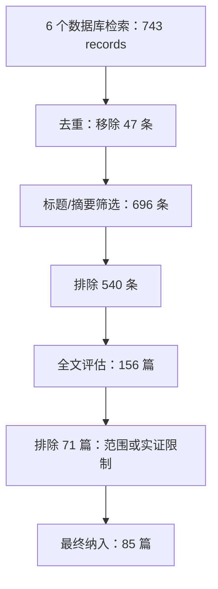
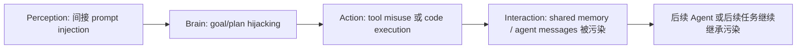
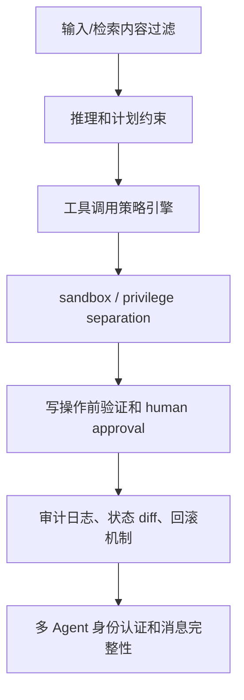

# Agentic LLM 漏洞综述：为什么 Agent 安全研究仍停在输入层，而风险已经进入执行层

| 项目 | 内容 |
| --- | --- |
| 论文 | On Understanding, Identifying, and Mitigating Vulnerabilities in Agentic Large Language Models |
| 作者 | Md Jafrin Hossain, Mohammad Arif Hossain, Nirwan Ansari |
| 机构 | Florida International University, Middle Tennessee State University, New Jersey Institute of Technology |
| 官方链接 | <https://arxiv.org/abs/2608.10530> |
| PDF | <https://arxiv.org/pdf/2608.10530> |
| arXiv 版本 | `arXiv:2608.10530v1` |
| 提交时间 | 2026-08-11 06:11:26 UTC |
| 主题 | `cs.CR`, `cs.AI` |
| 论文状态 | 作者预印本，标注 under review at ACM Computing Surveys |

### TL;DR

1. 这是一篇面向 Agentic LLM 安全的 PRISMA 2020 系统综述，作者从 IEEE Xplore、ACM Digital Library、arXiv、Scopus、Web of Science、Google Scholar 六个数据库检索，743 条记录去重和筛选后保留 85 篇 2023-2025 年论文。
2. 论文的核心发现是研究重心和真实部署风险错位：攻击论文 47 篇、防御论文 12 篇，攻防比例 3.9:1；感知层研究 56 篇，占 65.9%，行动层研究只有 4 篇，占 4.7%，形成约 14 倍差距。
3. 作者提出四层 Agent 架构 taxonomy：perception、brain、action、interaction，并把 13 类漏洞映射到这些层；这比“prompt injection/jailbreak”式名称列表更接近工程责任边界。
4. 论文最强的判断是：Agentic LLM 的安全问题来自 architectural coupling。输入、推理、工具执行、记忆和多 Agent 通信之间隔离不足，使一个层面的攻击能跨层传播成不可逆外部动作。
5. 统计上，prompt injection、adversarial input、jailbreaking 最常被研究；但 code execution 只有 3 篇，sandbox escape 只有 2 篇，tool-augmented agent 仅占 11.8%，这与生产中 API、文件、代码执行和数据库修改的风险不匹配。
6. 检测方法主要停留在输入过滤、prompt validation、LLM-as-judge 和有限 runtime monitoring；对于 tool misuse、code injection、sandbox escape、message injection、agent impersonation，多数 coverage 只是 limited 或 none。
7. 防御策略被整理为六类：输入/输出过滤、架构防御、运行时控制、训练期缓解、治理与审计、多 Agent 防御；各有 trade-off，尤其 runtime controls 和 governance 更接近高风险 Agent 的 containment，但开销和复杂度更高。
8. 局限也很明确：综述只覆盖英语和数据库可索引论文，Q4 2024 以后索引可能不完整；多数编码由主审完成，仅 17% 样本二次编码；且论文给的是研究分布和 taxonomy，不是新防御系统的实证 benchmark。

### 这篇综述真正关心什么？

作者关心的不是“LLM 会不会被 jailbreak”这个老问题，而是：

1. 当 LLM 变成 Agent 后，它不再只是输出文本。
2. 它会调用 API、执行代码、读写文件、访问数据库、维护长期记忆、与其他 Agent 通信。
3. 任何一个被污染的推理步骤，都可能变成外部状态修改、数据泄露或跨 Agent 级联故障。
4. 现有安全研究仍大量集中在 prompt injection、jailbreak、输入扰动这些较容易用 API 测的层面。

因此，论文提出一个很具体的研究问题：

| 旧问题 | Agent 场景里的新问题 |
| --- | --- |
| 模型是否输出有害内容？ | Agent 是否执行了有害动作？ |
| 输入是否包含恶意 prompt？ | 恶意输入是否穿过推理、工具和记忆边界？ |
| 单轮攻击是否成功？ | 多轮任务中攻击是否级联到后续计划和工具调用？ |
| 防御是否降低 ASR？ | 防御是否约束权限、执行、审计和跨 Agent 通信？ |

这篇论文的贡献不是提出一个新攻击，而是把已有 85 篇研究放到同一个架构坐标系里，指出哪里被研究过、哪里只是看起来热闹、哪里是高风险但低覆盖。

### 综述方法：PRISMA 流程怎样支撑结论？

作者按 PRISMA 2020 做系统综述。筛选流程可以概括为：



检索覆盖六个数据库：

| 数据库 | 作用 |
| --- | --- |
| IEEE Xplore | 工程与安全会议/期刊 |
| ACM Digital Library | 计算机系统、安全与 HCI 论文 |
| arXiv | 最新预印本 |
| Scopus | 跨学科索引 |
| Web of Science | 期刊与会议索引 |
| Google Scholar | 补全灰色覆盖和 snowball sampling |

编码字段包括：

1. 论文标识：标题、作者、年份、venue。
2. Agent 类型：single-agent、multi-agent、tool-augmented、RAG、web、code execution、embodied。
3. 主要漏洞类型和架构层。
4. 威胁模型：black-box、grey-box、white-box。
5. 贡献类型：attack、defense、framework、benchmark。
6. 实验设置、关键发现和作者报告的局限。

作者还做了编码可靠性检查：

| 项 | 数字 | 含义 |
| --- | ---: | --- |
| 二次编码样本 | 15 篇，占 17% | stratified sample |
| 漏洞分类一致率 | 94% | 两位编码者对 vulnerability category 的一致性 |
| 论文类别一致率 | 98% | attack/defense/framework 分类一致性 |
| Cohen's κ, vulnerability | 0.88 | near-perfect agreement |
| Cohen's κ, paper category | 0.93 | near-perfect agreement |

这使得 taxonomy 不是单纯作者直觉，但仍有边界：大部分论文还是由主审编码，且快速变化领域里数据库索引会滞后。

### 四层架构：为什么按组件分层比按攻击名字更有用？

论文把 Agentic LLM 系统拆成四层：

| 层 | 功能 | 典型组件 | 主要风险 |
| --- | --- | --- | --- |
| Perception | 接收和解释输入 | 用户输入、RAG 检索、网页、工具返回、传感器 | prompt injection、jailbreak、adversarial input |
| Brain | 推理、规划、目标维护 | LLM、planner、memory、CoT、状态管理 | backdoor、reasoning manipulation、goal/plan hijacking |
| Action | 执行决策 | tool invocation、API、代码执行、自动化脚本 | tool manipulation、function hijacking、code injection、sandbox escape |
| Interaction | 与外部系统和其他 Agent 通信 | 多 Agent 消息、共享记忆、环境接口、agent registry | message injection、agent impersonation、knowledge base corruption |

这个分层的价值是工程化：

1. Perception 的责任是输入处理和上下文边界。
2. Brain 的责任是计划、推理和目标完整性。
3. Action 的责任是权限、工具、代码和副作用约束。
4. Interaction 的责任是消息认证、记忆完整性和跨 Agent 信任。

论文还把常见 Agent 框架映射到这四层：

| 框架组件 | 对应层 |
| --- | --- |
| BDI: Beliefs | Perception / Memory |
| BDI: Desires / Intentions | Brain |
| ReAct: Observation | Perception |
| ReAct: Reasoning / Thought | Brain |
| ReAct: Action | Action |
| AutoGPT: Tool Invocation | Action |
| Multi-Agent Communication | Interaction |

这说明作者不是把 taxonomy 做成抽象分类，而是试图对齐真实 Agent framework 的边界。

### 13 类漏洞：从输入污染到跨 Agent 冒充

论文通过 open coding，把初始 23 个候选类别合并为 13 类漏洞。

| 架构层 | 漏洞类型 | 机制解释 | 典型后果 |
| --- | --- | --- | --- |
| Perception | Direct Prompt Injection | 攻击者直接控制输入 prompt 的一部分 | 覆盖系统约束、改写任务目标 |
| Perception | Indirect Prompt Injection | 恶意指令藏在网页、邮件、数据库或检索内容中 | Agent 读取后被间接控制 |
| Perception | Jailbreaking | 用构造 prompt 绕过 safety barrier | 输出或执行被禁止内容 |
| Perception | Adversarial Perturbations | 对文本、图像、音频等输入做扰动 | 误分类或错误状态理解 |
| Brain | Backdoor Attacks | 训练或供应链中植入触发器 | 特定条件下执行恶意计划 |
| Brain | Reasoning Manipulation | 在推理链中注入细小但累积的错误 | 得出错误计划或结论 |
| Brain | Goal/Plan Hijacking | 改写目标或计划方向 | Agent 为攻击者目标服务 |
| Brain | Memory Poisoning | 长期记忆被注入虚假上下文 | 后续任务持续受污染 |
| Action | Tool Manipulation | 诱导调用错误工具或滥用合法工具 | 未授权 API 调用、资源滥用 |
| Action | Function Hijacking | 重定向函数/API 调用 | 调用目标或参数被攻击者控制 |
| Action | Code Injection | 生成并执行恶意代码 | 任意命令执行、数据泄露 |
| Action | Sandbox Escape | 绕过代码执行隔离 | 访问宿主资源或网络 |
| Interaction | Message/Impersonation/KB Corruption | 篡改 Agent 消息、冒充 Agent、污染知识库 | 多 Agent 级联污染和信任传播 |

这里最重要的机制是跨层传播：



这就是论文所谓 architectural coupling 的安全含义：如果层与层之间没有强隔离、权限边界和审计，输入层漏洞会在执行层变成真实副作用。

### 逐层细读：每一层的漏洞为什么不能互相替代？

如果只看漏洞名称，很容易把这篇综述读成“又一张攻击清单”。但作者按架构层组织 taxonomy，其实是在强调不同层需要不同证据和不同控制点。

1. Perception layer 的核心问题是“外部内容如何变成内部上下文”。
   - 直接 prompt injection 是用户输入污染。
   - 间接 prompt injection 是网页、邮件、检索文档、数据库记录等被 Agent 后续读取。
   - 这两类攻击的共同点是进入点在输入处理前后，防御通常会先想到过滤、消毒和上下文隔离。
   - 但它们的边界也很明显：即使过滤器拦住明显恶意字符串，也不能证明后续计划和工具调用安全。
2. Brain layer 的核心问题是“Agent 为什么决定这样做”。
   - backdoor、reasoning manipulation、goal hijacking 不是简单输入脏数据，而是改变目标、推理链或决策倾向。
   - 这类风险更难测，因为攻击效果可能分散在多步计划里，每一步看起来都合理，组合起来才偏离原始任务。
   - 因此，单轮 ASR 很难覆盖 brain layer；更需要 trajectory-level evidence、plan diff、目标一致性检查和长期记忆审计。
3. Action layer 的核心问题是“语言计划如何变成外部副作用”。
   - tool manipulation 可能只是一个错误工具调用，但如果工具有写权限，就会变成数据修改。
   - code injection 和 sandbox escape 更危险，因为它们绕过的是执行边界，后果可能是文件读取、网络访问或任意命令执行。
   - 这也是论文反复强调 action layer 低覆盖的原因：它不只是另一个攻击类别，而是 Agent 从文本系统变成控制系统的分界。
4. Interaction layer 的核心问题是“信任如何在系统之间传播”。
   - 多 Agent 消息如果没有认证，攻击者可以把恶意任务伪装成同事 Agent 的指令。
   - 共享记忆如果没有 provenance，错误内容会跨会话留存。
   - RAG 知识库如果被污染，攻击不一定立即生效，而可能在未来某个任务被检索出来。

这四层之间不是并列菜单，而是一条执行链：

| 执行链位置 | 攻击者想要什么 | 防御必须证明什么 |
| --- | --- | --- |
| 输入进入系统 | 让恶意内容进入上下文 | 来源、边界、语义角色被正确标注 |
| 推理生成计划 | 让计划偏向攻击目标 | 目标、约束、权限和用户意图一致 |
| 工具执行动作 | 让动作产生外部副作用 | 工具权限、参数、写操作和状态变化可验证 |
| 状态继续传播 | 让污染进入记忆或其他 Agent | 消息身份、记忆 provenance、回滚与审计可用 |

因此，论文的 taxonomy 不是为了分类好看，而是为了提醒研究者：每个漏洞类型都应该绑定到一个可执行的 containment boundary。没有 boundary 的分类，只能告诉你“哪里可能坏”，不能告诉你“在哪里拦住”。

### 定量证据：研究热度和风险重心错位在哪里？

论文的 Table 11 给出最核心的总体统计：

| 指标 | 数字 | 解释 |
| --- | ---: | --- |
| 总论文数 | 85 | 覆盖 2023-2025 |
| Attack-focused papers | 47, 55.3% | 主要研究漏洞发现 |
| Defense-focused papers | 12, 14.1% | 主要研究防御或缓解 |
| Survey/framework papers | 26, 30.6% | 分类、框架、综述 |
| 2025 年论文 | 62, 72.9% | 领域快速扩张 |
| Multi-agent focus | 39, 45.9% | 最常见架构焦点 |
| Tool-augmented focus | 10, 11.8% | 与实际部署相比偏少 |
| Code-execution focus | 3, 3.5% | 高风险但研究严重不足 |
| Perception-layer research | 56, 65.9% | 主导层 |
| Action-layer research | 4, 4.7% | 与 perception 约 14 倍差距 |
| Prompt injection papers | 36, 42.4% | 最常见漏洞类型 |
| Adversarial attack papers | 30, 35.3% | 第二常见 |
| Jailbreaking papers | 16, 18.8% | 第三常见 |

这张表的解释不能停在“prompt injection 很重要”。更准确的读法是：

1. Perception-layer 攻击容易做。
   - 许多攻击只需要 API 访问。
   - 不需要完整 Agent sandbox、工具、数据库和外部状态。
2. Action-layer 攻击难做但后果更重。
   - 需要真实或模拟执行环境。
   - 需要评估外部副作用、权限和隔离。
3. 因此研究数量不是风险大小。
   - prompt injection 研究多，不等于它是唯一重要风险。
   - code injection、sandbox escape 研究少，也不等于低风险。

论文对 component-level occurrence 也有更细数字：

| Component | Attack vector | Severity | Count |
| --- | --- | --- | ---: |
| Input Processing | Direct Prompt Injection | High | 12 |
| Input Processing | Indirect Prompt Injection | High | 15 |
| Input Handling | Jailbreaking | High | 26 |
| Multimodal Input | Adversarial Perturbation | Medium | 42 |
| Planning Module | Goal Hijacking | High | 24 |
| Reasoning Engine | CoT Manipulation | Medium | 21 |
| Memory System | Memory Poisoning | High | 41 |
| Knowledge Base | RAG Poisoning | High | 23 |
| Tool Interface | Tool Manipulation | High | 54 |
| API Gateway | Function Hijacking | High | 7 |
| Code Executor | Code Injection | Critical | 13 |
| Sandbox | Sandbox Escape | Critical | 8 |
| Agent-Agent | Message Injection | High | 12 |
| Agent Registry | Impersonation | Medium | 5 |

注意这里的 count 不是 unique papers，而是 component-level occurrence；同一篇论文可能贡献多个组件计数。作者特意提醒，不能把这些数字理解为独立论文数。

### 为什么研究覆盖会失真？

论文没有把研究失衡解释成研究者“不重视执行层”。它给出的隐含解释更实际：高风险层往往更难实验化。

| 层 | 为什么容易研究 | 为什么难以证明真实安全 |
| --- | --- | --- |
| Perception | API 调用即可构造 prompt、网页或检索文本攻击 | 单轮成功不等于多轮任务中会造成外部后果 |
| Brain | 可以分析 reasoning trace、目标偏移或 plan hijack | 推理链常不可见，且 trace 本身可能不忠实 |
| Action | 能直接对应真实副作用和权限边界 | 需要 sandbox、工具模拟器、状态 diff、审计日志 |
| Interaction | 能覆盖多 Agent 和长期记忆污染 | 需要长期运行环境、身份模型和跨会话 provenance |

这解释了为什么 perception layer 论文最多：

1. 攻击样本容易构造。
   - 一段恶意 prompt 就能形成 proof-of-concept。
   - 常见 LLM API 足以复现许多结果。
2. 指标容易计算。
   - ASR、拒答率、分类准确率、F1 都可直接报告。
   - 不需要复杂外部环境。
3. 防御容易比较。
   - 输入过滤器和 guard model 可以在同一数据集上跑。
   - 但这种可比性不代表部署完整性。

相反，action layer 需要更重的证据：

1. 工具 schema 要真实或至少足够接近真实。
2. Agent 的动作要进入可观测环境。
3. 评测必须检查 final state，而不是只看 transcript。
4. 防御要证明权限边界没有被越过。
5. 出错后还要能审计、回滚或阻断后续传播。

所以这篇综述的一个隐含方法论是：<u>研究便利性正在塑造安全版图，而安全版图不应该等同于风险版图</u>。

### 威胁模型：为什么 black-box 也足够危险？

论文使用传统安全威胁模型：

| 威胁模型 | 攻击者能力 | Agent 场景中的意义 |
| --- | --- | --- |
| Black-box | 只能通过 API/UI 观察输入输出 | 最接近商业 Agent 用户或外部内容投毒者 |
| Grey-box | 知道部分架构、日志、文档或工具信息 | 适合供应链、协作开发、内部低权限攻击 |
| White-box | 访问权重、训练信息和操作参数 | 适合开源模型、内部威胁、模型泄漏 |

论文指出一个重要事实：

1. prompt injection 和 tool abuse 这类高影响攻击可以在 black-box 下发生。
2. backdoor 或 targeted reasoning corruption 往往需要 grey-box 或 white-box。
3. 但 Agent 的执行层使 black-box 攻击不再只是“让模型说错话”。
4. 如果 Agent 会读网页、收邮件、运行代码或调用支付 API，外部输入本身就可能成为执行链入口。

这也是为什么“只靠模型对齐”不足以覆盖 Agent 风险。模型可以被黑盒输入引导，而外部执行权限在系统层。

### 从“漏洞检测”到“执行证明”：指标也要换

论文多次指出当前检测研究缺统一 benchmark 和标准协议。更深一层的问题是：Agent 安全指标还停留在文本模型时代。

| 指标 | 适合测什么 | 在 Agent 场景里的缺口 |
| --- | --- | --- |
| Attack Success Rate | 攻击是否诱导了目标输出或行为 | 不一定反映外部状态是否改变 |
| Precision / Recall | 检测器是否识别恶意输入 | 对多轮、跨工具、延迟触发攻击不足 |
| False Positive Rate | 防御是否误杀正常请求 | 不能说明高风险动作是否被正确审批 |
| Latency Overhead | 防御是否拖慢系统 | 不能衡量安全边界强度 |
| State Diff | 外部资源是否被改写 | 更适合 action-layer，但当前研究较少使用 |
| Audit Completeness | 是否能复原责任链 | 对多 Agent 和长期记忆尤其关键 |

如果把论文的主张形式化，可以写成一个很简单的风险链：

```text
Risk(agent) =
  P(malicious input reaches context)
  × P(reasoning/plan is corrupted)
  × P(action boundary allows side effect)
  × Impact(external state change)
  × Persistence(memory or multi-agent propagation)
```

这个式子不是论文原公式，而是对其论证的概括。它说明为什么只降低第一个概率不够：如果 action boundary 太宽、Impact 太高、Persistence 太强，输入层的小概率失败仍可能造成系统级风险。

### 检测现状：大多数方法仍是输入层过滤

论文把 detection 分成五类：

1. input-level detection。
2. runtime detection。
3. multi-agent detection。
4. formal verification。
5. benchmark-based evaluation。

但实际覆盖并不均衡：

| 漏洞类型 | 检测方法 | 覆盖程度 |
| --- | --- | --- |
| Prompt Injection | input filtering, prompt validation | Well-studied |
| Adversarial Input | input sanitization, robustness checks | Well-studied |
| Jailbreaking | output filtering, policy checks | Well-studied |
| Indirect Prompt Injection | context validation | Moderate |
| Goal Hijacking | behavior monitoring | Limited |
| Memory Poisoning | retrieval validation | Limited |
| RAG Poisoning | knowledge filtering | Moderate |
| Tool Manipulation | tool-use monitoring | Limited |
| Code Injection | execution monitoring | Limited |
| Sandbox Escape | none identified | None |
| Message Injection | communication validation | Limited |
| Agent Impersonation | context-based identity checks | Limited |
| Environment Manipulation | input validation | Limited |

这张表说明一个结构性问题：

1. 输入层检测成熟，是因为已有 prompt/jailbreak 数据集和单轮评测。
2. runtime detection 更接近 Agent 真实风险，但验证成本高。
3. LLM-as-judge 检测有循环性：用 LLM 判断 LLM 是否被攻击，也需要抗对抗验证。
4. execution-level anomaly detection 和 privilege boundary enforcement 仍明显不足。

如果把这个结论转成工程语言，就是：

| 防线 | 当前成熟度 | 主要缺口 |
| --- | --- | --- |
| prompt 过滤 | 较高 | 对多轮、混淆、间接注入脆弱 |
| 输出过滤 | 中等 | 不能保证语义安全或代码副作用安全 |
| 工具调用监控 | 初级 | 缺少权限边界和状态差分验证 |
| 代码执行监控 | 初级 | sandbox escape 几乎没有专门检测 |
| 多 Agent 通信审计 | 初级 | 身份、消息完整性和信任传播缺少标准 |

### 防御策略：六类方案各自解决什么、牺牲什么？

论文把 defense/mitigation 分为六类：

| 策略 | 主要目标 | 优点 | 代价 |
| --- | --- | --- | --- |
| Input/Output Filtering | perception layer | 易部署、开销低 | 对 adaptive/multi-turn 攻击弱 |
| Architectural Defenses | brain/action 边界 | 结构性保障更强 | 复杂度高，可能引入新攻击面 |
| Runtime Controls | action layer | 强 containment，适合工具和代码执行 | 监控与策略检查带来延迟 |
| Training-Time Mitigation | brain layer | 对已知攻击模式有效，运行时成本低 | 对新攻击泛化有限，可能损害性能 |
| Governance / Human-in-the-loop | high-risk action | 高保障，可审计 | 人工成本高、扩展性差 |
| Multi-Agent Defense | interaction layer | 可监控协作和消息传播 | 通信开销和 correlated failure 风险 |

这篇综述对 Agent 防御的倾向很明确：越接近真实高风险部署，越不能只靠输入过滤。

更合理的安全栈应当是：



这与论文结论一致：Agent 安全的核心是 containment，而不是单点检测。

### 七个开放问题：作者认为最该补哪里？

作者最后列出七个 critical open problems。

| 问题 | 当前证据 | 为什么紧急 |
| --- | --- | --- |
| Code-execution agents security | 只有 3 篇 | 代码执行可导致任意命令、文件和网络访问 |
| Embodied agents security | 0 篇 | 感知和行动直接连接物理世界 |
| Single-agent systems security | 严格定义下 0 篇主焦点 | 最小 Agent 的 failure mode 仍缺少清晰分析 |
| Detection maturity | 10 个 detection methods vs 52 attacks | 攻击远多于检测，且缺标准协议 |
| Tool-augmented agents coverage | 约 12% | 生产部署高频使用工具，但研究覆盖不足 |
| Real-world deployment | 多数仍在实验室 | 真实攻击异步、低信息、外部数据不可控 |
| Standardized evaluation | 缺统一协议 | 8 个 benchmark 仍无法形成可比安全基线 |

这些问题共同指向一个方向：

1. 需要可执行环境。
2. 需要权限模型。
3. 需要标准化 benchmark。
4. 需要长期、多轮、跨工具和跨 Agent 的评测。
5. 需要把“是否被攻击成功”扩展成“攻击是否造成外部状态改变”。

### 论文边界：这篇综述不能证明什么？

这篇论文的价值在于结构化综述，但不能过度读取。

1. 它不是新攻击 benchmark。
   - 没有提出新的 exploit dataset。
   - 没有跑统一实验比较所有防御。
2. 它不是防御系统论文。
   - 防御策略是从已有文献归纳。
   - 没有证明某个 stack 在生产中有效。
3. 它的 literature window 有边界。
   - 纳入研究覆盖 2023-2025。
   - 2025 年后期论文可能未完全索引。
   - 2026 年新工作不在 corpus 中。
4. 它依赖英文和数据库检索。
   - 非英文、工业内部报告、未公开 incident 可能缺失。
5. 它的 severity 是 qualitative。
   - 使用类似 CVSS 的 worst-case 判断。
   - 不是按同一实验环境量化风险概率。

因此，本文最适合用来回答“研究版图哪里失衡”和“架构上该如何分层”，不适合直接当作某个安全控制的效果证明。

### 研究者视角：这篇论文怎样改变 Agent 安全问题定义？

这篇综述把 Agent 安全从单一 prompt 问题推进到系统安全问题。

| 过去常问 | 现在更该问 |
| --- | --- |
| 模型是否会被 jailbreak？ | 攻击是否能穿过输入、推理、执行和记忆边界？ |
| guardrail 是否拦住恶意 prompt？ | 工具调用前是否有权限策略和状态验证？ |
| 输出是否安全？ | 外部状态是否被改写，是否可审计和回滚？ |
| 多 Agent 是否提升能力？ | 多 Agent 消息是否认证，信任是否会传播污染？ |
| RAG 是否检索正确？ | 知识库和长期记忆是否有 provenance 和污染检测？ |

后续研究最值得推进的不是再堆一个 prompt injection dataset，而是：

1. 建立 action-layer benchmark。
   - 包含真实或模拟 API、文件、数据库和代码执行。
   - 用 final-state diff 判断攻击后果。
2. 建立工具权限模型。
   - 每个工具有能力边界、参数约束、调用预算和审批条件。
   - 把策略引擎放在 model output 与 tool execution 之间。
3. 建立 memory provenance。
   - 长期记忆需要来源、时间、权限和可撤销机制。
   - 不能把所有历史内容当成同等可信上下文。
4. 建立 multi-agent identity。
   - Agent 消息需要身份、签名、角色约束和审计链。
   - 不能只靠 natural language role description。
5. 建立 living review。
   - Agent 安全更新太快，一次性综述会迅速过期。
   - 标准 taxonomy 应持续更新，而不是只作为静态论文表格。

### 结论

`On Understanding, Identifying, and Mitigating Vulnerabilities in Agentic Large Language Models` 的核心贡献，是用 PRISMA 系统综述把 Agent 安全研究的结构性失衡摆出来。

最值得保留的判断有三条：

1. Agentic LLM 的风险不是传统 LLM 风险的简单放大，而是由工具、记忆、执行和通信耦合产生的新攻击面。
2. 当前研究过度集中在 perception layer，尤其是 prompt injection、jailbreaking 和输入扰动；而 action layer、code execution、sandbox escape、tool misuse 这些更贴近真实副作用的方向明显不足。
3. 安全防御必须走向 containment：权限分离、运行时控制、工具策略、审计日志、human approval、多 Agent 身份认证和 memory provenance，需要和模型层防御共同工作。

因此，这篇论文的价值不是给出最终答案，而是重新校准研究优先级：<u>如果 Agent 已经能改变外部世界，安全研究就不能只盯着它读进了什么，还必须证明它能被约束在什么边界内行动</u>。
