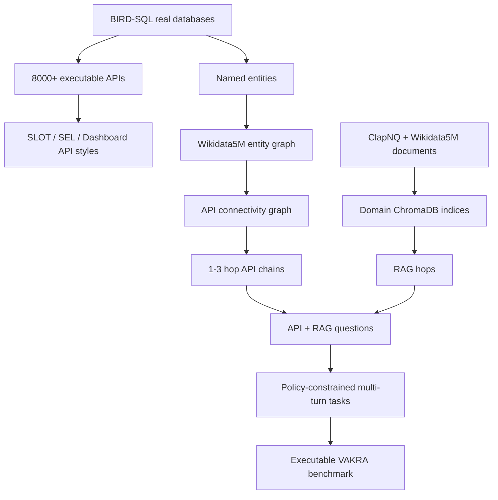

# VAKRA：把企业 Agent 评测从“会不会调工具”推到“能不能跨 API、检索与策略完成多跳推理”

### 元信息与 TL;DR

- **论文**：VAKRA: Evaluating Multi-Hop Reasoning Across APIs and Retrieval Under Tool-Use Policies
- **链接**：[arXiv:2608.12282v1](https://arxiv.org/abs/2608.12282v1)
- **代码**：[IBM/VAKRA](https://github.com/IBM/VAKRA)
- **数据集**：[ibm-research/VAKRA](https://huggingface.co/datasets/ibm-research/VAKRA)
- **方向**：大模型 Agent；工具调用评测；企业 API；RAG；策略约束
- **官方时间证据**：arXiv API 标记 `published=2026-08-12T17:27:27Z`，落在本周 UTC 窗口内。

**TL;DR**

- VAKRA 要回答的问题不是“模型是否能生成一个函数调用”，而是：企业 Agent 在真实数据库、文档检索、接口差异和自然语言工具策略同时存在时，能否把多步工作流完整执行到正确答案。
- 它把 BIRD-SQL 真实数据库改造成 **62 个领域、8000+ 个可执行 API**，再加入领域对齐的文档集合，构成 API、RAG、API+RAG、多轮策略约束四类能力。
- 任务按难度递进：SLOT/SEL/Dashboard 三种 API 风格；2-5 跳结构化 API 推理；跨 API 与文档的多源推理；再叠加“哪些工具可用、哪些来源禁止”的自然语言 policy。
- 评测不只看最终答案，而是用 waterfall：先重放模型预测的工具轨迹，再判断最终回答 groundedness/correctness，最后对 policy-constrained 任务做确定性策略检查。
- 实验固定 ReAct harness，避免把 planner、memory 或特殊 agent 架构混进模型能力比较；模型只知道可用工具和策略，不知道任务需要几跳或是否需要检索。
- 关键数字很尖锐：最强模型 GPT-5.5 在 Dashboard 单跳端点式任务上是 **70.4%**，但在 SEL/SLOT 组合式 BI API 上只有 **51.0%/50.0%**；多跳深度增加时，多数模型准确率下降超过 **50%**。
- 策略约束是最薄弱环节：当 policy 让问题变成不可回答时，某些前沿模型会继续硬答，论文报告最低可到 **2.4%**。
- 主要局限也清楚：数据生成大量依赖 LLM 与规则管线；人类质量评审样本只有每类 60 个；固定 ReAct harness 有利于隔离模型能力，却不能代表工程化 Agent 的最佳上限。

### 研究问题：为什么“工具调用 benchmark”还不够？

论文的出发点可以压缩成一个判断：

- 企业工作流里的 Agent 失败，常常不是因为它不会写 `tool_name(args)`。
- 更常见的失败发生在工具调用之前、之间、之后：
  - 找错实体；
  - 把文档里的名字映射不到 API 参数；
  - 在多个接口风格之间选错抽象层；
  - 忽略自然语言里的工具使用限制；
  - 得到正确中间结果后，仍然在最终回答里 hallucinate。

作者用一个延迟订单投诉的例子作为直觉入口：

- 第一步：在 CRM API 里消歧客户记录。
- 第二步：从承运商文档里抽取 tracking identifier。
- 第三步：把文档字段映射到物流 API 的参数名。
- 第四步：结合退款政策判断是否补偿。
- 第五步：如果某个来源被 policy 禁止，Agent 还必须知道“不能查”和“不能答”。

这条链路说明了 VAKRA 的核心 claim：

> Agent 评测必须同时覆盖结构化 API、非结构化检索、多跳依赖、自然语言策略和轨迹级验证；把它们拆开测，会低估真实企业任务的失败面。

### 论文主张与论证路线

| 论文主张 | 机制设计 | 证据来源 | 边界 |
|---|---|---|---|
| 现有 benchmark 多数隔离地测工具调用、网页导航、RAG 或 policy | VAKRA 同时组合 API、RAG、多跳、policy | Table 1 对比 ToolBench、BFCL、WebArena、τ-bench、LiveAPIBench 等 | 对比表强调任务覆盖，不等于证明所有旧 benchmark 无价值 |
| 企业 Agent 的难点在语言中介推理 | 构造实体消歧、参数对齐、跨源 grounding、policy interpretation | Figure 1、Table 6、Table 7、错误分析 | 失败分类依赖生成标签和评测规则 |
| 可执行环境比静态答案更适合测 Agent | 对预测工具调用重新执行，并允许多条有效轨迹 | Stage 1 tool-sequence verification | LLM judge 仍参与部分语义等价判断 |
| 模型能力随接口风格和跳数显著变化 | SLOT、SEL、Dashboard 三类 API 风格分开测 | Table 3、Table 4、Figure 2、Figure 3 | 固定 ReAct harness 不是最优 agent 架构 |
| policy-constrained workflow 是短板 | 单独统计 policy updates answer、no effect、no policy | Table 3 policy category breakdown | policy 类型来自数据构造，不覆盖全部组织规则 |

这条论证不是单纯“我们做了一个更大的数据集”，而是：

1. 先指出企业 Agent 的真实任务单位是 trajectory。
2. 再把 trajectory 拆成可执行 API、检索、策略和最终回答。
3. 然后用可重放环境把每一步的失败归因出来。
4. 最后用模型实验说明：越接近企业多源链路，当前模型越不稳。

### 方法机制：VAKRA 到底测什么？

VAKRA 把任务组织为三层递进设置，外加四个 capability。

| 设置 | capability | 任务形态 | 核心困难 |
|---|---|---|---|
| API Styles | `capability_1_bi_apis` | SLOT 组合式 BI API | 少量通用工具，需要显式规划中间状态 |
| API Styles | `capability_2_dashboard_apis` | Dashboard 端点式 API | 每个样本可见大量查询对齐端点，需要选对工具 |
| Multi-hop Reasoning | `capability_3_multihop_reasoning` | 1-3 个 API 组成推理链 | 前一跳输出要变成后一跳参数 |
| Multi-hop Multi-Source | `capability_4_multiturn` | API、RAG、多轮上下文、policy | 决定何时检索、抽什么、如何接到 API、哪些来源禁止 |

三种 API 风格尤其关键：

- **SLOT**：
  - 只有约 9 个通用工具；
  - 每次调用要自己填更多参数；
  - 更像“组合算子”。
- **SEL**：
  - 约 26 个 materialized function；
  - 单个工具参数更少；
  - 主要压力转移到工具选择。
- **Dashboard API**：
  - 每个样本可见的端点更多，论文提到最多 116 个工具；
  - 端点更贴近用户查询；
  - 单跳看起来容易，但长结构化响应会带来抽取和 grounding 错误。

用公式化方式看，VAKRA 评测的不是单个调用：

```text
任务 τ = (q, C, P, T)

q: 当前用户问题
C: 历史对话与中间上下文
P: 自然语言工具使用策略，可为空
T: 当前可见工具集合，包括 API 与 retriever

Agent 输出轨迹:
π = [(tool_1, args_1, obs_1), ..., (tool_k, args_k, obs_k), answer]

VAKRA 的问题:
score(π, τ) = trajectory_valid ∧ answer_grounded ∧ policy_valid
```

这个定义有一个重要后果：

- 如果模型选对工具但参数错，失败。
- 如果工具响应包含答案但最终回答不 grounded，失败。
- 如果答案正确但用了禁止来源，失败。
- 如果 policy 让问题不可回答，而模型硬答，也失败。

### 数据构造：从真实数据库到多源多跳任务

作者基于 LiveAPIBench 的 API 生成管线，把 BIRD-SQL 的真实数据库转成可执行 Python functions，并补充工具与参数描述。

核心数据来源与加工链路如下：



数据构造的关键步骤：

1. **工具环境**
   - 62 个 BIRD-SQL 领域；
   - 8000+ 个本地可执行 API；
   - SQLite 数据库支撑结构化工具；
   - ChromaDB 支撑每个领域的文档检索；
   - 使用 IBM `granite-embedding-english-r2` 建检索索引。

2. **多跳问题生成**
   - 从 SQL 查询抽取 named entities；
   - 映射到 Wikidata5M，形成领域知识图；
   - 用 API 输出到 API 输入的依赖构造 connectivity graph；
   - 通过深度优先遍历采样 1/2/3 跳链；
   - hop count 采样权重为 0.10/0.60/0.30。

3. **跨源问题生成**
   - 加入 Wikipedia/ClapNQ/Wikidata 文档片段；
   - 构造“文档结果参数化 API”或“API 结果触发检索”的问题；
   - 用过滤器尽量保证 RAG 问题不能只靠 API 回答，API 问题不能被文档捷径回答。

4. **策略约束**
   - 对部分 multi-source 任务加入自然语言 tool-use policy；
   - policy 可以改变可用来源；
   - 有些问题因此变成不可回答。

### 训练与测试规模：Table 2 读法

VAKRA 的规模不是只看“8000+ API”，更要看每类任务样本和工具调用深度。

| Split | 设置 | Domains | Samples | Avg tool calls | Max tool calls |
|---|---|---:|---:|---:|---:|
| Tuning | BI APIs (SEL) | 17 | 710 | 4.15 | 12 |
| Tuning | BI APIs (SLOT) | 16 | 614 | 3.90 | 9 |
| Tuning | Dashboard APIs | 40 | 1860 | 1.00 | 1 |
| Tuning | Multi-hop Reasoning | 28 | 346 | 2.05 | 3 |
| Tuning | Multi-source Multi-hop | 36 | 898 | 1.05 | 3 |
| Test | BI APIs (SEL) | 18 | 549 | 4.11 | 10 |
| Test | BI APIs (SLOT) | 33 | 1397 | 3.89 | 10 |
| Test | Dashboard APIs | 17 | 1597 | 1.00 | 1 |
| Test | Multi-hop Reasoning | 38 | 869 | 2.04 | 5 |
| Test | Multi-source Multi-hop | 41 | 644 | 1.34 | 4 |

这里有三个值得注意的点：

- **Dashboard 数量大但平均调用 1.00**：
  - 它主要测端点选择和响应抽取；
  - 不是长链路本身。
- **BI SEL/SLOT 平均接近 4 次调用**：
  - 它们不是“多轮 RAG”，但结构化组合压力很高；
  - 所以表面上是 API task，实质上已在测计划与状态更新。
- **Multi-source test 只有 644，但难度高**：
  - 它把 API、RAG、多轮上下文和 policy 叠在一起；
  - 论文后面的结果显示，这正是模型掉分最严重的位置。

### 数据质量：自动生成不等于无审查

作者承认 LLM 生成查询会带来常见问题：

- 幻觉约束；
- 推理链不一致；
- answer leakage；
- shortcut artifact；
- 跨源实体不一致。

因此他们做了一个小规模人类质量评审：

- 从 Multi-hop Reasoning 和 Multi-hop Multi-Source Reasoning 各抽 60 个问题；
- 按 12 个语义簇做 stratified sampling；
- 3 位标注者独立评分；
- 5 个维度：
  - faithfulness；
  - logical consistency；
  - answer leakage；
  - context sufficiency；
  - cross-source entity consistency。
- 每个维度 1-4 分，平均分不低于 3.0 算高质量。

结果是：

- Multi-hop Reasoning 的标注一致率为 **77%**；
- Multi-hop Multi-Source Reasoning 的标注一致率为 **90%**；
- 高质量样本比例分别为 **87%** 和 **96%**。

这个质量评审支持了数据可用性，但边界也要明确：

- 每类只抽 60 个样本，不是全量人工审查；
- 评分维度能发现明显构造问题，但不能穷尽所有企业 schema 噪声；
- 生成问题仍可能偏向作者管线擅长的推理形态。

### 评测机制：waterfall 为什么重要？

VAKRA 的评测分三关：

1. **Tool-Sequence Verification**
   - 重放模型预测的工具调用；
   - 比较预测轨迹得到的工具响应集合是否覆盖 ground truth 信息；
   - 对多条有效路径不做严格 step-by-step 匹配；
   - 部分语义等价或格式差异交给 LLM judge。

2. **Final Response Evaluation**
   - 只有通过 Stage 1 的轨迹才进入；
   - 判断最终回答是否 grounded in tool responses；
   - 判断 answer correctness；
   - 使用 GPT-OSS-120B 作为 judge，temperature 为 0。

3. **Policy Adherence**
   - 对 policy-constrained task 做确定性检查；
   - 查看工具轨迹里是否调用了禁止来源；
   - 即使最终答案正确，只要违反 policy 也判失败。

伪代码可以写成：

```text
Input:
  task τ = (query, history, tools, policy)
  agent trace π = tool calls + observations + final answer
  ground truth G

State:
  stage = "tool_sequence"

for call in π.tool_calls:
  replay_response = execute(call.tool, call.arguments)
  collect(replay_response)

if not contains_required_information(replay_responses, G):
  if not judge_semantic_equivalence(replay_responses, G):
    return fail("trajectory does not recover required evidence")

if not judge_groundedness(π.answer, replay_responses):
  return fail("answer is not grounded")

if not judge_correctness(π.answer, G.answer):
  return fail("answer is incorrect")

if policy exists:
  if uses_disallowed_source(π.tool_calls, policy):
    return fail("policy violation")

Output:
  pass
```

这套设计的关键不是“LLM judge 很先进”，而是 waterfall 带来可诊断性：

- tool name 错；
- argument name 错；
- argument value 错；
- 工具响应对，但最终回答不 grounded；
- 答案对，但 policy 违规；
- 这些失败不会混成一个模糊的 final accuracy。

### Harness：为什么固定 ReAct？

论文没有给不同模型配不同 Agent 架构，而是统一使用 LangGraph ReAct agent。

理由有三点：

- **最小且模型无关**
  - ReAct 是 reason-act-observe 循环；
  - 没有内建 planner、memory、task decomposition；
  - 分数更接近基础模型在同一工具环境下的能力。

- **适合大工具空间**
  - 工具数最多可到 328 个领域工具；
  - 显式 reasoning step 能留下“为什么选这个工具、参数从哪里来”的痕迹。

- **允许同轮纠错**
  - 工具错误、空响应、格式异常会作为 observation 回到模型；
  - 模型有机会 retry 或修正，而不是一次调用失败就结束。

但这也带来边界：

- 工程化系统可能用 planner、retriever reranker、schema mapper、policy monitor 获得更高分；
- 因此 VAKRA 的结果更像“统一裸 harness 下的模型能力下限/基线”，不是所有 Agent 系统的上限。

### 主结果：Table 3 给出的模型画像

Table 3 的主结果可以从几个断面读。

| 模型 | SEL | SLOT | Dashboard | Multi-hop | Multi-source | Avg score |
|---|---:|---:|---:|---:|---:|---:|
| GPT-5.5 | 51.0 | 50.0 | 70.4 | 52.4 | 26.0 | 50.1 |
| Gemini-3-Flash-Preview | 38.6 | 39.0 | 60.3 | 36.9 | 16.7 | 38.7 |
| Claude-Sonnet-4.5 | 35.3 | 38.4 | 49.5 | 38.1 | 17.3 | 35.9 |
| Qwen-3.5-397B | 42.3 | 47.8 | 46.7 | 30.0 | 16.6 | 37.1 |
| GPT-OSS-120B | 40.1 | 42.7 | 50.5 | 25.1 | 15.5 | 35.0 |
| Qwen-2.5-72B-Instruct | 34.8 | 40.4 | 50.2 | 20.3 | 11.4 | 31.7 |

几个判断：

- **Dashboard 高，不代表 Agent 强**
  - GPT-5.5 Dashboard 70.4%，但 SEL/SLOT 只有 51.0%/50.0%；
  - 端点式 API 把计算封装好了，更像选择题；
  - 组合式 API 要自己规划中间状态。

- **开源大模型并不总按参数量排序**
  - Qwen-3.5-397B 在 SLOT 上 47.8%，高于多款闭源模型；
  - 但 Dashboard 上又不是最强；
  - 说明工具使用能力不是单一标量。

- **Multi-source 是真正压力测试**
  - GPT-5.5 multi-source 26.0%，明显低于自己的 multi-hop 52.4%；
  - 这不是“调用次数多一点”造成的，而是跨源 grounding 与 policy 同时出现。

### Table 4：失败从哪里漏掉？

Table 4 用 cumulative sieve 拆解工具调用链：

- Tool：工具名正确；
- ArgN：参数名正确；
- ArgV：参数值正确；
- Gnd：最终 grounded answer 正确。

以 GPT-5.5 为例：

| 设置 | Tool | ArgN | ArgV | Gnd |
|---|---:|---:|---:|---:|
| Dashboard APIs | 92.8 | 92.6 | 81.8 | 70.4 |
| BI APIs (SEL) | 60.7 | 60.1 | 58.8 | 51.0 |
| BI APIs (SLOT) | 86.6 | 83.3 | 64.1 | 50.0 |

这里的机制含义很清楚：

- Dashboard：
  - 工具名和参数名几乎都能过；
  - 主要掉在参数值和 grounded answer；
  - 问题更像“长结构化响应里提取对的值”。
- SEL：
  - 第一关 tool selection 就明显低；
  - 选错 materialized function 后，后续关卡自然无法补救。
- SLOT：
  - 工具名正确率高；
  - ArgV 从 83.3 掉到 64.1；
  - 少量通用工具要求模型自己维护中间状态和参数变换。

这解释了为什么单一 tool-call benchmark 容易误导：

- 如果只测工具名，SLOT 看起来很强；
- 如果只测最终答案，又看不出失败发生在 tool、arg 还是 grounding；
- 如果只测 Dashboard，组合式 API 的状态规划问题会被隐藏。

### policy 结果：不可回答比答错更危险

VAKRA 的 policy 不是抽象安全口号，而是自然语言来源约束：

- 某些工具不能用；
- 某些检索集合不能查；
- 某些问题因为约束变成不可回答；
- 正确行为不是“尽量猜”，而是识别不可回答。

Table 3 把 multi-source policy 分成三类：

- policy updates answer；
- no effect on answer；
- no policy。

论文特别指出：当 policy 让问题不可回答时，模型会暴露尖锐弱点。

- Claude Opus 4.7 在这一类是 **2.4%**；
- Gemini-3-Flash-Preview 也是 **2.4%**；
- 其他模型也普遍低；
- 这说明模型常常把“有足够知识回答”与“被允许使用证据回答”混在一起。

这对 Agent 安全很关键：

- 企业 workflow 的 policy 不是装饰性提示；
- 它决定哪些数据源可用、哪些动作合规；
- 如果模型把 policy 当作软偏好，最终系统会出现合规错误；
- VAKRA 的轨迹级检查能抓到“答案正确但来源违规”的情况。

### Figure/Table 证据解读

| 图表 | 支撑的结论 | 不能证明什么 |
|---|---|---|
| Figure 1 | 企业任务里 API 消歧、跨源 grounding、参数对齐、policy reasoning 同时存在 | 不证明该例覆盖所有企业工作流 |
| Table 1 | VAKRA 比多数旧 benchmark 覆盖更多组合维度 | 不代表旧 benchmark 在各自目标上过时 |
| Table 2 | 数据规模和任务深度足以支撑系统性比较 | 不代表自动生成数据没有偏差 |
| Table 3 | 模型排名随任务类型变化，multi-source 明显更难 | 不代表固定 ReAct 下的分数是模型最优上限 |
| Table 4 | 失败可归因到 tool、argument、grounding 不同阶段 | 不覆盖所有可能的运行时错误类型 |
| Table 5 | grounding 错误里 hallucination 占大头 | 错误分类依赖作者定义 |
| Table 6/7 | cross-source grounding 与 entity disambiguation 是主要瓶颈 | 不说明单独增强 retriever 就能解决 |
| Table 8 | 高性能模型通常能发起更多必要工具调用 | 工具调用越多不必然越好 |

最值得带走的是 Table 4 和 Table 3 的组合：

- Table 3 告诉我们“分数掉了”；
- Table 4 告诉我们“掉在哪里”；
- 两者合起来才说明：工具调用失败不是单点问题，而是接口风格、参数值、跨源 grounding 和最终回答共同形成的系统性脆弱性。

### 与相关工作的关系

论文把 VAKRA 放在三个坐标上：

1. **可执行 grounding**
   - ToolBench、ToolLLM 等更偏工具调用数据或外部 API；
   - 外部 API 行为会变，或 execution feedback 不够确定；
   - VAKRA 本地托管 API 与数据库，强调可重放。

2. **跨源组合推理**
   - GAIA、WebArena、WorkArena 测长任务或环境交互；
   - 但不专门要求文档结果直接参数化结构化 API，或 API 输出反过来驱动检索；
   - VAKRA 把这种 API/RAG 互相依赖作为核心任务。

3. **policy-constrained trajectory**
   - τ-bench 与 VAKRA 在精神上接近；
   - 但 τ-bench 的 policy 主要在较窄对话域内；
   - VAKRA 覆盖 62 个领域，并把 policy 检查放到工具轨迹层。

这让 VAKRA 的定位更像“企业 Agent reasoning substrate benchmark”，而不是又一个 function-calling leaderboard。

### 失败案例的研究含义

论文的错误分析可以转成四类研究问题。

| 失败类型 | 表面现象 | 更深的研究问题 |
|---|---|---|
| entity disambiguation | 客户、公司、赛事、产品等实体对不上 | 模型如何在 API schema 与自然语言别名之间建立稳定映射 |
| parameter alignment | 抽到正确信息但填错参数 | 工具 schema grounding 是否需要显式中间表示 |
| cross-source grounding | 文档证据没有正确接到 API 调用 | RAG 与 tool use 不能只靠单轮检索增强 |
| policy unanswerability | 禁止来源后仍然硬答 | 安全策略需要成为执行约束，而不是 prompt 建议 |

一个简化的风险模型可以写成：

```text
P(success) =
  P(select_tool)
  × P(fill_arguments | tool)
  × P(ground_cross_source | arguments)
  × P(answer_correct | evidence)
  × P(policy_valid | trace)
```

只要任一环节很低，整体成功率就会快速下降。

这解释了为什么 multi-source 分数低：

- 它不是单个难点变难；
- 它是多个条件概率串联；
- 每个阶段都可能独立失败；
- policy 又在最后加了一个硬约束。

### detail inventory：把论文细节拆成可复查对象

为了避免只把 VAKRA 写成“更难 benchmark”，可以把论文里真正可复查的对象列成清单。

| 细节对象 | 论文给出的实现 | 深读时应如何理解 |
|---|---|---|
| 方法名 | VAKRA，强调 API 与 Knowledge Retrieval Agents | 名字本身提示任务路径是弯曲、间接、多源的 |
| 基础数据 | BIRD-SQL 数据库、ClapNQ、Wikidata5M | 结构化数据和文档数据来自不同来源，制造 schema 与实体对齐压力 |
| API 环境 | 8000+ executable Python functions，62 domains | 不是静态函数签名列表，而是可本地执行和重放的工具宇宙 |
| 检索环境 | ChromaDB domain indices，granite embedding | RAG 不是全局检索，而是领域集合下的证据源 |
| 任务生成 | entity graph、API connectivity graph、DFS hop sampling | 多跳不是人工随便拼接，而是由输出到输入的依赖图约束 |
| 质量审查 | 5 维 rubric、3 annotators、每类 60 samples | 证明生成数据基本可用，但不能消除所有合成偏差 |
| 执行协议 | MCP stdio、per-domain container、typed tools | Agent 看到的是工具接口，不直接看到数据库和索引内部 |
| 模型协议 | LangGraph ReAct，provider-agnostic factory | 比的是固定裸 harness 下的推理能力，不是系统工程技巧 |
| 评分协议 | trajectory replay、LLM judge、policy deterministic check | 把“证据拿到没、答案 grounded 没、来源违规没”分开看 |

如果把这张清单转成实验复现问题，至少有六个检查点：

1. **工具校验**
   - 当前 domain 暴露的工具列表是否与 committed checksum 一致；
   - 如果工具定义漂移，runner 会在查询前中止。

2. **数据切换**
   - multi-hop 设置里每个 query 先通过 `get_data` 加载对应工具宇宙；
   - 这避免模型在不相关 domain 工具中乱选。

3. **轨迹记录**
   - 每个 tool call、tool response 和 final answer 写入结构化 JSON；
   - 后续错误分析能定位到某一跳。

4. **重放一致性**
   - predicted tool calls 必须能在同一环境中重新执行；
   - 这比只比字符串答案更严格。

5. **多路径容忍**
   - 如果不同工具序列能得到同样必要证据，VAKRA 不强制唯一 gold path；
   - 这对真实 Agent 很重要，因为业务系统常有多条查询路径。

6. **策略硬检查**
   - policy 约束不是回答后的文本分类；
   - 它直接检查 trace 是否用了禁止来源。

这个 inventory 也说明 VAKRA 的贡献边界：它主要评测“信息获取与回答链路”，不是完整生产 Agent 的权限系统、事务回滚、人工审批、长期记忆污染或多用户隔离。

### 如果用于后训练，奖励该怎么拆？

VAKRA 的分阶段评测天然暗示一个 reward decomposition。

```text
R_total =
  α * R_tool_name
  + β * R_argument_schema
  + γ * R_argument_value
  + δ * R_evidence_grounding
  + ε * R_answer_correctness
  + ζ * R_policy_compliance
```

变量解释：

- `R_tool_name`：是否选到正确工具或等价工具；
- `R_argument_schema`：参数名、类型、必填字段是否匹配；
- `R_argument_value`：参数值是否来自前一跳证据，而不是模型猜测；
- `R_evidence_grounding`：工具响应是否覆盖 ground truth 信息；
- `R_answer_correctness`：最终回答是否语义正确；
- `R_policy_compliance`：是否没有调用禁止来源，并能识别不可回答。

这里最值得警惕的是：

- 如果 `ε` 权重大，而 `ζ` 权重弱，模型可能学会“违规但答对”。
- 如果只奖励 final answer，模型可能绕开工具证据直接用参数知识回答。
- 如果只奖励工具名，模型会在 SLOT/SEL 的参数值和状态转换上继续失败。
- 如果只奖励 policy 文本复述，模型可能会说“我遵守策略”，但 trace 里仍调用了禁止工具。

因此 VAKRA 对后训练的启发不是“拿它直接做 RL 数据”，而是提示奖励必须贴着 trajectory stage 设计。一个真正面向企业 Agent 的训练目标，应当让模型在每一跳都知道：

- 我为什么需要这个来源；
- 这个来源是否被允许；
- 当前证据能否支撑下一跳参数；
- 如果证据缺失，应该 retry、switch、abstain 还是声明不可回答。

### 复现与工程边界

VAKRA 开源仓库给出的运行条件不轻：

- Python 3.11+；
- Docker 或 Podman；
- `make`；
- 至少一个 LLM provider key，或本地 Ollama；
- Docker/Podman 建议分配 8GB+ 内存；
- benchmark 数据下载约 35GB。

仓库结构也说明它不是一个静态 JSON benchmark：

- `agents/`：内置 Agent 组件和 wrapper；
- `benchmark/`：MCP client、配置、runner；
- `environment/`：API servers、retrievers、MCP tooling；
- `evaluator/`：轨迹重放和评分逻辑；
- `sample_data/`：小样例输入输出；
- `benchmark_runner.py`：主入口；
- `docker-compose.yml`：本地服务编排。

这带来两个边界：

- 复现成本比只下载数据集更高；
- 但也正因为环境是可执行的，VAKRA 才能测“轨迹是否真的拿到了证据”。

### 结论与局限

VAKRA 最重要的贡献，是把 Agent 评测单位从单次工具调用推进到跨系统 trajectory。

它给出的结论可以概括为：

- **工具接口风格会改变模型排名**：
  - Dashboard 强不等于组合式 BI API 强；
  - 工具选择、参数填充、参数值 grounding 是不同能力。
- **多跳推理仍然脆弱**：
  - 多数模型随 hop 增加掉分超过 50%；
  - 失败集中在语言中介步骤，而不是纯粹工具执行。
- **policy adherence 是硬约束问题**：
  - 当 policy 让任务不可回答时，模型常常仍试图回答；
  - 这对企业合规和安全边界尤其危险。

局限也需要同时保留：

- 自动生成数据依赖 LLM 合成和过滤，可能带有生成管线偏差；
- 人类质量评审覆盖有限；
- GPT-OSS-120B 作为 judge 虽有参考依据，但仍不是形式化证明；
- 固定 ReAct harness 有利于公平比较，却可能低估带 planner、memory、policy monitor 的专用系统；
- 62 个领域来自 BIRD-SQL 与文档集合，不等于覆盖所有企业 SaaS、权限、审计和状态变更场景。

### 研究者视角的延伸追问

围绕 VAKRA，后续研究可以更具体地问：

- **schema grounding 是否应该有显式中间层？**
  - 例如把自然语言实体、文档 span、API 参数和数据库字段统一成 typed evidence graph；
  - 让模型不是直接从文本跳到工具参数。

- **policy 是否需要 runtime contract？**
  - 如果 policy 只作为 prompt，模型会把它当软约束；
  - 如果 policy 在轨迹层强制检查，系统可以拒绝违规工具调用；
  - VAKRA 的 policy stage 提供了一个最小评测雏形。

- **Agent benchmark 是否应报告 failure surface 而非单分数？**
  - Table 4 的 waterfall 比总分更可操作；
  - 对工程团队来说，知道错在 ArgV 还是 grounded answer，决定了修 schema、修 retriever 还是修 policy monitor。

- **后训练能否针对 trajectory stage 做 credit assignment？**
  - VAKRA 的轨迹数据天然支持分阶段奖励；
  - 但如果只用最终答案做 RL，模型可能继续学会“猜对答案、忽略来源”；
  - 更合理的奖励可能要分配给 tool validity、argument validity、grounding validity 和 policy validity。

- **安全评测能否从 refusal 扩展到 source permission？**
  - 很多 AI 安全 benchmark 关注有害请求拒答；
  - 企业 Agent 更常见的是“这个答案可能知道，但当前权限不允许通过这些来源得到”；
  - VAKRA 把这种不可回答性放进工具轨迹，是很有价值的方向。

一句话总结：VAKRA 的价值不在于又多了一个排行榜，而在于它把 Agent 的真实失败拆成可执行、可重放、可归因的链路。对大模型 Agent 研究来说，这比单纯提高 function-calling accuracy 更接近下一阶段的问题。
