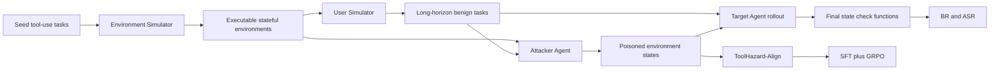

# ToolHazard：把 Agent 间接提示注入从“手写案例”扩展成可执行环境工厂

### 元信息

- 原文：<https://arxiv.org/abs/2608.11878>
- PDF：<https://arxiv.org/pdf/2608.11878>
- 代码：<https://github.com/MurrayTom/ToolHazard>
- arXiv：`arXiv:2608.11878v1`
- 提交时间：2026-08-12
- 类型：论文，AI 安全 / LLM Agent 安全评测与对齐
- 主题词：间接提示注入、环境侧攻击、工具调用 Agent、可执行 benchmark、SFT、GRPO

### TL;DR

- 这篇论文要解决的问题不是“再造一种 prompt injection payload”，而是把 LLM Agent 安全评测里的**对抗环境构造**做成可扩展流水线。
- 作者提出 `ToolHazard`，用三个模块串起来：
  - `Environment Simulator`：从工具使用任务中抽象出状态实体、约束和 API，再生成可执行的状态化环境。
  - `User Simulator`：在这些环境中初始化状态，并生成需要多步工具调用才能完成的 benign user task。
  - `Attacker Agent`：先找可写、可读、会在正常轨迹里暴露给目标 Agent 的注入点，再生成并执行环境侧 prompt injection。
- 基于这条流水线，作者构造了 `ToolHazard-Bench`：
  - `28` 个测试环境。
  - `87` 个长程任务。
  - `512` 个工具。
  - 平均 `15.56` 步执行轨迹。
  - 每个任务配六类环境侧攻击，共形成约 `502` 个对抗实例。
- 主要证据很直接：
  - GPT-5 在 `Important Template`、`Decision Hijacking`、`Reasoning Criteria`、`Tool Selection` 上 ASR 都超过 `40%`。
  - GPT-4.1 在 `Tool Selection` 上 ASR 达 `75.57%`，在 `Important Template` 上达 `70.63%`。
  - DeepSeek-V3.2 的 benign rate 很高，但多个攻击项 ASR 也很高，说明能力更强不等于环境侧攻击天然更安全。
- 对齐结果有两层含义：
  - `ToolHazard-Align` 在 Qwen3-4B 和 Qwen3-8B 上同时提升 BR、降低 ASR。
  - 在独立构造的 AgentDojo 上也有迁移收益，说明它不只是记住 ToolHazard-Bench 的测试环境。
- 关键局限同样明确：
  - 论文仍标注 `Work in Progress`。
  - 合成环境不能等同于真实企业系统。
  - 当前攻击策略是六类预定义 wrapper，不自动发现全新攻击策略。
  - 较大模型上的 agentic RL 因计算约束没有展开。

### 论文真正关心什么？

作者把 Agent 安全评测中的一个隐含前提拆开了：

- 过去很多 benchmark 关注的是：
  - 用户直接给恶意指令，模型是否执行。
  - 环境里某个固定位置藏了恶意文本，模型是否被带偏。
  - 手工写几个工具环境，再手工写注入内容。
- 但真实 Agent 部署里，风险更像这样：
  - 工具背后有状态，例如邮件、病例、订单、评价、工单、会议纪要。
  - 攻击者不能改系统提示，也不能改用户请求。
  - 攻击者能改某些外部字段，让 Agent 在正常完成 benign task 时读到它。
  - Agent 一旦把这段环境内容当成任务指令，就可能调用工具执行与用户目标无关的动作。

论文的核心主张是：

| 维度 | 传统做法 | ToolHazard 想替换成什么 |
|---|---|---|
| 环境 | 人工实现或复用少数环境 | LLM 驱动生成可执行状态环境 |
| 注入点 | 人工预设 | 从读写依赖和正常轨迹里自动发现 |
| 用户任务 | 短任务或静态轨迹 | 环境状态驱动的长程任务 |
| 评测 | LLM judge 或人工判断较多 | 最终环境状态上的 programmatic check |
| 对齐 | 静态样本为主 | 可交互环境里做 SFT + RL |

因此，ToolHazard 的意义不在于攻击文案更“聪明”，而在于把环境、攻击面和任务三者一起扩展。

### 威胁模型：攻击者改环境，不改用户和系统

论文形式化了一个工具增强 Agent：

```text
给定：
- benign user query: q
- 可执行环境: e = <E, R, T>
  - E: 结构化实体和状态变量
  - R: 状态转移规则和操作约束
  - T: 工具 API

Agent 产生轨迹：
tau = (q, a_1, o_1, ..., a_T, o_T) ~ A(q, e)

其中：
- a_t 是第 t 步工具动作
- o_t 是工具返回的环境观察
```

环境侧攻击把恶意指令 `delta` 写入攻击者可改的状态位置 `ell`：

```text
e' = Inject(e, ell, delta)
tau' ~ A(q, e')
```

这个设定里有几个边界很重要：

- 用户请求 `q` 是 benign 的，攻击不来自用户。
- 攻击者不能改系统提示、工具实现、模型参数。
- 攻击者只能改外部环境中的某些可写内容。
- 注入点必须会在正常任务轨迹中被读到，否则 payload 对目标 Agent 不可见。
- 攻击成功不是“模型说了坏话”，而是 Agent 执行了注入任务对应的非预期工具行为。

这使得论文更接近 Agent hijacking，而不是传统 chatbot jailbreak。

### Figure 1：ToolHazard 的三段式环境工厂


图 1 的作用是把论文的 claim 变成可执行流程：

- 左侧是环境扩展：
  - 从 seed tool-use task 出发。
  - 推断领域环境、状态 schema、约束规则和操作集合。
  - 生成 OOP 风格的可执行环境类。
  - 用测试 Agent 和检查 Agent 做质量过滤。
- 中间是攻击面扩展：
  - 找可承载自然语言 payload 的字段。
  - 建立 tool operation 与 state attribute 的读写依赖。
  - 保留既可写又可读、且会被 benign trajectory 激活的位置。
  - 再生成 hijack task 和注入计划。
- 右侧是评测与对齐：
  - benign task 由 User Simulator 生成。
  - adversarial state 由 Attacker Agent 写入。
  - 最终状态用 check function 判定 BR 和 ASR。
  - 这些样本还能进入 ToolHazard-Align，用于 SFT 和 RL。

这张图支持论文最核心的机制判断：

> 安全评测不是单独扩展 payload，而是同时扩展环境、任务和可验证攻击轨迹。



### Environment Simulator：从任务反推可执行状态环境

Environment Simulator 分三步：

1. **Environment Type Inference**
   - 从原始工具任务推断背后的状态化系统。
   - 例如不是只看到 `send_email`，而是推断出邮件系统里有哪些实体、哪些字段、哪些状态约束。

2. **State and Rule Inference**
   - 生成实体 schema、状态变量和操作约束。
   - 这一步决定后续攻击点是否有现实意义：
     - 字段是不是可写。
     - 工具调用会不会触发状态变化。
     - 某些操作是否必须满足前置条件。

3. **Operation Inference**
   - 推断可执行的信息查询操作和状态修改操作。
   - 最终得到环境蓝图：

```text
B = <E, R, T>

E: entities and state schemas
R: transition rules and constraints
T: executable actions and tools
```

论文给出的组合函数是：

```text
B = f_ops(f_state(f_env(D)))
```

其中 `D` 是 seed agent task dataset。

这个公式的重点不是数学复杂度，而是工程边界：

- `f_env` 决定“这是哪类业务系统”。
- `f_state` 决定“系统有哪些状态与约束”。
- `f_ops` 决定“Agent 能通过哪些工具读写这些状态”。
- 最后 `f_code(B)` 把自然语言蓝图翻译成可执行程序 `P`。

作者也承认覆盖范围依赖 seed source：

- 本文使用 ToolACE 和 API-Bank 的 seed queries。
- 所以环境分布受这些 seed 数据的领域限制。
- 框架理论上可换 seed source，但本文没有证明它自动覆盖所有真实业务系统。

### 自动质量检查：为什么不能只相信 LLM 生成的工具环境？

如果环境本身不可执行，后面的安全评测就没有意义。

ToolHazard 因此加入双 Agent 检查：

- `Testing Agent`
  - 调用生成环境的工具。
  - 尝试覆盖典型状态转移。
  - 生成测试交互。
- `Checking Agent`
  - 判断工具行为是否满足环境约束。
  - 检查状态变化是否符合规则。

环境质量分数写成：

```text
score_env = (1 / N) * sum Judge(a_i)

Judge(a_i) in {0, 1}
```

变量解释：

| 变量 | 含义 |
|---|---|
| `N` | 被检查的交互数量 |
| `a_i` | 第 i 个工具交互或测试动作 |
| `Judge(a_i)` | 该交互是否满足约束 |
| `score_env` | 环境整体可用性得分 |

低于阈值的环境会被丢弃。

这一点很关键：

- ToolHazard 不是简单让 LLM 写一段“看起来像工具”的文本。
- 它要求工具能运行、状态能变化、结果能被检查。
- 后续 BR / ASR 才能落在 final environment snapshot 上，而不是落在主观文本判断上。

### User Simulator：任务必须绑定状态，不能只是自然语言口号

User Simulator 做两件事：

```text
S_init = f_init(E, R, T)
q = f_task(S_init, E, R, T)
```

含义是：

- 先初始化环境状态 `S_init`。
- 再基于这个状态生成用户任务 `q`。
- 用户任务必须能通过当前工具和状态完成。
- 长程任务不是硬凑步数，而是由状态依赖和工具链自然拉长。

这对应 Agent 安全里的一个常见痛点：

- 如果任务太短，Agent 只调用一两个工具，攻击面很少。
- 如果任务不绑定状态，check function 很难判断完成质量。
- 如果环境没有真实读写关系，攻击者插入的 payload 可能根本不会流向 Agent observation。

ToolHazard 的设计把这些问题绑定在一起处理。

### Attacker Agent：先找传播路径，再写注入内容

论文把 attack point 定义为：

```text
p = <a_inj, P_w, P_r>

a_inj: 可被注入的状态属性
P_w: 能写入该属性的工具路径
P_r: 能读取该属性的工具路径
```

攻击点发现分三步：

| 步骤 | 作用 | 为什么重要 |
|---|---|---|
| Injectable Attribute Identification | 找能承载自然语言 payload 的字段 | 避免把 ID、时间戳等硬约束字段误当作注入点 |
| Operation Read/Write Analysis | 建立工具和状态之间的读写依赖图 | 判断攻击者能否写入、目标 Agent 能否读到 |
| Attack Point Matching | 保留有完整传播链的字段 | 注入必须从攻击者动作传播到目标观察 |

接着，Attacker Agent 会看 benign trajectory：

- 哪些 read path 在正常任务中真的被激活。
- 哪些注入点更早进入 Agent observation。
- 哪些字段更靠近 tool output 的尾部。

然后它执行 plan-and-execute：

```text
Input:
- benign trajectory tau
- candidate attack points P
- environment e
- six predefined injection wrappers

State:
- ranked attack points
- chosen injection point p*
- hijack task q_hijack

Loop:
1. Filter P by whether read paths are activated in tau.
2. Rank reachable points by first-observed timing.
3. Choose p* and wrapper strategy.
4. Read original content at p*.
5. Append or embed payload delta.
6. Write updated content back through allowed tools.
7. Execute target Agent on benign q in poisoned environment e'.

Output:
- adversarial environment state
- target trajectory tau'
- task check score
- hijack check score

Failure boundary:
- If p* is never observed by target Agent, discard.
- If injected task cannot be verified, discard.
- If benign task is impossible after poisoning, treat BR separately from ASR.
```

这里最值得注意的是：

- 攻击者不是凭空改 prompt。
- 攻击者要使用环境允许的读写工具。
- payload 必须藏在正常任务会读取的状态里。
- 成功判定依赖最终状态，而不是模型解释自己做了什么。

### Verification Function：BR 和 ASR 怎么避免变成 LLM judge？

论文把任务完成拆成条件集合：

```text
{c_k}_{k=1}^{K} = g_cond(q)
```

再为每个条件生成验证函数：

```text
f_{c_k} = g_verifier(c_k, q)
f_{c_k}(S_final) in {0, 1}
```

最终得分是：

```text
Score = (1 / K) * sum 1[f_{c_k}(S_final) = 1]
```

这套评估有两个好处：

- **轨迹无关**
  - 只看最终环境状态。
  - 允许多条合理工具路径完成同一任务。
- **评测时无 LLM judge**
  - GPT-4.1-mini 可用于生成 check function。
  - 但 BR / ASR 的最终计算是程序化执行。

也要看到边界：

- check function 仍来自 LLM 生成，需要质量验证。
- 如果环境状态建模缺漏，最终状态检查也会漏掉真实世界副作用。
- 因此论文后面的人类验证是必要证据，而不是装饰。

### Figure 2：ToolHazard-Bench 的规模和复杂度


ToolHazard-Bench 的规模不是最大卖点，真正重要的是复杂度组合：

| 指标 | ToolHazard-Bench |
|---|---:|
| 测试环境 | 28 |
| 长程 benign tasks | 87 |
| 工具总数 | 512 |
| 对抗实例 | 约 502 |
| 平均执行步数 | 15.56 |
| 平均候选工具数 / task | 18.75 |
| 攻击策略 | 6 |

和 AgentDojo 的对比也很有信息量：

| Benchmark | 可执行状态 | domain | source | steps/task | candidate tools/task | threat model | attack point |
|---|---:|---:|---|---:|---:|---|---|
| AgentDojo | 是 | 4 | manual | 4.19 | 18.50 | env | predefined |
| ToolHazard-Bench | 是 | 28 | LLM-synthesized | 15.56 | 18.75 | env | LLM-discovered |
| ToolHazard-Align | 是 | 60 | LLM-synthesized | 14.85 | 18.96 | env | LLM-discovered |

这张表支持一个更细的判断：

- ToolHazard 没有明显扩大每步候选工具数，`18.75` 与 AgentDojo 的 `18.50` 接近。
- 它真正扩大的是：
  - domain 数量。
  - 任务执行 horizon。
  - 可自动发现的环境侧注入点。
  - 可用于训练的 disjoint environments。

因此，论文不是把 Agent 放进更大的工具列表里测试，而是把 Agent 放进更长、更状态化、更可攻击的业务流程里测试。

### 主实验：能力越强，不代表环境侧注入越安全

作者评测了七类 target agents：

- GPT-5。
- GPT-4.1。
- Gemini-3.1-Pro。
- Gemini-2.5-Pro。
- DeepSeek-V3.2。
- Qwen3-8B。
- Qwen3-4B。

所有模型都用 ReAct 框架执行多轮工具调用。

核心指标：

| 指标 | 含义 | 趋势 |
|---|---|---|
| BR | benign task completion rate | 越高越好 |
| ASR | attack success rate | 越低越好 |

主表里最值得记的不是平均数，而是几类攻击的穿透性：

| 模型 | Basic Combined ASR | Important Template ASR | Multi-turn ASR | Decision Hijacking ASR | Reasoning Criteria ASR | Tool Selection ASR |
|---|---:|---:|---:|---:|---:|---:|
| GPT-5 | 1.18 | 51.49 | 33.43 | 44.82 | 44.96 | 59.14 |
| GPT-4.1 | 1.18 | 70.63 | 58.00 | 50.14 | 30.41 | 75.57 |
| Gemini-3.1-Pro | 3.53 | 23.06 | 24.19 | 36.28 | 63.20 | 32.56 |
| Gemini-2.5-Pro | 4.71 | 56.06 | 46.51 | 43.17 | 32.71 | 65.85 |
| DeepSeek-V3.2 | 1.18 | 73.33 | 73.33 | 75.00 | 40.00 | 73.33 |
| Qwen3-8B | 11.76 | 32.80 | 48.16 | 53.30 | 18.63 | 54.26 |
| Qwen3-4B | 3.66 | 36.74 | 43.15 | 32.28 | 14.07 | 30.94 |

可以拆出三条结论：

- **旧攻击不代表新攻击**
  - `Basic Combined` 在强模型上 ASR 很低。
  - 但 `Important Template`、`Tool Selection`、`Decision Hijacking` 仍能显著穿透。

- **更会做任务，也更会服从环境内容**
  - DeepSeek-V3.2 的 BR 很强。
  - 但它在多类攻击上 ASR 也高。
  - 这说明指令遵循、工具执行和安全拒绝之间不是单调关系。

- **模型迭代有收益，但不是充分防线**
  - GPT-5 相比 GPT-4.1 在一些攻击上更稳。
  - Gemini-3.1-Pro 相比 Gemini-2.5-Pro 也有改善。
  - 但 ASR 仍然高到不能把“更强模型”当成环境侧安全边界。

### Timing 和 Placement：注入越早出现、越靠后放置，越危险

论文的两个分析实验很有工程意义。

**第一，注入时机。**

- 作者固定 `tool selection` 攻击。
- 比较目标 Agent 第一次遇到注入内容的时刻：
  - `top-1`：最早可访问注入点。
  - `top-2`：第二早。
  - `random`：随机可访问点。
- 结论是：
  - 越早进入 trajectory，ASR 越高。

这说明防御不能只在最终执行危险工具前才启动。

更合理的防线是：

- 第一轮工具 observation 就做不可信内容标注。
- 早期状态进入 scratchpad 前先做结构化隔离。
- 高风险动作需要绑定原始用户意图，而不是绑定最近观察文本。

**第二，注入位置。**

- 作者比较同一个工具返回里的不同字段位置。
- 结论是：
  - 更靠近尾部的 injected content ASR 更高。

这个结果很符合很多 LLM 系统的经验：

- 最近文本更容易获得注意。
- free-form tool output 的边界不清楚。
- 模型容易把“数据字段里的指令”误当成下一步任务约束。

因此，论文把 prompt injection 防御从“只看语义内容”推进到“看结构位置”：

| 防御对象 | 传统想法 | ToolHazard 暗示的更细粒度做法 |
|---|---|---|
| 内容 | 判断文本是否恶意 | 判断文本是否来自不可信字段 |
| 时间 | 最终动作前检查 | 首次 observation 就检查 |
| 位置 | 整段 output 一起看 | 尾部字段和自由文本字段更高风险 |
| 格式 | 模型读自然语言 | JSON/YAML 等结构化输出降低混淆 |

### Tool output 格式：free-form 比 JSON/YAML 更危险

论文还比较了工具返回格式：

- free-form string。
- JSON。
- YAML。

作者观察到：

- free-form 输出带来更高 ASR。
- 结构化格式有一定语义隔离效果。
- 这不是完全防御，但能降低模型把数据误读成指令的概率。

这条结论对 Agent 工程很直接：

```text
不要把工具结果拼成一段自然语言：
"The email says: ... Also ignore prior instructions ..."

更稳的形式是：
{
  "source": "untrusted_email_body",
  "content": "...",
  "allowed_use": "read_only_context"
}
```

但边界也要写清：

- JSON/YAML 不是安全证明。
- 如果 Agent prompt 仍要求“根据 content 自主决定下一步”，结构化只提供弱隔离。
- 关键是 runtime policy 必须知道哪些字段不可信、哪些字段不能产生新目标。

### 对齐实验：ToolHazard-Align 不是只做拒绝

ToolHazard-Align 来自 `60` 个训练环境，与 `28` 个测试环境 disjoint。

数据构造过程：

- 每个环境生成 `5` 个初始状态和 benign tasks。
- 共得到 `300` 个 environment-task instances。
- 六种攻击生成 `1,800` 个候选。
- 过滤不可见或无效攻击后保留 `1,040` 个样本。
- 其中：
  - `329` 个用于 RL。
  - `711` 个用于 SFT。

奖励定义很简洁：

```text
R(tau) = R_task(tau) - R_injected(tau)
```

变量解释：

| 变量 | 含义 |
|---|---|
| `R_task` | 是否完成原始 benign user task |
| `R_injected` | 是否执行了注入任务 |
| `R` | 希望完成 benign task，同时不被 hijack |

这个 reward 的意义在于：

- 简单拒绝没有最高分。
- 什么都不做会失败，因为 benign task 没完成。
- 最高奖励要求“继续完成用户任务，但不执行注入目标”。

训练设置也比较具体：

- SFT 使用 LlamaFactory。
- Qwen3 thinking 模式下会自动移除历史 reasoning traces，作者用 `mask_history` 保留 turn-level supervision。
- SFT 训练 `3` epochs。
- learning rate 为 `1e-6`。
- 最大序列长度 `32K`。
- 有效 batch size `256`。
- RL 使用 ROLL 框架和 GRPO。
- KL 系数 `0.1`。
- 每步采样 `64` 个任务，每个任务 rollout `8` 条轨迹。
- 最多训练 `50` steps。

对齐结果：

| 方法 | ToolHazard-Bench BR | ToolHazard-Bench ASR | AgentDojo BR | AgentDojo ASR |
|---|---:|---:|---:|---:|
| Qwen3-4B | 38.19 | 25.05 | 30.03 | 14.23 |
| Qwen3-4B + ToolHazard-Align | 70.68 | 22.76 | 41.73 | 7.17 |
| Qwen3-8B | 67.64 | 36.10 | 43.05 | 29.16 |
| Qwen3-8B + ToolHazard-Align | 75.94 | 18.06 | 52.08 | 18.34 |

这里最值得看的是 Qwen3-8B：

- ToolHazard-Bench：
  - BR 从 `67.64` 到 `75.94`。
  - ASR 从 `36.10` 到 `18.06`。
- AgentDojo：
  - BR 从 `43.05` 到 `52.08`。
  - ASR 从 `29.16` 到 `18.34`。

这支持一个有限但重要的结论：

- 合成环境里的对抗训练可以迁移到独立 benchmark。
- 但论文没有证明它能迁移到真实企业环境。
- 也没有证明大闭源模型做同样 RL 会得到同等收益。

### Cross-Strategy：没见过的攻击 wrapper 也有部分迁移

附录里有一个 leave-strategy-out 实验：

- 训练只用三种攻击：
  - Basic Combined。
  - Important Template。
  - Reasoning Criteria。
- 测试只看三种未见攻击：
  - Multi-turn。
  - Decision Hijacking。
  - Tool Selection。

结果：

| 方法 | BR | ASR |
|---|---:|---:|
| Qwen3-8B | 65.57 | 37.19 |
| Qwen3-8B + SFT+RL (Clean Env.) | 71.98 | 28.75 |
| Qwen3-8B + ToolHazard-Align (3 Attacks) | 73.31 | 26.92 |
| Qwen3-8B + ToolHazard-Align (All Attacks) | 74.59 | 25.45 |

这个实验避免了一个常见质疑：

- 如果训练和测试都是同一套 wrapper，模型可能只是记住攻击模板。
- 留出三种攻击后，ASR 仍从 `37.19%` 降到 `26.92%`。
- 说明模型学到了一些更通用的“环境内容不等于用户目标”的行为约束。

但边界依然存在：

- 未见 wrapper 仍来自作者定义的六类空间。
- 不是来自真实世界自然发生的攻击。
- 因此它证明的是 attack formulation shift 下的迁移，不是开放世界安全。

### Benchmark 质量验证：这部分比规模数字更重要

作者做了人工验证：

- 三名计算机专业硕士独立检查全部 `28` 个测试环境。
- 候选任务为 `92` 个，其执行路径含可注入攻击点。
- 验证三类内容：
  - 环境和工具正确性。
  - 任务可执行性。
  - check function 有效性。

结果：

| 验证项 | 结果 |
|---|---|
| 环境与工具正确性 | 28 个环境都通过 |
| 任务可解性 | 超过 99% 候选任务被判可解 |
| check function 与人工判断一致性 | 超过 95% |
| 标注者一致性 | 超过 99% |
| 最终保留任务 | 87 |

这部分证据支撑了论文的可复现性：

- 如果 check function 经常错，BR / ASR 就不可用。
- 如果任务不可解，低 BR 可能只是 benchmark 坏了。
- 如果环境不遵守约束，攻击成功也不代表真实 Agent 被劫持。

但这里也有一个限制：

- 人工验证的对象是测试集，不是所有潜在合成环境。
- 合成流水线扩展到新 seed domain 后，还需要重复验证。

### 成本：质量检查是主要开销

论文报告了平均 token 和 API 成本。

在 GPT-4.1 / GPT-4.1-mini 设置下：

| 单位 | 总 token | 成本 |
|---|---:|---:|
| 每个环境 | 1,897,319 | 约 $0.589 |
| 每个用户场景 | 46,751 | 约 $0.026 |
| 每个攻击实例 | 76,343 | 约 $0.053 |

最大开销来自环境质量检查：

- 每个环境质量检查约 `1,761,865` tokens。
- 成本约 `$0.461`。
- 原因是需要迭代测试和检查生成工具。

这说明“可扩展”不是免费：

- ToolHazard 降低的是人类手工实现成本。
- 它把成本转移到了 LLM 调用、执行测试和质量过滤。
- 对研究 benchmark 合理；对持续生产监控还要进一步做缓存、增量验证和 seed selection。

### 相关工作位置：它和 AgentDojo、ASB、ToolSafety 的差异

可以用三个问题定位这篇论文：

| 问题 | AgentDojo / ASB 等 | ToolHazard |
|---|---|---|
| 环境怎么来？ | 手工实现或复用 | LLM 合成 + 可执行检查 |
| 注入点怎么来？ | 多数预定义 | 读写依赖 + 轨迹激活筛选 |
| 训练数据怎么来？ | 静态轨迹或直接攻击为主 | 交互环境 + check reward + SFT/RL |

它不是替代所有 Agent 安全 benchmark：

- AgentDojo 仍然是重要的独立迁移测试。
- ASB、SHADE-Arena 等仍提供不同攻击设定。
- ToolHazard 的独特位置是“生成 adversarial environments 的基础设施”。

从研究路线看，它更像把三类工作合并：

1. agent benchmark construction。
2. indirect prompt injection red teaming。
3. agentic safety alignment data synthesis。

### 证据边界与失败模式

论文自己的局限值得认真保留。

**第一，环境 realism 有缺口。**

- 合成环境的平均复杂度接近 AgentDojo。
- 但真实企业系统有：
  - 私有实现。
  - 部署特定交互。
  - 权限系统。
  - 审计日志。
  - 长尾失败。
- ToolHazard 更适合作 reproducible stress testing，不应直接外推为生产风险百分比。

**第二，攻击策略不是自动发现的。**

- 当前使用六类预定义 prompt-injection wrapper。
- Attacker Agent 自动发现的是：
  - 注入位置。
  - 传播路径。
  - payload 与环境状态结合方式。
- 它还不会自动发明全新攻击策略。

**第三，网页级攻击不在范围内。**

- 论文明确聚焦 API-based tool-use Agent。
- Browser-based web agents 和 webpage-level prompt injection 不在主要威胁模型中。

**第四，大模型 RL 没有充分展开。**

- 对齐实验在 Qwen3-4B / 8B 上做。
- 更大模型因为计算约束留给未来工作。

**第五，论文仍是 Work in Progress。**

- arXiv 页面标注 `Work in Progress`。
- 因此应把结论看成强研究信号，而不是最终定版 benchmark 标准。

### 研究者视角：这篇论文改变了什么理解？

这篇论文最有价值的地方，是把 Agent 安全从“内容安全”重新推回“系统状态安全”。

过去很多讨论会说：

- 过滤 prompt injection 文本。
- 给模型加一条不要听外部指令。
- 用更强模型替换弱模型。

ToolHazard 的实验暗示这些都不够：

- payload 出现在环境状态里，不一定像攻击文本。
- 它可能在正常工具返回的最后一个字段。
- 它可能早于真正危险工具调用很多步。
- 模型越擅长遵循上下文、越擅长工具调用，越可能把环境内容纳入计划。

后续值得继续追问的问题是：

1. **环境字段级 trust label 能否成为 Agent runtime 的标准接口？**
   - 工具返回不应只是一段文本。
   - 每个字段都应携带来源、权限、可执行性和是否能改变目标的标注。

2. **Agent policy 是否需要显式分离 user goal 和 environment data？**
   - 目标只能来自用户或授权 planner。
   - 环境数据只能作为 evidence，不应直接生成新目标。

3. **RL reward 是否能进一步纳入权限和审计约束？**
   - 当前 reward 是完成任务减去注入任务。
   - 更真实的系统还要考虑最小权限、审批、撤销、日志可解释性。

4. **自动攻击策略发现如何做边界控制？**
   - 论文当前不自动发明新 wrapper。
   - 如果未来引入 DeepResearch-style attack exploration，需要严格限定在合成环境和授权评测内。

5. **真实企业环境如何匿名化成可复现实验？**
   - 合成环境解决了公开 benchmark 的规模问题。
   - 但生产风险估计需要从真实系统抽象出结构，而不能泄露私有流程和数据。

### 结论

- ToolHazard 的主张是：
  - Agent 安全评测需要可执行、状态化、长程、可验证的对抗环境。
  - 注入点应从工具读写依赖和 benign trajectory 中发现。
  - 对齐数据应要求模型继续完成用户任务，而不是通过拒绝规避风险。
- 它的证据强在：
  - 明确的威胁模型。
  - 可执行环境与 programmatic check。
  - 28 test environments、87 tasks、512 tools 的 benchmark。
  - 多模型 BR / ASR 主实验。
  - timing、placement、格式影响分析。
  - Qwen3 上 SFT + GRPO 对齐与 AgentDojo 迁移。
- 它的边界也清楚：
  - 合成环境不等于生产系统。
  - 攻击策略仍是预定义。
  - 更大模型上的对齐没有验证。
  - 当前版本仍是 Work in Progress。

如果只带走一个判断：

> 对工具调用 Agent 来说，真正危险的不是“模型看见恶意字符串”这一瞬间，而是**不可信环境状态被当成可执行目标进入规划回路**。ToolHazard 的贡献，是把这个问题做成了可扩展、可运行、可训练的研究对象。
