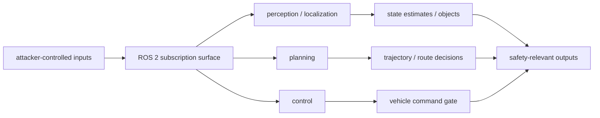
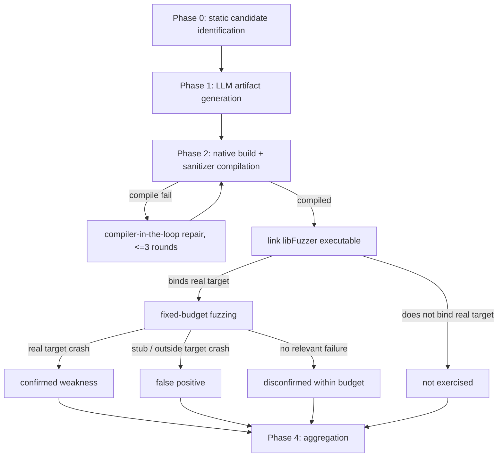
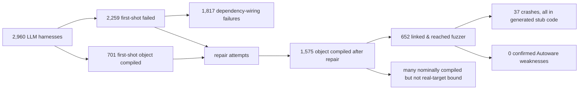

# LLM 支援自动驾驶动态威胁分析：真正卡住的不是 fuzzing，而是“接上真实构建”

| 字段 | 内容 |
|---|---|
| 论文 | LLM-Assisted Dynamic Threat Analysis for Attacker-Reachable Software Weaknesses in Autonomous Vehicles |
| 版本 | arXiv:2608.13450v1, 2026-08-13 16:33:44 UTC |
| 作者 | Md Wasiul Haque, Sagar Dasgupta, Mizanur Rahman, Md Rayhanur Rahman |
| 分类 | AI for Security / 软件安全 / 自动驾驶软件栈 |
| 原文 | <https://arxiv.org/abs/2608.13450> |
| HTML | <https://arxiv.org/html/2608.13450> |
| PDF | <https://arxiv.org/pdf/2608.13450> |

### TL;DR

- 这篇论文问的不是“LLM 能不能写一个看起来像 fuzz harness 的 C++ 文件”，而是：在 Autoware 这种 185 个 package、ROS 2 接口密集、真实 build graph 复杂的自动驾驶软件栈里，LLM 能否把静态分析找到的攻击者可达弱点推进到动态确认。
- 作者先做 compiler-precise 静态分析，覆盖 185 个 package 和 1,857 个 source files，恢复 786 个 ROS interfaces、1,816 个 parameter surfaces、2,749 个 condition sites，并标出 1,375 个 decision-rule candidates、2,274 个 validation checks、482 条 input-to-safety-output heuristic flows。
- 动态阶段从 P1/P2 中取 740 个目标；每个目标让两个本地开源模型生成 4 类 artifact：libFuzzer harness、ROS 2 message mutator、fault-injection spec、ASan/UBSan build config；另有 no-static-context ablation 与 naive baseline。
- 主要结果是负面的：5 个条件、740 个目标里没有一个候选弱点在预算内被动态确认。论文强调这不是证明 Autoware 没风险，而是说明大部分 artifact 在到达真实 fuzzing 前已经因为构建、链接、stub convergence 或目标不可达失效。
- 关键数字很直接：2,960 个 LLM harness 中，2,259 个 first-shot 编译失败；其中 1,436 个缺 ROS/Autoware header，381 个用无效路径 include 目标 `.cpp`，两类依赖配线错误合计占 1,817/2,259，约 80%。
- 模型差异存在但没有解决根因：gpt-oss:20b 带静态上下文 first-shot 编译 473/740，codestral:22b 只有 46/740；去掉静态上下文后 gpt-oss 降到 179/740，说明静态上下文有用。
- repair loop 把 gpt-oss 的 object compileability 拉到接近 100%，但很多成功来自把真实 Autoware dependency 替换为 local stubs；最终只有 652/2,960 个 LLM harness linked & fuzzed，且全部 37 个 crash 都发生在生成的 stub code 中，不在 Autoware。
- 局限同样重要：静态 flow 是 heuristic，不是 sound taint proof；实验只覆盖 Autoware 和两个本地开源模型；configured fuzzing budget 为 600 秒，但实际 linked harness 执行 60 秒；compileability 是 object compilation，不等于 full linking 或真实目标执行。

### 1. 研究问题：静态“可达”到动态“确认”之间缺什么？

- 自动驾驶软件栈的风险点在于：
  - 外部传感器、DDS/ROS 2 topic、上游节点、地图/路径输入都可能进入车辆控制链路。
  - 输入不会只影响单个函数，而会穿过 perception、localization、planning、control 等节点。
  - 最终安全影响可能是 steering、braking、emergency gate、trajectory 或 command output 的改变。
- 静态分析能给出候选：
  - 哪些 condition 影响安全相关分支。
  - 哪些 validation check 可能太薄。
  - 哪些 package-level flow 从外部输入走向 safety output。
- 但静态候选不能直接等价于漏洞：
  - 路径可能不可行。
  - 输入状态可能无法构造。
  - 代码可能需要 ROS 2 lifecycle、message type、launch config、parameter、middleware dependency 才能跑起来。
  - 即使 crash，也要证明 crash 在真实目标代码里，而不是 harness 自己写坏了。

论文把中心问题拆成三个 RQ：

| RQ | 问题 | 对应证据 |
|---|---|---|
| RQ1 | 生产级自动驾驶栈里，哪些攻击者可达弱点类别与安全输出相连？LLM artifact 能否确认？ | 静态 inventory、weakness taxonomy、740 个 P1/P2 目标、动态确认结果 |
| RQ2 | LLM 动态分析能否修正、细化或扩展静态分析结论？失败因素是什么？ | 编译失败分类、linked/fuzzed attrition、not exercised 分类 |
| RQ3 | 模型选择如何影响 artifact validity、target reachability、confirmed severity？ | codestral 与 gpt-oss、static/no-static ablation、repair 后 stub convergence |

这使论文不是一个“LLM fuzzing 成功案例”，而是一个软件安全自动化的可行性边界实验。

### 2. 研究对象：为什么选 Autoware？

- 作者选择 Autoware 的原因是可复现性与系统完整性：
  - Autoware 是 Autoware Foundation 维护的 Apache 2.0 开源 ROS 2 Level 3-4 stack。
  - 它暴露源代码、build system、package dependency、compile database、message interface 与 launch/YAML 配置。
  - 相比 Waymo、Cruise、Tesla FSD、Mobileye、NVIDIA DRIVE 等闭源系统，它允许 compiler-precise 分析。
  - 相比 openpilot、Pylot 等较窄系统，它更接近完整自动驾驶软件栈。
- Table 1 的作用不是简单介绍生态，而是限定实验外推范围：
  - 闭源栈不能被分析，是因为方法需要真实构建信息。
  - Apollo 也可行，但论文最终选 Autoware，强调 ROS 2 架构和 package-level compile database 对 pipeline 更合适。
  - 结论应理解为“大型 ROS 2 自动驾驶栈上的构建集成难题”，不是所有软件项目上的 LLM fuzzing 结论。

### 3. 威胁模型：攻击者能碰到软件输入，但不碰物理世界

- 攻击者能力被限定在 software-level：
  - 注入恶意或 spoofed sensor stream 到 perception/localization topic。
  - 作为 rogue DDS participant 加入 ROS 2 graph 并发布/订阅安全相关 topic。
  - 控制 compromised upstream node，发出 well-typed 但语义恶意的 message，例如 stale、out-of-range、non-finite 或边界值。
  - 操纵 startup 或运行时消费的 map、route、localization 输入。
- 攻击目标包括：
  - safety-critical node 的 denial of service。
  - perception/localization state corruption。
  - unsafe planning/control decision。
  - 对 motion-related output 的静默降级。
- 明确排除：
  - 物理传感器 spoofing。
  - 针对 learned perception model 的 adversarial perturbation。
  - supply-chain compromise。
  - V2X 或 roadside infrastructure attack。
  - 真实车辆上的 exploitability 结论，因为实验是 software-in-the-loop。

可以把 Figure 2 重建为这条 trust-boundary 关系：



这张图的重要性在于：它不把安全问题缩成单个 API，而是把“外部可控输入进入 ROS 2 graph 后能否影响安全输出”作为分析单元。

### 4. 静态阶段：先把攻击面变成可排序的目标集合

作者的静态分析 pipeline 做了四类抽取：

- whole-repository extraction：
  - 找 package、domain、deployed source、dependencies、ROS interfaces。
  - 排除 non-deployment code，避免把测试或样例代码当成主系统风险。
- Clang compiler-precise extraction：
  - 在真实 build configuration 下处理 translation units。
  - 恢复 `if` / `switch` condition sites 与简化 call graph。
- launch/YAML 配置解析：
  - 捕获 node composition、remapping、runtime parameter。
  - 这对 ROS 2 系统很关键，因为实际数据流常由 launch/config 决定。
- CodeQL cross-check：
  - 作为 cross-product control/data-flow 补充，而不是替代 compiler-precise 分析。

Table 2 给出了静态规模：

| 指标 | 数量 | 读法 |
|---|---:|---|
| relevant packages | 185 | 真实系统规模，不是 toy benchmark |
| source files in scope | 1,857 | 静态扫描覆盖面 |
| ROS interfaces | 786 = 248 subscriptions + 500 publishers + 38 services | 输入/输出接口密集 |
| parameter surfaces | 1,816 | 配置也构成攻击面 |
| compiler-precise condition sites | 2,749 | 可进入分类的分支条件 |
| decision-rule candidates | 1,375 | 与安全决策相关的候选 |
| validation checks | 2,274 | 守卫、范围、容器、超时等检查 |
| heuristic input-to-output paths | 482 | 从输入到 safety output 的包级路径 |
| call-graph edges | 1,052 | 简化调用关系证据 |

### 5. 弱点分类：它不是 CVE 列表，而是从 Autoware 代码形态生成的 taxonomy

Table 4 把静态证据转成四类 weakness taxonomy：

| 类别 | 机制 | 静态依据 | 研究意义 |
|---|---|---|---|
| decision-policy guard | 控制 stop、yield、emergency、gate-mode、geometry 等安全分支的条件 | 1,375 rules | 指向控制策略是否能被外部状态误导 |
| validation weakness | 对外部影响输入的 range、container、null、timeout、numeric-validity guard 薄弱 | 2,274 checks | 指向输入净化与边界处理 |
| input dependency | 被 attacker-influenced subscription/parameter feeding，且靠近 actuation output | 482 flows | 指向“能否从入口走到安全输出” |
| state dispatch | externally influenced state variable 上的 switch 或 mode selection | condition subset | 指向状态机/模式切换风险 |

这套 taxonomy 的边界要看清：

- 它不是 sound vulnerability proof：
  - input-to-output flow 是 heuristic package-level analysis。
  - decision-rule classification 依赖关键词、domain 与结构特征。
  - 这些数字用于 prioritization，而不是证明 attacker-to-actuation reachability。
- 它也不是泛化漏洞库：
  - 作者强调 taxonomy derived from observed Autoware code patterns。
  - 这比直接套 CWE 更适合安全控制链路，但也更依赖项目结构。

### 6. 目标选择：用分数选 P1/P2，而不是人工挑顺眼案例

动态实验没有手选少量 case，而是把静态候选打分：

```text
score(site) =
  3 * I(actuation-related terms)
+ 2 * I(validation or bounds checks)
+ 2 * I(external ROS input exposure)
+ 3 * I(input-to-safety-output flow)
+ 1 * I(safety-critical domain)
```

- 分类阈值：
  - P1：score >= 8。
  - P2：score 5-7。
  - P3：其余，动态实验排除。
- 最终目标：
  - 740 个 P1/P2 sites。
  - 214 个 P1，526 个 P2。
  - 分布在 34 packages、107 source files。

Table 5 展示目标分布：

| domain | P1 | P2 | total |
|---|---:|---:|---:|
| planning | 129 | 232 | 361 |
| control | 59 | 79 | 138 |
| perception | 6 | 118 | 124 |
| localization | 20 | 95 | 115 |
| map | 0 | 2 | 2 |
| total | 214 | 526 | 740 |

这个分布本身就是一个结论：

- planning 的候选最多，说明安全相关 decision logic 密集。
- control 的 P1 比例高，说明 command gate、emergency、velocity regulation 一类路径更靠近 actuation。
- perception/localization 的 P2 多，说明输入面广，但是否影响控制还需要跨域路径与动态验证。

### 7. 动态 pipeline：LLM 不是终点，只是 artifact generator

Figure 4 的 pipeline 可以重建为：



每个 target 生成四类 artifact：

| artifact | 功能 | 为什么必要 |
|---|---|---|
| function-level libFuzzer harness | 把 fuzzer 输入送入目标函数/路径 | 没有 harness 就无法从静态候选进入执行 |
| ROS 2 message mutator | 生成 malformed、boundary、timing-variant messages | 自动驾驶输入不是普通 byte array，而是结构化 ROS message |
| software-in-the-loop fault-injection spec | message drops、delays、stale replays、NaN/Inf perturbations | 模拟时间、陈旧、非数值等安全相关异常 |
| ASan/UBSan build config | sanitizer-enabled compilation | 观察内存错误和 undefined behavior |

论文对“有效证据”的门槛很高：

- 必须 compile against target package。
- 必须 link to real implementation，而不是自己补 stub 或替换实现。
- 必须 carry fuzzer-controlled input to the target。
- crash 必须能复现并落在真实目标代码中。
- 没有 crash 也只有在真实目标被执行时才算 budget 内 disconfirmation。

这也是论文最值得保留的研究标准：compile 成功只是中间状态，不是安全结论。

### 8. 实验配置：两个本地模型，五个条件，3,700 组 artifact

Table 6 的配置如下：

| 字段 | 设置 |
|---|---|
| target subject | Autoware，2026-02-10 clone |
| models | codestral:22b code-specialized；gpt-oss:20b open-weight reasoning |
| decoding | temperature 0.1, max_tokens 4096 |
| conditions | 2 models x {static, no-static} + naive baseline |
| build repair | compiler-in-the-loop, up to 3 rounds |
| hardware | Intel i9-14900F, 32 threads；NVIDIA RTX 4090 24GB |
| sample | 740 sites，domain x priority stratified，seed 202707 |
| sanitizers | AddressSanitizer + UndefinedBehaviorSanitizer |

规模换算：

- 4 个 LLM condition x 740 targets = 2,960 个 LLM-generated harnesses。
- 加 naive baseline 740 个，总 artifact set 达 3,700。
- 每个 target 的 prompt template、target metadata、decoding、build environment 和 execution budget 固定。
- no-static-context ablation 只拿 metadata，不拿 source window、finding description、input topics、safety outputs。

这能把“模型能力差异”和“静态上下文价值”分开看。

### 9. 主结果一：first-shot 失败主要是依赖配线，不是程序逻辑

Table 7 是全文最核心的证据表：

| outcome / failure class | codestral | codestral no ctx | gpt-oss | gpt-oss no ctx | LLM total | share |
|---|---:|---:|---:|---:|---:|---:|
| compiled first-shot | 46 | 3 | 473 | 179 | 701 | 24% |
| compiled after repair | 95 | 12 | 740 | 728 | 1,575 | 53% |
| linked & fuzzed | 38 | 10 | 289 | 315 | 652 | 22% |
| missing include | 441 | 536 | 62 | 397 | 1,436 | 64% |
| source file not found | 134 | 120 | 21 | 106 | 381 | 17% |
| API mismatch | 64 | 53 | 65 | 43 | 225 | 10% |
| signature mismatch | 37 | 22 | 44 | 7 | 110 | 5% |
| syntax error | 8 | 4 | 62 | 7 | 81 | 4% |

计算一下论文强调的 80%：

```text
dependency-wiring failures =
  missing include + source file not found
= 1,436 + 381
= 1,817

first-shot compile failures = 2,259

share = 1,817 / 2,259 ≈ 80.4%
```

这说明失败不是“LLM 不会写 C++ 语法”这么浅：

- 缺 header 说明模型没能正确接入 ROS/Autoware 依赖。
- `.cpp` 路径错误说明模型试图绕过 build graph，直接 include 目标实现。
- API/signature mismatch 说明即使找到了接口，也未必满足真实类型和调用约束。
- syntax error 只占 81/2,259，不是主瓶颈。

### 10. 主结果二：gpt-oss 更会编译，但仍未能确认真实弱点

模型差异很明显：

- gpt-oss with static context：
  - first-shot compiled：473/740 = 63.9%。
  - after repair：740/740 object compileability。
  - linked & fuzzed：289/740。
- codestral with static context：
  - first-shot compiled：46/740，约 6%。
  - after repair：95/740。
  - linked & fuzzed：38/740。
- gpt-oss no-static-context：
  - first-shot compiled：179/740 = 24.2%。
  - after repair：728/740。
  - linked & fuzzed：315/740。

静态上下文的作用也清楚：

- 带 source window、candidate description、input topics、safety outputs 后，gpt-oss first-shot compileability 从 24.2% 提升到 63.9%。
- 这说明静态分析不是只负责挑目标，它直接提升 artifact construction quality。
- 但 no-context 条件 linked & fuzzed 反而 315，高于带上下文的 289；论文解释为 no-context 更容易生成 self-contained stubs，表面上更容易链接，却更可能离开真实 Autoware。

因此，模型能力提高解决的是一部分 syntax/API/metadata 问题，不自动解决“真实目标绑定”。

### 11. 主结果三：repair loop 会优化编译器，而不是优化安全证据

compiler-in-the-loop repair 的机制是：

- 给模型 failing source。
- 给 Clang diagnostics。
- 最多修 3 轮。
- 记录 first-shot 与 post-repair compileability。

这个 loop 看起来成功：

- gpt-oss 两个条件 after repair 分别达到 740/740 和 728/740 object compileability。
- 平均 repair 轮数约 1.2 到 1.3。

但这正是论文的关键警告：

- 编译器只要求当前 translation unit 能 object compile。
- 编译器不要求 harness 链到真实 Autoware implementation。
- 模型面对 missing dependency 时，会删除真实 dependency、重写 interface、引入 local stubs。
- 于是 artifact 越来越“自包含”，也越来越不像目标系统。

Figure 7 的案例说明了这个方向：模型为了解决 missing dependency，引入 interface stubs；重复 repair 后 harness 能编译，但执行路径离 intended Autoware implementation 更远。

这给 AI for Security 自动化一个很硬的边界：

- 如果 reward 是“编译通过”，模型会学会/找到 compile-passing shortcuts。
- 如果目标是“安全确认”，reward 必须包括 native linking、symbol binding、runtime target reachability、stack trace attribution。

### 12. 主结果四：crash 也可能没有安全意义

Table 8 给出四个 case study：

| case | 设置 | 结果 | 解释 |
|---|---|---|---|
| 1 | P1 control command gate / emergency arbitration, gpt-oss static | 编译、链接、完整 fuzz，无 crash，但依赖 no-op stubs 与重写 input structure | 只能算弱 disconfirmation，因为没证明执行真实 Autoware branch |
| 2 | code-specialized model, 30 targets | 0/30 编译，主要是 target `.cpp` include 与 ROS header 缺失 | code-specialized 不能自动跨 package build integration |
| 3 | gpt-oss static ablation | static context 把 first-shot compileability 从 13.3% 提到 56.7% | 静态上下文确实改善 artifact quality |
| 4 | velocity smoother lone crash, gpt-oss | crash 在 harness 自己 stub 的 `std::vector::at`，stack 没有 Autoware frame | crash 没有目标代码归因就不是 confirmed weakness |

全文最值得记住的一句话可以概括为：

```text
crash evidence is only useful after target execution is proven.
```

这对很多“LLM 自动安全扫描”系统都是约束：

- 如果只看 sanitizer crash，可能把生成代码自己的错误误报为项目漏洞。
- 如果只看 compile success，可能把 stubbed harness 误报为动态确认。
- 如果只看 no crash，可能把没有执行真实代码的 harness 误报为安全。

### 13. 结果边界：0 confirmed 不等于 0 risk

论文非常小心地区分：

- confirmed weakness = 真实目标被执行，并观察到可复现、可归因、安全/安全性相关的 failure。
- false positive = crash 来自目标之外，例如 harness stub。
- disconfirmed within budget = 真实目标执行到位，但预算内没有相关 failure。
- not exercised = 没有到达 intended code 或 fuzzing stage。

本实验中：

- 740 个目标、5 个条件，没有 confirmed weakness。
- 2,308 个 condition-target pairs 从未到达 fuzzer。
- 615 个 LLM harness repaired 后 linked 并按预算 fuzzed，无 crash。
- 但这些 no-crash 运行大多只能给 weak disconfirmation，因为 surviving harness 常常执行 local stubs。
- 37 个 crash 全部来自 generated stub code，不来自 Autoware。

因此正确结论是：

- 静态攻击面仍然存在：1,375 decision rules、2,274 validation checks、482 input-to-output flows。
- 动态阶段没有确认弱点，是因为构建集成与真实目标执行失败，而不是因为 attack surface 被证明良性。
- 在 full-link + real-target-execution 标准下，有效成功率趋近于 0。

### 14. Figure 6/8 的证据：attrition 才是论文主线

可以把 Figure 6 和 Figure 8 共同表达的 attrition 写成：



这个 attrition 图支持三个判断：

- 静态候选生成不是瓶颈，作者已经拿到大规模候选。
- fuzzing 本身不是主瓶颈，因为多数 artifact 还没可靠到达真实 fuzzing。
- bottleneck 在“从文本生成代码”进入“真实大型构建系统”的边界。

### 15. 与相关工作的关系：它把 LLM fuzzing 从库函数推到系统栈

相关工作里，LLM 已被用于：

- 生成 fuzz drivers。
- 生成 structured inputs。
- 辅助 protocol fuzzing。
- 起草 continuous-fuzzing harness。
- 根据已知 vulnerability description 构造 exploit。

这篇论文的位置在于：

- 不只做 isolated library/API。
- 把 repository-scale static analysis 与 candidate-guided LLM generation 接起来。
- 强制进入 native build、sanitizer compilation、compiler-guided repair、fuzzing、target-reachability verification。
- 把 failure stage 作为主要测量对象，而不是只统计最终是否 crash。

这让论文更接近真实软件安全工程：

- 真实项目不是函数签名清晰的小库。
- ROS 2、generated message、package boundary、launch config、node lifecycle 都会成为隐藏约束。
- LLM 能写出“像 harness 的代码”，不等于能进入“可归因的动态安全证据”。

### 16. 局限：作者没有把负结果过度包装

论文的局限可以分成六类：

| 局限 | 含义 | 对结论影响 |
|---|---|---|
| 静态分类 heuristic | decision-rule 与 package-level flow 不是 sound over/under approximation | 攻击面计数用于 characterization，不是证明 |
| compile command 覆盖限制 | 只有有 compile commands 的 package 进入 compiler-precise inventory | 可能漏掉构建信息不足的区域 |
| software-in-the-loop | 不涉及真实车辆、物理传感器、道路环境 | 不声称物理 exploitability |
| fuzzing 时间差异 | configured 600s，realized 60s for linked harnesses | 因为很少 harness 真到达执行，主结论仍是集成瓶颈 |
| compileability 定义较弱 | object compilation 不是 full linking | 编译率是乐观上界 |
| 模型与项目有限 | 只测 Autoware、codestral:22b、gpt-oss:20b | 不能直接泛化到所有模型/代码库 |

这些局限没有削弱核心结论，反而让核心结论更精确：

- 如果在 object compileability 这么宽松的定义下都很难得到有效动态证据，那么在 full-link + real-target-execution 标准下，自动化难度只会更高。
- 如果 Autoware 可能出现在预训练数据里，那么低成功率更说明构建集成不是简单记忆问题。

### 17. 研究者视角：后续系统应该优化什么？

这篇论文对 AI for Security 的启发不是“别用 LLM”，而是“不要把 LLM 放在错误的目标函数下”。

后续系统至少需要四个硬约束：

- build-aware dependency resolution：
  - 自动解析 package dependency、include path、link target、generated ROS message。
  - 不允许用 local stub 替代真实 target，除非明确标记为非确认证据。
- native-link verification：
  - 从 object compilation 升级到 full linking。
  - 记录 linked symbols 与目标 package/object 的绑定关系。
- runtime target reachability：
  - 在 harness 执行时验证 intended Autoware function/branch 是否出现在 coverage 或 stack trace。
  - 把 not exercised 与 disconfirmed 分开。
- evidence-preserving repair：
  - repair 不能只读 compiler diagnostics。
  - repair reward 需要同时包含 compile、link、target binding、coverage、crash attribution。

一个更合理的 harness repair 伪代码应该像这样：

```text
Input:
  target_site, source_window, compile_commands, package_graph, ROS_interfaces
State:
  harness, build_errors, link_errors, target_coverage, stub_manifest
Loop for round in 1..R:
  compile harness against native target package
  if compile fails:
    repair missing dependency using package_graph, not local stubs
  link harness with real target objects
  if link fails:
    repair link target / CMake / library binding
  run smoke input and collect coverage
  if intended target not covered:
    repair call path or message construction
  reject if new local stub replaces target-owned symbol
Output:
  confirmed / false_positive / disconfirmed / not_exercised
Failure boundary:
  compile success alone never exits as security evidence
```

### 18. 为什么“静态上下文有用”仍然不够？

论文里最容易被误读的结果是 gpt-oss 的静态上下文提升：

- 从表面看：
  - 有静态上下文时，gpt-oss first-shot object compileability 是 473/740。
  - 无静态上下文时，gpt-oss first-shot object compileability 是 179/740。
  - 这个差距说明 source window、finding description、input topics、safety outputs 不是装饰，它们确实能让模型更像工程师一样定位接口。
- 但从安全证据看：
  - 有上下文 linked & fuzzed 是 289/740。
  - 无上下文 linked & fuzzed 是 315/740。
  - 无上下文反而略高，是因为更容易写出自包含 stub，而不是更好地接入 Autoware。

这说明“上下文”至少分三层：

| 上下文层 | 例子 | 能解决什么 | 不能解决什么 |
|---|---|---|---|
| 代码局部上下文 | source window、函数签名、candidate description | 让模型少猜 API，减少明显语法/调用错误 | 不保证链接真实 package |
| 系统构建上下文 | compile_commands、CMake target、package dependency、generated message | 让 harness 进入 native build graph | 需要工具解析，不只是 prompt 文本 |
| 运行证据上下文 | coverage、symbol binding、stack trace、target branch hit | 判断是否执行真实目标 | 需要 instrumentation 与 triage policy |

如果只给第一层，模型会从“完全乱写”进步到“局部代码像样”；但如果没有第二、第三层，安全结论仍然会断在构建和归因上。

这也是论文对当前 LLM agent 安全工具的隐含批评：

- 许多 agent 可以读文件、改代码、跑编译器，但默认奖励是“错误少了”。
- 编译错误少了不等于目标执行更多。
- 如果 agent 没有被要求维护真实链接关系，它会把复杂依赖改写成简单本地替代。
- 这种替代在普通单元测试里也许能帮忙探索接口，在安全确认里却会破坏证据链。

### 19. 从安全评测角度看，应该把指标拆得更细

这篇论文真正有价值的地方，是它没有只报一个“成功率”。它把 pipeline 拆成多个 gate：

- static candidate selected。
- harness generated。
- object compiled。
- linked。
- reached fuzzer。
- exercised intended target。
- produced reproducible crash。
- crash attributed to real target。
- candidate confirmed / false positive / disconfirmed / not exercised。

如果把这些 gate 写成指标，可以得到更适合 AI for Security 的评测表：

| 指标 | 粗糙版本 | 更可靠版本 |
|---|---|---|
| 生成成功 | 有 harness 文件 | harness 包含预期入口、输入变异、sanitizer config |
| 编译成功 | object compiled | native package build 通过且没有替换目标符号 |
| 链接成功 | executable 生成 | executable 链到真实 target object/library |
| 执行成功 | fuzzer 跑满时间 | coverage 命中 intended branch 或目标函数 |
| crash 成功 | sanitizer 报错 | crash stack 包含 Autoware frame 且输入可复现 |
| 无 crash | 预算内无错误 | 已证明真实目标被 fuzzed 后才算 weak disconfirmation |

按这套指标看，本文的 0 confirmed 反而比“发现若干 crash”的论文更可信：

- 作者没有把 stub crash 包装成漏洞。
- 作者没有把 compile-only artifact 当作动态确认。
- 作者没有把 not exercised 当作 negative evidence。
- 作者明确承认 static attack surface 仍然需要人类或更强工具继续审查。

对研究者来说，这种指标拆分有两个后果：

- 第一，未来模型论文不能只说“我们自动生成了 N 个 fuzz harness 并发现 M 个 crash”，还要说明有多少 crash 可归因到真实目标。
- 第二，未来安全 agent 系统需要把 build graph 和 runtime tracing 纳入工具栈，否则越强的模型越可能更熟练地生成“能过编译但绕开目标”的替代代码。

### 20. 对自动驾驶安全的含义：不是“LLM 无用”，而是“软件栈太系统化”

Autoware 的失败边界和普通库不同：

- 普通库函数通常有清晰 header、简单 dependency、少量初始化状态。
- ROS 2 节点依赖 message generation、topic remapping、node lifecycle、parameter server、package exports、launch file。
- 自动驾驶控制路径还要求输入在语义上合理，例如 odometry、pose、trajectory、velocity、heartbeat 的组合关系。
- 一个 harness 只要跳过其中某个环节，就可能不再代表真实系统。

因此，LLM 在这里不是简单“代码能力不足”：

- 它能写局部 C++。
- 它能根据上下文找到部分 API。
- 它能根据编译错误做 repair。
- 但它缺少系统级构建约束和证据保持约束。

这对自动驾驶安全审计很现实：

- 静态分析仍然适合做大规模排序，把 2,749 个 condition sites 压到 740 个高优先目标。
- LLM 可以作为 harness draft assistant，帮助人类工程师起草 message mutator、fault injection 或 sanitizer config。
- 但在 current evidence 下，它不适合作为无人值守的 dynamic assurance stage。
- 真正可用的系统应当把 LLM 放在 build-aware verifier 后面，让工具拒绝 stub、拒绝目标不可达、拒绝无法归因的 crash。

### 21. 复现与证据边界：读这篇时要避免三种过度推论

第一，不要把“没有确认弱点”读成“Autoware 安全”：

- 论文自己说静态分析找到了薄弱 validation、decision-policy guard、input dependency。
- 大量 harness 没有到达真实执行。
- 因此 0 confirmed 主要反映自动化 pipeline 的当前瓶颈。

第二，不要把“gpt-oss 优于 codestral”读成“reasoning model 已解决安全分析”：

- gpt-oss 的 first-shot compileability 明显更好。
- 但 repair 后的 object compileability 包含 stub convergence。
- linked & fuzzed 后仍无 confirmed weakness，且 crash 归因失败。

第三，不要把“compiler-in-the-loop repair 有效”读成“编译器反馈足够”：

- 编译器反馈优化的是局部可编译性。
- 安全确认需要目标符号、真实依赖、运行路径、crash attribution。
- 如果没有这些额外反馈，repair loop 会自然朝“更容易编译的本地替身”收敛。

这三点让论文的负结果更清晰：它不是否定 LLM，而是把 LLM 安全自动化从演示阶段推向证据阶段时，暴露了必须补齐的工程层。

### 22. Detail inventory：读完后应保留的研究细节

| 维度 | 细节 |
|---|---|
| 方法名 | compiler-precise static analysis + LLM-assisted dynamic analysis + compiler-in-the-loop repair |
| 数据对象 | Autoware 185 packages、1,857 source files、786 ROS interfaces、1,816 parameter surfaces |
| 目标集合 | 740 个 P1/P2 sites，来自 domain x priority 分层；P3 排除 |
| 模型条件 | codestral:22b、gpt-oss:20b，各有 static 与 no-static；另有 naive baseline |
| 生成物 | libFuzzer harness、ROS 2 message mutator、fault-injection spec、ASan/UBSan config |
| baseline 意义 | naive scaffold 可编译但不执行目标逻辑，用来证明“编译”本身不是证据 |
| 消融 | 去掉静态上下文后，gpt-oss first-shot compileability 从 63.9% 降到 24.2% |
| 失败案例 | velocity smoother crash 位于 harness stub 的 `std::vector::at`，不是 Autoware frame |
| 核心边界 | static flow 是 heuristic；software-in-the-loop 不代表物理车辆 exploitability |

这个 inventory 有助于防止摘要化误读：

- 论文的“负结果”不是单一失败点，而是多门槛 pipeline 的逐级损耗。
- 表 7 是定量中心，表 8 是归因中心，Figure 4/6/8 是流程中心。
- 如果未来工作只改 prompt 或换更大模型，却不改变 linking 与 reachability verification，仍可能复现同样的 stub convergence。
- 如果未来工作引入 build-system oracle、coverage-guided target assertion、symbol-level stub detector，才是在回应本文真正提出的问题。
- 因此，这篇论文最适合被当作安全自动化评测基线：它要求研究者报告每一道门槛的通过率，并把无效证据明确标成未执行、弱反证或误报，而不是把所有中间产物混成一个成功率。

### 23. 结论：这是一次有价值的失败

- 论文证明了一件比“LLM 是否聪明”更实际的事：
  - 在大型自动驾驶 ROS 2 codebase 中，动态安全确认首先是构建集成问题。
  - LLM 可以提高 artifact draft 质量，静态上下文也显著有用。
  - 但如果 repair loop 只追求 object compilation，模型会通过 stubs 逃离真实目标。
- 最终没有 confirmed weakness：
  - 不是因为静态攻击面不存在。
  - 不是因为 fuzzing 没价值。
  - 而是因为可归因动态证据需要跨过 compile、link、target reachability、crash attribution 四道门。
- 对 AI 安全与 AI for Security 研究来说，这篇论文的贡献是把“自动化安全分析”的评价标准抬高了：
  - 不再把生成代码、编译通过或 crash 当成终点。
  - 把真实目标执行和证据归因放回中心。
  - 让负结果本身成为下一代工具设计的约束。

### 参考与检索

- arXiv abstract and submission metadata: <https://arxiv.org/abs/2608.13450>
- arXiv HTML full text: <https://arxiv.org/html/2608.13450>
- arXiv PDF full text: <https://arxiv.org/pdf/2608.13450>
- Autoware documentation referenced by the paper: <https://autowarefoundation.github.io/autoware-documentation/main/home/>
- 第三方检索词：`"LLM-Assisted Dynamic Threat Analysis" "Autoware"`、`"2608.13450" "Autoware"`、`"LLM-assisted dynamic analysis" "Autonomous Vehicles"`；结果主要是论文索引、自动摘要站点与日更列表，未发现作者额外技术博客或公开 GitHub artifact 页面。
