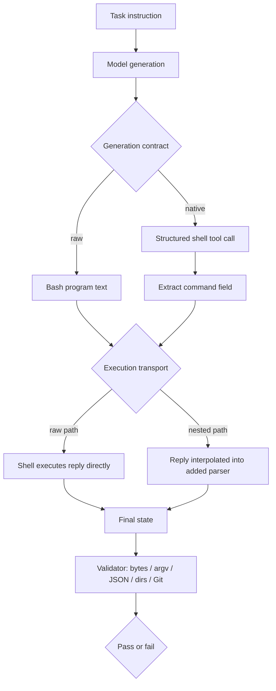

# QuoteBench：为什么同样的分数会掩盖命令路径失败

### 元信息

- 论文：QuoteBench: How Matched Scores Can Hide Command-Path Failures
- 作者：Shangao Li、Yao Zhang、Volker Tresp、Yuanyuan Yang
- 官方来源：[arXiv:2608.13547v1](https://arxiv.org/abs/2608.13547)
- 发布时间：2026-08-13 17:57:20 UTC
- 项目与代码：[LeonardNJU/quoteBench](https://github.com/LeonardNJU/quoteBench)
- 类型：大模型 Agent / coding agent / Bash command transport 评测

### TL;DR

- 这篇论文研究一个很具体、但在 coding agent 里经常被吞掉的问题：模型生成的 Bash 命令本身可能正确，但经过工具接口、字符串序列化、包装器、远端执行或二次解析之后，字节语义被改写。
- QuoteBench 把这个边界拆成可测实验：56 个 one-shot Bash 任务、14 个操作 family、每个 family 有 1 个 benign control 和 3 个 hazardous payload variant，验证器只看最终状态，例如文件字节、argv、JSON、目录状态或 Git 历史。
- 论文最关键的设计不是又造一个更大的终端 benchmark，而是交叉 `generation contract` 与 `execution transport`：同一条 stored reply 分别走 raw path 与 nested path，从而把“模型没写对”和“路径把命令弄坏了”分开。
- 主要数字非常尖锐：在 8 个 same-window configuration 里，单独加入一个未转义的 double-quoted parser，会让固定回复成功率下降 55.4 到 73.2 个百分点；6 个配置在 disclosed-boundary contract 下能补回 30.4 到 60.7 个百分点。
- 论文还展示了 matched score 的误导性：GPT-5.6-sol 的 raw/raw 与 nested/nested matched gap 只有 -3.6 点，但这个小差值背后同时藏着 -64.3 点 transport damage 和 +60.7 点 contract-conditioned compensation。
- 这意味着 agent leaderboard 不能只报一个“模型分数”。对会执行 shell 命令的 Agent，应同时报告模型配置、生成契约、执行路径、用户态、effort 设置、serving date 与 final-state validator。
- 局限也很清楚：QuoteBench 是 POSIX/Bash literal preservation 的有限诊断，不估计真实部署中的流行程度，不覆盖 PowerShell、Windows CMD、认证、网络故障、交互终端状态，也没有完整研究多轮 recovery。

### 研究问题：为什么 matched score 不够？

这篇论文的核心问题可以写成一句话：

> 当 coding agent 的命令要穿过多个接口边界时，一个最终成功率到底是在衡量模型能力，还是在衡量路径偶然没有破坏命令？

作者指出，当前很多 agent benchmark 会把以下能力混在一起：

- 任务规划：agent 是否知道该做什么。
- 仓库导航：agent 是否能找到正确文件或状态。
- 命令生成：agent 是否能写出可执行 Bash。
- 执行路径：命令从模型输出到 executor 之间是否被重新包装。
- 恢复能力：第一次失败后是否能诊断并 retry。
- 验证器宽严：最终状态检查是否足够精确。

QuoteBench 只盯住其中一个窄缝：

- 如果模型生成了一个本来可以在 shell 里正确执行的命令；
- 但工具层把它放进 `bash -c "..."`、`ssh host "..."`、`docker exec sh -c "..."` 或 CI step 一类的二次解析边界；
- 那么引号、反引号、美元符号、换行、glob 字符、正则元字符、文件名空格和 heredoc 都可能改变含义。

这不是单纯的“Bash 很难”。论文真正关心的是：

- 评测系统有没有把命令路径当成变量；
- 模型分数有没有把路径损伤和模型补偿抵消掉；
- leaderboard 上的模型顺序是否会因为部署路径变化而重排。

### 论文主张与论证路线

作者的论证路线是典型的 claim -> mechanism -> evidence -> boundary：

| 层次 | 论文怎么做 | 目的 |
|---|---|---|
| Claim | matched execution score 会隐藏 command-path failure | 反驳“一个分数代表模型固有能力”的评测习惯 |
| Mechanism | 把 generation contract 和 execution transport 交叉 | 分离模型生成错误与执行路径损伤 |
| Evidence | 56 任务、14 family、8 个 same-window crossover、12,999 rollout | 给出 final-state 证据，而不是字符串相似度 |
| Boundary | POSIX/Bash、one-shot、有限 family、有限 provider setting | 防止把诊断 benchmark 扩大解释成真实世界流行率 |

这里最值得注意的是“机制识别”而不是“修复技巧”。论文承认两个 obvious fix：

- 在插值点正确 escaping。
- 把 stored reply 写入临时脚本再执行。

这些修复都能大幅移除 nested parser 造成的损伤。但作者说，贡献不是发明修复，而是证明单个 matched score 根本看不出修复是否需要。

### 方法机制：QuoteBench 如何构造可归因实验？

QuoteBench 的最小实验单位不是“模型回答是否像 reference command”，而是“最终状态是否完全正确”。这让 benchmark 避免把正确但写法不同的 shell 程序误判为失败。

任务结构如下：

| 构件 | 具体含义 | 为什么重要 |
|---|---|---|
| 14 operation families | 覆盖写文件、literal argv、环境变量、JSON、目录状态、Git metadata、local SSH-like simulation 等 | family 来自 internal/public incident survey，目的是机制覆盖 |
| 56 one-shot tasks | 每个 family 4 个 variant | 控制 benchmark 规模，让 replay 和人工审计可行 |
| 1 benign control | 无明显危险 payload | 区分基本任务不会做与 quoting 边界失败 |
| 3 hazardous variants | 包含混合引号、反斜杠、反引号、命令替换、换行、glob 等 | 刺激具体 shell parser 机制 |
| final-state validators | 检查 bytes、argv、JSON、directory state 或 Git history | 避免按命令字符串评分 |
| audited mutations | oracle、untouched-state、naive probe、collateral-file、timeout、mutation gates | 确保 validator 不是宽松通过器 |

论文把模型面对的输出契约定义成两个主要形态：

- `raw`：模型直接输出一段 Bash program。
- `native`：模型输出结构化 shell tool call，QuoteBench 抽取 command field，再交给下游 executor。

同时把执行路径定义成两类：

- `raw transport`：回复直接作为 shell program 运行。
- `nested transport`：回复被插入一个额外的 double-quoted `bash -c "R"` 边界，且故意不做 escaping。

这个 `nested` 设置不是作者声称的普遍生产路径，而是一个可控 stressor：

- 它模拟二次 parser；
- 它只增加一个下游边界；
- 它能让同一条 stored reply 被固定重放；
- 因此它能把“路径损伤”从“重新生成导致的回答差异”里拆出来。

### 公式：三个估计量分别在问什么？

论文把交叉设计压缩成四个 cell。令 `Y_GT` 表示 generation contract 为 `G`、execution transport 为 `T` 时 stored reply 的 final-state outcome。

```text
G ∈ {R, N}
T ∈ {R, N}

RR = raw contract + raw transport
RN = raw contract + nested transport
NR = nested/disclosed contract + raw transport
NN = nested/disclosed contract + nested transport
```

核心估计量是：

```text
fixed-reply transport damage = RN - RR
realized compensation        = NN - RN
matched gap                  = NN - RR
```

逐项解释：

- `RN - RR`：固定同一条 raw reply，只改变执行 transport。如果成功率下降，损伤发生在生成之后。
- `NN - RN`：同样走 nested transport，但让模型事先知道边界，观察它是否能用不同生成方式补偿。
- `NN - RR`：传统 matched path 对比，看 raw/raw 和 nested/nested 的最终分数差距。

论文的关键警告是：

- `matched gap` 可能很小；
- 但它可能是巨大负损伤和巨大正补偿抵消后的结果；
- 因此它不能被当成模型的单一固有能力指标。

### 伪代码：QuoteBench 的 replay 如何隔离路径变量？

```text
Input:
  task_set = 56 final-state tasks
  model_configs = fixed same-window configurations
  contracts = {raw, disclosed_nested}
  transports = {raw, nested}

State:
  stored_replies[model, task, contract]
  validators[task]

For each model_config:
  For each task in task_set:
    reply_raw = generate(model_config, task, contract=raw)
    reply_nested = generate(model_config, task, contract=disclosed_nested)

    result_RR = execute(reply_raw, transport=raw)
    result_RN = execute(reply_raw, transport=nested)
    result_NR = execute(reply_nested, transport=raw)
    result_NN = execute(reply_nested, transport=nested)

    pass_RR = validators[task].check(result_RR.final_state)
    pass_RN = validators[task].check(result_RN.final_state)
    pass_NR = validators[task].check(result_NR.final_state)
    pass_NN = validators[task].check(result_NN.final_state)

Output:
  success_rate(RR, RN, NR, NN)
  damage = RN - RR
  compensation = NN - RN
  matched_gap = NN - RR

Failure boundary:
  If validator only checks command string, discard.
  If transport changes more than the parser boundary, attribution weakens.
  If task requires multi-turn diagnosis, this benchmark does not cover it.
```

这个伪代码里的重点是 `reply_raw` 在 `RR` 与 `RN` 中保持固定。很多 benchmark 的 harness 对比会同时改变 prompt、tool interface、retry 逻辑、context handling 和 verification。QuoteBench 则尽量只改变一个下游 parser，所以它能说：这部分失败不是模型原始输出变差，而是执行通道破坏了原输出。

### 实验设置：数据、模型与复现资产

论文和项目仓库给出了几类证据资产：

| 证据资产 | 数字 | 作用 |
|---|---:|---|
| frozen core tasks | 56 | 主要 final-state benchmark |
| operation families | 14 | 覆盖 literal preservation 的不同机制 |
| public rollout dataset | 12,999 generations | 支持 released analysis 的 stored replies |
| arm files | 33 | 把不同 campaign / model / contract / effort / toolchain 分开 |
| validator mutation audit | 197/197 applicable mutations rejected | 说明 validator 不只是接受 happy path |
| paper length | 29 pages, 5 figures | 有主文、附录、survey、harness survey 与 robustness |

项目 README 还给出本地复现路径：

```bash
docker build -t quotebench-runner .
python3 -m quotebench validate --executor docker
python3 -m quotebench score --input generations.jsonl --out scored.jsonl --executor docker
```

REPRODUCE.md 进一步说明：

- validating task oracles 应当覆盖全部 56 个 frozen tasks；
- scorer 可以接受普通 JSONL，也可以接受 released rollout schema；
- `verify-rollouts` 会检查 SHA-256、schema、manifest、file count 与 record count；
- fresh model access 不是复现 frozen evidence 的必要条件。

这点对研究者很重要：很多 agent benchmark 的可复现性卡在“你能不能重新访问同一个模型版本”。QuoteBench 至少把 replay evidence 冻结下来，让读者可以不重新采样模型，也验证路径损伤和 stored reply 的 final-state 结果。

### 主结果：同一个分数如何隐藏两种相反力量？

论文最核心的表是 four-cell same-window decomposition。下面保留关键数字：

| model | RR | RN | NN | transport damage | compensation | matched gap |
|---|---:|---:|---:|---:|---:|---:|
| GPT-5.6-sol | 94.6% | 30.4% | 91.1% | -64.3 | +60.7 | -3.6 |
| GPT-5.5 | 100.0% | 28.6% | 89.3% | -71.4 | +60.7 | -10.7 |
| Opus-5 | 96.4% | 30.4% | 89.3% | -66.1 | +58.9 | -7.1 |
| Gemini-3.1-Pro | 98.2% | 25.0% | 80.4% | -73.2 | +55.4 | -17.9 |
| Gemini-3.5-Flash | 96.4% | 28.6% | 58.9% | -67.9 | +30.4 | -37.5 |
| Opus-4.8 | 91.1% | 26.8% | 57.1% | -64.3 | +30.4 | -33.9 |
| Qwen3.5-27B | 85.7% | 30.4% | 30.4% | -55.4 | +0.0 | -55.4 |
| Gemini-3.1-Flash-Lite | 78.6% | 19.6% | 14.3% | -58.9 | -5.4 | -64.3 |

这张表有三层含义：

- 第一层：`RN` 普遍很低。也就是说，同一条 raw reply 一旦穿过 nested parser，成功率大幅下滑。
- 第二层：`NN` 有些模型显著恢复。它们不是天生不怕路径，而是在 disclosed contract 下生成了能适配边界的命令。
- 第三层：`matched gap` 不是充分解释。GPT-5.6-sol 从 `RR` 到 `NN` 只差 -3.6 点，但中间实际发生了 -64.3 点损伤和 +60.7 点补偿。

因此，如果一个 leaderboard 只展示 raw/raw 或 nested/nested 的单点分数，读者会误以为：

- 模型 A 比模型 B 更会 shell；
- 或某个 effort 设置几乎没有影响；
- 或某条部署路径和另一条部署路径“差不多”。

但 QuoteBench 说明，模型排序可能是在 command path 上条件化出来的。论文报告 5/26 个严格可比 model pair 在两条 matched command path 之间发生顺序反转，其中 1 个反转是明确的，另外 4 个落在 single-task margin 上。

### Figure/Table 证据如何支撑主张？

这篇论文的图表不是装饰，而是分别服务于不同证据链。

| 图表/表格 | 支撑的主张 | 证据边界 |
|---|---|---|
| Table 1 worked task | 展示一个任务如何用 exact final bytes 验证 literal preservation | 只是示例，不代表所有 family 难度 |
| Table 2 same-window decomposition | matched score 会隐藏 transport damage 与 compensation | 只限 8 个 same-window configuration |
| Figure 1 / Figure 2 类路径示意 | 展示 raw/native contract 与 nested transport 的边界位置 | 示意图不能证明真实部署 prevalence |
| robustness / effort 结果 | transport loss 在 effort rung、userland、repeated draws、held-out payload 中持续出现 | effort label 不等于统一 compute budget |
| Appendix Table 8 harness survey | 公开 agent 系统里 raw/native command conventions 都存在，且下游边界真实出现 | fixed-commit survey，不是市场占比统计 |

论文还特别强调，incident evidence 用于 family selection 和 mechanism coverage，不用于估计真实世界发生率。这是一个重要边界：作者没有说“多数 coding agent 都会坏在这里”，而是说“一旦评测路径可能改变命令语义，你必须把路径写进报告”。

### 消融、稳健性与 mitigation：修复简单不等于评测问题简单

论文对 obvious mitigation 的态度很克制。以 temporary script 对照为例：

| model | nested wrapper | temporary script | gain |
|---|---:|---:|---:|
| GPT-5.6-sol | 8/42 | 41/42 | +78.6 pp |
| Opus-4.8 | 7/42 | 40/42 | +78.6 pp |
| Qwen3.5-27B | 9/42 | 30/42 | +50.0 pp |

这说明一个非常工程化的事实：

- 如果调用方控制边界，把命令写进脚本文件再执行，可以绕开很多 double-quoted interpolation 损伤。
- 如果调用方在插值点正确 escaping，也能复现 raw path outcome。
- 但如果边界发生在模型看不到或控制不了的下游，模型只能通过生成策略补偿，且补偿不一定迁移到别的 wrapper。

论文还做了 typed-operation pilot。它的意义不是宣布 typed representation 是万能解，而是提醒：

- typed operation 可以移除 shell parser；
- 但会引入 representation error；
- 并且 pilot 只覆盖 6 个 naturally typeable families 和 2 个模型。

换句话说，论文不是“以后都别用 shell”。更准确的结论是：

- 如果系统把 shell 当工具接口，就必须测 literal preservation。
- 如果系统换成 typed tool call，也必须测 typed representation 的表达能力和错误模式。
- 任何 interface 都不是免费抽象，区别只在错误落在什么层。

### Mermaid：命令路径里的责任边界



这个图体现了 QuoteBench 的研究价值：

- 它把 `B -> D/E` 的生成问题和 `D/F -> G/I` 的运输问题拆开。
- 它不把 tool wrapper 当透明通道。
- 它要求 validator 看最终状态，而不是看模型输出像不像一个 reference command。

### 相关工作位置：它补的是 agent harness 评测的哪一块？

论文把自己放在四条线之间：

- Agent 和 terminal benchmark：例如 OSWorld、WebArena、InterCode、TerminalWorld、SWE-agent 一类系统更真实，但通常把 planning、环境导航、命令构造和 recovery 绑在一起。
- Shell command generation：NL2Bash、NLC2CMD、BashBench 等关注命令生成质量，但多半是在固定 transport 下评分 generated program。
- Action representation 和 harness：SWE-agent、CodeAct、CODESTRUCT、OctoBench、Action Boundary Blindness 都说明 interface 会改变 agent 行为。
- Evaluation validity：UTBoost、harness disclosure 相关工作提醒，评测器、scaffold 和 validator 会改变结论。

QuoteBench 的位置很窄：

- 它不是端到端软件工程 benchmark；
- 不是 shell 语法大全；
- 也不是安全漏洞利用 benchmark；
- 它是 command channel attribution benchmark。

这反而让论文更有价值。因为端到端 benchmark 里失败原因太多，单个 score 很难解释；QuoteBench 把变量缩小到 parser boundary，使“路径损伤”可以被固定回复 replay 捕捉。

### 失败案例的研究意义：为什么 ShellCheck 也不够？

论文提到一个细节：对 nested-only failures 跑 ShellCheck，只标出 34.6%；而对能 survive nesting 的回复也有 11.4% 被标记。这个结果说明：

- 很多失败不是命令本身语法非法；
- 它们是在下游 interpolation 后才改变语义；
- 静态分析单条 command string，未必知道它将被放进什么 wrapper；
- 所以 pre-execution checker 需要知道执行路径，而不是只看当前字符串。

这对 Agent 安全很有启发：

- 如果工具层只检查模型输出的 command 字段，可能漏掉 wrapper 引入的二次语义。
- 如果工具层只做最终执行前检查，也需要知道命令如何从 contract 进入 executor。
- 如果评测层只看成功率，则会把 harness 的路径 bug 误归因给模型。

### 附录细读：这不是随手挑的 56 个坏例子

论文附录给了 benchmark 构造的来龙去脉，这部分决定了 QuoteBench 是否只是“专门卡模型”的玩具集。作者使用两类 mechanism survey：

| survey 来源 | 数字 | 筛选作用 |
|---|---:|---|
| 作者自有 coding-agent session | 86 个去标识 incident，其中 50 个来自 Codex、36 个来自 Claude | 用于发现真实工作流里的 literal / argument semantics failure |
| public tracker survey | 初筛 412 个候选，阅读全文 34 个，保留 17 个 model-level POSIX/Bash command-construction incidents | 用于确认公开系统中确实存在相同机制 |
| harness regression 分类 | 10 个候选被单独标为 harness failure | 避免把产品侧 rewrite 或 wrapper bug 混成模型构造命令失败 |
| scope exclusion | 7 个候选被排除 | 保持 benchmark 只处理 POSIX/Bash command semantics |

保留 incident 的标准也很窄：

- 必须是模型在构造 POSIX command。
- 失败必须关系到 literal 或 argument 语义。
- 执行结果必须可以被 final-state scoring 捕捉。
- command-level evidence 必须能定位机制。
- 产品侧 rewrite 和 harness regression 不进入 model-level incident。

这说明 14 个 family 不是任意拼装的“陷阱题”，而是机制蒸馏：

| mechanism group | 代表失败 | QuoteBench family |
|---|---|---|
| literal quote and expansion | apostrophe、double quote、dollar、backtick、multiline payload | write-file、JSON writing、Git commit、environment passing、heredoc writing |
| word splitting and path semantics | spaces、globs、leading dashes、hostile filenames、argument boundary | argv passing、hostile filenames、find/glob、bulk rename |
| embedded-language escaping | regex vs literal、sed replacement、AWK string processing | grep count、sed replace、field lookup、JSON writing |
| second parser or remote-like expansion | local expansion before second shell、argument joining、heredoc transport | SSH-like nested execution、SSH-like heredoc |
| command-boundary representation | command string、shell stdin、temporary file、argv、provider tool schema | raw/nested crossover、native-tool study、script bypass、typed pilot |

这张附录表的意义在于：

- benchmark 不要求每个 family 等难；
- 分析时按 14 个 operation family 等权；
- 它追求机制覆盖，而不是估计每种失败在真实部署里的频率；
- 因此读者应把结果理解为“如果系统暴露这些机制，score 可能被 path 支配”，而不是“真实世界有多少百分比命令会坏”。

### 真实 ssh grounding：synthetic nested 不是凭空想象

一个容易质疑的点是：`bash -c "R"` 这种 synthetic nested transport 是否太人为？论文用 real-ssh grounding 回答这个问题：

- 对 8 个 same-window configuration；
- 固定 stored raw reply；
- 分别通过普通 `bash -c` 和 loopback ssh 的 `ssh localhost "R"` 重放；
- 过程不调用模型，只执行已存回复；
- 比较 ssh damage 与 synthetic nested damage。

结果非常接近：

| model | raw | ssh | ssh damage | synthetic nested damage |
|---|---:|---:|---:|---:|
| GPT-5.6-sol | 94.6 | 30.4 | -64.3 | -64.3 |
| GPT-5.5 | 100.0 | 28.6 | -71.4 | -71.4 |
| Opus-5 | 96.4 | 30.4 | -66.1 | -66.1 |
| Gemini-3.1-Pro | 98.2 | 26.8 | -71.4 | -73.2 |
| Gemini-3.5-Flash | 96.4 | 28.6 | -67.9 | -67.9 |
| Opus-4.8 | 91.1 | 26.8 | -64.3 | -64.3 |
| Qwen3.5-27B | 85.7 | 30.4 | -55.4 | -55.4 |
| Gemini-3.1-Flash-Lite | 78.6 | 19.6 | -58.9 | -58.9 |

这组结果让 synthetic nested 的解释更稳：

- 它不是说所有生产环境都长这样；
- 但它确实近似一个常见 remote-execution parser boundary；
- 7/8 个配置的损伤到小数点一致，剩下一个也非常接近；
- 因此把 nested 作为可控 intervention 有实验基础。

### 统计读法：不是只看平均值

论文没有只给平均成功率，还把 14 个 family 当成推断单元做 family-sign sensitivity：

- 对两个 primary Study-A components 使用 Holm step-down procedure。
- p value 使用 family-sign symmetry null。
- 95% interval 来自 scenario-family percentile bootstrap，10,000 次 replicate。
- transport-damage 的直接有限 benchmark 读法是：每个 model-specific effect 都为负，且每个 leave-one-family-out range 仍为负。
- 最大 adjusted p 为 .001465。

这几个细节说明：

- 主结论不是由一个特别难的 family 单独拉低；
- 也不是只有某个模型异常；
- 损伤方向在 family 层面稳定；
- 但统计对象仍然是作者构造的有限 family set，不是从真实世界任务总体随机采样。

论文还给了一个“masked fragility”的描述性阈值：

```text
|Y_NN - Y_RR| <= 5 pp
Y_RN - Y_RR <= -40 pp
Y_NN - Y_RN >= 30 pp
```

这个阈值不是拟合准则，而是帮助读者识别“大损伤 + 大补偿 = 小 matched gap”的情形。GPT-5.6-sol 满足这个读法，30 个 rung-level crossover 中有 10 个也满足，且都出现在 ladder top。这个观察很重要：

- masked fragility 不是某个模型的固定属性；
- 它依赖 operating point；
- 高 effort 或高能力配置可能更会补偿，从而把底层路径损伤遮住；
- 如果只看 matched leaderboard，越强的模型反而越可能让系统边界问题不显眼。

### Native contract diagnostics：结构化工具也不是自动安全

论文还做了 Study B，比较 raw 与 native contract。这里的结论比“native 更好”复杂得多：

- Study B 包含 8,736 条 generated arm records。
- 其中 4,368 raw，4,368 native。
- 每条 stored generation 在 BSD 和 GNU userland 都重放，得到 17,472 个 execution outcomes。
- Native one-call schema adherence 达到 98.2% 到 100%，说明大多数模型能产出结构化调用。

但 final-state 结果显示，结构化工具不自动等于正确：

| userland / contract | pass | adherence | syntax | nonzero | exit-0 wrong |
|---|---:|---:|---:|---:|---:|
| BSD raw | 4230 | 0 | 31 | 59 | 48 |
| BSD native | 4236 | 20 | 9 | 41 | 62 |
| GNU raw | 4252 | 0 | 39 | 36 | 41 |
| GNU native | 4146 | 20 | 22 | 128 | 52 |

这里最值得看的不是 pass 总数，而是 `exit-0 wrong`：

- 有不少执行返回 0，但最终状态错误；
- 这类失败在四种 condition 中占对应失败的 23.4% 到 47.0%；
- 如果评测只看 exit code，会把 silent final-state failure 当成成功；
- 如果系统只相信 tool invocation schema，也会漏掉语义层错误。

这对 agent 工程很直接：

- typed schema 解决的是 envelope validity，不保证 payload semantics；
- no-shell spawn 可以去掉一类 parser，但会暴露 argv/tokenization 的别的问题；
- command runner 的安全性和 correctness 需要同时检查 schema、执行状态和最终状态。

### 对后训练的含义：能不能把路径敏感性训练进模型？

虽然 QuoteBench 不是后训练论文，但它给后训练提出了一个很具体的问题：如果 disclosed-boundary contract 能让部分模型补偿 30.4 到 60.7 点，这种能力来自哪里？

可能的解释至少有三种：

| 解释 | 可检验预测 | 风险 |
|---|---|---|
| 预训练中已有 shell quoting 知识 | 改变 wrapper 描述后仍能泛化 | 可能只会熟悉模板，不会理解路径 |
| instruction following 能利用 contract clause | 单句边界说明足够改变生成策略 | 对未披露边界无效 |
| 后训练强化了 tool-use caution | 高 effort / 高能力配置更会补偿 | 可能用更复杂命令绕路，带来副作用 |

如果要把它变成后训练任务，不能只把正确命令作为 SFT target。更合理的数据结构应包含：

- 原始 task instruction。
- 明确的 generation contract。
- 执行 transport 描述。
- stored reply。
- final-state outcome。
- failure mechanism label。
- replay under alternate transport 的结果。

这样模型学到的不是“某个字符串要加反斜杠”，而是“命令语义取决于下游 parser”。对 RLVR 或 verifier-based training 来说，QuoteBench 也提示 reward 设计应看 final state，而不是看命令是否看起来合理、是否退出 0、是否匹配参考字符串。

### 如果把它落到评测报告，最少应披露什么？

QuoteBench 给出的实际清单很朴素，但足以改变很多 agent 报告的写法：

- 模型：公开模型标识、provider、serving date、effort 或 budget 设置。
- 任务：task version、family、payload variant、是否来自 frozen core 或 held-out split。
- 生成契约：raw command、native tool call、typed operation，还是更复杂的 action language。
- 执行路径：是否经过 `bash -c`、ssh、docker、CI wrapper、临时脚本或 no-shell spawn。
- 用户态：GNU / BSD coreutils、shell 版本、容器镜像、网络和权限边界。
- 验证器：检查 final bytes、argv、JSON、目录状态、Git history，还是只检查 exit code。
- 归因方式：是否有 fixed-reply replay，是否能拆出 transport damage 与 contract compensation。

这份清单的价值在于降低歧义。读者看到一个 agent 得分时，可以追问：

- 这个分数是否只在当前 wrapper 下成立？
- 模型是否真的生成了正确命令，还是 disclosed contract 让它补偿了路径 bug？
- 如果部署环境换成 ssh、docker、CI 或 typed tool，排名会不会变化？

这些问题比“哪个模型更强”更接近 Agent 工程的真实风险。

### 证据边界与局限

这篇论文的边界写得比较清楚，深读时不应夸大：

- 只覆盖 POSIX/Bash，不覆盖 PowerShell、Windows CMD 或跨平台 quoting。
- 只覆盖 one-shot generation，不覆盖多轮 agent 的诊断、修复、记忆和 retry 策略。
- `nested` 是 synthetic stressor，不是作者声称的统一生产路径。
- incident survey 用于机制覆盖，不用于真实部署 prevalence 估计。
- same-window causal decomposition 只适用于 8 个配置，其他 matched-nested rows 是描述性扩展。
- effort ladder 使用 provider 暴露的 operating points，不能直接解释为统一 compute budget。
- native-tool campaign 是 observational，不是完全控制变量实验。
- held-out payload 测的是 unseen literals transfer，不保证难度匹配。
- typed-operation pilot 太小，不能推出 typed tool interface 普遍优于 shell。

这些限制不削弱论文主张，反而限定了它的正确读法：QuoteBench 不是告诉我们哪个模型“最会 Bash”，而是告诉我们如果评测不报告 command path，模型分数就缺少因果解释。

### 研究者视角：这篇对 Agent 评测有什么后续问题？

我认为这篇论文最值得带走的不是 Bash 技巧，而是评测设计原则：

1. 把 action interface 当成被测系统的一部分。
   - Agent 不是只由模型构成；
   - prompt、tool schema、executor、wrapper、validator 都会改变任务语义；
   - leaderboard 应报告这些组件，而不是把分数贴到模型名上。

2. 用固定回复 replay 找到路径损伤。
   - 如果每次都重新生成，模型会同时改变输出；
   - replay stored reply 可以定位生成后的通道损伤；
   - 这类方法也可迁移到 browser action、API tool call、SQL、JSON patch、Kubernetes YAML 等接口。

3. 区分“模型补偿能力”和“系统边界正确性”。
   - disclosed-boundary compensation 说明模型能在提示下适配某些 wrapper；
   - 但这不等于系统应该依赖模型猜测下游转义规则；
   - 更稳妥的是让边界显式、typed、可验证、可审计。

4. final-state validator 比 reference-string 更接近真实目标。
   - 对 command task，正确结果可能有多种写法；
   - 但最终字节、argv、目录状态和 Git 历史可以精确检查；
   - 这比“生成命令和参考答案相似”更适合 agent harness。

5. 安全评测需要报告通道，不只报告策略。
   - 对 AI safety / AI for security 来说，命令路径失败可能不是恶意行为；
   - 但它会造成 workspace 污染、错误文件、重复 retry、误修复和隐藏状态漂移；
   - 如果系统再把这些失败交给 agent 自动恢复，安全边界会进一步模糊。

后续可以继续追问：

- 对多轮 coding agent，第一次 quoting failure 后的 recovery trace 是否会引入更大风险？
- 对 sandboxed executor，wrapper escaping 是否会改变权限边界或路径边界？
- 对 JSON tool call、browser automation、SQL executor，是否也能构造类似 four-cell crossover？
- 对模型训练，能否把 command-path sensitivity 变成后训练数据，而不是只靠 prompt disclosure？
- 对 benchmark 发布，是否应强制公开 harness path、tool schema、executor wrapper 和 validator audit？

### 结论

QuoteBench 的结论可以压成一句话：

- 对会发命令的 LLM Agent，分数不是模型单独产生的；分数是模型、生成契约、执行路径和验证器共同产生的。

它的实验证据显示：

- 同一条回复穿过一个额外 parser 就能损失 55.4 到 73.2 个百分点；
- disclosed-boundary contract 又能在部分模型上补回 30.4 到 60.7 个百分点；
- matched gap 可能把这两股力量抵消成一个看似温和的差值；
- 甚至模型相对排名也会因为 command path 改变而反转。

因此，这篇论文给 Agent 评测提供了一个很实用的最低要求：

- 不要只报模型名和最终分数；
- 要报 generation contract、execution transport、operating point、serving date、userland、task version 与 final-state validator；
- 如果系统依赖 Bash 或类似 textual command interface，还要明确命令在哪个边界被 quote、escape、wrap 和 reparse。

这不是格式洁癖，而是归因问题。没有这些信息，读者无法判断一个高分 Agent 是真的会完成任务，还是刚好没有被评测 harness 的命令路径伤到。
