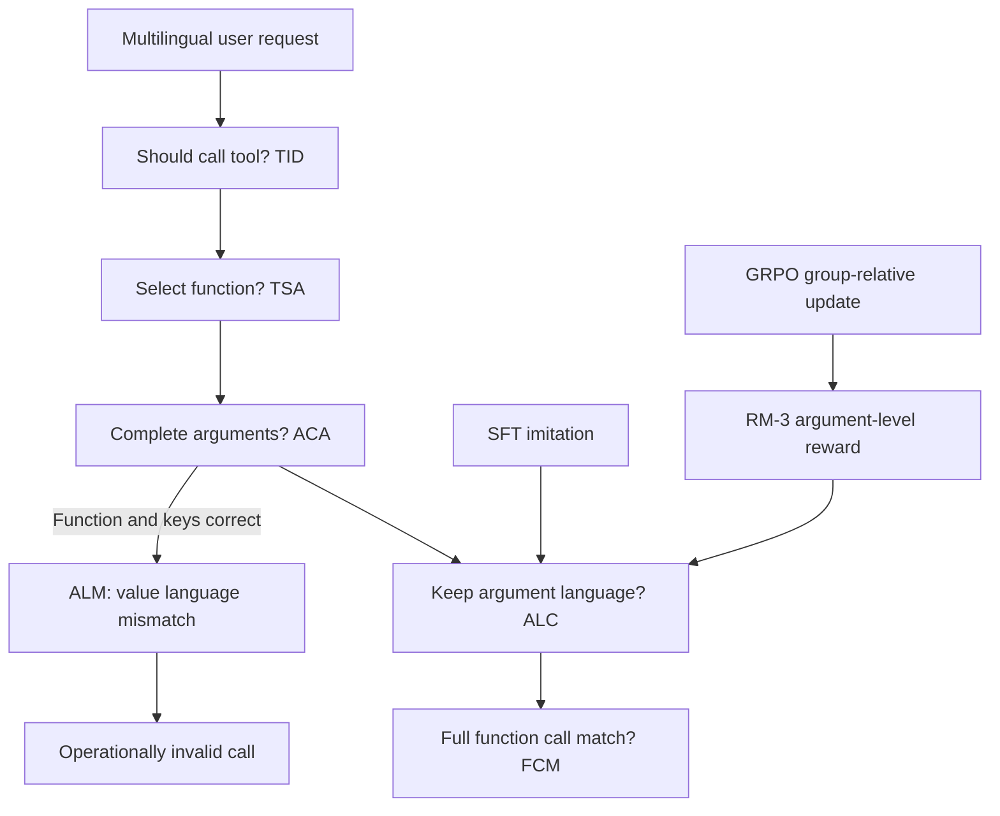

# 当 API 说错语言：多语工具调用里，后训练到底是在补什么

## 元信息与 TL;DR

- **论文**：When the API Speaks the Wrong Language: Revisiting Post-Training for Multilingual Tool Use
- **作者**：Siddharth Chauhan、Thomas Butler、Abhishek Singhania、Pankaj Porwal、Honey Gupta
- **机构**：Amazon
- **版本**：arXiv:2608.11715v1，2026-08-12 06:55:04 UTC 提交
- **方向**：大模型后训练；多语工具调用；SFT、PPO、GRPO 与结构化奖励
- **原文**：https://arxiv.org/abs/2608.11715
- **本轮取舍**：不本地化图片。Figure 1/2 是概念流程，关键证据集中在公式、层级指标和 Table 2-21；本文用表格、公式和伪代码重构证据链。

### TL;DR

- 这篇论文研究一个很工程化的失败模式：模型选对了 API、补齐了参数名，却把来自用户的参数值翻译成了错误语言；作者把它定义为 **Argument Language Mismatch，ALM**。
- ALM 不是普通语义错误。比如西语用户要订“mañana”的航班，模型调用 `book_flight` 是对的，但把日期写成 `tomorrow`，下游系统可能把它当成不合规参数。
- 作者把 Berkeley Function Calling 扩展为多语基准，筛出 **832 个**与 ALM 相关的 turn，占完整数据集 **16.35%**；训练只用西语，再测西语和未见语言。
- 实验模型是 Qwen2.5-7B/14B/32B，主实验默认 14B；方法比较包括 Base、SFT、PPO、GRPO、SFT+PPO、SFT+GRPO。
- 关键结论不是“RL 全面胜出”，而是：**强 SFT 已经能解决大量 ALM；GRPO 的收益更像稳健性、泛化和多目标权衡上的增量修正**。
- 在 epoch-fixed 的 Split-2 泛化设置里，Base 的 ALC/FCM 是 **45.94/22.16**，SFT 到 **54.34/26.75**，GRPO 到 **69.73/42.70**，SFT+GRPO 到 **72.70/45.59**。
- 但在 Split-1 的 best-checkpoint 比较里，SFT 达到 **79.1 ALC / 67.4 FCM**，FCM 反而超过 GRPO 的 **55.3** 和 SFT+GRPO 的 **61.3**，说明“训练预算固定”与“验证集选点”会改变结论。
- 奖励消融支持细粒度 credit assignment：RM-1 稀疏奖励是 **61.3/43.3**，RM-2 层级奖励是 **72.2/51.0**，RM-3 参数因子化奖励是 **74.0/55.3**。
- 跨语言迁移没有呈现单边胜利：SFT 平均 ALC **57.88**，GRPO **57.72**，但 SFT 在 Dutch 出现负迁移，GRPO 三种未见语言都较 Base 提升。
- 局限同样清楚：数据是翻译扩展基准，不是自然多语生产流量；任务主要考参数语言一致性，不代表 RL 在深推理、长程工具链或真实 API 副作用里也只是增量收益。

## 1. 研究问题：为什么“选对工具”仍然会失败

### 1.1 论文要切开的不是 API 选择，而是参数语言落地

- 传统工具调用评测常问三个问题：
  - 模型是否知道要不要调用工具。
  - 模型是否选对函数。
  - 模型是否补齐参数结构。
- 这篇论文补上第四个问题：
  - 参数值如果来自用户自然语言，它是否仍保持用户语言，或遵循 API 显式指定的语言。

作者的问题意识很窄，但很有价值：

- 在英文工具调用里，参数语言常被隐藏，因为用户、函数文档、测试标签大多是英文。
- 在多语场景里，同一个语义值会有两种可执行后果：
  - **语义正确但操作无效**：`"gluten-free bread"` 与用户西语 `"pan sin gluten"` 语义接近，但系统要求保留用户输入语言。
  - **结构正确但业务失败**：API 名、参数名都对，最终 exact match 或执行仍失败。
- 因此，ALM 是“结构化生成的局部语言约束”问题，不是笼统的多语理解问题。

### 1.2 这让后训练比较更干净

论文没有把 RL 设成天然更高级的方案，而是问：

- 如果训练样本已经展示了“参数值跟随用户语言”这个规律，SFT 是否足够。
- 如果 SFT 足够，RL 的额外价值到底在哪：
  - unseen API 的泛化。
  - 参数级错误定位。
  - 与一般推理能力的权衡。
  - 对提示约束无法完全覆盖的残留错误做修正。

这个问题设置对后训练讨论很重要：

- 它避免把所有提升都归因于 PPO/GRPO。
- 它要求把数据构造、checkpoint 选择、奖励颗粒度和优化器稳定性拆开看。
- 它把“模型会不会调用 API”与“模型是否按系统语言契约生成参数值”分开。

## 2. 形式化：ALM 是参数值上的语言约束违例

### 2.1 多语 API 调用的输出结构

每个样本由用户请求和可用 API 规范组成：

$$
X=(u,\mathcal{A})
$$

- $u$：自然语言用户请求。
- $\mathcal{A}$：当前可调用 API 集合。
- $\ell\in\mathcal{L}$：用户请求语言。

模型要生成一组 API 调用：

$$
Y=\{(f_1,\mathbf{a}_1),(f_2,\mathbf{a}_2),\ldots,(f_m,\mathbf{a}_m)\}
$$

- $f_i\in\mathcal{A}$：第 $i$ 个函数。
- $\mathbf{a}_i=\{a_{i,1},\ldots,a_{i,K_i}\}$：函数参数集合。
- $a_{i,k}$ 的值记为 $v_{i,k}$，可能是枚举、实体、日期、自由文本或命令字符串。

如果参数值来自用户输入，且 API 没有要求另一种语言，那么正确输出应满足：

$$
\mathrm{lang}(v_{i,k})=\mathrm{lang}(u)
$$

### 2.2 ALM 的定义

给定模型输出 $Y$ 和标准答案 $Y^\star$，如果函数和参数结构正确，但某个参数值语言与标准答案不一致，则出现 ALM：

$$
\mathrm{lang}(v_{i,k})\neq\mathrm{lang}(v^\star_{i,k})
$$

这个定义的重点在“局部”：

- 失败不一定发生在整句。
- 失败不一定发生在 API 名。
- 失败只可能落在需要语言一致性的参数值上。
- 因此，一个 AST-level 或 function-call exact match 指标会把它混进普通失败，无法说明模型真正错在哪里。

### 2.3 层级指标：把工具调用拆成五个门

论文使用严格层级指标：

| 缩写 | 指标 | 判断对象 | 失败含义 |
|---|---|---|---|
| TID | Tool Invocation Detection | 是否应该调用工具 | 意图层失败 |
| TSA | Tool Selection Accuracy | 是否选对 API 函数 | 工具选择失败 |
| ACA | Argument Completion Accuracy | 是否补齐参数名 | 结构补全失败 |
| ALC | Argument Language Consistency | 参数值语言是否一致 | ALM 失败 |
| FCM | Function Call Match | 完整函数调用是否匹配 | 端到端失败 |

指标满足：

$$
\mathrm{FCM}\leq\mathrm{ALC}\leq\mathrm{ACA}\leq\mathrm{TSA}\leq\mathrm{TID}
$$

这条不等式是全文的评测骨架：

- 如果 TID/TSA/ACA 已经很高，而 ALC/FCM 很低，说明模型不是“不懂工具”，而是“参数语言落地不稳”。
- 如果 ALC 提升但 FCM 不提升，可能只是语言看起来一致，语义或格式仍有问题。
- 如果 FCM 提升，同时 MGSM 下降，则后训练可能过拟合 API 任务，损伤一般推理。

## 3. 数据构造：为什么选 Berkeley Function Calling

### 3.1 BFC 的作用不是规模最大，而是结构复杂

作者比较了多语对话数据和函数调用数据：

- MULTI3WOZ、BiToD 等多语任务型对话数据有语言覆盖，但工具结构更像 slot filling。
- ToolBench、API-Bank、APIGen、Glaive FC v2 等函数调用数据有较丰富 schema，但多为英文或合成。
- Berkeley Function Calling 的优势是：
  - 有人工标注。
  - 有多轮交互。
  - 每 turn 有多个候选 API。
  - 有较高比例自由文本参数。
  - 能暴露“工具选择对、参数语言错”的失败。

### 3.2 多语扩展不是简单全量翻译

论文将 BFC 扩展到 Spanish、French、Italian、Dutch 等语言。关键不是把所有字符串都翻译，而是按 API 规范判断：

- 用户自然语言请求要翻译。
- 用户提供的自然语言参数值通常要翻译或保留为目标语言。
- 标识符、专名、API 强制格式、代码式参数不能随意翻译。
- 这样才能避免把“翻译错误”误当成“模型调用错误”。

### 3.3 两个 split 的区别

作者筛选出 **832 个**与 ALM 相关的 turn，占完整数据集 **16.35%**。筛选条件包括：

- 至少一个参数值需要非英语表达。
- 或 base model 已经表现出 ALM，例如应该输出西语却输出英语。

然后构造两个 split：

| Split | 目标 | API overlap | 解释 |
|---|---:|---:|---|
| Split-1 Learnability | 学会已见或近似 API 的语言一致性 | 17% | 更接近“训练分布内学习” |
| Split-2 Generalization | 迁移到未见 API 和参数结构 | 6% | 更接近“抽象规则泛化” |

训练只使用 Spanish，再评估 Spanish 以及 Italian、Dutch、French 等未见语言。这个设计把两个问题分开：

- 模型是否记住西语表面形式。
- 模型是否学到“参数语言跟随用户 locale”的抽象规则。

## 4. 后训练方法：SFT、PPO、GRPO 与三种奖励

### 4.1 SFT：最大似然学习语言一致调用

SFT 的目标是模仿标准输出：

$$
\mathcal{L}_{\mathrm{SFT}}
=-\mathbb{E}_{(X,Y^\star)}
\sum_{t\in Y^\star}\log \pi_\theta(y_t\mid X,y_{<t})
$$

这一路线的隐含假设是：

- ALM 主要是表层对齐问题。
- 模型已经会识别意图、选择工具和补参数。
- 只要监督样本展示“参数值不要翻译错”，模型就能学到。

论文后面的结果基本支持这个假设，但只在特定边界内成立：

- 分布内或 API overlap 较高时，SFT 很强。
- 当 unseen API 或多目标权衡出现时，RL 的增量价值更明显。

### 4.2 PPO：单样本策略更新

PPO 从当前策略采样一个输出 $Y$，用 clipped objective 和 KL 约束更新：

$$
\mathcal{L}_{\mathrm{PPO}}(\theta)=
-\mathbb{E}_{(X,Y)}
\left[
\sum_{t\in Y}
\min\left(
r_t(\theta)\hat{A}_t,
\mathrm{clip}(r_t(\theta),1-\epsilon,1+\epsilon)\hat{A}_t
\right)
\right]
\beta \,\mathbb{E}[\mathrm{KL}(\pi_\theta\Vert\pi_{\mathrm{ref}})]
$$

这里：

- $r_t(\theta)$ 是新旧策略 token 概率比。
- $\hat{A}_t$ 是优势估计。
- $\beta$ 控制 KL 惩罚，避免策略漂移太远。

PPO 的风险在本文里很具体：

- ALM 奖励只落在少数参数 token 上。
- 如果 token-level 权重过高，batch-level normalization 可能被局部奖励扰动。
- 论文的 Table 7 显示 PPO 在 $\beta=3$ 时 ALC/FCM 跌到 **50.81/25.85**，明显不稳定。

### 4.3 GRPO：同一 prompt 内多样本相对比较

GRPO 对每个输入采样 $K$ 个候选：

$$
\{Y^{(j)}\}_{j=1}^{K}
$$

优势按组内奖励标准化：

$$
\hat{A}^{(j)}=\frac{R^{(j)}-\mu_R}{\sigma_R+\delta}
$$

直观解释：

- 同一个 prompt 下比较多个参数实现方式。
- 奖励高的输出会被强化，奖励低的输出会被压低。
- 因为比较对象来自同一输入，语言一致性这种局部差异更容易被看见。

论文附录给出的 GRPO 关键配置包括：

- 每个 prompt 的 group size 为 **8**。
- temperature 为 **0.6**。
- top-p 为 **0.95**。
- max tokens 为 **512**。
- 对 frozen reference model 使用 KL penalty。

### 4.4 三种奖励模型：从响应级到参数级

奖励设计是全文方法的核心。三种奖励逐步变细：

| 奖励 | 粒度 | 反馈方式 | 主要问题 |
|---|---|---|---|
| RM-1 | 响应级 | 完全正确、语言错、结构错三类 | 太稀疏 |
| RM-2 | 层级级 | TID/TSA/ACA/ALC/FCM 分段给分 | 仍无法区分不同参数 |
| RM-3 | 参数级 | 对每个参数值给语言分 | credit assignment 最清楚 |

RM-1 的简化形式：

$$
R_{\mathrm{RM1}}(Y)=
\begin{cases}
+2.0 & \text{if FCM}(Y)=1 \\
0.0 & \text{if TID=TSA=ACA=1 and ALC}=0 \\
-1.0 & \text{otherwise}
\end{cases}
$$

RM-2 引入连续 ALC 分数：

$$
\mathrm{ALC}_{\mathrm{cont}}(Y)=\frac{1}{K\cdot I}\sum_{i,k}s_{i,k}
$$

- $s_{i,k}=2.0$：语言正确。
- $s_{i,k}=1.5$：部分匹配。
- $s_{i,k}=1.0$：语言错。
- 二值 ALC 用阈值 $1.8$，也就是最高分的 90%。

RM-3 把奖励落到参数值：

$$
\mathrm{ALC}_{\mathrm{cont}}(Y)=\frac{1}{K}\sum_{i,k}S(v_{i,k})
$$

- $S(v_{i,k})=2.5$：精确语言匹配。
- $S(v_{i,k})=2.0$：语言正确但有小变体。
- $S(v_{i,k})=1.0$：语言不匹配。

RM-3 的意义不是“公式更复杂”，而是：

- 如果只错一个自由文本参数，不必把整条输出都打成同类失败。
- 如果命令字符串、实体、自由文本的语言约束不同，奖励能分别反映。
- 对 GRPO 来说，同一 prompt 的多个候选输出常只差在参数值，参数级奖励更容易产生有用的相对优势。

## 5. 实验主线：SFT 很强，RL 更像增量稳健器

### 5.1 主实验设置

论文比较两类评估协议：

- **epoch-fixed**：所有方法训练相似预算，直接比较同预算结果。
- **best-checkpoint**：按验证集 FCM 选择 checkpoint，避免把某个方法早停或过训误判为本质差异。

默认主模型是 **Qwen2.5-14B-Instruct**，并额外报告 7B、32B 缩放结果。

### 5.2 Epoch-fixed 结果：GRPO 在泛化 split 上明显更强

| 方法 | Split-1 ALC | Split-1 FCM | Split-2 ALC | Split-2 FCM |
|---|---:|---:|---:|---:|
| Base | 52.34 | 32.34 | 45.94 | 22.16 |
| SFT | 63.82 | 40.42 | 54.34 | 26.75 |
| GRPO | 74.47 | 51.49 | 69.73 | 42.70 |
| SFT+GRPO | 75.32 | 54.04 | 72.70 | 45.59 |
| PPO | 71.91 | 48.36 | 61.90 | 37.84 |
| SFT+PPO | 73.61 | 49.78 | 68.11 | 41.62 |

这张表支持三点：

- Base 在 TID/TSA/ACA 上并不差，ALC/FCM 才是主要短板。
- SFT 已有明确收益，Split-1 的 ALC 从 **52.34** 到 **63.82**。
- GRPO 在低 overlap 的 Split-2 上更显著，FCM 从 Base 的 **22.16** 到 **42.70**，SFT+GRPO 到 **45.59**。

但这还不能推出“GRPO 总是优于 SFT”，因为训练预算固定不等于每种方法都处在最佳点。

### 5.3 Best-checkpoint 结果：SFT 的上限被低估了

| 方法 | Epoch-fixed ALC | Epoch-fixed FCM | Best ALC | Best FCM |
|---|---:|---:|---:|---:|
| SFT | 63.8 | 40.4 | 79.1 | 67.4 |
| GRPO | 74.5 | 51.5 | 74.0 | 55.3 |
| SFT+GRPO | 75.3 | 54.0 | 79.3 | 61.3 |

这张表是论文最值得带走的证据：

- 如果只看 epoch-fixed，读者会以为 RL 大幅领先。
- 如果按验证 FCM 选点，SFT 的 FCM 达 **67.4**，超过 GRPO 和 SFT+GRPO。
- 这说明 ALM 在 Split-1 里很可能是“可监督学习的局部映射”，不是必须靠探索才能发现的策略。

研究者视角下，这个结论对后训练评测很关键：

- 对 RL 方法的评价必须配强 SFT baseline。
- 必须报告 checkpoint selection，否则会把训练动态误读为算法优势。
- 结构化任务上，数据质量与目标函数选择可能比“是否 RL”更决定结果。

### 5.4 MGSM：任务提升不能靠牺牲一般推理

| 方法 | EN | ES | FR | JP | BN | AVG |
|---|---:|---:|---:|---:|---:|---:|
| Base | 70.80 | 75.20 | 77.60 | 62.00 | 50.40 | 67.20 |
| GRPO | 70.40 | 74.00 | 76.00 | 64.40 | 49.20 | 66.80 |
| SFT+GRPO | 65.60 | 74.40 | 76.40 | 60.00 | 50.80 | 65.44 |
| SFT | 62.20 | 76.80 | 75.60 | 57.20 | 51.60 | 64.68 |

作者的解释很克制：

- SFT 的 API 指标很强，但 English MGSM 从 **70.80** 降到 **62.20**，下降 **8.6** 点。
- GRPO 的 English 基本保持，**70.40** 接近 Base。
- 多语平均差异没有 English 那么夸张，因此不能说 SFT 全面破坏推理；更准确说法是：在这个 checkpoint 上，SFT 的英语推理保真度有明显代价。

这也是 RL 的一个合理位置：

- 它不一定让目标任务最高。
- 它可能让目标任务、泛化和一般能力之间更平衡。
- 对生产系统而言，这种 multi-objective trade-off 可能比单项 FCM 更重要。

## 6. 消融：奖励颗粒度比“RL 这个标签”更重要

### 6.1 RM-1 到 RM-3 的单调提升

| 奖励模型 | ALC | FCM |
|---|---:|---:|
| RM-1 Sparse | 61.3 | 43.3 |
| RM-2 Stepwise | 72.2 | 51.0 |
| RM-3 Argument-Factorized | 74.0 | 55.3 |

这里的机制解释是：

- RM-1 只告诉模型整条输出是否近似成功，无法定位错的是哪个参数。
- RM-2 把工具调用流程拆成层级，能区分工具选择、参数补全和语言一致性。
- RM-3 进一步把语言奖励落到每个参数值，解决“一个参数错导致整条输出同罚”的 credit assignment 问题。

### 6.2 PPO vs GRPO：同样奖励下，优化器稳定性不同

| 算法 | ALC | FCM |
|---|---:|---:|
| PPO | 72.6 | 58.4 |
| GRPO | 81.2 | 66.9 |

这张表说明：

- 在 RM-3 这种细粒度奖励下，GRPO 比 PPO 更适配。
- 原因不只是“GRPO 更新更先进”，而是它的组内比较正好匹配 ALM 的候选差异。
- 同一 prompt 下，候选输出常常函数相同、参数名相同，只是参数语言不同；组内 normalization 能把这个局部差异转成优势信号。

### 6.3 Token-level reward weighting：GRPO 稳，PPO 容易崩

| 方法 | ALC | FCM |
|---|---:|---:|
| GRPO, β=1 | 74.04 | 55.32 |
| GRPO, β=3 | 77.74 | 55.89 |
| PPO, β=1 | 71.08 | 45.40 |
| PPO, β=3 | 50.81 | 25.85 |

论文的含义是：

- 增大参数 token 权重能让模型更重视语言一致性。
- 对 GRPO，这带来 ALC 提升且 FCM 基本不掉。
- 对 PPO，高权重和 batch-level advantage normalization 交互后会不稳定。

换句话说：

- 不是所有 RL 都能吃下细粒度奖励。
- 奖励结构和优化器归一化方式必须一起设计。
- “奖励越精细越好”也有条件：优化器要能稳定利用它。

## 7. 泛化、缩放与失败类型

### 7.1 跨语言迁移：SFT 平均略高，GRPO 更均衡

| 方法 | IT | NL | FR | Avg |
|---|---:|---:|---:|---:|
| Base | 39.23 | 55.16 | 42.48 | 45.62 |
| SFT | 57.01 | 53.27 | 63.37 | 57.88 |
| GRPO | 56.05 | 57.23 | 59.88 | 57.72 |

表面看：

- SFT 平均 **57.88**，GRPO 平均 **57.72**，几乎持平。
- SFT 在 Italian 和 French 更高。
- GRPO 在 Dutch 更高，并且三种未见语言都较 Base 提升。

更细的解释：

- SFT 能学到大量可模仿模式，但可能对某些语言产生负迁移，Dutch 从 **55.16** 到 **53.27**。
- GRPO 的收益更像规则级稳健性：训练只用 Spanish，但它仍能在 Italian、Dutch、French 上提升。
- 这支持作者关于“RL 学到 locale matching 规则，而不只是背西语词形”的判断，但证据不是压倒性的。

### 7.2 模型缩放：小模型 + GRPO 能追上大模型 + SFT

| 模型 | Base ALC | SFT ALC | GRPO ALC |
|---|---:|---:|---:|
| 7B | 41.51 | 65.14 | 68.10 |
| 14B | 45.94 | 74.47 | 71.08 |
| 32B | 60.45 | 67.59 | 73.78 |

可读出的结论：

- Base 随规模增大有明显提升，32B 是 **60.45**。
- 7B 经过 GRPO 后达到 **68.10**，超过 32B 的 SFT **67.59**。
- 32B 的 GRPO 最高，**73.78**。

但这里要谨慎：

- 表中只报告 Split-2 ALC，不是完整 FCM。
- 缩放结论没有覆盖训练成本、数据量和多 seed 方差。
- 它更适合说明“后训练可以补小模型的局部结构缺陷”，不能直接推出“小模型 RL 总比大模型 SFT 划算”。

### 7.3 参数类型：自由文本和命令字符串最受益

| 参数类型 | Base ALC | GRPO ALC |
|---|---:|---:|
| Categorical | 92.3 | 94.1 |
| Named Entities | 61.7 | 79.8 |
| Free-form Text | 48.5 | 81.2 |
| Command Strings | 44.3 | 83.6 |

这张表解释了为什么 ALM 不是普通 schema 错：

- Categorical 本来就接近稳定，因为可选项有限。
- Named entities 有语言、拼写、原名保留等混合约束。
- Free-form text 和 command strings 的语言承载最强，因此 base model 最容易把它们英语化。
- GRPO 的大幅提升主要来自这些开放参数，而不是已经很容易的枚举项。

## 8. 提示消融：靠 prompt 能缓解，但远不够

### 8.1 ALM-aware prompt 的作用

作者在推理模板里加入显式约束，要求：

- 用户提供的参数值保留用户语言。
- 不要翻译用户提供文本。
- 只有 API 规范明确要求时才使用英语。

这不改权重，只改推理时提示。

### 8.2 结果对比

| 方法 | ALC | FCM |
|---|---:|---:|
| Base Prompt | 52.34 | 32.34 |
| ALM-Aware Prompt | 59.87 | 36.12 |
| GRPO RM-3 | 74.47 | 51.49 |

绝对提升：

| 方法 | Δ ALC | Δ FCM |
|---|---:|---:|
| ALM-aware prompt vs Base | +7.53 | +3.78 |
| GRPO vs Base | +22.13 | +19.15 |

这个消融很有实际意义：

- 如果系统只需要快速缓解，prompt constraint 有收益。
- 如果需要稳定修复，prompt 不足以替代后训练。
- Prompt 的残留失败说明模型并不总能把自然语言规则转成参数级执行约束。

## 9. 论文的论证路线：claim → mechanism → evidence → boundary

| Claim | Mechanism | Evidence | Boundary |
|---|---|---|---|
| ALM 是独立失败模式 | 层级指标把 TID/TSA/ACA/ALC/FCM 分开 | Base 在结构指标高、ALC/FCM 低 | 只覆盖作者构造的多语 BFC |
| SFT 是强 baseline | 监督样本展示参数语言跟随用户语言 | Split-1 best SFT 达 79.1/67.4 | 对 unseen API 和能力保持不一定最优 |
| RL 的收益是增量而非根本 | GRPO 通过组内比较强化更优参数实现 | Split-2 GRPO/SFT+GRPO 高于 SFT | best-checkpoint 下 SFT 可反超 |
| 奖励颗粒度决定可学性 | RM-3 把分数落到参数值 | RM-1→RM-3 单调提升 | 需要稳定优化器配合 |
| GRPO 比 PPO 更适配局部奖励 | 同一 prompt 多候选、组内归一化 | β=3 时 GRPO 稳、PPO 崩 | 只在 RM-3 和该任务设置下验证 |
| Prompt 能缓解但不够 | 显式要求保留用户语言 | Prompt ALC +7.53，GRPO +22.13 | Prompt 模板可能还可继续优化 |

这条路线的强点：

- 先定义失败模式，再设计指标和奖励。
- 用 SFT 反驳“复杂 RL 必要”的预设。
- 用消融说明 RL 的有效部分来自参数级奖励和优化器匹配。

弱点也明显：

- 真实系统中的 API 约束可能不是“用户语言一致”这么单一。
- 翻译数据会放大或缩小某些语言规律。
- 评测依赖语言判断与 exact/semantic matching，judge 或规则本身可能引入偏差。

## 10. 伪代码：把论文方法写成一个可复现流程

```text
Input:
  D_bfc: English Berkeley Function Calling dataset
  L_eval: {Spanish, Italian, Dutch, French}
  A: API specifications
  base_model: Qwen2.5-{7B,14B,32B}-Instruct

State:
  D_multi: multilingual translated benchmark
  D_alm: ALM-relevant turns
  split_1: learnability split, moderate API overlap
  split_2: generalization split, low API overlap
  reward_model: RM-1 or RM-2 or RM-3
  policy: model policy πθ

Procedure:
  1. Translate user utterances and translatable argument values.
  2. Preserve identifiers, entities, canonical values, and API-forced formats.
  3. Select turns where:
       translated argument values exist
       OR base model exhibits language mismatch.
  4. Train SFT:
       minimize negative log-likelihood of gold structured calls.
  5. Train RL:
       for each prompt X:
         sample candidate calls Y from πθ
         score TID, TSA, ACA, ALC, FCM
         if GRPO:
           sample K=8 candidates
           normalize rewards inside the prompt group
         update with KL to frozen reference model
  6. Evaluate:
       report hierarchical metrics
       report MGSM for reasoning preservation
       report cross-lingual transfer on unseen languages

Output:
  trained policy
  ALC/FCM trade-off
  residual ALM failure contribution
  boundary notes for SFT vs RL choice

Failure boundary:
  If test APIs and languages are mostly in-distribution, SFT may be enough.
  If unseen APIs, open text arguments, or capability preservation matter, GRPO-style RL becomes more useful.
```

## 11. Mermaid：ALM 不是一条错误，而是一段流水线里的断点



## 12. 失败案例细读：语义对不等于可执行

### 12.1 航班例子

用户说：

```text
Reserva un vuelo a París para mañana.
```

三类输出的差异：

| 模型 | destination | date | 评估 |
|---|---|---|---|
| Base | Paris | tomorrow | 语义近似，但参数语言错 |
| SFT | Paris | mañana | 部分修复，但实体仍英语化或去重音 |
| GRPO | París | mañana | 更符合用户语言 |

这里的难点是：

- `Paris` 和 `París` 对人类几乎等价。
- 对严格 API 或本地化系统，它们可能不是同一规范值。
- 因此，ALC 不能只靠语义相似度判断。

### 12.2 食品订单例子

用户说：

```text
Añade pan sin gluten a mi pedido.
```

输出差异：

| 模型 | item 参数 | 失败解释 |
|---|---|---|
| Base | gluten-free bread | 把用户提供短语翻译成英语 |
| SFT | gluten-free bread | 高频场景仍可能保留英语 |
| GRPO | pan sin gluten | 参数值跟随用户语言 |

这个例子解释了为什么 prompt 不一定够：

- 模型知道 `add_item`。
- 模型知道 item 是食品。
- 模型只是没有把“不要翻译用户提供值”当作硬约束。

## 13. 相关工作位置：这篇文章站在哪里

### 13.1 与多语任务型对话的关系

多语任务型对话常关注：

- intent classification。
- slot filling。
- dialogue state tracking。
- cross-lingual transfer。

本文的不同点：

- 它把 slot 视作 API argument。
- 它关注 API schema 下的可执行参数。
- 它强调自由文本、命令字符串、实体等参数类型的语言一致性。

### 13.2 与工具调用 benchmark 的关系

工具调用 benchmark 常关注：

- 函数选择。
- 参数完整性。
- AST 或 exact match。
- 多工具组合。

本文补充：

- 即使 AST 结构接近正确，参数值语言也可能使调用不可执行。
- 标准 exact match 能发现失败，但不能解释失败贡献。
- 层级指标能把 ALM 从普通 invocation error 中分离出来。

### 13.3 与 RLHF/GRPO 的关系

本文没有讨论偏好对齐的开放式回答，而是把 RL 用在结构化输出：

- 奖励来自工具调用过程和参数语言判断。
- GRPO 的组内比较适合“同一 prompt 下参数值语言不同”的候选。
- 这比泛泛说“GRPO 更稳定”更具体，因为稳定性的来源与任务局部结构有关。

## 14. 证据边界与可复现性疑问

### 14.1 数据边界

- 基准来自 BFC 的翻译扩展，不是生产 API 日志。
- 翻译协议会影响 ALM 定义，尤其是专名、地名、格式化日期、品牌名和代码字符串。
- 只用 Spanish 训练，再测若干欧洲语言；对中文、阿语、印地语、代码混写等脚本差异更大的场景不能直接外推。

### 14.2 评测边界

- ALC 依赖语言判定，短字符串、实体、混合语言参数可能很难稳定判分。
- FCM 使用 exact matching 和 semantic similarity 的组合，自由文本参数仍可能有判定模糊。
- MGSM 只测一般数学推理保真度，不能代表所有通用能力。

### 14.3 优化边界

- PPO 在高 token-level weighting 下不稳定，但这不等于所有 PPO 实现都会失败。
- GRPO 的 group size、temperature、KL、reward scale 可能影响很大。
- 文中没有把训练成本、采样成本、wall-clock、显存和多 seed 方差作为主证据。

### 14.4 结论边界

这篇论文支持的结论是：

- 对 ALM 这类局部结构化语言约束，SFT 是必须认真比较的强 baseline。
- GRPO 的价值主要出现在泛化、奖励细粒度利用、能力保持和多目标权衡上。
- Prompt 能缓解 ALM，但远不如训练后策略稳定。

它不支持的结论是：

- RL 对所有工具调用后训练都只是增量。
- SFT 总能替代 RL。
- 多语 API 的主要风险只有参数语言一致性。

## 15. 对后训练研究的延伸问题

### 15.1 什么时候该先做 SFT

如果任务满足这些条件，SFT 应该先被打满：

- 错误是局部、可标注、可模仿的。
- 标准答案清楚展示目标行为。
- 训练分布和测试分布有足够重叠。
- 目标不需要长程探索或执行反馈。

ALM 很符合这些条件：

- 参数值往往直接来自用户输入。
- 错误位置可在 argument value 上定位。
- 修复规则可被监督样本展示。

### 15.2 什么时候 RL 才值得额外付费

RL 更适合这些情况：

- API schema 或参数结构在测试时明显变化。
- 输出空间里有多个语义近似但执行差异大的候选。
- 需要平衡目标任务和一般能力保真度。
- 需要把稀疏执行反馈转成策略更新。
- Prompt 规则能描述目标，但模型不能稳定遵循。

本文里的 GRPO 正是这个位置：

- 不推翻 SFT。
- 不替代数据构造。
- 主要在难 split、细粒度奖励和能力保持上补边界。

### 15.3 对 Agent 工具系统的安全含义

ALM 也可以被看成一种轻量安全问题：

- 工具调用不是只要“意图正确”就安全。
- 参数值必须满足 locale、格式、权限、来源、不可翻译字段等执行契约。
- 如果模型擅自翻译或改写用户提供值，系统可能出现错误交易、错误检索或审计不可追踪。

更一般地说：

- API schema 需要声明哪些字段必须保持原文。
- 评测需要把参数级约束从整体 exact match 中拆出来。
- 后训练奖励应对不同参数类型使用不同 credit assignment。

## 16. 本文结论

这篇论文的价值不在提出一个全新大模型训练算法，而在给后训练讨论降温：

- 它把多语工具调用中的 ALM 定义成可测的结构化失败。
- 它用层级指标说明错误发生在参数语言，而不是工具选择。
- 它证明 SFT 已经是强 baseline，甚至在 best-checkpoint Split-1 上超过 RL 的 FCM。
- 它也证明 RL 不是无用：GRPO 在泛化、奖励利用和能力保持上更稳。
- 它提醒研究者，评价后训练时必须同时报告强 SFT、checkpoint selection、奖励消融、优化器稳定性和能力保真度。

一句话总结：

> 对“API 说错语言”这种失败，复杂 RL 不是第一答案；先把监督数据、指标和参数级契约做清楚，再用 GRPO 修补 SFT 在泛化和多目标权衡上的边界。

