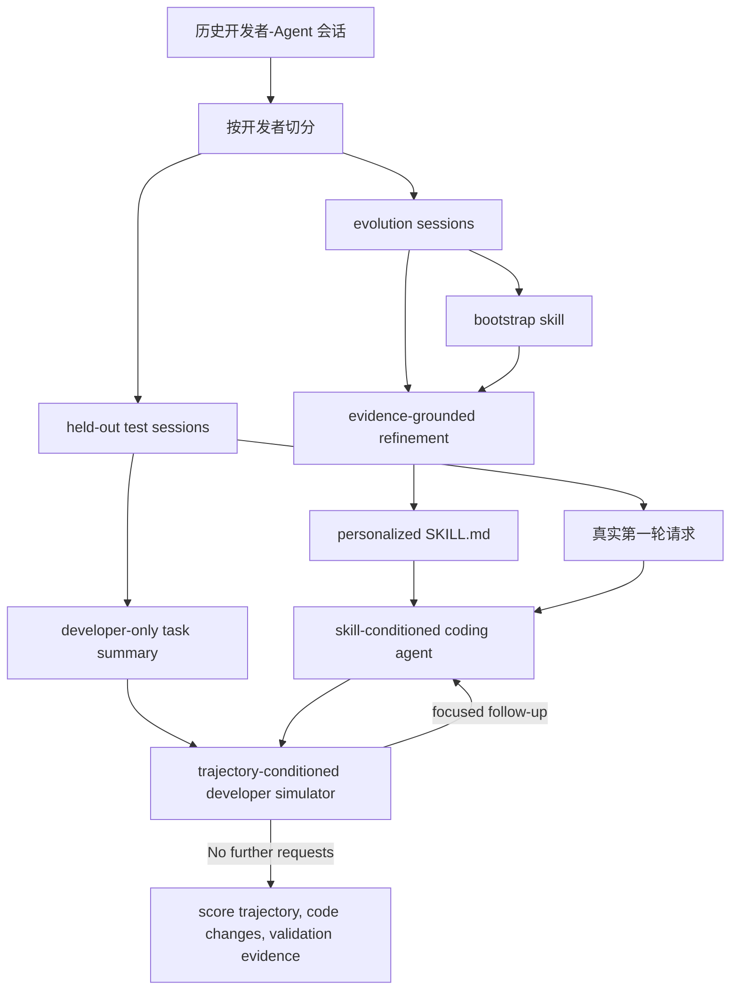

# Do Personalized Skills Help Coding Agents?：个性化技能真的帮编码 Agent 吗

| 项目 | 内容 |
|---|---|
| 论文 | Do Personalized Skills Help Coding Agents? An Empirical Study of Developer Interaction Histories |
| 作者 | Shuyan Huang, Kai Du, Andrew Lan |
| 版本 | arXiv:2608.10319v1，2026-08-10 23:41:02 UTC |
| 方向 | 大模型 Agent / 编码 Agent / Agent Skills / 跨会话偏好学习 |
| 原文 | https://arxiv.org/abs/2608.10319 |
| HTML | https://arxiv.org/html/2608.10319 |

### TL;DR

- 这篇论文问的是一个很具体、也很容易被经验直觉误判的问题：把某个开发者过去和编码 Agent 的互动记录蒸馏成 `SKILL.md`，能不能让同一个开发者未来任务里的 Agent 更少被纠正、完成得更好。
- 作者没有训练模型参数，而是把“技能”定义成可读的自然语言指导：先从历史会话生成 bootstrap skill，再用原始轨迹做 evidence-grounded refinement，保留有证据支撑、跨任务更可能复用的规则。
- 实验数据来自 SWE-chat 的真实开发者-编码 Agent 会话。严格过滤后，只剩 `206` 个可复现、可执行、含实质代码改动的会话，覆盖 `13` 个开发者；其中 `164` 个用于生成技能，`42` 个 held-out 会话用于重放评测。
- 评测不是静态 benchmark。作者用 trajectory-conditioned developer simulator 重放 held-out 会话：编码 Agent 只看第一轮真实请求，模拟开发者根据完整任务摘要和当前轨迹决定是否继续提出未满足要求。
- 主结果反直觉：个性化技能平均分从 `65.02` 提到 `65.99`，只有 `+0.97`，且不显著；随机其他开发者技能也有 `+0.92`。真正表现最好的是跨开发者 pooled generic skill，平均 `68.80`，比 no-skill 高 `+3.78`，胜率 `50.95%`。
- 个性化并非完全无效。若 held-out 任务能在同一开发者 evolution history 中找到至少 `6` 个相关历史会话，个性化技能相对 no-skill 提升 `+10.17`，相对随机他人技能提升 `+8.92`，甚至超过 generic skill `+5.67`。
- 技能带来的不是“少打扰用户”。所有 skill 条件都提高了 follow-up rate、tool calls、token、执行时间、文件变更和 patch churn；它们更像把 Agent 推向更系统的执行和验证，而不是更省交互。
- 关键局限也很硬：样本过滤后只有 `206` 会话、`13` 个开发者、`42` 个 held-out 任务；评分、用户模拟和相关历史判定都依赖 LLM-as-a-judge；generic skill 的训练池包含目标开发者 evolution sessions，因此它不是严格的 leave-user-out 泛化。

### 研究问题：为什么“个性化技能”不应先被当成理所当然

- 编码 Agent 的跨会话学习通常有三种直觉：
  - 用户经常重复偏好，例如“少重构”“先跑测试”“不要改无关文件”；
  - Agent 可以把这些偏好写进记忆或技能，下次自动遵守；
  - 如果技能来自同一个用户，它理应比通用技能更有价值。
- 论文真正挑战的是第三点：
  - 开发者历史里混有稳定偏好、一次性任务约束、特定仓库细节和偶然纠正；
  - 如果历史很短，Agent 看到的“偏好”可能只是某次任务的局部事实；
  - 把这种局部事实写进 `SKILL.md`，未来任务不但未必有帮助，还可能把 Agent 推向错误假设。
- 因此作者把问题写成一个可检验命题：
  - 输入：同一开发者过去多次 developer-agent coding sessions；
  - 机制：从轨迹蒸馏 task-independent personalized skill；
  - 输出：在 held-out 未来任务中，编码 Agent 的完成质量和用户 pushback 是否改善；
  - 对照：no skill、同用户 personalized skill、随机其他用户 skill、跨用户 generic skill。

### 论文主张与论证路线

| Claim | Mechanism | Evidence | Boundary |
|---|---|---|---|
| 开发者偏好可以从历史互动中被结构化为技能 | `S_u^0 = B(D_u^{evolve})` 先 bootstrap，再 `S_u^* = R(S_u^0, D_u^{evolve})` refinement | Figure 2 给出 pipeline；正文要求 refinement 至少由不同会话中的两个独立用户 turns 支撑 | “能生成技能”不等于“技能能泛化”；生成过程仍由 LLM 执行 |
| 个性化技能总体收益有限 | skill 作为 prompt 前置条件，held-out replay 比较四种条件 | Table 1：personalized `65.99±2.14`，no skill `65.02±3.24`，`p=.399` | 样本很小；统计功效有限；不同开发者差异很大 |
| 泛化更稳的是跨用户 procedural guidance | generic skill 从所有开发者 evolution sessions pooled 生成 | Table 1：generic `68.80±2.26`，比 no skill `+3.78`，win `50.95%` | generic 包含目标用户 evolution data；不能直接解释为完全跨用户泛化 |
| 个性化需要足够相关历史 | 用 LLM 找 held-out task 对应的相关 evolution sessions，并按数量分桶 | Table 2：`>=6` 相关历史时，personalized 相对 no-skill `+10.17` | 相关性判断由 LLM 做；`N=12` 的高相关桶仍很小 |
| 技能主要增加执行强度而非减少交互 | 比较 turns、follow-ups、tool calls、tokens、测试命令、validation 报告 | Table 3：personalized tool calls `8.47 -> 9.46`，成功 validation `43.1% -> 58.9%` | 成本上升是否值得，取决于真实生产约束；论文没有做人类用户满意度实验 |

### 方法机制：从历史轨迹到 `SKILL.md`

- 作者把一个开发者记为 `u`，其历史会话集合记为：

$$
D_u=\{d_{u,1}, d_{u,2}, ..., d_{u,n_u}\}
$$

- 每个开发者的会话被拆成两部分：
  - `D_u^{evolve}`：用于生成或改进个性化技能；
  - `D_u^{test}`：held-out，用于测试技能是否能泛化到未来任务。
- 技能生成分两步：

$$
S_u^0 = B(D_u^{evolve}), \qquad S_u^* = R(S_u^0, D_u^{evolve})
$$

- 变量解释：
  - `S_u^0`：rule-based bootstrap skill，目标是先覆盖常见偏好维度；
  - `B`：bootstrap constructor，会寻找沟通方式、工作风格、follow-up 处理、验证偏好、commit 行为；
  - `R`：evidence-grounded refiner，用原始会话证据保留、修改、删除或新增规则；
  - `S_u^*`：最终 personalized skill，是一个 task-independent `SKILL.md`。

### Bootstrap 阶段：先生成一个可审查的偏好框架

- Bootstrap 不试图记住某个仓库或某个 bug。
- 它关注“这个开发者怎样工作”：
  - 沟通风格：希望 Agent 解释多少、是否先确认假设；
  - 工作风格：局部修改、最小 diff、避免大重构；
  - follow-up 处理：用户纠正后是否优先响应最新要求；
  - validation 偏好：是否必须跑测试、是否报告失败；
  - commit 行为：是否偏好小提交、是否需要提交信息规范。
- 作者明确排除：
  - repository names；
  - file paths；
  - issue identifiers；
  - environment-specific commands；
  - 单个任务才成立的实现细节。

### Refinement 阶段：不是“写得更像用户”，而是“证据足够才保留”

- Evidence-grounded refinement 的核心不是让 LLM 发挥，而是限制它：
  - 每条候选规则要回到历史会话中找证据；
  - 至少需要来自不同 evolution sessions 的两个独立 user turns；
  - 不允许从一次性反馈扩展成永久规则；
  - 不允许把技能写成未来任务的隐藏需求；
  - 不允许让技能覆盖当前用户请求。
- 这个设计的重要性在于：
  - 它把“个性化记忆”从摘要问题改成证据约束问题；
  - 它承认用户历史里大部分内容并不适合长期保存；
  - 它把 skill 当成低权限指导，而不是凌驾于任务之上的 policy。

### 评测机制：为什么不能直接重放原始会话

- 原始会话不能逐字重放，原因很简单：
  - 注入技能后，Agent 的第一轮行为可能不同；
  - 原开发者后续消息是针对旧轨迹说的；
  - 如果照搬旧 follow-up，就会把 Agent 没犯的错也拿来纠正。
- 作者因此构造 interactive replay：
  - 从 held-out 会话中所有 developer-authored messages 生成 task summary；
  - task summary 只给 developer simulator，不给 coding agent；
  - coding agent 只收到原始第一轮请求和对应技能；
  - 每次 Agent 回复后，simulator 根据当前轨迹判断是否还有未满足需求；
  - simulator 只允许输出 focused follow-up 或 `No further requests`。



### 数据集：严格可复现带来的代价

- 原始基础是 SWE-chat：
  - 包含 `8,866` 个公开 CLI 编码 Agent 会话；
  - 来源是 2026 年 1 月到 6 月的 public GitHub repositories；
  - 这些会话来自真实开发工作流，而不是人工合成 issue。
- 作者为了 replay 可执行，做了严格过滤：
  - 删除交互不完整的会话；
  - 删除仓库状态不可访问或不可恢复的会话；
  - 删除 private dependencies、missing files；
  - 删除没有实质代码修改的会话；
  - 删除 answer-only、read-only、empty-tool、review-only sessions；
  - 只保留至少有 `3` 个有效任务的开发者。
- 过滤结果很小：
  - `206` sessions；
  - `13` developers；
  - `164` evolution sessions；
  - `42` held-out test sessions。

| 任务类型 | 数量 | 占比 |
|---|---:|---:|
| Code review & targeted fixes | 59 | 28.6% |
| Feature implementation | 43 | 20.9% |
| Testing, build & DevOps | 31 | 15.0% |
| UI/UX changes | 27 | 13.1% |
| Documentation & research | 18 | 8.7% |
| Bug fixing | 15 | 7.3% |
| Refactoring & maintenance | 7 | 3.4% |
| Continuation / other | 6 | 2.9% |

### 实验设置：四种 skill 条件

- 作者使用同一套 Codex CLI replay 环境：
  - 每个 held-out task 从同一初始 repository commit 开始；
  - 每次 replay 使用 isolated worktree；
  - 每个条件最多 `6` 轮 developer-agent turns；
  - skill generation、coding execution、developer simulator、task-completion scoring 都使用 Codex with GPT-5.5；
  - 每次 replay 收集 trajectory、code changes、validation evidence；
  - 用 SWE-chat 的 `100` 分 rubric 做 task-completion scoring；
  - 用 `5` 个随机 seeds 重复 within-developer split。
- 四个条件如下：

| 条件 | 名称 | Agent 拿到什么 |
|---|---|---|
| A | No skill | 只有原始第一轮任务请求 |
| B | Personalized skill | 目标开发者自己的 `S_u^*` |
| C | Random developer skill | 随机其他开发者的 skill |
| D | Generic skill | 所有开发者 evolution sessions pooled 后生成的通用 skill |

### 主结果：个性化技能没有显著胜出

| 条件 | Score ↑ | Follow-up Rate ↓ | 相对 no-skill 的 Win/Tie/Loss |
|---|---:|---:|---:|
| A No skill | `65.02 ± 3.24` | `24.76%` | - |
| B Personalized skill | `65.99 ± 2.14` | `30.95%` | `41.43 / 14.76 / 43.81%` |
| C Random developer skill | `65.94 ± 3.66` | `27.62%` | `43.33 / 17.62 / 39.05%` |
| D Generic skill | `68.80 ± 2.26` | `30.00%` | `50.95 / 14.76 / 34.29%` |

- 最关键的比较不是 B 相对 A 有 `+0.97`。
- 真正关键的是：
  - B 的 `p=.399`，没有显著性；
  - C 的 `+0.92` 和 B 几乎一样，`p=.451`；
  - B 的 loss rate `43.81%` 还略高于 win rate `41.43%`；
  - generic skill 的平均分最高，win rate 最高，但 `p=.063` 也没有过常规显著性阈值。
- 因此更稳妥的读法是：
  - skill conditioning 可能有用；
  - “来自同一开发者”这个标签本身没有被主实验强力证明有额外收益；
  - 大量共性 procedural guidance 比稀疏个人偏好更容易转化为行为改进。

### 相关历史的作用：个性化不是失败，而是数据稀疏

作者进一步问：如果同一开发者历史中，真的有很多和 held-out 任务相似的例子，个性化会不会有效？

| 相关 evolution sessions | N | Personalized - No skill | Personalized - Random skill | Personalized - Generic |
|---:|---:|---:|---:|---:|
| 0 | 3 | `-6.33` | `+15.00` | `-8.00` |
| 1-2 | 16 | `0.00` | `-1.38` | `-3.81` |
| 3-5 | 11 | `+0.10` | `+0.20` | `-7.20` |
| `>=6` | 12 | `+10.17` | `+8.92` | `+5.67` |

- 这张表是全文最重要的机制证据。
- 它说明：
  - 当历史没有相关样本时，所谓个性化可能只是噪声；
  - 当只有 `1-5` 个相关样本时，个性化几乎不比 baseline 稳；
  - 当有 `>=6` 个相关历史会话时，个性化开始明显胜出；
  - 这更像“相关经验数量”问题，而不是“用户身份”问题。
- 对 Agent memory 来说，这个结论很尖锐：
  - 记住用户身份不等于理解用户偏好；
  - 把每条反馈写进长期记忆会放大稀疏样本噪声；
  - 更合理的单元可能是“任务相关偏好证据簇”，而不是“某用户的所有历史摘要”。

### Developer simulator：评测本身是否可信

- 作者用真实 developer follow-ups 和 simulator follow-ups 做语义一致性检查。
- 在 `210` 个 replay instances 中，`171` 个同时包含真实 follow-up 和模拟 follow-up。
- LLM-as-a-judge 把两者分成三类：
  - exact match：模拟 follow-up 覆盖真实 follow-up 的全部要求；
  - partial match：至少共享一个要求，但有遗漏或新增；
  - mismatch：没有实质重叠。
- 结果：

| 匹配级别 | 比例 |
|---|---:|
| Exact match | `59.65%` |
| Partial match | `29.82%` |
| Mismatch | `10.53%` |
| Exact + partial | `89.47%` |

- 这支持了 replay 评测的可用性，但不能完全消除偏差：
  - simulator 仍可能偏向某类表达清晰的需求；
  - judge 也由 LLM 完成；
  - exact/partial 只说明语义一致，不说明人类用户真实满意。

### 技能如何改变 Agent 行为：更努力，而不是更省事

| 指标 | A No skill | B Personalized | C Random | D Generic |
|---|---:|---:|---:|---:|
| Agent turns | 1.29 | 1.37 | 1.33 | 1.35 |
| Unresolved follow-ups | 0.29 | 0.37 | 0.33 | 0.35 |
| Command/tool calls | 8.47 | 9.46 | 8.69 | 8.98 |
| Agent tokens | 442,096 | 597,120 | 521,219 | 643,578 |
| Execution time seconds | 91.76 | 106.16 | 99.62 | 104.57 |
| Files changed | 1.65 | 2.22 | 1.79 | 1.99 |
| Patch churn | 29.08 | 37.11 | 32.32 | 37.98 |
| Test command groups | 0.56 | 0.97 | 0.86 | 0.93 |
| Validation command groups | 1.77 | 2.23 | 2.06 | 2.16 |
| Runs reporting successful validation | 43.1% | 58.9% | 54.1% | 57.4% |

- 这个结果容易被忽略，但对研究很重要。
- 技能没有让 Agent 更少被追问：
  - no-skill follow-up rate `24.76%`；
  - personalized `30.95%`；
  - generic `30.00%`。
- 技能让 Agent 做得更多：
  - personalized token 比 no-skill 多约 `35%`；
  - personalized tool calls 多约 `12%`；
  - personalized files changed 从 `1.65` 到 `2.22`；
  - personalized successful validation 从 `43.1%` 到 `58.9%`。
- 因此论文的结论不能被简化为“写技能会提升效率”。
- 更准确的表述是：
  - 技能可能把 Agent 推向更完整、更谨慎、更验证导向的执行；
  - 这种行为有时提高最终分数；
  - 但它也带来更多计算、更多修改和更多交互。

### Skill 内容分析：generic skill 为什么更稳

| Skill property | Personalized | Generic |
|---|---:|---:|
| Rules per skill | 14.15 | 25.00 |
| Words per rule | 16.70 | 15.32 |
| Rule words per skill | 236.38 | 383.00 |
| Communication rules | 23.4% | 20.0% |
| Workflow rules | 30.4% | 28.0% |
| Validation rules | 10.3% | 12.0% |
| Follow-up rules | 28.3% | 24.0% |
| Commit rules | 7.6% | 16.0% |
| Similarity to generic skill | 0.517 | 1.000 |
| Similarity between developers | 0.443 | - |
| Unique developer-specific rules | 64.7% | - |

- Generic skill 的优势可能来自两个方面：
  - 规则更多，覆盖面更大；
  - pooled sessions 更容易学到普遍有用的工程程序，例如验证、commit、follow-up、保持范围。
- Personalized skill 的规则有不少是独特的：
  - `64.7%` 规则只在单个开发者 skill 中出现；
  - 但“独特”不等于“未来有用”；
  - 如果 held-out task 没触发这些规则，它们就只是额外 prompt 负担。
- 这解释了为什么 random developer skill 也能接近 personalized：
  - 许多 developer-specific rules 其实是共性工程规范的不同说法；
  - 随机他人的 skill 也可能包含“先验证”“少改无关文件”“回应未满足要求”这类通用规则；
  - 稀疏个人历史不足以让本人的 skill 明显区分于他人的 skill。

### 消融与失败：refinement 帮得很少

| Skill variant | Score ↑ | Follow-up Rate ↓ | Win/Tie/Loss |
|---|---:|---:|---:|
| Rule-based bootstrap | `65.71 ± 1.65` | `30.95%` | - |
| Bootstrap + LLM refinement | `65.99 ± 2.14` | `30.95%` | `42.86 / 13.33 / 43.81%` |

- LLM refinement 的平均增益只有 `+0.28`。
- 差异不显著，`p=.792`。
- 这有两个含义：
  - evidence-grounded refinement 的原则很对，但当前数据量不足以让它稳定获益；
  - 只靠一次 LLM 后处理，很难从短历史里提炼出可靠长期规则。
- 失败模式可以概括为三类：
  - 数据稀疏：开发者有效历史太少；
  - 任务不相似：过去偏好不一定触发未来任务；
  - prompt 注入式集成太粗：skill 只是前置文本，Agent 何时真正使用它并不可控。

### 算法流程：把论文机制写成可检查的伪代码

```text
Input:
  U: 开发者集合
  D_u: 开发者 u 的历史 coding-agent sessions
  K: 每个开发者的 held-out replay 条件集合 {A, B, C, D}

State:
  D_u^evolve: 用于生成技能的历史会话
  D_u^test: held-out 未来任务
  S_u^0: bootstrap personalized skill
  S_u^*: evidence-refined personalized skill
  S_generic: pooled generic skill

Procedure:
  for each developer u in U:
    split D_u into D_u^evolve and D_u^test
    S_u^0 <- bootstrap(D_u^evolve)
    S_u^* <- refine_with_evidence(S_u^0, D_u^evolve)

  S_generic <- bootstrap_and_refine(pool over all D_u^evolve)

  for each held-out task d in D_u^test:
    summary <- summarize_developer_messages(d)
    first_turn <- original_first_developer_request(d)

    for condition k in {no_skill, own_skill, random_other_skill, generic_skill}:
      skill <- select_skill(k)
      trajectory <- run_coding_agent(first_turn, skill)
      while turns <= 6:
        followup <- developer_simulator(summary, trajectory)
        if followup == "No further requests":
          break
        trajectory <- continue_agent(trajectory, followup)

      collect code_changes, validation_evidence, tool_calls, tokens
      score <- task_completion_judge(trajectory, code_changes, evidence)

Output:
  condition-level scores
  follow-up rates
  win/tie/loss against no-skill
  behavior metrics and developer-level variation

Failure boundaries:
  if D_u^evolve is sparse or unrelated:
    personalized skill may become noisy
  if simulator misreads task summary:
    replay may not match human follow-up
  if skill is prompt-only:
    agent may ignore, overapply, or apply it at the wrong time
```

- 这段伪代码暴露了论文里最重要的三个依赖点：
  - `summarize_developer_messages(d)` 必须只用开发者消息，否则会把原 Agent 的实现路径泄漏给 simulator；
  - `select_skill(k)` 必须在同一初始仓库状态下切换，否则 skill 效果会和环境差异混在一起；
  - `task_completion_judge(...)` 必须同时看轨迹、代码修改和验证证据，否则容易奖励会说不会做的 Agent。
- 也能看到一个未完全解决的问题：
  - `S_generic` 来自所有开发者的 evolution sessions；
  - 如果目标开发者的 evolution sessions 也在里面，generic skill 不是纯外部 prior；
  - 它更像“广覆盖 pooled skill”，而不是“没有个人信息的默认技能”。

### 失败案例应怎样读：不是坏规则，而是错配规则

- 论文没有给出逐条失败案例文本，但从实验设计和指标可以复原几类典型错配。
- 第一类是**局部偏好被过度泛化**：
  - 某次任务里用户要求“不要重构模块”；
  - skill 把它抽象成“总是最小化改动”；
  - 未来任务如果需要重构接口或补测试架构，这条规则会压制必要修改。
- 第二类是**验证偏好带来成本膨胀**：
  - skill 鼓励 Agent 更系统地运行测试和验证；
  - Table 3 的 test command groups 从 `0.56` 提到 `0.97`；
  - 这解释了 validation success 上升，但也解释了 token、tool calls、execution time 同步上升。
- 第三类是**开发者身份不等于任务相似**：
  - 同一个开发者可能今天修 UI，明天写 DevOps，后天做文档；
  - 如果历史任务跨度大，skill 里保留下来的规则很难命中未来任务；
  - Table 2 中 `1-2` 和 `3-5` 相关历史桶几乎没有收益，正好支持这一点。
- 第四类是**随机他人 skill 也能有用**：
  - 这并不奇怪，因为编码 Agent 的许多好习惯是共享的；
  - 例如“先读现有模式”“避免无关改动”“提交前跑相关检查”；
  - 当 personalized skill 中真正个人化的部分未被当前任务触发时，随机他人 skill 的通用部分就足以追平它。

### 对 Agent 安全和长期记忆的启发：偏好也需要权限边界

- 这篇文章主要是 Agent 方向，不是安全论文。
- 但它对 AI 安全有一个间接意义：
  - 长期技能和长期记忆会改变 Agent 的默认行为；
  - 如果这些规则来自历史轨迹，它们就可能携带旧任务的上下文、权限假设或过时约束；
  - 因此 personalized skill 也需要 provenance、support count 和 scope boundary。
- 一个更安全的 personalized skill 应该至少包含：
  - 规则来源：哪几次历史会话支持这条规则；
  - 适用范围：代码风格、验证流程、沟通偏好还是权限相关行为；
  - 失效条件：当前任务显式要求相反行为时必须让位；
  - 证据强度：由多少独立 sessions 支撑，是否和当前任务相似；
  - 审计记录：Agent 在本次任务中是否引用并执行了这条规则。
- 如果没有这些边界，skill 可能出现两种安全风险：
  - **过度服从历史**：把旧任务的“不要改 X”错误套到新任务，导致修复不完整；
  - **隐藏策略漂移**：用户本轮没有授权某种行为，但历史 skill 暗示 Agent 可以这么做。

### 如果继续做实验，最该补的不是更大模型

- 第一项应是 leave-one-developer-out generic skill：
  - 训练 generic skill 时排除目标开发者；
  - 再比较 own personalized、leave-out generic、pooled generic；
  - 这样才能区分“共性流程知识”与“目标开发者历史泄漏”。
- 第二项应是 relevance-gated skill injection：
  - 先检索当前任务和历史 sessions 的相似度；
  - 只有达到阈值时才注入 personalized skill；
  - 否则只使用 generic skill 或更短的默认工程规范。
- 第三项应是 rule-level ablation：
  - 对 skill 中每条规则逐条删除或打乱；
  - 记录 task score、follow-up、validation、patch churn 的变化；
  - 这样才能知道收益来自“少数关键规则”还是“整体更长 prompt”。
- 第四项应是成本敏感评测：
  - 不只看 task-completion score；
  - 同时计算 token、tool calls、运行时间、文件数、patch churn；
  - 把“多做一点更好”与“多做太多不划算”分开。
- 第五项应是真人复核：
  - 让真实开发者比较 no-skill、personalized、generic 的 diff；
  - 评价是否符合个人偏好、是否容易 review、是否过度修改；
  - 这能补上 LLM simulator 无法代表人类满意度的缺口。
- 还有一个需要单独控制的变量是任务难度：
  - 简单修复可能不需要任何长期偏好；
  - 长程、多文件、含测试和发布步骤的任务更可能受 skill 影响；
  - 如果不按难度分层，平均分会掩盖个性化技能真正发挥作用的场景。

### Figure/Table 逐项证据解读

| 图表 | 支持什么 | 不能证明什么 |
|---|---|---|
| Figure 1 | 用“少重构、保接口、只改必要文件”的例子解释 personalized skill 的目标 | 只是概念图，不证明真实开发者偏好可稳定复用 |
| Figure 2 | 展示从 history split、skill generation 到 interactive replay 的完整 pipeline | 不证明 simulator 完全等价于真人开发者 |
| Figure 3 | 说明 replayable dataset 的任务分布，修复、功能、测试是主类 | 不代表所有真实编码 Agent 使用场景 |
| Table 1 | 主结果：generic skill 最好，personalized 小且不显著 | 不能否定长历史、高相关任务下的个性化价值 |
| Table 2 | 相关历史数量决定个性化技能是否显现收益 | 相关性由 LLM 判定，且分桶样本小 |
| Figure 4 | simulator follow-up 与真实 follow-up 有 `89.47%` exact/partial 一致性 | 不代表真实满意度，也不代表所有 follow-up 时序正确 |
| Table 3 | 技能增加执行强度和验证行为 | 不说明这些额外成本在生产环境一定值得 |
| Table 4 | generic skill 规则更多、覆盖更广；personalized 规则更独特 | 不能区分“规则质量”和“规则数量”的因果贡献 |
| Table 5 | refinement 相对 bootstrap 增益很小 | 不能否定更强 refinement 或更长历史的可能收益 |
| Figure 5 | 个性化效果在开发者间差异大；generic 对 `11/13` 开发者胜过 no-skill | 置信区间宽，开发者级别结论仍不稳 |

### 与相关工作的关系：它补的是跨会话偏好泛化这一块

- 与 SWE-chat 的关系：
  - SWE-chat 提供真实 developer-agent session 语料；
  - 本文不是重新描述使用行为，而是从其中筛出可 replay 子集来测试技能。
- 与 SWE-Together / SWE-Interact 的关系：
  - 这些工作把编码 Agent 评测从单轮静态任务推进到交互式、多轮用户反馈；
  - 本文继续往前走一步：不是只测同一 session 内的适应，而是测跨 session 的偏好迁移。
- 与 Trace2Skill、SkillOpt、SkillGrad 的关系：
  - 这些方法关注从执行轨迹中提炼可复用技能；
  - 本文把“可复用”限定到某个开发者的偏好，并用 held-out 任务检查是否真泛化。
- 与 personalized LLM agents 的关系：
  - 许多个性化 Agent 用 user profiles、persistent memory、feedback history；
  - 本文的重要贡献是给出负面或谨慎证据：短历史个性化不一定比通用过程知识好。

### 证据边界与可复现性

- 样本边界：
  - `206` sessions、`13` developers、`42` held-out tasks 太小；
  - 每个开发者 held-out sessions 很少，Figure 5 中不少置信区间很宽；
  - 严格过滤提高了 replay 质量，却降低了外推能力。
- 评测边界：
  - developer simulator 是 LLM，不是真人；
  - task-completion scorer 也是 LLM-as-a-judge；
  - semantic relevance、follow-up matching 也依赖 LLM 判定。
- 对照边界：
  - generic skill pooled all developers，包括目标开发者 evolution sessions；
  - 因此 generic 不是严格“没有目标用户信息”的通用技能；
  - 更强对照应包括 leave-one-developer-out generic skill。
- 集成边界：
  - skill 以 prompt 形式注入；
  - 论文没有测试检索式技能选择、规则执行器、policy gate、IDE 内显式偏好面板；
  - 也没有测试模型规模、temperature、工具权限、仓库复杂度变化对 skill 效果的影响。

### 研究者视角的结论：Agent 记忆应该先学“何时使用”，再学“记住什么”

- 这篇论文最值得带走的判断不是“个性化没用”。
- 更准确的判断是：
  - 稀疏历史下，个性化技能的信号强度不够；
  - 跨开发者通用工程流程更容易稳定提升编码 Agent；
  - 只有当历史中有足够相关任务簇时，开发者特定偏好才可能胜出。
- 这对 Agent memory 和 skill learning 提出一个更细的研究问题：

$$
\text{Skill value} \approx f(\text{relevance}, \text{support count}, \text{rule specificity}, \text{execution cost})
$$

- 其中：
  - `relevance` 决定过去经验是否适用于当前任务；
  - `support count` 决定规则是否只是一次性噪声；
  - `rule specificity` 决定规则是否会过拟合某个仓库或语言；
  - `execution cost` 决定多做验证、多改文件、多花 token 是否值得。
- 后续更值得做的实验包括：
  - leave-one-developer-out generic skill，区分共性知识和目标用户泄漏；
  - retrieval-gated personalized skill，只在相关历史足够多时注入；
  - rule-level attribution，记录每条技能规则是否被 Agent 实际使用；
  - human-in-the-loop 评测，检查更多 tool calls 和 patch churn 是否真的被用户接受；
  - 安全视角下的 skill audit，避免把一次性权限、路径、凭据、仓库约束写成长期偏好。

### 细节清单

| 类别 | 提取到的细节 |
|---|---|
| 方法名 | personalized skill generation, evidence-grounded refinement, interactive session replay, trajectory-conditioned developer simulation |
| 数据 | SWE-chat `8,866` 原始 CLI coding-agent sessions；过滤后 `206` sessions / `13` developers |
| 划分 | `164` evolution sessions；`42` held-out test sessions；`80/20` within-developer split；`5` random seeds |
| 模型/系统 | Codex with GPT-5.5；Codex CLI replay；LLM-based developer simulator；LLM-as-a-judge scorer |
| Baseline | no skill；personalized skill；random developer skill；generic skill |
| 主指标 | 100-point task-completion score；follow-up rate；win/tie/loss |
| 行为指标 | agent turns, unresolved follow-ups, tool calls, tokens, execution time, files changed, patch churn, test command groups, validation command groups |
| 关键数字 | personalized `65.99` vs no-skill `65.02`；generic `68.80`；`>=6` relevant sessions 时 personalized `+10.17` |
| 消融 | refined skill `65.99` vs bootstrap `65.71`，`p=.792` |
| 失败边界 | 数据稀疏、任务相关性不足、LLM simulator/judge 偏差、prompt-only skill 集成粗糙 |

### 参考链接

- arXiv abstract and metadata: https://arxiv.org/abs/2608.10319
- arXiv HTML full text: https://arxiv.org/html/2608.10319
- arXiv PDF: https://arxiv.org/pdf/2608.10319
- SWE-chat paper: https://arxiv.org/abs/2604.20779
- SWE-chat project page: https://www.swe-chat.com/
- SWE-Together paper: https://arxiv.org/abs/2606.29957
